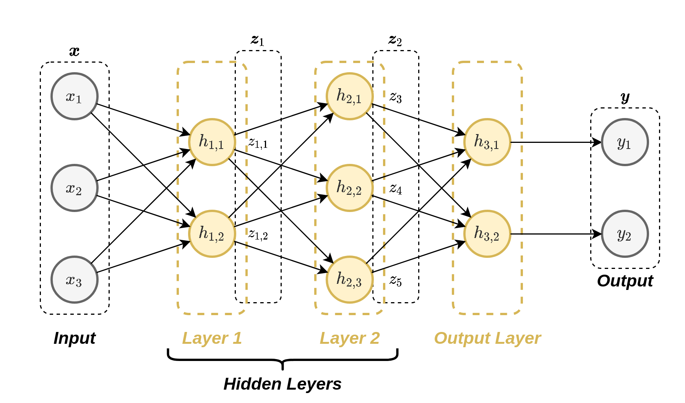

# דף נוסחאות

## נוטציות

### אלגברה לינארית

- $x$ - אותיות סטנדרטיות (italic lower case) לועזיות או יווניות - סקלרים.

- $\boldsymbol{x}$ - אותיות מודגשות - וקטורי **עמודה**
- $\boldsymbol{x}^\top$ - וקטורי **שורה**
- $x_i$ - האיבר ה$i$ בוקטור $\boldsymbol{x}$.
- (בכתב יד נשתמש בחץ (במקום באותיות מדגשות) בכדי לסמן וקטורים: $\vec{x}$).

- $\langle\boldsymbol{x},\boldsymbol{y}\rangle(=\boldsymbol{x}^\top\boldsymbol{y}=\sum_i x_iy_i)$ - המכפלה הפנימית הסטנדרטית בין $\boldsymbol{x}$ ל $\boldsymbol{y}$.
- $\|\boldsymbol{x}\|_2(=\sqrt{\langle\boldsymbol{x},\boldsymbol{x}\rangle})$- הנורמה הסטנדרטית (נורמת $l2$) של הוקטור $\boldsymbol{x}$.
- $\|\boldsymbol{x}\|_l(=\sqrt[l]{\sum_i x_i^l})$ - נורמת $l$ של $\boldsymbol{x}$

- $\boldsymbol{A}$ - אותיות לועזיות גדולות מודגשות (bold capittal) - מטריצה
- $\boldsymbol{A}^\top$ - המטריצה Transposed $\boldsymbol{A}$ (המטריצה המשוחלפת).
- $A_{i,j}$ - האיבר ה$j$ שורה ה$i$ של $\boldsymbol{A}$.
- $A_{i,:}$ - השורה ה$i$ של $\boldsymbol{A}$.
- $A_{:,i}$ - העמודה ה$i$ של $\boldsymbol{A}$.

### משתנים אקראיים

- $\text{x}$ - אותיות לא מוטות לועזיות או יווניות - משתנים אקראיים.
- $\mathbf{x}$ - אותיות לא מוטות מודגשות לועזיות או יווניות - וקטורים אקראיים.

### Sets (קבוצות)

נסמן קבוצה של איברים באופן הבא:

- $\{\boldsymbol{x}^{(1)},\boldsymbol{x}^{(2)},\ldots,\boldsymbol{x}^{(n)}\}$ - סדרה של $n$ וקטורים.

## נגזרות

### נגזרות וקטוריות שימושיות

$$
\frac{\partial}{\partial\boldsymbol{x}} \boldsymbol{a}^{\top}\boldsymbol{x}=\boldsymbol{a}
$$

$$
\frac{\partial}{\partial\boldsymbol{x}} \boldsymbol{A}\boldsymbol{x}=\boldsymbol{A}
$$

$$
\frac{\partial}{\partial\boldsymbol{x}} \boldsymbol{x}^{\top}\boldsymbol{A}\boldsymbol{x}=(\boldsymbol{A}+\boldsymbol{A}^{\top})\boldsymbol{x}
$$

$$
\frac{\partial}{\partial\boldsymbol{x}} \lVert\boldsymbol{A}\boldsymbol{x}+b\rVert_2^2=2\boldsymbol{A}^{\top}(\boldsymbol{A}\boldsymbol{x}+b)
$$

### נגזרת מטריצית שימושית

$$
\frac{\partial}{\partial\boldsymbol{A}} \boldsymbol{x}^{\top}\boldsymbol{A}\boldsymbol{x}=\boldsymbol{x}\boldsymbol{x}^{\top}
$$

## בעיית אופטימיזציה

בעיות מהצורה:

$$
\begin{aligned}
\boldsymbol{\theta}^*=&\underset{\boldsymbol{\theta}}{\arg\min}\quad f(\boldsymbol{\theta}) \\
&\begin{aligned}
\text{subject to}\quad
& g_i(\boldsymbol{\theta})\leq 0,\qquad i=1,\ldots,m \\
& h_j(\boldsymbol{\theta})=0,\qquad j=1,\ldots,p
\end{aligned}
\end{aligned}
$$

כאשר $g_i(\boldsymbol{\theta})\geq0$ נקראים אילוצי אי-שיויון.

ו $h_i(\boldsymbol{\theta})=0$ נקראים אילוצי שיויון.

הפונקציה $f(\boldsymbol{\theta})$ נקראת ה **objective**.

כמות האילוצים יכולה להשתנות ובמקרים רבים לא יופיעו אילוצים כלל.

## בעיות חיזוי

בבעיות חיזוי ננסה למצוא חזאי לערכו של משתנה/וקטור אקראי $\text{y}$ על סמך משתנה אקראי/וקטור $\mathbf{x}$:

$$
\hat{y}=h(\boldsymbol{x})
$$

### הערכת ביצועים

אנו נרצה לבחור את החזאי אשר ימעזר את **פונקציית המחיר (cost)** $C(h)$ אשר נותנת ציון לכל חזאי (לרוב הציון מוגדר כאשר ציון נמוך יותר הוא טוב יותר):.

$$
h^* = \underset{h}{\arg\min} C(h)
$$

מקרה פרטי של פונקציית מחיר הינה המקרה של **פונקציית סיכון (risk)**. פונקציית סיכון היא פונקציה מהצורה של:

$$
R(h)=\mathbb{E}\left[l(h(\mathbf{x}),\text{y})\right]
$$

הפונקציה $l$ מוכנה **פונקציית ההפסד (loss)**.

### פונקציות הפסד (פונקציות סיכון) נפוצות

| Common For | Loss Name | Risk Name | Loss Function | Optimal Predictor |
|------------|-----------|-----------|---------------|-------------------|
| Classification | Zero-One Loss | Misclassification Rate | $l\left(y_1,y_2\right)=I\left\lbrace  y_1\neq y_2\right\rbrace$ | $h^*\left(x\right)=\underset{y}{\arg\max}\ p_{\text{y}\mid\mathbf{x}}\left(y\mid x\right)$ |
| Regression | $L_1$ | Mean Absolute Error| $l\left(y_1,y_2\right)=\left\vert y_1-y_2\right\vert$ | Median: $h^*\left(x\right)=\hat{y}$ $s.t.\ F_{\text{y}\mid\mathbf{x}}\left(\hat{y}\mid x\right)=0.5$ |
| Regression | $L_2$ | Mean Squared Error (MSE) |$l\left(y_1,y_2\right)=\left(y_1-y_2\right)^2$ | $h^*\left(x\right)=\mathbf{E}\left[\text{y}\mid\mathbf{x}\right]$ |

## Supervised learning

בעיות חיזוי בהם הפילוג של המשתנים לא ידוע אך יש בידינו מדגם: $\mathcal{D}=\{x^{(i)}, y^{(i)}\}_{i=1}^N$.

### סוגי supervised learning

- **בעיות סיווג (classification)**: $\text{y}$ דיסקרטי וסופי.
- **בעיות רגרסיה (regression)**: $\text{y}$ רציף.

### גישות לפתרון בעיות supervised learning

ניתן להבחין בין 3 גישות לפתרון בעיות supervised learning:

- **גישה דיסקרימינטיבית**: $\mathcal{D}$ -> $h(\boldsymbol{x})$.
- **גישה גנרטיבית**: $\mathcal{D}$ -> $p_{\mathbf{x},\text{y}}(\boldsymbol{x},y)$ -> $p_{\text{y}|\mathbf{x}}(y|\boldsymbol{x})$ -> $h(\boldsymbol{x})$.
- **גישה דיסקרימינטיבית הסתברותית**: $\mathcal{D}$ -> $p_{\text{y}|\mathbf{x}}(y|\boldsymbol{x})$ -> $h(\boldsymbol{x})$.

## גישה דיסקרימינטיביות

### Empirical Risk Minimization

שיטה אשר משתמשת במודל פרמטרי לפונקציית החיזוי, בה נחפש את הפרמטרים של המודל אשר ממזערים את הסיכון האמפירי (הסיכון שמשוערך על המדגם):

$$
h^* = \underset{h}{\arg\min} \frac{1}{N}\sum_{i=0}^Nl(h(\boldsymbol{x}^{(i)};\boldsymbol{\theta}),y^{(i)})
$$

כאשר המודל הפרמטרי יכול להיות כל מודל, לדוגמא, מודל לינארי או רשת נוירונים.

#### Linear Least Squares (LLS)

LLS הוא מקרה פרטי של ERM שבו המודל הפרמטרי הוא לינארי ופונקציית הסיכון היא MSE:

$$
h(\boldsymbol{x};\boldsymbol{\theta})=\boldsymbol{x}^{\top}\boldsymbol{\theta}
$$

$$
\boldsymbol{\theta}^*=\underset{\boldsymbol{\theta}}{\arg\min}\ \frac{1}{N}\sum_i (\boldsymbol{\theta}^{\top}\boldsymbol{x}^{(i)}-y^{(i)})^2
$$

במקרה זה ישנו פתרון סגור אשר נתון על ידי:

$$
\boldsymbol{\theta}=(\boldsymbol{X}^{\top}\boldsymbol{X})^{-1}\boldsymbol{X}^{\top}\boldsymbol{y}
$$

כאשר $\boldsymbol{X}$ היא מטריצת המדידות אשר מוגדרת:

$$
\boldsymbol{X}=(\boldsymbol{x}^{(1)},\boldsymbol{x}^{(2)},\dots,\boldsymbol{x}^{(N)})^{\top}
$$

ו $\boldsymbol{y}$ היא מטריצת התויות:

$$
\boldsymbol{y}=(y^{(1)},y^{(2)},\dots,y^{(N)})^{\top}
$$

#### Ridge Regression

בעיית LLS אשר מוסיפים לה איבר רגולריזציית $L_2$:

$$
\boldsymbol{\theta}^*=\underset{\boldsymbol{\theta}}{\arg\min}\ \frac{1}{N}\sum_i (\boldsymbol{\theta}^{\top}\boldsymbol{x}^{(i)}-y^{(i)})^2+\lambda\lVert\boldsymbol{\theta}\rVert_2^2
$$

גם כאן יש פתרון סגור:

$$
\boldsymbol{\theta}=(\boldsymbol{X}^{\top}\boldsymbol{X}+\lambda \boldsymbol{I})^{-1}\boldsymbol{X}^{\top}\boldsymbol{y}
$$

#### Least Absolute Shrinkage and Selection Operator (LASSO)

בעיית LLS אשר מוסיפים לה איבר רגולריזציית $L_1$:

$$
\boldsymbol{\theta}^*=\underset{\boldsymbol{\theta}}{\arg\min}\ \frac{1}{N}\sum_i (\boldsymbol{\theta}^{\top}\boldsymbol{x}^{(i)}-y^{(i)})^2+\lambda\sum_j\lvert\theta_j\rvert
$$

אין פתרון סגור אך ניתן לפתרון באופן יעיל על ידי שיטות איטרטיביות כגון gradient descent.

### K-NN (K-Nearest Neighbours)

K-NN הינו אלגוריתם דיסקרימינטיבי לפתרון בעיות סיווג. באלגוריתם זה החיזויים נעשים ישירות על פי המדגם באופן הבא:

בהינתן $\boldsymbol{x}$ מסויים:

1. נבחר את $K$ הדגימות בעלות ה $\boldsymbol{x}^{(i)}$ הקרובים ביותר ל $\boldsymbol{x}$. (לרוב נשתמש במרחק אוקלידי, אך ניתן גם לבחור פונקציות מחיר אחרות).
2. תוצאת החיזוי תהיה התווית השכיחה ביותר (majorety vote) מבין $K$ התוויות של הדגימות שנבחרו בשלב 1.

במקרה של שיוון:

- במקרה של שיוויון בשלב 2, נשווה גם את המרחק הממוצע בין ה $\boldsymbol{x}$-ים השייכים לכל תווית. אנו נבחר בתווית בעלת המרחק הממוצע הקצר ביותר.
- במקרה של שיווון גם בין המרחקים הממוצעים, נבחר אקראית.

#### K-NN לבעיות רגרסיה

ניתן להשתמש באלגוריתם זה גם לפתרון בעיות רגרסיה אם כי פתרון זה יהיה לרוב פחות יעיל. בבעיות רגרסיה ניתן למצע על התוויות במקום לבחור את תווית השכיחה.

### Decision Trees

עץ החלטה אשר ממפה כל $\boldsymbol{x}$ לעלה מסויים אשר מכיל חיזוי אשר נקבע מראש.

שיטה לבניית העץ הינה באופן חמדני אשר בכל שלב מוסיף את הפיצול הטוב ביותר תחת קריטריון מסויים.

נמספר את העלים של עץ נתון על ידי $j=1,2,\dots$.  בעבור עלה מסווים $j$ בעץ נגדיר:

- מספר התוויות אשר משוייכות לעלה מסויים בעץ: $N_j$.
- הפילוג האמפירי של התוויות בעלה מסויים:

    $$
    \hat{p}_{j,y}=\frac{1}{N_j}\sum_{i\in\mathcal{I}_j} I\{y_i=y\}
    $$

שני קריטריונים נפוצים הינם:

- אינדקס Gini:

    $$
    Q_j=\sum_{y\in\{1,\dots,C\}}\hat{p}_{j,y}(1-\hat{p}_{j,y})
    $$

- אנטרופיה:

    $$
    Q_j(=H_j)=\sum_{y\in\{1,\dots,C\}}-\hat{p}_{j,y}\log_2 \hat{p}_{j,y}
    $$

בכל צעד נרצה לבחור את הפיצול אשר ממזער את הגודל:

$$
Q_{\text{total}}=\sum_j \frac{N_j}{N}Q_j
$$

### SVM

#### Hard-SVM

##### בעיה פרימאלית

$$
\begin{aligned}
\boldsymbol{w}^*,b^*=
\underset{\boldsymbol{w},b}{\arg\min}\quad&\frac{1}{2}\left\lVert\boldsymbol{w}\right\rVert^2 \\
\text{s.t.}\quad&y^{(i)}\left(\boldsymbol{w}^{\top}\boldsymbol{x}^{(i)}+b\right)\geq1\quad\forall i
\end{aligned}
$$

##### בעיה דואלית

$$
\begin{aligned}
\left\lbrace\alpha_i\right\rbrace^*=\\
\underset{\left\lbrace\alpha_i\right\rbrace}{\arg\max}\quad&\sum_i\alpha_i-\frac{1}{2}\sum_{i,j}y^{(i)}y^{(j)}\alpha_i\alpha_j\boldsymbol{x}^{(i)\top}\boldsymbol{x}^{(j)} \\
\text{s.t.}\quad
    &\alpha_i\geq0\quad\forall i\\
    &\sum_i\alpha_iy^{(i)}=0
\end{aligned}
$$

מתוך הפרמטרים $\alpha_i$ ניתן לשחזר את $\boldsymbol{w}$ באופן הבא:

$$
\boldsymbol{w}=\sum_i\alpha_iy^{(i)}\boldsymbol{x}^{(i)}
$$

את $b$ מוצאים על ידי בחירת upport vector והצבה לאילוץ של הבעיה הפרימאלית.

##### תכונות

| .                                      | .                                                      | .               |
| -------------------------------------- | ------------------------------------------------------ | --------------- |
| נקודות רחוקות מה margin                   | $y^{(i)}\left(\boldsymbol{w}^{\top}x^{(i)}+b\right)>1$ | $\alpha_i=0$    |
| נקודות על ה margin (support vectors) | $y^{(i)}\left(\boldsymbol{w}^{\top}x^{(i)}+b\right)=1$ | $\alpha_i\geq0$ |

#### Soft SVM

##### בעיה פרימאלית

$$
\begin{aligned}
\boldsymbol{w}^*,b^*,\{\xi_i\}^*=\\
\underset{\boldsymbol{w},b,\{\xi_i\}}{\arg\min}\quad&\frac{1}{2}\left\lVert\boldsymbol{w}\right\rVert^2+C\sum_{i=1}^N\xi_i \\
\text{s.t.}\quad
    &y^{(i)}\left(\boldsymbol{w}^{\top}\boldsymbol{x}^{(i)}+b\right)\geq1-\xi_i\quad\forall i\\
    &\xi_i\geq0\quad\forall i
\end{aligned}
$$

##### בעיה דואלית

$$
\begin{aligned}
\left\lbrace\alpha_i\right\rbrace^*=\\
\underset{\left\lbrace\alpha_i\right\rbrace}{\arg\max}\quad&\sum_i\alpha_i-\frac{1}{2}\sum_{i,j}y^{(i)}y^{(j)}\alpha_i\alpha_j\boldsymbol{x}^{(i)\top}\boldsymbol{x}^{(j)} \\
\text{s.t.}\quad
    &0\leq\alpha_i\leq C\quad\forall i\\
    &\sum_i\alpha_iy^{(i)}=0
\end{aligned}
$$

##### תכונות

| .                                         | .                                                            | .                     |
| ----------------------------------------- | ------------------------------------------------------------ | --------------------- |
| נקודות שמסווגות נכון ורחוקות מה margin            | $y^{(i)}\left(\boldsymbol{w}^{\top}x^{(i)}+b\right)>1$       | $\alpha_i=0$          |
| נקודות על ה margin (support vectors)    | $y^{(i)}\left(\boldsymbol{w}^{\top}x^{(i)}+b\right)=1$       | $0\leq\alpha_i\leq C$ |
| נקודות שחורגות מה margin (גם support vectors) | $y^{(i)}\left(\boldsymbol{w}^{\top}x^{(i)}+b\right)=1-\xi_i$ | $\alpha_i=C$          |

## גישה גנרטיבית

### שיטות לא פרמטריות

#### היסטוגרמה

1. מחלקים את תחום הערכים ש $\mathbf{x}$ יכול לקבל ל bins (תאים) לא חופפים אשר מכסים את כל התחום.
2. לכל תא משערכים את ההסתברות של המאורע ש $\mathbf{x}$ נמצא בתוך התא.
3. הערך של פונקציית הצפיפות בכל תא תהיה ההסתברות המשוערכת להיות בתא חלקי גודל התא.

נרשום זאת בעבור המקרה של משתנה אקראי סקלרי. נסמן ב $B$ את מספר התאים וב $l_b$ ו $r_b$ את הגבול השמאלי והימני בהתאמה של התא ה $b$. ההסטוגרמה תהיה נתונה על ידי:

$$
\begin{aligned}
\hat{p}_{\text{x},\mathcal{D}}(x)
&=\begin{cases}
  \frac{1}{\text{size of bin }1}\hat{p}_{\{\text{x in bin }1\},\mathcal{D}}&\text{x in bin }1\\
  \vdots\\
  \frac{1}{\text{size of bin }B}\hat{p}_{\{\text{x in bin }B\},\mathcal{D}}&\text{x in bin }B
\end{cases}\\
&=\begin{cases}
  \frac{1}{N(r_1-l_1)}\sum_{i=1}^N I\{l_1\leq x^{(i)}<r_1\}&l_1\leq x<r_1\\
  \vdots\\
  \frac{1}{N(r_B-l_B)}\sum_{i=1}^N I\{l_B\leq x^{(i)}<r_B\}&l_B\leq x<r_B\\
\end{cases}
\end{aligned}
$$

הערות:

- בחירת התאים משפיעה באופן משמעותי על תוצאת השערוך של ה PDF.
- כלל אצבע: לחלק את טווח הערכים ל-$$\sqrt{N}$$ תאים בגודל אחיד.

#### Kernel Density Estimation (KDE)

$$
\hat{p}_{\mathbf{x},\phi,\mathcal{D}}(\boldsymbol{x})=\frac{1}{N}\sum_{i=1}^N \phi(\boldsymbol{x}-\boldsymbol{x}^{(i)})
$$

כאשר  $\phi(\boldsymbol{x})$ מכונה **פונקציית גרעין** (**kernel**) או **Parzan window**. פונקציות גרעין נפוצות הינן:

- חלון מרובע:

    $$
    \phi_h(\boldsymbol{x})=\frac{1}{h^D}I\{|x_j|\leq \tfrac{h}{2}\quad\forall j\}
    $$

- גאוסיאן:

    $$
    \phi_{\sigma}\left(x\right)=\frac{1}{\sqrt{2\pi}\sigma^D}\exp\left(-\frac{\lVert x\rVert_2^2}{2\sigma^2}\right)
    $$

כאשר $h$ או $\sigma$ הם hyper-parameters של מהמודל.

כלל אצבע לבחירת רוחב הגרעין במקרה הגאוסי הסקלרי הינו $\sigma=\left(\frac{4\cdot\text{std}(\text{x})^5}{3N}\right)^\frac{1}{5}\approx1.06\ \text{std}(\text{x})N^{-\tfrac{1}{5}}$, כאשר $\text{std}(\text{x})$ הינה הסטיית תקן של $\text{x}$ (אשר לרוב תהיה משוערכת גם היא מתוך המדגם)

### שיטות פרמטריות

בשיטה הפרמטרית נציע מודל פרמטרי לפילוג **המושתף** של $\mathbf{x}$ ו $\text{y}$. שתי שיטות נפוצות למציאת הפרמטרים הינם:

##### MLE

$$
\hat{\boldsymbol{\theta}}_{\text{MLE}}
=\underset{\boldsymbol{\theta}}{\arg\max}\ \mathcal{L}(\boldsymbol{\theta};\mathcal{D})
=\underset{\boldsymbol{\theta}}{\arg\min}\ -\sum_i \log\left(p_{\mathbf{x},\text{y}}(\boldsymbol{x}^{(i)},y^{(i)};\boldsymbol{\theta})\right)
$$

לרוב נוח לנסות לבנו את המודל כמכפלה של שני פונקציות.

$$
p_{\mathbf{x},\text{y}}(\boldsymbol{x},y)
=p_{\mathbf{x}|\text{y}}(\boldsymbol{x}|y)p_{\text{y}}(y)
$$

##### MAP

$$
\hat{\boldsymbol{\theta}}_{\text{MAP}}
=\underset{\boldsymbol{\theta}}{\arg\max}\ p_{\boldsymbol{\theta}|\mathcal{D}}(\boldsymbol{\theta}|\mathcal{D})
=\underset{\boldsymbol{\theta}}{\arg\min}\ -\log\left(p_{\boldsymbol{\theta}}(\boldsymbol{\theta})\right)-\sum_i \log\left(p_{\mathbf{x},\text{y}|\boldsymbol{\theta}}(\boldsymbol{x}^{(i)},y^{(i)}|\boldsymbol{\theta})\right)
$$

#### Linear Discriminant Analysis (LDA)

LDA משתמש במודל הבא + MLE:

$$
p_{\mathbf{x}|\text{y}}(\boldsymbol{x}|y)=\frac{1}{\sqrt{(2\pi)^d|\Sigma|}}e^{-\frac{1}{2}\left(\boldsymbol{x}-\boldsymbol{\mu}_y\right)^T\Sigma^{-1}\left(\boldsymbol{x}-\boldsymbol{\mu}_y\right)}
$$

לפרמטרים של המודל יש פתרון סגור. נשתמש בסימונים:

- $\mathcal{I}_c=\{i:\ y^{(i)}=c\}$ - זאת אומרת, אוסף האינדקסים של הדגמים במדגם שמקיימים $y^{(i)}=c$.
- $|\mathcal{I}_c|$ - מספר האינדקסים ב $\mathcal{I}_c$
- $\mu_c$ - וקטורי התוחלת של הפילוג הנורמאלי $p_{\mathbf{x}|\text{y}}(\boldsymbol{x}|c)$.

$$
\boldsymbol{\mu}_c = \frac{1}{|\mathcal{I}_c|}\sum_{i\in \mathcal{I}_c}\boldsymbol{x}^{(i)}
$$

$$
\Sigma = \frac{1}{N}\sum_{i}\left(\boldsymbol{x}^{(i)}-\boldsymbol{\mu}_{y^{(i)}}\right)\left(\boldsymbol{x}^{(i)}-\boldsymbol{\mu}_{y^{(i)}}\right)^T
$$

את הפילוג של $p_{\text{y}}$ לומדים מתוך הפילוג האמפירי של $\text{y}$ במדגם.

במקרה של misclassification rate בינארי, המשערך נתון על ידי:

$$
h\left(x\right)=
\begin{cases}
  1\qquad \boldsymbol{a}^T \boldsymbol{x} + b > 0 \\
  0\qquad \text{otherwise}\\
\end{cases}
$$

כאשר:

$$
\boldsymbol{a}=\Sigma^{-1}\left(\boldsymbol{\mu}_1-\boldsymbol{\mu}_0\right)
$$

$$
b=\tfrac{1}{2}\left(\boldsymbol{\mu}_0^T\Sigma^{-1}\boldsymbol{\mu}_0 - \boldsymbol{\mu}_1^T\Sigma^{-1}\boldsymbol{\mu}_1\right) + \log\left(\frac{p_\text{y}\left(1\right)}{p_\text{y}\left(0\right)}\right)
$$

#### Quadric Discriminant Analysis (QDA)

QDA דומה ל LDA רק שכאן ישנה מטריצה $\Sigma_c$ לכל מחלקה:

$$
p_{\mathbf{x}|\text{y}}(\boldsymbol{x}|y)=\frac{1}{\sqrt{(2\pi)^d|\Sigma_y|}}e^{-\frac{1}{2}\left(\boldsymbol{x}-\boldsymbol{\mu}_y\right)^T\Sigma_y^{-1}\left(\boldsymbol{x}-\boldsymbol{\mu}_y\right)}
$$

הפרמטר $\Sigma_c$ נתון על ידי:

$$
\Sigma_c = \frac{1}{|\mathcal{I}_c|}\sum_{i\in \mathcal{I}_c}\left(\boldsymbol{x}^{(i)}-\boldsymbol{\mu}_{y^{(i)}}\right)\left(\boldsymbol{x}^{(i)}-\boldsymbol{\mu}_{y^{(i)}}\right)^T
$$

במקרה של misclassification rate בינארי, המשערך נתון על ידי:

$$
h\left(x\right)
=\begin{cases}
  1\qquad \boldsymbol{x}^T C \boldsymbol{x} + \boldsymbol{a}^T \boldsymbol{x} + b > 0 \\
  0\qquad \text{otherwise}\\
\end{cases}
$$

כאשר:

$$
C=\frac{1}{2}(\Sigma^{-1}_0-\Sigma^{-1}_1)
$$

$$
\boldsymbol{a}=\Sigma^{-1}_1\boldsymbol{\mu}_1-\Sigma^{-1}_0\boldsymbol{\mu}_0
$$

$$
b=\tfrac{1}{2}\left(\boldsymbol{\mu}_0^T\Sigma_0^{-1}\boldsymbol{\mu}_0 - \boldsymbol{\mu}_1^T\Sigma_1^{-1}\boldsymbol{\mu}_1\right) + \log\left(\frac{\sqrt{|\Sigma_0|}p_\text{y}(1)}{\sqrt{|\Sigma_1|}p_\text{y}(0)}\right)
$$

## גישה דיסקרימינטיבית הסתברותית

#### Logistic Regression

$$
p_{\text{y}|\mathbf{x}}(y|\boldsymbol{x})=\text{softmax}(F(\boldsymbol{x};\boldsymbol{\theta}))_y=\frac{e^{f_y(\boldsymbol{x};\boldsymbol{\theta}_y)}}{\sum_c e^{f_c(\boldsymbol{x};\boldsymbol{\theta}_c)}}
$$

כאשר $F$ היא פונקציה שמאגדת לוקטור $C$ פונקציות פרמטריות $F(\boldsymbol{x};\boldsymbol{\theta})=(f_1(\boldsymbol{x};\boldsymbol{\theta}_1),f_2(\boldsymbol{x};\boldsymbol{\theta}_2),\dots,f_C(\boldsymbol{x};\boldsymbol{\theta}_C))^{\top}$

את הפרמטרים מוצאים בעזרת MLE ו gradient descent.

##### המקרה הבינארי

במקרה הבנארי ניתן להשתמש במודל:

$$
\begin{aligned}
p_{\text{y}|\mathbf{x}}(1|\boldsymbol{x})&=\sigma(f(\boldsymbol{x};\boldsymbol{\theta}))\\
p_{\text{y}|\mathbf{x}}(0|\boldsymbol{x})&=1-\sigma(f(\boldsymbol{x};\boldsymbol{\theta}))
\end{aligned}
$$

כאשר $\sigma(x)=\frac{1}{1+e^{-x}}$ (סיגמואיד).

##### תכונת של סיגמואיד ו softmax

- $\sigma(-z)=1-\sigma(z)$.
- $\frac{\partial}{\partial z}\log(\sigma(z))=1-\sigma(z)$
- $\frac{\partial}{\partial z_j} \log(\text{softmax}(\boldsymbol{z}))_i=\underbrace{\delta_{i,j}}_{=I\{i=j\}}-\text{softmax}(\boldsymbol{z})_j$

## Gradient Descent

בעבור בעיית המינמיזציה:

$$
\underset{\boldsymbol{\theta}}{\arg\min}\quad g(\boldsymbol{\theta})
$$

- מאתחלים את $\boldsymbol{\theta}^{(0)}$ בנקודה אקראית כל שהיא.
- חוזרים על צעד העדכון הבא עד שמתקיים תנאי עצירה כל שהוא:

    $$
    \boldsymbol{\theta}^{(t+1)}=\boldsymbol{\theta}^{(t)}-\eta \nabla_{\boldsymbol{\theta}}g(\boldsymbol{\theta}^{(t)})
    $$

## Bagging

מקטין את ה variance לרוב בלי לפגוע הרבה ב bias.

1. נייצר $p$ מדגמים מתוך המדגם המקורי על ידי דגימה אקראית של דגימות ממנו.
2. בעבור כל מדגם חדש נבנה חזאי.
3. החזאי הכולל יהיה קומבינציה/בחירת הרוב של כל החזאים שבנינו:

    - **בעבור רגרסיה**: : $h(\boldsymbol{x})=\frac{1}{p}\sum_{i=1}^p \tilde{h}_i(\boldsymbol{x})$
    - **בעבור סיווג**: : $h(\boldsymbol{x})=\text{majority}(\{\tilde{h}_1(\boldsymbol{x}),\tilde{h}_2(\boldsymbol{x}),\dots,\tilde{h}_p(\boldsymbol{x})\})$

## AdaBoost

בעבור סיווג בינארי מקטין את ה bias, לרוב ללא פגיעה גדולה ב variance.

### אלגוריתם

ב $t=0$ נאתחל וקטור משקלים $w_i^{(t)}=\frac{1}{N}$.
בכל צעד $t$ נבצע את הפעולות הבאות:

1. נבחר את המסווג אשר ממזער את ה misclassification rate הממושקל:

    $$
    \tilde{h}_t=\underset{\tilde{h}}{\arg\min}\ \sum_{i=1}^N w_i^{(t-1)}I\{y^{(i)}\neq \tilde{h}(\boldsymbol{x}^{(i)})\}
    $$

2. נחשב את המקדם $\alpha_{t+1}$ של המסווג:

    $$
    \begin{aligned}
    \varepsilon_t&=\sum_{i=1}^N w_i^{(t-1)}I\{y^{(i)}\neq \tilde{h}_t(\boldsymbol{x}^{(i)})\}\\
    \alpha_t&=\frac{1}{2}\ln\left(\frac{1-\varepsilon_t}{\varepsilon_t}\right)
    \end{aligned}
    $$

3. נעדכן את וקטור המשקלים:

    $$
    \begin{aligned}
    \tilde{w}_i^{(t)}&=w_i^{(t-1)}\exp\left(-\alpha_t y^{(i)}\tilde{h}_t(\boldsymbol{x}^{(i)})\right)\\
    w_i^{(t)}&=\frac{\tilde{w}_i^{(t)}}{\sum_{j=1}^N \tilde{w}_j^{(t)}}
    \end{aligned}
    $$

### המסווג הסופי

הסיווג הסופי נעשה על ידי קומבינציה לינארית של כל מסווגים והמשקל שלהם.

$$
h(\boldsymbol{x})=\text{sign}\left(\sum_{t=1}^T\alpha_t \tilde{h}_t(\boldsymbol{x})\right)
$$

### חסם

ניתן להראות שאם מתקיים שבכל צעד שגיאת ה misclassification error הממושקלת קטנה מ $\tfrac{1}{2}-\gamma_t$ אז ניתן לחסום את שגיאת ה misclassification rate על המדגם באופן הבא:

$$
\frac{1}{N}\sum_i I\{h(\boldsymbol{x}^{(i)})\neq y^{(i)}\}
\leq
\frac{1}{N}\sum_{i=1}^N\exp\left(-\sum_{t=1}^T\alpha_t y^{(i)}\tilde{h}_t(\boldsymbol{x}^{(i)})\right)
\leq
\exp\left(-2\sum_{t=1}^T\gamma_t^2\right)
$$

## רשתות נוירונים

שיטה לבניית מודלים פרמטריים בעלי יכולת ייצוג גבוה בהשראת רשתות נוירונים ביוליגיות. רשתות נוירונים מתקבלות על ידי שירשור של מספר נוירונים כאשר כל נוירון מבצע פעולה מטמתית פשוטה.

### נוריון בודד

:כל נוירון ברשת מבצע את הפעולה הבאה

כאשר $\boldsymbol{w}$ ו $b$ הם הפרמטרים של הנוירון ו $\varphi(\cdot)$, היא פונקציה שאותה יש לקבוע מראש והיא מכונה **פונקציית ההפעלה (activation function)**. בחירות נפוצות של פונקציית ההפעלה כוללות את

- הפונקציה הלוגיסטית (סיגמואיד): $\varphi(x)=\sigma(x)=\frac{1}{1+e^{-x}}$
- טנגנס היפרבולי: $\varphi(x)=\tanh\left(x/2\right)$
- פונקציית ה ReLU (Rectified Linear Unit): אשר מוגדרת $\varphi(x)=\max(x,0)$ (זוהי פונקציית ההפעלה נפוצה ביותר כיום).

### רשתות נוירונים

מושגים:

- **ארכיטקטורה**: המבנה של הרשת (האופן בו הנוירונים מחוברים)
- **יחידות נסתרות** (**hidden units**): הנוירונים אשר אינם מחוברים למוצא הרשת (אינם נמצאים בסוף הרשת).
- **רשת עמוקה** (**deep network**): רשת אשר מכילה מסלולים מהכניסה למוצא אשר עוברים דרך יותר מיחידה נסתרת אחת.

### Multi-Layer Perceptron (MLP)

רשת שבה:
- הנוירונים מסודרים בשתייים או יותר שכבות (layers).
- השכבות הם **Fully Connected (FC) layers** (כל נוירון מוזן מ**כל** הנוריונים שבשכבה שלפניו).

### Convolutional Neural Network (CNN)

רשתות אשר מכילות שכבות קונבולוציה. שכבת קונבולוציה נבדלת משכבת FC בשני מובנים:

1. כל נוירון בשכבה זו מוזן רק מכמות מוגבלת של ערכים הנמצאים בסביבתו הקרובה.
2. כל הנוירונים בשכבה מסויימת זהים, זאת אומרת שהם משתמשים באותם הפרמטרים (תכונה המכונה **weight sharing**).

וקטור המשקלים אשר מכפיל את הערכים בכניסה לנוירונים בשכבת הקונבולוציה נראה גרעין הקונבולוציה.

#### שכבות קונבולוציה עם מספר ערצים

שכבת קונבולוציה תכיל לרוב מספר ערוצים בכניסה ומספר ערוצים ביציאה. במקרה זה יהיה נוירון שונה (עם גרעין קונבולוציה שונה) בעבור כל ערוץ ביציאה וכל אחד מהנוירונים יפעל על כל ערוצי הכניסה

מספר הפרמטרים בשכבת כזאת היינו:  $\underbrace{C_\text{in}\times C_\text{out}\times K}_\text{the weights}+\underbrace{C_\text{out}}_\text{the bias}$.

כאשר:

- $C_\text{in}$ - מספר ערוצי קלט.
- $C_\text{out}$ - מספר ערוצי פלט.
- $K$ - גודל הגרעין.

#### תכונות נוספות

<table style="width:100%; table-layout:fixed;">
  <tr>
    <td>
Padding
</td>
    <td>
Stride
</td>
    <td>
Dilation
</td>
  </tr>
  <tr>
    <td>

</td>
    <td>

</td>
    <td>

</td>
  </tr>
</table>

### שכבות Pooling

שכבות אשר משמשות להקטנת המספר האיברים שעליהם הרשת עובדת. שתי שכבות pooling נפוצות הינן:

1. **Average pooling**: אשר פועל כל פעם על חלון מסויים ומחזיר את הממוצע שלו.
1. **Max pooling**: אשר פועל כל פעם על חלון מסויים ומחזיר את הערך המקסימאלי בחלון הנתון.

שכבות pooling מוגדרות על ידי שני פרמטרים, גודל החלון וה stride (גודל הצעד שבו הם זזות). (לרוב ה-stride יהיה זהה לגודל החלון).

בשכבה זאת אין פרמטרים נלמדים.

## Usupervised Learning

### PCA

PCA הוא אלגוריתם לינארי להורדת המימד של הוקטור $\boldsymbol{x}$ לוקטור קצר יותר באורך $K$, אשר ממזער את שיגאת השיחזור הריבועית הממוצעת:

- Encoding (קידוד): $\boldsymbol{z}=\boldsymbol{T}^{\top}(\boldsymbol{x}-\bar{\boldsymbol{x}})$
- Decoding (שיחזור): $\tilde{\boldsymbol{x}}=\boldsymbol{T}\boldsymbol{z}+\bar{\boldsymbol{x}}$

כאשר:

- $\bar{\boldsymbol{x}}=\frac{1}{N}\sum_{i=1}^N \boldsymbol{x}^{(i)}$.
- $\boldsymbol{X}$ היא מטריצת המדידות אשר מוגדרת:  $\boldsymbol{X}=(\boldsymbol{x}^{(1)}-\bar{\boldsymbol{x}},\boldsymbol{x}^{(2)}-\bar{\boldsymbol{x}},\dots,\boldsymbol{x}^{(N)}-\bar{\boldsymbol{x}})^{\top}$

- $\boldsymbol{T}$ היא מטריצה אשר עמודותיה הן $K$ הוקטורים העצמיים של המטריצה $\boldsymbol{X}^{\top}\boldsymbol{X}$ אשר מתאימים לערכים העצמיים הגדולים ביותר.

### K-Means

אלגוריתם אשכול אשר מבצע אישכול ל $K$ קבוצות. סימונים:

- $K$ - מספר האשכולות (גודל אשר נקבע מראש).
- $\mathcal{I}_k$ - אוסף האינדקסים של האשכול ה-$k$. לדוגמא: $\mathcal{I}_5=\left\lbrace3, 6, 9, 13\right\rbrace$
- $|\mathcal{I}_k|$ - גודל האשכול ה-$k$ (מספר הפרטים בקבוצה)
- $\{\mathcal{I}_k\}_{k=1}^K$ - חלוקה מסויימת לאשכולות

K-means מנסה לפתור את בעיית האופטימיזציה הבאה:

$$
\underset{\{\mathcal{I}_j\}_{k=1}^K}{\arg\min}\frac{1}{N}\sum_{k=1}^K\frac{1}{2|\mathcal{I}_k|}\sum_{i,j\in\mathcal{I}_k}\lVert\boldsymbol{x}^{(j)}-\boldsymbol{x}^{(i)}\rVert_2^2
=\underset{\{\mathcal{I}_j\}_{k=1}^K}{\arg\min}\frac{1}{N}\sum_{k=1}^K\sum_{i\in\mathcal{I}_k}\lVert\boldsymbol{x}^{(i)}-\boldsymbol{\mu}_k\rVert_2^2
$$

כאשר:

$$
\boldsymbol{\mu}_k=\frac{1}{|\mathcal{I}_k|}\sum_{i\in\mathcal{I}_k}\boldsymbol{x}^{(i)}
$$

### האלגוריתם

האלגוריתם מאותחל בצעד $t=0$ על ידי בחירה אקראית של $K$ מרכזי מסה: $\{\mu_k\}_{k=1}^K$.

בכל צעד $t$ מבצעים את שתי הפעולות הבאות:

1. עדכון מחדש את החלוקה לאשכולות $\{\mathcal{I}_k\}_{k=1}^K$ כך שכל דגימה משוייכת למרכז המסה הקרוב עליה ביותר. כלומר אנו נשייך את כל דגימה $\boldsymbol{x}$ לפי:

    $$
    k=\underset{k\in[1,K]}{\arg\min} \lVert\boldsymbol{x}-\boldsymbol{\mu}_k\rVert_2^2
    $$

    (במקרה של שני מרכזים במרחק זהה נבחר בזה בעל האינדקס הנמוך יותר).

2. עדכון של מרכזי המסה המסה על פי:

    $$
    \boldsymbol{\mu}_k=\frac{1}{|\mathcal{I}_k|}\sum_{i\in\mathcal{I}_k}\boldsymbol{x}^{(i)}
    $$

    (אם $|\mathcal{I}_k|=0$ אז משאירים אותו ללא שינוי)

תנאי העצירה של האלגוריתם הינו כשהאשכולות מפסיקים להשתנות.
אחת הדרכים הנפוצות לאיתחול של $\{\mu_k\}_{k=1}^K$ היא לבחור $k$ נקודות מתוך המדגם.

