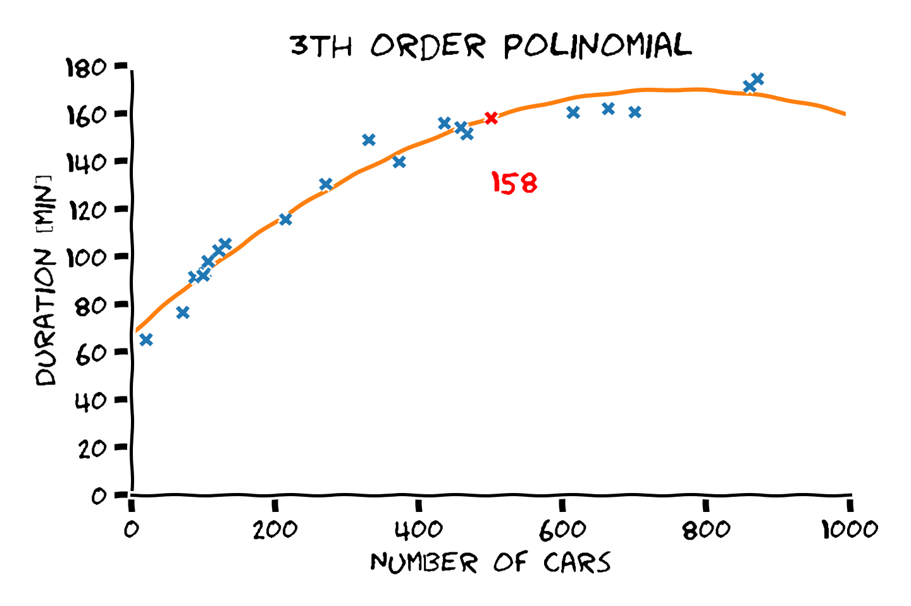
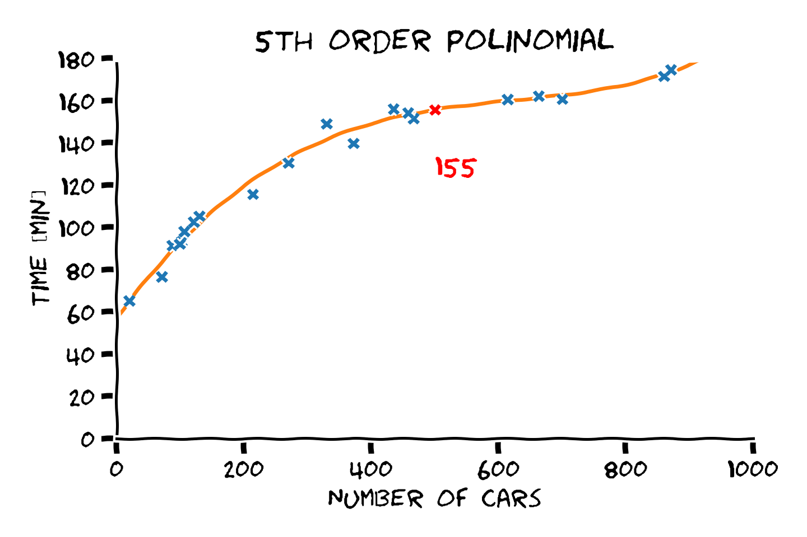

<section class="center">

# הרצאה 1 - מבוא

<a href="/assets/lecture01_slides.pdf" class="link-button" target="_blank">PDF</a>

</section><section>

## הסבר בעזרת דוגמא

 

> השם מערכות לומדות יכול מאד להטעות, שכן השיטות שבהם משתמשים כיום רחוקות מאד מהלמידה שאנו מכירים מחיי היום יום.

   

ננסה להדגים כיצד עובדים רוב השיטות בתחום בעזרת דוגמאות.

</section><section>

## תרגיל

3, 6, 12, **?**

1, 1, 2, 3, 5, 8, **?**

5, 10, 7, 12, 9, 14, **?**

</section><section>

## תרגיל

3, 6, 12, **24**

➭ $n_i=3\times2^i$

 

1, 1, 2, 3, 5, 8,

<strong class="fragment fade-out" data-fragment-index="1">?</strong>
<strong class="fragment" data-fragment-index="1">13</strong>

➭ $n_i=n_{i-1}+n_{i-2}$

5, 10, 7, 12, 9, 14,

<strong class="fragment fade-out" data-fragment-index="2">?</strong>
<strong class="fragment" data-fragment-index="2">11</strong>

➭ $n_i=\begin{cases}n_{i-1}+5&i\text{ is odd}\\n_{i-1}-3&i\text{ is even}\end{cases}$

</section><section>

## כיצד אנו פותרים תרגילים כאלה?

<ul>
<li>נחפש חוקיות (מודל).</li>
<li class="fragment">לרוב נחפש את מודל מתוך אוסף של מודלים מוכרים.</li>
<li class="fragment">יתכן יותר ממודל אחד מתאים.</li>
<li class="fragment">נעדיף מודל פשוט על פני מודל מסובך (<a href="https://en.wikipedia.org/wiki/Occam%27s_razor">התער של אוקאם</a>).</li>
<li class="fragment">מודל יכול להכיל פרמטר שיש לקבוע על פי המספרים  (למשל ה2 וה3 בדוגמא הראשונה).</li>
<li class="fragment">לרוב, ככל שהמודל "מסובך יותר" נצטרך יותר דוגמאות.</li>
</ul>

</section><section>

## בחירת המודל

- למצוא מודל שמתאים לדוגמאות זה קל.
- לבחור מבין כל המודל את המודל הנכון, זה קשה. (ולרוב בלתי אפשרי)

### נסתכל על הדוגמא הבאה

2, 4, **?**, 16

</section><section>

## מודלים אפשריים

 

</section><section>

## המודל צריך לדעת להכליל

- יש הרבה מודלים שיכולים להתאים לדוגמאות.
- המטרה היא למצוא מודל שידע להכליל למקרים שעוד לא ראינו.
- כדי לבחור את המודל המתאים עלינו להשתמש בידע הקודם שיש לנו.

בעבור המקרה של: 2, 4, **?**, 16

 

מהניסון הקודם שלנו, אנו יודעים שבעיות כאלה נפוץ להשתמש בסדרה הנדסית. לכן המודל הסביר ביותר הוא:

$$
n_i=2\times2^i
$$

</section><section>

## מערכות אקראיות

 

- בדוגמא הצגנו מערכת דטרמיניסטית (לא אקראית). זאת אומרת, שבמקום ה$i$ ישב מספר מסויים קבוע.

 

- בפועל, ברוב במערכות שאותם נרצה למדל יהיה רכיב סטוכסטי (אקראי). זאת אומרת, שיתכן שבעבור פרמטרים זהים נקבל התנהגויות שונות.

</section><section>

## מערכות אקראיות - דוגמא

חיזוי זמן נסיעה על פי העומס בכביש (מספר המכוניות על הכביש).
  
מכיוון שזמן הנסיעה תלוי בעוד הרבה גורמים אחרים חוץ מהעומס, ניתן לקבל זמנים שונים בעבור אותו עומס.
  

</section><section>

## המודל גם יטעה לפעמים

 

> כשהמערכת היא אקראית, או מאד מורכבת, לא נצפה למצוא מודל שתמיד צודק. במקום זאת נחפש מודל שטועה כמה שפחות.

  

במקרים כאלה נעזר בתורת ההסתברות על מנת לתאר את הבעיה והפתרון.

</section><section>

## אז איך עושים את זה?

הרעיון מאחורי כמעט כל השיטות במערכות לומדות הוא זהה:

1. נגדיר קריטריון מתמטי אשר מודד עד כמה מודל מסויים מצליח לבצע את המשימה
2. נבחר משפחה רחבה של מודלים בתקווה שלפחות אחד מהם יהיה מוצלח מספיק.
3. נחפש מבין כל המודלים במשפחה את המודל המוצלח ביותר.

 
(הרעיון פשוט, הביצוע קצת פחות).

  

מרבית הקרוס יעסוק בשיטות לביצוע שלושת השלבים האלו.

</section><section>

## מודלים פרמטריים

בעבור המשפחת המודלים, נעדיף לבחור אחת כזו שניתן לייצג כמודל פרמטרי (פונקציות בעלות מבנה קבוע עד כדי כמה פרמטרים)

### דוגמאות

<ul>
<li>

פונקציות לינאריות: $f_{\boldsymbol{\theta}}(x)=\theta_1 + \theta_2 x$.

</li><li class="fragment">

כל הפולינומים עד סדר 3: $f_{\boldsymbol{\theta}}(x)=\theta_1 + \theta_2 x + \theta_3 x^2 + \theta_4 x^3$.

</li><li class="fragment">

קומבינציה לינרארית של פונקציות: $f_{\boldsymbol{\theta}}(x)=\theta_1 e^x + \theta_2 \sin(x)$.

</li><li class="fragment">

משהו אחר: $f_{\boldsymbol{\theta}}(x)=\theta_1 e^{-(x-\theta_2)^2/\theta_3}$.

</li><li class="fragment">רשת נוירונים.</li>
</ul>

</section><section>

## איך נדאג שהמודל הפרמטרי שלנו יכיל את המודל האופטימאלי?

אנחנו לא!

  

במערכות מורכבות אנחנו כנראה אף פעם לא נוכל למצוא את הפתרון האופטימאלי לבעיה. אנחנו נשאף להגיע כמה שיותר קרוב עליו.

  

> כל המודלים טועים אבל חלק שימושיים

George E. P. Box

</section><section>

## בחירת המודל הפרמטרי (משפחת המודלים)

הבחירה של המודל הפרמטרי תשפיע מאד על הפתרון שנקבל

 

</section><section>

## כבר אמרנו קודם, הבעיה היא בעיית הכללה

 

- סדר פולינום גבוהה יותר -> התאמה טובה יותר לדוגמאות.
- התאמה טובה יותר לדוגמאות לא מעידה על הכללה טובה יותר.
- את המודל הפרמטרי יש לבחור על סמך ידע קודם.

מההיכרות שלנו עם הבעיה אנו מצפים שפונקציית המיפוי תהיה מונוטונית עולה וגם שלא תשתנה בפראות.

 

מבין האופציות הנ"ל, פולינום מסדר 5 הוא הפשרה הטובה ביותר בין ההתאמה לדוגמאות והידע הקודם.

</section><section>

## התאמת מודלים

הרעיון של בניית מודל מתמטי לצורך תיאור של מערכת או לתהליך כל שהוא, הוא למעשה אחד הרעיונות הבסיסיים עליו מושתתים רוב תחומי ההנדסה והמדעים.  

  

- אנו נשתמש בשם prior knowlage (או בקיצור prior) בכדי להתייחס לידע המוקדם.
- אנו נשתמש בשם data בכדי להתייחס לדוגמאות / תצפיות.

</section><section>

## Data vs. Prior

- כאשר המערכת פשוטה, ויש לנו הבנה טובה שלה נסתמך בעיקר על הידע הקודם.
- במקרים אחרים נסתמך הרבה יותר על הdata.

### לדוגמא

#### מודל המבוסס על ידע קודם

מכונית יוצאת מחיפה לתל אביב במהירות קבועה ידועה. (מודל: מיקום = זמן x מהירות).

#### מודל המצריך שימוש בdata

מהירות המכונית תלויה במשתנים כגון אופי הנהג ומצב הכביש. ניתן לנסות לבנות מודל על סמך מידע מנסיעות קודמות.

</section><section>

## Data vs. Prior

- כאשר המערכת פשוטה, ויש לנו הבנה טובה שלה נסתמך בעיקר על הידע הקודם.
- במקרים אחרים נסתמך הרבה יותר על הdata.

### אילוסטרציה

</section><section>

## איך זה מתקשר למערכות לומדות?

### הגדרה פורמלית

> התחום של מערכות לומדות עוסק באלגוריתמים אשר מנסים להשתמש במידע זמין על מנת לשפר את הביצעים של מכונה במשימה כל שהיא.

</section><section>

## בפועל ...

בפועל התחום של מערכות לומדות מתעסק בעיקר במקרים בהם אין הרבה ידע מקדים ובניית המודל נעשית בעיקר על סמך הdata.

  

</section><section>

## וזה באמת עובד?

   

הנה כמה דוגמאות לדברים שאותם מערכות לומדות יכולות לעשות:

</section><section>

### לנהוג במכונית מירוץ

<iframe width="560"
        height="315"
        src="https://www.youtube.com/embed/3x3SqeSdrAE?start=26"
        frameborder="0"
        allow="accelerometer; autoplay; clipboard-write; encrypted-media; gyroscope; picture-in-picture" allowfullscreen
        ></iframe>

</section><section>

### לנצח בני אדם  במשחקי לוח ומחשב

DeepMind's AlphaStar

</section><section>

### לכתוב בלוגים

   
<a href="https://adolos.substack.com/archive?sort=new" target="_blank">
Nothing but Words by Liam Porr 
(and OnerAI's GPT-3)
</a>

</section><section>

### לייצר תמונות ריאליסטיות

   

</section><section>

### לנהל שיחות טלפון.

<iframe width="560" height="315" src="https://www.youtube.com/embed/D5VN56jQMWM?start=70" frameborder="0" allow="accelerometer; autoplay; clipboard-write; encrypted-media; gyroscope; picture-in-picture" allowfullscreen></iframe>

</section><section>

## מערכות לומדות בחיי היום יום

- מערכות עזר לנהיגה (mobileye).
- זיהוי הונאות בכרטיסי אשראי.
- סינון דואר.
- שיפור תוצאות חיפוש (גוגל)
- התאמת תוכן למשתמש.
- עוזרות וירטואליות (Siri, Alexa, Cortanta, Google Now).

</section><section>

## סוגי בעיות למידה

**מונחית (Supervised)** 
יש בידינו דוגמאות של קלט ופלט ממיפוי כל שהוא, ואנו מעוניינים להכליל את הדוגמאות למקרה הכללי.

**לא מונחית (Unsupervised)** 
יש בידינו אוסף של דוגמאות כלשהם ואנו מנסים ללמוד את המאפיינים שלהם.

**Online** 
אנו מעוניינים להמשיך לעדכן את המודל שלנו בעקבות מידע שממשיך להגיע באופן שוטף.

**מחיזוקים (Reinforcment)** 
אנו מאפשרים לאלגוריתם לבצע אינטרקציה עם המערכת וללמוד מהמשוב שהוא מקבל ממנה (ניסוי וטעיה).

</section><section>

## סוגי בעיות למידה - דוגמאת

**מונחית (Supervised)** 
זיהוי אובייקטים בתמונה, סינון דואר זבל, סיוע באיבחון רפואי.

**לא מונחית (Unsupervised)** 
ייצור דוגמאות חדשות על סמך ישנות (תמונות, מוזיקה), שינוי מאפיינים (קול של אדם, פנים), דחיסה.

**Online** 
סינון דואר זבל עם עידכון על כל דואר חדש שמגיע. 
חיזוי מחירי מניות עם עדכון על כל מידע חדש שמגיע.

**מחיזוקים (Reinforcment)** 
נהיגה אוטונומית, משחק שח, הליכה.  
ברוב המקרים האגוריתם יתאמן תחילה על סימולטור.

</section><section>

## מה נלמד בקורס

<ul>
<li>בקורס נעסוק בעיקר בבעיות Supervised learning וניגע מעט בUnsupervised learning.</li>
<li class="fragment">נכיר את עולם המושגים והשפה בה משתמשים בתחום.</li>
<li class="fragment">נלמד לבטא בעיות למידה באופן מתימטי.</li>
<li class="fragment">נכיר משפחות שונות של מודלים בהם ניתן השתמש.</li>
<li class="fragment">נלמד על שיטות לבחירת מודל "טוב" מתוך משפחת המודלים.</li>
<li class="fragment">נדון ביכולות והמגבלות של כל אחת מהשיטות והמודלים שנכיר.</li>
</ul>

</section><section>

## איך נלמד בקורס

 

- 13 הרצאות ותרגולים שבועיים.
- 6 תרגלי בית (5 להגשה) יבש + רטוב. 25% מהציון.
- מבחן סופי 75% מהציון.
- (אולי יהיו תרגילי הכנה - רשות).

</section><section>

## סילבוס

</section><section>

## נוטציות

 

בקורס נשתדל מאד להצמד נצמד לנוטציות המתמטיות המופיעות בספר:

[Deep Learning (by I. Goodfellow, Y. Bengio & A. Courville)](https://www.deeplearningbook.org/).

 

את רשימת הנוטציות המלאה ניתן למצוא [קישור הבא](https://www.deeplearningbook.org/contents/notation.html).

 

בשני התרגולים הראשונים יופיעו הנוטציות הקשורות לאלגברה לינארית והסתברות.

</section><section>

## למה בטכניון?

[CSRenking (2010-2020)](http://csrankings.org/#/index?mlmining&world)

</section><section class="center">

# Supervised learning

</section><section>

## Supervised learning

### הגדרה

- נסתכל על שני משתנים אקראיים של מאורע אקראי $\text{x}$ ו $\text{y}$.
- נתון לנו מאגר של $N$ זוגות $\{x_i,y_i\}_{i=1}^N$ אשר נלקחו מ$N$ דגימות **בלתי תלויות**.
- נרצה ללמוד פונקציית חיזוי אשר מ $\text{x}$ ל $\text{y}$ אשר תהיה אופטימאלית תחת פונקציית מחיר נתונה.

#### הערה

$x$ ו $y$ יכולים להיות גם וקטורים אקראיים. 
לרוב $x$ הוא וקטור ו$y$ סקלר.

</section><section>

## Supervised learning - notations

- מקובל להתייחס לdata בתור **המדגם** (**dataset**), ולסמנו ב $\mathcal{D}$.
- מקובל לכנות את $y_i$ ה**תויות** (**labels**).
- את המודל הפרמטרי של פונקציית החיזוי נסמן ב $h_{\boldsymbol{\theta}}(\boldsymbol{x})$ 
  כאשר $\theta$ הוא וקטור הפרמטרים של המודל.
- את תוצאת החיזוי נסמן ב$\hat{y}=h_{\boldsymbol{\theta}}(\boldsymbol{x})$
- את המודל האופטימאלי נסמן ב: $h^*$.
- את הפרמטריים האופטימאליים נסמן ב: $\boldsymbol{\theta}^*$.

</section><section>

## פונקציית המחיר (cost function)

פונקציית המחיר ממפה ממפה מהמרחב של פונקציות החיזוי לציון המתאר עד כמה טוב המודל.
לרוב ככל שהציון נמוך יותר כך המודל טוב יותר.

 

נסמן את פונקציית המחיר ב: $C(h)$. 

 

המודל האופטימאלי (הפתרון) של בעיית הsupervise learning יהיה נתון על ידי:

$$
h^*=\underset{h}{\arg\min}\ C(h)
$$

 

</section><section>

## פונקציית מחיר לדוגמא

בהרצאה הבאה נרחיב את הדיבור על פונקציות מחיר, אך לצורך הדוגמא נסתכל על הפונקציה הבאה:

$$
C(h) = \mathbb{E}\left[(h(\mathbf{x})-\text{y})^2\right]
$$

 

פונקציה זו מקבלת חזאי $h$ ומחשבת את התוחלת של שגיאת החיזוי הריבועית הממוצעת (בין החיזוי לערך האמיתי).

</section><section>

## בעבור מודלים פרמטריים

באופן כללי $C$ היא פונקציה של פונקציה. בפועל פונקיות החיוזוי יהיו מודלים פרמטריים ואז:

- מציאת פונקציית החיזוי האופטימאלית שקול למציאת הפרמטרים האופטימאליים.
- $C$ הופכת להיות פונקציה של $\boldsymbol{\theta}$.

$$
h^*=\underset{h_{\boldsymbol{\theta}}}{\arg\min}\ C(h_{\boldsymbol{\theta}})
$$

⇓

$$
\boldsymbol{\theta}^*=\underset{\boldsymbol{\theta}}{\arg\min}\ C(\boldsymbol{\theta})
$$

</section><section>

## בחזרה לדוגמא

נחזור כעת לדוגמא של חיזוי משך הנסיעה וננסח אותה באופן יותר פורמלי.

 

</section><section>

## ניסוח פורמלי - דוגמא

- המאורע האקראי הוא נסיעה בודדת.
- $\text{x}$ - מספר המכוניות על הכביש באותה נסיעה.
- $\text{y}$ - משך הזמן שלקחה הנסיעה.
- בתור פונקציית מחיר ניקח את: $C(h) = \mathbb{E}\left[(h(\mathbf{x})-\text{y})^2\right]$.
- בתור מודל פרמטרי ניקח את אוסף הפונקציות הלינאריות: $h_\boldsymbol{\theta}=\theta_1+\theta_2 x$.

החאזי הלינארי האידאלי במקרה זה יהיה נתון על ידי:

$$
\begin{aligned}
\boldsymbol{\theta}^*
&=\underset{\boldsymbol{\theta}}{\arg\min}\ C(\boldsymbol{\theta})\\
&=\underset{\boldsymbol{\theta}}{\arg\min}\ \mathbb{E}\left[(\theta_1 + \theta_2 \text{x}-\text{y})^2\right]
\end{aligned}
$$

</section>

