

<section class="center">

# הרצאה 1 - מבוא

<a href="/assets/lecture01_slides.pdf" class="link-button" target="_blank">PDF</a>

</section><section>

## הסבר בעזרת דוגמא

 

> השם מערכות לומדות יכול מאד להטעות, שכן השיטות שבהם משתמשים כיום רחוקות מאד מהלמידה שאנו מכירים מחיי היום יום.

   

נדגים כיצד עובדות רוב השיטות בתחום בעזרת דוגמאות.

</section><section>

## תרגיל

3, 6, 12, **?**

1, 1, 2, 3, 5, 8, **?**

5, 10, 7, 12, 9, 14, **?**

</section><section>

## תרגיל

3, 6, 12, **24**

➭ $n_i=3\times2^i$

 

1, 1, 2, 3, 5, 8,

<strong class="fragment fade-out" data-fragment-index="1">?</strong>
<strong class="fragment" data-fragment-index="1">13</strong>

➭ $n_i=n_{i-1}+n_{i-2}$

5, 10, 7, 12, 9, 14,

<strong class="fragment fade-out" data-fragment-index="2">?</strong>
<strong class="fragment" data-fragment-index="2">11</strong>

➭ $n_i=\begin{cases}n_{i-1}+5&i\text{ is odd}\\n_{i-1}-3&i\text{ is even}\end{cases}$

</section><section>

## כיצד אנו פותרים תרגילים כאלה?

<ul>
<li>נחפש חוקיות (מודל).</li>
<li class="fragment">לרוב נחפש את מודל מתוך אוסף של מודלים מוכרים.</li>
<li class="fragment">יתכן יותר ממודל אחד מתאים.</li>
<li class="fragment">נעדיף מודל פשוט על פני מודל מסובך (<a href="https://en.wikipedia.org/wiki/Occam%27s_razor">התער של אוקאם</a>).</li>
<li class="fragment">מודל יכול להכיל פרמטר שיש לקבוע על פי הדוגמאות  (למשל ה2 וה3 בדוגמא הראשונה).</li>
<li class="fragment">לרוב, ככל שהמודל "מסובך יותר" נצטרך יותר דוגמאות.</li>
</ul>

</section><section>

## בחירת המודל

- למצוא מודל שמתאים לדוגמאות זה קל.
- לבחור מבין כל המודלים את המודל הנכון, זה קשה. (ולרוב בלתי אפשרי)

### נסתכל על הדוגמא הבאה

2, 4, **?**, 16

</section><section>

## מודלים אפשריים

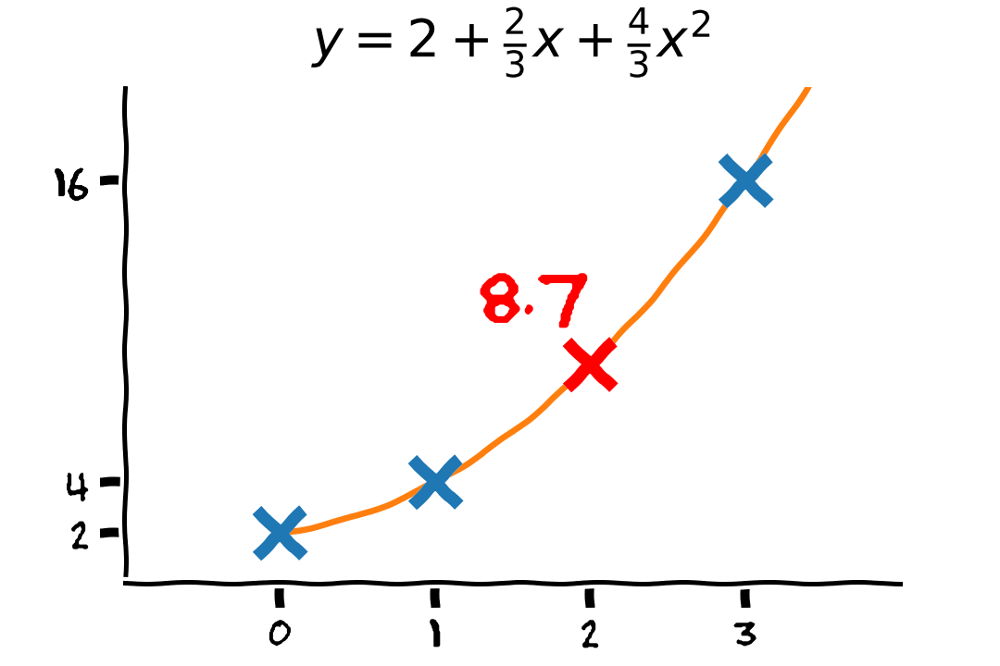

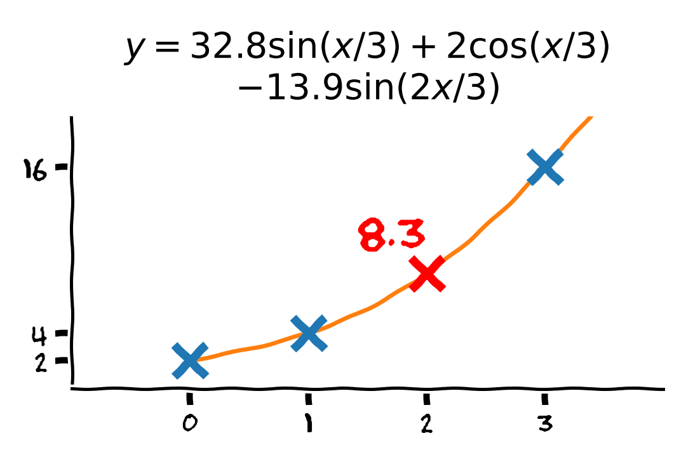

 

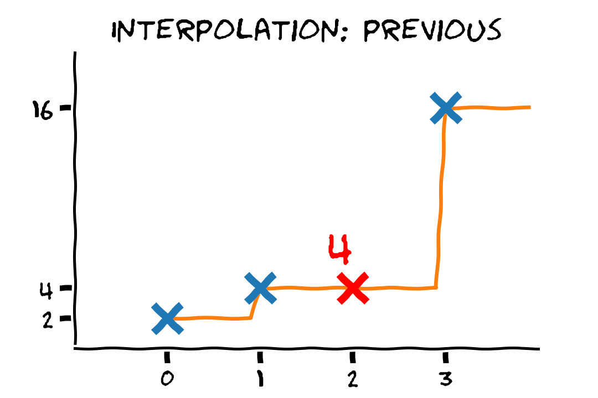

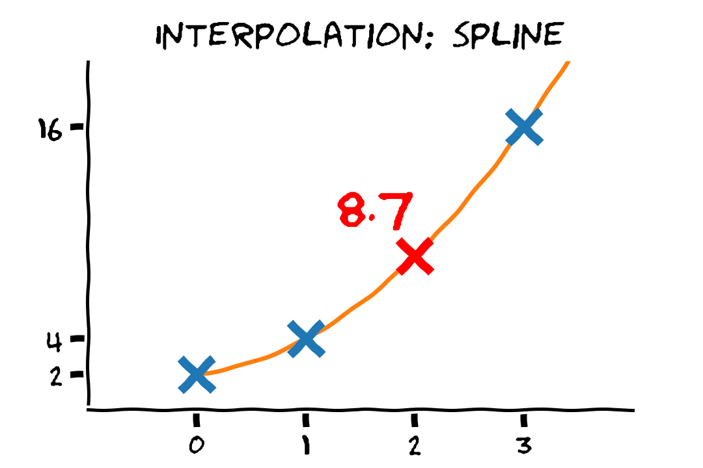

</section><section>

## המודל צריך לדעת להכליל

- יש הרבה מודלים שיכולים להתאים לדוגמאות.
- המטרה היא למצוא מודל שידע להכליל למקרים שעוד לא ראינו.
- כדי לבחור את המודל המתאים עלינו להשתמש בידע הקודם שיש לנו.

בעבור המקרה של: 2, 4, **?**, 16

 

מהניסון הקודם שלנו, אנו יודעים שבעיות כאלה נפוץ להשתמש בסדרה הנדסית. לכן המודל הסביר ביותר הוא:

$$
n_i=2\times2^i
$$

</section><section>

## מערכות אקראיות

 

- בדוגמא הצגנו מערכת דטרמיניסטית (לא אקראית). זאת אומרת, שבמקום ה$i$ ישב מספר מסויים קבוע.

 

- בפועל, ברוב במערכות שאותם נרצה למדל יהיה רכיב סטוכסטי (אקראי). זאת אומרת, שיתכן שבעבור פרמטרים זהים נקבל התנהגויות שונות.

</section><section>

## מערכות אקראיות - דוגמא

חיזוי זמן נסיעה על פי העומס בכביש (מספר המכוניות על הכביש).
  
מכיוון שזמן הנסיעה תלוי בעוד הרבה גורמים אחרים חוץ מהעומס, ניתן לקבל זמנים שונים בעבור אותו עומס.
  

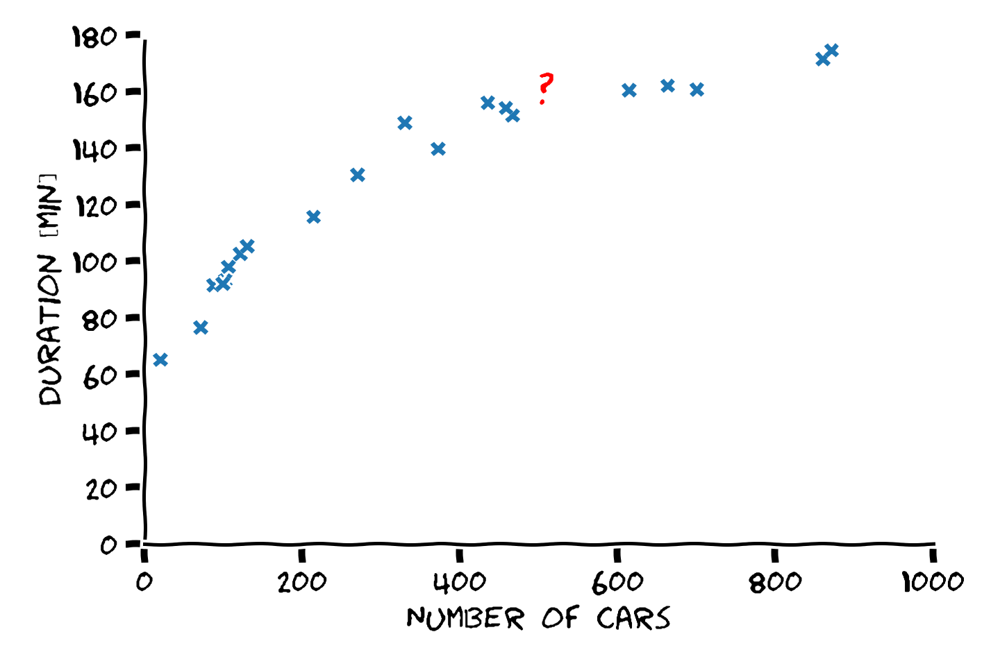

</section><section>

## המודל גם יטעה לפעמים

 

> כשהמערכת היא אקראית, או מאד מורכבת, לא נצפה למצוא מודל שתמיד צודק. במקום זאת נחפש מודל שטועה כמה שפחות.

  

במקרים כאלה נעזר בתורת ההסתברות על מנת לתאר את הבעיה והפתרון.

</section><section>

## אז איך עושים את זה?

הרעיון מאחורי רוב השיטות במערכות לומדות הוא זהה:

1. נגדיר קריטריון מתמטי אשר מודד עד כמה מודל מסויים מצליח לבצע את המשימה.

2. נבחר משפחה רחבה של מודלים בתקווה שלפחות אחד מהם יהיה מוצלח מספיק.

3. נחפש מבין כל המודלים במשפחה את המודל המוצלח ביותר.

 

(הרעיון פשוט, הביצוע קצת פחות).

 

מרבית הקורס יעסוק בשיטות לביצוע שלושת השלבים האלו.

</section><section>

## מודלים פרמטריים

אנו נבחר לרוב לייצג את המשפחה של המודלים בעזרת **מודל פרמטרי** (פונקציות בעלות מבנה קבוע עד כדי כמה פרמטרים שאותם ניתן לשנות)

### דוגמאות

<ul>
<li>

פונקציות לינאריות: $f_{\boldsymbol{\theta}}(x)=\theta_1 + \theta_2 x$.

</li><li class="fragment">

כל הפולינומים עד סדר 3: $f_{\boldsymbol{\theta}}(x)=\theta_1 + \theta_2 x + \theta_3 x^2 + \theta_4 x^3$.

</li><li class="fragment">

קומבינציה לינארית של פונקציות: $f_{\boldsymbol{\theta}}(x)=\theta_1 e^x + \theta_2 \sin(x)$.

</li><li class="fragment">

משהו אחר: $f_{\boldsymbol{\theta}}(x)=\theta_1 e^{-(x-\theta_2)^2/\theta_3}$.

</li><li class="fragment">רשת נוירונים.</li>
</ul>

</section><section>

## איך נדאג שהמודל הפרמטרי שלנו יכיל את המודל האופטימאלי?

אנחנו לא!

  

במערכות מורכבות אנחנו כנראה אף פעם לא נוכל למצוא את הפתרון האופטימאלי לבעיה. אנחנו נשאף להגיע כמה שיותר קרוב עליו.

  

> כל המודלים טועים אבל חלק שימושיים

George E. P. Box

</section><section>

## בחירת המודל הפרמטרי (משפחת המודלים)

הבחירה של המודל הפרמטרי תשפיע מאד על הפתרון שנקבל

 

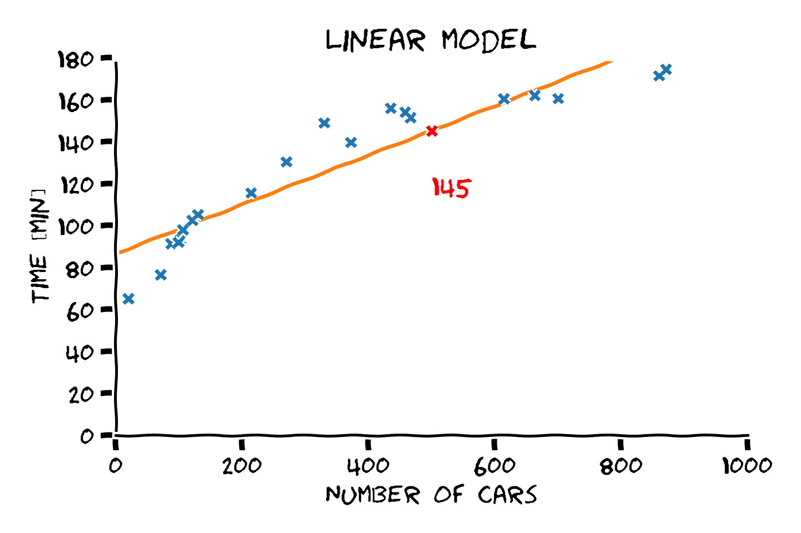

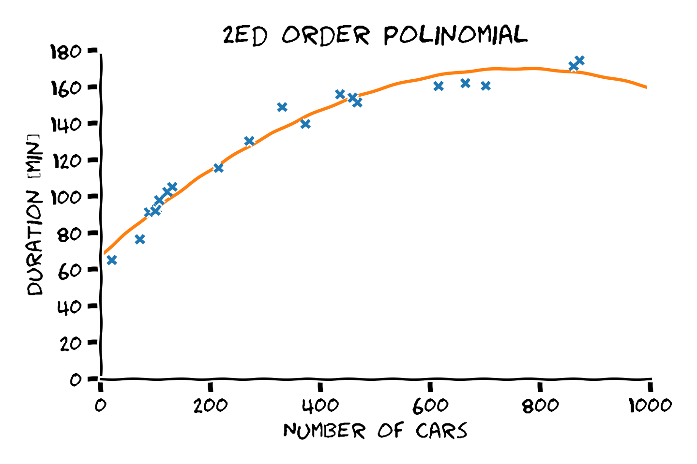

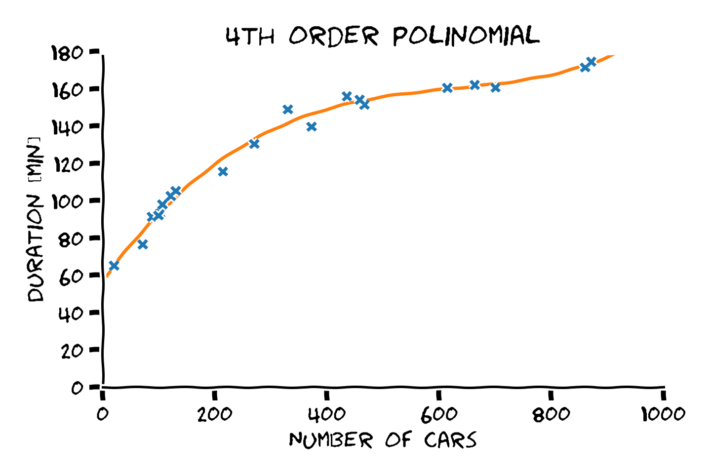

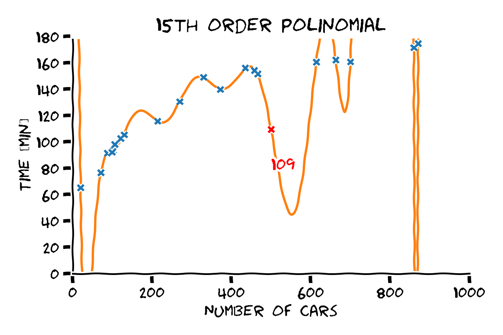

</section><section>

## כבר אמרנו קודם, הבעיה היא בעיית הכללה

 

- סדר פולינום גבוה יותר -> התאמה טובה יותר לדוגמאות.
- התאמה טובה יותר לדוגמאות לא מעידה על הכללה טובה יותר.
- את המודל הפרמטרי יש לבחור על סמך ידע קודם.

מההיכרות שלנו עם הבעיה אנו מצפים שפונקציית המיפוי תהיה מונוטונית עולה וגם שלא תשתנה בפראות.

 

מבין האופציות הנ"ל, פולינום מסדר 4 הוא הפשרה הטובה ביותר בין ההתאמה לדוגמאות והידע הקודם.

</section><section>

## התאמת מודלים

הרעיון של בניית מודל מתמטי לצורך תיאור של מערכת או לתהליך כל שהוא, הוא למעשה אחד הרעיונות הבסיסיים עליו מושתתים רוב תחומי ההנדסה והמדעים.  

  

- אנו נשתמש בשם prior knowledge (או בקיצור prior) בכדי להתייחס לידע המוקדם.
- אנו נשתמש בשם data בכדי להתייחס לדוגמאות / תצפיות.

</section><section>

## Data vs. Prior

- כאשר המערכת פשוטה, ויש לנו הבנה טובה שלה נסתמך בעיקר על הידע הקודם.
- במקרים אחרים נסתמך הרבה יותר על הdata.

### לדוגמא

#### מודל המבוסס על ידע קודם

מכונית יוצאת מחיפה לתל אביב במהירות קבועה ידועה. (מודל: מיקום = זמן x מהירות).

#### מודל המצריך שימוש בdata

מהירות המכונית תלויה במשתנים כגון אופי הנהג ומצב הכביש. ניתן לנסות לבנות מודל על סמך מידע מנסיעות קודמות.

</section><section>

## Data vs. Prior

- כאשר המערכת פשוטה, ויש לנו הבנה טובה שלה נסתמך בעיקר על הידע הקודם.
- במקרים אחרים נסתמך הרבה יותר על הdata.

### אילוסטרציה

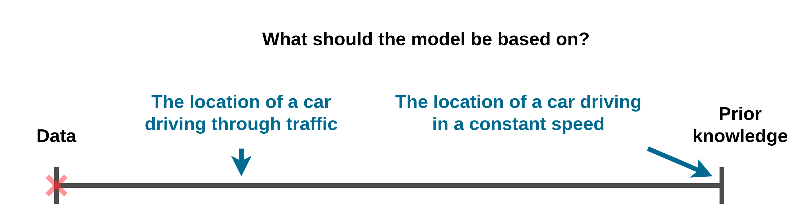

</section><section>

## איך זה מתקשר למערכות לומדות?

### הגדרה פורמלית

> התחום של מערכות לומדות עוסק באלגוריתמים אשר מנסים להשתמש במידע זמין על מנת לשפר את הביצועים של מכונה במשימה כל שהיא.

</section><section>

## בפועל ...

בפועל התחום של מערכות לומדות מתעסק בעיקר במקרים בהם אין הרבה ידע מקדים ובניית המודל נעשית בעיקר על סמך הdata.

  

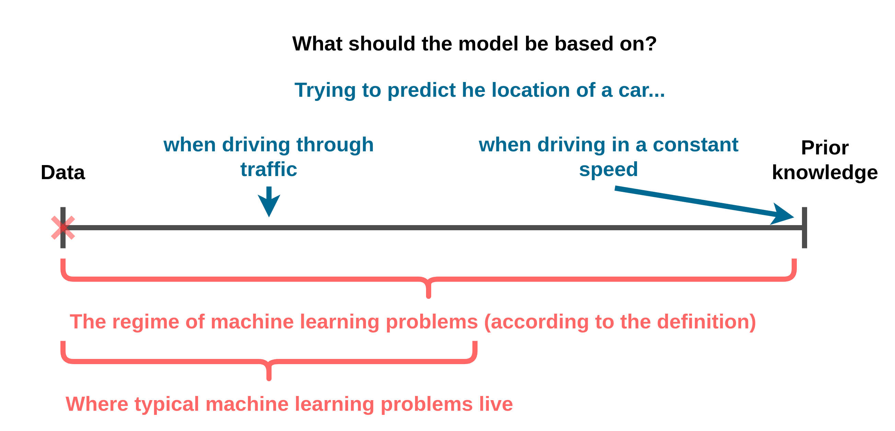

</section><section>

## וזה באמת עובד?

   

הנה כמה דוגמאות לדברים שאותם מערכות לומדות יכולות לעשות:

</section><section>

### לנהוג במכונית מירוץ

<iframe width="560"
        height="315"
        src="https://www.youtube.com/embed/3x3SqeSdrAE?start=26"
        frameborder="0"
        allow="accelerometer; autoplay; clipboard-write; encrypted-media; gyroscope; picture-in-picture" allowfullscreen
        ></iframe>

</section><section>

### לנצח בני אדם  במשחקי לוח ומחשב

DeepMind's AlphaStar

</section><section>

### לכתוב בלוגים

   
<a href="https://adolos.substack.com/archive?sort=new" target="_blank">
Nothing but Words by Liam Porr 
(and Open AI's GPT-3)
</a>

</section><section>

### לייצר תמונות ריאליסטיות

   

 

<a href="https://thispersondoesnotexist.com/" target="_blank">https://thispersondoesnotexist.com/</a>

</section><section>

### לנהל שיחות טלפון.

<iframe width="560" height="315" src="https://www.youtube.com/embed/D5VN56jQMWM?start=70" frameborder="0" allow="accelerometer; autoplay; clipboard-write; encrypted-media; gyroscope; picture-in-picture" allowfullscreen></iframe>

</section><section>

## מערכות לומדות בחיי היום יום

- מערכות עזר לנהיגה (mobileye).
- זיהוי הונאות בכרטיסי אשראי.
- סינון דואר.
- שיפור תוצאות חיפוש (גוגל)
- התאמת תוכן למשתמש.
- עוזרות וירטואליות (Siri, Alexa, Cortanta, Google Now).

</section><section>

## סוגי בעיות למידה

**מונחית (Supervised)** 
יש בידינו דוגמאות של קלט ופלט ממיפוי כל שהוא, ואנו מעוניינים להכליל את הדוגמאות למקרה הכללי.

**לא מונחית (Unsupervised)** 
יש בידינו אוסף של דוגמאות כלשהם ואנו מנסים ללמוד את המאפיינים שלהם.

**מקוונות (Online)** 
אנו מעוניינים להמשיך לעדכן את המודל שלנו בעקבות מידע שממשיך להגיע באופן שוטף.

**מחיזוקים (Reinforcment)** 
אנו מאפשרים לאלגוריתם לבצע אינטרקציה עם המערכת וללמוד מהמשוב שהוא מקבל ממנה (ניסוי וטעיה).

</section><section>

## סוגי בעיות למידה - דוגמאת

**מונחית (Supervised)** 
זיהוי אובייקטים בתמונה, סינון דואר זבל, סיוע באיבחון רפואי.

**לא מונחית (Unsupervised)** 
ייצור דוגמאות חדשות על סמך ישנות (תמונות, מוזיקה), שינוי מאפיינים (קול של אדם, פנים), דחיסה.

**מקוונות (Online)** 
סינון דואר זבל עם עידכון על כל דואר חדש שמגיע. 
חיזוי מחירי מניות עם עדכון על כל מידע חדש שמגיע.

**מחיזוקים (Reinforcment)** 
נהיגה אוטונומית, משחק שח, הליכה.  
ברוב המקרים האלגוריתם יתאמן תחילה על סימולטור.

</section><section>

## מה נלמד בקורס

<ul>
<li>בקורס נעסוק בעיקר בבעיות Supervised learning וניגע מעט בUnsupervised learning.</li>
<li class="fragment">נכיר את עולם המושגים והשפה בה משתמשים בתחום.</li>
<li class="fragment">נלמד לבטא בעיות למידה באופן מתימטי.</li>
<li class="fragment">נכיר משפחות שונות של מודלים בהם ניתן השתמש.</li>
<li class="fragment">נלמד על שיטות לבחירת מודל "טוב" מתוך משפחת המודלים.</li>
<li class="fragment">נדון ביכולות והמגבלות של כל אחת מהשיטות והמודלים שנכיר.</li>
</ul>

</section><section>

## איך נלמד בקורס

 

- 13 הרצאות ותרגולים שבועיים.
- 5 תרגלי בית יבש + רטוב. 15% מהציון.
- מבחן סופי 85% מהציון.
- בונוס: תרגילי הכנה של 0.2 נק' לכל תרגיל.

</section><section>

## סילבוס

</section><section>

## נוטציות

 

בקורס נשתדל מאד להצמד נצמד לנוטציות המתמטיות המופיעות בספר:

[Deep Learning (by I. Goodfellow, Y. Bengio & A. Courville)](https://www.deeplearningbook.org/).

 

את רשימת הנוטציות המלאה ניתן למצוא [קישור הבא](https://www.deeplearningbook.org/contents/notation.html).

 

בשני התרגולים הראשונים יופיעו הנוטציות הקשורות לאלגברה לינארית והסתברות.

</section><section>

## למה בטכניון?

<a href="http://csrankings.org/#/index?mlmining&world">

CSRanking (2010-2020)

</a>

</section><section class="center">

# Supervised learning

</section><section>

## Supervised learning (למידה מונחית)

- בעיות supervised learning הן הבסיסיות ביותר בתחום והבנה טובה של בעיות אלו היא הבסיס להבנה של כל שאר הבעיות במערכות לומדות.

- בקורס זה אנו נעסוק בעיקר בבעיות מסוג זה.

- על מנת להבין מה הן בעיות supervised learning עלינו ראשית לחזור על הנושא של בעיות חיזוי.

</section><section>

## בעיית החיזוי

- בבעיות חיזוי אנו מנסים לחזות את ערכו של משתנה אקראי לא ידוע, לרוב על סמך משתנים אקראיים ידועים.

- בעיות חיזוי הן **מאד** נפוצות ומופיעות במגוון רחב של תחומים בהנדסה ומדע.

- בהנדסת חשמל בעיות אלו מופיעות בתחומים כגון עיבוד אותות, תקשורת ספרתית ובקרה.

- בעיות חיזוי מלוות אותנו כמעט בכל פעולה יום יומית. לדוגמא האם לקחת מטריה כשיוצאים מהבית.

- ביום יום אנחנו לא מנסים לפתור בעיות אלה באופן מתמטי. אנו מחזיקים מודל של הקשרים הסטטיסטים ומשתמשים בו בצורה איכותית.

</section><section>

## הקשר ל supervised learning

- בבעיות חיזוי קלאסיות, אנו מניחים שהפילוג ידוע.

- בsupervised learning (ובמערכות לומדות) אנו מניחים כי הפילוג אינו ידוע.

- במקום הפילוג יש לנו מדגם.

- את החזאי נאלץ כעת לבנות על סמך המדגם (במקום על סמך הפילוג).

</section><section>

## סימונים ושמות

- **Labels** (תויות / תגיות): $\text{y}$ - המשתנה האקראי שאותו אנו מנסים לחזות. (לרוב סקלר)

- **Observations \ measurements** (תצפיות או מדידיות): $\mathbf{x}$ - הוקטור האקראי אשר שעלפיו נרצה לבצע את החיזוי. (לרוב וקטור)

- $\hat{y}$ - תוצאת חיזוי.

- $\hat{y}=h(\boldsymbol{x})$ - פונקציית החיזוי.

- $D$ אורך של הוקטור $\boldsymbol{x}$

</section><section>

## The dataset (המדגם)

המדגם יהיה מורכב מזוגות של $\boldsymbol{x}$ ו $y$ אשר יוצרו מתוך $N$ דגימות **בלתי תלויות**:

$$
\mathcal{D}=\{\boldsymbol{x}^{(i)}, y^{(i)}\}_{i=1}^N
$$

$N$ - מספר הדגימות שבמדגם.

</section><section>

## החזאי האופטימאלי

- כל פונקציה אשר ממפה מ $\boldsymbol{x}$ ל $y$ היא פונקציית חיזוי חוקית.

- היינו מעוניינים למצוא חזאי אשר לעולם לא טועה.

- מכיוון ש$\text{y}$ משתנה אקראי לא נוכל לחזותו במדוייק.

- אנו צריכים להגדיר דרך להשוות בין הטעויות שאותם מבצעים החזאים שונים. (לדוגמא, הרבה טעויות קטנות או מעט גדולות)

</section><section>

## Regression vs. Classification

מוקבל לחלק את הבעיות ב supervised learning לשני תתי תחומים:

 

- **בעיות regression (רגרסיה)** - $\text{y}$ רציף.

 

- **בעיות classification (סיווג)** - $\text{y}$ בדיד עם סט ערכים סופי (לרוב קטן).

</section><section>

## דוגמא לבעיית רגרסיה

הבעיה של חיזוי משך הנסיעה

 

</section><section>

## ניסוח פורמלי - חיזוי משך הנסיעה

- $x$ - מספר המכוניות על הכביש באותה נסיעה.
- $\text{y}$ - משך הזמן שלקחה הנסיעה.
- נחפש פונקציית חיזוי $\hat{y}=h(\boldsymbol{x})$.

דוגמא לפונקציית חיזוי פרמטרית:

$$
h_\boldsymbol{\theta}(x;\theta_1,\theta_2)=\theta_1+\theta_2 x
$$

אוסף כל הפונקציות הלינאריות (ליתר דיוק אפיניות).

 

בהמשך נעסוק בשאלה של כיצד לבחור את הערכים של $\theta_1$ ו-$\theta_2$.

</section><section>

## בעיית סיווג - זיהוי הונאות בכרטיסי אשראי

נסיון לסווג עסקאות כחשודת להונאה על סמך פרטי העסקה:

- הסכום.
- מרחק העיסקה (נניח המיקום של החנות) מהעיסקה האחרונה.
- מרחק העיסקה מהכתובת של הלקוח.
- השעה ביום.
- אופי המוצרים שהחנות מוכרת (מכולת, מוצרי חשמל, ביגוד, רכב, נדל"ן, וכו')

ניתן לעשות זאת בעזרת supervised learning על ידי שימוש במדגם דוגמאות מהעבר.

</section><section>

## בעיית סיווג לדוגמא - המדגם

בהרצאות נשתמש בבעיה זו כדוגמא ונתייחס למדגם הבא:

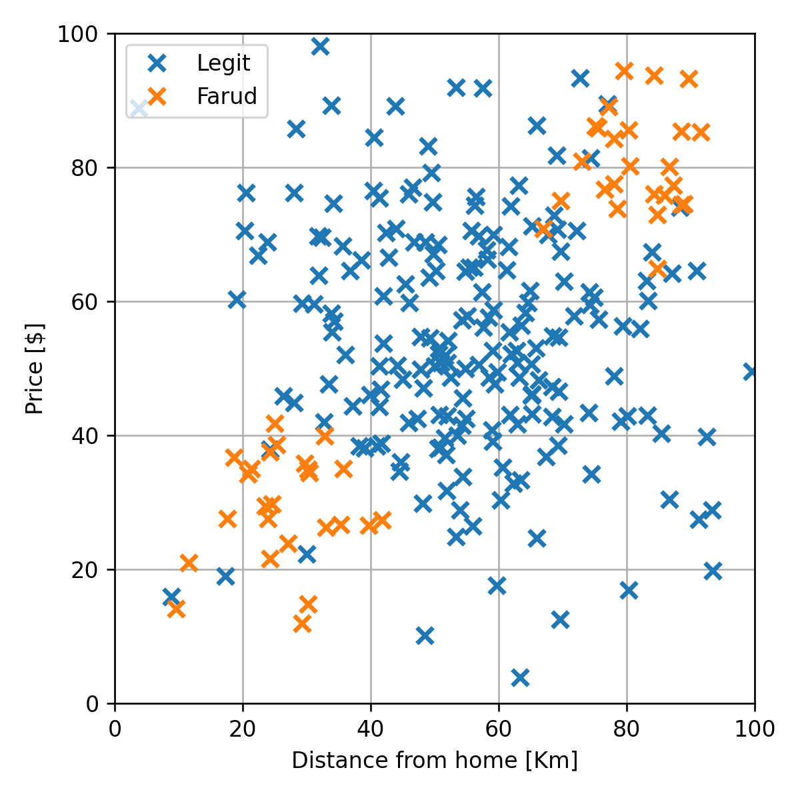

</section><section>

## בעיית סיווג לדוגמא - החזאי

נרצה למצוא חזאי אשר יחזה עיסקאות חשודות על פי מרחק ומחיר. לדוגמא:

</section>

