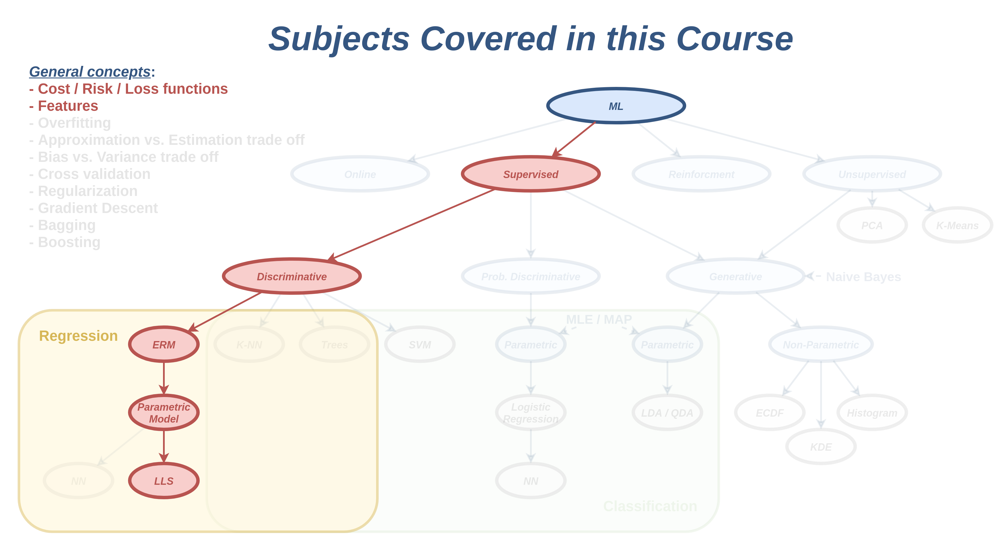
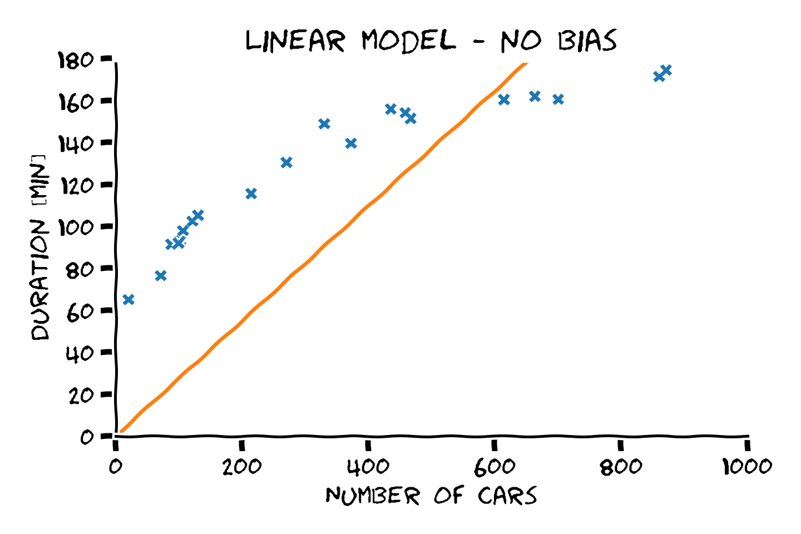

<section class="center">

# הרצאה 2 - רגרסיה לינארית

<a href="/assets/lecture02_slides.pdf" class="link-button" target="_blank">PDF</a>

</section><section>

## מה נלמד היום

</section><section>

## Supervised learing (למידה מונחית)

- בעיות supervised learning הם הבסיסיות ביותר בתחום והבנה טובה של בעיות אלו היא הבסיס להבנה של כל שאר הבעיות במערכות לומדות.

- בקורס זה אנו נעסוק בעיקר בבעיות מסוג זה.

- על מנת להבין מה הם בעיות supervised learning עלינו ראשית לחזור על הנושא של בעיות חיזוי.

</section><section>

## בעיית החיזוי

- בבעיות חיזוי אנו מנסים לחזות את ערכו של משתנה אקראי לא ידוע, לרוב על סמך משתנים אקראיים ידועים.

- בעיות חיזוי הם **מאד** נפוצות ומופיעות במגוון רחב של תחומים בהנדסה ומדע.

- בהנדסת חשמל בעיות אלו מופיעות בתחומים כגון עיבוד אותות, תקשורת ספרתית ובקרה.

- בעיות חיזוי מלוות אותנו כמעט בכל פעולה יום יומית. לדוגמא האם לקחת מטריה כשיוצאים מהבית.

- ביום יום אנחנו לא מנסים לפתור את באופן מתמטי. אנו מחזיקים מודל של הקשרים הסטטיסטים ומשתמשים בו בצורה איכותית.

</section><section>

## הקשר ל supervised learning

- בבעיות חיזוי קלאסיות, אנו מניחים שהפילוג ידוע.

- בsupervised learning (ובמערכות לומדות) אנו מניחים כי הפילוג אינו ידוע.

- במקום הפילוג יש לנו מדגם.

- את החזאי נאלץ כעת לבנות על סמך המדגם (במקום על סמך הפילוג).

</section><section>

## סימונים ושמות

- **Labels** (תויות / תגיות): $\text{y}$ - המשתנה האקראי שאותו אנו מנסים לחזות. (לרוב סקלר)

- **Observations \ measurements** (תצפיות או מדידות): $\mathbf{x}$ - הוקטור האקראי אשר שלפיו נרצה לבצע את החיזוי. (לרוב וקטור)

- $\hat{y}$ - תוצאת חיזוי.

- $\hat{y}=h(\boldsymbol{x})$ - פונקציית החיזוי.

- $D$ אורך של הוקטור $\boldsymbol{x}$

</section><section>

## The dataset (המדגם)

המדגם יהיה מורכב מדגימות של הזוג $\boldsymbol{x}$ ו $y$:

$$
\mathcal{D}=\{\boldsymbol{x}^{(i)}, y^{(i)}\}_{i=1}^N
$$

כאשר $N$ הוא מספר הדגימות שבמדגם.

 

### הנחת ה i.i.d.

אנו תמיד נניח כי הדגימות נוצרו כולם מאותו הפילוג באופן בלתי תלוי אחת בשניה.
 
 
זאת אומרת שבעבור זוג אינדקסים $i\neq j$ הדגימה $\{\mathbb{x}^{(i)}, {y}^{(i)}\}$ הינה בלתי תלויה סטטיסטית בדגימה $\{\mathbb{x}^{(j)}, {y}^{(j)}\}$.

</section><section>

## Regression vs. Classification

מוקבל לחלק את הבעיות ב supervised learning לשני תתי תחומים:

 

- **בעיות regression (רגרסיה)** - $\text{y}$ רציף.

 

- **בעיות classification (סיווג)** - $\text{y}$ בדיד עם סט ערכים סופי (לרוב קטן).

</section><section>

## דוגמא לבעיית רגרסיה

הבעיה של חיזוי משך הנסיעה

 

</section><section>

## ניסוח פורמלי - חיזוי משך הנסיעה

- Labels - $\text{y}$ - המשתנה האקראי של זמן הנסיעה.
- Measurements - $\text{x}$ - המשתנה האקראי של מספר המכוניות על הכביש.
- $h$ - פונקציית החיזוי אשר מקבלת את מספר המכוניות על הכביש ומוציאה חיזוי של זמן הנסיעה.
- $\mathcal{D}$ - מדגם הנתון של הזוגות של (מספר מכוניות, זמן נסיעה).

המטרה שלנו הינה להשתמש ב $\mathcal{D}$ על מנת למצוא חזאי $\hat{y}=h(x)$ אשר יהיה כמה שיותר מוצלח תחת קריטריון שאותו נצטרך להגדיר.

</section><section>

## החזאי האופטימאלי

- כל פונקציה אשר ממפה מ $\boldsymbol{x}$ ל $y$ היא פונקציית חיזוי חוקית.

- היינו מעוניינים למצוא חזאי אשר לעולם לא טועה.

- מכיוון ש$\text{y}$ משתנה אקראי לא נוכל לחזותו במדוייק.

- אנו צריכים להגדיר דרך להשוות בין הטעויות שאותם מבצעים החזאים שונים. (לדוגמא, הרבה טעויות קטנות או מעט גדולות)

</section><section>

## השלבים הכלליים לפתרון הבעיה

1. נגדיר קריטריון מתמטי אשר מודד עד כמה מודל מסויים מצליח לבצע את המשימה.
2. נבחר משפחה רחבה של מודלים בתקווה שלפחות אחד מהם יהיה מוצלח מספיק.
3. נחפש מבין כל המודלים במשפחה את המודל המוצלח ביותר.

</section><section>

## The cost function (פונקציית המחיר)

- פונקציית המחיר $C(h)$ מעניקה לכל חזאי ציון.

- ציון נמוך יותר = חזאי טוב יותר.

- החזאי האופטימאלי $h^*$ הוא החזאי בעל הציון הנמוך ביותר:

$$
h^* = \underset{h}{\arg\min}C(h)
$$

- פונקציית המחיר אמורה לשקף את המחיר אותו "נשלם" על שימוש בחזאי כל שהוא.

- בפועל, משתמשים באחת מכמה פונקציות מחיר נפוצות.

</section><section>

## Risk and loss functions (פונקציות סיכון והפסד)

- פונקציית הcost מנסה לתת ציון ליכולת החיזוי הכללית של החזאי.

- פונקציית ה**loss** (הפסד) $l$ נותנת ציון לחיזוי בודד.

$$
l(h(\boldsymbol{x}),y)=l(\hat{y},y)
$$

- ניתן להגדיר את פונקציית הcost כתוחלת על פונקציית loss:

$$
C(h)=\mathbb{E}\left[l(h(\mathbf{x}),\text{y})\right]
$$

- במקרים כאלה, מוקבל להשתמש בשם **risk** ובסימון:

$$
R(h)=\mathbb{E}\left[l(h(\mathbf{x}),\text{y})\right]
$$

</section><section>

## פונקציות loss (risk) נפוצות

#### Zero-one loss (misclassification rate):

$$
  l(\hat{y},y)=I\{\hat{y}\neq y\},
  \qquad
  R(h)=\mathbb{E}\left[I\{h(\boldsymbol{x})\neq y\}\right]
$$

  נפוצה בבעיות classification.

#### $l_2$ loss (mean squared error (MSE)):

$$
  l(\hat{y},y)=(\hat{y}-y)^2,
  \qquad
  R(h)=\mathbb{E}\left[(h(\boldsymbol{x})-y)^2\right]
$$

  נפוצה בבעיות regression. 
  בנוסף קיים גם root mean squared error (RMSE).

#### $l_1$ loss (mean absolute error (MAE)):

$$
  l(\hat{y},y)=|\hat{y}-y|,
  \qquad
  R(h)=\mathbb{E}\left[|h(\boldsymbol{x})-y|\right]
$$

  גם כן נפוצה בבעיות regression.

</section><section>

## בעיה: הפילוג של המשתנים לא ידוע

-פונקציית הסיכון מוגדרת על ידי תוחלת על פני הפילוג של המשתנים האקראיים בבעיה שהוא כאמור לא ידוע.
- בעיה זו קיימת לא רק בפונקציות מחיר מסוג סיכון.

</section><section>

## גישות לפתרון בעיות supervised learning

### גישה גנרטיבית (generative)

ננסה להשתמש במדגם על מנת ללמוד את הפילוג הלא ידוע.

 
 

### גישה דיסקרימינטיבית (discriminative)

ננסה לבנות חזאי אופטימאלי על סמך הגרסא האמפירית של פונקציית המחיר, בתקווה שהוא יקבל ציון טוב גם בגרסא הלא אמפירית.
 
(זאת אומרת, שהוא ידע להכליל בצורה טובה).

 
 
 
 

לכל אחד מהגישות יש את היתרונות והחסרונות שלה.

</section><section>

## שיערוך אמפירי של פונקציית המחיר / סיכון

- במקום לנסות ולחשב את המחיר באופן אנליטי, נוכל לנסות לשערך אותו על סמך אוסף של דוגמאות (מדגם).
- שיעוך על סמך דוגמאות מכונה שיערוך אמפירי.

</section><section>

## Empirical risk (סיכון אמפירי)

הסיכון האמפירי מוגדר על ידי החלפת התוחלת בפונקציית הסיכון בגרסא האמפירית שלה.

 

אנו נשתמש בסימון $\hat{\mathbb{E}}_{\mathcal{D}}$ על מנת לסמן את תחולת האמפירית המבוססת על המדגם נתון $\mathcal{D}$.

$$
\mathbb{E}\left[f(\text{x})\right]
\approx\hat{\mathbb{E}}_{\mathcal{D}}\left[f(x)\right]
=\frac{1}{N}\sum_{i=1}^Nf(x^{(i)})
$$

 

כאשר מספר הדגימות $N$ הולך לאין סוף התוחלת האמפירית מתכנסת לתוחלת האמיתית במובן הסתברותי.

</section><section>

## Empirical risk (סיכון אמפירי) - המשך

הסיכון האמפירי המקבל הינו:

$$
R(h)=\mathbb{E}\left[l(h(\mathbf{x}),\text{y})\right]
\approx\hat{R}(h)=\frac{1}{N}\sum_{i=1}^N\left[l(h(\boldsymbol{x}^{(i)}),y^{(i)})\right]
$$

</section><section>

## התאמת יתר

השימוש בגרסא האמפירית של פונקציית המחיר היא במקרים רבים בעייתית והיא גורמת בין היתר לתופעה המוכנה overfitting (התאמת יתר).

 

בשלב זה אנו נתעלם מבעיה זו ואנו נעסוק בה בהרחבה בהרצאה הבאה.

</section><section>

## Empirical risk minimization (ERM)

- רלוונטי למקרים בהם פונקציית המחיר מוגדרת כפונקציית סיכון.
- מנסה ישירות למצוא חזאי אשר ימזער את הסיכון האמפירי:

$$
h^*_{\mathcal{D}}
=\underset{h}{\arg\min}\frac{1}{N}\sum_{i=1}^N\left[l(h(\boldsymbol{x}^{(i)}),y^{(i)})\right]
$$

</section><section>

## התלות במדגם

$$
h^*_{\mathcal{D}}
=\underset{h}{\arg\min}\frac{1}{N}\sum_{i=1}^N\left[l(h(\boldsymbol{x}^{(i)}),y^{(i)})\right]
$$

למה $h_{\mathcal{D}}^*$ לא $h^*$?

1. על מנת להדגיש את התלות של החזאי במדגם (לכל מדגם יהיה חזאי אופטימאלי אחר).

2. בכדי להבדיל את החזאי של ERM מהחזאי האופטימאלי.

</section><section>

## מודלים פרמטריים

נרצה להגביל את החזאי שלנו למשפחה מצומצמת של פונקציות. נעזה זאת על ידי שימוש במודל פרמטרי.

 

מוטיבציה:

1. הגבלת המודל למשפחה מצומצמת של מודלים מסייעת למזער את הoverfitting (בהרצאה הבאה).
2. יותר פרקטי לנסות לחפש פרמטרים של מודל מאשר חיפוש כללי של פונקציה במרחב הפונקציות.

</section><section>

## מודלים פרמטריים - המשך

מודל פרמטרי מגדיר את המבנה הכללי של הפונקציות במשפחה עד כדי מספר סופי של פרמטרים אשר חופשיים להשתנות.

 

לדוגמא:

$$
h(\boldsymbol{x};\boldsymbol{\theta})=\frac{\theta_1^3x_1+x_4^{\theta_2}}{\log(\theta_3x_2)}
$$

</section><section>

## מודלים פרמטריים - דוגמאות

1. פונקציות לינאריות:

$$
  h(\boldsymbol{x};\boldsymbol{\theta})=\theta_1 x_1+\theta_2 x_2+\theta_2 x_2
$$
2. פולינומים:

$$
h(\boldsymbol{x};\boldsymbol{\theta})=\theta_1 + \theta_2 x_1 + \theta_3 x_1^2 + \theta_4 x_1^3
$$

3. טור פוריה סופי:

$$
h(\boldsymbol{x};\boldsymbol{\theta})=\theta_1 \sin(\pi x) + \theta_2 \cos(\pi x) + \theta_3 \sin(2\pi x) + \theta_4 \cos(2\pi x)
$$

4. רשתות נוירונים

</section><section>

## מודלים פרמטריים - מיפוי לוקטורים

- מודל פרמטרי ממפה כל פונקציה מהמשפחה הפרמטרית לוקטור.
- יש לנו סט עשיר של כלים לעבודה עם וקטורים.
- לדוגמא: שימוש ב gradient descent למציאת מינימום לוקאלי.

ניתן כעת לרשום את בעיית האופטימיזציה כאופטימיזציה על הפרמטרים (במקום על $h$):

$$
\boldsymbol{\theta}^* = \underset{\boldsymbol{\theta}}{\arg\min}C(h(\cdot;\boldsymbol{\theta}))
$$

או במקרה של ERM:

$$
\boldsymbol{\theta}^* = \underset{\boldsymbol{\theta}}{\arg\min}\frac{1}{N}\sum_{i=1}^N\left[l(h(\boldsymbol{x}_i;\boldsymbol{\theta}),y_i)\right]
$$

</section><section>

## מודל לינארי

מודל מהצורה:

$$
h(\boldsymbol{x};\boldsymbol{\theta})=\theta_1 x_1+\theta_2 x_2+\dots+\theta_D x_D
$$

או בצורה וקטורית:

$$
h(\boldsymbol{x};\boldsymbol{\theta})=\boldsymbol{x}^{\top}\boldsymbol{\theta}
$$

</section><section>

## איבר היסט (bias)

ניתן להוסיף למודל גם איבר bias:

$$
h(\boldsymbol{x};\boldsymbol{\theta})=\theta_1 + \boldsymbol{x}^{\top}[\theta_2, \theta_3, \dots, \theta_{D+1}]^{\top}
$$

בכדי לשמור על הכתיב הוקטורי נפריד את איבר ה bias משאר הפרמטרים:

$$
h(\boldsymbol{x};\boldsymbol{\theta},\theta_0)=\theta_0 + \boldsymbol{x}^{\top}\boldsymbol{\theta}
$$

לרוב נסמן אותו בעזרת $b$ או $\theta_0$.

 
 
 

נראה בהמשך דרך נוחה יותר להוספת איבר ההיסט בעזרת שינוי של הוקטור $\boldsymbol{x}$.

</section><section>

## Linear Least Squares (LLS)

MSE + מודל לינארי + ERM:

$$
\boldsymbol{\theta}^*_{\mathcal{D}}
=\underset{\boldsymbol{\theta}}{\arg\min} \frac{1}{N}\sum_{i=0}^N(\boldsymbol{x}^{(i)\top}\boldsymbol{\theta}-y^{(i)})^2
$$

 
 
 

בעיית הLLS נפוצה מאד ומופיעה בתחומים רבים.

 
 
 

אחת התכונות הנחמדות ביותר של LLS הוא העובדה שניתן לפתור את הבעיית האופטימיזציה שלו באופן אנליטי.

</section><section>

## LLS - כתיב מטריצי

נגדיר את הוקטור והמטריצה הבאים:

- וקטור התגיות:

  $$
  \boldsymbol{y}=[y^{(1)},y^{(2)},\cdots,y^{(n)}]^{\top}
  $$

- מטריצת המדידות:

  $$
  X=\begin{bmatrix}
  - & \boldsymbol{x}^{(1)} & - \\
  - & \boldsymbol{x}^{(2)} & - \\
  & \vdots & \\
  - & \boldsymbol{x}^{(N)} & -
  \end{bmatrix}
  $$

</section><section>

## Linear least squares - כתיב מטריצי

$$
\boldsymbol{y}=[y^{(1)},y^{(2)},\cdots,y^{(n)}]^{\top}
\qquad
X=\begin{bmatrix}
- & \boldsymbol{x}^{(1)} & - \\
- & \boldsymbol{x}^{(2)} & - \\
& \vdots & \\
- & \boldsymbol{x}^{(N)} & -
\end{bmatrix}
$$

 
 
 

בעזרת הגדרות אלו, ניתן לרשום את בעיית האופטימיזציה של LLS באופן הבא:

$$
\begin{aligned}
\boldsymbol{\theta}^*_{\mathcal{D}}
&=\underset{\boldsymbol{\theta}}{\arg\min} \frac{1}{N}\sum_{i=0}^N(\boldsymbol{x}^{(i)\top}\boldsymbol{\theta}-y^{(i)})^2\\
&=\underset{\boldsymbol{\theta}}{\arg\min} \frac{1}{N}\lVert X\boldsymbol{\theta}-\boldsymbol{y}\rVert_2^2
\end{aligned}
$$

</section><section>

## Linear least squares - פתרון סגור

$$
\boldsymbol{\theta}^*_{\mathcal{D}}
=\underset{\boldsymbol{\theta}}{\arg\min} \frac{1}{N}\lVert X\boldsymbol{\theta}-\boldsymbol{y}\rVert_2^2
$$

בבעיית האופטימיזציה הזו ניתן להגיע לפתרון סגור על ידי גזירה והשוואה ל-0:

$$
\nabla_{\theta}\left(\frac{1}{N}\lVert X\boldsymbol{\theta}-\boldsymbol{y}\rVert_2^2\right)=0
$$

$$
\Rightarrow \boldsymbol{\theta} = (X^{\top}X)^{-1}X^{\top}\boldsymbol{y}
$$

 
 

(את הפיתוח תראו בתרגול 3)

 

פתרון זה נכון רק כאשר המטריצה $X^{\top}X$ הפיכה.

</section><section>

## בחזרה לדוגמא

 

נשתמש במודל:

$$
  h(x;\theta)=\theta x
$$

ונפתור בעזרת LLS.

</section><section>

## בחזרה לדוגמא

$$
h(x;\theta)=\theta x
$$

בעבור מקרה זה, נקבל ש: $X=[x^{(1)}, x^{(2)}, \dots, x^{(N)}]^{\top}$.

 

נחשב את $\theta$ על ידי:

$$
\theta^*_{\mathcal{D}}=(X^{\top}X)^{-1}X^{\top}\boldsymbol{y}
$$

התוצאה המקבלת הינה:

 

</section><section>

## הוספת איבר היסט

נרצה להשתמש במודל מהצורה:

$$
h(x;\boldsymbol{\theta})=\theta_1 + \theta_2 x
$$

 
 

בעיה: הפתרון הסגור של LLS לא מתייחס למודל זה (עם bias).

 
 

פתרון: ננסח מחדש את הבעיה כך שיתקבל מודל ללא איבר היסט.

</section><section>

## שאלה

אילו מהפעולות הבאות על $x$ ישנו באופן מהותי את הבעיה שאנו מסנים לפתור?:

- החלפת יחידות (נגיד לספור את כמות המכוניות במאות).

- הוספה של קבוע למספר המכוניות (נגיד +100).

- העלאה של מספר המכוניות בריבוע.

</section><section>

## עיבוד מקדים

- אנו לא חייבים להשתמש בנתונים בצורתם הגולמית.
- מותר לנו לבצע עיבוד מקדים של הנתונים לפני שאנו מזינים אותם לחזאי.
- העיבוד המקדים יכול לפעול על כל וקטור המדידות $\boldsymbol{x}$, ולייצר וקטור חדש:

$$
\boldsymbol{x}_{\text{new}}=\Phi(\boldsymbol{x})
$$

פעולת החיזוי תהיה:

$$
\hat{y}=h(\Phi(\boldsymbol{x});\boldsymbol{\theta})
$$

</section><section>

## מאפיינים

את המוצא של הפונקציה $\Phi$ מקובל לכנות וקטור ה**מאפיינים (features)**.
השימוש במאפיינים מאפשר דברים כגון:

- הרחבת מודלים פשוטים למודלים מורכבים יותר.
- החלפת האופן שבו המידע מיוצג. לדוגמא:
  - החלפת יחידות.
  - הפיכת תמונת פנים לוקטור של מאפיינים כגון: המרחק בין העיניים, גוון העור, עד כמה הפנים אליפטיות וכו'
  - ניקוי רעשים בהקלטות audio.
- הפחתת overfitting (נראה לקראת סוף הקורס כשנדבר על הורדת מימד).

</section><section>

## פונקציות המאפיינים

אנו נשתמש לפעמים בסימון הבא:

$$
\Phi(\boldsymbol{x})=[\varphi_1(\boldsymbol{x}),\varphi_2(\boldsymbol{x}),\dots,\varphi_M(\boldsymbol{x})]^{\top}
$$

 

כאן $\Phi$ הוא וקטור של פונקציות, כאשר כל פונקציה $\varphi_i$ אחראית על ייצור של איבר אחד בוקטור $\boldsymbol{x}_{\text{new}}$:

$$
x_{\text{new},i}=\varphi_i(\boldsymbol{x})
$$

</section><section>

## מודלים לינאריים ומאפיינים

על ידי שילוב של מודל לינארי עם מאפיינים נוכל לקבל חזאים מהצורה:

$$
\begin{aligned}
\hat{y}
&=h(\boldsymbol{x};\theta)
=h_{\text{linear}}(\Phi(\boldsymbol{x});\theta)
=\Phi(\boldsymbol{x})^{\top}\boldsymbol{\theta}\\
&=\theta_1 \varphi_1(\boldsymbol{x})+\theta_2 \varphi_2(\boldsymbol{x})+\dots+\theta_M \varphi_M(\boldsymbol{x})
\end{aligned}
$$

זאת אומרת מודל שהוא קומבינציה לינארית של פונקציות של $\boldsymbol{x}$.

 
 
 

שימו לב: המודל נקרא מודל לינארי משום שהוא לינארי **בפרמטרים** שהם הנעלמים בבעיה (ולא ב $\boldsymbol{x}$)

</section><section>

## דוגמא: הוספה של איבר ההיסט

נוסיף כעת איבר היסט למודל שלנו לשיערוך זמן הנסיעה.

נעשה זאת על ידי שימוש במאפיינים הבאים:

$$
\varphi_1(x)=1,\quad\varphi_2(x)=x
$$

כל דגימה $x$ תהפוך לוקטור $x_{\text{new}}=[1, x]^{\top}$ ומודל החיזוי שלנו יהיה:

$$
h(x;\boldsymbol{\theta})=\theta_1 + \theta_2 x
$$

מטריצת המדידות $X$ תהיה כעת:

$$
X=\begin{bmatrix}
1 & x^{(1)} \\
1 & x^{(2)} \\
\vdots & \vdots\\
1 & x^{(N)}
\end{bmatrix}
$$

</section><section>

## דוגמא: הוספה של איבר ההיסט

הצבה של מטריצה זו בנוחסא ל $\boldsymbol{\theta}^*_{\mathcal{D}}$ נותנת את המודל הלינארי הבא:

</section><section>

## דוגמא נוספת - פולינומים

באותו אופן ניתן להשתמש במאפיינים בכדי לייצג מגוון רחב של פונקציות מורכבות יותר כגון פולינומים, כפי שיודגם בתרגול 3.

 

</section>

