

# הרצאה 3 - Generalization & overfitting

<a href="./slides/" class="link-button" target="_blank">Slides</a>
<a href="/assets/lecture03.pdf" class="link-button" target="_blank">PDF</a>
<a href="./code/" class="link-button" target="_blank">Code</a>

## מה נלמד היום

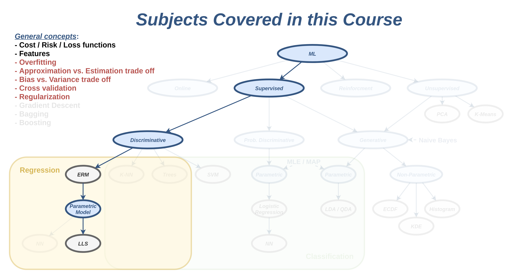

## רקע

בהרצאה הקודמת הצגנו את בעיית החיזוי שבה אנו מנסים לבנות חזאי על סמך מדגם. והגדרנו את ההמוגשים והסימונים הבאים:

- $\text{y}$ - ה labels - המשתנה האקראי שאותו אנו מנסים לחזות.
- $\mathbf{x}$ - ה measuments - הוקטור הארקאי שלפיו אנו מנסים לחזות.
- $\mathcal{D}=\{\boldsymbol{x}^{(i)}, y^{(i)}\}_{i=0}^N$ - המדגם (dataset) אשר כולל $N$ זוגות בלתי תלויים של דגימות של $\mathbf{x}$ ו $\text{y}$.
- $\hat{y}$ - תוצאת חיזוי כל שהיא.
- $\hat{y}=h(\boldsymbol{x})$ - פונקציית החיזוי.
- $C(h)$ - פונקציית המחיר אשר נותנת "ציון" לכל חזאי.

הצגנו את הדרך הנפוצה להגדיר את פונקציית המחיר כתוחלת של איזו שהיא פונקציית הפסד:

$$
C(h)=R(h)=\mathbb{E}[l(h(\mathbf{x}),y)]
$$

כאשר $l$ היא פונקציית הפסד כל שהיא ו $R$ מכונה פונקציית הסיכון.

הגדרנו את החזאי האופטימאלי כחזאי בעל הציון (המחיר) הנמוך ביותר:

$$
h^*=\underset{h}{\arg\min}\ C(h)\left(=\underset{h}{\arg\min}\ \mathbb{E}[l(h(\mathbf{x}),\text{y})]\right)
$$

הבעיה עם פונקציית המחיר הזו הינה התוחלת על הפילוג לא ידוע. הצגנו פתרון בשם ERM אשר מתמודד עם בעיה זו על ידי החלפת התוחלת בתוחלת אמפירית על המדגם

$$
h^*_{\mathcal{D}}=\underset{h}{\arg\min}\ \frac{1}{N}\sum_i l(h(\boldsymbol{x}^{(i)}),y^{(i)})
$$

בנוסף ציינו שלרוב אנו נגביל את עצמו לחזאיים אשר מגיעים ממשפחה מצומצמת של חזאיים וציינו שהדרך הנפוצה לעשות זאת הינה על ידי שימוש במודל פרמטרי $h(\boldsymbol{x};\boldsymbol{\theta})$:

$$
\boldsymbol{\theta}^*_{\mathcal{D}}=\underset{\boldsymbol{\theta}}{\arg\min}\ \frac{1}{N}\sum_i l(h(\boldsymbol{x}^{(i)};\boldsymbol{\theta}),y^{(i)})
$$

ראנו בתרגול מספר דוגמאות לשימוש בשיטה זו בשילוב עם מודל לינארי.

בהרצאה זו נדון בבעית ה overfitting הנובעת מבחירת החזאי על סמך המדגם, נסביר את החשיבות של השימוש במודל פרמטרי לצורך ההתמודדות עם הבעיה ונציג שיטה נוספת להתמודדות עם הבעיה בשם רגולריזציה.

## הכללה ובעיית ה overfitting

### הכללה (generalization)

> בעיית הלמידה בתחום של מערכות לומדות היא בעיית הכללה, שבה אנו מנסים על סמך דוגמאות להסיק מסקנות לגבי ההתנהגות הכללית של המערכת.

לדוגמא בבעיות supervised learning מטרה שלנו היא לבנות חזאי אשר יוכל לבצע חיזויים טובים על דגימות שלא ראינו לפני.

#### הערכת הביצועיים / יכולת ההכללה של חזאי

בכדי להעריך את יכולת ההכללה של החזאי שבנינו, זאת אומרת את הביצועיים של החזאי על דגימות כלליות שלא הופיעו בשלב הלימוד, נוכל להשתמש במדגם נוסף המכיל דגימות שונות מהמדגם שבו השתמשנו בשלב הלימוד. לשם כך עלינו להקצות מבעוד מועד חלק מתוך המדגם הנתון לנו לטובת הערכת הביצועיים של החזאי. זאת אומרת שאת המדגם (ה dataset) שלנו אנו נחלק לשני חלקים:

- **Train set** - $\mathcal{D}_\text{train}$ - המדגם שעלפיו אנו נבנה את חזאי.
- **Test set** - $\mathcal{D}_\text{test}$ - המדגם שבו נשתמש על מנת להעריך את ביצועי החזאי.

כאשר אנו עובדים עם פונקציית מחיר מסוג risk נוכל להעריך את ביצועי החזאי על ה test set בעזרת התוחלת האמפירית:

$$
\text{test score}=\frac{1}{N}\sum_{\boldsymbol{x}_{(i)},y_{(i)}\in\mathcal{D}_{\text{test}}} l(h(\boldsymbol{x}_{(i)}),y_{(i)})
$$

##### גדולו של ה test set

אנו נרצה לבחור את ה test set כך שיהיה מספיק גדול בכדי שההערכה של ביצועים תהיה כמה שיותר מדוייקת אך לא גדול מידי, בכדי לשמור את ה train set כמה שיותר גדול. כאשר המדגם גדול מספיק לא תהיה לנו בעיה להפריש test set שהוא גדול מספיק אך עדיין מהווה אחוז קטן מכלל הדגימות. כאשר המדגם לא מאד גדול מקובל לפצל את המדגם ל 80% train ו 20% test.

### דוגמא: הערכת ביצועים

נסתכל על הדומא מההרצאה הקודמת שבה ניסינו לחזות את זמן הנסיעה בכביש החוף על מספר המכוניות שנמצאות על הכביש. ננסה להעריך את ביצועיו של המודל הלינארי על ידי הפרדת המדגם ל train set ו test set:

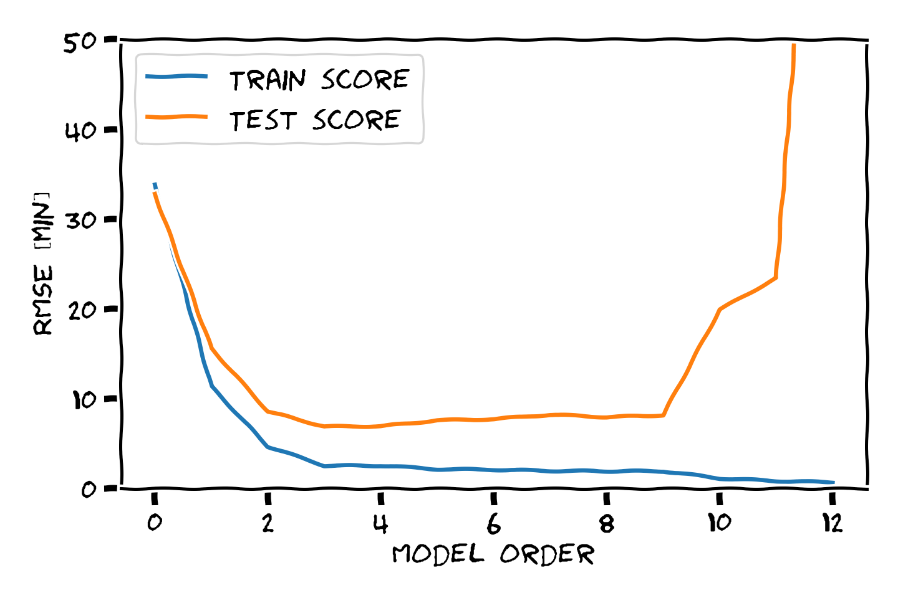

נקבע את הפרמטרים של המודל על פי ה train set ו בדוק את הביצועים על ה test set:

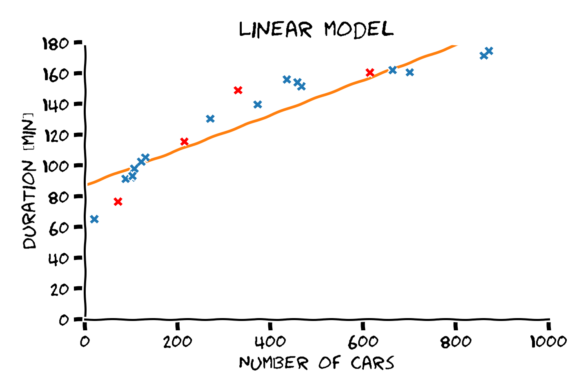

את הביצועים של החזאי נחשב על פי RMSE (שורש של השגיאה הריבועית הממוצעת). לשם השוואה נחשב את הביצועים גם על ה train set. נקבל שגיאות של:

- Train score (RMSE): 11.34 min
- Test scroe (RMSE): 15.58 min

### Overfitting (התאמת יתר)

> תופעת ה overfitting מתארת את המצב שבו המודל הנלמד לומד מאפיינים מסויימים אשר מופיעים רק במדגם אשר לא מייצגים את התכונות של הפילוג האמיתי. תופעה זו פוגעת ביכולת ההכללה של המודל.

נסתכל על האילוסטרציה הבאה:

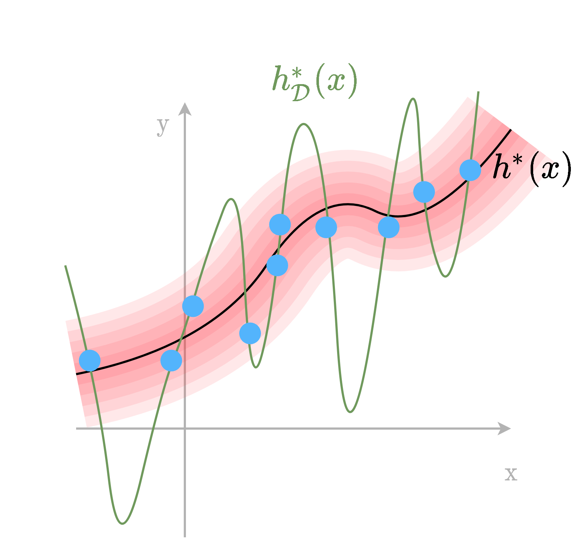

בדוגמא זו אנו מנסים לבנות חזאי על סמך הנקודות הכחולות אשר נדגמו מתוך הפילוג האדום. החזאי האופטימאלי אשר מקטין את שגיאת החיזוי בהתייחס לכלל הפילוג הינו החזאי אשר עובר במרכז הפילוג. לעומת זאת, כאשר נתייחס רק לנקודות הכחולות, החזאי האופטימאלי על נקודות אלו יהיה חזאי אשר עובר דרך כל הנקודות הכחולות ומשיג שגיאת חיזוי 0 על נקודות אלה.

במרחב החזאים הדבר נראה כך:

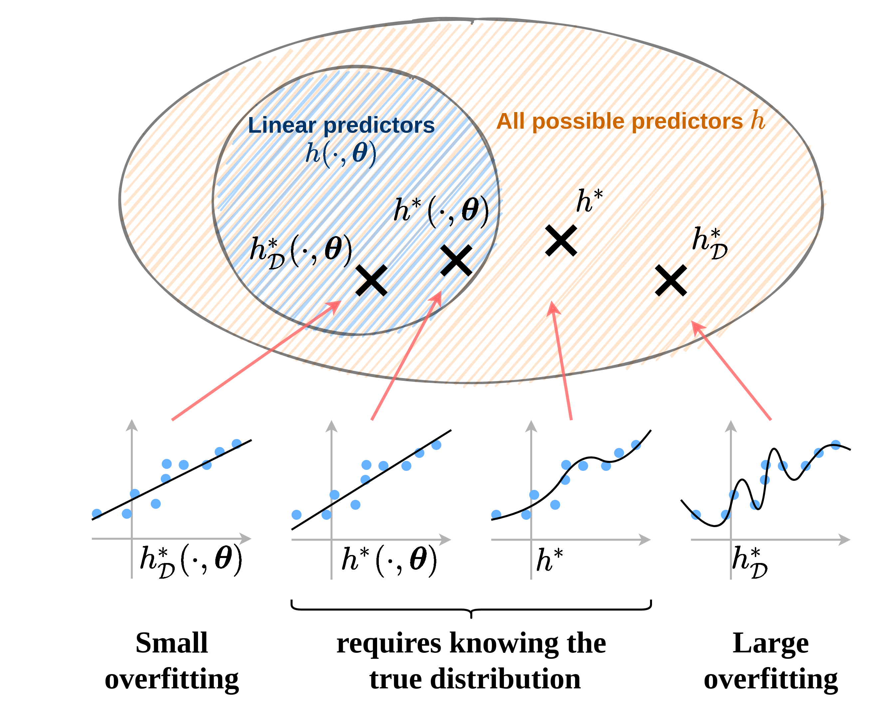

#### דוגמא: overfitting

ראינו בהרצאה הקודמת שכאשר ננסה להתאים פולינום מסדר גבוה לדגימות נקבל פונקציה שמאד "משתוללת". הסיבה לכך היא שהמודל עושה overfitting:

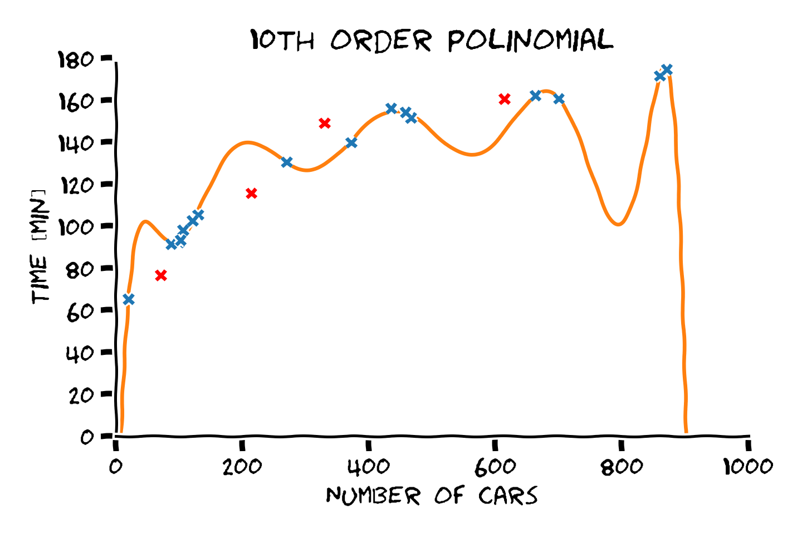

אם ננסה להעריך את הביצועים של המודל נקבל ביצועים מאד טובים על ה train set ופחות טובים על ה test set. בעבור פולינום מסדר 12 אשר מופיע בשרטוט נקבל:

- Train score (RMSE): 0.66 min
- Test scroe (RMSE): 103.77 min

## הגבלת המודל ופירוק שיגאת החיזוי

כאשר אנו לא מגבילים את צורתו של החזאי אנו למעשה מאפשרים לו לקבל כל צורה שהיא כל עוד הוא עובר בין הנקודות של המדגם. בכדי לשלוט בצורה שבה הוא מתנהג נוכל להגביל את המרחב נממנו נרצה לבחור את החזאי. נרצה לבחור משפחה מצומצמת של חזאיים אשר מתנהגים בצורה רצויה. כפי שציינו קודם, אנו לרוב נעשה זאת על ידי שימוש במודל פרמטרי.

נשתמש בהגדרה של שני החזאי הבאים (אשר הופיעו גם בהרצאה הקודמת):

- $h^*(\boldsymbol{x};\boldsymbol{\theta})$: החזאי ה**פרמטרי** האופטימאלי. החזאי בעל הביצועים הטובים ביותר (ממזער את פונקציית המחיר) מבין כל החזאים במשפחה הפרמטרית.

- $h^*_{\mathcal{D}}(\boldsymbol{x};\boldsymbol{\theta})$: החזאי המושערך: החזאי הפרמטרי אשר נבנה על סמך מדגם מסויים $\mathcal{D}$.

נוסיף את שני החזאי האלו לשרטוט ממקודם:

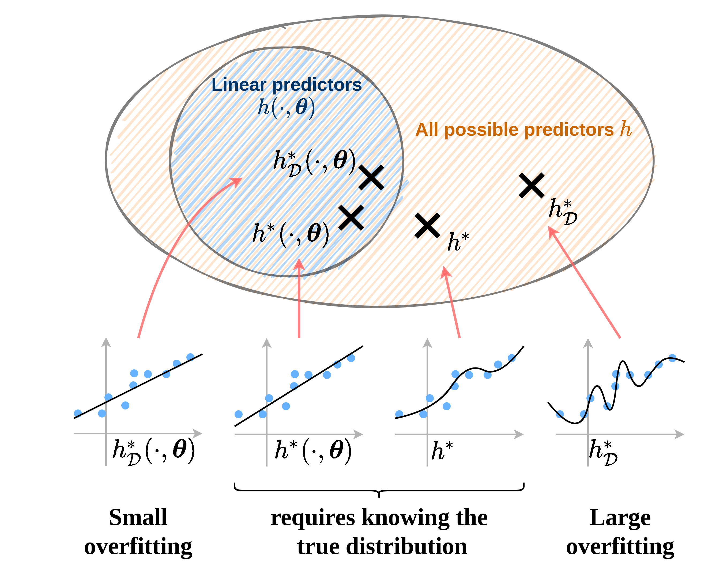

### יכולת הביטוי של מודל פרמטרי

כאשר עובדים עם מודלים פרמטריים אנו נעסוק הרבה ב**יכולת הביטוי (expressiveness)** של המודל. אנו נשתמש במושג זה על מנת לתאר עד כמה גדול מרחב הפונקציות שאותו יכול מודל פרמטרי מסויים לייצג. בקורס זה אנו נשתמש במושג זה בצורה איכותית ולא כמותית:

- כאשר מודל פרמטרי ידע לייצג משפחה מאד קטנה של מודלים, אנו נאמר שיש לו יכולת ביטוי נמוכה. לדוגמא: המודל הלינארי.
- כאשר מודל פרמטרי ידע לייצג **או לקרב בצורה טובה** מגוון רחב של מודלים אנו נאמר שיש לו יכולת ביטוי גבוה. לדוגמא: פולינום מסדר מאד גבוהה.

מצד אחד אנו נרצה מודל עם יכולת ביטוי גבוה על מנת שיוכל לקרב בצורה טובה את החזאי האידאלי, אך מצד שני נרצה להגביל אותו מכיוון שיכולת יצוג גבוה תאפשר גם הרבה overfitting. בכדי להבין טוב יותר את ההשפעה של יכולת הביטוי של המודל נסתכל על הפירוק הבא של הגורמים המשפיעים על שגיאת החיזוי.

### Aprroxiamtion-estimation decomposition

כאשר עובדים עם מודל פרמטרי ניתן להתייחס לשני גורמים אשר מונעים מאיתנו למצוא את החזאי האופטימאלי $h^*(\boldsymbol{x})$.

1. **Approximation error - שגיאת קירוב**: השגיאה עקב ההגבלה של המודל לממודל פרמטרי מסויים. שגיאה זו נובעת מההבדל בין החזאי האופטימאלי $h^*(\boldsymbol{x})$ לבין החזאי **הפרמטרי** האופטימאלי $h^*(\boldsymbol{x},\boldsymbol{\theta})$.
2. **Estimation error - שגיאת השיערוך**: השגיאה הנובעת מהשימוש במדגם כתחליף לפילוג האמיתי וחוסר היכולת שלנו למצוא את המודל הפרמטרי האופטימאלי. שגיאה זו נובעת מההבדל בין המודל הפרמטרי האופטימאלי $h^*(\boldsymbol{x},\boldsymbol{\theta})$ למודל הפרמטרי המשוערך על סמך המדגם $h_{\mathcal{D}}^*(\boldsymbol{x},\boldsymbol{\theta})$.

שני השגיאות הנ"ל הם הגורמים להבדלים בין החזאי המשוערך והחזאי האופטימאלי. כאשר נרצה לדבר על השגיאה הכוללת אנו נוסיף גם את הרכיב של השגיאה אשר נובע מההבדל בין תוצאת החיזוי האופטימאלית של $h^*(\boldsymbol{x})$ והערך של ה $y$ שאותו אנו מסנים לחזות.

3. **Noise - ה"רעש" של התויות**: השגיאה שהחזאי האופטימאלי צפוי לעשות. שגיאה זו נובעת מהאקראיות של התויות $y$ אשר מונעת מאיתנו לחזותו במדויק.

#### Approximaion-estimation Tradeoff: קביעת יכול הביטוי של המודל הפרמטרי

בעזרת פירוק זה של השגיאה נוכל לנסות להבין את השיקולים הקיימים בבחירת יכולת הביטוי של מודל פרמטרי. ככל שיכולת הביטוי של המודל תהיה גדולה יותר כך המרחק בין $h^*(\boldsymbol{x};\boldsymbol{\theta})$ לבין $h^*(\boldsymbol{x})$ יקטן ושגיאת הקירוב תקטן. הבעיה היא שלרוב ככל שיכולת הביטוי גדלה כך גדלה גם שיגאת השיערוך. נציג זאת הגרף הסכימתי הבא:

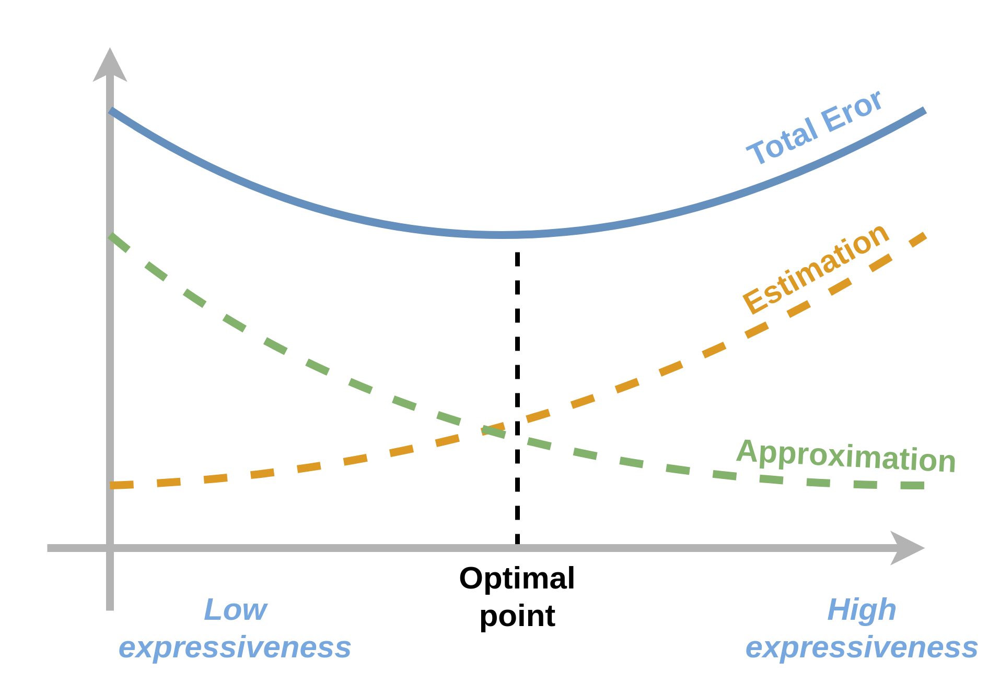

בשני קצוות הגרף הנקבל שגיאה כוללת מאד גדולה ומטרתינו תהיה למצוא את נקודת הפשרה בין שני הקצוות שבה השגיאה הכוללת היא הקטנה ביותר. תלות זו מוכרת בשם **approximation-estimation tradeoff**.

### Bias-variance decomposition

פירוק ה approximation-estiamtion הוא פירוק רעיוני אשר מתאר את הגורמים השונים לשגיאה. במקרה הספציפי שבו פונקציית המחיר בבעיה הינה MSE ניתן להשתמש גם בפירוק אלטרנטיבי אחר. בפירוק זה ניתן להראות ניתן לפרק את שגיאת ה MSE לסכום של שלושה רכיבי שגיאה. לפני שנראה את הפירוק עצמו נגדיר ראשית חזאי נוסף אותו נכנה החזאי הממוצע.

#### המדגם כמשתנה אקראי והחזאי הממוצע

כאשר אנו מערכיים את הביצועיו של מודל נתון כל שהוא, אנו מקבלים תוצאה אשר תלויה לא רק בשיטה ובמודל הפרמטרי שבהם השתמשנו אלא גם במדגם הספציפי שאיתו עבדנו. זאת מיכוון שהחזאי שאותו נקבל תלוי בצורה חזקה במדגם הנתון. במלים אחרות, בעבור מדגמים שונים אנו נצפה לקבל ביצועים שונים אפילו בעבור אותה השיטה ואותו מודל פרמטרי.

באופן כללי ניתן להסתכל על המדגם כעל משתנה אקראי שכן הוא מיוצר על ידי $N$ הגרלות של דגימות מתוך הפילוג. משום שהמדגם אקראי כך יהיו גם החזאי ושגיאת ה MSE. בכדי להסיר את התלות במדגם נסתכל על השגיאת MSE הממוצעת אשר מתקבלת לאחר לקיחה של התוחלת על כל המדגמים האפשריים.

$$
\text{average MSE}=\mathbb{E}_{\mathcal{D}}\left[\mathbb{E}\left[(h_{\mathcal{D}}(\mathbf{x})-\text{y})^2\right]\right]
$$

לשם הבהירות, אנו נשתמש בסימון $\mathbb{E}_\mathcal{D}$ בכדי לציין תוחלת על פני המדגמים האפשריים. (תוחלת ללא סימון $\mathbb{E}$ תהיה לפי $\mathbf{x}$ ו $\text{y}$). כמובן שלא ניתן בפועל לחשב את התחולת על פני כל החזאים השונים, אך כלי זה ישמש אותו לשם ההבנה של הגורמים לשגיאת החיזוי.

נגדיר את החזאי הממוצא כחזאי אשר מחזיר את החיזוי השהוא הממוצא על פני כל החזאיים אשר נבנו ממדגמים שונים:

$$
\bar{h}(x)=\mathbb{E}_{\mathcal{D}}\left[h_{\mathcal{D}}(x)\right]
$$

### הפירוק

כעת נוכל להיעזר בהגדרה של החזאי ממוצע בכדי לרשום את שגיאת ה MSE הממוצעת כסכום על שלושה איברי שגיאה:

$$
\mathbb{E}_{\mathcal{D}}\left[
    \mathbb{E}\left[(h_{\mathcal{D}}(\text{x})-y)^2\right]
\right]
=
\mathbb{E}\left[
    \underbrace{\mathbb{E}_{\mathcal{D}}\left[(h_{\mathcal{D}}(\text{x})-\bar{h}(\text{x}))^2\right]}_{\text{Variance}}
    +\underbrace{(\bar{h}(\text{x})-h^*(\text{x}))^2}_{\text{Bias}^2}
    +\underbrace{(h^*(\text{x})-y)^2}_{\text{Noise}}
\right]
$$

כאשר $h^*(x)=\mathbb{E}\left[\text{y}|x\right]$ הוא החזאי האופטימאלי של בעיית החיזוי.

בפירוק הזה:

- ה **variance** מודד את השונות של החזאים השונים המתקבלים ממדגמים שונים סביב החזאי הממוצע. זהו האיבר היחיד בפירוק אשר תלוי בפילוג של המדגם.
- ה **bias** מודד את ההפרש הריבועי בין החיזוי של החזאי הממוצע לבין החיזוי של החזאי האופטימאלי.
- ה **noise** (בדומה לפירוק הקודם) מודד את השגיאה הריבועית המתקבלת בעבור החיזוי האופטימאלי (אשר נובעת מהאקראיות של $y$).

בתרגול 4 אנו נראה את הפיתוח של פירוק זה.

בדומה ל approximation-estimation tradeoff ישנו גם **bias-variance tradeoff**

<!-- ## בחירת המודל הפרמטרי

אומנם המגבלה על החזאי תמנע לרוב מהמודל לייצג את החזאי האופטימאלי אך היא גם תמנע ממנו מלייצג הרבה פונקציות אשר מתנהגות בצורה לא רצויה. ההגדרה של מהיא צורה רצויה או לא תלויה בידע המקדים שיש לנו על המערכת. שתי דוגמאות להתנהגויות שהם לרוב רצויות מההכרות עם ההתנהגות של העולם באופן כללי:

- אנו נצפה שהחזאי שנקבל יתנהג בצורה "חלקה" יחסית כך של $\boldsymbol{x}$-ים קרובים נקבל חיזויים יחסית קרובים.
- אנו נצפה שגם המגמה הכללית של החזאי לא תשתנה בצורה מהירה.

בהתאם להתנהגות הצפויה של החזאי אנו נבחר משפחה מצומצמת של חזאים שמקיימים את התכונות הרצויות. ככל שיהיה בידינו יותר מידע על ההתנהגות הצפויה של המערכת נוכל לבחור את המשפחה המצומצמת בצורה טובה יותר. דוגמא למקרה שבו יש לנו הרבה מידע על ההתנהגות של המערכת היא הדוגמא מהתרגול הראשון שבו ניסינו להתאים מעגל לסט של נקודות שידענו שיושבות קרוב למעגל מסויים. -->

## Hyper-parameters וסדר המודל

על מנת למצוא את המודל הפרמטרי בעל יכולת הביטוי האוטימאלית נרצה לבדוק סדרה של מודלים בעלי יכולת ביטוי אשר הולכת וגדלה. לדוגמא נרצה לבדוק פולינומים מסדר הולך וגדל על מנת מצוא את הסדר בעל יכולת ההכללה הטובה ביותר. לפני שנתאר את האופן שבו ניתן למצוא את הסדר הפולינום האופטימאלי נסביר מהם hyper-parameters.

### Hyper-parameters

Hyper parameters הינו שם כולל לכל הפרמטרים שמופיעים בשיטה או במודל הפרמטרי שבהם אנו משתמשים לבניית החזאי ואינם חלק מהפרמטרים שעליהם אנו מבצעים את האופטימיזציה. פרמטרים יכולים להיות לדוגמא:

- סדר הפולינום שבו אנו משתמשים.
- הפרמטר $\eta$ אשר קובע את גודל הצעד באלגוריתם ה gradient descent.
- פרמטרים אשר קובעים את המבנה של רשת נוירונים.

במקרים רבים יהיה לנו hyper-parameter אחד או יותר אשר שולט ביכולת הביטוי של המודל הפרמטרי, כדוגמאת המקרה של סדר הפולינום שבו נשתמש. אנו נכנה פרמטרים שכאלה **הסדר של המודל**.

### בחירת hyper-parameters בעזרת validation set

מכיוון שה hyper-parameters אינם חלק מבעיית האופטימיזציה אנו צריכים דרך אחרת לקבוע אותם. לרוב לנאלץ לקבוע את הפרמטרים האלו בשיטה של ניסוי וטעיה. זאת אומרת שהיה עלינו פשוט לנסות ערכים שונים ולבדוק את ביצועי המודל בעבור אותם ערכים.

מכיוון שאנו לא יכולים להשתמש ב test set בכדי לקבל החלטות על המודל אנו צריכים ליייצר מדגם ניפרד נוסף, שעליו נוכל לבחון את הביצועים המתקבלים בעבור ערכים שונים של ה hyper-parameters. אנו נייצר מדגם זה על ידי חלוקה נוספת של ה train set. על מנת לייצר ממנו מדגם חדש בשם validation set.

במקרים רבים לאחר קביעת ה hyper-parmaeters אנו נאחד חזרה את ה validation set וה train set ונאמן מחדש את המודל על המדגם המאוחד (כל הדגימות מלבד ה test set).

אם כן שלבי בחירת ה hyper-parameters יהיו:

- נפצל את ה train set ל train ו validation.
- נחזור על הפעולות הבאות בעבור סטים שונים של hyper-parameters:
  - נבנה את המודל על סמך ה train.
  - נשערך את ביצועי המודל על הvalidation
- נבחר את הפרמטרים עם הביצועים הטובים ביותר על ה validation.
- נאחד בחזרה את ה train וה validation.
- נבנה את המודל הסופי על סמך ה hyper-parameters שנבחרו.

## דוגמא: בחירת סדר המודל

נדגים את תהליך בעבור המקרה של בחירת סדר הפולינום בעבור מודל פרמטרי פולינומיאלי. נפצל את המדגם ל80% train set ו 20% validation set ו 20% test set.

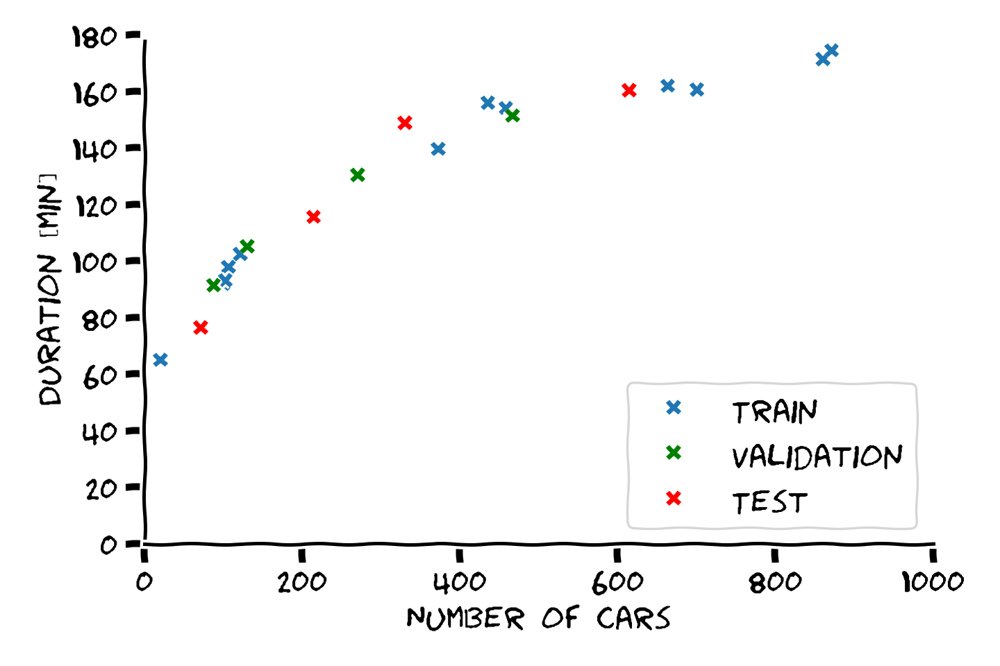

נבנה על סמך ה train set 11 חזאים המבוססים על מודל פולינומיאלי מסדרים בין $K=0$ ל $K=10$:

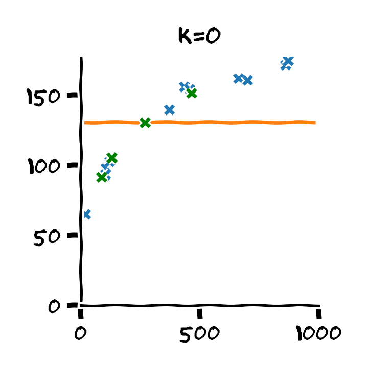

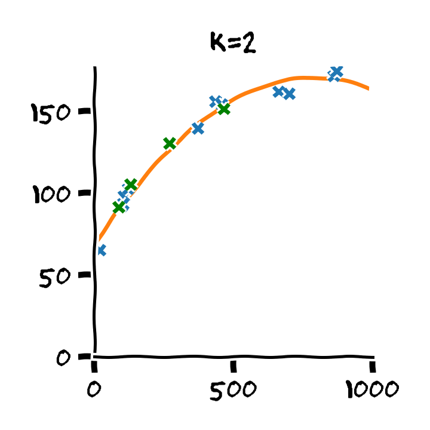

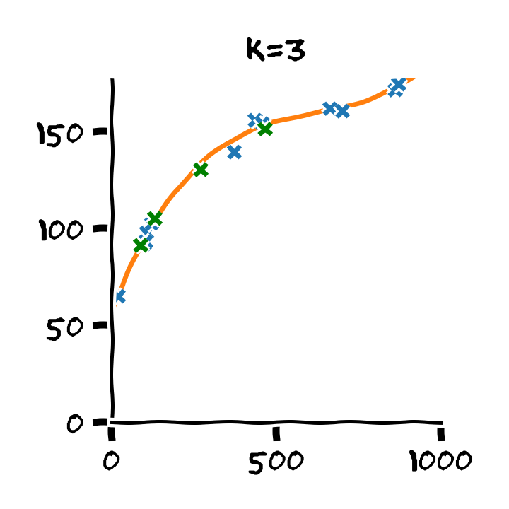

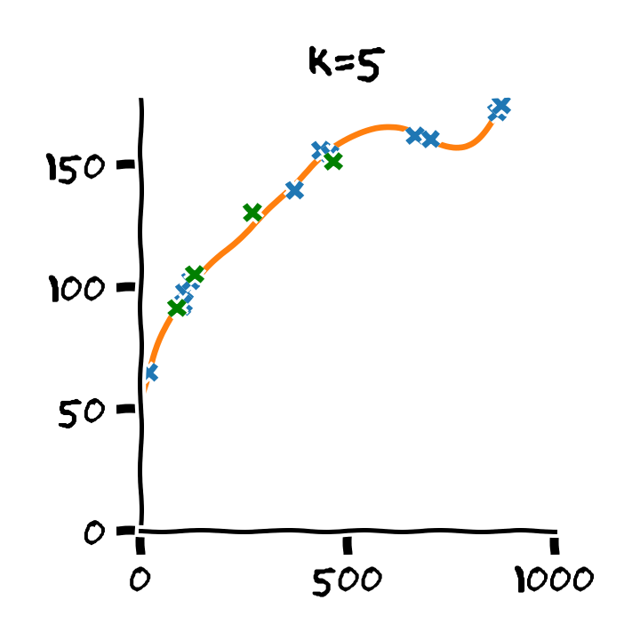

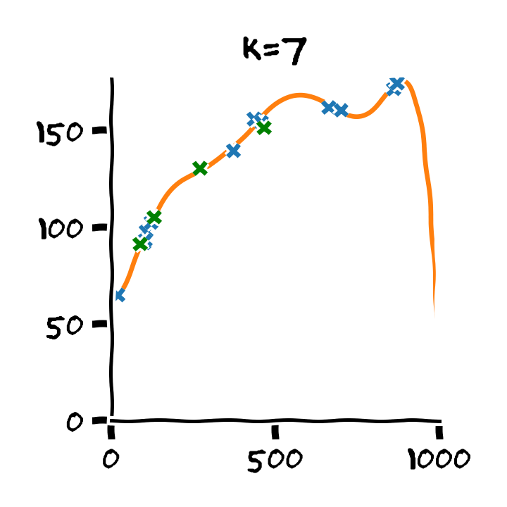

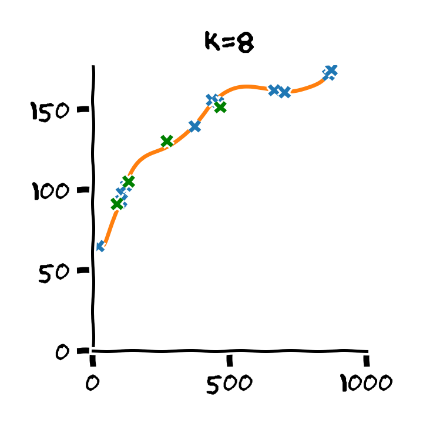

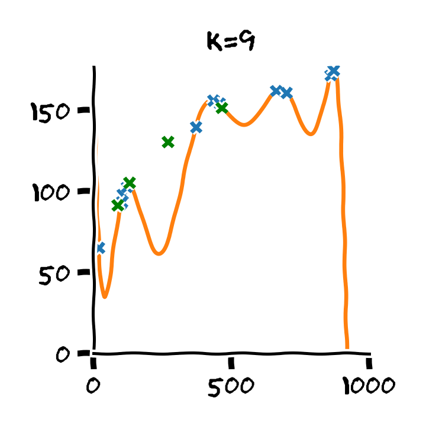

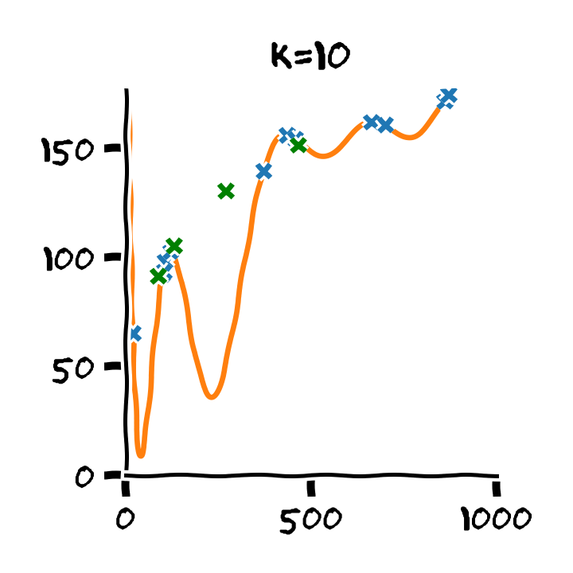

נבדוק את ביצועים של החזאים שקיבלנו על ה validation set. לשם השוואה נציג גם את הביצועים על ה train set:

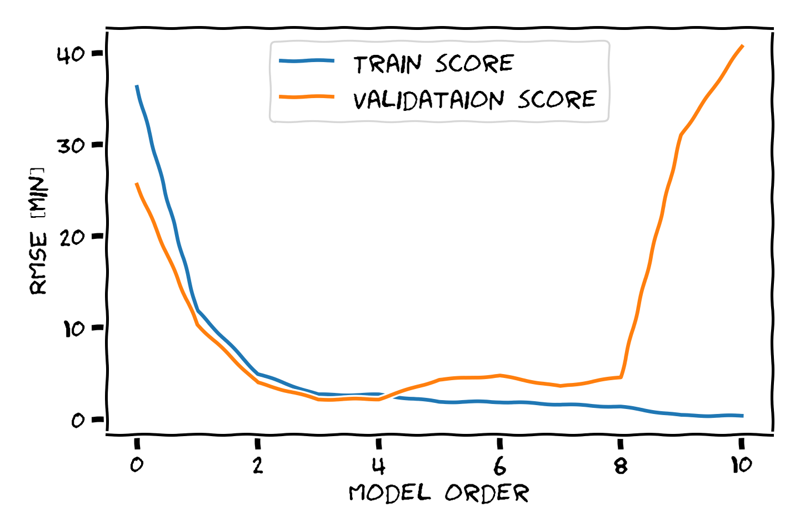

על סמך תוצאות אלו נבחר את סדר הפולינום בו נרצה להשתמש על פי הסדר של הפולינום אשר נתן את התוצאות הטובות ביותר על ה validation set. במקרה זה הסדר עם הביצועים הטובים ביותר הינו $K=3$. לאחר בחירת הסדר של הפולינום נוכל או להשתמש בחזאי שכבר אימנו מסדר זה או שנוכל לאמן חזאי חדש על מדגם שמכיל גם את ה train set וגם את ה validation set.

### Retrain

נבחר באופציה השניה ונאחד בחזרה את ה train set וה validation set ונאמן חזאי חדש על סמך מדגם זה:

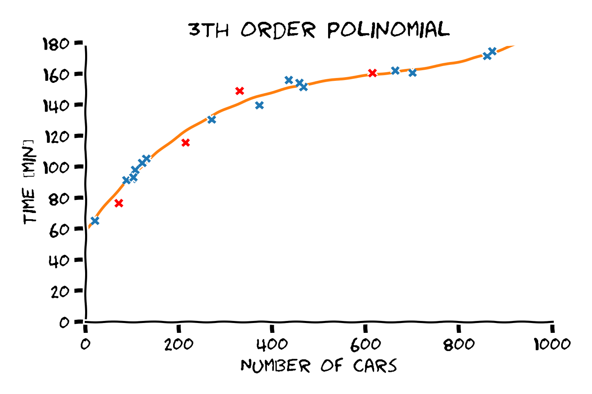

נעריך את הביצועים שלו על ה train set וה test set. נקבל:

- Train score (RMSE): 2.53 min
- Test scroe (RMSE): 6.88 min

## רגולריזציה

דרך אלטרנטיבית להקטנת שגיאת השיערוך (או ה variance) הינה בעזרת כלי אשר נקרא **רגולריזציה (regularization)**. הרעיון מאוחרי כלי זה הינו להתערב בבעיית האופטימיזציה שאותה אנו מנסים לפתור ולגרום לה "להעדיף" מודלים מסויימים על פני מודלים אחרים. דבר זה נעשה על ידי הוספת איבר נוסף המכונה **איבר רגולריזציה** לבעיית האופטימיזציה אשר נותן קנס גבוהה על שימוש במודלים מסויימים וקנס קטן יותר על מודלים אחרים. על ידי השימוש ברגולריזציה אנו למעשה מגבילים בצורה "רכה" את בעיית האופטימיזציה לסט מצומצם יותר של מודלים ועל ידי כך מקטינים את שגיאת השיערוך. ההגבלה הרכה הזו מקטינה מעט את הצורך להגביל את סדר המודל.

על מנת להוסיף רגולריזציה לבעיית האופטימיזציה עלינו לבחור פונקציה אשר מקבלת את הפרמטרים $\boldsymbol{\theta}$ של מודל מסויים ומחזירה את הקנס שאותו יש לתת למודל זה. את איבר הרגולריזציה אנו נוסיף לרוב לבעיית האופטימיזציה יחד עם קבוע כפלי $\lambda$ אשר יקבע את עוצמת (או משקל) הרגולריזציה באופן הבא:

$$
\boldsymbol{\theta}=\underset{\boldsymbol{\theta}}{\arg\min}\underbrace{f(\boldsymbol{\theta})}_{\text{The regular objective function}}+\lambda\underbrace{g(\boldsymbol{\theta})}_{\text{The regularization term}}
$$

המשקל אותו אנו נותנים לרגולריזציה $\lambda$ הוא hyper-parameter של האלגוריתם שאותו יש לקבוע בעזרת ה validation set.

הבחירה של פונקציית הרגולריזציה $g(\theta)$ היא בחירה קשה ותלויה באופי של הבעיה אותה אנו מנסים לפתור. במרבית המקרים הבחירה תיעשה בשיטה של ניסוי טעיה על פונקציות רגולריזציה נפוצות. שני הרגולריזציות הנפוצות ביותר הינן:

- $l_1$ - אשר מוסיפה איבר רגולריזציה של $g(\boldsymbol{\theta})=\lVert\boldsymbol{\theta}\rVert_1$.
- $l_2$ - אשר מוסיפה איבר רגולריזציה של $g(\boldsymbol{\theta})=\lVert\boldsymbol{\theta}\rVert_2^2$. (רגולריזציה זו מכונה לעיתים Tikhonov regularizaion)

רגולריזציות אלו מנסות לשמור את הפרמטריים כמה שיותר קטנים. המוטיבציה מאחורי הרצון לשמור את הפרמטרים קטנים הינה העובדה שבמרבית המודלים ככל שהפרמטרים קטנים יותר המודל הנלמד יהיה בעל נגזרות קטונות יותר, ולכן הוא ישתנה לאט יותר ופחות "ישתולל".

### ההבדל בין $l_1$ ו $l_2$

משום שהקנס ב $l_2$ גדל בצורה ריבועית עם הפרמטרים גודלו של הקנס יקבע בעיקר לפי הפרמטרים הגדולים של המודל ולפרמטרים והם אלו שיהיו מושפעים מהתוספת של הרגולריזציה.מכיוון שהרגולריזציה תתמקד בעיקר בלהקטין את הפרמטרים שגדולים יותר מהאחרים היא למעשה תנסה בפועל לשאוף שכל הפרמטרים יהיו קטנים אך באופן יחסית אחיד.

מנגד $l_1$ תפעל להקטין את כל האיברים כמה שיותר ללא קשר לגודלם. לדוגמא להקטנה של פרמטר מ2 ל-1 יהיה אותו אפקט כמו הקטנה של פרמטר מ100 ל-99. התוצאה בפועל הינה שרגולריזציית $l_1$ תגרום לפרמטרים הפחות חשובים להתאפס. במקרים רבים וקטור הפרמטרים שיתקבל מפתרון של בעיה שם רגולריזציית $l_1$ יכיל הרבה מאד אפסים. וקטורים כאלה מכונים לרוב וקטורים דלילים (sparse).

### דוגמא: בעיות LLS עם רגולריזציה

נדגים כיצד נראת בעיית ה LLS, אותה ראינו בהרצאה הקודמת, כאשר מוסיפים לה רגולריציית $l_1$ ו $l_2$:

#### Ridge regression: LLS + $l2$ regularization

$$
\boldsymbol{\theta}=\underset{\boldsymbol{\theta}}{\arg\min}\frac{1}{N}\sum_i(\boldsymbol{x}^{(i)\top}\boldsymbol{\theta}-y^{(i)})^2+\lambda\lVert\boldsymbol{\theta}\rVert_2^2
$$

גם לבעיה זו יש פתרון סגור והוא נתון על ידי:

$$
\boldsymbol{\theta}^*=(X^{\top}X+\lambda)^{-1}X^{\top}\boldsymbol{y}
$$

אנו נראה את הפתוח של פתרון זה בתרגיל 4.2.

##### LASSO: LLS + $l1$ regularization

(LASSO = Linear Absolute Shrinkage and Selection Opperator)

$$
\boldsymbol{\theta}=\underset{\boldsymbol{\theta}}{\arg\min}\frac{1}{N}\sum_i(\boldsymbol{x}^{(i)\top}\boldsymbol{\theta}-y^{(i)})^2+\lambda\lVert\boldsymbol{\theta}\rVert_1
$$

לבעיה זו אין פתרון סגור ויש צורך להשתמש באלגוריתמים איטרטיביים כגון gradient descent.

## דוגמא: Ridge regression

נחזור לדוגמא שלנו. נשתמש בפולינום מסדר 10 וב Ridge regression בשביל לקבוע את הפרמטרים שלו. ניקבע את פרמטר המשקל של הרגולריזציה להיות $\lambda=10^{-4}$. נקבל את החזאי הבא:

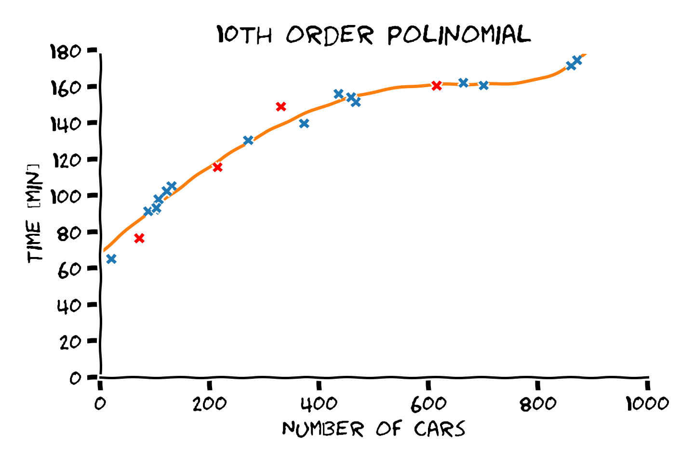

ביצועי החזאי יהיו:

- Train score (RMSE): 2.62 min
- Test scroe (RMSE): 6.83 min

