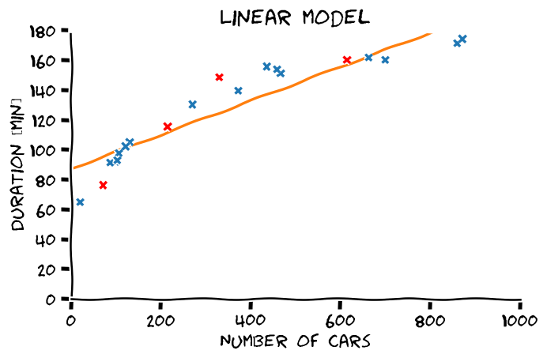

<section class="center">

# הרצאה 3 Generalization & overfitting

<a href="/assets/lecture03_slides.pdf" class="link-button" target="_blank">PDF</a>

</section><section>

## מה נלמד היום

</section><section>

## LLS בעבור פולינומים מסדרים שונים

</section><section>

## הכללה (generalization)

> בעיית הלמידה בתחום של מערכות לומדות היא בעיית הכללה, שבה אנו מנסים על סמך דוגמאות להסיק מסקנות לגבי ההתנהגות הכללית של המערכת.

לדוגמא בבעיות supervised learning מטרה שלנו היא לבנות חזאי אשר יוכל לבצע חיזויים טובים על דגימות שלא ראינו לפני.

</section><section>

## הערכת הביצועים / יכולת ההכללה של חזאי

- נרצה להעריך את יכולת ההכללה של החזאי שבנינו על דגימות שלא הופיעו בשלב הלימוד.
- נצטרך מדגם נוסף המכיל דגימות שונות מהמדגם שבו השתמשנו בשלב הלימוד.
- נקצה חלק מתוך המדגם לטובת הערכת הביצועים.

נחלק את המדגם שלנו לשני חלקים:

- **Train set** - $\mathcal{D}_\text{train}$ - המדגם שעל פיו אנו נבנה את חזאי.
- **Test set** - $\mathcal{D}_\text{test}$ - המדגם שבו נשתמש להעריכת ביצועים.

</section><section>

## הערכת הביצועים של פונקציית risk

כאשר פונקציית המחיר שלנו היא מהצורה של פונקציית risk, הערכת הביצועים תעשה בעזרת תוחלת אמפירית על ה test set:

$$
\text{test cost}=\frac{1}{N_{\text{test}}}\sum_{\boldsymbol{x}^{(i)},y^{(i)}\in\mathcal{D}_{\text{test}}} l(h(\boldsymbol{x}^{(i)}),y^{(i)})
$$

</section><section>

## גודלו של ה test set

- אנו נרצה שיהיה גדול מספיק בכדי שההערכה תהיה מדוייקת.
- לא גדול מדי, בכדי לשמור את ה train set כמה שיותר גדול.
- כאשר המדגם לא מאד גדול מקובל לפצל את המדגם ל 80% train ו 20% test.

</section><section>

## דוגמא: פיצול train-test

</section><section>

## דוגמא: הערכת ביצועים

- Train cost (RMSE): 11.34 min
- Test cost (RMSE): 15.58 min

</section><section>

## התלות בסדר הפולינום

</section><section>

## Overfitting (התאמת יתר)

> תופעת ה overfitting מתארת את המצב שבו המודל הנלמד לומד מאפיינים מסויימים אשר מופיעים רק במדגם ואינם הם אינם מייצגים את התכונות של הפילוג האמיתי שלפיו מפולגים המשתנים האקראיים אשר מהם נוצר המדגם במדגם. תופעה זו פוגעת ביכולת ההכללה של המודל.

</section><section>

## Overfitting (התאמת יתר)

</section><section>

## הגבלת המודל

- חזאי לא מוגבל יכול לקבל כל צורה כל עוד הוא עובר בין הנקודות של המדגם.
- בכדי לשלוט בצורה שבה הוא מתנהג נוכל להגביל את המרחב שבו אנו מחפשים.
- נעשה זאת על ידי שימוש במודל פרמטרי.

נסמן:

- $h(\boldsymbol{x};\boldsymbol{\theta}^*)$: החזאי ה**פרמטרי** האופטימאלי.

- $h_{\mathcal{D}}(\boldsymbol{x};\boldsymbol{\theta}^*)$: החזאי המשערך.

</section><section>

## הגבלת המודל

</section><section>

## יכולת הביטוי של מודל פרמטרי

**יכולת הביטוי (expressiveness)** של מודל מתייחסת לגודל של מרחב הפונקציות שאותו יכול המודל פרמטרי מסויים לייצג.

- **יכולת ביטוי נמוכה** -> יודע לייצג משפחה מצומצמת. לדוגמא: מודל לינארי.
- **יכולת ביטוי גבוהה** -> יודע לייצג **או לקרב** משפחה רחבה. לדוגמא: פולינום מסדר גבוהה.

איזה יכולת ביטוי נעדיף?

- מצד אחד אנו נרצה מודל עם יכולת ביטוי גבוהה על מנת שיוכל לקרב את החזאי האידאלי.
- מצד שני יכולת יצוג גבוה תאפשר הרבה overfitting.

</section><section>

## Hyper-parameters

Hyper parameters הינו שם כולל לכל הפרמטרים שמופיעים בשיטה או במודל הפרמטרי, אך הם אינם חלק ממשתני האופטימיזציה בשלב האופטימיזציה על ה train-set.

 

דוגמאות:

- סדר הפולינום שבו אנו משתמשים.
- הפרמטר $\eta$ אשר קובע את גודל הצעד באלגוריתם ה gradient descent.
- פרמטרים אשר קובעים את המבנה של רשת נוירונים.

</section><section>

## סדר המודל

 
 
 

כאשר hyper-parameter מסויים שולט ביכולת הביטוי של המודל הפרמטרי, כדוגמאת המקרה של סדר הפולינום, נכנה פרמטר זה **הסדר של המודל**.

</section><section>

## בחירת hyper-parameters   בעזרת validation set

- hyper-parameters אינם חלק מבעיית האופטימיזציה.
- אנו צריכים דרך אחרת לקבוע אותם.
- לרוב נאלץ לקבוע אותם בעזרת ניסוי וטעיה.
- לא נוכל להשתמש ב test set לצורך זה.
- נצטרך לייצר מדגם נפרד חדש.
- נפצל עוד את ה train set ל:
  - train set חדש.
  - validation set.

</section><section>

## שלבי הבחירה של hyper-prameters

- נפצל את ה train set ל train ו validation.
- נחזור על הפעולות הבאות בעבור ערכים שונים של ה hyper-parameters:
  - נבנה את המודל על סמך ה train.
  - נשערך את ביצועי המודל על הvalidation.
- נבחר את הפרמטרים עם הביצועים הטובים ביותר על ה validation.
- נאחד בחזרה את ה train וה validation.
- נבנה את המודל הסופי על סמך ה hyper-parameters שנבחרו.

</section><section>

## דוגמא: פיצול train-validation-test

</section><section>

## התלות בסדר הפולינום

</section><section>

## דוגמא: Retrain

- Train cost (RMSE): 2.53 min
- Test cost (RMSE): 6.88 min

</section><section>

## Approximation-estimation decomposition

נתייחס לשני גורמים אשר מונעים מאיתנו למצוא את החזאי האופטימאלי $h^*(\boldsymbol{x})$:

 

**Approximation error - שגיאת קירוב**

השגיאה עקב ההגבלה למשפחה פרמטרית מסויימת.

נובעת מההבדל בין $h^*(\boldsymbol{x})$ לבין $h^*(\boldsymbol{x},\boldsymbol{\theta})$.

 

**Estimation error - שגיאת השיערוך**

השגיאה הנובעת מהשימוש במדגם כתחליף לפילוג האמיתי.

נובעת מההבדל בין $h^*(\boldsymbol{x},\boldsymbol{\theta})$ לבין $h_{\mathcal{D}}^*(\boldsymbol{x},\boldsymbol{\theta})$.

</section><section>

## Aprroxiamtion-estimation decomposition

</section><section>

## Noise error

כאשר נרצה לדבר על השגיאה הכוללת נרצה להתייחס להבדל בין החיזוי של החזאי המשוערך $h^*_{\mathcal{D}}(\boldsymbol{x};\boldsymbol{\theta})$ ו $y$.

 

במקרים אלו נוסיף גורם שלישי:

 
 

**Noise - ה"רעש" של התויות**

השגיאה שהחזאי האופטימאלי צפוי לעשות.

שגיאה זו נובעת מהאקראיות של התויות $y$.

</section><section>

## Approximation-estimation Tradeoff

- ככל שיכולת הביטוי תגדל המרחק בין $h^*(\boldsymbol{x};\boldsymbol{\theta})$ לבין $h^*(\boldsymbol{x})$ יקטן ושגיאת הקירוב תקטן.

- בלא מעט מקרים ככל שיכולת הביטוי תגדל גם שגיאת השיערוך תגדל.

</section><section>

## המדגם כמשתנה אקראי

- ביצועיו של חזאי כל שהוא תלויים לא רק בשיטה ובמודל הפרמטרי אלא גם במדגם שאיתו עבדנו.
- בעבור מדגמים שונים אנו מצפים לקבל ביצועים שונים.
- ניתן להסתכל על המדגם כמשתנה אקראי.
- בכדי לבטל את התלות במדגם נמצע את הביצועים על פני כל המדגמים האפשריים.

$$
\text{average cost}=\mathbb{E}_{\mathcal{D}}\left[R(h_{\mathcal{D}})\right]
$$

כאשר $\mathbb{E}_\mathcal{D}$ היא התוחלת על פני המדגמים האפשריים

</section><section>

## החזאי הממוצע

לצורך הדיון התיאורטי על מרכיבי שגיאת החיזוי נגדיר את החזאי הממוצע באופן הבא:

 

החזאי אשר מחזיר את החיזוי הממוצע על פני כלל החזאים המתאימים למדגמים השונים:

$$
\mathbb{E}_{\mathcal{D}}\left[h_{\mathcal{D}}(x)\right]
$$

גודל זה אינו ניתן לחישוב! 

</section><section>

## Bias-variance decomposition

- פירוק יותר פרקטי.
- מתאים לפונקציית מחיר של MSE.

$$
\begin{aligned}
&\mathbb{E}_{\mathcal{D}}\left[
    \mathbb{E}\biggl[(h_{\mathcal{D}}(\text{x})-y)^2\right]
\right]\\
&\qquad=
\mathbb{E}\left[
    \underbrace{\mathbb{E}_{\mathcal{D}}\left[(h_{\mathcal{D}}(\text{x})-\mathbb{E}_{\mathcal{D}}\left[h_{\mathcal{D}}(x)\right])^2\right]}_{\text{Variance}}
    +\underbrace{(\mathbb{E}_{\mathcal{D}}\left[h_{\mathcal{D}}(x)\right]-h^*(\text{x}))^2}_{\text{Bias}^2}\\
    &\qquad+ \underbrace{(h^*(\text{x})-y)^2}_{\text{Noise}}\biggr]
\end{aligned}
$$

כאשר

- $h^*(x)=\mathbb{E}\left[\text{y}|x\right]$.

</section><section>

## Bias-variance decomposition

$$
\begin{aligned}
&\mathbb{E}_{\mathcal{D}}\left[
    \mathbb{E}\biggl[(h_{\mathcal{D}}(\text{x})-y)^2\right]
\right]\\
&\qquad=
\mathbb{E}\left[
    \underbrace{\mathbb{E}_{\mathcal{D}}\left[(h_{\mathcal{D}}(\text{x})-\mathbb{E}_{\mathcal{D}}\left[h_{\mathcal{D}}(x)\right])^2\right]}_{\text{Variance}}
    +\underbrace{(\mathbb{E}_{\mathcal{D}}\left[h_{\mathcal{D}}(x)\right]-h^*(\text{x}))^2}_{\text{Bias}^2}\\
    &\qquad+\underbrace{(h^*(\text{x})-y)^2}_{\text{Noise}}
\biggr]
\end{aligned}
$$

</section><section>

## רגולריזציה

- דרך אלטרנטיבית להקטין את שגיאת השיערוך / variance.
- הרעיון: להתערב בבעית האופטימיזציה על מנת לגרום לה "להעדיף" מודלים מסויימים.
- זוהי הגבלה "רכה" של משפחת המודלים.
- מאפשר שימוש במודלים פרמטרים בעלי יכולת ביטוי גבוהה יותר.

</section><section>

## רגולריזציה

השיטה: נוסיף איבר אשר יתן "קנס" למודלים לא רצויים.

$$
\boldsymbol{\theta}=\underset{\boldsymbol{\theta}}{\arg\min}\underbrace{f(\boldsymbol{\theta})}_{\text{The regular objective function}}+\lambda\underbrace{g(\boldsymbol{\theta})}_{\text{The regularization term}}
$$

הפרמטר $\lambda$ קובע את עוצמת (או משקל) הרגולריזציה.

הוא hyper-parameter שיש לקבוע בעזרת ה validation set.

</section><section>

## רגולריזציה - אילוסטרציה

</section><section>

## בחירת הרגולריזציה

- באופן כללי, הבחירה של פונקציית הרגולריזציה $g(\theta)$ תלויה באופי הבעיה.
- לרוב הבחירה תהיה בשיטה של ניסוי וטעיה על פונקציות רגולריזציה נפוצות.
- פונקציות הרגולריזציה הנפוצות ביותר הינן:
  - $l_1$ - מוסיף $g(\boldsymbol{\theta})=\lVert\boldsymbol{\theta}\rVert_1$.
  - $l_2$ - מוסיף $g(\boldsymbol{\theta})=\lVert\boldsymbol{\theta}\rVert_2^2$.

רגולריזציית $l_2$ מכונה גם Tikhonov regularizaion

</section><section>

## $l_1$ ו $l_2$ הדומה

- מנסות לשמור את הפרמטרים כמה שיותר קטנים.
- מוטיבציה: מודל בעל פרמטרים קטנים יותר יהיה לרוב בעל נגזרות קטונות יותר, ולכן הוא יהיה יותר "חלק".

</section><section>

## $l_1$ ו $l_2$ השונה

### $l_2$

- גדל בצורה ריבועית עם הפרמטרים
- ינסה להקטין בעיקר את הפרמטרים הגדולים ופחות את הקטנים.
- הרגולריזציה שואפת לפרמטרים בעלי גודל יותר אחיד.

</section><section>

## $l_1$ ו $l_2$ השונה

### $l_1$

- תפעל להקטין את כל האיברים כמה שיותר ללא קשר לגודלם.
- רגולריזציית $l_1$ תגרום לפרמטרים הפחות חשובים להתאפס.
- וקטור הפרמטרים שיתקבל יכיל הרבה מאד אפסים - וקטור דליל (sparse).

</section><section>

## Ridge regression: LLS + $l2$ regularization

$$
\boldsymbol{\theta}=\underset{\boldsymbol{\theta}}{\arg\min}\frac{1}{N}\sum_i(\boldsymbol{x}^{(i)\top}\boldsymbol{\theta}-y^{(i)})^2+\lambda\lVert\boldsymbol{\theta}\rVert_2^2
$$

גם לבעיה זו יש פתרון סגור והוא נתון על ידי:

$$
\boldsymbol{\theta}^*=(X^{\top}X+\lambda)^{-1}X^{\top}\boldsymbol{y}
$$

אנו נראה את הפתוח של פתרון זה בתרגיל 4.2.

</section><section>

## LASSO: LLS + $l1$ regularization

$$
\boldsymbol{\theta}=\underset{\boldsymbol{\theta}}{\arg\min}\frac{1}{N}\sum_i(\boldsymbol{x}^{(i)\top}\boldsymbol{\theta}-y^{(i)})^2+\lambda\lVert\boldsymbol{\theta}\rVert_1
$$

לבעיה זו אין פתרון סגור ויש צורך להשתמש באלגוריתמים איטרטיביים אשר מבוססים על gradient descent.

 
 
 

LASSO = Linear Absolute Shrinkage and Selection Operator

</section><section>

## דוגמא: Ridge regression

- $\lambda=10^{-4}$
- Train cost (RMSE): 2.62 min
- Test cost (RMSE): 6.83 min

</section>

