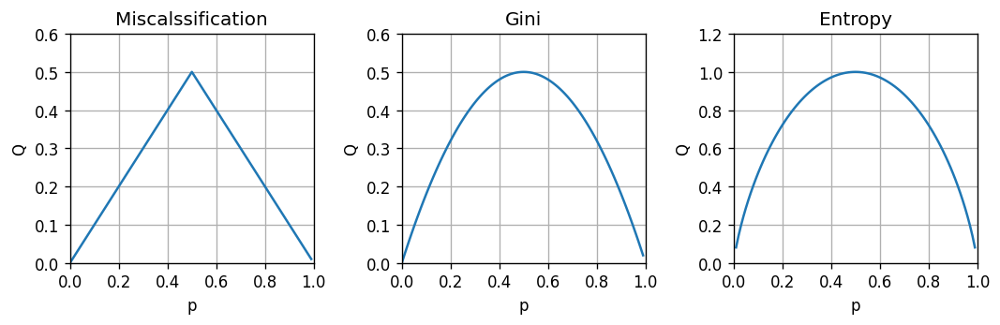
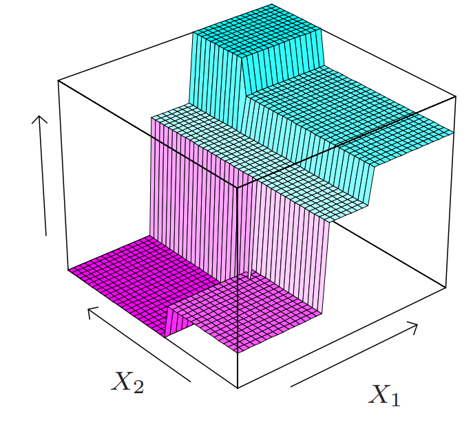

<section class="center">

# הרצאה 4 - סיווג דיסקרימינטיבי

<a href="/assets/lecture04_slides.pdf" class="link-button" target="_blank">PDF</a>

</section><section>

## מה נלמד היום

</section><section>

## בעיות סיווג

בעיות supervised learning שבהם $\text{y}$ משתנה אקראי בדיד אשר יכול לקבל סט ערכים סופי (לרוב קטן).

 

דוגמאות לבעיות סיווג:

- מערכת להתראה על מכשולים בכביש (הולך רגל, קרבה לרכב שמלפנים וכו') מתוך תמונות ממצלמת דרך.
- מערכת לסינון דואר זבל.
- מערכת לזיהוי כתב יד בתמונה.
- מערכות speech-to-text אשר הופכות קטע אודיו למילים.
- מערכת לזיהוי פנים בתמונות.

</section><section>

## ההבדל מבעיות רגרסיה

- החזאי ייצר ערכים בדידים ולכן:
  - לא נוכל להשתמש במודלים רציפים כפי שהם.
  - אין נגזרת ולכן לא נוכל לגזור ולהשוות ל-0 או להשתמש ב gradient descent.
- לרוב לא תהיה משמעות למרחק בין $\hat{y}$ ל $y$, לכן לא רלוונטי להשתמש בפונקציות מחיר כמו MSE אשר מתייחסות לגודל שגיאת החיזוי.

</section><section>

## גישה דיסקרימינטיבית - תזכורת

- אנו מנסים לבנות חזאי בעל ביצועים טובים ככל האפשר על המדגם.
- כדי ולהגביל את התאמת היתר (overfitting) אנו נשים מגבלות על פונקציית החיזוי.

בהרצאה הקרובה נכיר שתי שיטות דיסקרימינטיביות לפתרון בעיות סיווג.

</section><section>

## בעיה לדוגמא - זיהוי הונאות בכרטיסי אשראי

נסיון לסווג עסקאות כחשודות בהונאה על סמך פרטי העסקה:

- הסכום.
- מרחק העיסקה (נניח המיקום של החנות) מהעיסקה האחרונה.
- מרחק העיסקה מהכתובת של הלקוח.
- השעה ביום.
- אופי המוצרים שהחנות מוכרת (מכולת, מוצרי חשמל, ביגוד, רכב, נדל"ן, וכו')

ניתן לעשות זאת בעזרת supervised learning על ידי שימוש במדגם דוגמאות מהעבר.

</section><section>

## בעיה לדוגמא - המדגם

 בהרצאה זו נשתמש בעיה זו כדוגמא. נתייחס למדגם הבא:

</section><section>

## בעיה לדוגמא - החזאי

נרצה למצוא חזאי אשר יחזה עיסקאות חשודות על פי מרחק ומחיר. לדוגמא:

</section><section>

## חלוקה ל train-test

נחלק את המדגם ל80% train ו 20% test:

 

</section><section>

## שמות וסימונים בבעיות סיווג

- חזאי = מסווג (classifier) = discriminator (מקטלג).
- **מחלקות** - הערכים השונים שאותם התוויות יכול לקבל.
- $C$ - מספר המחלקות.
- **סיווג בינארי** - בעיות בהם $C=2$.
- סימון המחלקות בסיווג בינארי:
  - $y\in\{0,1\}$  או   $y\in\{-1,1\}$.
- סימון המחלקות בסיווג לא בינארי:
  - $y\in\{1,2,\dots,C\}$ או $y\in\{0,1,\dots,C-1\}$.

</section><section>

## Misclassification rate - תזכורת

$$
R(h)=\mathbb{E}\left[I\{h(\mathbf{x})\neq\text{y}\}\right]
$$

**שאלה**: מתי פונקציה כזו אינה סבירה? 
- פונקציית המחיר הנפוצה בבעיות סיווג.
- מחשבת את התדירות שבה צפוי החזאי לבצע שגיאות חיזוי (ללא קשר לגודל השגיאה).
- פונקציית risk עם zero-one-loss:

    $$
    l(\hat{y},y)=I\{\hat{y}\neq y\}
    $$

</section><section>

## החזאי האופטימאלי של miscalssification

בהינתן הפילוג המשותף של $\mathbf{x}$ ו $\text{y}$ ניתן לחשב את החזאי האופטימאלי:

$$
h^*(\boldsymbol{x})=\underset{y}{\arg\max}\ p(y|\mathbf{x}=\boldsymbol{x})
$$

- מחזיר את ה $\text{y}$ הכי סביר (הכי שכיח, ה mode) בהסתברות של $\text{y}$ בהינתן $\mathbf{x}$. 

נקרא גם: "מסווג בייס" (Bayes Classifier).

</section><section>

## 1-NN (1-Nearest Neighbours)

אלגוריתם סיווג המבצע חיזוי על סמך השכן הכי קרוב במדגם:

 

נתון מדגם $\mathcal{D}=\{\boldsymbol{x}^{(i)},y^{(i)}\}$ ודגימה נוספת $\boldsymbol{x}$ (אשר אינה חלק מהמדגם) שעליה נרצה לבצע את החיזוי. נבצע חיזוי בשיטת ה 1-NN באופן הבא:

1. נמצא את האינדקס של השכן הקרוב $i=\underset{i}{\arg\min} \lVert \boldsymbol{x}^{(i)}-\boldsymbol{x}\rVert_2$
2. החיזוי יהיה התווית של השכן הקרוב ביותר $\hat{y}=y^{(i)}$

**שאלה**: איך שונה שיטת סיווג זו משיטות קודמות שדיברנו עליהן? 

 

**הערה**: ניתן להחליף את המרחק האוקילידי (נורמת $l_2$) בממדי מרחק אחרים.

</section><section>

## דוגמא

נפעיל את 1-NN על הדוגמא שלנו:

 

</section><section>

## 1-NN עושה התאמת יתר

- חיזוי מושלם על הנקודות מהמדגם.
- יוצר איים סביב נקודות בודדות שכנראה מתאימות רק למדגם הספציפי.

</section><section>

## Voronoi Cells

- החזאי מורכב מאוסף של איזורים המכונים Voronoi cells המשוייכים לכל דגימה.  לכן סיבוכיות החזאי גדלה עם מספר הדוגמאות.
- איזור שבו החיזוי שהוא שהעיסקה חשודה מורכב מאוסף כל התאים של הדגימות של עסקאות חשודות.

</section><section>

## הערכת ביצועים

נבדוק את ביצועי החזאי על ה test set לפי פונקציית ה miscalssification rate:

$$
\text{test score}=\frac{1}{N_{\text{test}}}\sum_{\{\boldsymbol{x}^{(i)},y^{(i)}\}\in\mathcal{D}_{\text{test}}}I\{h(\boldsymbol{x}^{(i)})\neq y^{(i)}\}=0.12
$$

</section><section>

### התלות ביחידות של $\mathbf{x}$

- האלגוריתם תלוי במרחקים בין נקודות ולכן ישנה חשיבות ליחידות, או יותר נכון לסדר הגדול, של הרכיבים של $\boldsymbol{x}$.
- רכיבים בעלי גודל אופייני גדול יותר יקבלו משקל גדול יותר.
- באלגוריתם זה יש לדאוג שהרכיבים של $\boldsymbol{x}$ יהיו בערך באותו סדר גודל.

לדוגמא אם היינו מודדים את המרחק במטרים:

</section><section>

## K-NN

שיפור של 1-NN על ידי שימוש במספר שכנים.

1. נמצא את $K$ השכנים בעלי ה $\boldsymbol{x}^{(i)}$ הקרובים ביותר ל $\boldsymbol{x}$.
2. תוצאת החיזוי תהיה התווית השכיחה ביותר (majority vote) מבין $K$ התוויות של הדגימות שנבחרו בשלב 1.

במקרה של שיוויון בשלב 2:

- נשווה גם את המרחק הממוצע בין ה $\boldsymbol{x}$-ים של כל תווית ונבחר לפי הקבוצה עם המרחק הממוצע הקצר ביותר.
- במקרה של שיווון גם בין המרחקים הממוצעים, נבחר אקראית.

</section><section>

### דוגמא - 5-NN

- כמות האיים הצטמצמה.
- הגבולות בין האיזורים נעשו יותר חלקים.

</section><section>

## הערכת ביצועים

$$
\text{test score}=\frac{1}{N_{\text{test}}}\sum_{\{\boldsymbol{x}^{(i)},y^{(i)}\}\in\mathcal{D}_{\text{test}}}I\{h(\boldsymbol{x}^{(i)})\neq y^{(i)}\}=0.10
$$

הורדנו את תדירות השגיאות ל10%.

</section><section>

## בחירת ה $K$ האופטימאלי

נחלק את ה train set ל 75% train ו 25% validation:

 

</section><section>

## בחירת ה $K$ האופטימאלי

נחשב את הביצועים לכל $K$ על ה validation set:

 

</section><section>

## בחירת ה $K$ האופטימאלי

- זהו שוב ה bias-variance tradeoff (רק הפוך).
- בעבור 1-NN ישנה כמות גבוהה של התאמת יתר (ה train score יורד ל0).
- ככל שנגדיל את $K$ נמצע על איזור גדול יותר.
- מנקודה מסויימת יהיה רק איזור החלטה 1.

</section><section>

## 40-NN

- כמובן מקרה קיצוני של underfitting.
- החזאי מתאים למדגם רק באופן מאד גס וניתן עוד לשפר את החיזוי על ידי בחירת חזאי יותר מתאים למדגם.

</section><section>

## K-NN לבעיות רגרסיה

- ניתן להשתמש ב K-NN גם לפתרון בעיות רגרסיה, אם כי פתרון זה יהיה לרוב פחות יעיל.
- בבעיות רגרסיה אנו נבצע את החיזוי לפי הממוצע על התוויות של השכנים (במקום לבחור את תווית השכיחה).

</section><section>

## Decision trees (עצי החלטה)

- כלי נפוץ לקבלת החלטות.
- מופיעים גם מחוץ לתחום של מערכות לומדות.

</section><section>

## דוגמא לעץ החלטה

</section><section>

## עצי החלטה ב supervised learning

נשתמש בעץ החלטה כחזאי. 

יתרונות:

1. פשוט למימוש (אוסף של תנאי if .. else ..).
2. מתאים לעבודה עם משתנים קטגוריים (רכיבים של $\mathbf{x}$ שהם משתנים בדידים אשר מקבלים אחד מסט מצומצם של ערכים).
3. Explainable - ניתן להבין בדיוק מה היו השיקולים שלפיהם התקבל חיזוי מסויים.

</section><section>

### טרמינולוגיה

- **Root (שורש)** - נקודת הכניסה לעץ.
- **Node (צומת)** - נקודות ההחלטה / פיצול של העץ - השאלות.
- **Leaves (עלים)** - הקצוות של העץ - התשובות.
- **Branch (ענף)** - חלק מתוך העץ המלא (תת-עץ).
- **Depth (עומק)** - מספר הצמתים במסלול הארוך ביותר.

</section><section>

## הצמתים

לשם השמירה על הפשטות של העץ מקובל להגביל את השאלות בצמתים לתנאים פשוטים על **רכיב בודד** של $\mathbf{x}$:

- עבור רכיבים רציפים: נשתמש בתנאי מהצורה של $x_i>a$.
- עבור רכיבים קטגוריים: נפצל לכל אחד מהערכים שאותם יכול המשתנה לקבל.

</section><section>

## דוגמא

הפיצול הראשון בעץ הוא קטגורי לפי סוג המוצר ושאר הפיצולים הם לפי השוואה לסף מסויים.

</section><section>

## בניית עץ החלטה לסיווג

- ככל שנגדיל את כמות הצמתים תגדל יכולת הביטוי ונוכל להקטין את שגיאת החיזוי על המדגם.
- ככל שנגדיל את כמות הצמתים תגדל יכולת הביטוי וכך תגדל גם כמות התאמת היתר.
- דרך אחת למניעת התאמת יתר הינה להגביל את כמות הצמתים.
- במקרים רבים אנו נרצה להגביל את הכמות הצמתים גם משיקולים מעשיים של חישוביות וזיכרון.

**המטרה**: לבנות עץ אשר מקטין את שגיאת החיזוי תוך שימוש בכמה שפחות צמתים.

</section><section>

### בניית עץ החלטה לסיווג

- ישנם אלגוריתמים רבים לבניה של עץ החלטה. שני האלגוריתמים הנפוצים ביותר הם

   C4.5 (Ross Quinlan, 1986) ו CART (Breiman *et al.*, 1984).
- בקורס זה נתאר גירסה אשר מערבת בין שניהם.
- קיימות גם הרבה גרסאות לבניית עצי החלטה אשר מבוססות על שיטות אלו.

</section><section>

## בניית עץ החלטה לסיווג

נבנה את העץ בשני שלבים:

1. גידול העץ: ננסה לבנות עץ אשר מגיע לחיזוי הטוב ביותר שניתן על train set.
2. גיזום (pruning): נשתמש ב validation set על מנת להסיר צמתים.

</section><section>

## שלב 1: גידול העץ

- מציאת העץ אשר מגיע לחיזוי האופטימאלי בכמה שפחות רמות דורש לעבור על כל העצים האפשריים וזה לא מעשי.
- ננסה לבנות את העץ בצורה חמדנית (greedy).
- נתחיל מהשורש ונוסיף צמתים שנותנים את שגיאת החיזוי הקטנה ביותר על ה train set.

</section><section>

## דוגמא

נתחיל מהצומת הראשון:

</section><section>

## דוגמא

 

נחפש את התנאי האידאלי על ידי מעבר על כל הרכיבים של $\boldsymbol{x}$ עם כל הספים האפשריים.

</section><section>

## הספים האפשריים

כדי להבין מהם ערכי הסף שעליהם נרצה לעבור נסתכל לרגע על סידרת המספרים הבאה:

$$
\{3,5,8\}
$$

את סדרת המספרים הזו ניתן לפצל (על פי ערך סף) ל 2 פיצולים אפשריים על ידי:

- העברת סף בין ה 3 ל 5
- העברת סף בין ה 5 ל 8

לכן מספיק לבחון את:

- $x\geq 5$
- $x\geq 8$

</section><section>

## מציאת הפיצול האופטימאלי

נבדוק את כל הפיצולים האפשריים

התוצאה הטובה ביותר (0.16) מתקבל בעבור $x_{\text{Distance}}\geq 75$.

</section><section>

## הצומת הראשון

ולכן נבחר את הצומת להיות:

- לעלה השמאלי מגיעות 13 דגימות של הונאה ו 108 חוקיות. לכן נדרוש שהחיזוי יהיה שהעסקה חוקית.
- לעלה הימני מגיעות 18 דגימות של הונאה ו 11 חוקיות. לכן נדרוש שהחיזוי יהיה שהעסקה חשודה כהונאה.

</section><section>

## הצומת הראשון

</section><section>

## המשך הבניה

נוכל להמשיך כך ולהוסיף צמתים עד אשר נגיע לשגיאה 0 או לעומק מקסימאלי שאותו הגדרנו מראש. אך לפני כן אנו נכניס שינוי קטן באלגוריתם שישפר את ביצועיו.

</section><section>

## החלפת המדד

- בדוגמא שהראינו המדד שאותו ניסינו לשפר היה ה misclassification rate.
- מסתבר שניתן לשפר את ביצועי החזאי על ידי החלפה של מדד זה במדד שונה.
- נציג מדדים אלטרנטיבים שמנסים גם להסתכל קדימה ולנסות לשפר את המצב לפיצולים הבאים.

</section><section>

### הומגניות והטרוגניות

כדי לקבל בעלה זה מעט שגיאות חיזוי עלינו לדאוג שהפילוג של הדגימות יהיה מרוכז בערך אחד מסויים.

- **הומוגניות** - המקרה שבו התוויות מרוכזות סביב ערך יחיד (הפילוג טהור - pure).
- **הטרוגניות** - המקרה שבו התוויות מפולגות בצורה אחידה על פני כל הערכים

נשאף שהתווית בכל עלה יהיו כמה שיותר הומוגניות.

</section><section>

## מדדי חוסר הומוגניות

בהינתן משתנה דיסקרטי מסויים $\text{y}$ בעל פילוג $p(y)$, נגדיר:

- misclassification rate:

    $$
    Q(p)=1-\max_{y\in\{1,\dots,C\}}p(y)
    $$

- אינדקס Gini:

    $$
    Q(p)=\sum_{y\in\{1,\dots,C\}}p(y)(1-p(y))
    $$

- אנטרופיה:

    $$
    Q(p)(=H(p))=\sum_{y\in\{1,\dots,C\}}-p(y)\log_2 p(y)
    $$

</section><section>

## המקרה הבינארי

- Misclassification: $Q(p)=1-\max_{y\in\{1,\dots,C\}}p(y)$
- Gini: $Q(p)=\sum_{y\in\{1,\dots,C\}}p(y)(1-p(y))$
- Entropy: $Q(p)(=H(p))=\sum_{y\in\{1,\dots,C\}}-p(y)\log_2 p(y)$

</section><section>

## חוסר הומוגניות ממוצעת של עץ

נחשב את חוסר ההומוגניות הממוצעת של עץ באופן הבא:

1. נעביר את המדגם דרך העץ ונפצל אותם לתתי מדגמים.
    - נסמן את האינדקסים של הדגימות בעלה ה $j$ ב $\mathcal{I}_j$.
    - נסמן את כמות הדגימות בעלה ה $j$ ב $N_j$.
2. נחשב את הפילוג של התויות: $\hat{p}_{j,y}=\frac{1}{N_j}\sum_{i\in\mathcal{I}_j} I\{y_i=y\}$

3. נחשב את חוסר ההומוגניות של כל עלה: $Q(\hat{p}_j)$

4. הציון הכולל של העץ יהיה:

    $$
    Q_{\text{total}}=\sum_j \frac{N_j}{N}Q(\hat{p}_j)
    $$

כעת נוכל לבנות את העץ תוך נסיון למזער את ממדי השגיאה האלטרנטיבים במקום את ה misclassification rate. לרוב שימוש ב Gini או באנטרופיה יוביל לביצועים טובים יותר.

</section><section>

### בחזרה לדוגמא

נחפש שוב את הפיצול האופטימאלי בצומת הראשון בעזרת אינדקס Gini:

בדומה לקודם, נקבל כי התנאי הטוב ביותר הוא $x_{\text{Distance}}\geq 75$.

</section><section>

## הצומת הראשון

לכן הצומת ראשון ישאר:

</section><section>

## המשך

נמשיך באותה השיטה ונקבל

</section><section>

## המשך

החזאי לאורך הבניה יראה כך:

</section><section>

## הערכת ביצועים

נבדוק את ביצועי החזאי (עץ בעומק 7) על ה test set:

$$
\text{test score}=\frac{1}{N_{\text{test}}}\sum_{\{\boldsymbol{x}^{(i)},y^{(i)}\}\in\mathcal{D}_{\text{test}}}I\{h(\boldsymbol{x}^{(i)})\neq y^{(i)}\}=0.14
$$

</section><section>

## שלב שני - pruning (גיזום)

- אנו נשתמש ב validation set על מנת לאתר ענפים אשר אינם משפרים או פוגעים בביצעי החזאי.
- נעבור על כל הצמתים שבקצוות העץ ננסה להסירם.
- נבדוק את הציון המתקבל על ה validation set איתם ובלעדיהם.
- אם הנוכחות שלהם לא משפרת את ביצועי החזאי נסיר אותם.
- אנו נמשיך ונבדוק את הענפים בקצות העץ עד שלא יישארו צמתים שיש להסיר.

</section><section>

## דוגמא

העץ לפני ה pruning הינו:

</section><section>

## דוגמא

ואחריו הינו:

</section><section>

## הערכת ביצועים

$$
\text{test score}=\frac{1}{N_{\text{test}}}\sum_{\{\boldsymbol{x}^{(i)},y^{(i)}\}\in\mathcal{D}_{\text{test}}}I\{h(\boldsymbol{x}^{(i)})\neq y^{(i)}\}=0.08
$$

</section><section>

## Regression Tree

ניתן להשתמש בעצים גם לפתרון בעיות רגרסיה. במקרה של רגרסיה עם פונקציית מחיר של MSE, הבניה של העץ תהיה זהה מלבד שני הבדלים:

1. תוצאת החיזוי בעלה מסויים תהיה הערך הממוצע של התוויות באותו עלה. (במקום הערך השכיח)
2. את מדד החוסר ההומוגניות נחליף בשגיאה הריבועית של החיזוי של העץ.

 

</section>

