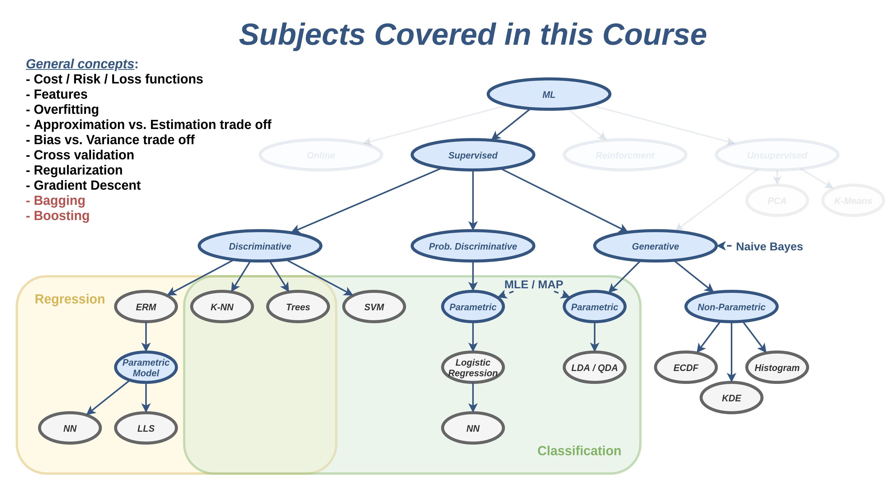
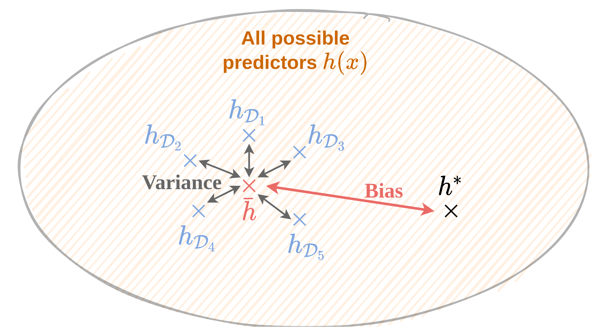

# הרצאה 5 - Bagging and Boosting

<a href="./slides/" class="link-button" target="_blank">Slides</a>
<a href="/assets/lecture05.pdf" class="link-button" target="_blank">PDF</a>
<a href="./code/" class="link-button" target="_blank">Code</a>

## מה נלמד היום

## Ensembles Methods

בהרצאה הזו נציג שתי שיטות אשר בעזרתן ניתן לשפר את הביצועים של אלגוריתמים קיימים על ידי שימוש בסט של חזאים. סט זה מכונה לרוב ensemble (מכלול).

### תזכורת הטיה ושונות

על מנת להבין מה שיטות אלו מנסות לעשות נזכיר שוב את המושגים של הטיה ושונות של חזאים. שני מושגים אלו כזכור מתייחסים לפילוג של שגיאת החיזוי **על פני מדגמים שונים**. נזכור כי כל מדגם $\mathcal{D}$ נבנה על ידי הגרלה של $N$ דגימות בלתי תלויות מתוך פילוג כל שהוא ולכן נוכל להתייחס למדגם עצמו כאל משתנה אקראי.

נניח שאנו משתמשים באלגוריתם אשר בהינתן מדגם $\mathcal{D}$ מייצר חזאי $h_{\mathcal{D}}(\boldsymbol{x})$.

הגדרנו בעבר את החיזוי הממוצע (על פני מדגמים) באופן הבא:

$$
\bar{h}(\boldsymbol{x})=\mathbb{E}_{\mathcal{D}}\left[h(\boldsymbol{x})\right]
$$

ואת החזיזוי האופטימאלי ב $h^*(\boldsymbol{x})$. ההטיה של החיזוי הוא ההפרש בין החיזוי הממוצע לחיזוי האופטימלי. השונות של החיזוי היא השונות של החיזוי כפונקציה של המדגם:

$$
\mathbb{E}_{\mathcal{D}}\left[(h_{\mathcal{D}}(\boldsymbol{x})-\bar{h}(\boldsymbol{x}))^2\right]
$$

ראינו כי:

- מודלים בעלי יכולת ייצוג נמוכה יסבלו לרוב מהתאמת חסר אשר יתבטא בהטיה גבוהה ושונות נמוכה (מדגמים שונים יניבו בערך את אותו המודל, אך המודל הזה יהיה רחוק מהחיזוי האופטימלי בגלל יכולת הייצוג המוגבלת).
- מודלים בעלי יכולת ייצוג גבוהה יסבלו לרוב מהתאמת יתר אשר יתבטא בשונות מאד גבוהה והטיה נמוך (מדגמים שונים יניבו מודלים מאד שונים, אך החיזוי הממוצע על פני מודלים אלו יהיה לרוב קרוב לחיזוי האופטימלי).

כעת נוכל להסביר מה bagging ו boosting מנסים לעשות:

- ב bagging ננסה לקחת מכלול של חזאים עם שונות גבוהה ולשלב ביניהם כדי ליצור חזאי עם שונות נמוכה יותר.
- ב boosting ננסה לקחת מכלול של חזאים עם הטיה גבוהה ולשלב ביניהם כדי ליצור חזאי עם הטיה נמוכה יותר.

## Bagging

כפי שציינו, ב Bagging נהיה מעוניינים לייצר מכלול (ensamble) של חזאים בעלי הטיה נמוכה אך שונות גבוהה ואז לשלב ביניהם על מנת להקטין את השונות. אחת הבחירות הנפוצות לחזאים שכאלה ב bagging היא עצי החלטה עמוקים (ללא pruning).

השם Bagging הוא הלחם של המילים **bootstrapping** ו **aggregation**, שהם שני שלבי השיטה שאותה נתאר כעת.

### גישה נאיבית

אנו יודעים מהסתברות שבמקרים בהם יש באפשרותינו לחזור על מדידה אקראית מסויימת מספר פעמים, באופן בלתי תלוי, נוכל להקטין את השונות של המדידה על ידי לקיחת הממוצע של מספר מדידות.

תיאורטית אם היינו יכולים לייצר כמה מדגמים בלתי תלויים, היינו יכולים לבנות חזאי עבור כל אחד מהמדגמים ולמצע על החזאים האלה על מנת להקטין את השונות של השגיאת החיזוי. בפועל לרוב יהיה בידינו רק מדגם יחיד שאיתו נצטרך לעבוד.

ניתן אומנם לייצר מספר מדגמים שונים על ידי חלוקת המדגם הקיים למספר מדגמים קטנים יותר. הבעיה עם שיטה זו הינה שבמרבית המקרים העובדה שהמדגמים התמקבלים הם משמעותית קטנים מהמדגם המקורי **תגדיל** מאד את שונות החזאים שניצור ובפועל נקבל חזאי ממוצע בעל שונות גדולה יותר.

### Bootstrapping

Bootstraping הינה אופציה חלופית לייצר מספר מדגמים מתוך מדגם הנתון אשר שומרת על גודל המדגם, אך מתפשרת על דרישת החוסר תלות בין המדגמים ובין הדגימות במדגם.

בשיטה זו אנו נייצר מדגמים חדשים על ידי דגימה מחדש של המדגם הנתון. זאת אומרת שבשביל לייצר מתוך מדגם נתון $\mathcal{D}$ בגודל $N$ מדגם חדש $\tilde{\mathcal{D}}$ בגודל $\tilde{N}$ אנו נגריל $\tilde{N}$ פעמים ערכים מתוך $\mathcal{D}$. הדגימה מתוך $\mathcal{D}$ הינה **עם חזרות**, זאת אומרת שניתן להגריל כל דגימה מתוך $\mathcal{D}$ מספר פעמים.

ניתן להראות שהסיכוי של דגימה כלשהיא מ $\mathcal{D}$ להופיע ב $\tilde{\mathcal{D}}$ הינה $1-(1-\frac{1}{N})^{\tilde{N}}$. כאשר $\tilde{N}=N$ ו $N\rightarrow\infty$, סיכוי זה הולך ל $1-e^{-1}\approx63\%$. זאת אומרת שכאשר נייצר מדגם על ידי bootstrapping מתוך מדגם גדול, המדגם החדש יכיל בערך 63% מהדגימות המקוריות עם כפילויות.

### Aggregation: בניית החזאים ושילובם לחזאי יחיד

ב Bagging אנו נעשה שימוש ב bootstrapping על מנת לייצר $M$ מדגמים חדשים $\{\tilde{\mathcal{D}}_m\}_{m=1}^M$ בגודל זהה למדגם המקורי, $\tilde{N}=N$. מספר המדגמים $M$ בהם נהוג להשתמש נע בין עשרות מדגמים לאלפים. עבור כל אחד מהמדגים $\tilde{\mathcal{D}}_m$ נבנה חזאי $\tilde{h}_m$. לרוב נשתמש באותה השיטה על מנת לבנות את כל החזאים.

לאחר הבניה של $M$ החזאים אנו נקבץ את כולם על מנת לקבל את החזאי הכולל בו נשתמש לחיזוי.

- **עבור בעיות רגרסיה**: אנו נמצע את תוצאת החיזוי של כל החזאים: $h(\boldsymbol{x})=\frac{1}{M}\sum_{m=1}^M \tilde{h}_m(\boldsymbol{x})$
- **עבור בעיות סיווג**: נבצע majority voting: $h(\boldsymbol{x})=\text{majority}(\{\tilde{h}_1(\boldsymbol{x}),\tilde{h}_2(\boldsymbol{x}),\dots,\tilde{h}_M(\boldsymbol{x})\})$

### הערכת ביצועיים - Out Of Bag Error Estimation (לקריאה עצמית - לא למבחן)

אחד היתרונות של bagging הינו העובדה שניתן להעריך את ביצועי המודל ללא צורך ב test / validation set. הרעיון הינו להשתמש בעובדה שכל אחד מהמדגמים החדשים מכיל רק חלק מהדגימות וניתן להשתמש בשאר הדגימות כדי להעריך את הביצועים שלהם.

עבור כל אחד מהמדגמים $\tilde{\mathcal{D}}_M$ נזהה את הדגימות שלא נכללו במדגם זה. דגימות אלו מוכנות **out-of-bag samples**. כפי שציינו קודם, עבור $N$ גדול, בערך 37% מהדגימות יהיו out-of-bag samples. כדי להעריך את ביצועי המודל נעבור על כל הדגימות במדגם ונעריך את השגיאה על דגימה זו תוך שימוש רק בחזאים שעבורם דגימה זו הינה out-of-bag samples, זאת אומרת, כל החזאים שלא ראו את הדגימה הזו בשלב האימון. ככל שמספר החזאים יהיה גדול יותר כך שיערוך זה של השגיאה יהיה טוב יותר.

### Random Forest (לקריאה עצמית - לא למבחן)

שיטה מאד נפוצה ויעילה לפתרון בעיות ב supervised learning נקראת random forest. שיטה זו היא למעשה שימוש בעצי החלטה בשילוב עם bagging בתוספת של שינוי אחד קטן. ב random forest כדי להגדיל את האקראיות ואת השוני בין העצים (מלבד העובדה שהם פועלים על מדגמים שונים) אנו נכניס אקראיות נוספת לתהליך הבניה של העץ.

אנו נעשה זאת על ידי בחירה מראש של קבוע שלם (hyperparameter)  $b$ אשר קטן מהמימד (מספר השדות / איברים) של $\boldsymbol{x}$. בכל בחירה של node אנו נגריל באקראי $b$ שדות מתוך כלל השדות של $\boldsymbol{x}$ ונגביל את הבחירה של כלל ההחלטה רק לשדות אלו. הגבלה זו אמורה להכניס הרבה מאד אקראיות לתהליך הבניה של העץ. שאר האלגוריתם של בניית העצים וה bagging לא משתנים.

#### מדוע השיטה עובדת? 
- הפחתה בהתאמת יתר
- דיוק גבוה
- חסינות בפני נותנים בעייתיים (כגון נותנים חסרים, outliers)
- קיימות הבטחות תיאורטיות (לא נדון)

## AdaBoost

בניגוד ל bagging, ב boosting ננסה להשתמש במכלול של חזאים בעלי **הטיה גבוהה** אך **שונות נמוכה** כדי ליצור חזאי כולל בעל הטיה נמוכה מבלי להגדיל באופן משמעותי את השונות. נתמקד בבעיות סיווג בינארי, ובדומה לדיון על SVM, גם כאן אנו נניח כי התווית בבעיה הם $\text{y}=\pm1$.

בקורס זה נציג את אחת משיטות ה boosting הפופולריות ביותר אשר נקראת AdaBoost (adaptive-boosting). בהינתן אוסף של חזאים $\tilde{h}(\boldsymbol{x})$ בעלי הטיה גובהה, שיטה זו מנסה לבנות חזאי מהצורה של:

$$
h(\boldsymbol{x})=\text{sign}\left(\sum_{m=1}^M\alpha_m \tilde{h}_m(\boldsymbol{x})\right)
$$

כך ש $h(\boldsymbol{x})$ יהיה בעל הטיה נמוכה. בפועל זאת אומרת שאנו מעוניינים לקחת מכלול של מסווגים שעושים התאמת חסר ולשלבם כדי לקבל מסווג אשר שמתאים בצורה טובה יותר לבעיה. בחירה פופולרית של מסווגים כאלה הינה עצי החלטה בעומק 1 המכונים **stumps** (עצים עם פיצול יחיד).

החידוש ש AdaBoost הכניס לעומת שיטת ה boosting שהייתה קיימת לפניו, הינה העובדה ש $\alpha_m$ תלוי ב $m$, זאת אומרת לכל $\tilde{h}$ יש את המקדם שלו. מכאן מגיע ה adaptive בשם של האלגוריתם.

### בעיית ה boosting המקורית (לקריאה עצמאית - לא למבחן)

במקור boosting פותח כמענה לשאלה תיאורתית שהתייחסה ליכולת לבנות מסווג "טוב" בהינתן אוסף של מסווגים "גרועים". על מנת לרשום זאת באופן יותר פורמלי נגדיר את המושגים של לומד חזק ולומד (weak / strong learner). עבור בעיית סיווג בינארית:

- אנו נאמר שאלגוריתם מסויים הוא **לומד חזק** אם לכל $\epsilon,\delta>0$ האלגוריתם מסוגל, בהינתן מדגם גדול מספיק, ללמוד פונקציית חיזוי שמקיימת $\text{Pr}\left(h(\mathbf{x})\neq \text{y}\right)<\epsilon$, בהסתברות גדולה מ $1-\delta$.
- אנו נאמר שאלגוריתם מסויים הוא **לומד חלש** אם לכל $\delta>0$ קיים $\gamma>0$ כך שהאלגוריתם מסוגל, בהינתן מדגם גדול מספיק, ללמוד פונקציית חיזוי שמקיימת $\text{Pr}\left(h(\mathbf{x})\neq \text{y}\right)<\tfrac{1}{2}-\gamma$, בהסתברות גדולה מ $1-\delta$.

במילים פשוטות יותר, לומד חזק הינו אלגוריתם אשר עבור מדגם מספיק גדול ייצר חזאי מדוייק כרצונינו ולומד חלש הינו אלגוריתם אשר מסוגל לייצר חזאי שהוא קצת יותר טוב מניחוש אקראי (הטלת מטבע).

בעזרת boosting הצליחו להוכיח את הטענה שניתן להפוך כל לומד חלש ללומד חזק על ידי בניית קומבינציה לינארית של מסווגים אשר נוצרו בעזרת הלומד החלש.

### החסם על ה misclassification rate

לפני שנציג את הבעיית האופטימיזציה שאותה AdaBoost מנסה לפתור, נראה תחילה שעבור חזאי מהצורה של

$$
h(\boldsymbol{x})=\text{sign}\left(\sum_{m=1}^M\alpha_m \tilde{h}_m(\boldsymbol{x})\right)
$$

ותוויות של $\text{y}=\pm1$, adht, שגיאת 0-1 האמפירית חסום מלמעלה על ידי:

$$
\frac{1}{N}\sum_{i=1}^N\exp\left(-\sum_{m=1}^M\alpha_m y^{(i)}\tilde{h}_m(\boldsymbol{x}^{(i)})\right)
$$

נתחיל בעובדה שעבור $y=\pm1$ וערך כל שהוא $z$ מתקיים:

$$
I\{\text{sign}(z)\neq y\}=
I\{y\cdot\text{sign}(z)\neq 1\}=
I\{\text{sign}(yz)\neq 1\} \leq
\exp(-yz)
$$

את השוויון האחרון ניתן להראות על ידי הפרדה לשני מקרים על פי הסימן של $yz$. כאשר נציב את המבנה של $h(\boldsymbol{x})$ לתוך הנוסחא של שגיאת 0-1 האמפירית ונשתמש באי השיוון הנ"ל על כל איבר בסכום נקבל כי:

$$
\begin{aligned}
\frac{1}{N}\sum_i I\{h(\boldsymbol{x}^{(i)})\neq y^{(i)}\}
&=\frac{1}{N}\sum_i I\left\lbrace\text{sign}\left(\sum_{m=1}^M\alpha_m\tilde{h}_m(\boldsymbol{x}^{(i)})\right)\neq y^{(i)}\right\rbrace\\
&\leq\frac{1}{N}\sum_{i=1}^N\exp\left(-y^{(i)}\sum_{m=1}^M\alpha_m\tilde{h}_m(\boldsymbol{x}^{(i)})\right)\\
&=\frac{1}{N}\sum_{i=1}^N\exp\left(-\sum_{m=1}^M y^{(i)}\alpha_m\tilde{h}_m(\boldsymbol{x}^{(i)})\right)
\end{aligned}
$$

כעת נציג את בעיית האופטימיזציה אותה מנסה AdaBoost לפתור.

### בעיית האופטימיזציה של AdaBoost

על פי החסם שהצגנו לעיל נוכל להניח כי מזעור של בעיית האופטימיזציה הבאה:

$$
\underset{\{\alpha_m,\tilde{h}_m\}_{m=1}^M}{\arg\min}\quad
\frac{1}{N}\sum_{i=1}^N\exp\left(-\sum_{m=1}^M\alpha_m y^{(i)}\tilde{h}_m(\boldsymbol{x}^{(i)})\right)
$$

תגרום כנראה להקטנת שגיאת 0-1 האמפירית ובכך להקטנת ההטיה. יתרה מזאת, אנו נראה בהמשך כי תחת תנאים מסויימים מתקיים שכאשר $M\rightarrow\infty$ החסם ידעך ל-0 וכך גם שגיאת 0-1 האמפירית.

הדרך שבה AdaBoost מנסה לפתור את בעיית האופטימיזציה הינה בצורה חמדנית. בשיטה זו אנו נגדיל את $M$ בהדרגה כאשר בכל פעם נחפש את ה $\alpha_m$ וה $\tilde{h}_m$ האופטימלים. נראה כעת כיצד כיצד ניתן למצוא את $\alpha_m$ ו $\tilde{h}_m$ האופטימליים בכל שלב.

נסתכל על המצב בו כבר מצאנו את כל ה $\alpha_m$ וה $\tilde{h}_m$ עד ל $M-1$, וכעת אנו רוצים למצוא את $\alpha_M$ ו $\tilde{h}_M$. אנו רוצים אם כן לפתור את בעיית האופטימיזציה הבאה:

$$
\alpha_M,\tilde{h}_M=\underset{\alpha,\tilde{h}}{\arg\min}\quad
\frac{1}{N}\sum_{i=1}^N\exp\left(-\sum_{m=1}^{M-1}\alpha_m y^{(i)}\tilde{h}_m(\boldsymbol{x}^{(i)})-\alpha y^{(i)}\tilde{h}(\boldsymbol{x}^{(i)})\right)
$$

בבעיית האופטימיזציה הזו $\alpha_M$ יכול לקבל כל ערך בעוד שאת $\tilde{h}_M$ עלינו לבחור מתוך מאגר מסווגים נתון. הדרך לפתור את בעיית האופטימיזציה הזו היא על ידי השלבים הבאים:

1. רישום מחדש של בעיית האופטימיזציה בצורה יותר פשוטה.
2. מציאת $\alpha_M$ כפונקציה של $\tilde{h}_M$ על ידי גזירה והשוואה ל-0.
3. הצבה של $\alpha_M$ בחזרה לבעיית האופטימיזציה על מנת לקבל ביטוי פשוט שאותו יש למזער כתלות ב $\tilde{h}_M$.

נציג כעת את הפתרון של בעיה זו, כאשר הפיתוח המלא של הפתרון מופיע בסוף ההרצאה. כדי לרשום את הפתרון בצורה פשוטה נגדיר את הגדלים הבאים ונסביר מה הם מייצגים:

$$
\begin{aligned}
\tilde{w}_i^{(M-1)}&=\exp\left(-\sum_{m=1}^{M-1}\alpha_m y^{(i)}\tilde{h}_m(\boldsymbol{x}^{(i)})\right)\\
w_i^{(M-1)}&=\frac{\tilde{w}_i^{(M-1)}}{\sum_{j=1}^N\tilde{w}_j^{(M-1)}}\\
\varepsilon(\tilde{h},\{w_i\})&=\sum_{i=1}^N w_iI\{y^{(i)}\neq \tilde{h}(\boldsymbol{x}^{(i)})\}
\end{aligned}
$$

נתחיל מהאיבר $w_i^{(M-1)}$ שהוא למעשה גרסא "מנורמלת" של $\tilde{w}_i^{(M-1)}$ כך שסכימה על כל איבריו לפי $i$ תיתן 1. ניתן למעשה להסתכל על איבר זה כעל איבר מישקול אשר נותן מישקל שונה לכל דגימה במדגם כך שסכום כל המשקלים יהיה 1. נמשיך לפונקציה $\varepsilon$ שהיא למעשה דומה מאד לביטוי של שגיאת 0-1 האמפירית של $\tilde{h}$ עד כדי המשקלים $w_i$ אשר נותנים חשיבות יתרה לחלק מהדגימות במדגם על פני דגימות אחרות. פונקציה זו היא למעשה **שגיאת 0-1 אמפירית ממושקלת**.

$\tilde{h}_M$ ו $\alpha_M$ האופטימליים בכל שלב יהיו נתונים על ידי:

$$
\tilde{h}_M
=\underset{\tilde{h}}{\arg\min}\ \varepsilon(\tilde{h},\{w_i^{(M-1)}\})
=\underset{\tilde{h}}{\arg\min}\ \sum_{i=1}^N w_i^{(M-1)}I\{y^{(i)}\neq \tilde{h}(\boldsymbol{x}^{(i)})\}
$$

ו

$$
\alpha_M=\frac{1}{2}\ln\left(\frac{1-\varepsilon_M}{\varepsilon_M}\right)
$$

כאשר סימנו:

$$
\varepsilon_M=\varepsilon(\tilde{h}_M,\{w_i^{(M-1)}\})
$$

אם כן, בכל שלב עלינו לבצע את הפעולות הבאות:

1. חישוב המשקלים $\{w_i^{(M-1)}\}$.
2. מציאת החזאי $\tilde{h}$ אשר ממזער את שגיאת 0-1 האמפירית הממושקלת.
3. חישוב המקדם $\alpha_M$.

בפועל ניתן לחשב את המשקלים של ה צעד ה $M$ כבר בסוף הצעד ה $M-1$. בנוסף ניתן להשתמש בעובדה ש:

$$
\tilde{w}_i^{(M)}=\tilde{w}_i^{(M-1)}\exp\left(-\alpha_M y^{(i)}\tilde{h}_M(\boldsymbol{x}^{(i)})\right)
$$

כדי להמנע מלחשב את הסכום על $m$ ולקצר את החישוב.

### האלגוריתם של AdaBoost

נסכם את שלבי האלגוריתם.

נתחיל מ $M=0$ ונאתחל את המשקולות ל $w_i^{(0)}=\frac{1}{N}$. בכל צעד נגדיל את $M$ על ידי ביצוע הפעולות הבאות:

1. נבחר את המסווג אשר ממזער את שגיאת 0-1 האמפירית הממושקלת:

    $$
    \tilde{h}_M=\underset{\tilde{h}}{\arg\min}\ \sum_{i=1}^N w_i^{(M-1)}I\{y^{(i)}\neq \tilde{h}(\boldsymbol{x}^{(i)})\}
    $$

2. נחשב את המקדם $\alpha_{M}$ של המסווג:

    $$
    \begin{aligned}
    \varepsilon_M&=\sum_{i=1}^N w_i^{(M-1)}I\{y^{(i)}\neq \tilde{h}_{M}(\boldsymbol{x}^{(i)})\}\\
    \alpha_M&=\frac{1}{2}\ln\left(\frac{1-\varepsilon_M}{\varepsilon_M}\right)
    \end{aligned}
    $$

3. נעדכן את וקטור המשקלים:

    $$
    \begin{aligned}
    \tilde{w}_i^{(M)}&=w_i^{(M-1)}\exp\left(-\alpha_M y^{(i)}\tilde{h}_M(\boldsymbol{x}^{(i)})\right)\\
    w_i^{(M)}&=\frac{\tilde{w}_i^{(M)}}{\sum_{j=1}^N \tilde{w}_j^{(M)}}
    \end{aligned}
    $$

### המשמעות של המשקלים

נסתכל על המשקל ללא הנרמול של הדגימה ה $i$. משקל זה שווה ל $\tilde{w}_i^{(M)}=\exp\left(-y^{(i)}\sum_{m=1}^{M}\alpha_m\tilde{h}_m(\boldsymbol{x}^{(i)})\right)$. משקל זה מציין למעשה עד כמה טוב האלגוריתם מסווג את הדגימה ה $i$. כאשר הסיווג הוא נכון ו $\sum_{m=1}^{M}\alpha_m\tilde{h}_m(\boldsymbol{x}^{(i)})$ באותו סימן של $y^{(i)}$ משקל זה יהיה קטן מ 1 ($e$ עם חזקה שלילית) וכאשר הסיווג הוא שגוי המשקל יהיה גדול מ 1. הגודל בערך מוחלט של $\sum_{m=1}^{M}\alpha_m\tilde{h}_m(\boldsymbol{x}^{(i)})$ קובע עד כמה המשקל יהיה גדול או קטן מ 1. גודל זה במובן מסויים מציין את הודאות של המסווג בחיזוי.

מכאן שתפקיד המשקלים הוא לדאוג שהאלגוריתם יבחר בכל צעד את החזאי אשר ישפר את הסיווג בעיקר על הדגימות שעליהן החזאי הנוכחי טועה.

### תנאי עצירה

באופן כללי בחלק גדול מהמקרים AdaBoost ילך ויקטין את שגיאת החיזוי על המדגם ככל שנגדיל את $M$ עד שהוא יגיע לסיווג מושלם. אך תכונה מפתיעה של AdaBoost (ואלגוריתמי boosting באופן כללי) הינה שהם ממשיכים לשפר את יכולת ההכללה שלהם אם ממשיכים להריץ את האלגוריתם גם אחרי שהוא הגיע לסיווג מושלם. בנוסף אלגוריתמים אלו לרוב יגדילו את כמות התאמת היתר שהחזאי עושה בקצב מאד איטי (אם בכלל). זאת אומרת שלרוב נרצה להריץ את האלגוריתם מספר רב של צעדים ולבדוק במהלך הריצה את הביצועים שלו על validation set. נעצור את האלגוריתם כאשר האלגוריתם יפסיק להשתפר או כאשר יגיע למספר צעדים מקסימאלי שנקבע מראש.

### קצב ההתכנסות של החסם

ראינו קודם כי שגיאת 0-1 האמפירית (הלא ממושקלת) של החזאי על המדגם חסומה על ידי ה הביטוי:

$$
\frac{1}{N}\sum_i I\{h(\boldsymbol{x}^{(i)})\neq y^{(i)}\}
\leq\frac{1}{N}\sum_{i=1}^N\exp\left(-\sum_{m=1}^M y^{(i)}\alpha_m\tilde{h}_m(\boldsymbol{x}^{(i)})\right)
$$

נראה כעת כי תחת תנאים מסויימים מובטח כי חסם זה ידאך ל-0 ככל שנגדיל את $M$.

#### טענה

נסמן את שגיאת 0-1 האמפירית הממושקלת בצעד ה $m$ ב $\varepsilon_m=\frac{1}{2}-\gamma_m$. נטען כי מתקיים הקשר הבא:

$$
\frac{1}{N}\sum_{i=1}^N\exp\left(-\sum_{m=1}^M y^{(i)}\alpha_m\tilde{h}_m(\boldsymbol{x}^{(i)})\right)
\leq\exp\left(-2\sum_{m=1}^M\gamma_m^2\right)
$$

מטענה זו ניתן להסיק שבמידה וקיים $\gamma$ כל שהוא אשר מקיים $\gamma_m\geq\gamma>0$ אזי מתקיים ש:

$$
\frac{1}{N}\sum_i I\{h(\boldsymbol{x}^{(i)})\neq y^{(i)}\}
\leq\frac{1}{N}\sum_{i=1}^N\exp\left(-\sum_{m=1}^M y^{(i)}\alpha_m\tilde{h}_m(\boldsymbol{x}^{(i)})\right)
\leq\exp\left(-2M\gamma^2\right)
$$

זאת אומרת, שקיים חסם לשגיאת 0-1 האמפירית אשר דועך באופן מעריכי עם $M$.

#### הוכחה

ראשית נראה כי

$$
\frac{1}{N}\sum_{i=1}^N\exp\left(-\sum_{m=1}^M y^{(i)}\alpha_m\tilde{h}_m(\boldsymbol{x}^{(i)})\right)
=\prod_{m=1}^M 2\sqrt{\varepsilon_m(1-\varepsilon_m)}
$$

נוכיח זאת באינדוקציה. עבור $M=0$ נקבל ש:

$$
\frac{1}{N}\sum_{i=1}^N\exp(0)=1
$$

כעת נניח שהקשר מתקיים עבור $M-1$:

$$
\frac{1}{N}\sum_{i=1}^N\exp\left(-\sum_{m=1}^{M-1} y^{(i)}\alpha_m\tilde{h}_m(\boldsymbol{x}^{(i)})\right)
=\prod_{m=1}^{M-1} 2\sqrt{\varepsilon_m(1-\varepsilon_m)}
$$

ונראה שמתקיים צעד האינדוקציה עבור $M$:

$$
\begin{aligned}
&\frac{1}{N}\sum_{i=1}^N\exp\left(-\sum_{m=1}^M y^{(i)}\alpha_m\tilde{h}_m(\boldsymbol{x}^{(i)})\right)\\
=&\frac{1}{N}\sum_{i=1}^N
\underbrace{
    \exp\left(-\sum_{m=1}^{M-1} y^{(i)}\alpha_m\tilde{h}_m(\boldsymbol{x}^{(i)})\right)
}_{=\tilde{w}_i^{(N-1)}}
\exp\left(-y^{(i)}\alpha_M\tilde{h}_M(\boldsymbol{x}^{(i)})\right)\\
=&\frac{1}{N}\sum_{i=1}^N \tilde{w}_i^{(N-1)} \exp\left(-y^{(i)}\alpha_M\tilde{h}_M(\boldsymbol{x}^{(i)})\right)\\
\end{aligned}
$$

מכיוון שמדובר בבעיית סיווג בינארית עם תוויות $\pm1$ הביטוי $y^{(i)}h_M(\boldsymbol{x}^{(i)})$ יכול לקבל רק אחד משני ערכים, $1$ כאשר $y^{(i)}=h_M(\boldsymbol{x}^{(i)})$ ו $-1$ אחרת. נפצל אם כך את הסכום לשני המקרים על ידי הוספה של פונקציות אינדיקטור:

$$
\begin{aligned}
=&\frac{1}{N}\sum_{i=1}^N \tilde{w}_i^{(N-1)} \exp\left(-y^{(i)}\alpha_M\tilde{h}_M(\boldsymbol{x}^{(i)})\right)
  \left(I\{y^{(i)}=\tilde{h}(\boldsymbol{x}^{(i)})\}+I\{y^{(i)}\neq \tilde{h}(\boldsymbol{x}^{(i)})\}\right)\\
=&\frac{1}{N}\left[
    e^{-\alpha_M}\sum_{i=1}^N \tilde{w}_i^{(N-1)}I\{y^{(i)}=\tilde{h}(\boldsymbol{x}^{(i)})\}
    +e^{\alpha_M}\sum_{i=1}^N \tilde{w}_i^{(N-1)}I\{y^{(i)}\neq\tilde{h}(\boldsymbol{x}^{(i)})\}
\right]\\
=&\frac{1}{N}\left[
    e^{-\alpha_M}\sum_{i=1}^N \tilde{w}_i^{(N-1)}\left(
        1-I\{y^{(i)}\neq\tilde{h}(\boldsymbol{x}^{(i)})\}
    \right)
    +e^{\alpha_M}\sum_{i=1}^N \tilde{w}_i^{(N-1)}I\{y^{(i)}\neq\tilde{h}(\boldsymbol{x}^{(i)})\}
\right]\\
=&\frac{1}{N}\left[
    e^{-\alpha_M}\left(
        \sum_{i=1}^N \tilde{w}_i^{(N-1)}-\sum_{i=1}^N \tilde{w}_i^{(N-1)} I\{y^{(i)}\neq\tilde{h}(\boldsymbol{x}^{(i)})\}
    \right)
    +e^{\alpha_M}\sum_{i=1}^N \tilde{w}_i^{(N-1)}I\{y^{(i)}\neq\tilde{h}(\boldsymbol{x}^{(i)})\}
\right]\\
\end{aligned}
$$

נחלק ב $\sum_{i=1}^N\tilde{w}_i^{(N-1)}$ בתוך הסוגריים ונכפיל מבחוץ ובכך נהפוך את כל ה $\tilde{w}$ ל $w$:

$$
\begin{aligned}
=&\frac{1}{N}\sum_{i=1}^N \tilde{w}_i^{(N-1)}\left[
    e^{-\alpha_M}\left(1-\underbrace{
        \sum_{i=1}^N w_i^{(N-1)} I\{y^{(i)}\neq\tilde{h}(\boldsymbol{x}^{(i)})\}
    }_{\varepsilon_M}\right)
    +e^{\alpha_M}\underbrace{
        \sum_{i=1}^N w_i^{(N-1)}I\{y^{(i)}\neq\tilde{h}(\boldsymbol{x}^{(i)})\}
    }_{=\varepsilon_M}
\right]\\
=&\frac{1}{N}\sum_{i=1}^N \tilde{w}_i^{(N-1)}\left[
    e^{-\alpha_M}\left(1-\varepsilon_M\right)
    +e^{\alpha_M}\varepsilon_M
\right]\\
\end{aligned}
$$

נציב כעת את $\alpha_M=\frac{1}{2}\ln\left(\frac{1-\varepsilon_M}{\varepsilon_M}\right)$

$$
\begin{aligned}
=&\frac{1}{N}\sum_{i=1}^N \tilde{w}_i^{(N-1)}\left[
    \sqrt{\frac{\varepsilon_M}{1-\varepsilon_M}}\left(1-\varepsilon_M\right)
    +\sqrt{\frac{1-\varepsilon_M}{\varepsilon_M}}\varepsilon_M
\right]\\
=&\frac{1}{N}\sum_{i=1}^N \tilde{w}_i^{(N-1)}2\sqrt{\varepsilon_M(1-\varepsilon_M)}\\
\end{aligned}
$$

נציב בחזרה את $\tilde{w}_i^{(N-1)}$:

$$
\begin{aligned}
=&2\sqrt{\varepsilon_M(1-\varepsilon_M)}\frac{1}{N}\sum_{i=1}^N \tilde{w}_i^{(N-1)}\\
=&2\sqrt{\varepsilon_M(1-\varepsilon_M)}\frac{1}{N}\sum_{i=1}^N\exp\left(-\sum_{m=1}^{M-1} y^{(i)}\alpha_m\tilde{h}_m(\boldsymbol{x}^{(i)})\right)\\
\end{aligned}
$$

ועל פי הנחת האינדוקציה זה שווה ל:

$$
\frac{1}{N}\sum_{i=1}^N\exp\left(-\sum_{m=1}^M y^{(i)}\alpha_m\tilde{h}_m(\boldsymbol{x}^{(i)})\right)
=2\sqrt{\varepsilon_M(1-\varepsilon_M)}\prod_{m=1}^{M-1} 2\sqrt{\varepsilon_m(1-\varepsilon_m)}
=\prod_{m=1}^M 2\sqrt{\varepsilon_m(1-\varepsilon_m)}
$$

כעת נציב $\varepsilon_m=\frac{1}{2}-\gamma_m$ ונקבל ש:

$$
\frac{1}{N}\sum_{i=1}^N\exp\left(-\sum_{m=1}^M y^{(i)}\alpha_m\tilde{h}_m(\boldsymbol{x}^{(i)})\right)
=\prod_{m=1}^M \sqrt{1-4\gamma_m^2}
$$

ונשתמש בעובדה ש $\sqrt{1-4x^2}\leq e^{-2x^2}$ כדי לסיים את ההוכחה:

$$
\frac{1}{N}\sum_{i=1}^N\exp\left(-\sum_{m=1}^M y^{(i)}\alpha_m\tilde{h}_m(\boldsymbol{x}^{(i)})\right)
=\prod_{m=1}^M \sqrt{1-4\gamma_m^2}\leq \exp\left(-2\sum_{m=1}^M\gamma_m\right)
$$

מ.ש.ל.

### דיון 

#### יתרונות
-הקטנת ההטייה
-מימוש פשוט ויעיל
-ניתן לשימוש עם מגוון מסווגים בסיסיים
 
#### חסרונות
- התאמת יתר ורגישות לרעש (התמקדות בדוגמאות קשות)
- קשה למימוש מקבילי 
- רגישות לבחירה של מסווגי בסיס 
- פרשנות מורכבת (למשל, ביחס לעצי החלטה)

#### הרחבות
- רבות ומגוונות, בחלקן משלבות רגולריזציה, אפשרות לעיבוד מקבילי, שילוב עם bagging ועוד

### הפיתוח של פתרון בעיית האופטימיזציה

נרצה לפתור את בעיית האופטימיזציה הבאה:

$$
\alpha_M,\tilde{h}_M=\underset{\alpha,\tilde{h}}{\arg\min}\quad
\frac{1}{N}\sum_{i=1}^N\exp\left(-\sum_{m=1}^{M-1}\alpha_m y^{(i)}\tilde{h}_m(\boldsymbol{x}^{(i)})-\alpha y^{(i)}\tilde{h}(\boldsymbol{x}^{(i)})\right)
$$

נפתר מה $\frac{1}{N}$ ונפשט מעט את ה objective. נשים לב שהאיברים עד $M-1$ הם כולם ידועים לכן על מנת לפשט את הביטוי נסמן ב $\tilde{w}_i^{(M-1)}$ את הבטוי הבא:

$$
\tilde{w}_i^{(M-1)}=\exp\left(-\sum_{m=1}^{M-1}\alpha_m y^{(i)}\tilde{h}_m(\boldsymbol{x}^{(i)})\right)
$$

בעזרת סימון זה נוכל לכתוב את ה objective באופן הבא

$$
\sum_{i=1}^N\exp\left(-\sum_{m=1}^{M-1}\alpha_m y^{(i)}\tilde{h}_m(\boldsymbol{x}^{(i)})-\alpha y^{(i)}\tilde{h}(\boldsymbol{x}^{(i)})\right)
=\sum_{i=1}^N
\tilde{w}_i^{(M-1)}\exp\left(-\alpha y^{(i)}\tilde{h}(\boldsymbol{x}^{(i)})\right)
$$

כעת נשים לב שמכיוון שמדובר בבעיית סיווג בינארית עם תוויות $\pm1$ הביטוי $y^{(i)}h(\boldsymbol{x}^{(i)})$ יכול לקבל רק אחד משני ערכים, $1$ כאשר $y^{(i)}=h(\boldsymbol{x}^{(i)})$ ו $-1$ אחרת. נפצל אם כך את הסכום לשני המקרים על ידי הוספה של פונקציות אידיקציה:

$$
\begin{aligned}
=&\sum_{i=1}^N
  \tilde{w}_i^{(M-1)}\exp\left(-\alpha y^{(i)}\tilde{h}(\boldsymbol{x}^{(i)})\right)
  \left(I\{y^{(i)}=\tilde{h}(\boldsymbol{x}^{(i)})\}+I\{y^{(i)}\neq \tilde{h}(\boldsymbol{x}^{(i)})\}\right)\\
=&e^{-\alpha}\sum_{i=1}^N\tilde{w}_i^{(M-1)}I\{y^{(i)}=\tilde{h}(\boldsymbol{x}^{(i)})\}
 +e^{\alpha}\sum_{i=1}^N\tilde{w}_i^{(M-1)}I\{y^{(i)}\neq \tilde{h}(\boldsymbol{x}^{(i)})\}\\
\end{aligned}
$$

נרשום כעת את $I\{y^{(i)}=\tilde{h}(\boldsymbol{x}^{(i)})\}$ בתור $1-I\{y^{(i)}\neq \tilde{h}(\boldsymbol{x}^{(i)})\}$:

$$
\begin{aligned}
=&e^{-\alpha}\sum_{i=1}^N\tilde{w}_i^{(M-1)}\left(1-I\{y^{(i)}\neq \tilde{h}(\boldsymbol{x}^{(i)})\}\right)
 +e^{\alpha}\sum_{i=1}^N\tilde{w}_i^{(M-1)}I\{y^{(i)}\neq \tilde{h}(\boldsymbol{x}^{(i)})\}\\
=&e^{-\alpha}\sum_{i=1}^N\tilde{w}_i^{(M-1)}
 +\left(e^{\alpha}-e^{-\alpha}\right)\sum_{i=1}^N\tilde{w}_i^{(M-1)}I\{y^{(i)}\neq \tilde{h}(\boldsymbol{x}^{(i)})\}
\end{aligned}
$$

הגודל $\sum_{i=1}^N\tilde{w}_i^{(M-1)}$ הוא קבוע מבחינת בעיית האופטימיזציה ולכן נוכל לחלק את התוצאה שקיבלנו בגודל זה מבלי לשנות את בעיית האופטימיזציה. נקבל לאחר פעולה זו את ה objective הבא:

$$
e^{-\alpha}+\left(e^{\alpha}-e^{-\alpha}\right)\sum_{i=1}^N\frac{\tilde{w}_i^{(M-1)}}{\sum_{j=1}^N\tilde{w}_j^{(M-1)}}I\{y^{(i)}\neq \tilde{h}(\boldsymbol{x}^{(i)})\}
$$

נסמן ב $w_i^{(M-1)}$ את הגודל:

$$
w_i^{(M-1)}=\frac{\tilde{w}_i^{(M-1)}}{\sum_{j=1}^N\tilde{w}_j^{(M-1)}}
$$

שהוא למעשה גרסא "מנורמלת" של $\tilde{w}_i^{(M-1)}$. נכתוב אם כן את ה objective בעזרת משקלים אלו:

$$
e^{-\alpha}+\left(e^{\alpha}-e^{-\alpha}\right)\sum_{i=1}^N w_i^{(M-1)}I\{y^{(i)}\neq \tilde{h}(\boldsymbol{x}^{(i)})\}
$$

נסמן כעת את הפונקציה $\varepsilon$ להיות הפונקציה שמחשבת את שגיאת 0-1 האמפירית הממושקלת:

$$
\varepsilon(\tilde{h},\{w_i\})=\sum_{i=1}^N w_iI\{y^{(i)}\neq \tilde{h}(\boldsymbol{x}^{(i)})\}
$$

נשתמש בפונקציה זו כדי לרשום את ה objective ונחזור לבעיית האופטימיזציה המלאה:

$$
\begin{aligned}
\alpha_M,\tilde{h}_M
&=\underset{\alpha,\tilde{h}}{\arg\min}\quad
e^{-\alpha}+\left(e^{\alpha}-e^{-\alpha}\right)\varepsilon(\tilde{h},\{w_i^{(M-1)}\})\\
&=\underset{\alpha,\tilde{h}}{\arg\min}\quad
e^{-\alpha}\left(1-\varepsilon(\tilde{h},\{w_i^{(M-1)}\})\right)+e^{\alpha}\varepsilon(\tilde{h},\{w_i^{(M-1)}\})\\
\end{aligned}
$$

נמצא את $\alpha_M$ על ידי גזירה ונשוואה ל-0:

$$
\begin{aligned}
  0&=\frac{\partial}{\partial\alpha}\left(
    e^{-\alpha}\left(1-\varepsilon(\tilde{h},\{w_i^{(M-1)}\})\right)+e^{\alpha}\varepsilon(\tilde{h},\{w_i^{(M-1)}\})
  \right)\\
\Leftrightarrow 0&=-e^{-\alpha}\left(1-\varepsilon(\tilde{h},\{w_i^{(M-1)}\})\right)+e^{\alpha}\varepsilon(\tilde{h},\{w_i^{(M-1)}\})\\
\Leftrightarrow e^{\alpha}\varepsilon(\tilde{h},\{w_i^{(M-1)}\})&=e^{-\alpha}\left(1-\varepsilon(\tilde{h},\{w_i^{(M-1)}\})\right)\\
\Leftrightarrow e^{2\alpha}&=\frac{1-\varepsilon(\tilde{h},\{w_i^{(M-1)}\})}{\varepsilon(\tilde{h},\{w_i^{(M-1)}\})}\\
\Leftrightarrow \alpha_M&=\frac{1}{2}\ln\left(\frac{1-\varepsilon(\tilde{h},\{w_i^{(M-1)}\})}{\varepsilon(\tilde{h},\{w_i^{(M-1)}\})}\right)\\
\end{aligned}
$$

נציב את $\alpha_M$ בחזרה לבעיית האופטימיזציה:

$$
\begin{aligned}
\tilde{h}_M
&=\underset{\tilde{h}}{\arg\min}\quad
\sqrt{\frac{\varepsilon(\tilde{h},\{w_i^{(M-1)}\})}{1-\varepsilon(\tilde{h},\{w_i^{(M-1)}\})}}
\left(1-\varepsilon(\tilde{h},\{w_i^{(M-1)}\})\right)+
\sqrt{\frac{1-\varepsilon(\tilde{h},\{w_i^{(M-1)}\})}{\varepsilon(\tilde{h},\{w_i^{(M-1)}\})}}
\varepsilon(\tilde{h},\{w_i^{(M-1)}\})\\
&=\underset{\tilde{h}}{\arg\min}\quad
2\sqrt{\varepsilon(\tilde{h},\{w_i^{(M-1)}\})\left(1-\varepsilon(\tilde{h},\{w_i^{(M-1)}\})\right)}\\
&=\underset{\tilde{h}}{\arg\min}\quad
\varepsilon(\tilde{h},\{w_i^{(M-1)}\})\left(1-\varepsilon(\tilde{h},\{w_i^{(M-1)}\})\right)
\end{aligned}
$$

כפונקציה של $\varepsilon$ ה objective הוא $\varepsilon(1-\varepsilon)$. זהו פולינום הפוך שמקבל את ערכו המקסימאלי ב $\varepsilon=\frac{1}{2}$ ומתאפס ב $\varepsilon=0,1$. נניח לרגע ש $\varepsilon$ הוא בתחום של $[0,0.5]$, מיד נצדיק הנחה זו. במקרה זה הערך המינימאלי של ה objective יהיה כאשר $\varepsilon$ יהיה מיניאלי. זאת אומרת ש:

$$
\tilde{h}_M
=\underset{\tilde{h}}{\arg\min}\ \varepsilon(\tilde{h},\{w_i^{(M-1)}\})
=\underset{\tilde{h}}{\arg\min}\ \sum_{i=1}^N w_i^{(M-1)}I\{y^{(i)}\neq \tilde{h}(\boldsymbol{x}^{(i)})\}
$$

נסביר מדוע ניתן להניח ש $\varepsilon$ הוא בתחום של $[0,0.5]$. באופן כללי $\varepsilon$ הוא ממוצע ממושקל של פונקציות אינדיקטורים שמקבלים 0 או 1 ולכן הוא יכול לקבל ערכים בתחום $[0,1]$. כדי לפשט את הבעיה נוכל להניח שאנו דואגים מראש  לטפל במסווגים שבהם שגיאת 0-1 האמפירית הממושקלת קטנה מחצי על ידי היפוך הסימן של מוצא החזאי. הסיבה לעשות זאת הינה שהמקרים שבהם שגיאת 0-1 האמפירית הממושקלת גדולה מחצי הם מקרים שבהם החזאי מבצע יותר טעויות מחיזויים נכונים (באופן ממושקל). במקרים כאלה ההפוך של החזאי יגרום להם לעשות פחות טעויות מחיזויים נכונים ויהפוך את ה miscalssification rate הממושקל שלהם ל $1-\varepsilon$ שיהיה קטן מחצי.

(באופן כללי לא חייבים לבצע את ההיפוך ובמקום זאת צריך למזער את $|0.5-\varepsilon|$ והמשקול $\alpha_M$ ידאג להפוך את הסימן של המוצא של החזאי כאשר זה הכרחי במקום לעשות זאת באופן ידני)

