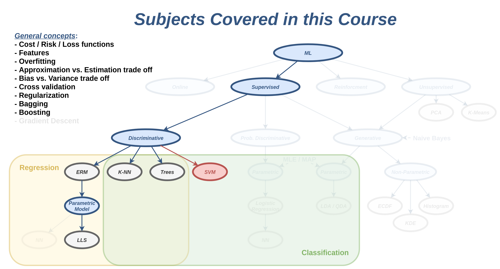
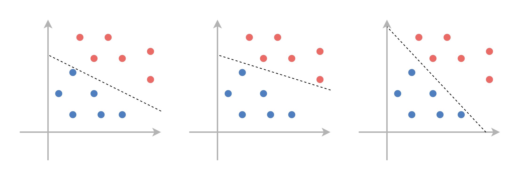
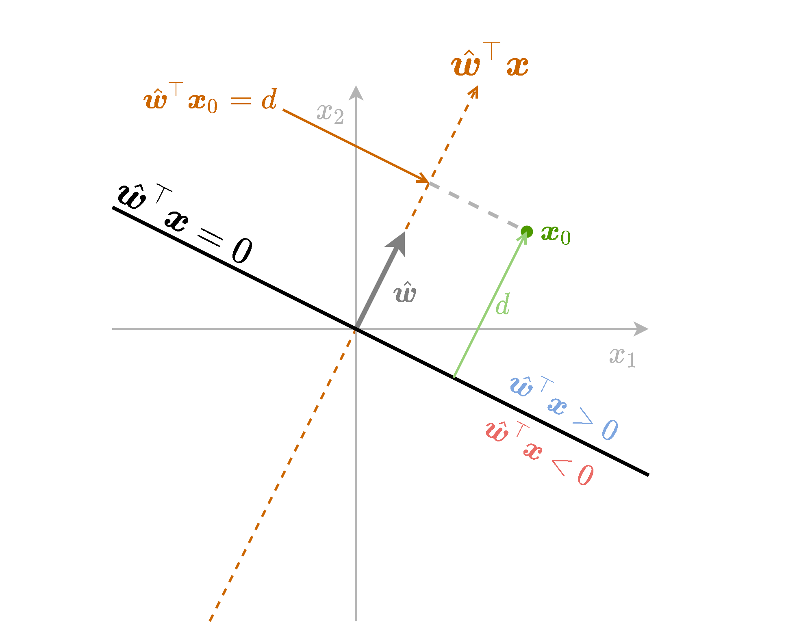
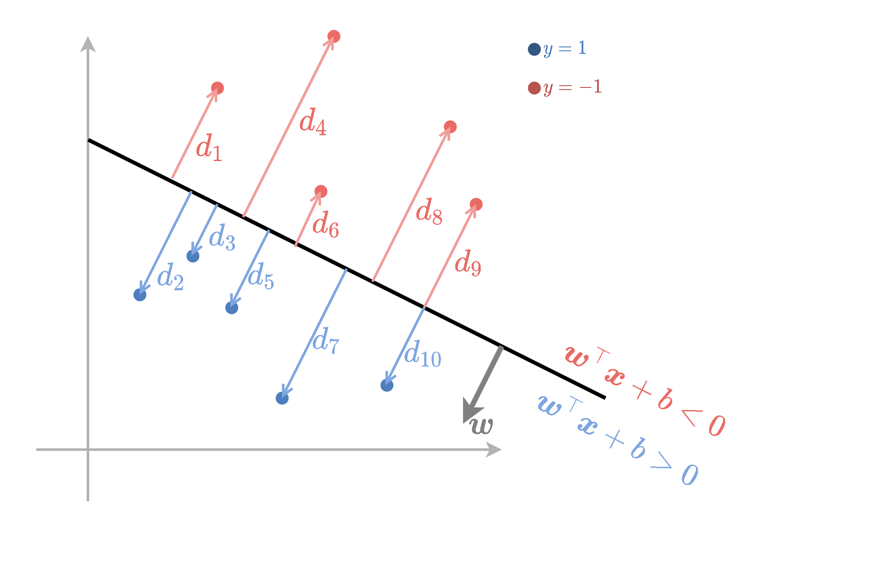

<section class="center">

#  הרצאה 6 - SVM ושיטות גרעין

<a href="/assets/lecture06_slides.pdf" class="link-button" target="_blank">PDF</a>

</section><section>

## מה נלמד היום

</section><section>

## סיווג לינארי

- בפרק זה נעסוק בבעיית סיווג בינארי.
- נסמן את שתי המחלקות ב $\text{y}=\pm1$.
- נעסוק במסווגים מהצורה:

    $$
    h(\boldsymbol{x})=
    \text{sign}(\boldsymbol{w}^{\top}\boldsymbol{x}+b)
    =\begin{cases}
    1 & \boldsymbol{w}^{\top}\boldsymbol{x}+b>0\\
    -1 & \text{else}
    \end{cases}
    $$

- חלוקה של המרחב לשני צידיו של על-מישור (hyperplane):

    $$
    \boldsymbol{w}^{\top}\boldsymbol{x}+b=0
    $$

- מישור זה מכונה מישור ההפרדה.

</section><section>

## על-מישור (hyperplane)

- הרחבה של מושג המישור למימדים שונים מ2.
- במרחב ממימד $D$, על-המישור יהיה ממימד $D-1$.
- בקורס זה נשתמש בשם מישור גם בשביל להתייחס לעל-מישורים.

 

- לא להתבלבל בין $\boldsymbol{w}^{\top}\boldsymbol{x}+b=0$ לבין $ax+b=y$.

</section><section>

## פרידות לינארית (linear separability)

במקרה שבו קיים מישור מפריד אשר מסווג את המדגם בצורה מושלמת (בלי טעויות סיווג) נאמר שהמדגם **פריד לינארית**.

 

- לרוב לא נוכל לדעת מראש האם מדגם הוא פריד לינארית או לא.

</section><section>

## פרידות לינארית (linear separability)

למדגם פריד לינארית יהיה תמיד יותר ממשטח הפרדה אחד:

 

</section><section>

## תזכורת - גאומטריה של המישור

נסתכל על הפונקציה $f(\boldsymbol{x})=\hat{\boldsymbol{w}}^{\top}\boldsymbol{x}$. משוואה זו מטילה נקודות במרחב על הקו המוגדר על ידי $\hat{\boldsymbol{w}}$, ומודדת את האורך של הטלה זו.

 

</section><section>

## תזכורת - גאומטריה של המישור

- מודדת את המרחק מהמישור $\hat{\boldsymbol{w}}^{\top}\boldsymbol{x}$ בתוספת של סימן אשר מציין את הצד של המישור.
- נשתמש בשם **signed distance (מרחק מסומן)** בכדי להתייחס לשילוב של המרחק מהמישור בתוספת הסימן.

</section><section>

## תזכורת - גאומטריה של המישור

נחליף את הוקטור $\hat{\boldsymbol{w}}$ בוקטור $\boldsymbol{w}$. נקבל הפונקציה זהה המוכפלת ב $\lVert\boldsymbol{w}\rVert_2$.

ה signed distance יהיה $d=\frac{1}{\lVert\boldsymbol{w}\rVert}\boldsymbol{w}^{\top}\boldsymbol{x}_0$.

</section><section>

## תזכורת - גאומטריה של המישור

נוסיף לפונקציה גם איבר היסט $b$. ההוספה של הקבוע שקולה להזזה של נקודת ה-0.

ה signed distance יהיה $d=\frac{1}{\lVert\boldsymbol{w}\rVert}(\boldsymbol{w}^{\top}\boldsymbol{x}_0+b)$

</section><section>

## תזכורת - גאומטריה של המישור

נסכם את כל הנאמר לעיל בשרטוט הבא:

</section><section>

## אינווריאנטיות לכפל בסקלר

אם נכפיל את גם את $\boldsymbol{w}$ וגם את $b$ בקבוע כל שהוא $\alpha$ שונה מאפס לא נשנה את מיקומו של המישור במרחב, זאת משום ש:

$$
\begin{aligned}
(\alpha\boldsymbol{w})^{\top}\boldsymbol{x}+(\alpha b)&=0\\
\Leftrightarrow\boldsymbol{w}^{\top}\boldsymbol{x}+b&=0
\end{aligned}
$$

המשמעות הינה שיש מספר דרכים להגדיר את אותו מסווג לינארי.

</section><section>

## Support Vector Machine (SVM)

- אלגוריתם דיסקרימינטיבי לסיווג בינארי (מחפש מסווג טוב על המדגם).
- Hard SVM מחפש מסווג לינארי למדגם שהוא פריד לינארית.
- Soft SVM מרחיב את האלגוריתם למקרה שבו המדגם לא פריד לינארית.

</section><section>

## Hard SVM

- נרצה למצוא מישור הפרדה אשר יכליל בצורה טובה.
- הנחה סבירה הינה שהפילוג של הנקודות יתרכז סביב הנקודות מהמדגם.
- Hard SVM מנסה למצוא מישור הפרדה אשר יהיה רחוק ככל האפשר מהנקודות שבמדגם.
- או: נרצה שהמרחק מהמישור לנקודה הקרובה אליו ביותר יהיה מקסימאלי.

</section><section>

## Hard SVM

נסתכל על המכפלה בין ה signed distance של הנקודות לתוויות שלהם $\frac{1}{\lVert\boldsymbol{w}\rVert}(\boldsymbol{w}^{\top}\boldsymbol{x}^{(i)}+b)y^{(i)}$.

- בכדי לקבל סיווג מושלם נרצה שכל המכפלות יהיו חיוביות.
- בנוסף ננסה למקסם את המינימום של מכפלות אלו.

</section><section>

## Hard SVM

בעיית האופטימיזציה שנרצה לפתור אם כן הינה:

$$
\boldsymbol{w}^*,b^*=\underset{\boldsymbol{w},b}{\arg\max}\quad \underset{i}{\min}\left\{\frac{1}{\lVert\boldsymbol{w}\rVert}(\boldsymbol{w}^{\top}\boldsymbol{x}^{(i)}+b)y^{(i)}\right\}
$$

- ניתן לנסות לפתור באופן ישיר על ידי gradient descent.
- בפועל העובדה שבבעיה מופיע $min$ על כל המדגם מאד מקשה.
- ניתן לפשט את הבעיה ולמצוא בעיה שקולה, שאותה נכנה **הבעיה הפרימאלית**.
- את הבעיה הפרימאלית יהיה ניתן לפתור באופן יעיל בשיטות נומריות אחרות.

</section><section>

## הפיתוח של הבעיה הפרימאלית

- נוכל לבחור באופן שרירותי קבוע כפלי להכפיל בו את $\boldsymbol{w}$ ו $b$.
- בפרט נוכל להוסיף דרישה ש:

$$
\underset{i}{\min}\left\{(\boldsymbol{w}^{\top}\boldsymbol{x}^{(i)}+b)y^{(i)}\right\}=1
$$

</section><section>

## הפיתוח של הבעיה הפרימאלית

אם נוסיף את האילץ הזה לבעיית האופטימיזציה נקבל:

$$
\begin{aligned}
\boldsymbol{w}^*,b^*
=\underset{\boldsymbol{w},b}{\arg\max}\quad&\underset{i}{\min}\left\{\frac{1}{\lVert\boldsymbol{w}\rVert}(\boldsymbol{w}^{\top}\boldsymbol{x}^{(i)}+b)y^{(i)}\right\}\\
\text{s.t.}\quad&\underset{i}{\min}\left\{(\boldsymbol{w}^{\top}\boldsymbol{x}^{(i)}+b)y^{(i)}\right\}=1\\
=\underset{\boldsymbol{w},b}{\arg\max}\quad&\frac{1}{\lVert\boldsymbol{w}\rVert}\underset{i}{\min}\left\{(\boldsymbol{w}^{\top}\boldsymbol{x}^{(i)}+b)y^{(i)}\right\}\\
\text{s.t.}\quad&\underset{i}{\min}\left\{(\boldsymbol{w}^{\top}\boldsymbol{x}^{(i)}+b)y^{(i)}\right\}=1\\
=\underset{\boldsymbol{w},b}{\arg\max}\quad&\frac{1}{\lVert\boldsymbol{w}\rVert}\\
\text{s.t.}\quad&\underset{i}{\min}\left\{(\boldsymbol{w}^{\top}\boldsymbol{x}^{(i)}+b)y^{(i)}\right\}=1\\
=\underset{\boldsymbol{w},b}{\arg\min}\quad&\frac{1}{2}\lVert\boldsymbol{w}\rVert^2\\
\text{s.t.}\quad&\underset{i}{\min}\left\{(\boldsymbol{w}^{\top}\boldsymbol{x}^{(i)}+b)y^{(i)}\right\}=1\\
\end{aligned}
$$

</section><section>

## הפיתוח של הבעיה הפרימאלית

נוכל גם להחליף את האילוץ של $\underset{i}{\min}\left\{(\boldsymbol{w}^{\top}\boldsymbol{x}^{(i)}+b)y^{(i)}\right\}=1$ באילוץ:

$$
(\boldsymbol{w}^{\top}\boldsymbol{x}^{(i)}+b)y^{(i)}\geq1\quad\forall i
$$

זאת מכיוון שבעיית האופטימיזציה מנסה להקטין את $\boldsymbol{w}$. עקב כך, מובטח שלפחות בעבור אחת מהנקודות האילוץ יתקיים בשיוון.

 

קיבלנו את בעיית האופטימיזציה השקולה הבאה:

$$
\begin{aligned}
\boldsymbol{w}^*,b^*
=\underset{\boldsymbol{w},b}{\arg\min}\quad&\frac{1}{2}\lVert\boldsymbol{w}\rVert^2\\
\text{s.t.}\quad&(\boldsymbol{w}^{\top}\boldsymbol{x}^{(i)}+b)y^{(i)}\geq1\quad\forall i
\end{aligned}
$$

בעיה זו נקראת **הבעיה הפרימאלית**.

</section><section>

## פרשנות

האילוץ דורש שהנקודות מהמדגם יהיו מחוץ לתחום:

$$
1\geq\boldsymbol{w}^{\top}\boldsymbol{x}+b\geq-1
$$

אשר נקרא ה**שוליים (margin)**.

</section><section>

## פרשנות

- המרחק בין מישור ההפרדה לשפה של ה margin שווה ל $\frac{1}{\lVert\boldsymbol{w}\rVert}$.
- בעיית האופטימיזציה מנסה למזער את $\lVert\boldsymbol{w}\rVert$ ותתכנס למסווג בעל ה margin הגדול ביותר.

</section><section>

## Support Vectors

- ה **support vectors** הם הנקודות שיושבות על ה margin והם מקיימות אלו מקיימות $y^{(i)}\left(\boldsymbol{w}^{\top}\boldsymbol{x}^{(i)}+b\right)=1$.
- רק נקודות אלו ישפיעו על הפתרון של בעיית האופטימיזציה.

</section><section>

## הבעיה הדואלית

דרך שקולה נוספת לרישום של בעיית האופטימיזציה (ללא הוכחה):

 
 

נגדיר $N$ משתני עזר נוספים $\{\alpha_i\}_{i=1}^N$ בעזרתם ניתן לרשום את הבעיה הדואלית באופן הבא:

 

$$
\begin{aligned}
\left\lbrace\alpha_i\right\rbrace^*
=\underset{\left\lbrace\alpha_i\right\rbrace}{\arg\max}\quad&\sum_i\alpha_i-\frac{1}{2}\sum_{i,j}y^{(i)}y^{(j)}\alpha_i\alpha_j\boldsymbol{x}^{(i)\top}\boldsymbol{x}^{(j)} \\
\text{s.t.}\quad
    &\alpha_i\geq0\quad\forall i\\
    &\sum_i\alpha_iy^{(i)}=0
\end{aligned}
$$

</section><section>

## הבעיה הדואלית

$$
\begin{aligned}
\left\lbrace\alpha_i\right\rbrace^*
=\underset{\left\lbrace\alpha_i\right\rbrace}{\arg\max}\quad&\sum_i\alpha_i-\frac{1}{2}\sum_{i,j}y^{(i)}y^{(j)}\alpha_i\alpha_j\boldsymbol{x}^{(i)\top}\boldsymbol{x}^{(j)} \\
\text{s.t.}\quad
    &\alpha_i\geq0\quad\forall i\\
    &\sum_i\alpha_iy^{(i)}=0
\end{aligned}
$$

מתוך המשתנים $\{\alpha_i\}_{i=1}^N$ ניתן לשחזר את $\boldsymbol{w}$ אופן הבא:

$$
\boldsymbol{w}=\sum_i\alpha_iy^{(i)}\boldsymbol{x}^{(i)}
$$

</section><section>

## הקשר בין $\alpha_i$ ו support vectors.

 

| .                                      | .                                                      | .               |
| -------------------------------------- | ------------------------------------------------------ | --------------- |
| נקודות רחוקות מה margin                   | $y^{(i)}\left(\boldsymbol{w}^{\top}x^{(i)}+b\right)>1$ | $\alpha_i=0$    |
| נקודות על ה margin (שהם support vectors) | $y^{(i)}\left(\boldsymbol{w}^{\top}x^{(i)}+b\right)=1$ | $\alpha_i\geq0$ |

</section><section>

## חישוב $b$

- נבחר נקודה מסויימת שבעבורה $\alpha_i>0$.
- נקודה כזו בהכרח תהיה support vectors ותקיים $y^{(i)}\left(\boldsymbol{w}^{\top}x^{(i)}+b\right)=1$.
- מתוך משוואה זו ניתן לחלץ את $b$.

</section><section>

## Soft SVM

- מתייחס למקרה שבו המדגם אינו פריד לינארית.
- מאפשרים למשתנים להיכנס לתוך ה margin ואף לחצות אותו.
- על כל חריגה כזו משלמים קנס ב objective.

</section><section>

## Soft SVM

- את החריגה של הדגימה ה $i$ נסמן ב $\frac{1}{\lVert\boldsymbol{w}\rVert}\xi_i$.
- המשתנים $\xi_i$ נקראים **slack variables**.

</section><section>

## Soft SVM

ובעיית האופטימיזציה הפרימאלית תהיה:

 

$$
\begin{aligned}
\boldsymbol{w}^*,b^*,\{\xi_i\}^*=
\underset{\boldsymbol{w},b,\{\xi_i\}}{\arg\min}\quad&\frac{1}{2}\left\lVert\boldsymbol{w}\right\rVert^2+C\sum_{i=1}^N\xi_i \\
\text{s.t.}\quad
    &y^{(i)}\left(\boldsymbol{w}^{\top}\boldsymbol{x}^{(i)}+b\right)\geq1-\xi_i\quad\forall i\\
    &\xi_i\geq0\quad\forall i
\end{aligned}
$$

 

כאשר $C$ הוא hyper-parameter אשר קובע את גודל הקנס שאותו ה objective נותן על כל חריגה.

</section><section>

## Soft SVM

הבעיה הדואלית הינה:

 

$$
\begin{aligned}
\left\lbrace\alpha_i\right\rbrace^*
=\underset{\left\lbrace\alpha_i\right\rbrace}{\arg\max}\quad&\sum_i\alpha_i-\frac{1}{2}\sum_{i,j}y^{(i)}y^{(j)}\alpha_i\alpha_j\boldsymbol{x}^{(i)\top}\boldsymbol{x}^{(j)} \\
\text{s.t.}\quad
    &0\leq\alpha_i\leq C\quad\forall i\\
    &\sum_i\alpha_iy^{(i)}=0
\end{aligned}
$$

</section><section>

## Soft SVM

בעבור ה support vectors מתקיים: $y^{(i)}\left(\boldsymbol{w}^{\top}\boldsymbol{x}^{(i)}+b\right)=1-\xi_i$

 

תכונות:

| .                                         | .                                                            | .                     |
| ----------------------------------------- | ------------------------------------------------------------ | --------------------- |
| נקודות שמסווגות נכון ורחוקות מה margin            | $y^{(i)}\left(\boldsymbol{w}^{\top}x^{(i)}+b\right)>1$       | $\alpha_i=0$          |
| נקודות על ה margin (שהם support vectors)    | $y^{(i)}\left(\boldsymbol{w}^{\top}x^{(i)}+b\right)=1$       | $0\leq\alpha_i\leq C$ |
| נקודות שחורגות מה margin (גם support vectors) | $y^{(i)}\left(\boldsymbol{w}^{\top}x^{(i)}+b\right)=1-\xi_i$ | $\alpha_i=C$          |

</section><section>

## מאפיינים: תזכורת

- נוכל תמיד לחליף את וקטור המשתנים $\boldsymbol{x}$ בוקטור חדש:

    $$
    \boldsymbol{x}_{\text{new}}=\Phi(\boldsymbol{x})
    $$

- $\Phi$ היא פונקציה אשר נבחרה מראש ונקראת פונקציית המאפיינים.

</section><section>

## פונקציות גרעין

- במקרים רבים החישוב של $\Phi(\boldsymbol{x})$ יכול להיות מסובך אך קיימת דרך לחשב בצורה יעילה את הפונקציה $K(\boldsymbol{x}_1,\boldsymbol{x}_2)=\Phi(\boldsymbol{x}_1)^{\top}\Phi(\boldsymbol{x}_2)$.
- הפונקציה $K$ נקראת פונקציית גרעין.
- יתרה מזאת, יתכנו מצבים שבהם הוקטור המאפיינים הוא אין סופי אך פונקציית הגרעין היא פשוטה לחישוב.

נציג שתי פונקציות גרעין נפוצות:

- גרעין גאוסי: $K(\boldsymbol{x}_1,\boldsymbol{x}_2)=\exp\left(-\frac{\lVert\boldsymbol{x}_1-\boldsymbol{x}_2\rVert_2^2}{2\sigma^2}\right)$ כאשר $\sigma$ פרמטר שיש לקבוע.
- גרעין פולינומיאלי: $K(\boldsymbol{x}_1,\boldsymbol{x}_2)=(1+\boldsymbol{x}_1^{\top}\boldsymbol{x}_2)^p$ כאשר $p\geq1$ פרמטר שיש לקבוע.

</section><section>

## Kernel Trick in SVM

הרעיון ב kernel trick הינו לעשות שימוש בפונקציית הגרעין על מנת להשתמש ב SVM עם מאפיינים מבלי לחשב את $\Phi$ באופן ישיר.

 

בעבור פונקציית מאפיינים $\Phi$ עם פונקציית גרעין $K$ הבעיה הדואלית של SVM הינה:

$$
\begin{aligned}
\left\lbrace\alpha_i\right\rbrace^*
=\underset{\left\lbrace\alpha_i\right\rbrace}{\arg\max}\quad&\sum_i\alpha_i-\frac{1}{2}\sum_{i,j}y^{(i)}y^{(j)}\alpha_i\alpha_jK(\boldsymbol{x}^{(i)},\boldsymbol{x}^{(j)}) \\
\text{s.t.}\quad
    &\alpha_i\geq0\quad\forall i\\
    &\sum_i\alpha_iy^{(i)}=0
\end{aligned}
$$

בעיית אופטימיזציה זו מגדירה את המשתנים $\{\alpha_i\}$ בלי צורך לחשב את $\Phi$ באופן מפורש בשום שלב.

</section><section>

## Kernel Trick in SVM

באופן כללי, הפרמטר $\boldsymbol{w}$ נתון על ידי:

$$
\boldsymbol{w}=\sum_i\alpha_iy^{(i)}\Phi(\boldsymbol{x}^{(i)})
$$

אשר מצריך חישוב של $\Phi$. ניתן להימנע מכך על ידי הצבה של $\boldsymbol{w}$ כמו שהוא ישירות לחזאי.

$$
\begin{aligned}
h(\boldsymbol{x})
&=\text{sign}(\boldsymbol{w}^{\top}\Phi(\boldsymbol{x})+b)\\
&=\text{sign}(\sum_i\alpha_iy^{(i)}\Phi(\boldsymbol{x}^{(i)})^{\top}\Phi(\boldsymbol{x})+b)\\
&=\text{sign}(\sum_i\alpha_iy^{(i)}K(\boldsymbol{x}^{(i)},\boldsymbol{x})+b)\\
\end{aligned}
$$

בדרך זו אנו יכולים לאמן להשתמש בחזאי אשר אומן בעבור וקטור מאפיינים $\Phi$ מבלי לחשב בשום שלב את $\Phi$ באופן מפורש.

</section>

