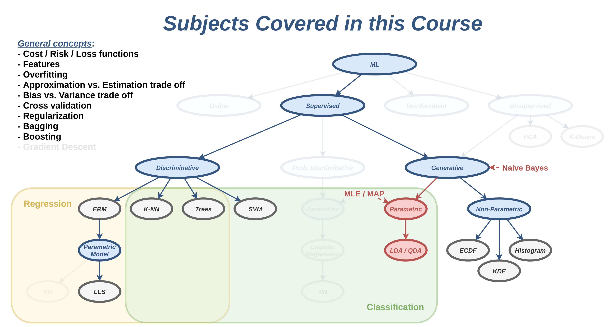
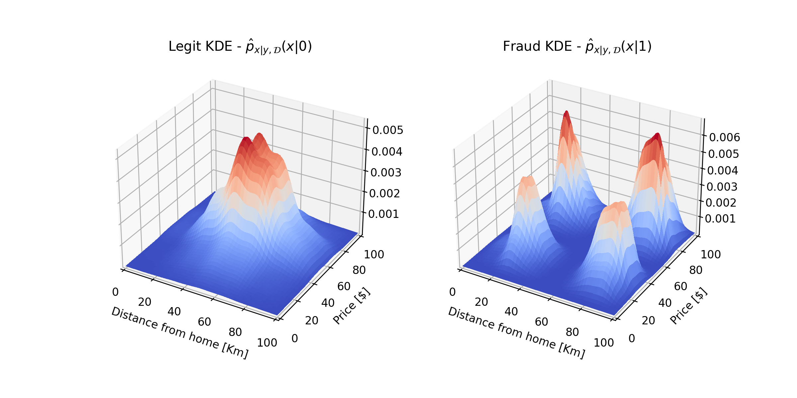
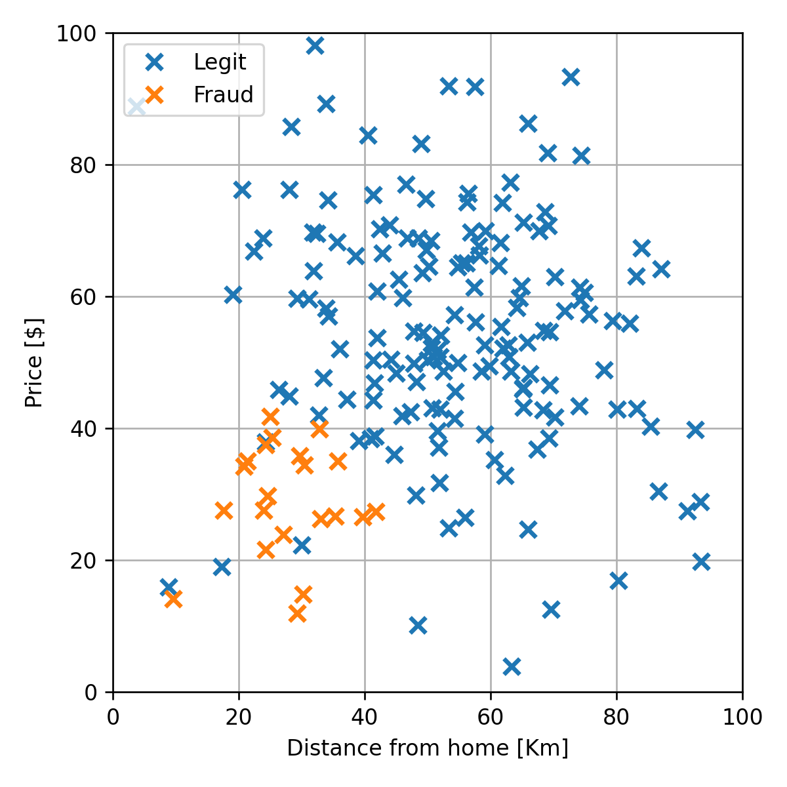

<section class="center">

# הרצאה 8 - שיערוך פילוג בשיטות פרמטריות וסיווג גנרטיבי

<a href="/assets/lecture08_slides.pdf" class="link-button" target="_blank">PDF</a>

</section><section>

## מה נלמד היום

</section><section>

## בעיות בגישה הלא פרמטרית

### פונקציות שקשה לעבוד איתם

- מתייחס בעיקר ל KDE ול ECDF.
- הפונקציות שקיבלנו מכילות סכום על כל האיברים ב train set.

### הערה לגבי שלב בניית המודל ושלב החיזוי

- בשלב בניית המודל כמות המשאבים שיעמדו לרשותינו תהיה מאד גדולה.
- בזמן החיזוי נרצה לבצע את החישוב על פלטפורמה יחסית חלשה ולקבל תוצאות מאד מהירות.

</section><section>

## הבעיה של כיסוי המרחב - דוגמא

נניח שאנו רוצים לחזות האם אדם מסויים פרק את הכתף על פי הסימפטומים שלו. לשם כך נסתכל על המדגם הבא

 

|   | פריקה | כאב בכתף | נפיחות | סימנים כחולים | נימול ביד | נזלת |
| - |:-----:|:--------:|:------:|:-------------:|:---------:|:----:|
| 1 | +     | +        | +      | +             | +         | -    |
| 2 | +     | +        | +      | +             | -         | -    |
| 3 | +     | +        | +      | -             | +         | -    |
| 4 | +     | +        | +      | +             | -         | +    |
| 5 | -     | -        | -      | -             | -         | -    |
| 6 | -     | +        | -      | -             | -         | +    |
| 7 | -     | -        | -      | +             | -         | -    |
| 8 | -     | +        | -      | -             | -         | -    |

 

האם לאדם עם כל הסימפטומים יש פריקה של הכתף?

</section><section>

## הבעיה של כיסוי המרחב - דוגמא

|   | פריקה | כאב בכתף | נפיחות | סימנים כחולים | נימול ביד | נזלת |
| - |:-----:|:--------:|:------:|:-------------:|:---------:|:----:|
| 1 | +     | +        | +      | +             | +         | -    |
| 2 | +     | +        | +      | +             | -         | -    |
| 3 | +     | +        | +      | -             | +         | -    |
| 4 | +     | +        | +      | +             | -         | +    |
| 5 | -     | -        | -      | -             | -         | -    |
| 6 | -     | +        | -      | -             | -         | +    |
| 7 | -     | -        | -      | +             | -         | -    |
| 8 | -     | +        | -      | -             | -         | -    |

על פי השיטה שראינו בשבוע שעבר הסבירות לפריקה בהינתן הכל הסימפטומים היא חצי.

 

זאת משום שאין אף דגימה בה יש את כל הסימפטומים ולכן גם השכיחות של פריקה וגם השכיחות של אי-פריקה הן 0.

</section><section>

## הבעיה של כיסוי המרחב - דוגמא נוספת

כמות הערכים השונים שהוקטור בינראי באורך 10 יכול לקבל הינה $2^{10}=1024$. אם ננסה לשערך את הפילוג של וקטור זה עם מדגם של 500 דגימות לפחות חצי מהערכים לא יופיע במדגם.

</section><section>

## הבעיה של כיסוי המרחב

- בשיטות שראינו הפילוג בכל איזור נקבע על פי הדגימות שנמצאות באותו איזור.
- שיטות אלו מניחות שיש בידינו מספיק דגימות בכדי לכסות את כל המרחב.
- הנחה זו בעייתית כאשר יש הרבה משתנים אקראיים.
- הגדול האפקטיבי של המרחב גדל בצורה מעריכית עם מספר המשתנים.

</section><section>

## Curse of Dimensionality

- התופעה שהדגמנו מתרחשת לא רק בעבור משתנים דיסקרטיים.
- התופעה שבה המורכבות של הבעיה גדלה בצורה מעריכית עם המימד של הבעיה מופיע בהרבה תחומים וידוע בתור ה **curse of dimensionality**.

</section><section>

## שיערוך נאיבי - חוסר תלות בין המשתנים

שיטה מאד נאיבית (לא מתוחכמת) לפתור את הבעיה היא להתעלם מהקשר בין המשתנים השונים ולהניח שהם בלתי תלויים סטטיסטית. זאת אומרת ש:

$$
p_{\mathbf{x}}(\boldsymbol{x})=
p_{\text{x}_1}(x_1)
p_{\text{x}_2}(x_2)
\dots
p_{\text{x}_D}(x_D)
=\prod_{d=1}^D p_{\text{x}_d}(x_d)
$$

- לא סובלת מה curse of dimesionality.
- חיסרון: שהיא מגבילה מאד את הפילוגים שניתן ללמוד.

</section><section>

## מסווג בייס נאיבי - Naïve Bayes Classification

נוכל להשתמש בשיערוך הנאיבי לפתרון בעיות סיווג.

נניח כי:

$$
p_{\mathbf{x}|\text{y}}(\boldsymbol{x}|y)=
p_{\text{x}_1|\text{y}}(x_1|y)
p_{\text{x}_2|\text{y}}(x_2|y)
\dots
p_{\text{x}_D|\text{y}}(x_D|y)
=\prod_{d=1}^D p_{\text{x}_d|\text{y}}(x_d|y)
$$

- אנו **לא** נרצה להניח חוסר תלות בין $\mathbf{x}$ ל $\text{y}$.

</section><section>

## מסווג בייס נאיבי - Naïve Bayes Classification

החזאי אשר ממזער את ה misclassifcation rate יהיה:

$$
\begin{aligned}
\hat{y}=h(\boldsymbol{x})
&=\underset{y}{\arg\max}\ p_{\text{y}|\boldsymbol{x}}(y|\boldsymbol{x})\\
&=\underset{y}{\arg\max}\ p_{\boldsymbol{x}|\text{y}}(\boldsymbol{x}|y)p_{\text{y}}(y)\\
&=\underset{y}{\arg\max}\ p_{\text{y}}(y)\prod_{d=1}^D p_{\text{x}_d|\text{y}}(x_d|y)
\end{aligned}
$$

</section><section>

## דוגמא 1 - זיהוי פריקה של הכתף

תחת הנחת החוסר תלות ונשערך בנפרד את ההסתברות המותנית של כל אחד מהרכיבים $p_{\text{x}_d|\text{y}}(x_d|y)$. לדוגמא:

$$
p_{\text{x}_{\text{pain}}|\text{y}}(x_{\text{pain}}|1)=\begin{cases}
\tfrac{4}{4}=1&1\\
\tfrac{0}{4}=0&0
\end{cases}
$$

$$
p_{\text{x}_{\text{pain}}|\text{y}}(x_{\text{pain}}|0)=\begin{cases}
\tfrac{2}{4}=0.5&1\\
\tfrac{2}{4}=0.5&0
\end{cases}
$$

$$
p_{\text{x}_{\text{swelling}}|\text{y}}(x_{\text{swelling}}|1)=\begin{cases}
\tfrac{4}{4}=1&1\\
\tfrac{0}{4}=0&0
\end{cases}
$$

$$
p_{\text{x}_{\text{swelling}}|\text{y}}(x_{\text{swelling}}|0)=\begin{cases}
\tfrac{0}{4}=0&1\\
\tfrac{1}{4}=1&0
\end{cases}
$$

</section><section>

## דוגמא 1 - זיהוי פריקה של הכתף

החיזוי בעבור המקרה בו מופיעים כל הסימפטומים יהיה

$$
\hat{y}
=\underset{y}{\arg\max}\ p_{\text{y}}(y)\prod_{d=1}^D p_{\text{x}_d|\text{y}}(1|y)
$$

זאת אומרת שעלינו לבדוק האם:

$$
\begin{aligned}
p_{\text{y}}(1)\prod_{d=1}^D p_{\text{x}_d|\text{y}}(1|1)\overset{?}{>}
&p_{\text{y}}(0)\prod_{d=1}^D p_{\text{x}_d|\text{y}}(1|0)\\
0.5 \times 1 \times 1 \times 0.75 \times 0.5 \times 0.25 \overset{?}{>}
&0.5 \times 0.5 \times 0 \times 0.25 \times 0 \times 0.25\\
0.09375 \overset{?}{>}
& 0
\end{aligned}
$$

מכיוון שהתנאי זה מתקיים, החיזוי יהיה שישנה פריקה של כתף.

</section><section>

## דוגמא 2 - זיהוי הונאות אשראי

ננסה להשתמש בשיטה זו לבעיית חיזוי הונאות האשראי

נשתמש ב KDE חד מימד לשיערוך של $p_{\text{x}_d|\text{y}}(x_d|y)$.

</section><section>

## דוגמא 2 - זיהוי הונאות אשראי

- שימו לב שקיבלנו הסתברות גבוהה להונאה גם באיזורים שבמדגם לא היו שום דגימות של הונאות.
- הסיבה היא הנחת חוסר התלות.

</section><section>

## דוגמא 2 - זיהוי הונאות אשראי

פונקציית החיזוי תהיה

</section><section>

## שיטות פרמטריות

- דומה לשימוש שעשינו במודלים פרמטרים בגישה הדטרמיניסטית.
- נגביל את הצורה של הפונקציה שאותה אנו רוצים לשערך למודל פרמטרי.
- נסמן את וקטור הפרמטרים ב $\boldsymbol{\theta}$.
- כאן המודל חייב לייצר פילוג חוקי בעבור כל בחירה של פרמטרים.
- מגבלה קשה אשר מצמצמת מאד את המודלים הפרמטריים שאיתם ניתן לעבוד.

</section><section>

## בחירת הפרמטרים

- נרצה למצוא דרך לתת "ציון" לכל בחירה של פרמטרים ולחפש את הפרמטריים אשר מניבים את הציון הטוב ביותר.
- נציג שני גישות שונות להתייחס לפרמטרים של המודל.
- כל גישה מובילה לדרך מעט שונה לבחירה של הפרמטרים.

</section><section>

## דוגמא: שיערוך הפילוג של זמן הנסיעה

$$
\mathcal{D}=\{x^{(i)}\}=\{55, 68, 75, 50, 72, 84, 65, 58, 74, 66\}
$$

משערך ה KDE של הפילוג הינו:

 

נרצה לשערך פרמטרים של פילוג נורמאלי שיתאר בצורה טובה את הדגימות במדגם.

</section><section>

## הגישה הלא-בייסיאנית (קלאסית או תדירותית (**Frequentist**))

$$
p_{\mathbf{x}}(\boldsymbol{x};\boldsymbol{\theta})
$$

- נתייחס לפרמטרים כאל מספרים שאותם יש לקבוע על מנת שהמודל יתאר בצורה טובה את המדגם.
- בניגוד לגישה השניה, אין כל העדפה של ערך מסויים של הפרמטרים.

</section><section>

## Maximum Likelyhood Estimator (MLE)

- נסמן ב $p_{\mathcal{D}}(\mathcal{D};\boldsymbol{\theta})$ את ההסתברות לקבלת המדגם $\mathcal{D}=\{\boldsymbol{x}^{(i)}\}$.
- גודל זה מכונה ה**סבירות** (**likelihood**) של המדגם.
- אנו מעוניינים למצוא את הפרמטרים $\boldsymbol{\theta}$ אשר מניבים את הסבירות הכי גבוהה.
- מקובל לסמן את פונקציית ה likelihood באופן הבא:

$$
\mathcal{L}(\boldsymbol{\theta};\mathcal{D})\triangleq p_{\mathcal{D}}(D;\boldsymbol{\theta})
$$

משערך ה MLE של $\boldsymbol{\theta}$ הוא הערך אשר ממקסם את פונקציית ה likelihood:

$$
\hat{\boldsymbol{\theta}}_{\text{MLE}}
=\underset{\boldsymbol{\theta}}{\arg\max}\ \mathcal{L}(\boldsymbol{\theta};\mathcal{D})
$$

</section><section>

## Maximum Likelyhood Estimator (MLE)

$$
\hat{\boldsymbol{\theta}}_{\text{MLE}}
=\underset{\boldsymbol{\theta}}{\arg\max}\ \mathcal{L}(\boldsymbol{\theta};\mathcal{D})
$$

- נרשום את בעיית האופטימיזציה כבעיית מינימיזציה:

$$
\hat{\boldsymbol{\theta}}_{\text{MLE}}
=\underset{\boldsymbol{\theta}}{\arg\min}\ -\mathcal{L}(\boldsymbol{\theta};\mathcal{D})
$$

- כאשר הדגימות במדגם הם i.i.d:

$$
p_{\mathcal{D}}(\mathcal{D};\boldsymbol{\theta})=\prod_i p_{\mathbf{x}}(\boldsymbol{x}^{(i)};\boldsymbol{\theta})
$$

ולכן:

$$
\hat{\boldsymbol{\theta}}_{\text{MLE}}
=\underset{\boldsymbol{\theta}}{\arg\min}\ -\mathcal{L}(\boldsymbol{\theta};\mathcal{D})
=\underset{\boldsymbol{\theta}}{\arg\min}\ -\prod_i p_{\mathbf{x}}(\boldsymbol{x}^{(i)};\boldsymbol{\theta})
$$

</section><section>

## Maximum Likelyhood Estimator (MLE)

$$
\hat{\boldsymbol{\theta}}_{\text{MLE}}
=\underset{\boldsymbol{\theta}}{\arg\min}\ -\mathcal{L}(\boldsymbol{\theta};\mathcal{D})
=\underset{\boldsymbol{\theta}}{\arg\min}\ -\prod_i p_{\mathbf{x}}(\boldsymbol{x}^{(i)};\boldsymbol{\theta})
$$

במקרים רבים נוכל להחליף את המכפלה על כל הדגימות בסכום, על ידי החלפת פונקציית ה likelihood ב log-likelihood:

$$
\hat{\boldsymbol{\theta}}_{\text{MLE}}
=\underset{\boldsymbol{\theta}}{\arg\min}\ -\log\mathcal{L}(\boldsymbol{\theta};\mathcal{D})
=\underset{\boldsymbol{\theta}}{\arg\min}\ -\sum_i \log\left(p_{\mathbf{x}}(\boldsymbol{x}^{(i)};\boldsymbol{\theta})\right)
$$

</section><section>

## דוגמא - זמן הנסיעה

ננסה להתאים למדגם מודל של פילוג נורמאלי:

$$
p_{\text{x}}(x;\boldsymbol{\theta})=\frac{1}{\sqrt{{2\pi}}\sigma}\exp\left(-\frac{(x-\mu)^2}{2\sigma^2}\right)
$$

וקטור הפרמטרים הינו $\boldsymbol{\theta}=[\mu,\sigma]^\top$.

</section><section>

## דוגמא - זמן הנסיעה

$$
p_{\text{x}}(x;\boldsymbol{\theta})=\frac{1}{\sqrt{{2\pi}}\sigma}\exp\left(-\frac{(x-\mu)^2}{2\sigma^2}\right)
$$

נרשום את בעיית האופטימיזציה של מציאת משערך ה MLE:

$$
\begin{aligned}
\hat{\boldsymbol{\theta}}_{\text{MLE}}
&=\underset{\boldsymbol{\theta}}{\arg\min}\ -\sum_i \log\left(p_{\text{x}}(x^{(i)};\boldsymbol{\theta})\right)\\
&=\underset{\boldsymbol{\theta}}{\arg\min}\ -\sum_i \log\left(\frac{1}{\sqrt{{2\pi}}\sigma}\exp\left(-\frac{(x-\mu)^2}{2\sigma^2}\right)\right)\\
&=\underset{\boldsymbol{\theta}}{\arg\min}\ \sum_i \log(\sigma) + \tfrac{1}{2}\log(2\pi) + \frac{(x^{(i)}-\mu)^2}{2\sigma^2}\\
&=\underset{\boldsymbol{\theta}}{\arg\min}\ N\log(\sigma) + \frac{1}{2\sigma^2}\sum_i (x^{(i)}-\mu)^2\\
\end{aligned}
$$

נפתור על ידי גזירה והשוואה ל-0.

</section><section>

## דוגמא - זמן הנסיעה

נסמן את ה objective ב $f$:

$$
f(\boldsymbol{\theta};\mathcal{x})=N\log(\sigma) + \frac{1}{2\sigma^2}\sum_i (x^{(i)}-\mu)^2
$$

$$
\begin{aligned}
&\begin{cases}
  \frac{\partial f(\boldsymbol{\theta};\mathcal{x})}{\partial\mu} = 0\\
  \frac{\partial f(\boldsymbol{\theta};\mathcal{x})}{\partial\sigma} = 0
\end{cases}\\
\Leftrightarrow&\begin{cases}
  -\frac{1}{\sigma^2}\sum_i (x^{(i)}-\mu)=0\\
  \frac{N}{\sigma}-\frac{1}{\sigma^3}\sum_i (x^{(i)}-\mu)^2=0
\end{cases}\\
\Leftrightarrow&\begin{cases}
  N\mu-\sum_i x^{(i)}=0\\
  N\sigma^2-\sum_i (x^{(i)}-\mu)^2=0
\end{cases}\\
\Leftrightarrow&\begin{cases}
  \mu=\frac{1}{N}\sum_i x^{(i)}\\
  \sigma=\sqrt{\frac{1}{N}\sum_i (x^{(i)}-\mu)^2}
\end{cases}\\
\end{aligned}
$$

</section><section>

## דוגמא - זמן הנסיעה

במקרה של הנסיעות בכביש החוף נקבל:

$$
\mu=66.7\ \text{[min]}
$$

$$
\sigma=9.7\ \text{[min]}
$$

</section><section>

## הגישה הבייסיאנית

- הפרמטרים של המודל הם ריאליזציות (הגרלות) של משתנה אקראי.
- גישה זו מניחה שיש בידינו מודל לפילוג המשותף של הפרמטרים והמדגם.

$$
p_{\mathcal{D},\boldsymbol{\theta}}(\mathcal{D},\boldsymbol{\theta})
=p_{\mathcal{D}|\boldsymbol{\theta}}(\mathcal{D}|\boldsymbol{\theta})p_{\boldsymbol{\theta}}(\boldsymbol{\theta})
$$

תחת ההנחה שבהינתן הפרמטרים הדגימות במדגם הם i.i.d:

$$
p_{\mathcal{D},\boldsymbol{\theta}}(\mathcal{D},\boldsymbol{\theta})
=p_{\boldsymbol{\theta}}(\boldsymbol{\theta})\prod_i p_{\mathbf{x}|\boldsymbol{\theta}}(\boldsymbol{x}^{(i)}|\boldsymbol{\theta})
$$

- עלינו לקבוע את $p_{\mathbf{x}|\boldsymbol{\theta}}(\boldsymbol{x}|\boldsymbol{\theta})$ ואת $p_{\boldsymbol{\theta}}(\boldsymbol{\theta})$.

</section><section>

## הגישה הבייסיאנית

### A Prioiri Distribution

הפילוג השולי של הפרמרטים $p_{\boldsymbol{\theta}}(\boldsymbol{\theta})$, מכונה לרוב ה**פילוג הפריורי** (**prior distribution**) או ה**א-פריורי** (**a priori distribution**), זאת אומרת הפילוג של $\boldsymbol{\theta}$ לפני שראינו את המדגם.

### A Posteriori Distribution

הפילוג של הפרמטרים בהינתן המדגם $p_{,\boldsymbol{\theta}|\mathcal{D}}(\boldsymbol{\theta}|\mathcal{D})$ מכונה ה**פילוג הפוסטריורי** (**posterior distribution**) או **א-פוסטריורי** (**a posteriori distribution**) (או הפילוג בדיעבד), זאת אומרת, הפילוג אחרי שראינו את המדגם.

</section><section>

## Maximum A-posteriori Probaility (MAP)

MAP משערך את הערך אשר ממקסם את הפילוג הא-פוסריורי (הערך הכי סביר של $\boldsymbol{\theta}$ בהינתן המדגם $p_{\boldsymbol{\theta}|\mathcal{D}}(\boldsymbol{\theta}|\mathcal{D})$):

$$
\hat{\boldsymbol{\theta}}_{\text{MAP}}
=\underset{\boldsymbol{\theta}}{\arg\max}\ p_{\boldsymbol{\theta}|\mathcal{D}}(\boldsymbol{\theta}|\mathcal{D})
=\underset{\boldsymbol{\theta}}{\arg\min}\ -p_{\boldsymbol{\theta}|\mathcal{D}}(\boldsymbol{\theta}|\mathcal{D})
$$

על פי חוק בייס, נוכל לכתוב זאת כ:

$$
\hat{\boldsymbol{\theta}}_{\text{MAP}}
=\underset{\boldsymbol{\theta}}{\arg\min}\ 
-\frac{
  p_{\mathcal{D}|\boldsymbol{\theta}}(\mathcal{D}|\boldsymbol{\theta})
  p_{\boldsymbol{\theta}}(\boldsymbol{\theta})
}{
  p_{\mathcal{D}}(\mathcal{D})
}
=\underset{\boldsymbol{\theta}}{\arg\min}\ 
-p_{\mathcal{D}|\boldsymbol{\theta}}(\mathcal{D}|\boldsymbol{\theta})
p_{\boldsymbol{\theta}}(\boldsymbol{\theta})
$$

 כאשר הדגימות במדגם **בהינתן** $\boldsymbol{\theta}$ הן i.i.d, מתקיים:

$$
\hat{\boldsymbol{\theta}}_{\text{MAP}}
=\underset{\boldsymbol{\theta}}{\arg\min}\ 
-p_{\boldsymbol{\theta}}(\boldsymbol{\theta})
\prod_i p_{\mathbf{x}|\boldsymbol{\theta}}(\boldsymbol{x}^{(i)}|\boldsymbol{\theta})
$$

</section><section>

## Maximum A-posteriori Probaility (MAP)

$$
\hat{\boldsymbol{\theta}}_{\text{MAP}}
=\underset{\boldsymbol{\theta}}{\arg\min}\ 
-p_{\boldsymbol{\theta}}(\boldsymbol{\theta})
\prod_i p_{\mathbf{x}|\boldsymbol{\theta}}(\boldsymbol{x}^{(i)}|\boldsymbol{\theta})
$$

גם כאן נוכל להפוך את המכפלה לסכום על ידי מזעור מינוס הלוג של הפונקציה:

$$
\hat{\boldsymbol{\theta}}_{\text{MAP}}
=\underset{\boldsymbol{\theta}}{\arg\min}\ -\log\left(p_{\boldsymbol{\theta}}(\boldsymbol{\theta})\right)-\sum_i \log\left(p_{\mathbf{x}|\boldsymbol{\theta}}(\boldsymbol{x}^{(i)}|\boldsymbol{\theta})\right)
$$

</section><section>

## ההבדל בין MLE ל MAP

$$
\hat{\boldsymbol{\theta}}_{\text{MLE}}
=\underset{\boldsymbol{\theta}}{\arg\min}\ -\sum_i \log\left(p_{\mathbf{x}}(\boldsymbol{x}^{(i)};\boldsymbol{\theta})\right)
$$

$$
\hat{\boldsymbol{\theta}}_{\text{MAP}}
=\underset{\boldsymbol{\theta}}{\arg\min}\ -\log\left(p_{\boldsymbol{\theta}}(\boldsymbol{\theta})\right)-\sum_i \log\left(p_{\mathbf{x}|\boldsymbol{\theta}}(\boldsymbol{x}^{(i)}|\boldsymbol{\theta})\right)
$$

- האיבר $-\log\left(p_{\boldsymbol{\theta}}(\boldsymbol{\theta})\right)$ מוסיף את הידע שיש לנו לגבי איזה ערכים של $\boldsymbol{\theta}$ יותר סבירים.
- ראינו תוספת שכזו כאשר דיברנו על רגולריזציה.
- ניתן לחשוב על בעיית ה MAP כעל בעיית MLE עם רגולריזציה.
- בתרגיל הבית אתם תראו את השקילות שבין בעיית MAP לבין לבעיית MLE עם רגולריזציה.

</section><section>

## בגישה בייסיאנית השערוך הוא בעיית חיזוי

- אנו מתייחסים גם למדגם וגם לפרמטרים כאלה ריאליזציות של משתנים אקראיים.
- אנו מניחים שאנו יודעים את הפילוג המשותף שלהם.
- ואנו מנסים למצוא את הערך של הפרמטרים בהינתן המדגם.
- זוהי בדיוק בעיית חיזוי קלאסית של משתנה אקראי אחד בהינתן משתנה אקראי אחר על סמך הפילוג המשותף.

 

הבחירה שלל ממקסמים את הפילוג נובעת מכך שזהו הפתרון הפשוט ביותר.

</section><section>

## דוגמא - הוספת prior

- נחזור לדוגמא של התאמת מודל של פילוג נורמאלי לפילוג של זמן הנסיעה בכביש החוף.
- לשם הפשטות נקבע את סטיית התקן של המודל ל $\sigma=10$.
- הפרמטר היחיד של המודל יהיה $\mu$:

$$
p_{\text{x}|\mu}(x|\mu)=\frac{1}{\sqrt{2\pi}\sigma}\exp\left(-\frac{(x-\mu)^2}{2\sigma^2}\right)
$$

</section><section>

## דוגמא - הוספת prior

$$
p_{\text{x}|\mu}(x|\mu)=\frac{1}{\sqrt{2\pi}\sigma}\exp\left(-\frac{(x-\mu)^2}{2\sigma^2}\right)
$$

- נניח שיש לנו ידע קודם על פילוג הצפוי של $\mu$.
- נניח שהפילוג הא-פריורי של $\mu$ הוא גם פילוג נורמאלי עם תוחלת $\mu_{\mu}=60$ וסטיית תקן של $\sigma_{\mu}=5$:

$$
p_{\mu}(\mu)=\frac{1}{\sqrt{2\pi}\sigma_{\mu}}\exp\left(-\frac{(\mu-\mu_{\mu})^2}{2\cdot\sigma_{\mu}^2}\right)
$$

נרשום את משערך ה MAP של $\mu$:

$$
\begin{aligned}
\hat{\mu}_{\text{MAP}}
=\underset{\mu}{\arg\min}\ -\log\left(p_{\mu}(\mu)\right)-\sum_i \log\left(p_{\mathbf{x}|\mu}(\boldsymbol{x}^{(i)}|\mu)\right)
\end{aligned}
$$

</section><section>

## דוגמא - הוספת prior

$$
\begin{aligned}
\hat{\mu}_{\text{MAP}}
=\underset{\mu}{\arg\min}\ -\log\left(p_{\mu}(\mu)\right)-\sum_i \log\left(p_{\mathbf{x}|\mu}(\boldsymbol{x}^{(i)}|\mu)\right)
\end{aligned}
$$

גזירה והשוואה ל-0 נותנת את התוצאה הבאה:

$$
\begin{aligned}
  \frac{\partial f(\boldsymbol{\theta};\mathcal{x})}{\partial\mu} &= 0\\
\Leftrightarrow
  \frac{1}{\sigma_{\mu}^2}(\mu-\mu_{\mu})-\frac{1}{\sigma^2}\sum_i (x^{(i)}-\mu)&=0\\
\Leftrightarrow
  \left(\frac{1}{\sigma_{\mu}^2}+\frac{N}{\sigma^2}\right)\mu&=\frac{\mu_{\mu}}{\sigma_{\mu}^2}+\frac{1}{\sigma^2}\sum_i x^{(i)}\\
\Leftrightarrow
  \mu&=\frac{\frac{\sigma}{N\sigma_{\mu}^2}\mu_{\mu}+\frac{1}{N}\sum_i x^{(i)}}{\frac{\sigma}{N\sigma_{\mu}^2}+1}
\end{aligned}
$$

זו למעשה ממוצע ממושקל בין הממוצע של $x$ במדגם לבין $\mu_{\mu}$.

</section><section>

## דוגמא - הוספת prior

בעבור הדוגמא שלנו נקבל:

$$
\mu=64.8\ \text{[min]}
$$

ערך זה מעט יותר קרוב ל60 מאשר התוצאה שקיבלנו בשיערוך ה MLE. זאת משום ה prior ש"מושך" את הפרמטרים לאיזורים הסבירים יותר ולכן הוא מקרב אותו ל $\mu_{\mu}=60$.

</section><section>

## שימוש בשיערוך פרמטרי לפתרון בעיות supervised learning

בדומה לאופן שבו השתמשנו בשיערוכים הלא פרמטריים לפתרון בעיות supervised learning נוכל לעשות זאת גם בעזרת שיערוכים פרמטריים. נציג שיטה אשר משתמשת במודל של פילוג נורמאלי וב MLE לפתרון בעיות סיווג.

</section><section>

## Quadratic Discriminant Analysis (QDA)

- נשתמש בפילוג נורמאלי וב MLE על מנת לשערך את $p_{\mathbf{x}|\text{y}}(\boldsymbol{x}|y)$
- אנו צריכים לשערך מודל בעבור כל אחת מ $C$ המחלקות של $\text{y}$:
  - וקטור תוחלת $\boldsymbol{\mu}_c$ בעבור כל אחד מהמחלקות.
  - מטריצת קווריאנס $\Sigma_c$ בעבור כל אחד מהמחלקות.

$$
p_{\mathbf{x}|\text{y}}(\boldsymbol{x}|c;\boldsymbol{\mu}_c,\Sigma_c)=
\frac{1}{\sqrt{(2\pi)^D|\Sigma_c|}}
\exp\left(-\frac{1}{2}(\boldsymbol{x}-\boldsymbol{\mu}_c)^{\top}\Sigma_c^{-1}(\boldsymbol{x}-\boldsymbol{\mu}_c)\right)
$$

הפילוג המשותף של $\mathbf{x}$ ו $\text{y}$ יהיה:

$$
p_{\mathbf{x},\text{y}}(\boldsymbol{x},y;\{\boldsymbol{\mu}_c\},\{\Sigma_c\})=
p_{\mathbf{x}|\text{y}}(\boldsymbol{x}|y;\boldsymbol{\mu}_y,\Sigma_y)
p_{\text{y}}(y)
$$

</section><section>

## Quadratic Discriminant Analysis (QDA)

בעיית האופטימיזציה של MLE תהיה:

$$
\begin{aligned}
\hat{\boldsymbol{\theta}}_{\text{MLE}}
&=\underset{\boldsymbol{\theta}}{\arg\min}\ -\log\mathcal{L}(\boldsymbol{\theta};\mathcal{D})\\
&=\underset{\boldsymbol{\theta}}{\arg\min}\ 
-\sum_i \log\left(
  p_{\mathbf{x}|\text{y}}(\boldsymbol{x}^{(i)}|y^{(i)};\boldsymbol{\mu}_y,\Sigma_y)
  p_{\text{y}}(y^{(i)})
\right)\\
&=\underset{\boldsymbol{\theta}}{\arg\min}\ 
-\sum_i
  \log\left(p_{\mathbf{x}|\text{y}}(\boldsymbol{x}^{(i)}|y^{(i)};\boldsymbol{\mu}_y,\Sigma_y)\right)
  +\log\left(p_{\text{y}}(y^{(i)})\right)
\\
&=\underset{\boldsymbol{\theta}}{\arg\min}\ 
-\sum_i \log\left(p_{\mathbf{x}|\text{y}}(\boldsymbol{x}^{(i)}|y^{(i)};\boldsymbol{\mu}_y,\Sigma_y)\right)\\
\end{aligned}
$$

</section><section>

## Quadratic Discriminant Analysis (QDA)

$$
\hat{\boldsymbol{\theta}}_{\text{MLE}}
=\underset{\boldsymbol{\theta}}{\arg\min}\ 
-\sum_i \log\left(p_{\mathbf{x}|\text{y}}(\boldsymbol{x}^{(i)}|y^{(i)};\boldsymbol{\mu}_y,\Sigma_y)\right)
$$

- נחלק את הסכימה לסכימות ניפרדות על כל אחת מהמחלקות.
- נגדיר לשם כך את הסימונים הבאים:
  - $\mathcal{I}_c=\{i:\ y^{(i)}=c\}$ - זאת אומרת, אוסף האינדקסים של הדגמים במדגם שמקיימים $y^{(i)}=c$.
  - $|\mathcal{I}_c|$ - מספר האינדקסים ב $\mathcal{I}_c$

$$
\hat{\boldsymbol{\theta}}_{\text{MLE}}
=\underset{\boldsymbol{\theta}}{\arg\min}\ 
-\sum_{i\in\mathcal{I}_1} \log\left(p_{\mathbf{x}|\text{y}}(\boldsymbol{x}^{(i)}|1;\boldsymbol{\mu}_1,\Sigma_1)\right)
-\sum_{i\in\mathcal{I}_2} \log\left(p_{\mathbf{x}|\text{y}}(\boldsymbol{x}^{(i)}|2;\boldsymbol{\mu}_1,\Sigma_2)\right)
-\dots
$$

</section><section>

## Quadratic Discriminant Analysis (QDA)

בעבור המחלקה ה $c$ נקבל את בעיית האופטימיזציה הבאה:

$$
\begin{aligned}
\hat{\boldsymbol{\mu}}_{c,\text{MLE}},\hat{\Sigma}_{c,\text{MLE}}
&=\underset{\boldsymbol{\mu}_c,\Sigma_c}{\arg\min}\ 
-\sum_{i\in\mathcal{I}_c} \log\left(p_{\mathbf{x}|\text{y}}(\boldsymbol{x}^{(i)}|c;\boldsymbol{\mu}_c,\Sigma_c)\right)\\
&=\underset{\boldsymbol{\mu}_c,\Sigma_c}{\arg\min}\ 
\sum_{i\in\mathcal{I}_c}
\log\left(\sqrt{|\Sigma_c|})\right)+
\frac{1}{2}(\boldsymbol{x}^{(i)}-\boldsymbol{\mu}_c)^{\top}\Sigma_c^{-1}(\boldsymbol{x}^{(i)}-\boldsymbol{\mu}_c)\\
\end{aligned}
$$

- ניתן לפתור את הבעיה הזו על ידי גזירה והשוואה ל-0.
- הפיתוח בעבור $\Sigma_c$ הוא מעט מורכב ואנו לא נראה אותו בקורס זה ונקפוץ ישר לפתרון.

</section><section>

## Quadratic Discriminant Analysis (QDA)

החישוב של $\boldsymbol{\mu}_c$

$$
f(\boldsymbol{\theta};\mathcal{x})
=\sum_{i\in\mathcal{I}_c}
\log\left(\sqrt{|\Sigma_c|})\right)+
\frac{1}{2}(\boldsymbol{x}^{(i)}-\boldsymbol{\mu}_c)^{\top}\Sigma_c^{-1}(\boldsymbol{x}^{(i)}-\boldsymbol{\mu}_c)
$$

 

$$
\begin{aligned}
\frac{\partial f}{\partial\boldsymbol{\mu}_c}&=0\\
\Leftrightarrow-\sum_{i\in\mathcal{I}_c}\Sigma_c^{-1}(\boldsymbol{x}^{(i)}-\boldsymbol{\mu}_c)&=0\\
\Leftrightarrow|\mathcal{I}_c|\boldsymbol{\mu}_c-\sum_{i\in\mathcal{I}_c}\boldsymbol{x}^{(i)}&=0\\
\Leftrightarrow\boldsymbol{\mu}_c&=\frac{1}{|\mathcal{I}_c|}\sum_{i\in\mathcal{I}_c}\boldsymbol{x}^{(i)}\\
\end{aligned}
$$

</section><section>

## Quadratic Discriminant Analysis (QDA)

הפרמטרים של המודל יהיו:

$$
p_{\text{y}}(c)=\frac{|\mathcal{I}_c|}{N}
$$

$$
\boldsymbol{\mu}_c=\frac{1}{|\mathcal{I}_c|}\sum_{i\in\mathcal{I}_c}\boldsymbol{x}^{(i)}
$$

$$
\Sigma_c = \frac{1}{|\mathcal{I}_c|}\sum_{i\in\mathcal{I}_c}\left(\boldsymbol{x}^{(i)}-\boldsymbol{\mu}_c\right)\left(\boldsymbol{x}^{(i)}-\boldsymbol{\mu}_c\right)^T
$$

</section><section>

## Quadratic Discriminant Analysis (QDA)

בעבור פונקציית מחיר של miscalssification rate, החזאי האופטימאלי יהיה:

$$
\begin{aligned}
\hat{y}=h(\boldsymbol{x})
&=\underset{y}{\arg\max}\ 
  p_{\mathbf{x}|\text{y}}(\boldsymbol{x}|y;\boldsymbol{\mu}_y,\Sigma_y)
  p_{\text{y}}(y)\\
&=\underset{y}{\arg\max}\ 
  -\frac{1}{2}(\boldsymbol{x}-\boldsymbol{\mu}_y)^{\top}\Sigma_y^{-1}(\boldsymbol{x}-\boldsymbol{\mu}_y)
  +\log\left(\frac{p_{\text{y}}(y))}{\sqrt{|\Sigma_y|}}\right)\\
\end{aligned}
$$

</section><section>

## המקרה הבינארי - משטח הפרדה ריבועי

בעבור המקרה של סיווג בינארי (סיווג לשני מחלקות) מתקבל החזאי הבא:

$$
h\left(x\right)
=\begin{cases}
  1\qquad \boldsymbol{x}^T C \boldsymbol{x} + \boldsymbol{a}^T \boldsymbol{x} + b > 0 \\
  0\qquad \text{otherwise}\\
\end{cases}
$$

כאשר:

$$
C=\frac{1}{2}(\Sigma^{-1}_0-\Sigma^{-1}_1)
$$

$$
\boldsymbol{a}=\Sigma^{-1}\boldsymbol{\mu}_1-\Sigma^{-1}_0\boldsymbol{\mu}_0
$$

$$
b=\tfrac{1}{2}\left(\boldsymbol{\mu}_0^T\Sigma_0^{-1}\boldsymbol{\mu}_0 - \boldsymbol{\mu}_1^T\Sigma_1^{-1}\boldsymbol{\mu}_1\right) + \log\left(\frac{\sqrt{|\Sigma_0|}p_\text{y}(1)}{\sqrt{|\Sigma_1|}p_\text{y}(0)}\right)
$$

התנאי שקיבלנו $\boldsymbol{x}^T C \boldsymbol{x} + \boldsymbol{a}^T \boldsymbol{x} + b > 0$ הוא ריבועי ב $\boldsymbol{x}$ ומכאן מקבל האלגוריתם את שמו.

</section><section>

## Linear Discriminant Analysis (LDA)

- מניח שלפונקציות הפילוג של המחלקות השונות יש את אותה מטריצת הקווריאנס.
- שהפרמטרים של המודל יהיו כעת:
  - וקטור תוחלת $\boldsymbol{\mu}_c$ בעבור כל אחד מהמחלקות.
  - מטריצת covariance אחת $\Sigma$ משותפת לכל המחלקות.

$$
p_{\mathbf{x}|\text{y}}(\boldsymbol{x}|c;\boldsymbol{\mu}_c,\Sigma)=
\frac{1}{\sqrt{(2\pi)^D|\Sigma|}}
\exp\left(-\frac{1}{2}(\boldsymbol{x}-\boldsymbol{\mu}_c)^{\top}\Sigma^{-1}(\boldsymbol{x}-\boldsymbol{\mu}_c)\right)
$$

</section><section>

## Linear Discriminant Analysis (LDA)

פתרון בעיית ה MLE:

$$
p_{\text{y}}(c)=\frac{|\mathcal{I}_c|}{N}
$$

$$
\boldsymbol{\mu}_c = \frac{1}{|\mathcal{I}_c|}\sum_{i\in \mathcal{I}_c}\boldsymbol{x}^{(i)}
$$

$$
\Sigma = \frac{1}{N}\sum_{i}\left(\boldsymbol{x}^{(i)}-\boldsymbol{\mu}_{y^{(i)}}\right)\left(\boldsymbol{x}^{(i)}-\boldsymbol{\mu}_{y^{(i)}}\right)^T
$$

</section><section>

## Linear Discriminant Analysis (LDA)

בעבור פונקציית מחיר של miscalssification rate, החזאי האופטימאלי המתקבל ממודל זה הינו:

$$
\begin{aligned}
\hat{y}=h(\boldsymbol{x})
&=\underset{y}{\arg\max}\ 
  p_{\mathbf{x}|\text{y}}(\boldsymbol{x}|y;\boldsymbol{\mu}_c,\Sigma)
  p_{\text{y}}(y)\\
&=\underset{y}{\arg\max}\ 
  -\frac{1}{2}(\boldsymbol{x}-\boldsymbol{\mu}_y)^{\top}\Sigma^{-1}(\boldsymbol{x}-\boldsymbol{\mu}_y)
  +\log(p_{\text{y}}(y))\\
&=\underset{y}{\arg\min}\ 
  \boldsymbol{x}^{\top}\Sigma^{-1}\boldsymbol{\mu}_y
  -\frac{1}{2}\boldsymbol{\mu}_y^{\top}\Sigma^{-1}\boldsymbol{\mu}_y
  -\log(p_{\text{y}}(y))\\
\end{aligned}
$$

</section><section>

## המקרה הבינארי - הפרדה לינארית

בעבור המקרה של סיווג בינארי (סיווג לשני מחלקות) מתקבל החזאי הבא:

$$
h\left(x\right)
=\begin{cases}
  1\qquad \boldsymbol{a}^T \boldsymbol{x} + b > 0 \\
  0\qquad \text{otherwise}\\
\end{cases}
$$

כאשר:

$$
\boldsymbol{a}=\Sigma^{-1}\left(\boldsymbol{\mu}_1-\boldsymbol{\mu}_0\right)
$$

$$
b=\tfrac{1}{2}\left(\boldsymbol{\mu}_0^T\Sigma^{-1}\boldsymbol{\mu}_0 - \boldsymbol{\mu}_1^T\Sigma^{-1}\boldsymbol{\mu}_1\right) + \log\left(\frac{p_\text{y}\left(1\right)}{p_\text{y}\left(0\right)}\right)
$$

התנאי שקיבלנו $\boldsymbol{a}^T \boldsymbol{x} + b > 0$ הוא לינארי ב $\boldsymbol{x}$ ומכאן מקבל האלגוריתם את שמו.

</section><section>

## המקרה הכללי (לא בינארי)

במקרה הכללי המרחב יהיה מחולק ל $C$ איזורים שהשפות שלהם יהיו מורכבות מהמישורים המתקבלים מהשפות שבין כל זוג מחלקות. דוגמא למקרה עם 3 מחלקות תופיע בתרגול.

</section><section>

## דוגמא

נסתכל שוב על הבעיה של חיזוי עסקאות שחשודות כהונאות:

</section><section>

## התאמה של מודל QDA

$$
p_{\text{y}}(0)=\frac{|\mathcal{I}_0|}{N}=0.81
$$

$$
p_{\text{y}}(1)=\frac{|\mathcal{I}_1|}{N}=0.19
$$

$$
\boldsymbol{\mu}_0 = \frac{1}{|\mathcal{I}_0|}\sum_{i\in \mathcal{I}_0}\boldsymbol{x}^{(i)}=[55.1,54.6]^{\top}
$$

$$
\boldsymbol{\mu}_1 = \frac{1}{|\mathcal{I}_1|}\sum_{i\in \mathcal{I}_1}\boldsymbol{x}^{(i)}=[54.4,55.2]^{\top}
$$

$$
\Sigma_0 = \frac{1}{|\mathcal{I}_0|}\sum_{i}\left(\boldsymbol{x}^{(i)}-\boldsymbol{\mu}_{y^{(i)}}\right)\left(\boldsymbol{x}^{(i)}-\boldsymbol{\mu}_{y^{(i)}}\right)^T
=\begin{bmatrix}
350.9 & -42.9 \\
-42.9 & 336
\end{bmatrix}
$$

$$
\Sigma_1 = \frac{1}{|\mathcal{I}_1|}\sum_{i}\left(\boldsymbol{x}^{(i)}-\boldsymbol{\mu}_{y^{(i)}}\right)\left(\boldsymbol{x}^{(i)}-\boldsymbol{\mu}_{y^{(i)}}\right)^T
=\begin{bmatrix}
817.9 & 730.5 \\
730.5 & 741.7
\end{bmatrix}
$$

</section><section>

## התאמה של מודל QDA

שגיאת החיזוי (miscalssification rate) על ה test set הינה 0.08.

 

התוצאה סבירה, אך ניתן לראות  שגאוסיאן לא מאד מתאים לפילוג של ההונאות.

</section><section>

## הבעיה של הגישה הגנרטיבית הפרמטרית

- הינו רוצים מודל אשר יכול לייצג בנפרד את שני האיזורים.
- לצערינו המבחר של המודלים בהם אנו יכולים לא גדול.
- המגבלה הזו נובעת מהצורך שהמודל ייצג פילוג חוקיים.

**הערה**: במקרה זה ניתן להשתמש ב GMM + EM.

</section><section>

## דוגמא למדגם שמתאים למודל של QDA

לצורך הדגמה נסתכל על גירסא של המדגם שבה יש רק איזור אחד של ההונאות:

</section><section>

## מודל QDA

שגיאת החיזוי (miscalssification rate) על ה test set במקרה הזה הינה 0.

</section><section>

## מודל LDA

נציג גם את התוצאה המתקבלת ממודל ה LDA:

</section>

