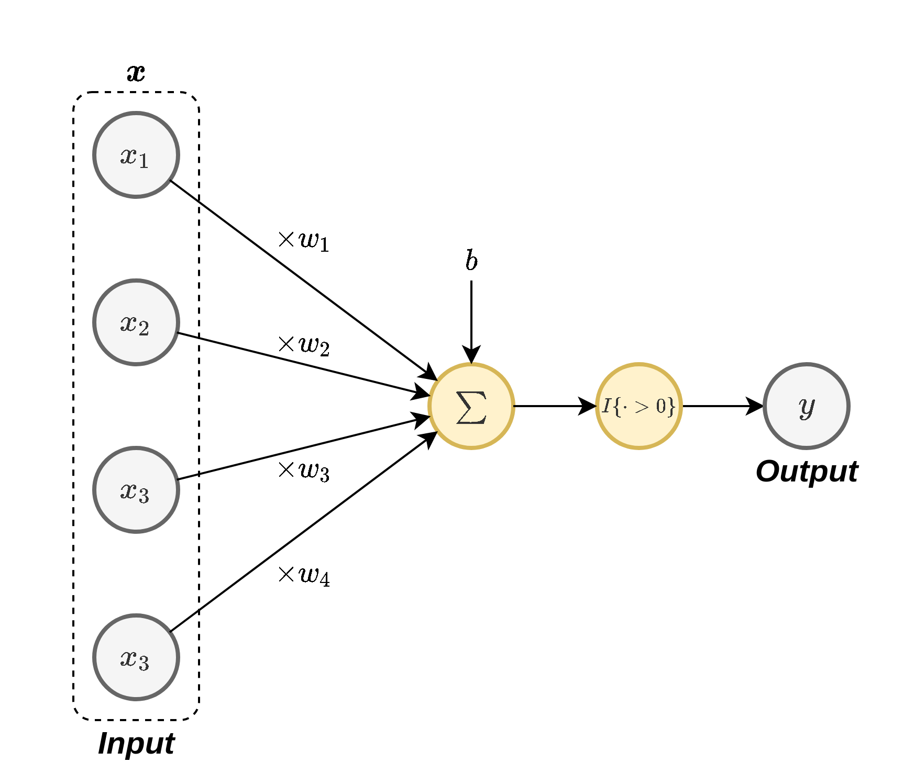
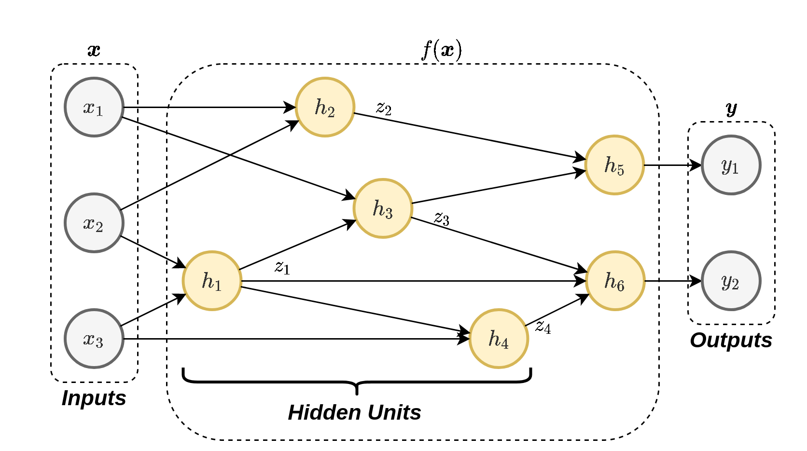
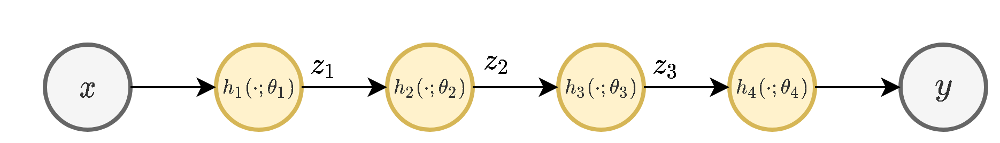

<section class="center">

# הרצאה 8 - Neural Networks

<a href="/assets/lecture08_slides.pdf" class="link-button" target="_blank">PDF</a>

</section><section>

## מה נלמד היום

</section><section>

## רשת נוירונים מלאכותית כמודל פרמטרי

- נתקלנו במספר מקרים בהם ניסינו למצוא פונקציה שבצע פעולה או תתאר תופעה כל שהיא (מציאת חזאי או פונקציית פילוג).
- דרך נוחה לעשות זאת היא בעזרת מודל פרמטרי ומציאת הפרמטרים האופטימאלים.
- עד כה עבדנו עם מודלים לינאריים בפרמטרים.
- ניתן לקרב הרבה מאד פונקציות בעזרת פולינום מסדר מספיק גבוהה.
- מודלים אלו הם לא מאד מוצלחים ובעיתיים וכאשר $\boldsymbol{x}$ הוא ממימד גבוה.
- האם ישנם מודלים מתאימים יותר?

</section><section>

## רשתות נוירונים מלאכותיות Artificail Neural Networks - ANN

- בשנים האחרונות מודלים אלו הוכיחו את עצמם כמודלים פרמטריים מאד יעילים לפתרון מגוון רחב של בעיות.
- הההשראה לצורה שבה הם בנויים מגיעה מרשתות נויירונים ביולוגיות.

</section><section>

## נוירון ביולוגי

 
 

</section><section>

## נוירון ביולוגי

בצורה פשטנית ניתן לתאר את האופן בו נוירון ביולוגי פועל כך:

</section><section>

## נוירון ביולוגי

 באופן סכימתי ניתן למדל את פעולת הנוירון באופן הבא:

$$
y=I\{\boldsymbol{x}^{\top}\boldsymbol{w}+b>0\}
$$

</section><section>

## נוירונים ברשת נוירונים מלאכותית

- פונקציית המדרגה היא בפועל מאד בעייתית.
- לשם כך נחליף את פונקציית המדרגה בפונקציה אחרת כל שהיא $\varphi(\cdot)$.
- פונקציה זו מכונה **פונקציית ההפעלה (activation function)**.
- בחירות נפוצות של פונקציית ההפעלה כוללות את:
    - הפונקציה הלוגיסטית (סיגמואיד): $\varphi(x)=\sigma(x)=\frac{1}{1+e^{-x}}$
    - טנגנס היפרבולי: $\varphi(x)=\tanh\left(x/2\right)$
    - $\varphi(x)=\max(x,0)$ :ReLU (Rectified Linear Unit).

- פונקציות נוספות שנמצאות הם כל מיני וריאציות של ReLU.

</section><section>

## נוירונים ברשת נוירונים מלאכותית

באופן סכימתי נסמן נוירון בודד באופן הבא:

</section><section>

## רשת נוירונים

נשלב מספר נוירונים יחד על מנת לבנות רשת נוירונים:

 

 

רשת שכזו יכולה לקרב מגוון מאד רחב של פונקציות. הפרמטרים של המודל יהיו הפרמטרים של כל הנוירונים.

</section><section>

## רשת נוירונים

 

לרוב הנוירונים יהיו מהצורה של:

$$
h_j(\boldsymbol{x};\boldsymbol{w}_j,b_j)=\varphi(\boldsymbol{x}^{\top}\boldsymbol{w}_j+b_j)
$$

אך ניתן גם לבחור פונקציות אחרות. בקורס זה, אלא אם נאמר אחרת, אנו נניח כי כי הנוירונים הם מהצורה הזו.

</section><section>

## הארכיטקטורה של הרשת

המבנה של הרשת אשר כולל מספר הנוירונים שהיא מכילה ואת הדרך שבה הם מחוברים אחד לשני.

- בחירת הארכיטקטורה היא קריטית לביצועים.
- לשימושים שונים מתאימות ארכיטקטורות שונות.
- חלק גדול מאד מהמחקר שנעשה כיום הוא סביב הנושא של חיפוש ארכיטקטורות.
- התהליך של מציאת הארכיטקטורה דורש לא מעט ניסיון, אינטואיציה והרבה ניסוי וטעיה.
- לרוב נמצא בעיה דומה ונשתמש בארכיטקטורה שעבדה טובה במקרה זה (נרפרנס).

</section><section>

## הארכיטקטורה של הרשת

- **יחידות נסתרות** (**hidden units**): הנוירונים אשר אינם מחוברים למוצא הרשת.
- **רשת עמוקה** (**deep network**): רשת אשר מכילה מסלולים אשר עוברים דרך יותר מיחידה נסתרת אחת.

</section><section>

## Feed-forward vs. Recurrent

אנו מבדילים בין שני סוגי ארכיטקטורות:

- **רשת הזנה קדמית (feed-forward network)**: ארכיטקטורות אשר אינם מכילות מסלולים מעגליים.
- **רשתות נשנות (recurrent neural network - RNN)**: בקורס זה לא נעסוק ברשתות מסוג זה. אלו ארכיטקטורות אשר כן מכילות מסלולים מעגליים.

</section><section>

## על החשיבות של פונקציות ההפעלה

- ללא פונקציית ההפעלה הנורונים היו לינאריים ולכן כל הרשת תהיה פשוט מודל לינארי.

</section><section>

## המוצא של הרשת

### Regression + ERM

- הרשת תמדל חזאי אשר אמור להוציא סקלר שמקבל ערכים רציפים בתחום לא מוגבל.
- אנו נרצה שהמוצא של הרשת יתנקז לנוירון בודד ללא פונקציית אקטיבציה.

</section><section>

## המוצא של הרשת

### סיווג בינארי + הדיסקרימינטיבית הסתברותית

- הרשת תמדל את $p_{\text{y}|\mathbf{x}}(1|\boldsymbol{x})$.
- אנו נרצה שהרשת תוציא ערך סקלרי רציף בתחום בין 0 ל-1.
- שהמוצא של הרשת יתנקז לנוירון בודד עם פונקציית הפעלה שמוציאה ערכים בתחום $[0,1]$ כדוגמאת הפונקציה הלוגיסטית.

### סיווג לא בינארי + הדיסקרימינטיבית הסתברותית

- הרשת תמדל את כל ההסתברותיות $p_{\text{y}|\mathbf{x}}(y|\boldsymbol{x})$.
- נרצה שהרשת תוציא וקטור באורך $C$ שעליו נפעיל את פונקציית ה softmax.

</section><section>

## מציאת הפרמטרים של המודל

בעיית האופטימיזציה:

- ב ERM אנו ננסה למזער את ה risk האמפרי
- בגישה הדיסקרימינטיבית הסתברותית נשתמש ב MLE או MAP.

בכדי לפתור את בעיית האופטימיזציה נשתמש ב grdaient descent.

</section><section>

## MultiLayer Percepron (MLP)

- הנוירונים מסודרים בשתייים או יותר שכבות (layers)
- השכבות הם **Fully Connected (FC)** (כל נוירון מוזן מ**כל** הנוריונים שבשכבה שלפני).

</section><section>

## MultiLayer Percepron (MLP)

מה שמגדיר את הארכיטקטורה במקרה של MLP הוא מספר השכבות וכמות הנוירונים בכל שכבה (**רוחב השכבה**). בדוגמה הזו, יש ברשת 3 שכבות ברוחב 2, 3 ו 2.

</section><section>

## רישום מטריצי

- $W_i=
\begin{bmatrix}
-&\boldsymbol{w}_{i,1}&-\\
-&\boldsymbol{w}_{i,2}&-\\
&\vdots&\\
\end{bmatrix}$
- $\boldsymbol{b}_i=[b_{i,1},b_{i,2},\dots]^{\top}$

הפונקציה שאותה ממשת השכבה כולה הינה:

$$
\boldsymbol{z}_i=\varphi(W_i\boldsymbol{z}_{i-1}+\boldsymbol{b}_i)
$$

</section><section>

## "משפט הקירוב האוניברסלי"

בהינתן:

- פונקציית הפעלה רציפה כל שהיא $\varphi$ ש**אינה פולינומאילית** (או חסומה ואינטגרבילית).
- ופונקציה רציפה כל שהיא על קוביית היחידה $f:[0,1]^{D_{\text{in}}}\rightarrow[0,1]^{D_{\text{out}}}$.

אזי ניתן למצוא פונקציה $f_{\varepsilon}:[0,1]^{D_{\text{in}}}\rightarrow[0,1]^{D_{\text{out}}}$ מהצורה:

$$
f_{\varepsilon}(\boldsymbol{x})=W_2\varphi(W_1\boldsymbol{x}+\boldsymbol{b}_1)+\boldsymbol{b}_2
$$

כך ש:

$$
\underset{x\in[0,1]^{D_{\text{in}}}}{\text{sup}}\lVert
f(\boldsymbol{x})-f_{\varepsilon}(\boldsymbol{x})
\rVert<\varepsilon
$$

</section><section>

## Back-Propagation

שיטה המקלה על חישוב הנגזרות על ידי שימוש בכלל השרשרת.

### כלל השרשרת - תזכורת

במקרה הסקלרי:

$$
\left(f(g(x))\right)'=f'(g(x))\cdot g'(x)
$$

במקרה של מספר משתנים:

$$
\begin{aligned}
\frac{d}{dx} f(z_1(x),z_2(x),z_3(x))
=& &\left(\frac{d}{dz_1} f(z_1(x),z_2(x),z_3(x))\right)\frac{d}{dx}z_1(x)\\
 &+&\left(\frac{d}{dz_2} f(z_1(x),z_2(x),z_3(x))\right)\frac{d}{dx}z_2(x)\\
 &+&\left(\frac{d}{dz_3} f(z_1(x),z_2(x),z_3(x))\right)\frac{d}{dx}z_3(x)\\
\end{aligned}
$$

</section><section>

## Back-Propagation

לאלגוריתם 2 שלבים:

- **Forward pass**: העברה של הדגימות דרך הרשת ושמירה של כל ערכי הביניים.
- **Backward pass**: חישוב של הנגזרות של הנוירונים מהמוצא של הרשת לכיוון הכניסה.

</section><section>

## Back-Propagation - דוגמא פשוטה

 

נרשום את הנגזרת של $y$ לפי $\theta_2$:

$$
\frac{dy}{d\theta_2}=\frac{dy}{dz_2}\frac{dz_2}{d\theta_2}=\frac{dy}{dz_2}\frac{d}{d\theta_2}h_2(z_1;\theta_2)
$$

נוכל לפרק גם את הנגזרת של $\frac{dy}{dz_2}$:

$$
\frac{dy}{dz_2}=\frac{dy}{dz_3}\frac{dz_3}{dz_2}=\frac{d}{dz_3}h_4(z_3;\theta_4)\frac{d}{dz_2}h_3(z_2;\theta_3)
$$

לכן:

$$
\frac{dy}{d\theta_2}=\frac{dy}{dz_3}\frac{dz_3}{dz_2}\frac{dz_2}{d\theta_2}=\frac{d}{dz_3}h_4(z_3;\theta_4)\frac{d}{dz_2}h_3(z_2;\theta_3)\frac{d}{d\theta_2}h_2(z_1;\theta_2)
$$

</section><section>

## Back-Propagation - דוגמא פשוטה

$$
\frac{dy}{d\theta_2}=\frac{dy}{dz_3}\frac{dz_3}{dz_2}\frac{dz_2}{d\theta_2}=\frac{d}{dz_3}h_4(z_3;\theta_4)\frac{d}{dz_2}h_3(z_2;\theta_3)\frac{d}{d\theta_2}h_2(z_1;\theta_2)
$$

 

בכדי לחשב את הביטוי שקיבלנו עלינו לבצע את שני השלבים הבאים:

- לחשב את כל ה $z_i$ לאורך הרשת (forward pass).
- לחשב את כל הנגזרות מהמוצא של הרשת ועד לנקודה בה נמצא הפרמטר שלפיו רוצים לגזור (backword-pass).

</section><section>

## Back-Propagation - דוגמא מעט יותר מורכבת

 

נחשב את הנגזרת של $y_1$ לפי $\theta_3$.

</section><section>

## Back-Propagation - דוגמא מעט יותר מורכבת

 

נפרק את הנגזרת של $\frac{dy_1}{d\theta_3}$ בדומה למה שחישבנו קודם:

$$
\begin{aligned}
\frac{dy_1}{d\theta_3}
&=\frac{dy_1}{dz_7}\frac{dz_7}{dz_6}\frac{dz_6}{dz_3}\frac{dz_3}{d\theta_3}\\
&=\frac{d}{dz_7}h_8(z_7;\theta_8)\frac{d}{dz_6}h_7(z_6;\theta_7)\frac{d}{dz_3}h_6(z_5;\theta_6)\frac{d}{d\theta_3}h_3(z_2;\theta_3)
\end{aligned}
$$

</section><section>

## Back-Propagation - דוגמא מעט יותר מורכבת

$$
\begin{aligned}
\frac{dy_1}{d\theta_3}
&=\frac{dy_1}{dz_7}\frac{dz_7}{dz_6}\frac{dz_6}{dz_3}\frac{dz_3}{d\theta_3}\\
&=\frac{d}{dz_7}h_8(z_7;\theta_8)\frac{d}{dz_6}h_7(z_6;\theta_7)\frac{d}{dz_3}h_6(z_5;\theta_6)\frac{d}{d\theta_3}h_3(z_2;\theta_3)
\end{aligned}
$$

- נריץ את ה forward-pass בשביל לחשב את ערכי ה $z_i$.
- נריץ את ה backword-pass בו נחשב את הנגזרות מהמוצא של הרשת עד לנגזרת של $h_3$.

</section>

