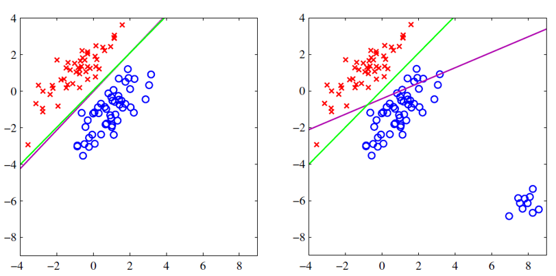
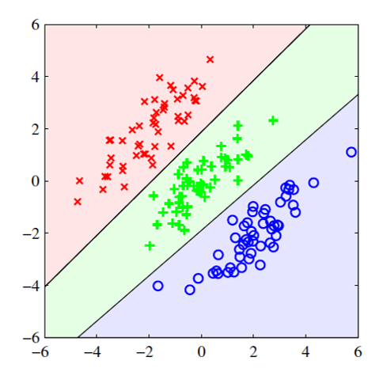
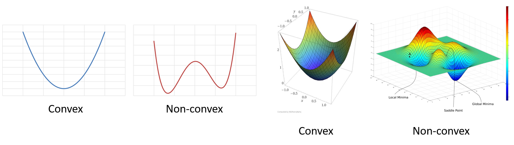
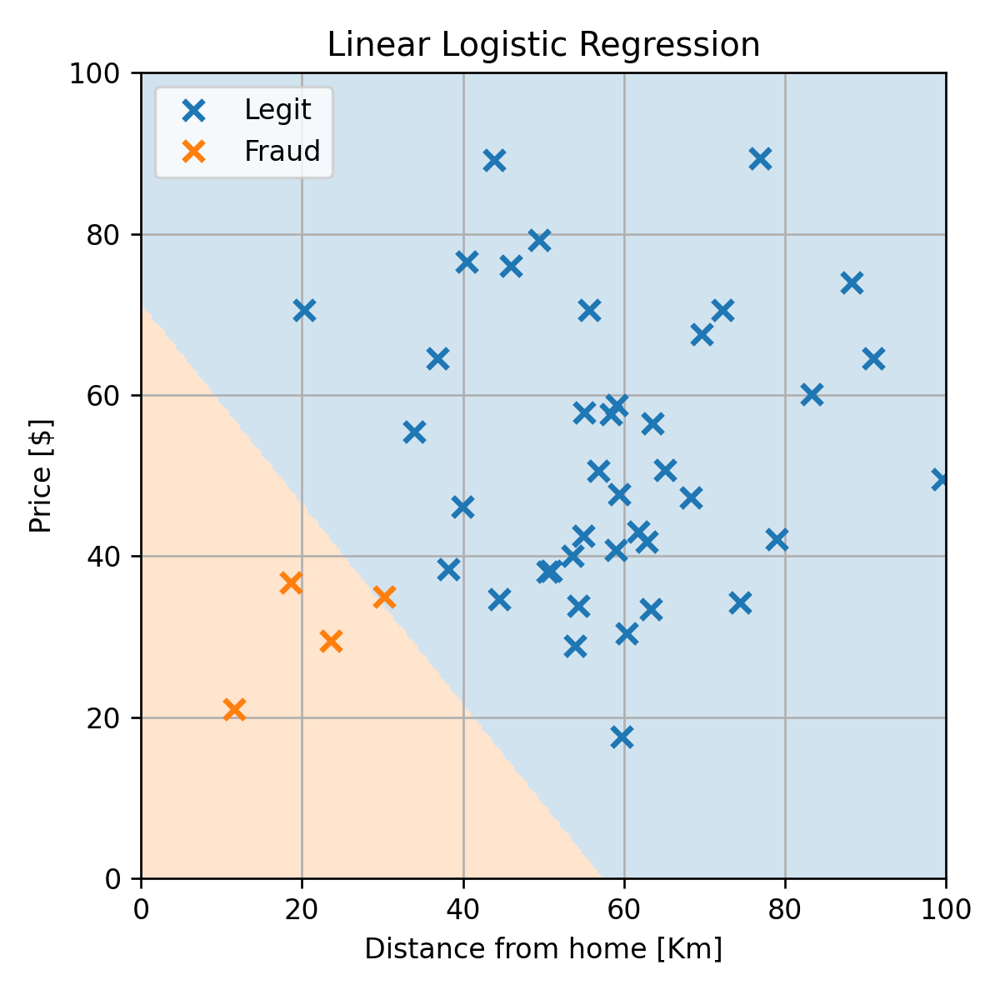

<section class="center">

# הרצאה 9 - גישה דיסקרימינטיבית הסתברותית

<a href="/assets/lecture09_slides.pdf" class="link-button" target="_blank">PDF</a>

</section><section>

## מה נלמד היום

</section><section>

## דוגמא לבעיה בגישה הגנרטיבית פרמטרית

נסתכל שוב על הבעיה של חיזוי עסקאות שחשודות כהונאות:

</section><section>

## התאמה של מודל QDA

$$
p_{\text{y}}(0)=\frac{|\mathcal{I}_0|}{N}=0.81
$$

$$
p_{\text{y}}(1)=\frac{|\mathcal{I}_1|}{N}=0.19
$$

$$
\boldsymbol{\mu}_0 = \frac{1}{|\mathcal{I}_0|}\sum_{i\in \mathcal{I}_0}\boldsymbol{x}^{(i)}=[55.1,54.6]^{\top}
$$

$$
\boldsymbol{\mu}_1 = \frac{1}{|\mathcal{I}_1|}\sum_{i\in \mathcal{I}_1}\boldsymbol{x}^{(i)}=[54.4,55.2]^{\top}
$$

$$
\Sigma_0 = \frac{1}{|\mathcal{I}_0|}\sum_{i}\left(\boldsymbol{x}^{(i)}-\boldsymbol{\mu}_{y^{(i)}}\right)\left(\boldsymbol{x}^{(i)}-\boldsymbol{\mu}_{y^{(i)}}\right)^T
=\begin{bmatrix}
350.9 & -42.9 \\
-42.9 & 336
\end{bmatrix}
$$

$$
\Sigma_1 = \frac{1}{|\mathcal{I}_1|}\sum_{i}\left(\boldsymbol{x}^{(i)}-\boldsymbol{\mu}_{y^{(i)}}\right)\left(\boldsymbol{x}^{(i)}-\boldsymbol{\mu}_{y^{(i)}}\right)^T
=\begin{bmatrix}
817.9 & 730.5 \\
730.5 & 741.7
\end{bmatrix}
$$

</section><section>

## התאמה של מודל QDA

שגיאת החיזוי (miscalssification rate) על ה test set הינה 0.08.

 

התוצאה סבירה, אך ניתן לראות  שגאוסיאן לא מאד מתאים לפילוג של ההונאות.

</section><section>

## הבעיה של הגישה הגנרטיבית פרמטרית

- היינו רוצים מודל אשר יכול לייצג בנפרד את שני האיזורים.
- לצערנו המבחר של המודלים בהם אנו יכולים לא גדול.
- המגבלה הזו נובעת מהצורך שהמודל ייצג פילוגים חוקיים.

**הערה**: במקרה זה ניתן להשתמש ב GMM + EM.

</section><section>

## דוגמא למדגם שמתאים למודל של QDA

לצורך הדגמה נסתכל על גירסא של המדגם שבה יש רק איזור אחד של ההונאות:

</section><section>

## מודל QDA

שגיאת החיזוי (miscalssification rate) על ה test set במקרה הזה הינה 0.

</section><section>

## מודל LDA

רק לשם השוואה, נציג גם את התוצאה המתקבלת ממודל ה LDA:

</section><section>

## הגישות שראינו עד כה

##### הגישה הדיסקרימינטיבית

מדגם 
▼ 
חזאי בעל ביצועים טובים על המדגם

##### הגישה הגנרטיבית

מדגם 
▼ 
הפילוג **המשותף** של $\mathbf{x}$ ו $\text{y}$ על סמך המדגם 
▼ 
חזאי אופטימלי בהינתן הפילוג המשותף

</section><section>

## הגישה הדיסקרימינטיבית הסתברותית

ברוב פונקציות המחיר החזאי האופטימאלי יהיה תלוי רק בפילוג המותנה של $\text{y}$ בהינתן $\mathbf{x}$.

##### הגישה הדיסקרימינטיבית הסתברותית

מדגם 
▼ 
הפילוג **המותנה** של $\text{y}$ בהינתן $\mathbf{x}$ על סמך המדגם 
▼ 
חזאי אופטימלי בהינתן הפילוג המותנה

</section><section>

## ההתייחסות לגישה זו במקרות אחרים

- גישה זו מוכוונת ישירות למציאת החזאי ולא מנסה ללמוד את התכונות של המדגם לכן נחשבת לגישה דיסקרימינטיבית.

 

- השם גישה דיסקרימינטיבית הסתברותית לא מופיע במקומות אחרים.
- במרבית המקומות מציינים שיש שתי גישות דיסקרימינטיבית אך לא נותנים להם שמות שונים.

</section><section>

## שימוש במודלים פרמטריים

- אנו נבחר מודל פרמטרי אשר יתאר את הפילוג המותנה, $p_{\text{y}|\mathbf{x}}(y|\boldsymbol{x})$.
- נשערך את פרמטרים של המודל בשיטות דומות לגישה הגנרטיבית (MLE ו MAP).

</section><section>

## MLE על הפילוג המותנה

$$
\begin{aligned}
\boldsymbol{\theta}^*
&=\underset{\boldsymbol{\theta}}{\arg\min}\ -\sum_{i=1}^{N}\log\left(p_{\mathbf{x},\text{y}}(\boldsymbol{x}^{(i)},y^{(i)};\boldsymbol{\theta})\right)\\
&=\underset{\boldsymbol{\theta}}{\arg\min}\ -\sum_{i=1}^{N}\log\left(p_{\text{y}|\mathbf{x}}(y^{(i)}|\boldsymbol{x}^{(i)};\boldsymbol{\theta})p_{\mathbf{x}}(\boldsymbol{x}^{(i)})\right)\\
&=\underset{\boldsymbol{\theta}}{\arg\min}\ 
-\sum_{i=1}^{N}\log\left(p_{\text{y}|\mathbf{x}}(y^{(i)}|\boldsymbol{x}^{(i)};\boldsymbol{\theta})\right)
-\sum_{i=1}^{N}\log\left(p_{\mathbf{x}}(\boldsymbol{x}^{(i)})\right)\\
&=\underset{\boldsymbol{\theta}}{\arg\min}\ -\sum_{i=1}^{N}\log\left(p_{\text{y}|\mathbf{x}}(y^{(i)}|\boldsymbol{x}^{(i)};\boldsymbol{\theta})\right)\\
\end{aligned}
$$

- המשמעות היא ש אין צורך לדעת או לשערך את הפילוג של $\mathbf{x}$.
- ניתן להגיע לאותה תוצאה גם עבור משערך MAP.
- שימו לב שהפילוג השולי של $\mathbf{x}$ אינו משפיע על הסיווג. 

</section><section>

## היתרון של הדיסקרימינטיבית הסתברותית

$p_{\mathbf{x},\text{y}}(\boldsymbol{x},y)$ צריכה לקיים את התנאים הבאים:

1. $p_{\mathbf{x},\text{y}}(\boldsymbol{x},y;\boldsymbol{\theta})\geq 0\qquad \forall \boldsymbol{x},y,\boldsymbol{\theta}$
2. $\int\int p_{\mathbf{x},\text{y}}(\boldsymbol{x},y;\boldsymbol{\theta})d\boldsymbol{x}dy=1\qquad \forall \boldsymbol{\theta}$

עבור בעיות סיווג $p_{\text{y}|\mathbf{x}}(y|\boldsymbol{x})$ צריכה לקיים את התנאים הבאים:

1. $p_{\text{y}|\mathbf{x}}(y|\boldsymbol{x};\boldsymbol{\theta})\geq 0\qquad \forall \boldsymbol{x},y,\boldsymbol{\theta}$
2. $\sum_{y=1}^C p_{\text{y}|\mathbf{x}}(y|\boldsymbol{x};\boldsymbol{\theta})=1\qquad \forall \boldsymbol{x},\boldsymbol{\theta}$

האינטגרל על כל הערכים התחלף בסכום סופי של איברים.

נראה כעת כיצד ניתן לבנות מודלים המקיימים תנאים אלו.

</section><section>

## סיווג בינארי

עבור התנאי השני יהיה:

$$
p_{\text{y}|\mathbf{x}}(0|\boldsymbol{x};\boldsymbol{\theta})+p_{\text{y}|\mathbf{x}}(1|\boldsymbol{x};\boldsymbol{\theta})=1\qquad \forall \boldsymbol{x},\boldsymbol{\theta}
$$

 

דרך פשוטה לקיים תנאי זה הינה למצוא פונקציה $f(\boldsymbol{x};\boldsymbol{\theta})$ אשר מחזירה ערכים בין 0 ל 1 ולהגדיר את המודל באופן הבא:

$$
\begin{aligned}
p_{\text{y}|\mathbf{x}}(1|\boldsymbol{x};\boldsymbol{\theta})&=f(\boldsymbol{x};\boldsymbol{\theta})\\
p_{\text{y}|\mathbf{x}}(0|\boldsymbol{x};\boldsymbol{\theta})&=1-f(\boldsymbol{x};\boldsymbol{\theta})
\end{aligned}
$$

</section><section>

## הפונקציה הלוגיסטית

$$
\sigma(z)=\frac{1}{1+e^{-z}}
$$

 

 

**הערה**: מקובל לכנות את הפונקציה הזו **סיגמואיד (sigmoid)**. 

</section><section>

## הפונקציה הלוגיסטית

כל מודל פרמטרי מהצורה:

$$
\begin{aligned}
p_{\text{y}|\mathbf{x}}(1|\boldsymbol{x};\boldsymbol{\theta})&=\sigma(f(\boldsymbol{x};\boldsymbol{\theta}))\\
p_{\text{y}|\mathbf{x}}(0|\boldsymbol{x};\boldsymbol{\theta})&=1-\sigma(f(\boldsymbol{x};\boldsymbol{\theta}))
\end{aligned}
$$

יהיה מודל פרמטרי חוקי עבור $f$ שמקבלת ערכים חיוביים ושליליים.

</section><section>

## תכונות

- רציפה
- מונוטונית עולה
- $1-\sigma(z)=\sigma(-z)$
- $\frac{d}{d z}\log(\sigma(z))=1-\sigma(z)$

</section><section>

## Binary Logistic Regression

ב Binary Logistic Regression (כלומר, $y\in\{0,1\}$) נשתמש במודל שהצגנו קודם:

$$
\begin{aligned}
p_{\text{y}|\mathbf{x}}(1|\boldsymbol{x};\boldsymbol{\theta})&=\sigma(f(\boldsymbol{x};\boldsymbol{\theta}))\\
p_{\text{y}|\mathbf{x}}(0|\boldsymbol{x};\boldsymbol{\theta})&=1-\sigma(f(\boldsymbol{x};\boldsymbol{\theta}))
\end{aligned}
$$

נמצא את הפרמטרים של המודל בעזרת MLE:

$$
\begin{aligned}
\boldsymbol{\theta}^*
&=\underset{\boldsymbol{\theta}}{\arg\min}\ -\sum_{i=1}^{N}\log\left(p_{\text{y}|\mathbf{x}}(y^{(i)}|\boldsymbol{x}^{(i)};\boldsymbol{\theta})\right)\\
&=\underset{\boldsymbol{\theta}}{\arg\min}\ -\sum_{i=1}^{N}
    I\{y^{(i)}=1\}\log(\sigma(f(\boldsymbol{x}^{(i)};\boldsymbol{\theta})))\\
&\qquad\qquad\qquad\qquad\qquad\qquad +I\{y^{(i)}=0\}\log(1-\sigma(f(\boldsymbol{x}^{(i)};\boldsymbol{\theta})))\\
&=\underset{\boldsymbol{\theta}}{\arg\min}\ -\sum_{i=1}^{N}
    y^{(i)}\log(\sigma(f(\boldsymbol{x}^{(i)};\boldsymbol{\theta})))
   +(1-y^{(i)})\log(1-\sigma(f(\boldsymbol{x}^{(i)};\boldsymbol{\theta})))
\end{aligned}
$$

</section><section>

## Binary Logistic Regression

$$
\boldsymbol{\theta}^*
=\underset{\boldsymbol{\theta}}{\arg\min}\ -\sum_{i=1}^{N}
    y^{(i)}\log(\sigma(f(\boldsymbol{x}^{(i)};\boldsymbol{\theta})))
   +(1-y^{(i)})\log(1-\sigma(f(\boldsymbol{x}^{(i)};\boldsymbol{\theta})))
$$

במרבית המקרים לא ניתן יהיה לפתור באופן אנליטי ונחפש את הפתרון בשיטות נומריות כגון אלגוריתם ה gradient descent עליו נרחיב בהמשך ההרצאה.

**הערה:** בגישה הגנרטיבית שתארנו גם לא ניתן בד"כ לחשב אנליטית את פתרון הסבירות המרבית. במקרה הגאוסי זה ניתן כמו שראינו. 

</section><section>

## Binary Logistic Regression

$$
\begin{aligned}
p_{\text{y}|\mathbf{x}}(1|\boldsymbol{x};\boldsymbol{\theta})&=\sigma(f(\boldsymbol{x};\boldsymbol{\theta}))\\
p_{\text{y}|\mathbf{x}}(0|\boldsymbol{x};\boldsymbol{\theta})&=1-\sigma(f(\boldsymbol{x};\boldsymbol{\theta}))
\end{aligned}
$$

 

עבור misclassification rate החזאי האופטימאלי יהיה:

$$
h(\boldsymbol{x})
=\underset{y}{\arg\max}\ p_{\text{y}|\mathbf{x}}(y|\boldsymbol{x};\boldsymbol{\theta})
=\begin{cases}
    1 & \sigma(f(\boldsymbol{x};\boldsymbol{\theta})) > 0.5 \\
    0 & \text{else}
\end{cases}
=\begin{cases}
    1 & f(\boldsymbol{x};\boldsymbol{\theta}) > 0 \\
    0 & \text{else}
\end{cases}
$$

</section><section>

## סיווג לא בינארי

ניתן להרחיב את השיטה לבניית מודלים באמצעות פונקציית ה **softmax**.

### פונקציית ה Softmax

לוקחים וקטור $\boldsymbol{z}$ באורך $C$ ומייצרים ממנו וקטור אשר יכול לייצג פילוג דיסקרטי חוקי.

$$
\text{softmax}(\boldsymbol{z})=\frac{1}{\sum_{c=1}^C e^{z_c}}[e^{z_1},e^{z_2},\dots,e^{z_C}]^{\top}
$$

או פונקציה עם טווח רב-ממדי:

$$
\text{softmax}(\boldsymbol{z})_i=\frac{e^{z_i}}{\sum_{c=1}^C e^{z_c}}
$$

</section><section>

## פונקציית ה Softmax

$$
\text{softmax}(\boldsymbol{z})_i=\frac{e^{z_i}}{\sum_{c=1}^C e^{z_c}}
$$

### תכונות

- $\text{softmax}(\boldsymbol{z} + a)_i=\text{softmax}(\boldsymbol{z})_i\ \forall i$.
- $\frac{\partial}{\partial z_j} \log(\text{softmax}(\boldsymbol{z}))_i=\delta_{i,j}-\text{softmax}(\boldsymbol{z})_j$

</section><section>

## הפונקציה הלוגיסטית כמקרה פרטי

עבור וקטור באורך 2: $\boldsymbol{z}=[a,b]$, נקבל:

$$
\begin{aligned}
\text{softmax}(\boldsymbol{z})_1&=\frac{e^{a}}{e^{a}+e^{b}}=\frac{1}{1+e^{b-a}}=\sigma(a-b)\\
\text{softmax}(\boldsymbol{z})_2&=\frac{e^{b}}{e^{a}+e^{b}}=1-\sigma(a-b)
\end{aligned}
$$

</section><section>

## (Non-Binary) Logistic Regression

עבור $C$ פונקציות פרמטריות כלשהן, $f_c(\boldsymbol{x};\boldsymbol{\theta}_c)$, ניתן לבנות מודל פרמטרי חוקי באופן הבא:

$$
p_{\text{y}|\mathbf{x}}(y|\boldsymbol{x};\boldsymbol{\theta})
=\frac{e^{f_y(\boldsymbol{x};\boldsymbol{\theta}_y)}}{\sum_{c=1}^C e^{f_c(\boldsymbol{x};\boldsymbol{\theta}_c)}}
$$

לשם נוחות נסמן:

- $\boldsymbol{\theta}=[\boldsymbol{\theta}_1^{\top},\boldsymbol{\theta}_2^{\top},\dots,\boldsymbol{\theta}_C^{\top}]^{\top}$.
- $\boldsymbol{f}(\boldsymbol{x};\boldsymbol{\theta})=[f_1(\boldsymbol{x};\boldsymbol{\theta}_1),f_2(\boldsymbol{x};\boldsymbol{\theta}_2),\dots,f_C(\boldsymbol{x};\boldsymbol{\theta}_C)]^{\top}$

נוכל לרשום את המודל הפרמטרי באופן הבא:

$$
p_{\text{y}|\mathbf{x}}(y|\boldsymbol{x};\boldsymbol{\theta})
=\text{softmax}(\boldsymbol{f}(\boldsymbol{x};\boldsymbol{\theta}))_{y}
$$

</section><section>

## (Non-Binary) Logistic Regression

$$
p_{\text{y}|\mathbf{x}}(y|\boldsymbol{x};\boldsymbol{\theta})
=\text{softmax}(\boldsymbol{f}(\boldsymbol{x};\boldsymbol{\theta}))_{y}
$$

 

משערך ה MLE של מודל זה יהיה נתון על ידי:

$$
\begin{aligned}
\boldsymbol{\theta}^*
&=\underset{\boldsymbol{\theta}}{\arg\min}\ -\sum_{i=1}^{N}\log\left(p_{\text{y}|\mathbf{x}}(y^{(i)}|\boldsymbol{x}^{(i)};\boldsymbol{\theta})\right)\\
&=\underset{\boldsymbol{\theta}}{\arg\min}\ -\sum_{i=1}^{N}\log(\text{softmax}(\boldsymbol{f}(\boldsymbol{x}^{(i)};\boldsymbol{\theta}))_{y^{(i)}})
\end{aligned}
$$

</section><section>

## היתירות בייצוג של מודל ה logistic regression

- במקרה הבינארי לא היינו צריכים להגדיר 2 פונקציות פרמטריות.
- במקרה הכללי מספיק להגדיר $C-1$ פונקציות פרמטריות.
- הסתברות של $C-1$ מחלקות תקבע באופן מוחלט את המחלקה האחרונה כך שהיא תשלים את ההסתברות ל-1.
- כל שינוי מהצורה של $f_c(\boldsymbol{x};\boldsymbol{\theta}_c)\rightarrow f_c(\boldsymbol{x};\boldsymbol{\theta}_c)+g(\boldsymbol{x})$ לא ישנה את הפילוג המותנה

במקרים מסויימים נרצה לבטל יתירות זו. ניתן לעשות זאת על ידי קיבוע של $f_1(\boldsymbol{x};\boldsymbol{\theta}_1)=0$

</section><section>

## Linear Logistic Regression

המקרה שבו הפונקציות הפרמטריות הם לינאריות:

$$
f_c(\boldsymbol{x};\boldsymbol{\theta}_c)=\boldsymbol{\theta}_c^{\top}\boldsymbol{x}
$$

אפשר כמובן להוסיף סף ע"י תוספת קבוע לאגף ימין. 

 

- במקרה זה פונקציית ה objective היא קמורה (convex) ומובטח ש gradient descent, במידה והוא מתכנס, יתכנס למינימום גלובלי.
- כאשר הפונקציה $f$ אינה לינארית, פונקציית המחיר בד"כ אינה קמורה ואז ייתכנו הרבה מינימות מקומיות. 
</section><section>

## Linear Logistic Regression

 

ירוק - סיווג בינארי לוגיסטי. 
סגול - קריטריון אחר.

 

האיור מתוך, C.M. Bishop, Pattern Recognition and Machine Learning

</section><section>

## Linear Logistic Regression

 

סיווג לוגיסטי לשלוש מחלקות. 

 

האיור מתוך, C.M. Bishop, Pattern Recognition and Machine Learning

</section><section>

## Gradient descent (שיטת הגרדיאנט)

האלגוריתם מנסה למצוא מינימום מקומי על ידי התקדמות בצעדים קטנים בכיוון שבו הפונקציה יורדת הכי מהר.

 

</section><section>

## Gradient descent (שיטת הגרדיאנט)

- אלגוריתם חמדן (greedy): מנסה בכל איטרציה לשפר את מצבו לעומת המצב הנוכחי
- יתכנס למינימום מקומי.
- הדרישה היחידה הינה היכולת לחשב את הנגזרת של פונקציית המטרה.

 

</section><section>

## Gradient descent (שיטת הגרדיאנט)

עבור בעיית המינמיזציה:

$$
\underset{\boldsymbol{\theta}}{\arg\min}\quad g(\boldsymbol{\theta})
$$

- מאתחלים את $\boldsymbol{\theta}^{(0)}$ לנקודה אקראית כל שהיא.
- חוזרים על צעד העדכון הבא עד שמתקיים תנאי עצירה:

    $$
    \boldsymbol{\theta}^{(t+1)}=\boldsymbol{\theta}^{(t)}-\eta \nabla_{\boldsymbol{\theta}}g(\boldsymbol{\theta}^{(t)})
    $$
בתרגול תראו שעבור גודל צעד קטן כיוון הגרדיאנט השלילי הוא זה המבטיח ירידה מרבית בערך הפונקציה. 

 

את הפרמטר $\eta$ יש לקבוע מראש, והוא יקבע את גודל הצעדים שהאלגוריתם יעשה.

</section><section>

## תנאי עצירה

$$
\boldsymbol{\theta}^{(t+1)}=\boldsymbol{\theta}^{(t)}-\eta \nabla_{\boldsymbol{\theta}}g(\boldsymbol{\theta}^{(t)})
$$

 

- מספר צעדי עדכון שנקבע מראש: $t>\text{max-iter}$.
- הנורמה של הגרדיאנט קטנה מערך סף: $\lVert\nabla_{\boldsymbol{\theta}}g(\boldsymbol{\theta})\rVert_2<\epsilon$
- השיפור בפונקציית המטרה קטן מערך סף: $g(\boldsymbol{\theta}^{(t-1)})-g(\boldsymbol{\theta}^{(t)})<\epsilon$
- שימוש בעצירה מוקדמת על מנת להתמודד עם התאמת יתר (נרחיב על כך בהרצאה הבאה)

</section><section>

## הבעיות של האלגוריתם

- התכנסות למינימום מקומי ותלות באיתחול
- לא ניתן לקבוע בוודאות האם האלגוריתם התכנס
- בעיית הבחירה של גודל הצעד

 

שתי הבעיות הראשונות מונעות הגעה לאופטימום אך עדיין לא מפריעות לאלגוריתם להניב תוצאות טובות.

הבעיה של בחירת גודל צעד עלולה למנוע מהאלגוריתם להניב תוצאות רלוונטיות תוך מספר סביר של צעדים.

</section><section>

## דוגמא גודל צעד קטן

</section><section>

## דוגמא גודל צעד גדול

</section><section>

## דוגמא גודל צעד גדול מידי

</section><section>

## בעיית הבחירה של גודל הצעד

- כאשר יהיו בבעיה כיוונים שונים בהם ישנו הבדל גדול בקצב השינוי של הפונקציה לרוב לא יהיה גודל צעד אשר יגרום לפונקציה להתכנס במספר סביר של צעדים. ראו למשל איור בשקפעם הקודמים. 
- gradient descent בצורתו הפשוטה אינו מאד שימושי.
- למזלנו ישנם מספר שיפורים שניתן לעשות על מנת להתמודד עם בעיה זו.
- לצערנו בקורס זה לא נספיק לכסות שיפורים אלו.
- האלגוריתם נידון בהרחבה בקורס "אופטימזציה" ובקורס "למידה עמוקה". 

</section><section>

## שיפורים נפוצים

1. הוספה של רכיב תנע (מומנטום) לאלגוריתם
2. שימוש בגודל צעד אשר משתנה במהלך הריצה

 

לקריאה על נושא:

1. [An overview of gradient descent optimization algorithms](http://ruder.io/optimizing-gradient-descent/)
2. [Why Momentum Really Works](https://distill.pub/2017/momentum/)

בתרגיל הרטוב תשתמשו במימוש קיים ADAM.

</section><section>

## דוגמא: Linear Logistic Regression

נחזור לבעיה של חיזוי עסקאות החשודות כהונאות אשראי.

</section><section>

## דוגמא: Linear Logistic Regression

נשתמש במודל של linear logistic regression:

$$
p_{\text{y}|\mathbf{x}}(y|\boldsymbol{x};\boldsymbol{\theta})
=\begin{cases}
\sigma(\boldsymbol{x}^{\top}\boldsymbol{\theta}) & y=1\\
1-\sigma(\boldsymbol{x}^{\top}\boldsymbol{\theta}) & y=0\\
\end{cases}
$$

נמצא את הפרמטרים של המודל בעזרת MLE:

$$
\boldsymbol{\theta}^*
=\underset{\boldsymbol{\theta}}{\arg\min}\ -\sum_{i=1}^{N}
    y^{(i)}\log(\sigma(\boldsymbol{x}^{(i)\top}\boldsymbol{\theta}))
   +(1-y^{(i)})\log(1-\sigma(\boldsymbol{x}^{(i)\top}\boldsymbol{\theta}))
$$

כלל העדכון של האלגוריתם יהיה:

$$
\boldsymbol{\theta}^{(t+1)}=\boldsymbol{\theta}^{(t)}+\eta\sum_{i=1}^{N}
    \left(
        y^{(i)}(1-\sigma(\boldsymbol{x}^{(i)\top}\boldsymbol{\theta}))
        -(1-y^{(i)})\sigma(\boldsymbol{x}^{(i)\top}\boldsymbol{\theta})
    \right)\boldsymbol{x}^{(i)}
$$

נזכור כי עבור בעיה זו, פונקציית המחיר קמורה. 

</section><section>

## בחירת $\eta$

נריץ את האלגוריתם מספר קטן של צעדים עבור ערכי $\eta$ שונים:

</section><section>

## בחירת $\eta$

- $\eta=30$ ו $\eta=100$ מתאימים למקרה של $\eta$ גדול מידי.
- נבחר את $\eta=10$.

- **שימו לב** כי האלגוריתם אינו מתכנס לגודל צעד גדול, אפילו שפונקציית המחיר קמורה! 

</section><section>

## דוגמא: Linear Logistic Regression

נריץ את האלגוריתם עם $\eta=10$ ונקבל את החזאי הבא:

</section><section>

## דוגמא: Linear Logistic Regression

נקבל misclassification rate של 0.02 על ה test set.

</section><section>

## שימוש במודל מסדר גבוה יותר

נוכל להשתמש בכל מודל שנרצה.

נחליף את $f(\boldsymbol{x};\boldsymbol{\theta})$ בפולינום מסדר שני ונקבל:

</section><section>

## שימוש במודל מסדר גבוה יותר

נקבל misclassification rate של 0 על ה test set.

</section>

