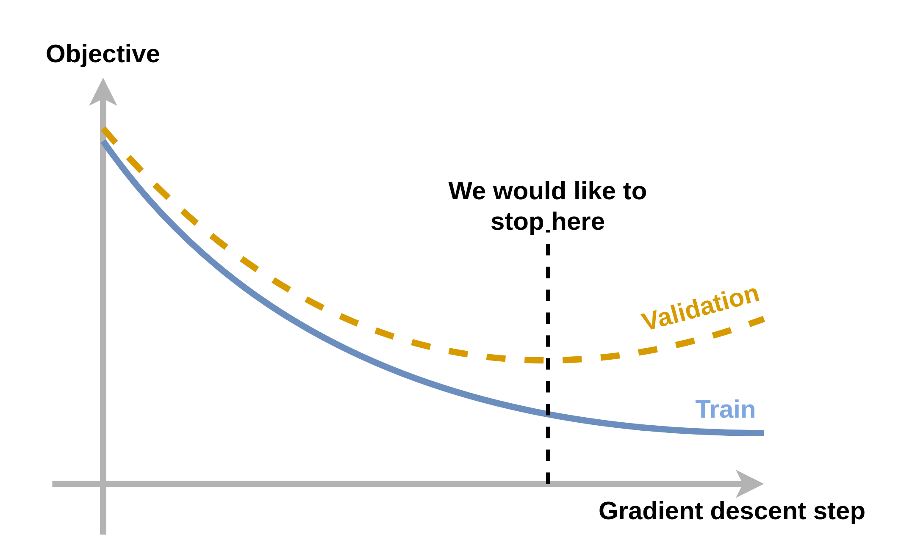
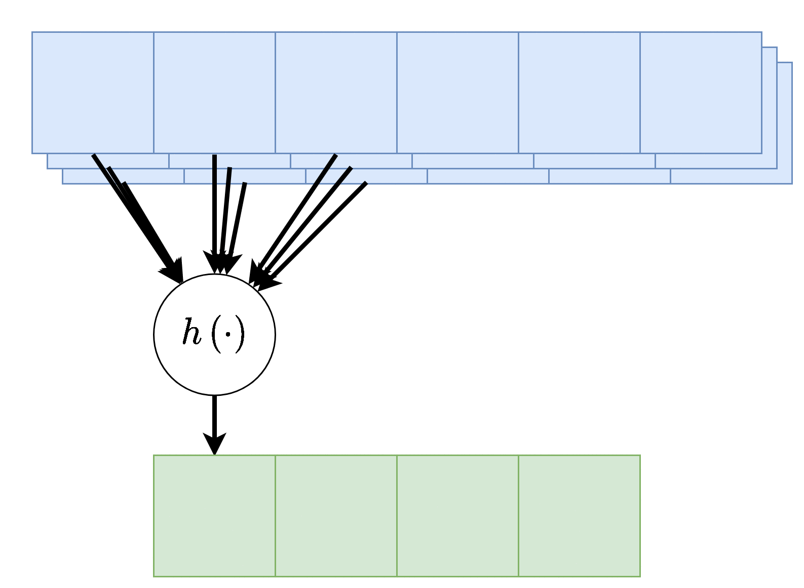
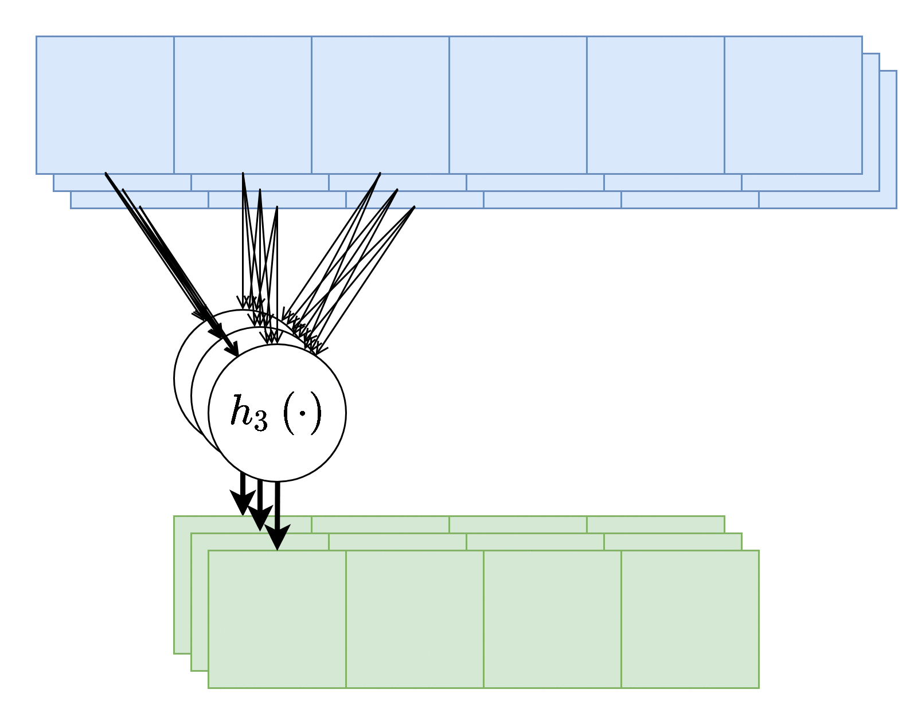
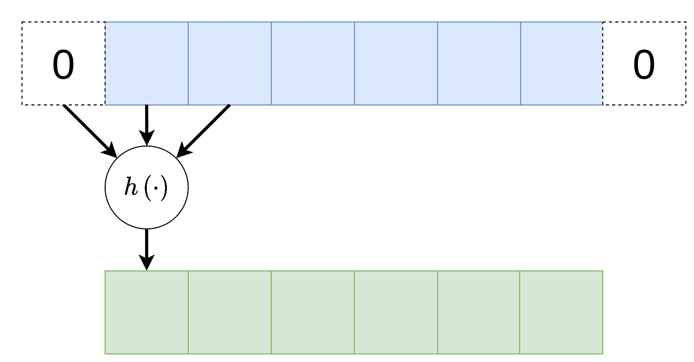
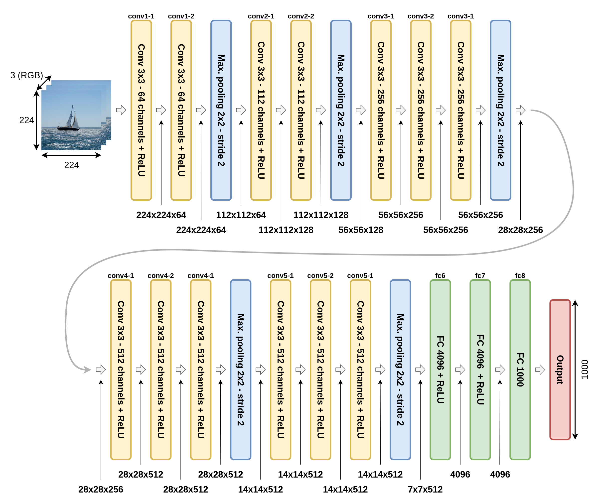
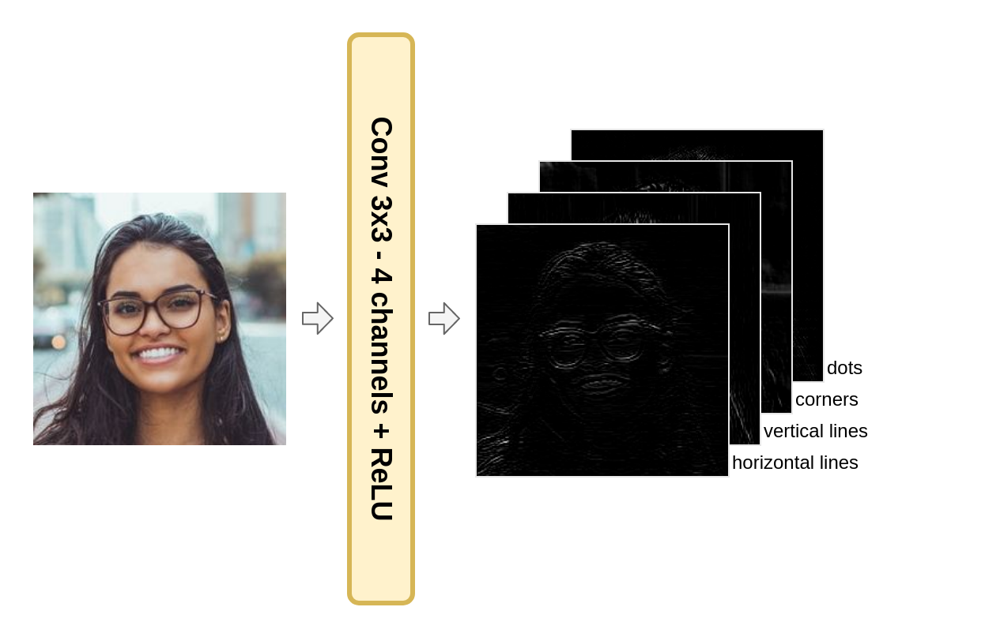
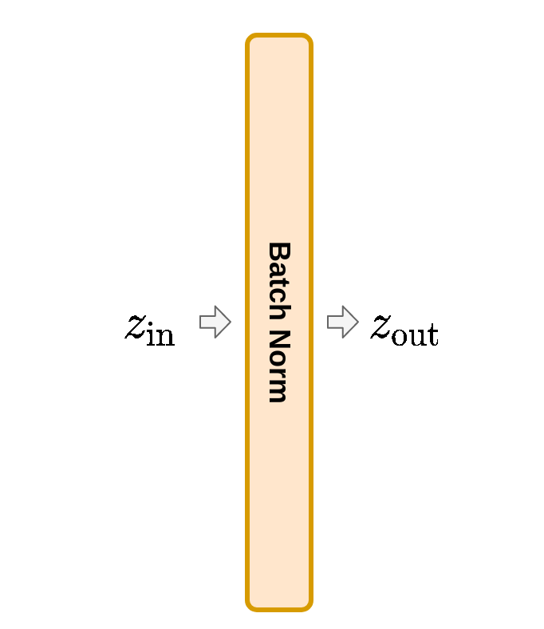

<section class="center">

# הרצאה 8 - CNN

<a href="/assets/lecture09_slides.pdf" class="link-button" target="_blank">PDF</a>

</section><section>

## (Classical) Gradient Descent

צעד העדכון ב gradient descent נתון על ידי:

$$
\boldsymbol{\theta}^{(t+1)}=\boldsymbol{\theta}^{(t)}-\eta\nabla_{\boldsymbol{\theta}}g(\boldsymbol{\theta})
$$

1. ב ERM:

    $$
    \underset{\boldsymbol{\theta}}{\arg\min} \underbrace{\frac{1}{N}\sum_{i=1}^N l(h(\boldsymbol{x^{(i)}};\boldsymbol{\theta}),y^{(i)})}_{g(\boldsymbol{\theta};\mathcal{D})}
    $$

2. MLE:

    $$
    \underset{\boldsymbol{\theta}}{\arg\min} \underbrace{-\sum_{i=1}^N \log(p_{\text{y}|\mathbf{x}}(y^{(i)}|\boldsymbol{x}^{(i)};\boldsymbol{\theta})}_{g(\boldsymbol{\theta};\mathcal{D})}
    $$

</section><section>

## (Classical) Gradient Descent

ב ERM:

$$
\underset{\boldsymbol{\theta}}{\arg\min} \underbrace{\frac{1}{N}\sum_{i=1}^N l(h(\boldsymbol{x^{(i)}};\boldsymbol{\theta}),y^{(i)})}_{g(\boldsymbol{\theta};\mathcal{D})}
$$

ב MLE:

$$
\underset{\boldsymbol{\theta}}{\arg\min} \underbrace{\sum_{i=1}^N \log(p_{\text{y};\mathbf{x}}(y^{(i)}|\boldsymbol{x}^{(i)};\boldsymbol{\theta})}_{g(\boldsymbol{\theta};\mathcal{D})}
$$

- הגרדיאנט מכיל סכום על כל המדגם אשר יכול להיות בעייתי כאשר המדגם גדול.
- נרצה להשתמש בחישוב אשר משתמש בכל צעד רק בחלק מן המדגם.

</section><section>

## Stochastic Gradient Descent

- מחשב בכל פעם את הנגזרת על פי **דגימה בודדת** מתוך המדגם, כאשר בכל צעד נשתמש בדגימה אחרת.
- שתי אופציות לבחירה של הדגימה בכל צעד הינן:

    1. להגריל דגימה אקראית אחרת בכל צעד.
    2. לעבור על הדגימות במדגם צורה סידרתית.

- כל אחת מהדגימות תצביע לכיוון שונה מהנגזרת של הסכום אבל בממוצע הכיוון הכללי יהיה זהה לכיוון של הסכום.
- החישוב הוא מאד מהיר אבל הגרדיאנט מאד "רועש".

</section><section>

## Mini-Batch Gradient Descent

- פתרון ביניים.
- בשיטה זו נשתמש בקבוצת דגימות מתוך המדגם המוכנה mini-batch. בכל צעד אנו נחליף את ה mini-batch.
- הנפוצה ביותר לאימון של רשתות נוירונים.
- גדלים אופיינים של ה mini-batch הינם 32-256 דגימות.

</section><section>

## שמות

- **Epoch**: מעבר שלם על המדגם.
- מתייחסים ל mini-batch בשם batch.
- בחבילות רבות האלגוריתם gradient descent מופיע תחת השם stochastic gradient descent.

</section><section>

## עצירה מוקדמת של gradient descent

- דרך מוצלחת נוספת למנוע overfitting הינה לעצור את אלגוריתם הגרדיאנט לפני שהוא מתכנס.
- זה נעשה על ידי חישוב ה objective על ה validataion set ובחירת הפרמטרים שממזערים את ה objective.

</section><section>

## Convolutional Neural Networks (CNN)

- ב MLPניתן להגדיל את היכולת הייצוג על ידי הגדלת הרשת (מספר השכבות והרוחב שלהם).
- כפי שקורה בכל מודל פרמטרי, הגדלה של יכולת הייצוג תגדיל גם את ה overfitting.
- רשת בעלת ארכיטקטורה טובה היא דווקא רשת בעלת יכולת ייצוג נמוכה אשר עדיין מוסגלת לקרב בצורה טובה את הפונקציה שאותה היא מנסה למדל.
- במקרים מסויימים ארכיטקטורה בשם convolutional nerual network (CNN) עונה בדיוק על דרישות אלו.

</section><section>

## שכבת קונבולוציה

1. כל נוירון בשכבה זו מוזן רק מכמות מוגבלת של ערכים הנמצאים בסביבתו הקרובה.
2. כל הנוירונים בשכבה מסויימת זהים (**weight sharing**).

</section><section>

## שכבת קונבולוציה

ניתן להסתכל על הפעולה של שכבת הקונבולוציה באופן הבא:

</section><section>

## שכבת קונבולוציה

מתמטית השיכבה מבצעת את שלושת הפעולות הבאות:

1. פעולת קרוס-קורלציה (ולא קונבולוציה) בין וקטור הכניסה $\boldsymbol{x}$ ווקטור משקולות $\boldsymbol{w}$ באורך $K$.
2. הוספת היסט $b$ (אופציונלי).
3. הפעלה של פונקציית הפעלה על וקטור המוצא איבר איבר.

</section><section>

## שכבת קונבולוציה

פעולת הקרוס-קורלציה מוגדרת באופן הבא:

$$
y_i=\sum_{m=1}^K x_{i+m-1}w_m
$$

וקטור המשקולות של שכבת הקונבולציה $\boldsymbol{w}$ נקרא **גרעין הקונבולוציה (convolution kernel)**.

</section><section>

## שכבת קונבולוציה

- גודל המוצא של שכבת הקונבולוציה הוא קטן יותר מהכניסה והוא נתון על ידי $D_{\text{out}}=D_{\text{in}}-K+1$.
- בשכבת FC קיימות $D_{\text{in}}\times D_{\text{out}}$ משקולות ועוד $D_{\text{out}}$ איברי היסט.
- בשכבת קונבולציה יש $K$ משקולות ואיבר היסט בודד.

</section><section>

## קלט רב-ערוצי

במקרים רבים נרצה ששכבת הקונבולציה תקבל קלט רב ממדי, לדוגמא, תמונה בעלת שלושה ערוצי צבע או קלט שמע ממספר ערוצי הקלטה.

</section><section>

## פלט רב-ערוצי

נרצה לרוב להשתמש ביותר מגרעין קונבולוציה אחד, במקרים אלו נייצר מספר ערוצים ביציאה בעבור כל אחד מגרעיני הקונבולוציה.

אין שיתוף של משקולות בין ערוצי הפלט השונים.

</section><section>

## פלט רב-ערוצי

- $C_\text{in}$ - מספר ערוצי קלט.
- $C_\text{out}$ - מספר ערוצי פלט.
- $K$ - גודל הגרעין.

מספר הפרמטרים בשכבה:  $\underbrace{C_\text{in}\times C_\text{out}\times K}_\text{the weights}+\underbrace{C_\text{out}}_\text{the bias}$.

</section><section>

## Padding - ריפוד

במידה ונרצה לשמור על גודל הוקטור במוצא של שכבת הקונבולוציה, ניתן לרפד את וקטור הכניסה באפסים. לדוגמא:

 

</section><section>

## Stride - גודל צעד

לעיתים נרצה דווקא להקטין את גודל הוקטור במוצא בפקטור מסויים. דרך אחת לעשות זאת היא על ידי דילול המוצא. בפועל אין צורך לחשב את הערכים במוצא שנזרקים ולכן למעשה ניתן לחשב את הקונבולוציה בקפיצות מסויימות המכונות stride.

 

</section><section>

## Dilation - התרחבות

במקרים אחרים נרצה לגדיל את האיזור שממנו אוסף נוירון מסויים את הקלט שלו מבלי להגדיל את מספר הפרמטרים ואת הסיבוכיות החישובית. לשם כך ניתן לדלל את הדרך בה נדגם הקלט על מנת להרחיב את איזור הקלט. אלא אם רשום אחרת, ה dilation של שכבה (הצפיפות בה הכניסה נדגמת) הוא 1.

 

</section><section>

## Max / Average Pooling

שיכבות נוספת אשר מופיעה במקרים רבים ברשתות CNN הם שכבות מסוג pooling. שני שכבות pooling נפוצות הם max pooling ו average pooling, שכבה זו לוקחת את הממוצע או המקסימום של ערכי הכניסה.

דוגמא זו מציגה max pooling בגודל 2 עם גודל צעד (stride) גם כן של 2:

בשכבה זאת אין פרמטרים נלמדים.

</section><section>

## 2D Convolutional Layer

<table style="width:100%; table-layout:fixed;">
  <tr>
    <td>
kernel size=3 padding=0 stride=1 dilation=1
</td>
    <td>
kernel size=4 padding=2 stride=1 dilation=1
</td>
    <td>
kernel size=3 padding=1 stride=1 dilation=1 (Half padding)
</td>
    <td>
kernel size=3 padding=2 stride=1 dilation=1 (Full padding)
</td>
  </tr>
  <tr>
    <td></td>
    <td></td>
    <td></td>
    <td></td>
  </tr>
  <tr>
    <td>
kernel size=3 padding=0 stride=2 dilation=1
</td>
    <td>
kernel size=3 padding=1 stride=2 dilation=1
</td>
    <td>
kernel size=3 padding=1 stride=2 dilation=1
</td>
    <td>
kernel size=3 padding=0 stride=1 dilation=2
</td>
  </tr>
  <tr>
    <td></td>
    <td></td>
    <td></td>
    <td></td>
  </tr>
</table>

- \[1\] Vincent Dumoulin, Francesco Visin - [A guide to convolution arithmetic for deep learning](https://arxiv.org/abs/1603.07285)([BibTeX](https://gist.github.com/fvisin/165ca9935392fa9600a6c94664a01214))
  
</section><section>

## מבנה רשת CNN

</section><section>

## למה CNN כל כך טובים לבעיות מסויימות?

- אחת הבעיות ש CNNs מאד טובים בלפתור היא הבעיה של סיווג של תמונות לפי התוכן שלהם.
- הסיבה שבגללה CNNs מתאימים לפתרון של בעיה זו היא בין היתר בגלל שהתאמה של שתי התכונות שמבדילות שכבת קנבולוציה משכבות FC לייצוג של הפתרון.
- נתייחס לכל אחת משתי התכונות בנפרד.

</section><section>

## תלות של כל נוירון רק בסביבה המיידית שלו

כל נוירון רואה רק את הסביבה המיידת שלו ולכן על הרשת יהיה לנסות לנתח את התמונה בצורה היררכית:

 

</section><section>

## Receptive Field

- הגודל של האיזור שממנו מושפע נוירון בשכבה מסויימת נקרא ה **receptive field** שלו.
- לדוגמא, ה receptive field של נוירון בשכבה השלישית הוא 7.
- בנוסף, יש גם את שכבות ה pooling אשר מקטינות את המימדים ובכך מגדילות את ה receptive filed.

</section><section>

## חילוץ מאפיינים מהתמונה

נדגים את הפעולה שמבצעת השכבה הראשונה ברשת אשר מנסה להזהות האם בתמונה מסויימת מופיע פרצוף.

 

 

גרעיני הקנובולוציה של השכבות הראשונות יעברו על התמונה ויחפשו תופעות בסיסיות כמו פסים אנכיים, פסים אופקיים, פינות, נקודות קטנות וכו'.

</section><section>

## חילוץ מאפיינים מהתמונה

כל גרעין ייצר ערוץ אשר מתאים לתופעה שאותה הוא מחפש:

- השכבות הבאות ברשת יחפשו אובייקטים אשר מורכבים מהתופעות שמצאו השכבות הראשונות.
- לדוגמא נחפש איזורים שמכילים הרבה פסים אנכיים בכדי לזהות שיער, או שני פסים אופקיים סמוכים שעשויים להכיל שפתיים.

</section><section>

## Weight sharing

התכונה הנוספת של שכבת הקונבולוציה הינה שהמשקולות של כל הנוירונים משותפים בין כל הנוירונים באותה השכבה + ערוץ.

למה זה לא מגביל את הרשת:

1. הסיווג של התמונה לא אמור להיות מושפע אם מזיזים את האובייקט בתמונה מעט לצדדים.

2. הפעולות שהשכבות הראשונות מבצעות, כגון חיפוש קווים אופקיים ואנכיים משותף לכל האיזורים בתמונה.

</section><section>

## Batch Normalization (לא למבחן)

- אחת הבעיות בעבודה עם רשתות עמוקות הינה מצב שבו הערכים במוצאים של השכבות הם מסדר גודל שונה.
- הדבר משפיע על הגרדיאנטים ומקשה על הבחירה של גודל הצעד.
- דרך אחת לנסות ולהבטיח כי המוצאים יהיו בערך מאותו סדר גודל הינה על ידי הוספה של שכבה בשם batch normalization.

</section><section>

## Batch Normalization (לא למבחן)

- מנסה לנרמל את הערכים אשר עוברים דרכה (מביאה את התוחלת של הערכים ל 0 ואת הסטיית תקן ל 1).
- עושה זאת על ידי חישוב התוחלת וסטיית התקן האמפירית של הערכים על פני ה batch.

</section><section>

## Batch Normalization (לא למבחן)

$$
\boldsymbol{\mu}=\frac{1}{M}\sum_{i=1}^M \boldsymbol{z}_{\text{in}}^{(i)}
$$

$$
\sigma^2=\frac{1}{M}\sum_{i=1}^M (\boldsymbol{z}_{\text{in}}^{(i)}-\boldsymbol{\mu})^2
$$

המוצא של השכבה יהיה:

$$
\boldsymbol{z}_{\text{out}}=\frac{
\boldsymbol{z}_{\text{in}}-\boldsymbol{\mu}
}{\sigma+\epsilon}
$$

</section><section>

## Batch Normalization (לא למבחן)

לרוב השכבה תכיל גם טרנספורמציה לינרארית נלמדת עם פרמטרים $\gamma$ ו $\beta$:

$$
\boldsymbol{z}_{\text{out}}=\frac{
\boldsymbol{z}_{\text{in}}-\boldsymbol{\mu}
}{\sigma+\epsilon}\cdot\gamma+\beta
$$

כאשר $\gamma$ ו $\beta$ הוא וקטורים באורך של $\boldsymbol{z}$ והמכפלה עם $\gamma$ היא איבר איבר.

</section><section>

## אחרי שלב האימון

במהלך הלימוד מחזיקים ממוצע נע ([exponantial moving average](https://en.wikipedia.org/wiki/Moving_average#Exponential_moving_average)) של הערכים $\mu$ ו $\sigma$ ובסוף שלב הלימוד מקבעים את הערכים שלהם ואלו הערכים שבהם הרשת תשתמש לאחר שלב האימון.

</section>

