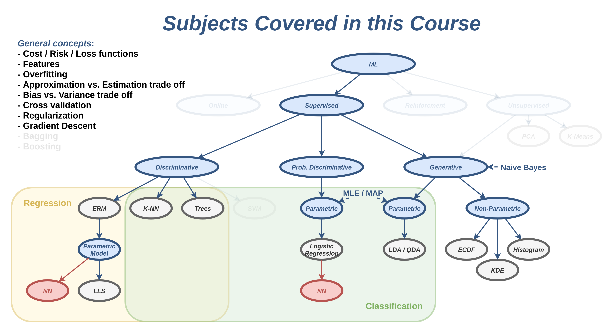
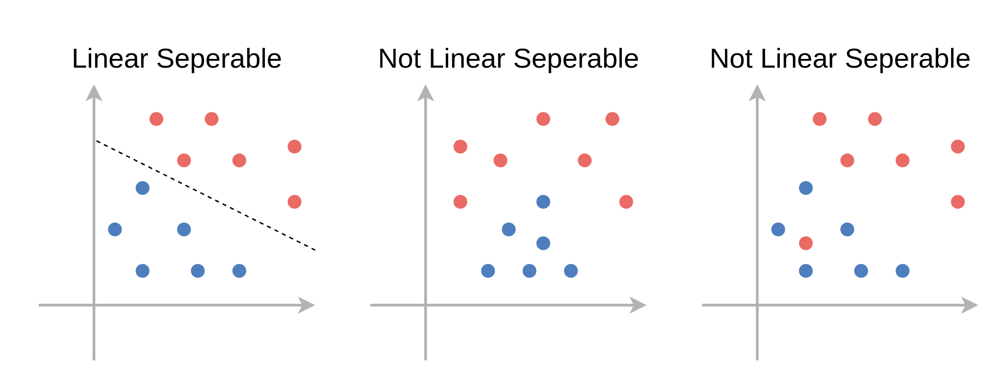
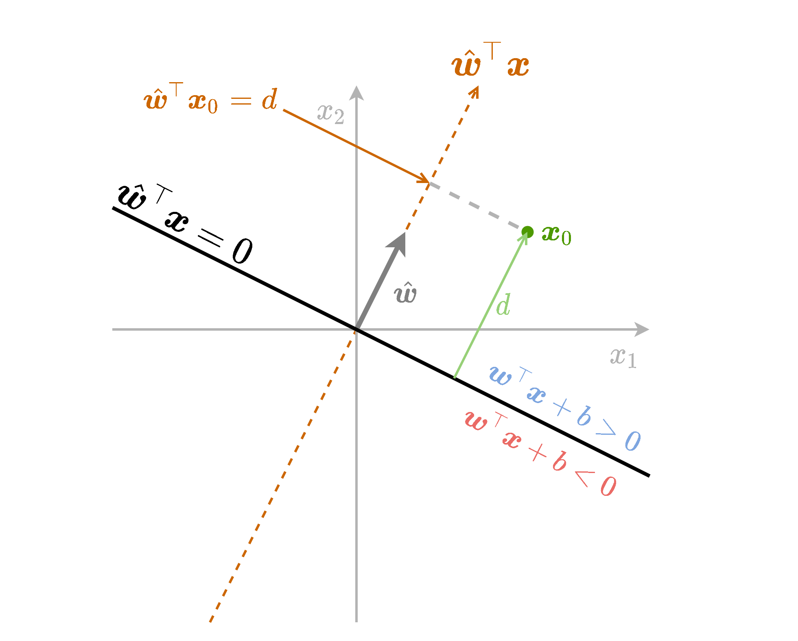
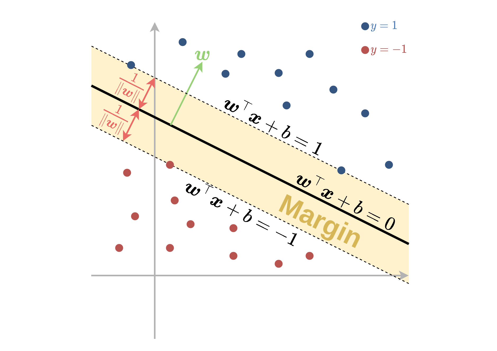

#  הרצאה 10 - SVM ושיטות גרעין

<a href="./slides/" class="link-button" target="_blank">Slides</a>
<a href="/assets/lecture10.pdf" class="link-button" target="_blank">PDF</a>
<!-- <a href="./code/" class="link-button" target="_blank">Code</a> -->

## מה נלמד היום

## סיווג לינארי

בפרק זה נעסוק בבעיית סיווג בינארי. לשם הנוחות נסמן את שתי המחלקות ב $\text{y}=\pm1$. בפרט נעסוק בסוג מסויים של מסווגים מהצורה:

$$
h(\boldsymbol{x})=
\text{sign}(\boldsymbol{w}^{\top}\boldsymbol{x}+b)
=\begin{cases}
1 & \boldsymbol{w}^{\top}\boldsymbol{x}+b>0\\
-1 & \text{else}
\end{cases}
$$

עם $\boldsymbol{w}$ ן $b$ כל שהם. מסווגים אלו מכוונים **מסווגים לינאריים**. מסווגים מסוג זה מתקבלים לדוגמא בעבור LDA או linear logistic regression. מסווגים אלו מחלקים את המרחב לשני חלקים אשר נמצאים משני צידיו של על-מישור (hyperplane) המוגדר על ידי המשוואה $\boldsymbol{w}^{\top}\boldsymbol{x}+b=0$ המכונה מישור ההפרדה.

על-מישור הוא הרחבה של מושג המישור למימדים שונים מ2. במרחב ממימד $D$ על המישור יהיה ממימד $D-1$. לדוגמא, במימד אחד על-המישור הוא נקודה, בדו מימד על-המישור הוא קו ובתלת מימד על-המישור הוא מישור דו מימדי. לשם הפשטות, בקורס זה נשתמש בשם מישור גם בשביל להתייחס לעל-מישורים.

**שימו לב**: חושב לא להתבלבל בין המשוואה $\boldsymbol{w}^{\top}\boldsymbol{x}+b=0$ לבין המשוואה $ax+b=y$ אשר מגדירה משוואה לינארית במרחב של $x$ ו $y$. שני הצורות האלה אומנם קרובות אך הם לא אותה משוואה וגם האיבר החופשי, שבשניהם מסומן לרוב ב $b$ הוא לא אותו $b$.

### פרידות לינארית (linear separability)

בהרצאה זו אנו נתייחס לשני מקרים, הראשון בו קיים מישור מפריד אשר מסווג את המדגם בצורה מושלמת (בלי טעויות סיווג) ושני בו לא ניתן למצוא מישור כזה. על מדגמים מהסוג הראשון נאמר שהם **פרידים לינארית**. להלן דוגמאות לשני סוגי המדגמים:

חשוב לציין שחלוקה זו לשני סוגי המדגמים רלוונטית רק לדיון התיאורטי, שכן לרוב לא נוכל לדעת מראש אם מדגם הוא פריד לינארית או לא.

למדגם פריד לינארית יהיה תמיד יותר ממשטח הפרדה אחד אשר יכול לסווג בצורה מושלמת את המדגם. לא נוכיח זאת, אך נראה דוגמא לכך על המדגם הבא:

בחלקה הראשון של הרצאה זו נסתכל על המקרה של מדגם פריד לינארית ונציג את אלגוריתם ה hard SVM אשר מנסה לבחור בצורה חכמה את מישור ההפרדה הטוב ביותר. בחלקה השני של ההצראה נציג את אלגוריתם ה soft SVM אשר מרחיב את האלגוריתם גם למקרה שבו המדגם אינו פריד לינארית.

### תזכורת - גאומטריה של המישור

לפני שנציג את אלגוריתם ה SVM נתעכב לרגע על המשוואת המישור $\boldsymbol{w}^{\top}\boldsymbol{x}+b=0$ בכדי לקבל קצת אינטואיציה לגבי התפקיד של $\boldsymbol{w}$ ו $b$ במשוואה זו.

נתחיל מלהסתכל על גרסא פשוטה יותר של משוואת המישור שבה אין איבר היסט (איבר חופשי) $b$ ו $\boldsymbol{w}$ הוא וקטור יחידה $\hat{\boldsymbol{w}}$. ספציפית, נסתכל על הפונקציה $f(\boldsymbol{x})=\hat{\boldsymbol{w}}^{\top}\boldsymbol{x}$. משוואה זו מטילה נקודות במרחב על הקו המוגדר על ידי $\hat{\boldsymbol{w}}$ ומודד את המרחק של הטלה זו.

פונקציה זו למעשה מודדת את המרחק $d$ של הנקודה כל שהיא $\boldsymbol{x}$ מהמישור של $\hat{\boldsymbol{w}}^{\top}\boldsymbol{x}$ בתוספת של סימן אשר מציין את הצד של המישור בו נמצאת הנקודה. בחצי המרחב שעליו מצביע הוקטור $\hat{\boldsymbol{w}}$ הפונקציה חיובית והיא שלילית בחצי השני.

נשתמש בשם **signed distance (מרחק מסומן)** בכדי להתייחס לשילוב של המרחק מהמישור בתוספת הסימן המתאים לצד של המישור.

כעת נחליף את הוקטור $\hat{\boldsymbol{w}}$ בוקטור $\boldsymbol{w}$ כל שהוא (שאינו וקטור יחידה). נקבל את הפונקציה $f(\boldsymbol{x})=\boldsymbol{w}^{\top}\boldsymbol{x}$ שזהה לפונקציה הקודמת רק מוכפלת ב $\lVert\boldsymbol{w}\rVert_2$ (נורמת $l_2$ של $\boldsymbol{w}$. בחלק מהמקרים נשמיט את ה $2$ ונרשום רק $\lVert\boldsymbol{w}\rVert$):

במקרה זה ה signed distance של נקודה כל שהיא $\boldsymbol{x}_0$ מהמישור יהיה $d=\frac{1}{\lVert\boldsymbol{w}\rVert}\boldsymbol{w}^{\top}\boldsymbol{x}_0$.

כאשר נוסיף לפונקציה גם איבר היסט $b$ נקבל את הפונקציה $f(\boldsymbol{x})=\boldsymbol{w}^{\top}\boldsymbol{x}+b$. ההוספה של הקבוע למעשה שקולה להזזה של נקודת ה-0 שממנה מודדים את ההטלה בכיוון ההפוך ל $\boldsymbol{w}$. המרחק שבו צריך להזיז את האפס לאורך הקו הינו $\frac{b}{\lVert\boldsymbol{w}\rVert}$.

כאן ה signed distance של נקודה כל שהיא $\boldsymbol{x}_0$ ממישור $\boldsymbol{w}^{\top}\boldsymbol{x}+b=0$ הינו:

$$
d=\frac{1}{\lVert\boldsymbol{w}\rVert}(\boldsymbol{w}^{\top}\boldsymbol{x}_0+b)
$$

נסכם את כל הנאמר לעיל בשרטוט הבא:

### אינווריאנטיות לכפל בסקלר

תכונה נוספת של על-מישורים הינה שהם אינווריאנטים (לא משתנים) תחת כפל בסקלר. זאת אומרת שאם נכפיל את גם את $\boldsymbol{w}$ וגם את $b$ בקבוע כל שהוא $\alpha$ שונה מאפס לא נשנה את מיקומו של המישור במרחב, זאת משום ש:

$$
\begin{aligned}
(\alpha\boldsymbol{w})^{\top}\boldsymbol{x}+(\alpha b)&=0\\
\Leftrightarrow\boldsymbol{w}^{\top}\boldsymbol{x}+b&=0
\end{aligned}
$$

המשמעות של אינווריאנטיות זו הינה שיש מספר דרכים להגדיר את אותו המסווג הלינארי. לעובדה זו תהיה משמעות כאשר ננסה לרשום את בעיית האופטימיזציה שנרצה לפתור על מנת למצוא את מישור ההפרדה הטוב ביותר.

## Support Vector Machine (SVM)

SVM הוא אלגוריתם דיסקרימינטיבי לסיווג בינארי אשר מחפש מסווג לינארי אשר יסווג בצורה טובה את המדגם. לאגוריתם זה יש שני גרסאות hard SVM אשר מחפש מסווג לינארי טוב לסיווג מדגם שהוא פריד לינארית, ו soft SVM אשר מרחיב את האלגוריתם למקרה שבו המדגם לא פריד לינארית. נתחיל בלהציג את hard SVM.

## Hard SVM

כפי שציינו קודם, במקרה שבו המדגם הינו פריד לינארית ישנו יותר ממישור הפרדה אחד אשר מסווג את המדגם באופן מושלם. נרצה למצוא מישור הפרדה אשר יכליל בצורה טובה גם לנקודות מחוץ למדגם. הנחה סבירה הינה שהפילוג הצפוי של הנקודות יתרכז באופן גס סביב הנקודת מהמדגם.

תחת היגיון זה hard SVM מנסה למצוא מישור הפרדה אשר יהיה רחוק ככל האפשר מהנקודות שבמדגם, או באופן יותר מדוייק, נרצה שהמרחק מהמישור לנקודה הקרובה אליו ביותר יהיה מקסימאלי. נגריר זאת באופן מתימטי.

נסתכל על המכפלה בין ה signed distance של הנקודות לתוויות שלהם: $\frac{1}{\lVert\boldsymbol{w}\rVert}(\boldsymbol{w}^{\top}\boldsymbol{x}^{(i)}+b)y^{(i)}$. בכדי לקבל סיווג מושלם נרצה שכל המכפלות האלה יהיו חיוביות. ב Hard SVM, בנוסף לניסיון לגרום לכל המכפלות להיות חיוביות, ננסה למקסם את המינימום של מכפלות אלו. דרישה זו תנסה להרחיק כמה שאפשר את הנקודות מהמישור.

בעיית האופטימיזציה שנרצה לפתור אם כן הינה:

$$
\boldsymbol{w}^*,b^*=\underset{\boldsymbol{w},b}{\arg\max}\quad \underset{i}{\min}\left\{\frac{1}{\lVert\boldsymbol{w}\rVert}(\boldsymbol{w}^{\top}\boldsymbol{x}^{(i)}+b)y^{(i)}\right\}
$$

באופן כללי ניתן לנסות לפתור בעיה זו באופן ישיר על ידי אלגוריתם כמו gradient descent. בפועל העובדה שבבעיה מופיע $min$ על כל המדגם מאד מקשה לממש פתרון שיתכנס בזמן סביר. למזלנו ניתן לפשט את הבעיה ולמצוא בעיה שקולה, שאותה נכנה **הבעיה הפרימאלית**, שאותה שניתן יהיה לפתור באופן יעיל בשיטות נומריות אחרות.

### הפיתוח של הבעיה הפרימאלית

כפי שציינו קודם המשוואת המישור היא אינווריאנטית לכפל בקבוע. זאת אומרת שבבעיית האופטימיזציה נוכל לבחור באופן שרירותי קבוע כפלי להכפיל בו את $\boldsymbol{w}$ ו $b$ מבלי לפגוע במרחב של המסווגים שמתוכם אנו מחפשים את הפתרון. בפרט נוכל להוסיף דרישה ש:

$$
\underset{i}{\min}\left\{(\boldsymbol{w}^{\top}\boldsymbol{x}^{(i)}+b)y^{(i)}\right\}=1
$$

אם נוסיף את האילץ הזה לבעיית האופטימיזציה נקבל:

$$
\begin{aligned}
\boldsymbol{w}^*,b^*
=\underset{\boldsymbol{w},b}{\arg\max}\quad&\underset{i}{\min}\left\{\frac{1}{\lVert\boldsymbol{w}\rVert}(\boldsymbol{w}^{\top}\boldsymbol{x}^{(i)}+b)y^{(i)}\right\}\\
\text{s.t.}\quad&\underset{i}{\min}\left\{(\boldsymbol{w}^{\top}\boldsymbol{x}^{(i)}+b)y^{(i)}\right\}=1\\
=\underset{\boldsymbol{w},b}{\arg\max}\quad&\underset{i}\frac{1}{\lVert\boldsymbol{w}\rVert}{\min}\left\{(\boldsymbol{w}^{\top}\boldsymbol{x}^{(i)}+b)y^{(i)}\right\}\\
\text{s.t.}\quad&\underset{i}{\min}\left\{(\boldsymbol{w}^{\top}\boldsymbol{x}^{(i)}+b)y^{(i)}\right\}=1\\
=\underset{\boldsymbol{w},b}{\arg\max}\quad&\frac{1}{\lVert\boldsymbol{w}\rVert}\\
\text{s.t.}\quad&\underset{i}{\min}\left\{(\boldsymbol{w}^{\top}\boldsymbol{x}^{(i)}+b)y^{(i)}\right\}=1\\
=\underset{\boldsymbol{w},b}{\arg\min}\quad&\frac{1}{2}\lVert\boldsymbol{w}\rVert^2\\
\text{s.t.}\quad&\underset{i}{\min}\left\{(\boldsymbol{w}^{\top}\boldsymbol{x}^{(i)}+b)y^{(i)}\right\}=1\\
\end{aligned}
$$

נוכל לפשט אף יותר את בעיית האופטימיזציה על ידי כך שנחליף את האילוץ של $\underset{i}{\min}\left\{(\boldsymbol{w}^{\top}\boldsymbol{x}^{(i)}+b)y^{(i)}\right\}=1$ באילוץ:

$$
(\boldsymbol{w}^{\top}\boldsymbol{x}^{(i)}+b)y^{(i)}\geq1\quad\forall i
$$

מכיוון שבעיית האופטימיזציה מנסה להקטין את הגודל של $\boldsymbol{w}$ מובטח שלפחות בעבור אחת מהדגימות במדגם האילוץ יתקיים בשיוון (אחרת אז ניתן להקטין עוד את $\boldsymbol{w}$ ו $b$ ובכך להקטין את ה objective), דבר אשר יגרור שיתקיים ש $\underset{i}{\min}\left\{(\boldsymbol{w}^{\top}\boldsymbol{x}^{(i)}+b)y^{(i)}\right\}=1$. אם כן, בעיית האופטימיזציה הבאה שקולה לבעיה שמימנה התחלנו:

$$
\begin{aligned}
\boldsymbol{w}^*,b^*
=\underset{\boldsymbol{w},b}{\arg\min}\quad&\frac{1}{2}\lVert\boldsymbol{w}\rVert^2\\
\text{s.t.}\quad&(\boldsymbol{w}^{\top}\boldsymbol{x}^{(i)}+b)y^{(i)}\geq1\quad\forall i
\end{aligned}
$$

הבעיה החדשה שקיבלנו נקראת **הבעיה הפרימאלית** ויש לה צורה מאד מיוחדת המוכנה [quadratic programming problem](https://en.wikipedia.org/wiki/Quadratic_programming) והיה ניתנת לפתרון בשיטות נומריות מאד יעילות אותם לא נכסה בקורס זה. ניתן כעת פרשנות אינטואיטיבית לבעיה הפרימאלית.

### פרשנות

האילוץ בבעיית האופטימיזציה שקיבלנו דורשת שבעבור $\boldsymbol{w}$ ו $b$ כל שהם כל הנקודות במדגם יהיו מסווגות בצורה נכונה ועליהם להימצא מחוץ לתחום של:

$$
1\geq\boldsymbol{w}^{\top}\boldsymbol{x}+b\geq-1
$$

תחום זה אשר נמצא בין שני המישורים:

$$
\boldsymbol{w}^{\top}\boldsymbol{x}+b=1
$$

ו

$$
\boldsymbol{w}^{\top}\boldsymbol{x}+b=-1
$$

נקרא ה**שוליים (margin)** של המסווג ותפקידו להרחיק את הנקדות של המדגם ממישור ההפרדה.

המרחק בין מישור ההפרדה לשפה של ה margin שווה ל $\frac{1}{\lVert\boldsymbol{w}\rVert}$ והרוחב הכולל של ה margin הינו $\frac{2}{\lVert\boldsymbol{w}\rVert}$. בעיית האופטימיזציה, שמנסה למזער את $\lVert\boldsymbol{w}\rVert$, תחת האילוץ תתכנס לפרמטרים של המסווג בעל ה margin הגדול ביותר אשר מקיים תנאי זה.

### Support Vectors

משום ש SVM מנסה להרחיק את הנקדות הקרובות ביותר למישור נקבל שלרוב רק חלק קטן מאד של הנקודות ישפיעו על הבחירה של מישור ההפרדה. לדוגמא, נקודות שכנראה לא ישפיעו על מישור ההפרדה הם כאלה שנמצאות רחוק מהאיזור של התפר בין שני המחלקות. בפועל הנקודות היחידות אשר ישפיעו על התוצאה של בעיית האופטימיזציה הם הנקודות שבסופו של דבר ישבו על השפה של ה margin. נקודות נקודות אלו מקיימות $y^{(i)}\left(\boldsymbol{w}^{\top}\boldsymbol{x}^{(i)}+b\right)=1$ והם מכוונות **support vectors**. שהסרה או הזזה אינפיטסימאלית של נקודות שאינם support vectors לא תשפיע על הפתרון של בעיית האופטימיזציה.

### הבעיה הדואלית

נציג כעת דרך שקולה נוספת לרישום של בעיית האופטימיזציה אשר מכונה **הבעיה הדואלית**. בעיה זו לפעמים נוחה יותר לשימוש והיא גם תשרת אותנו בהמשך כאשר נציג את שיטת הגרעין. המעבר מהבעיה הפרימאלית נעשה על ידי שיטה המכונה תנאי [Karush-Kuhn-Tucker](https://en.wikipedia.org/wiki/Karush%E2%80%93Kuhn%E2%80%93Tucker_conditions) אשר גם אותה לא נציג בקורס זה. נציג אבל את בעיית האופטימיזציה עצמה.

בבעיה זו נגדיר $N$ משתני עזר נוספים $\{\alpha_i\}_{i=1}^N$. בעזרת משתנים אלו ניתן לרשום את הבעיה הדואלית באופן הבא:

$$
\begin{aligned}
\left\lbrace\alpha_i\right\rbrace^*
=\underset{\left\lbrace\alpha_i\right\rbrace}{\arg\max}\quad&\sum_i\alpha_i-\frac{1}{2}\sum_{i,j}y^{(i)}y^{(j)}\alpha_i\alpha_j\boldsymbol{x}^{(i)\top}\boldsymbol{x}^{(j)} \\
\text{s.t.}\quad
    &\alpha_i\geq0\quad\forall i\\
    &\sum_i\alpha_iy^{(i)}=0
\end{aligned}
$$

מתוך המשתנים $\{\alpha_i\}_{i=1}^N$ ניתן לשחזר את $\boldsymbol{w}$ אופן הבא:

$$
\boldsymbol{w}=\sum_i\alpha_iy^{(i)}\boldsymbol{x}^{(i)}
$$

ישנו קשר בין הערכים של $\alpha_i$ לנקודות שהם support vectors. בפרט, בעבור נקודות שאינם support vectors יתקיים ש $\alpha_i=0$. (בנוסף, במרבית המקרים, אם כי לא תמיד, בעבור נקודות שהם כן support vectors יתקיים ש $\alpha_i>0$).

נסכם זאת בטבלה הבאה:

| .                                      | .                                                      | .               |
| -------------------------------------- | ------------------------------------------------------ | --------------- |
| נקודות רחוקות מה margin                   | $y^{(i)}\left(\boldsymbol{w}^{\top}x^{(i)}+b\right)>1$ | $\alpha_i=0$    |
| נקודות על ה margin (שהם support vectors) | $y^{(i)}\left(\boldsymbol{w}^{\top}x^{(i)}+b\right)=1$ | $\alpha_i\geq0$ |

על מנת לחשב את הפרמטר $b$ של המישור נוכל לבחור נקודה מסויימת שבעבור ה $\alpha_i>0$. נקודה כזו בהכרח תהיה support vectors ולכן היא תקיים $y^{(i)}\left(\boldsymbol{w}^{\top}x^{(i)}+b\right)=1$, מתוך משוואה זו ניתן לחלץ את $b$.

## Soft SVM

Soft SVM מתייחס למקרה שבו המדגם אינו פריד לינארית. במקרה זה עדיין מגדירים את ה margin בצורה דומה אך מאפשרים למשתנים להיכנס לתוך ה margin ואף לחצות אותה לצד הלא נכון של מישור ההפרדה. על כל חריגה כזו משלמים קנס ב objective שאותו מנסים למזער. את החריגה של הדגימה ה $i$ נסמן ב $\frac{1}{\lVert\boldsymbol{w}\rVert}\xi_i$. לנקודות שהם בצד הנכון של המישור ומחוץ ל margin $xi_i$ יהיה 0.

המשתנים $\xi_i$ נקראים **slack variables** ובעיית האופטימיזציה הפרימאלית תהיה:

$$
\begin{aligned}
\boldsymbol{w}^*,b^*,\{\xi_i\}^*=
\underset{\boldsymbol{w},b,\{\xi_i\}}{\arg\min}\quad&\frac{1}{2}\left\lVert\boldsymbol{w}\right\rVert^2+C\sum_{i=1}^N\xi_i \\
\text{s.t.}\quad
    &y^{(i)}\left(\boldsymbol{w}^{\top}\boldsymbol{x}^{(i)}+b\right)\geq1-\xi_i\quad\forall i\\
    &\xi_i\geq0\quad\forall i
\end{aligned}
$$

כאשר $C$ הוא hyper-parameter אשר קובע את גודל הקנס שאותו ה objective נותן על כל חריגה.

הבעיה הדואלית הינה:

$$
\begin{aligned}
\left\lbrace\alpha_i\right\rbrace^*
=\underset{\left\lbrace\alpha_i\right\rbrace}{\arg\max}\quad&\sum_i\alpha_i-\frac{1}{2}\sum_{i,j}y^{(i)}y^{(j)}\alpha_i\alpha_j\boldsymbol{x}^{(i)\top}\boldsymbol{x}^{(j)} \\
\text{s.t.}\quad
    &0\leq\alpha_i\leq C\quad\forall i\\
    &\sum_i\alpha_iy^{(i)}=0
\end{aligned}
$$

ה support vectors מוגדרים להיות הנקודות שמקיימות $y^{(i)}\left(\boldsymbol{w}^{\top}\boldsymbol{x}^{(i)}+b\right)=1-\xi_i$

תכונות:

| .                                         | .                                                            | .                     |
| ----------------------------------------- | ------------------------------------------------------------ | --------------------- |
| נקודות שמסווגות נכון ורחוקות מה margin            | $y^{(i)}\left(\boldsymbol{w}^{\top}x^{(i)}+b\right)>1$       | $\alpha_i=0$          |
| נקודות על ה margin (שהם support vectors)    | $y^{(i)}\left(\boldsymbol{w}^{\top}x^{(i)}+b\right)=1$       | $0\leq\alpha_i\leq C$ |
| נקודות שחורגות מה margin (גם support vectors) | $y^{(i)}\left(\boldsymbol{w}^{\top}x^{(i)}+b\right)=1-\xi_i$ | $\alpha_i=C$          |

## פונקציות גרעין

### מאפיינים: תזכורת

נוכל תמיד לחליף את וקטור המשתנים $\boldsymbol{x}$ שעליו פועל האלגוריתם בוקטור חדש $\boldsymbol{x}_{\text{new}}=\Phi(\boldsymbol{x})$, כאשר $\Phi$ היא פונקציה אשר נבחרה מראש ונקראת פונקציית המאפיינים שכן היא מחלצת מאפיינים רלוונטים מתוך $\boldsymbol{x}$ שבהם נשתמש.

### פונקציות גרעין

במקרים רבים החישוב של $\Phi(\boldsymbol{x})$ יכול להיות מסובך אך קיימת דרך לחשב בצורה יעילה את הפונקציה $K(\boldsymbol{x}_1,\boldsymbol{x}_2)=\Phi(\boldsymbol{x}_1)^{\top}\Phi(\boldsymbol{x}_2)$ אשר נקראת פונקציית גרעין. יתרה מזאת, יתכנו מצבים שבהם הוקטור המאפיינים הוא אין סופיים ועדיין פונקציית הגרעין היא פשוטה לחישוב.

ישנם קריטריונים תחתם פונקציה מסויימת $K(\boldsymbol{x}_1,\boldsymbol{x}_2)$ היא פונקציית גרעין בעבור וקטור מאפיינים מסויים. בקורס זה לא נכנס לתאים אלו. נציג שתי פונקציות גרעין נפוצות:

- גרעין גאוסי: $K(\boldsymbol{x}_1,\boldsymbol{x}_2)=\exp\left(-\frac{\lVert\boldsymbol{x}_1-\boldsymbol{x}_2\rVert_2^2}{2\sigma^2}\right)$ כאשר $\sigma$ פרמטר שיש לקבוע.
- גרעין פולינומיאלי: $K(\boldsymbol{x}_1,\boldsymbol{x}_2)=(1+\boldsymbol{x}_1^{\top}\boldsymbol{x}_2)^p$ כאשר $p\geq1$ פרמטר שיש לקבוע.

פונקציית המאפיינים שמתאימות לגרעינים אלו הם מסורבלות לכתיבה ולא נציג אותם כאן.

### Kernel Trick in SVM

הרעיון ב kernel trick הינו לעשות שימוש בפונקציית הגרעין על מנת להשתמש ב SVM עם מאפיינים מבלי לחשב את $\Phi$ באופן ישיר. בעבור פונקציית מאפיינים $\Phi$ עם פונקציית גרעין $K$ הבעיה הדואלית של SVM הינה:

$$
\begin{aligned}
\left\lbrace\alpha_i\right\rbrace^*
=\underset{\left\lbrace\alpha_i\right\rbrace}{\arg\max}\quad&\sum_i\alpha_i-\frac{1}{2}\sum_{i,j}y^{(i)}y^{(j)}\alpha_i\alpha_jK(\boldsymbol{x}^{(i)},\boldsymbol{x}^{(j)}) \\
\text{s.t.}\quad
    &\alpha_i\geq0\quad\forall i\\
    &\sum_i\alpha_iy^{(i)}=0
\end{aligned}
$$

בעיית אופטימיזציה זו מגדירה את המשתנים $\{\alpha_i\}$ בלי צורך לחשב את $\Phi$ באופן מפורש בשום שלב.

הפרמטר $\boldsymbol{w}$ נתון על ידי:

$$
\boldsymbol{w}=\sum_i\alpha_iy^{(i)}\Phi(\boldsymbol{x}^{(i)})
$$

בכדי לחשב את $\boldsymbol{w}$ באופן מפורש יש לחשב את $\Phi$, אך ניתן להמנע מכך עם מציבים את הנוסחא ל $\boldsymbol{w}$ ישירות לתוך המסווג:

בכדי להמנע מהחישוב של $\Phi$ גם במסווג נשתמש בעובדה ש:

$$
\begin{aligned}
h(\boldsymbol{x})
&=\text{sign}(\boldsymbol{w}^{\top}\Phi(\boldsymbol{x})+b)\\
&=\text{sign}(\sum_i\alpha_iy^{(i)}\Phi(\boldsymbol{x}^{(i)})^{\top}\Phi(\boldsymbol{x})+b)\\
&=\text{sign}(\sum_i\alpha_iy^{(i)}K(\boldsymbol{x}^{(i)},\boldsymbol{x})+b)\\
\end{aligned}
$$

כך שגם בשלב החיזוי ניתן להשתמש בפונקציית הגרעין בלי לחשב את $\Phi$ באופן מפורש.

