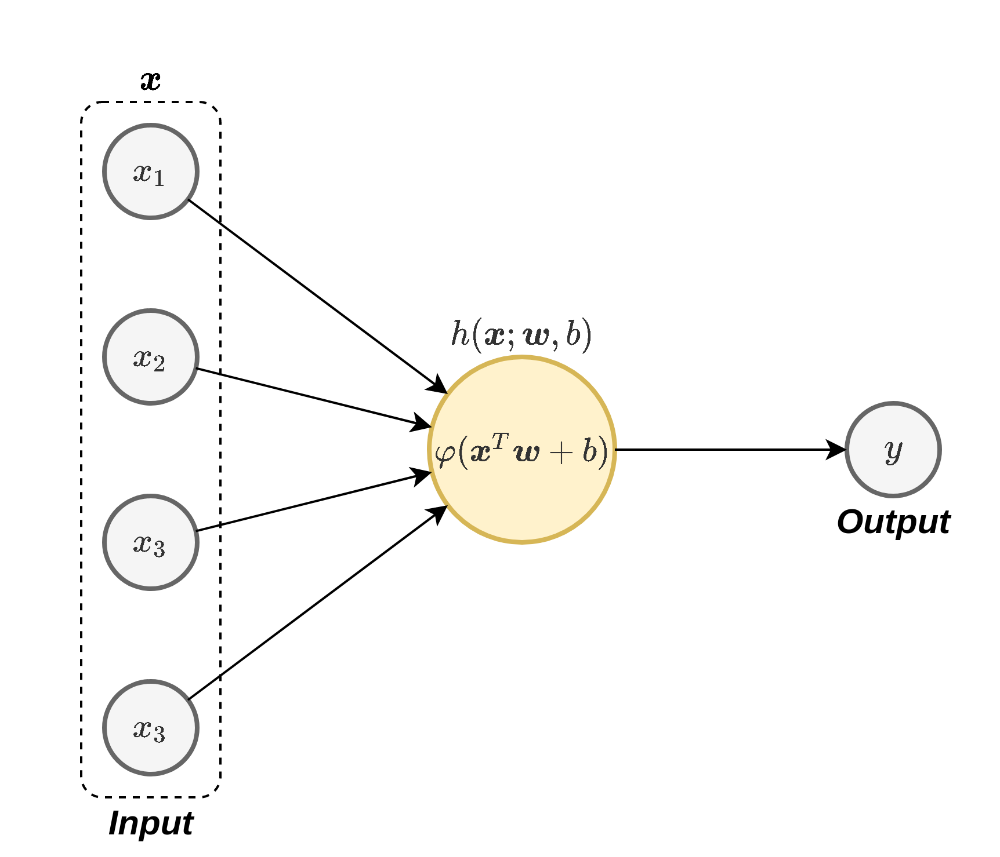
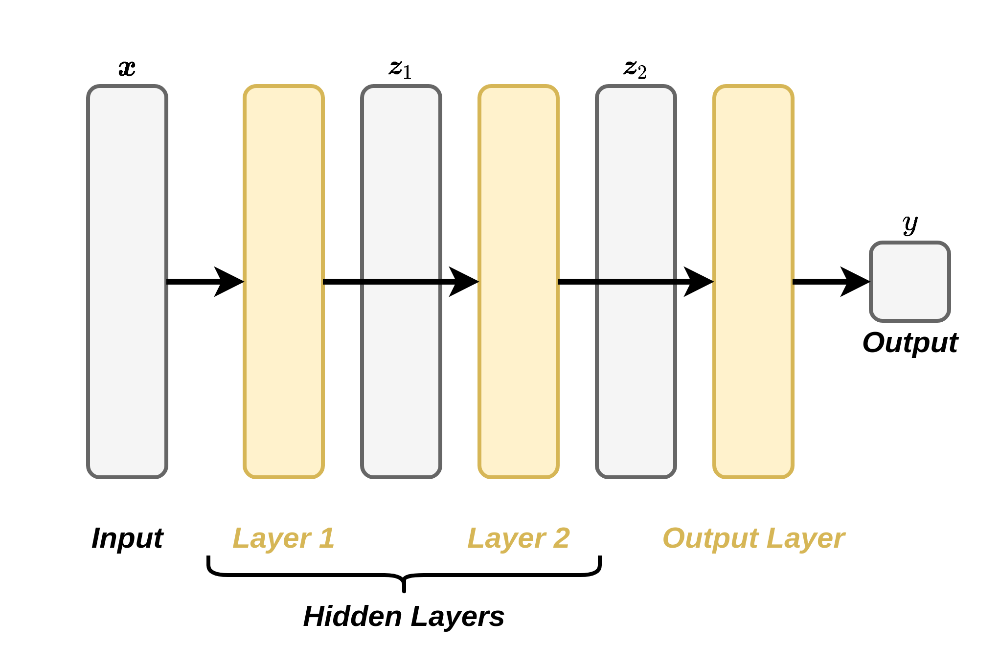

<section class="center">

# הרצאה 10 - Neural Networks

<a href="/assets/lecture10_slides.pdf" class="link-button" target="_blank">PDF</a>

</section><section>

## מה נלמד היום

</section><section>

## רשת נוירונים מלאכותית כמודל פרמטרי

- נתקלנו במספר מקרים בהם ניסינו למצוא פונקציה שתבצע פעולה או תתאר תופעה כל שהיא (מציאת חזאי או פונקציית פילוג).
- דרך נוחה לעשות זאת היא בעזרת מודל פרמטרי ומציאת הפרמטרים האופטימאלים.
- עד כה עבדנו עם מודלים לינאריים בפרמטרים.
- ניתן לקרב הרבה מאד פונקציות בעזרת פולינום מסדר מספיק גבוה.
- מודלים אלו הם לא מאד מוצלחים ובעייתיים וכאשר $\boldsymbol{x}$ הוא ממימד גבוה.
- האם ישנם מודלים מתאימים יותר?

</section><section>

## רשתות נוירונים מלאכותיות Artificial Neural Networks - ANN

- בשנים האחרונות מודלים אלו הוכיחו את עצמם כמודלים פרמטריים מאד יעילים לפתרון מגוון רחב של בעיות.
- הההשראה לצורה שבה הם בנויים מגיעה מרשתות עצביות ביולוגיות.

</section><section>

## רשתות עצביות ביולוגיות 
 

 

תקשורת בין תאי עצב

</section><section>

## רשתות עצביות ביולוגיות 

 

 

מפוטונים לזיהוי אובייקטים במרחב

</section><section>

## נוירון ביולוגי

 
 

</section><section>

## נוירון ביולוגי

בצורה פשטנית ניתן לתאר את האופן בו נוירון ביולוגי פועל כך:

</section><section>

## נוירון ביולוגי

 באופן סכימתי ניתן למדל את פעולת הנוירון באופן הבא:

$$
y=I\{\boldsymbol{x}^{\top}\boldsymbol{w}+b>0\}
$$

</section><section>

## נוירונים ברשת נוירונים מלאכותית

- פונקציית המדרגה היא בפועל מאד בעייתית.
- לשם כך נחליף את פונקציית המדרגה בפונקציה אחרת כל שהיא $\varphi(\cdot)$.
- פונקציה זו מכונה **פונקציית ההפעלה (activation function)**.
- בחירות נפוצות של פונקציית ההפעלה כוללות את:
    - הפונקציה הלוגיסטית (סיגמואיד): $\varphi(x)=\sigma(x)=\frac{1}{1+e^{-x}}$
    - טנגנס היפרבולי: $\varphi(x)=\tanh\left(x/2\right)$
    - $\varphi(x)=\max(x,0)$ :ReLU (Rectified Linear Unit).

- פונקציות נוספות שנמצאות הן כל מיני וריאציות של ReLU.

</section><section>

## נוירונים ברשת נוירונים מלאכותית

באופן סכימתי נסמן נוירון בודד באופן הבא:

</section><section>

## רשת נוירונים

נשלב מספר נוירונים יחד על מנת לבנות רשת נוירונים:

 

 

רשת שכזו יכולה לקרב מגוון מאד רחב של פונקציות. הפרמטרים של המודל יהיו הפרמטרים של כל הנוירונים.

</section><section>

## רשת נוירונים

 

לרוב הנוירונים יהיו מהצורה של:

$$
h_j(\boldsymbol{x};\boldsymbol{w}_j,b_j)=\varphi(\boldsymbol{x}^{\top}\boldsymbol{w}_j+b_j)
$$

אך ניתן גם לבחור פונקציות אחרות. בקורס זה, אלא אם נאמר אחרת, אנו נניח כי כי הנוירונים הם מהצורה הזו.

</section><section>

## הארכיטקטורה של הרשת

המבנה של הרשת כולל את מספר הנוירונים שהיא מכילה ואת הדרך שבה הם מחוברים אחד לשני.

- בחירת הארכיטקטורה היא קריטית לביצועים.
- לשימושים שונים מתאימות ארכיטקטורות שונות.
- חלק גדול מאד מהמחקר שנעשה כיום הוא סביב הנושא של חיפוש ארכיטקטורות.
- התהליך של מציאת הארכיטקטורה דורש לא מעט ניסיון, אינטואיציה והרבה ניסוי וטעיה.
- לרוב נמצא בעיה דומה ונשתמש בארכיטקטורה שעבדה טוב במקרה זה (נרפרנס).

</section><section>

## הארכיטקטורה של הרשת

- **יחידות נסתרות** (**hidden units**): הנוירונים אשר אינם מחוברים למוצא הרשת.
- **רשת עמוקה** (**deep network**): רשת אשר מכילה מסלולים אשר עוברים דרך יותר מיחידה נסתרת אחת.

</section><section>

## Feed-forward vs. Recurrent

אנו מבדילים בין שני סוגי ארכיטקטורות:

- **רשת הזנה קדמית (feed-forward network)**: ארכיטקטורות אשר אינן מכילות מסלולים מעגליים.
- **רשתות נשנות (recurrent neural network - RNN)**: בקורס זה לא נעסוק ברשתות מסוג זה. אלו ארכיטקטורות אשר כן מכילות מסלולים מעגליים.

</section><section>

## על החשיבות של פונקציות ההפעלה

- ללא פונקציית ההפעלה הנורונים היו לינאריים ולכן כל הרשת תהיה פשוט מודל לינארי.

</section><section>

## המוצא של הרשת

### Regression + ERM

- הרשת תמדל חזאי אשר אמור להוציא סקלר שמקבל ערכים רציפים בתחום לא מוגבל.
- אנו נרצה שהמוצא של הרשת יתנקז לנוירון בודד ללא פונקציית אקטיבציה כדי לקבל ערכים ממשיים ללא הגבלה.

</section><section>

## המוצא של הרשת

### סיווג בינארי דיסקרימינטיבי הסתברותי

- הרשת תמדל את $p_{\text{y}|\mathbf{x}}(1|\boldsymbol{x})$.
- אנו נרצה שהרשת תוציא ערך סקלרי רציף בתחום בין 0 ל-1.
- שהמוצא של הרשת יתנקז לנוירון בודד עם פונקציית הפעלה שמוציאה ערכים בתחום $[0,1]$ כדוגמאת הפונקציה הלוגיסטית.

### סיווג לא בינארי דיסקרימינטיבי הסתברותי

- הרשת תמדל את כל ההסתברותיות $p_{\text{y}|\mathbf{x}}(y|\boldsymbol{x})$.
- נרצה שהרשת תוציא וקטור באורך $C$ שעליו נפעיל את פונקציית ה softmax.

</section><section>

## מציאת הפרמטרים של המודל

בעיית האופטימיזציה:

- ב ERM אנו ננסה למזער את ה risk האמפירי.

- בגישה הדיסקרימינטיבית ההסתברותית נשתמש ב MLE או MAP. במקרה של רגרסיה לוגיסטית נוכל להשתמש בפונקציה מהרצאה 9

כדי לפתור את בעיית האופטימיזציה נשתמש ב gradient descent.

</section><section>

## מציאת הפרמטרים של המודל 

נסמן את מוצא הרשת $f(x;W)\in\mathbb{R}$. 

**רגרסיה:** לדוגמה, פונקציית ההפסד של least squares היא 
$$
\mathcal{L}(W)=\sum_{i=1}^{n}\left(y^{(i)}-f\left(x^{(i)};W\right)\right)^{2}
$$

**סיווג בינארי:** במקרה של רגרסיה לוגיסטית ניתן להשתמש בפונקציה מהרצאה 9: 

$$
\mathcal{L}(W)=-\sum_{i=1}^{N}\left[y^{(i)}\log\left(\sigma\left(f\left(x^{(i)};W\right)\right)\right)+\left(1-y^{(i)}\right)\log\left(1-\sigma\left(f\left(x^{(i)};W\right)\right)\right)\right]
$$

עם פונקציית הסיגמואיד $\sigma(z)=1/\left(1+\exp(-z)\right)$. 

במקרה של סיווג רב מחלקתי $f(x;W)=\left(f_{1}(x;W),\ldots,f_{c}(x;W)\right)\in\mathbb{R}^{C}$, ניתן להשתמש בפונקציית softmax ופונקציית ההפסד משקף 28 בהצראה 9. 

</section><section>

## MultiLayer Perceptron (MLP)

- הנוירונים מסודרים בשכבות (layers), כשתייים או יותר
- השכבות הן **Fully Connected (FC)** (כל נוירון מוזן מ**כל** הנוירונים שבשכבה שלפני).

</section><section>

## MultiLayer Perceptron (MLP)

מה שמגדיר את הארכיטקטורה במקרה של MLP הוא מספר השכבות הנסתרות וכמות הנוירונים בכל שכבה (**רוחב השכבה**). בדוגמה הזו, יש ברשת 3 שכבות ברוחב 2, 3 ו 2.

</section><section>

## רישום מטריצי

- $W_i=
\begin{bmatrix}
-&\boldsymbol{w}_{i,1}&-\\
-&\boldsymbol{w}_{i,2}&-\\
&\vdots&\\
\end{bmatrix}$
- $\boldsymbol{b}_i=[b_{i,1},b_{i,2},\dots]^{\top}$

כאשר $W_i, b_i$ הם סט המשקלים וההסטים המתאימים לשכבה $i$. 

הפונקציה אותה מממשת השכבה כולה הינה:

$$
\boldsymbol{z}_i=\varphi(W_i\boldsymbol{z}_{i-1}+\boldsymbol{b}_i)
$$

</section><section>

## רישום מטריצי 

עבור MLP כללי עם $L$ שכבות ניתן לכתוב 
$$
z_{L}=\varphi_{L}\left(W_{L}z_{L-1}+b_{L}\right)=\varphi_{L}\left(W_{L}\varphi_{L-1}\left(W_{L-1}z_{L-2}+b_{L-1}\right)\right)=h_{L}\circ h_{L-1}\circ\cdots\circ h_{1}(x)
$$

כאשר 

$$
h_{\ell}\left(z_{\ell-1}\right)=\varphi_{\ell}\left(W_{\ell}z_{\ell-1}+b_{\ell}\right)
$$

שימו לב, $\varphi_{\ell}$ יכולה להיות תלויה בשכבה. 

*ניתן לכתוב זאת בצורה רקורסיבית* 

$$
\begin{aligned}\mathbf{z}_{0} & =\mathbf{x}\\
\mathbf{u}_{\ell} & =W_{\ell}\mathbf{z}_{l-1}+\mathbf{b}_{\ell}\quad\text{for }l=1\text{ to }L\\
\mathbf{z}_{\ell} & =\varphi_{\ell}(\mathbf{u}_{\ell})\quad\text{for }l=1\text{ to }L
\end{aligned}
$$

כאשר פעולת האקטיבציה $\varphi_{\ell}$ מתבצעת איבר-איבר ו-$\mathbf{y}_{L}=\mathbf{z}_{L}$. 
</section><section>

## הערה לגבי נגזרות וקטוריות 

זכרו כי עבור פונקציה סקלרית $f(\boldsymbol{\theta}),\boldsymbol{\theta}\in\mathbb{R}^{n}$

$$
\nabla f(\theta)=\frac{\partial f(\theta)}{\partial\theta}=\left[\frac{\partial f(\theta)}{\partial\theta_{1}},\ldots,\frac{\partial f(\theta)}{\partial\theta_{n}}\right]\in\mathbb{R}^{1\times n}
$$

תהי $\boldsymbol{g}(\boldsymbol{\theta})$ פונקציה וקטורית של וקטור $\mathbf{\boldsymbol{\theta}}$, $\mathbf{g}:\mathbf{\theta}\mapsto\mathbb{R}^{m}$, $\mathbf{g}(\mathbf{\boldsymbol{\theta}})=\left(g_{1}(\mathbf{\mathbf{\boldsymbol{\theta}}}),\ldots,g_{m}(\mathbf{\boldsymbol{\theta}})\right)$. 

אזי 

$$
\frac{\partial\mathbf{g}(\boldsymbol{\theta})}{\partial\boldsymbol{\theta}}=\left[\frac{\partial g_{i}(\boldsymbol{\theta})}{\partial\theta_{j}}\right]_{ij}\in\mathbb{R}^{m\times n}
$$

ובמקרה הפשוט בו $\mathbf{g}(\boldsymbol{\theta})=\left(g_{1}(\theta_{1}),\ldots,g_{m}(\theta_{m})\right)$ מתקיים כי 

$$
\frac{\partial\mathrm{\mathbf{g}}(\boldsymbol{\theta})}{\partial\boldsymbol{\theta}}=\mathrm{diag}\left(g'_{1}(\theta_{1}),\ldots,g'_{m}(\theta_{m})\right)=\mathrm{diag}\left(g'\left(\boldsymbol{\theta}\right)\right)
$$

</section><section>

## "משפט הקירוב האוניברסלי"

בהינתן:

- פונקציית הפעלה רציפה כלשהיא $\varphi$ ש**אינה פולינומיאלית**.
- ופונקציה רציפה כלשהיא על קוביית היחידה $f:[0,1]^{D_{\text{in}}}\rightarrow[0,1]^{D_{\text{out}}}$.

אזי ניתן למצוא פונקציה $f_{\varepsilon}:[0,1]^{D_{\text{in}}}\rightarrow[0,1]^{D_{\text{out}}}$ מהצורה:

$$
f_{\varepsilon}(\boldsymbol{x})=W_2\varphi(W_1\boldsymbol{x}+\boldsymbol{b}_1)+\boldsymbol{b}_2
$$

כך ש:

$$
\underset{x\in[0,1]^{D_{\text{in}}}}{\text{sup}}\lVert
f(\boldsymbol{x})-f_{\varepsilon}(\boldsymbol{x})
\rVert<\varepsilon
$$

</section><section>

## Back-Propagation

באופן כללי אנו צריכים לחשב את הנגזרות של פונקציית ההפסד ביחס לכל פרמטרי הרשת (משקולות ואיברי הטיה), כלומר

$$
\frac{\mathcal{\partial L}(W)}{\partial W_{\ell}}
$$

כאשר  $W_{\ell}$ הם המשקולות של השכבה ה-$\ell$. שימו לב כי 

$$
\begin{aligned}
\frac{\mathcal{\partial L}(W)}{\partial W_{\ell}} &= \frac{\mathcal{\partial L}(W)}{\partial z_{\ell}}\frac{\partial z_{\ell}}{\partial W_{\ell}}=\frac{\mathcal{\partial L}(W)}{\partial z_{\ell}}\frac{\partial z_{\ell}}{\partial u_{\ell}}\frac{\partial u_{\ell}}{\partial W_{\ell}} \\
\frac{\partial\mathbf{u}_{\ell}}{\partial W_{\ell}} & =\mathbf{z}_{\ell-1} \\
\frac{\partial\mathbf{z}_{\ell}}{\partial\mathbf{u}_{\ell}} & =\mathrm{diag}\left(\varphi'_{\ell}\left(\mathbf{u}_{\ell}\right)\right)
\end{aligned}
$$

כאשר הנגזרת המאתגרת היחידה לחישוב היא הראשונה. 

</section><section>

## Back-Propagation

כדי להשתמש בשיטת הגרדיאנט נרצה לחשב נגזרות לפי פרמטרי הרשת. שיטה המקלה על חישוב הנגזרות על ידי שימוש בכלל השרשרת.

### כלל השרשרת - תזכורת

במקרה הסקלרי:

$$
\left(f(g(x))\right)'=f'(g(x))\cdot g'(x)
$$

במקרה של מספר משתנים:

$$
\begin{aligned}
\frac{d}{dx} f(z_1(x),z_2(x),z_3(x))
=& &\left(\frac{\partial}{\partial z_1} f(z_1(x),z_2(x),z_3(x))\right)\frac{d}{dx}z_1(x)\\
 &+&\left(\frac{\partial}{\partial z_2} f(z_1(x),z_2(x),z_3(x))\right)\frac{d}{dx}z_2(x)\\
 &+&\left(\frac{\partial}{\partial z_3} f(z_1(x),z_2(x),z_3(x))\right)\frac{d}{dx}z_3(x)\\
\end{aligned}
$$

</section><section>

## Back-Propagation

לאלגוריתם 2 שלבים:

- **Forward pass**: העברה של הדגימות דרך הרשת ושמירה של כל ערכי הביניים.
- **Backward pass**: חישוב של הנגזרות של הנוירונים מהמוצא של הרשת לכיוון הכניסה.

</section><section>

## Back-Propagation :דוגמא פשוטה

 

נרצה לחשב את $\partial\mathcal{L}/\partial\theta_{i}$ עבור פרמטר $\theta_{i}$ כלשהו. למשל, עבור פונקציית ההפסד הריבועית $L=(y-t)^{2},$ כאשר $t$ הוא הערך האמיתי 

$$
\frac{\partial L}{\partial\theta_{i}}=2\left(y-t\right)\frac{\partial y}{\partial\theta_{i}}
$$

ובאופן דומה עובר שאר פונקציות ההפסד. כך, עלינו להתמקד בנגזרת של המוצא ביחס לפרמטר.

</section><section>

## Back-Propagation :דוגמא פשוטה

 

נרשום את הנגזרת של $y$ לפי $\theta_2$:

$$
\frac{\partial y}{\partial\theta_2}=\frac{\partial y}{\partial z_2}\frac{\partial z_2}{\partial \theta_2}=\frac{\partial y}{\partial z_2}\frac{\partial}{\partial \theta_2}h_2(z_1;\theta_2)
$$

נוכל לפרק גם את הנגזרת של $\frac{dy}{dz_2}$:

$$
\frac{\partial y}{\partial z_2}=\frac{\partial y}{\partial z_3}\frac{\partial z_3}{\partial z_2}=\frac{\partial}{\partial z_3}h_4(z_3;\theta_4)\frac{\partial}{\partial z_2}h_3(z_2;\theta_3)
$$

לכן:

$$
\frac{\partial y}{\partial\theta_2}=\frac{\partial y}{\partial z_3}\frac{\partial z_3}{dz_2}\frac{\partial z_2}{\partial\theta_2}=\frac{\partial}{\partial z_3}h_4(z_3;\theta_4)\frac{\partial}{\partial z_2}h_3(z_2;\theta_3)\frac{\partial}{\partial \theta_2}h_2(z_1;\theta_2)
$$

</section><section>

## Back-Propagation :דוגמא פשוטה

$$
\frac{\partial y}{\partial\theta_2}=\frac{\partial y}{\partial z_3}\frac{\partial z_3}{\partial z_2}\frac{\partial z_2}{\partial\theta_2}=\frac{\partial}{\partial z_3}h_4(z_3;\theta_4)\frac{\partial}{\partial z_2}h_3(z_2;\theta_3)\frac{\partial}{\partial\theta_2}h_2(z_1;\theta_2)
$$

 

כדי לחשב את הביטוי שקיבלנו עלינו לבצע את שני השלבים הבאים:

- לחשב את כל ה $z_i$ לאורך הרשת (forward pass).
- לחשב את כל הנגזרות מהמוצא של הרשת ועד לנקודה בה נמצא הפרמטר שלפיו רוצים לגזור (backward-pass).

</section><section>

## Back-Propagation :דוגמא מעט יותר מורכבת

 

נחשב את הנגזרת של $y_1$ לפי $\theta_3$.

</section><section>

## Back-Propagation :דוגמא מעט יותר מורכבת

 

נפרק את הנגזרת של $\frac{\partial y_1}{\partial\theta_3}$ בדומה למה שחישבנו קודם:

$$
\begin{aligned}
\frac{\partial y_1}{\partial\theta_3}
&=\frac{\partial y_1}{\partial z_7}\frac{\partial z_7}{\partial z_6}\frac{\partial z_6}{\partial z_3}\frac{\partial z_3}{\partial\theta_3}\\
&=\frac{\partial}{\partial z_7}h_8(z_7;\theta_8)\frac{\partial}{\partial z_6}h_7(z_6;\theta_7)\frac{\partial}{\partial z_3}h_6(z_5;\theta_6)\frac{\partial}{\partial\theta_3}h_3(z_2;\theta_3)
\end{aligned}
$$

</section><section>

## Back-Propagation :דוגמא מעט יותר מורכבת

$$
\begin{aligned}
\frac{\partial y_1}{\partial\theta_3}
&=\frac{\partial y_1}{\partial z_7}\frac{\partial z_7}{\partial z_6}\frac{\partial z_6}{\partial z_3}\frac{\partial z_3}{\partial\theta_3}\\
&=\frac{\partial}{\partial z_7}h_8(z_7;\theta_8)\frac{\partial}{\partial z_6}h_7(z_6;\theta_7)\frac{\partial}{\partial z_3}h_6(z_5;\theta_6)\frac{\partial}{\partial\theta_3}h_3(z_2;\theta_3)
\end{aligned}
$$

- נריץ את ה forward-pass בשביל לחשב את ערכי ה $z_i$.
- נריץ את ה backward-pass בו נחשב את הנגזרות מהמוצא של הרשת עד לנגזרת של $h_3$.

</section><section>

## Back-Propagation - MLP

משוואות ה forward-pass:

$$
\boldsymbol{z}_1=\varphi(\underbrace{W_1\boldsymbol{x}+\boldsymbol{b}_1}_{\boldsymbol{u}_1}), \qquad W_1 \sim d_1 \times d_{in} \\
\boldsymbol{z}_2=\varphi(\underbrace{W_2\boldsymbol{z}_1+\boldsymbol{b}_2}_{\boldsymbol{u}_2}), \qquad W_2 \sim d_2 \times d_1 \\
y=\boldsymbol{w}_3^T\boldsymbol{z}_2+\boldsymbol{b}_3, \qquad w_3 \sim d_2 \times 1 \\
$$

</section><section>

## Back-Propagation - MLP

משוואות ה backward-pass:

$$
\frac{\partial y}{\partial\boldsymbol{z}_2}=\boldsymbol{w}_3
$$

$$
\frac{\partial y}{\partial\boldsymbol{u}_2}
=\frac{\partial y}{\partial\boldsymbol{z}_2}
\frac{\partial\boldsymbol{z}_2}{\partial\boldsymbol{u}_2}
=\mathrm{Diag}(\varphi'(\boldsymbol{u}_2))\boldsymbol{w}_3
$$

$$
\frac{\partial y}{\partial\boldsymbol{z}_1}
=\frac{\partial y}{\partial\boldsymbol{u}_2}
\frac{\partial\boldsymbol{u}_2}{\partial\boldsymbol{z}_1}
=W_2^T\mathrm{Diag}(\varphi'(\boldsymbol{u}_2))\boldsymbol{w}_3
$$

$$
\dots
$$

</section><section>

## Back-Propagation - MLP

משוואות ה backward-pass:

$$
\frac{\partial y}{\partial\boldsymbol{u}_2}
=\mathrm{Diag}(\varphi'(\boldsymbol{u}_2))\boldsymbol{w}_3
$$

$$
\frac{\partial y}{\partial W_2}
=\frac{\partial y}{\partial\boldsymbol{u}_2}
\frac{\partial\boldsymbol{u}_2}{\partial W_2}
=\mathrm{Diag}(\varphi'(\boldsymbol{u}_2))\boldsymbol{w}_3\boldsymbol{z}_1^T
$$

</section><section>

##  Back-Propagation and MLPs

**Forward pass**

$$
\begin{aligned}\mathbf{z}_{0} & =\mathbf{x}\\
\mathbf{u}_{\ell} & =W_{\ell}\mathbf{z}_{l-1}+\mathbf{b}_{\ell}\quad\text{for }l=1\text{ to }L\\
\mathbf{z}_{\ell} & =\varphi_{\ell}(\mathbf{u}_{\ell})\quad\text{for }l=1\text{ to }L
\end{aligned}
$$

**Backward pass**

$$
\begin{aligned}
\delta_{L} &=\frac{\mathcal{\partial L}}{\partial z_{L}}\mathrm{diag}\left(\varphi'_{L}(u_{L})\right)\\
\delta_{\ell} &= \mathrm{diag}\left(\varphi'_{\ell}(u_{\ell})\right) W_{\ell+1}^{\top}\delta_{\ell+1}\quad\text{for }l=L-1\text{ to }1
\end{aligned}
$$

</section><section>

##  Back-Propagation and MLPs

חישוב הגרדיאנט יתבצע באמצעות 

$$
\nabla_{W_{\ell}}\mathcal{L}=\delta_{\ell}z_{\ell-1}^{\top}\quad;\quad\nabla_{b_{\ell}}\mathcal{L}=\delta_{\ell}
$$

ואלגוריתם הגדריאנט יהיה 

$$
W_{\ell}^{(t+1)}=W_{\ell}^{(t)}-\eta\delta_{\ell}^{(t)}z_{\ell-1}^{(t)\top}\quad;\quad b_{\ell}^{(t+1)}=b_{\ell}^{(t)}-\eta\delta_{\ell}^{(t)}
$$

</section>

