

<section class="center">

# הרצאה 12 - PCA and K-Means

<a href="/assets/lecture12_slides.pdf" class="link-button" target="_blank">PDF</a>

</section><section>

## מה נלמד היום

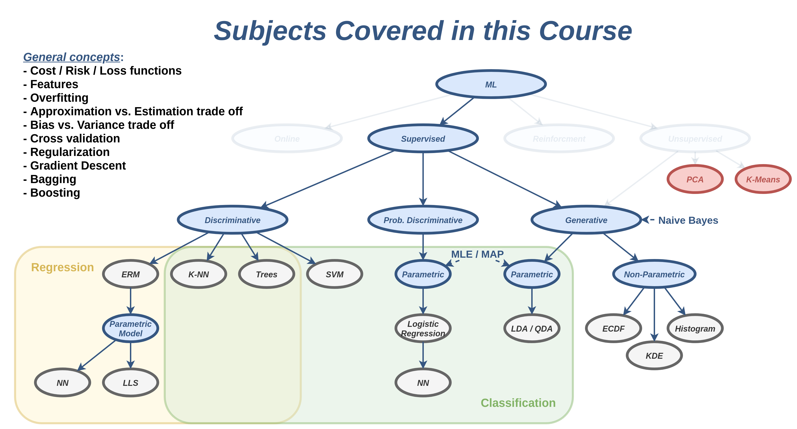

</section><section>

## למידה לא מודרכת (Unsupervised Learning)

- שם כולל למגוון של בעיות בהם אנו מנסים בהינתן מדגם, ללמוד את התכונות של הדגימות או של המדגם כולו.

- המדגם יכיל אוסף של דגימות ($\boldsymbol{x}$), ללא תווית ($y$).

- דוגמאות:
  - אשכול (חלוקה לקבוצות).
  - מציאת ייצוג "נוח" יותר של הדגימות.
  - דחיסה.
  - זיהוי אנומליות.
  - למידת הפילוג של הדגימות.

</section><section>

## מערכת Encoder-Decoder

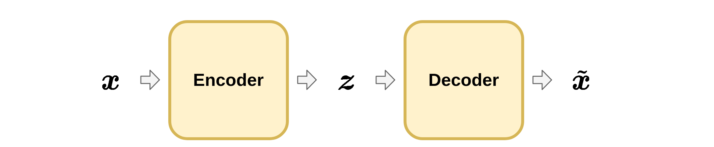

 

דוגמאות לשימושים במערכת encoder-decoder הינם:

- דחיסה: נרצה ש $\boldsymbol{z}$ יהיה קטן ככל האפשר.
- תקשורת: נרצה ש $\boldsymbol{z}$ יהיה כמה שפחות רגיש לרעשים.
- הצפנה: נרצה שפעולת השחזור של $\boldsymbol{x}$ תהיה כמה שיותר קשה ללא ה decoder המתאים.

$\tilde{\boldsymbol{x}}$ נקרא השחזור של $\boldsymbol{x}$. בחלק מהמערכות ניתן להגיע לשיחזור מושלם, $\tilde{\boldsymbol{x}}=\boldsymbol{x}$, ובחלק מהמערכות לא.

</section><section>

## Principle Component Analysis (PCA)

ב PCA ננסה לבנות מערכת encoder-decoder שבה:

1. אנו מגבילים את האורך של הוקטור $\boldsymbol{z}$.
2. אנו דורשים שה encoder וה decoder יהיו פונקציות אפיניות (affine = linear + offset).
3. התוחלת של שגיאת השחזור הריבועית $\mathbb{E}\left[\lVert\tilde{\mathbf{x}}-\mathbf{x}\rVert_2^2\right]$ היא מינימאלית.

נחליף את התוחלת בתוחלת אמפירית על מדגם.

</section><section>

## Principle Component Analysis (PCA)

$D$ האורך של $\boldsymbol{x}$ ו $K$ האורך של הוקטור $\boldsymbol{z}$
כאשר מתקיים כי $K \le D$. 

נרצה למצוא encoder:

$$
\boldsymbol{z}=T_1\boldsymbol{x}+\boldsymbol{b}_1
$$

ו decoder מהצורה של:

$$
\tilde{\boldsymbol{x}}=T_2\boldsymbol{z}+\boldsymbol{b}_2
$$

אשר ממזערים את התוחלת האמפירית של שגיאת השחזור הריבועית:

$$
\underset{T_1,T_2,\boldsymbol{b}_1,\boldsymbol{b}_2}{\arg\min}
\frac{1}{N}\sum_{i=1}^N\lVert\tilde{\boldsymbol{x}}^{(i)}-\boldsymbol{x}^{(i)}\rVert_2^2
$$

</section><section>

## שימושים

דוגמאות למקרים שבהם נרצה לבצע **הורדת מימד (dimensionality reduction)**:

1. בחירת מאפיינים לבעיות supervised learning
2. ויזואליזציה
3. דחיסה

</section><section>

## הפתרון לבעיית האופטימיזציה

מסתבר שיש מספר רב של פתרונות. ניתן לבחור את הפרמטרים כך שיקיימו את האילוצים:

$$
\begin{aligned}
\boldsymbol{b}_1&=-T_1\boldsymbol{\mu}\\
\boldsymbol{b}_2&=\boldsymbol{\mu}\\
T_1&=T_2^{\top}=T^{\top}\\
T^{\top}T&=I
\end{aligned}
$$

כאשר $\boldsymbol{\mu}=\frac{1}{N}\sum_{i=1}^N\boldsymbol{x}^{(i)}$.

**הערה:** שימו לב ש-$T\in\mathbb{R}^{D\times K}$ כך שמתקיים כי $T^\top T \in \mathbb{R}^{K\times K}=I_K$ כאשר $I_K$ היא מטריצת היחידה. בנוסף, מתקיים $T T^\top \in \mathbb{R}^{D\times D}$ והיא לא שווה בהכרח ל-$I_D$. 

</section><section>

## הפתרון לבעיית האופטימיזציה

לדוגמה, עבור המיפוי הבא 

$$
\boldsymbol{z}=T_{1}\boldsymbol{x}+\boldsymbol{b}_{1}\quad\tilde{\boldsymbol{x}}=T_{2}z+\boldsymbol{b}_{2}\quad T_{1}\in\mathbb{R}^{K\times D},\,T_{2}\in\mathbb{R}^{D\times K}
$$

איברי ההטיה $\boldsymbol{b}_1$ ו-$\boldsymbol{b}_2$ יכולים להיקבע ע"י הדרישות 

$$
E[\boldsymbol{z}]=0\quad\Rightarrow\quad b_{1}=-T_{1}\boldsymbol{\mu}
$$

ו-

$$
E\left[\tilde{\boldsymbol{x}}\right]=E\left[\boldsymbol{x}\right]\quad\Rightarrow\quad b_{2}=E\left[x\right]=\boldsymbol{\mu}
$$

</section><section>

## הפתרון לבעיית האופטימיזציה

הטרנספורמציות במקרה זה הופכות להיות:

$$
\begin{aligned}
\boldsymbol{z}&=T^{\top}(\boldsymbol{x}-\boldsymbol{\mu})\\
\tilde{\boldsymbol{x}}&=T\boldsymbol{z}+\boldsymbol{\mu}
\end{aligned}
$$

ובעיית האופטימיזציה הינה:

$$
\begin{aligned}
T^*=\underset{T}{\arg\min}\quad&\frac{1}{N}\sum_{i=1}^N\lVert\tilde{\boldsymbol{x}}^{(i)}-\boldsymbol{x}^{(i)}\rVert_2^2\\
\text{s.t.}\quad& T^{\top}T=I\\
T^*=\underset{T}{\arg\min}\quad&\frac{1}{N}\sum_{i=1}^N\lVert(TT^{\top}-I)(\boldsymbol{x}^{(i)}-\boldsymbol{\mu})\rVert_2^2\\
\text{s.t.}\quad& T^{\top}T=I
\end{aligned}
$$

</section><section>

## פרשנות גיאומטרית

- ה encoder מחסר את הממוצע של $\boldsymbol{x}$ וה decoder מוסיף אותו בחזרה.

- נניח מעתה שהנתונים ממורכזים סביב האפס. 

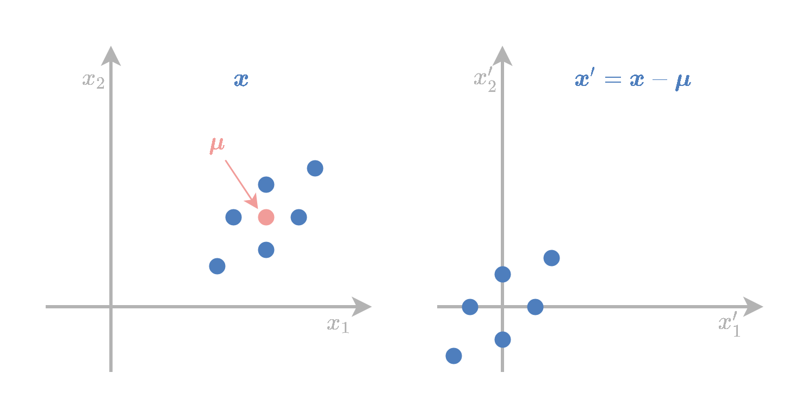

</section><section>

## הפתרון לבעיית האופטימיזציה

הטרנספורמציות המתקבלות הינן:

$$
\begin{aligned}
\boldsymbol{z}&=T^{\top}\boldsymbol{x}\\
\tilde{\boldsymbol{x}}&=T\boldsymbol{z}=TT^{\top}\boldsymbol{x}
\end{aligned}
$$

נתייחס כעת לאילוץ של $T^{\top}T=I$. אילוץ זה אומר שהעמודות של $T$ צריכות להיות אורתו-נורמאליות.

 

נסמן את העמודות של $T$ ב $\boldsymbol{u}_j$:

$$
T=\begin{pmatrix}
  | & |  &  & | \\
  \boldsymbol{u}_1 & \boldsymbol{u}_2 & \dots & \boldsymbol{u}_K \\
  | & |  &  & |
\end{pmatrix}
$$

</section><section>

## פרשנות גיאומטרית

הפעולה של $\tilde{\boldsymbol{x}}=TT^{\top}\boldsymbol{x}$ מטילה את הוקטור $\boldsymbol{x}$ על תת-המרחב הלינארי הנפרס על ידי הוקטורים $\boldsymbol{u}_j$.

 

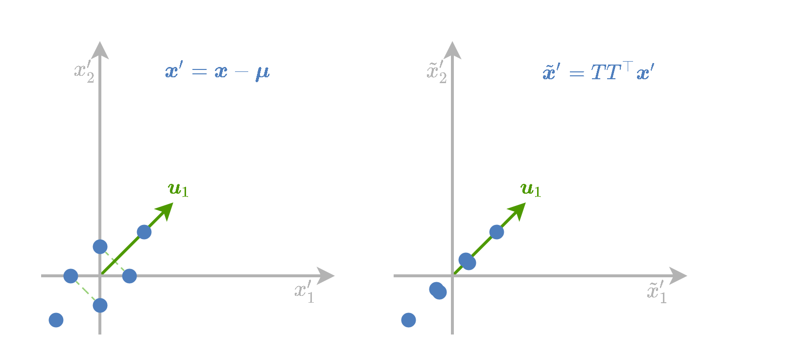

</section><section>

## פרשנות גיאומטרית

הפעולה של $\boldsymbol{z}=T^{\top}\boldsymbol{x}$ גם מטילה את $\boldsymbol{x}$ על אותו תת-מרחב, היא רק משאירה אותו במערכת הצירים של $\boldsymbol{u}_j$:

 

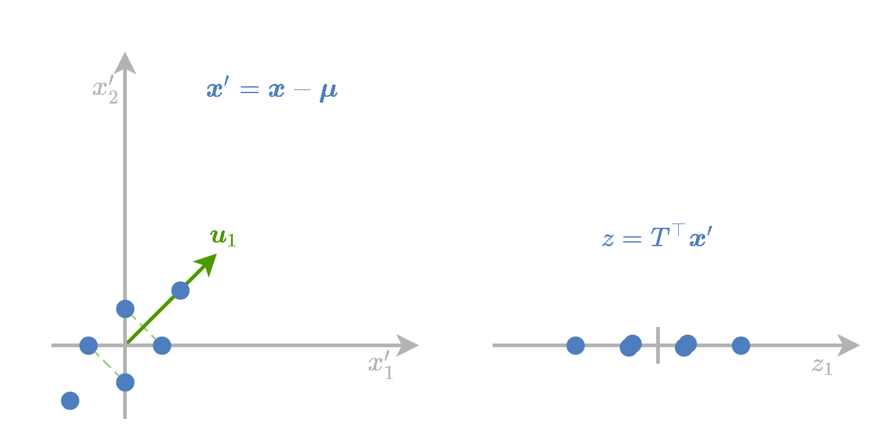

</section><section>

## פרשנות גיאומטרית

נסתכל כעת על המשמעות הגיאומטרית של שגיאת השחזור

$$
\lVert\tilde{\boldsymbol{x}}-\boldsymbol{x}\rVert_2^2
$$

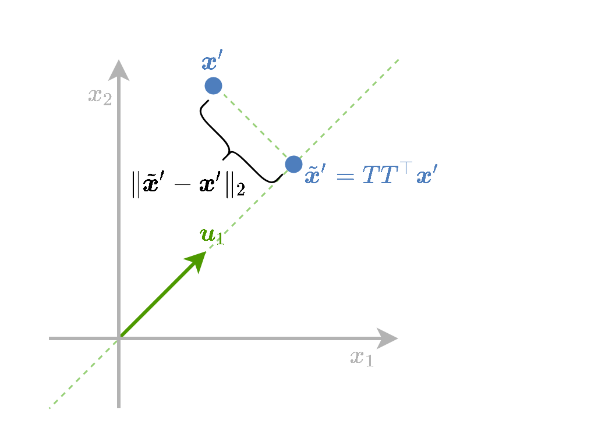

בעיית האופטימיזציה היא הבעיה של מציאת תת-המרחב ממימד $K$ אשר ההטלה של נקודות המדגם עליו הם הקרובות ביותר לנקודות המקוריות.

</section><section>

## הבעיה השקולה

מתוך העובדה ש $T^{\top}T=I$ ניתן להראות ש:

$$
\lVert\tilde{\boldsymbol{x}}-\boldsymbol{x}\rVert_2^2
=\lVert\boldsymbol{x}\rVert_2^2-\lVert\tilde{\boldsymbol{x}}\rVert_2^2
=\lVert\boldsymbol{x}\rVert_2^2-\lVert\boldsymbol{z}\rVert_2^2
$$

שכן, עבור $T^{\top}T=I$ מתקיים כי $\left(I-TT^{\top}\right)^{2}=\left(I-TT^{\top}\right)$ לכן, 

$$
\begin{aligned}
\left\Vert \boldsymbol{x}-\tilde{\boldsymbol{x}}\right\Vert _{2}^{2} & =\left\Vert \boldsymbol{x}-TT^{\top}x\right\Vert _{2}^{2}\\
 & =\left\Vert \left(I-TT^{\top}\right)x\right\Vert _{2}^{2}\\
 & =\boldsymbol{x}^{\top}\left(I-TT^{\top}\right)\boldsymbol{x}\\
 & =\left\Vert \boldsymbol{x}\right\Vert _{2}^{2}-\left\Vert \boldsymbol{z}\right\Vert _{2}^{2}
\end{aligned}
$$

ובנוסף 

$$
\left\Vert \tilde{\boldsymbol{x}}\right\Vert _{2}^{2}=\left\Vert T\boldsymbol{z}\right\Vert _{2}^{2}=\boldsymbol{z}^{\top}T^{\top}T\boldsymbol{z}=\left\Vert \boldsymbol{z}\right\Vert _{2}^{2}
$$

</section><section>

## הבעיה השקולה 

מכאן שנוכל לרשום את בעיית האופטימיזציה באופן הבא:

$$
\begin{aligned}
T^*=\underset{T}{\arg\min}\quad&\frac{1}{N}\sum_{i=1}^N\left( \lVert\boldsymbol{x}^{(i)}\rVert_2^2
                                                             -\lVert\boldsymbol{z}^{(i)}\rVert_2^2
                                                             \right)\\
\text{s.t.}\quad& T^{\top}T=I
\end{aligned}
$$

נזכור ש $\lVert\boldsymbol{x}\rVert_2^2$ והוא תכונה של הוקטורים במדגם והם אינם תלויים ב $T$ ולכן:

$$
\begin{aligned}
T^*=\underset{T}{\arg\min}\quad&-\frac{1}{N}\sum_{i=1}^N\lVert\boldsymbol{z}^{(i)}\rVert_2^2\\
\text{s.t.}\quad& T^{\top}T=I
\end{aligned}
$$

</section><section>

## הבעיה השקולה

$$
\begin{aligned}
T^*=\underset{T}{\arg\min}\quad&-\frac{1}{N}\sum_{i=1}^N\lVert\boldsymbol{z}^{(i)}\rVert_2^2\\
\text{s.t.}\quad& T^{\top}T=I
\end{aligned}
$$

הבעיה של מזעור שגיאת השחזור הריבועית שקולה לבעיה של מקסום הגודל $\sum_{i=1}^N\lVert\boldsymbol{z}^{(i)}\rVert_2^2$.

 

גדול זה מכונה ה variance של אוסף הוקטורים $\{\boldsymbol{z}^{(i)}\}_{i=1}^N$.

</section><section>

## הפתרון

נגדיר:

$$
X
=\begin{pmatrix}
  - & \boldsymbol{x}'^{(1)} & -\\
  - & \boldsymbol{x}'^{(2)} & -\\
    & \vdots &  \\
  - & \boldsymbol{x}'^{(N)} & -\\
\end{pmatrix}
=\begin{pmatrix}
  - & (\boldsymbol{x}^{(1)}-\boldsymbol{\mu})^{\top} & -\\
  - & (\boldsymbol{x}^{(2)}-\boldsymbol{\mu})^{\top} & -\\
    & \vdots &  \\
  - & (\boldsymbol{x}^{(N)}-\boldsymbol{\mu})^{\top} & -\\
\end{pmatrix}
$$

 

ומטריצת ה covariance האמפירית של $\mathbf{x}$ תהיה:

$$
P=X^{\top}X
$$

</section><section>

## הפתרון

$$
P=X^{\top}X
$$

$P$ ממשית וסימטרית ולכן מובטח כי ניתן לפרק אותה באופן הבא:

$$
P=U\Lambda U^{\top}
$$

כאשר $U$ היא מטריצה הוקטורים עצמיים:

$$
U=\begin{pmatrix}
  | & |  &  & | \\
  \boldsymbol{u}_1 & \boldsymbol{u}_2 & \dots & \boldsymbol{u}_D \\
  | & |  &  & |
\end{pmatrix}
$$

ו $\Lambda$ היא מטריצה הערכים העצמיים:

$$
\Lambda=\begin{pmatrix}
  \lambda_1 & 0 & \dots & 0 \\
  0 & \lambda_2 & & 0 \\
  \vdots & & \ddots & \vdots \\
  0 & 0 & \dots & \lambda_D \\
\end{pmatrix}
$$

</section><section>

## הפתרון

$T$ תהיה מטריצה אשר העמודות שלה הם $K$ העמודות הראשונות במטריצה $U$:

$$
T=\begin{pmatrix}
  | & |  &  & | \\
  \boldsymbol{u}_1 & \boldsymbol{u}_2 & \dots & \boldsymbol{u}_K \\
  | & |  &  & |
\end{pmatrix}
$$

- הכיוונים $\boldsymbol{u}^{(j)}$ מכונים ה**כיוונים העיקריים**
- הרכיבים של הוקטור $\boldsymbol{z}$ מכונים ה**רכיבים העיקריים (principal components)**.

</section><section>

## דוגמא

פירוק תמונות של פנים לכיוונים העיקריים:

 

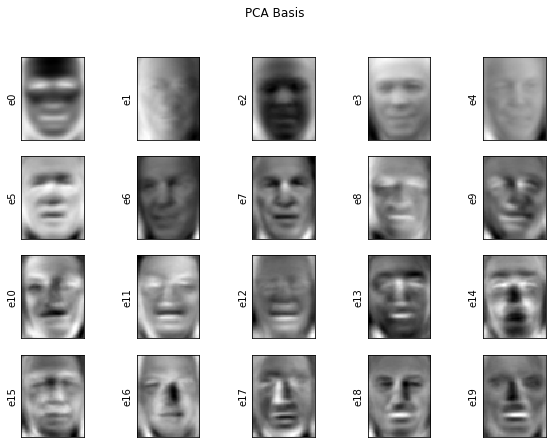

</section><section>

## דוגמא

תמונה המשוחזרת עבור ערכים שונים של $K$:

 

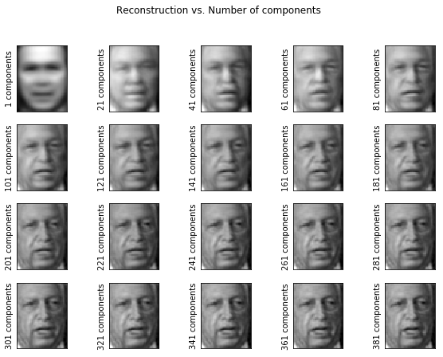

</section><section>

## הרחבות לא לינאריות 

קיימות הרחבות לא לינאריות רבות ל-PCA. נידונות בקורס עיבוד וניתוח מידע (ענ"ם). 

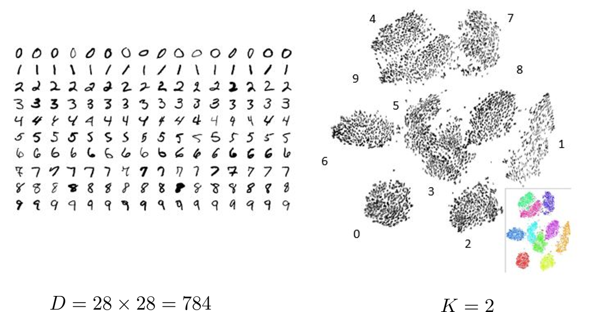

הפעלת אלגוריתם tSNE על MNIST. 

</section><section>

## אשכול

באלגוריתמי אשכול ננסה לחלק אוסף של פרטים לקבוצות המכונים אשכולות (clusters), כאשר לכל קבוצה איזשהן תכונות דומות. כמובן, בממדים גבוהים לא רואים זאת בעין. 

 

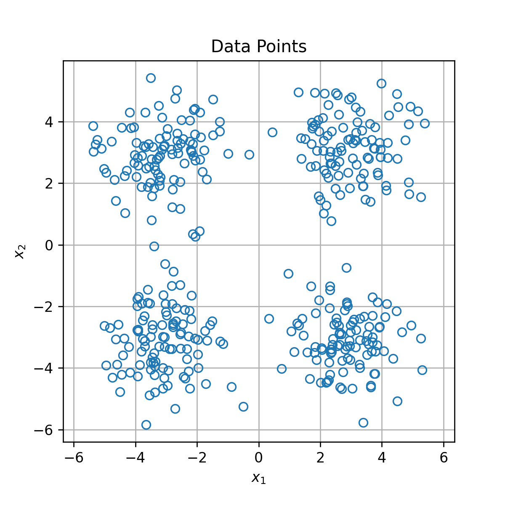

&#x21E6;

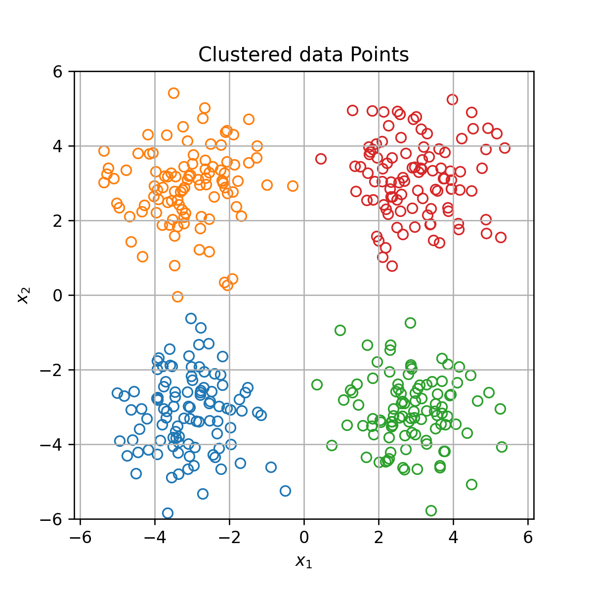

</section><section>

## אשכול

2 דוגמאות למקרים שבהם נרצה לאשכל:

1. על מנת לבצע הנחות על אחד מהפרטים באשכול על סמך פרטים אחרים באשכול. 
   לדוגמא: להציע ללקוח מסויים בחנות אינטרנט מוצרים על סמך מוצרים שקנו לקוחות אחרים באשכול שלו.
2. לתת טיפול שונה לכל אשכול. 
   לדוגמא: משרד ממשלתי שרוצה להפנות קבוצות שונות באוכלוסיה לערוצי מתן שירות שונים: אפליקציה, אתר אינטרנט, נציג טלפוני או הפניה פיסית למוקד שירות.

</section><section>

## K-Means

K-Means הוא אלגוריתם אשכול אשר מנסה לחלק את הדגימות במדגם ל $K$ קבוצות על סמך המרחק בין הדגימות.

### סימונים

- $K$ - מספר האשכולות (גודל אשר נקבע מראש).
- $\mathcal{I}_k$ - אוסף האינדקסים של האשכול ה-$k$. 
  לדוגמא: $\mathcal{I}_5=\left\lbrace3, 6, 9, 13\right\rbrace$
- $|\mathcal{I}_k|$ - גודל האשכול ה-$k$ (מספר הפרטים בקבוצה)
- $\{\mathcal{I}_k\}_{k=1}^K$ - חלוקה מסוימת לאשכולות

</section><section>

## בעיית האופטימיזציה

K-Means מנסה למצוא את החלוקה לאשכולות אשר תמזער את המרחק הריבועי הממוצע בין כל דגימה לכל שאר הדגימות שאיתו באותו האשכול:

$$
\underset{\{\mathcal{I}_j\}_{k=1}^K}{\arg\min}\frac{1}{N}\sum_{k=1}^K\frac{1}{2|\mathcal{I}_k|}\sum_{i,j\in\mathcal{I}_k}\lVert\boldsymbol{x}^{(j)}-\boldsymbol{x}^{(i)}\rVert_2^2
$$

**שאלה:** האם פונקציית מרחק ריבועית תמיד מתאימה? 

</section><section>

## הבעיה השקולה

נגדיר את מרכז המסה:

$$
\boldsymbol{\mu}_k=\frac{1}{|\mathcal{I}_k|}\sum_{i\in\mathcal{I}_k}\boldsymbol{x}^{(i)}
$$

ניתן להראות כי בעיית האופטימיזציה המקורית, שקולה לבעיה של מיזעור המרחק הממוצע של הדגימות ממרכז המסה של האשכול:

$$
\underset{\{\mathcal{I}_j\}_{k=1}^K}{\arg\min}\frac{1}{N}\sum_{k=1}^K\sum_{i\in\mathcal{I}_k}\lVert\boldsymbol{x}^{(i)}-\boldsymbol{\mu}_k\rVert_2^2
$$

</section><section>

## הבעיה השקולה 

$$
\begin{aligned}
\sum_{i,j\in\mathcal{I}_{k}}^{K} & \left\Vert \boldsymbol{x}^{(i)}-\boldsymbol{x}^{(j)}\right\Vert _{2}^{2}=\sum_{i,j\in\mathcal{I}_{k}}\left\Vert \boldsymbol{x}^{(i)}-\boldsymbol{\mu}_{k}+\boldsymbol{\mu}_{k}-\boldsymbol{x}^{(j)}\right\Vert _{2}^{2}\\
= & \sum_{i,j\in\mathcal{I}_{k}}\left\Vert \boldsymbol{x}^{(i)}-\boldsymbol{\mu}_{k}\right\Vert _{2}^{2}+\sum_{i,j\in\mathcal{I}_{k}}\left\Vert \boldsymbol{x}^{(j)}-\boldsymbol{\mu}_{k}\right\Vert _{2}^{2}-2\sum_{i,j\in\mathcal{I}_{k}}\left(\boldsymbol{x}^{(i)}-\boldsymbol{\mu}_{k}\right)^{\top}\left(\boldsymbol{x}^{(j)}-\boldsymbol{\mu}_{k}\right)\\
= & 2\left|\mathcal{I}_{k}\right|\sum_{i\in\mathcal{I}_{k}}\left\Vert \boldsymbol{x}^{(i)}-\boldsymbol{\mu}_{k}\right\Vert _{2}^{2}-2\sum_{i\in\mathcal{I}_{k}}\left(\boldsymbol{x}^{(i)}-\boldsymbol{\mu}_{k}\right)^{\top}\sum_{j\in\mathcal{I}_{k}}\left(\boldsymbol{x}^{(j)}-\boldsymbol{\mu}_{k}\right)\\
= & 2\left|\mathcal{I}_{k}\right|\sum_{i\in I_{k}}\left\Vert \boldsymbol{x}^{(i)}-\boldsymbol{\mu}_{k}\right\Vert _{2}^{2}
\end{aligned}
$$

שכן: 

$$
\sum_{i\in I_{k}}\left( \boldsymbol{x}^{(i)}-\boldsymbol{\mu}_{k}\right) = \left|\mathcal{I}_{k}\right| \cdot \frac{1}{\left|\mathcal{I}_{k}\right|}\sum_{i\in I_{k}}\boldsymbol{x}^{(i)}-\left|\mathcal{I}_{k}\right|\boldsymbol{\mu}_{k} = 0
$$

</section><section>

## האלגוריתם

- אלגוריתם חמדן.
- מאותחל ב $t=0$ על ידי בחירה אקראית של $\{\mu_k\}_{k=1}^K$.

בכל צעד $t$ מבצעים את שתי הפעולות הבאות:

1. עדכון מחדש של החלוקה לאשכולות $\{\mathcal{I}_k\}_{k=1}^K$. כל דגימה משוייכת למרכז המסה הקרוב עליה.
2. עדכון של מרכזי המסה המסה על פי:

    $$
    \boldsymbol{\mu}_k=\frac{1}{|\mathcal{I}_k|}\sum_{i\in\mathcal{I}_k}\boldsymbol{x}^{(i)}
    $$

תנאי העצירה הינו כשהאשכולות מפסיקות להשתנות.

</section><section>

## תכונות

- מובטח כי פונקציית המטרה תקטן בכל צעד.
- מובטח כי האלגוריתם יעצר לאחר מספר סופי של צעדים.
- **לא** מובטח כי האלגוריתם יתכנס לפתרון האופטימאלי. בפועל במרבית מתכנס לפתרון קרוב מאד לאופטימאלי.
- אתחולים שונים יכולים להוביל לתוצאות שונות.

</section><section>

## דוגמא

אתחול (וחלוקה ראשונית לאשכולות):

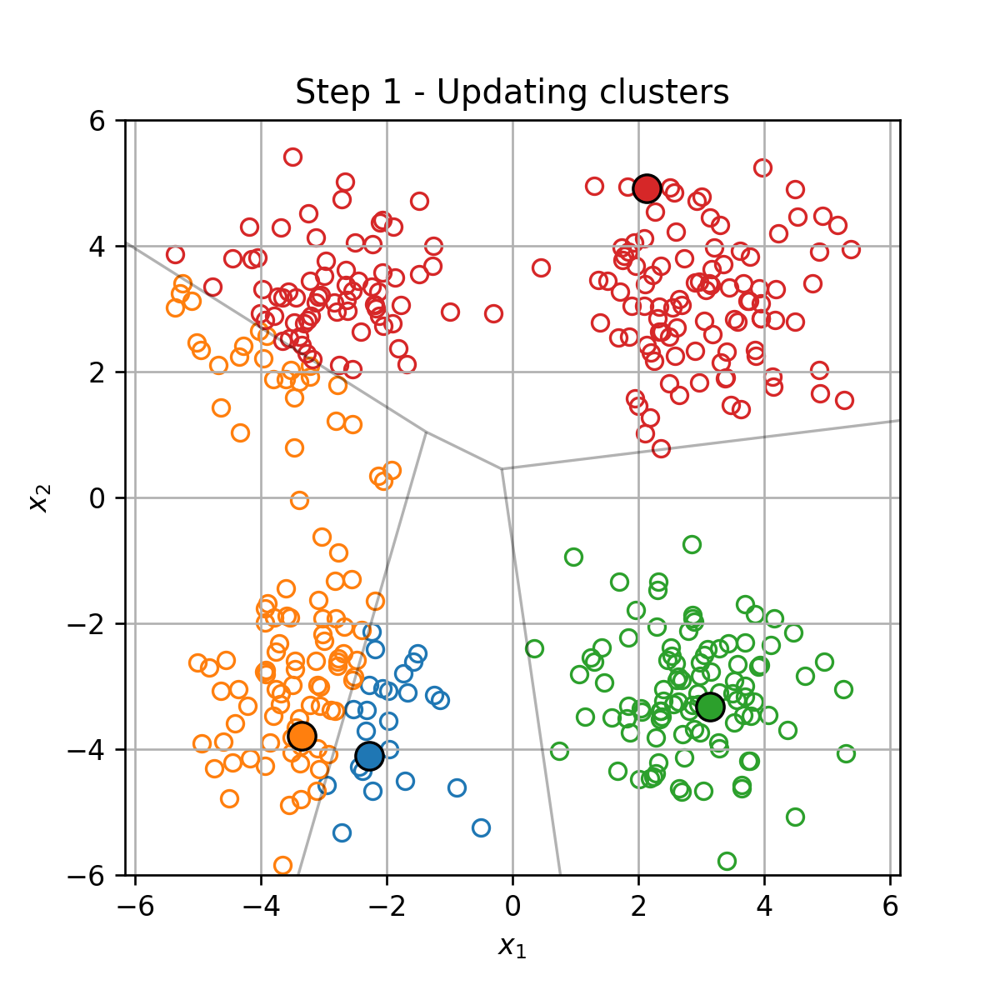

</section><section>

## דוגמא

עדכון המרכזים:

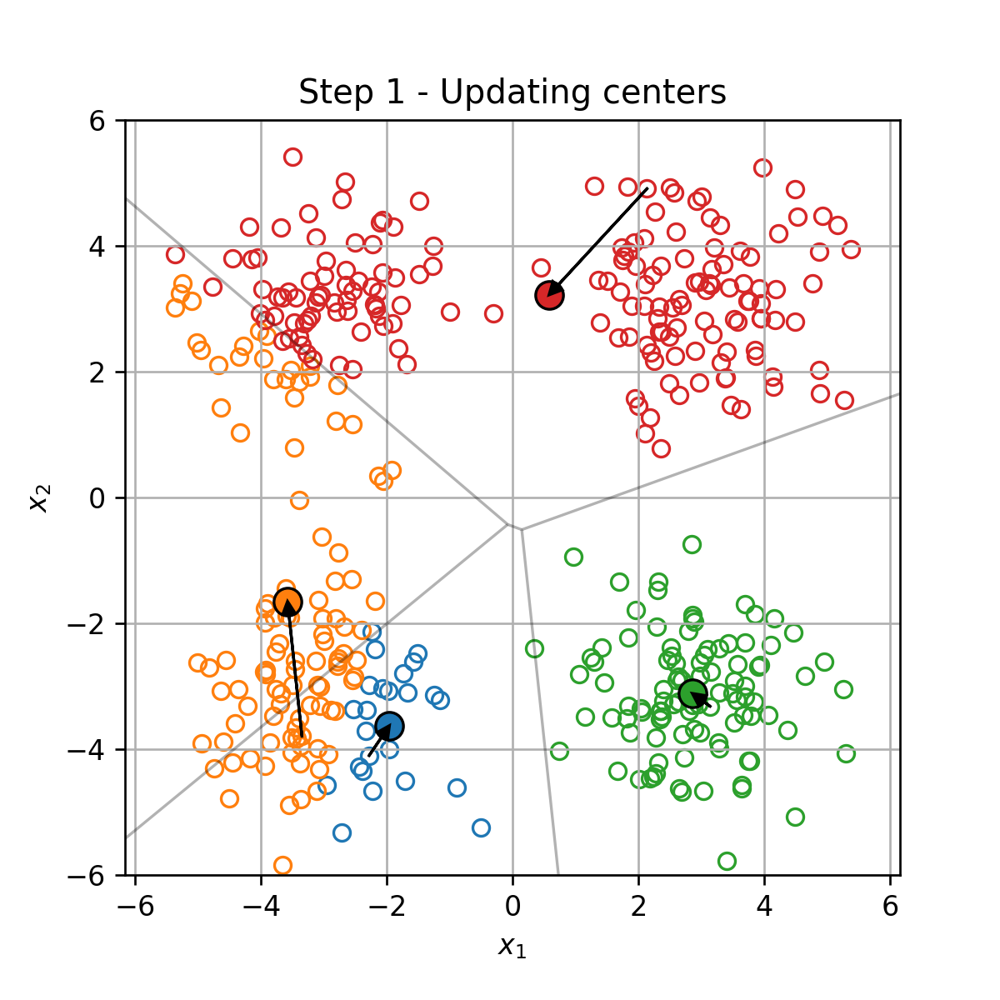

</section><section>

## דוגמא

עדכון האשכולות:

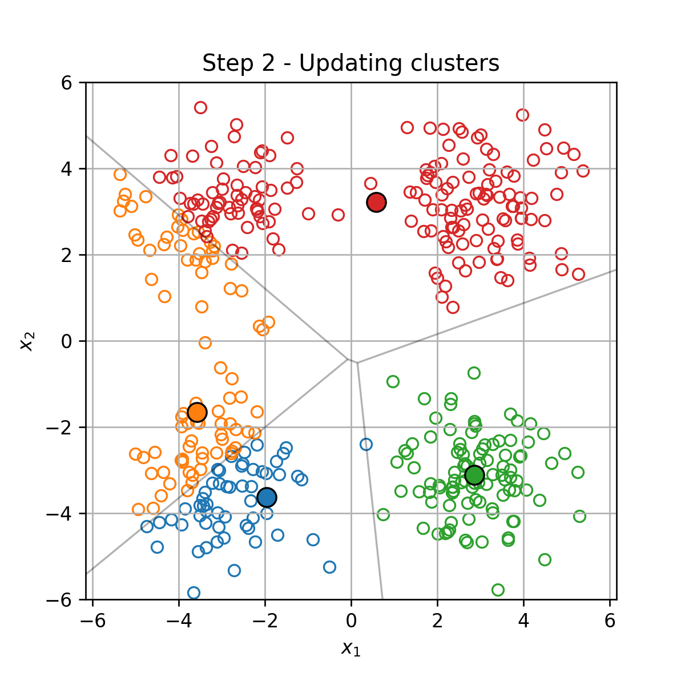

</section><section>

## דוגמא

עדכון המרכזים:

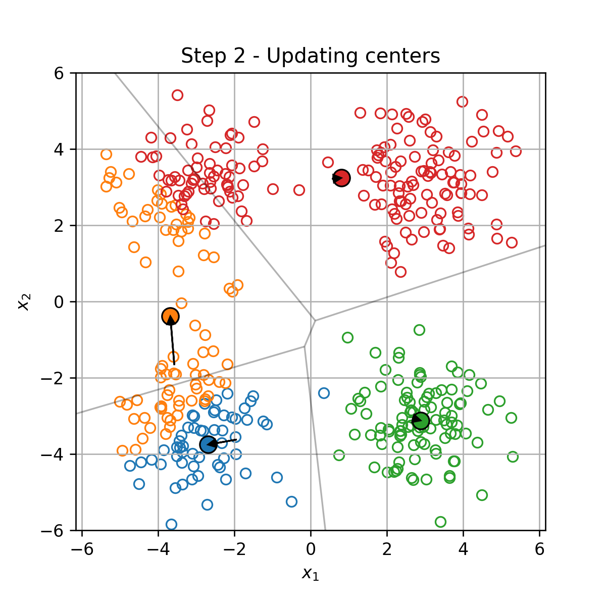

</section><section>

## דוגמא

וחוזר חלילה (הסדר הוא מימין לשמאל):

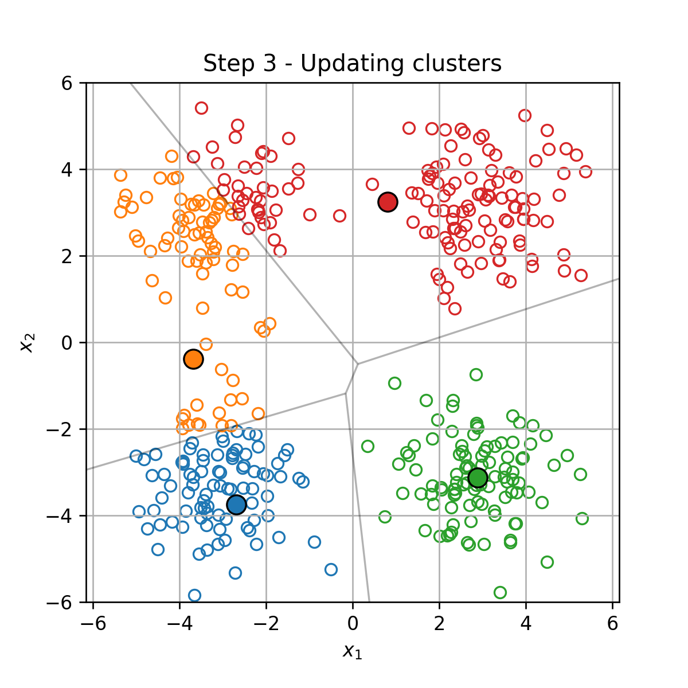

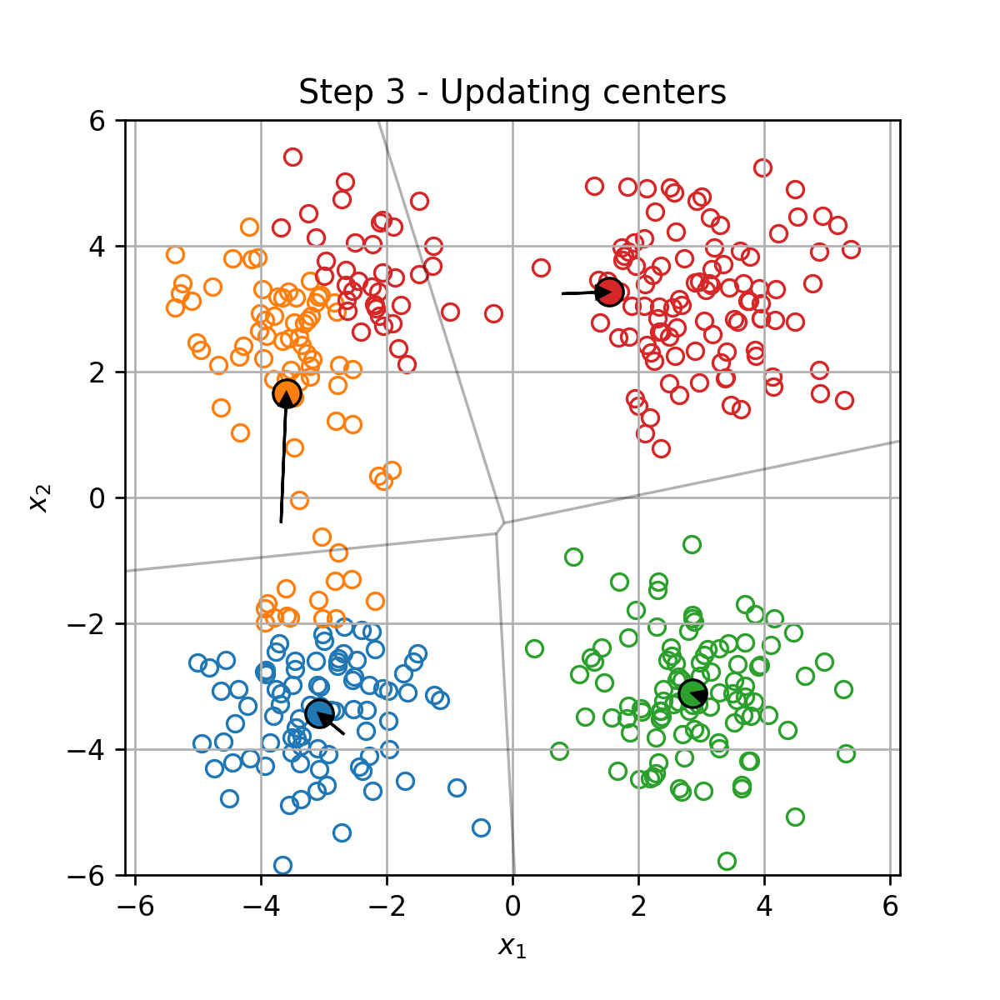

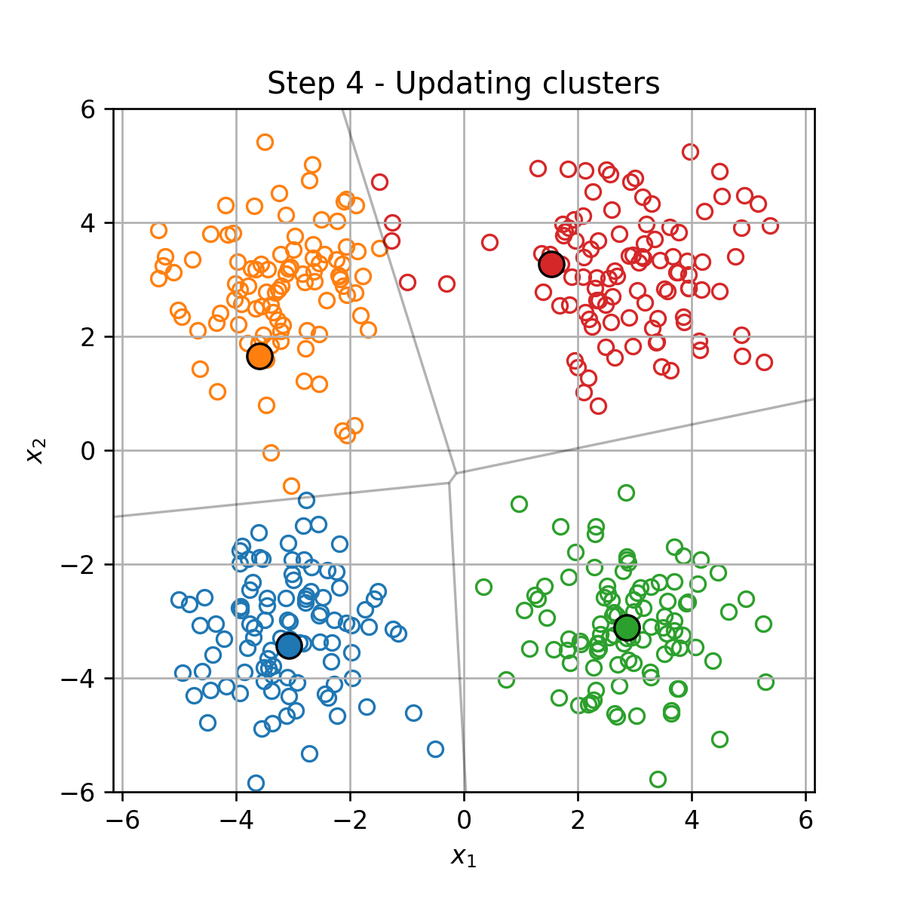

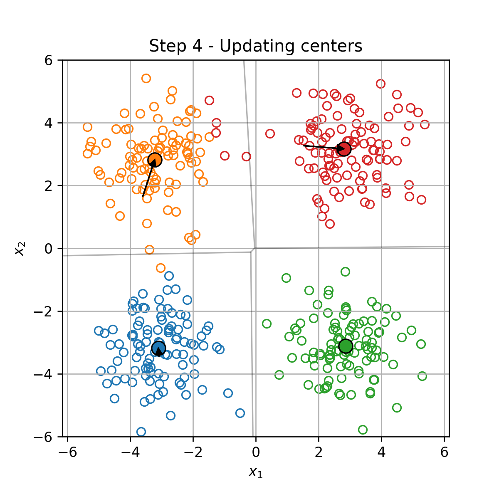

</section><section>

## אלגוריתמי אשכול שונים

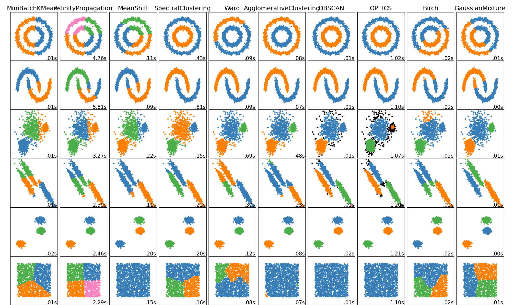

לרוב לא נוכל לצייר את האשכולות בשני ממדים.

</section>

</section>

