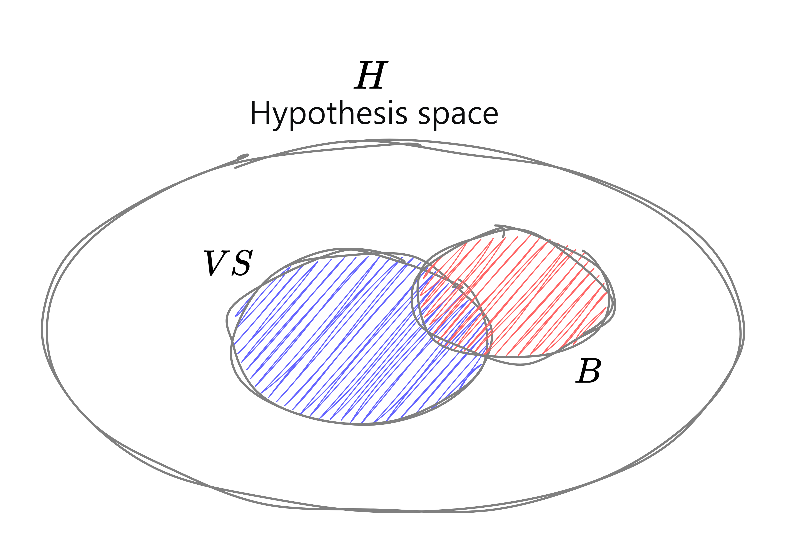

# הרצאה 5 - יסודות בלמידה חישובית

<a href="/assets/lecture20.pdf" class="link-button" target="_blank">PDF</a>

## מה נלמד היום

בפרק זה נציג מעט מהתיאוריה הכמותית הקיימת בנושא למידה והכללה. המטרה הבסיסית של תיאוריה זו היא תיאור כמותי של בעיית הלמידה, אפיון הביצועים האפשריים עבור בעיית למידה נתונה, וחקר כמותי של השפעת המרכיבים השונים של הבעיה (כגון: סיבוכיות המודל, אופן בחירת הדגימות, מספר הדגימות, וכו') על הביצועים המתקבלים. 

תיאוריה זו היא בעיקרה **בעלת אופי סטטיסטי**, כלומר מסתמכת על **כלים הסתברותיים**. 

אנו נסתפק בהצגת מספר תוצאות ומושגים  יסודיים, וזאת עבור **בעיית הסיווג הבינארי בלבד**.

## מודל הלמידה הבסיסי

נזכור כי בבעיית הלמידה המודרכת אנו נדרשים "ללמוד" פונקציה $\hat{y}=h(\boldsymbol{x})$ על סמך מדגם $\mathcal{D}=\{ \boldsymbol{x}^{(i)}, y^{(i)} \}_{i=1}^N$. 

המודל הבסיסי בו נעסוק כולל את המרכיבים הבאים: 

- **פונקצית החיזוי** - פונקציה $\hat{y}=h(\boldsymbol{x})$ ממרחב הקלט $\mathcal{X}$ למרחב היציאה $\mathcal{Y}$ אותה אנו רוצים ללמוד. נזכיר כי עבור בעיית רגרסיה מתקיים $\mathcal{Y}=\mathbb{R}$ ועבור בעיית הסיווג הבינארי מתקיים $\mathcal{Y}=\{-1, 1\}$. נניח כי התיוג דטרמניסטי.

- **מודל בחירת הדוגמאות** - דוגמאות הקלט נבחרות באופן בלתי תלוי ולפי פילוג הסתברות קבוע (אך לא בהכרח ידוע), כלומר באופן i.i.d. כלומר מתקיים, $\boldsymbol{x}^{(i)} \sim P_X, i=1,...,N$.
  הדוגמאות מתויגות באופן מושלם לפי הפונקציה $h_0$, כלומר $y^{(i)}=h_0(\boldsymbol{x}^{(i)})$.

- **מודל פרמטרי** - אוסף $H$ של פונקציות $H: \mathcal{X} \rightarrow \mathcal{Y}$, שמתוכו נבחר את הפונקציה $\hat{h}$ אשר משערכת את פונקציית המטרה $h$. כאשר $H$ תכונה כאן **מחלקת ההשערות**.

**פונקציית הסיכון** עבור השערה $h \in H$ כלשהי תהיה מהצורה 

$$
R(h)=E[\mathcal{l}(h(\mathbf{x}),h_0(\mathbf{x}))]
$$

כאשר:

- $\mathcal{l}(\hat{y},y)$ הינה פונקצית מחיר מתאימה. למשל פונקציית הפסד $\mathcal{l}_2$ לבעיית רגרסיה או zero-one loss לבעיית סיווג.

- התוחלת היא על המשתנה המקרי $\mathbf{x}$ לפי הפילוג $\mathbf{x} \sim P_X$. פילוג זה זהה לפילוג לפיו נבחרו הדוגמאות.

- עבור בעיית הסיווג הבינארי נקבל $R(\hat{h})=P\{\hat{h}(\mathbf{x})\neq h_0(\mathbf{x})\}=P_e(\hat{h})$. כאשר המעבר השני נכון בגלל תוחלת של אינדיקטור. 

**מטרת תהליך הלימוד** היא, אם כן, לבחור את הפונקציה האופטימלית כתלות במדגם, $h^{*}_{\mathcal{D}}$, מתוך מחלקת ההשעערות $H$, שמביאה את פונקציית הסיכון למינימום.  

הבעיה היא כמובן ש-$R(h)$ אינו ניתן לחישוב מתוך מדגם סופי!

### הערות

- חשוב להדגיש כי הדוגמאות $\{\boldsymbol{x}^{(i)}\}$ נבחרות לפי אותו פילוג $P_X$ המשמש בהגדרת מדד הביצועים. דבר זה יאפשר קבלת חסמים על קצב ושגיאת הלימוד שאינם תלויים ב-$P_X$.

- המודל הנ"ל מניח קשר דטרמניסטי בין $\mathbf{x}$ ל-$y$. ניתן להרחיב את התוצאות הללו למקרה של קשר אקראי, כלומר להחליף את הפונקציה $y=h_0(\mathbf{x})$ בפילוג המותנה $p(y|\mathbf{x})$.

המודל ההסתברותי שהגדרנו מאפשר התייחסות כמותית לשאלות הבאות:

- **דיוק הלמידה** - באיזה דיוק ניתן ללמוד את פונקצית המטרה $h_0(\mathbf{x})$ מתוך $N$ דוגמאות?
- **קצב הלמידה** - כמה דוגמאות נדרשות כדי להשיג דיוק נתון?

## מזעור המחיר האמפירי (Emperical Risk Minimization)

בהיעדר מידע לגב הפילוג, ניתן להחליף את המזעור של פונקציית הסיכון האמיתית, $R$, במזעור של פונקציית הסיכון האמפירית, $\hat{R}$, אותה אנחנו יכולים לחשב על סמך המדגם. 

כלומר, בהינתן המדגם $\mathcal{D}=\{\boldsymbol{x}^{(i)}, y^{(i)}\}_{i=1}^N$ , נבחר את ההשערה $h^{*}_{\mathcal{D}}$ באופן הבא:

$$
h^{*}_{\mathcal{D}}\in \underset{{h\in H}}{\arg\min} \hat{R}_{\mathcal{D}}(h), \qquad \hat{R}_{\mathcal{D}}(h) = \frac{1}{N}\sum_{i=1}^{N}\mathcal{l}(h(\boldsymbol{x}^{(i)}),h_0(\boldsymbol{x}^{(i)})) 
$$

לדוגמה: 
 
 - עבור בעיית רגרסיה עם פונקציית הפסד מסוג $\mathcal{l}_2$ נקבל את פונקציית הסיכון הבאה:
 $$
 \hat{R}_{\mathcal{D}}(h) = \frac{1}{N}\sum_{i=1}^{N}(h(\boldsymbol{x}^{(i)})-h_0(\boldsymbol{x}^{(i)}))^2
 $$

- עבור בעיות סיווג נקבל:
 $$
 \hat{R}_{\mathcal{D}}(h) = \frac{1}{N}\sum_{i=1}^{N}I(h(\boldsymbol{x}^{(i)})\neq h_0(\boldsymbol{x}^{(i)}))
 $$

  כאשר מדובר במספר השגיאות הממוצע של המסווג על סט הלימוד.

נניח מעתה כי  $h^{*}_{\mathcal{D}}$ היא אכן הפונקציה הנבחרת על ידי אלגוריתם הלמידה שלנו.  בפרט, אנו מניחים כי ניתן למצוא את המינימום הגלובאלי של $\hat{R}_{\mathcal{D}}(h)$ , מבלי להתייחס לקושי החישובי הכרוך בכך.

**הערה:**  למרות שאנו מניחים מזעור של השגיאה האמפירית אין לראות בכך  המלצה לעשות זאת! גישה זו יכולה להוביל להתאמת-יתר חמורה עבור מרחב השערות גדול. 

### שגיאת ההכללה לעומת שגיאת הקירוב

נסמן - $h^* \in \underset{h\in H}{\arg \min} \hat{R}(h)$ - בתור ההשערה האופטימלית שאינה ניתנת לחישוב. 

 ניתן לרשום את פונקציית הסיכון המתקבלת בצורה הכאה:

 $$
 R(h^{*}_{\mathcal{D}})=R(h^*)+[R(h^{*}_{\mathcal{D}})-R(h^*)]
 $$
 
-	האיבר הראשון הוא שגיאת הקירוב (בדומה למשתנה ההטיה, bias), אשר נובע מכך שאנו מגבילים את הפונקציה הנלמדת לקבוצת ההשערות $H$. הוא אינו תלוי במספר הדגימות.

-	האיבר השני הוא שגיאת השערוך (בדומה למשתנה השונות), ומבטא את השגיאה הנובעת מסופיות המדגם עקב כך שהפונקציה הנבחרת  $h^{*}_{\mathcal{D}}$ אינה האופטימלית (מתוך  $H$). זאת מכיוון שאנו מבצעים מינימיזציה של הסיכון האמפירי ולא של הסיכון האמיתי.

-	ככל שמחלקת ההשערות   $H$ עשירה (גדולה) יותר, אנו מצפים כי האיבר הראשון (איבר ההטיה) יקטן, והאיבר השני (איבר השונות) יגדל.

-	עושר המודל ($H$) צריך להיות כזה המוצא איזון אופטימאלי בין שני איברים אלה. 

## חסמים עבור מחלקת השערות סופית
 נתמקד מעתה בבעית הסיווג הבינארי, כלומר בעיות סיווג עם פונקצית הפסד מסוג zero-one loss: 

 $$
 \mathcal{l}(\hat{y},y)=I\{\hat{y} \neq y\}, \mathcal{Y}=\{-1,+1\}
 $$

 מטרתנו למצוא חסמים על פונקציית הסיכון $R(h^{*}_{\mathcal{D}})$, כאשר $h^{*}_{\mathcal{D}}$ היא הפונקציה (ההשערה) המביאה למינימום את המחיר האמפירי $\hat{R}_{\mathcal{D}}(h)$.

 נשים לב כי במקרה הבינארי המחיר האמפירי איננו אלא השגיאה האמפירית (למה?). 

 ראשית נעסוק במקרה בו $h_0\in H$, כלומר במקרה בו פונקציה המטרה $h_0$ כלולה בתוך קבוצת ההשערות $H$.
 
 כלומר:
 
 $$
 R^*=\underset{h \in H}{\min}R(h)=0
 $$ 

 ### משפט 1
 נניח כי $|H| < \infty$ וכן $h_0 \in H$, כלומר $R^*=0$. אזי, השערה $h^{*}_{\mathcal{D}}$ הממזערת את הסיכון האמפירי מקיימת לכל $\varepsilon > 0$

 $$
 P(R(h^{*}_{\mathcal{D}})>\varepsilon) < |H|e^{-\varepsilon n}
 $$

ניתן להגדיר את המשפט גם בצורה שקולה באמצעות **"רווח סמך" (confidence interval)**. 

רווח סמך הוא מושג מסטטסיטיקה. מושג זה מתאר, עבור פרמטר לא ידוע כלשהו, קטע שמחושב מתוך תוצאות המדגם, כך שהסיכוי שהקטע שנקבל יכלול את הפרמטר הוא קבוע, הקרוי רמת הסמך של הקטע. המשלים לרמת הסמך קרוי רמת המובהקות.

**ניסוח מתמטי של רווח סמך הוא**: 

בהינתן מדגם $\mathcal{D}=\{\boldsymbol{x}^{(i)}\}$ מהתפלגות $F_{\theta}$ הידועה למעט ערכו של הפרמטר $\theta$, רווח סמך בעל רמת מובהקות $\alpha$ הוא קטע שקצוותיו מחושבים על פי המדגם כך שההסתברות של הפרמטר $\theta$ להיות בתוך קטע זה היא $1-\alpha$.

##### משפט 1 - בניסוח רווח סמך

על ידי השוואת אגף ימין ל-$\delta$, כלומר בחירת $\varepsilon=\frac{1}{N} \log\frac{|H|}{\delta}$, ניתן לקבל את הצורה הבאה של המשפט, כאשר הפרמטר $\delta$ נקרא רווח הסמך:

- לכל $\delta>0$ מתקיים בהתסברות של $(1-\delta)$ לפחות $R(h^{*}_{\mathcal{D}}) < \frac{1}{N} \log\frac{|H|}{\delta}$

 

##### משפט 1 - ניסוח סיבוכיות המדגם 

החסם שקיבלנו מאפשר לנו לבחור את גודל המדגם $N$ המבטיח שגיאה קטנה כרצוננו, ובהתסברות גבוהה כרצוננו, אם $N>\frac{1}{\varepsilon} \log\frac{|H|}{\delta}$, נקבל כי $R(h^{*}_{\mathcal{D}})$ בהסתברות $1-\delta$ לפחות. 

##### משפט 1 - ניסוח חסם על התוחלת 

ננסח בנוסף חסם עבור התוחלת. 

עבור השערה $h^{*}_{\mathcal{D}}$ אי שלילית, התוחלת שלה, $E[R(h^{*}_{\mathcal{D}})]$, חסומה על ידי 

 $$
 E[R(h^{*}_{\mathcal{D}})] < \frac{1+\log(|H|)}{N} = \mathcal{O}\biggl(\frac{1}{N}\biggr)
 $$

#### מספר מונחים בסיסיים בלמידה חישובית:

 אלגוריתם כלשהו לבחירת $h^{*}_{\mathcal{D}} \in H$  שעבורו  $P(R(h^{*}_{\mathcal{D}})>\varepsilon) \rightarrow 0$ כאשר  $N \rightarrow \infty$ (לכל $ h_0 \in H $) נקרא אלגוריתם Probably Approximately Correct או בקיצור PAC. קבוצת השערות $H$ שעבורה קיים אלגוריתם PAC נקראת ברת-למידה (Learnable). 

משפט 1 מראה כי האלגוריתם הממזער את השגיאה האמפירית הוא אלגוריתם PAC עבור כל קבוצת השערות סופית (ולפיכך כל קבוצת השערות סופית היא ברת למידה). 

נעבור כעת למקרה הכללי יותר שבו פונקצית המטרה $h_0$ אינה כלולה בהכרח בקבוצת ההשערות $H$, ולמעשה איננו מניחים הנחה כלשהי לגביה. במקרה זה $R^* \neq 0$.   

### משפט 2

נניח כי $|H| < \infty$ ונסמן שוב $R^*=\underset{h \in H}{\min}R(h)$. אזי, לכל $\varepsilon > 0$ 

 $$
 P(R(h^{*}_{\mathcal{D}})>R^* + \varepsilon) < 2|H|e^{-\frac{1}{2}\varepsilon^2 n}
 $$

הערות:

- ניתן לראות כי חסם זה חלש מהקודם, כיוון שקצה הדעיכה המעריכי של הסתברות הטעות הינו $\varepsilon^2$

- מהי סיבוכיות המדגם? 

##### משפט 2 - בניסוח רווח סמך 

ניסוח רווח סמך עבור משפט זה הוא - $R(h^{*}_{\mathcal{D}}) < R^* + \sqrt{\frac{2}{N}\log\frac{2|H|}{\delta}}$ בהסתברות $1-\delta$ לפחות. האיבר הראשון ($R^*$) מבטא את שגיאת הקירוב, אותה אי אפשר למזער, והשני את שגיאת השערוך.

##### משפט 2 - ניסוח חסם על התוחלת 

ננסח בנוסף חסם עבור התוחלת. 

עבור השערה $h^{*}_{\mathcal{D}}$ אי-שלילית, מתקים כי $E[R(h^*_{\mathcal{D}})]-R^*$, חסומה על ידי 

 $$
 E[R(h^{*}_{\mathcal{D}})] - R^* = \mathcal{O}\biggl(\frac{\log |H|}{N}\biggr)
 $$

### הוכחת המשפטים

על מנת להוכיח את המשפטים נגדיר את ההגדרות הבאות: 

אוסף ההשערות ב-$H$ העקביות עם הנתונים מוגדר להיות ה-**version space**. אוסף השערות זה מוגדר בצורה הבאה

$$
VS_{H} = \{h_j \in H : \hat{R}_{\mathcal{D}}(h^{(j)})=0, j=1,2,...,|H| \}
$$

עבור אלגוריתם ההמזער את השגיאה האמפירית ידוע כי מתקיים $h^{*}_{\mathcal{D}} \in VS_H$.

אוסף ההשערות הרעות ב-$H$ מוגדר בצורה הבאה:

$$
B = \{h_j \in H : R(h^{(j)})>\epsilon, j=1,2,...,|H| \}
$$

הערות: 

- שימו לב שההשערות העקביות מוגדרות ע"י השגיאה האמפירית, בעוד שההשערות הרעות מוגדרות ע"י השגיאה ה"אמיתית".

- הקבוצה $B$ אינה אקראית, כלומר אינה תלויה במדגם. 

- ככל שגודל המדגם גדל, הקבוצה $VS_H$ (התלויה במדגם) קטנה.

אנו מעוניינים להעריך את ההסתברות שקיימת השערה רעה שהיא עקבית, כלומר, $h\in(VS_H \cap B)$. 

בשביל ההוכחה נצטרך את חסם האיחוד (union bound) שהוא

$$
P(\cup_{i=1}^NA_i)\le\sum_{i=1}^N P(A_i) \le N \underset{1 \le i \le N}{\max}P(A_i)
$$

כאשר שוויון מתקיים אם המאורעות זרים.

#### הוכחת משפט 1

נתבונן בהשערה מסוימת $h_j$ כך שמתקיים

$$
P(h_j(x^{(i)})=y^{(i)}\quad\text{and}\quad h_j \in B) < 1-\varepsilon
$$

נשים לב שההסתברות היא רק ביחס למשתנה האקראי $x^{(i)}$ כאשר אנו מגבילים את עצמנו ל-$h_j \in B$ שכן $B$ היא קבוצה לא אקראית. 

בגלל שהדגימות i.i.d מתקיים 

$$
P(h_j \in (VS_H \cap B)) < (1-\varepsilon)^N
$$

נגדיר את $h_j \in (VS_H \cap B)$ להיות המאורע $A_j$ ונשתמש בחסם האיחוד כך שנקבל 

$$
P(\exist  h_j \in (VS_H \cap B) \le |B|(1-\varepsilon)^N)
$$

הגודל של הקבוצה $B$ אינו ידוע ולכן נרשום

$$
P(\exist  h_j \in (VS_H \cap B) \le |H|(1-\varepsilon)^N) \le |H|e^{-\varepsilon N}
$$

כאשר האי שוויון האחרון נובע מתוך $1-\varepsilon \le e^{-\varepsilon}$. 

מ.ש.ל

#### הוכחת משפט 2 

ראשית נזכר באי שייון צ'בישב  

$$
P(|X-E[X]|>\varepsilon) \le \frac{Var[X]}{\varepsilon^2}
$$

אנו מעוניינים במקרה שבו $X=\frac{1}{N}\sum_{i=1}^NZ^{(i)}$ ו-$\{Z^{(i)}\}_{i=1}^N$ משתנים i.i.d. במקרה זה חסם צ'בישב הוא 

$$
P\biggl(|\frac{1}{N}\sum_{i=1}^{N}(Z^{(i)}-E[Z^{(i)}])|> \varepsilon \biggr) \le \frac{Var\biggl[\sum_{i=1}^{N}Z^{(i)}\biggr]}{N^2\varepsilon^2} = \frac{Var[Z^{(1)}]}{N\varepsilon^2}
$$

נשים לב לכך שחסם צ'בישב דועך בצורה איטית. 

היינו רוצים להשיג חסם טוב יותר, כלומר חסם שדועך בצורה יותר מהירה. לשם כך נציג את אי שוויון Hoeffding. 

**אי שוויון Hoeffding:** יהי $\{Z^{(i)}\}_{i=1}^N$ משתנים אקראים i.i.d המוגבלים בקטע סופי $a \le Z^{(i)} \le b$ אזי 

$$
P\biggl(|\frac{1}{N}\sum_{i=1}^N(Z^{(i)}-E(Z^{(i)}))|>\varepsilon\biggr) \le 2 \exp \biggl(- \frac{2N\varepsilon^2}{(b-a)^2}  \biggr)
$$

לחסם זה יש קצב מעריכי. 

שימו לב שחסם זה מתעלם משונות המשתנה האקראי. ניתן לקחת אותה בחשבון לצורך שיפור החסם. 

מטרתנו בהוכחה זאת היא לחסום את $P(R(h^{*}_{\mathcal{D}})-R^* > \varepsilon)$. 

לשם כך נוכיח את אי השוויונות הבאים:

$$
R(h^{*}_{\mathcal{D}})-R^* < 2 \underset{h \in H}{\max}|R(h)-R(h^{*}_{\mathcal{D}})|
$$

לשם פשטות נניח כי קיים $h^* \in H$ כך שמתקיים $R^*=R(h^*)$ אזי 

$$
\begin{aligned}
R(h^{*}_{\mathcal{D}})-R^* &= 
R(h^{*}_{\mathcal{D}}) - \hat{R}_{\mathcal{D}}(h^{*}_{\mathcal{D}}) + \hat{R}_{\mathcal{D}}(h^{*}_{\mathcal{D}}) - R^* \\
&\le [R(h^{*}_{\mathcal{D}}) - \hat{R}_{\mathcal{D}}(h^{*}_{\mathcal{D}})] + [\hat{R}_{\mathcal{D}}(h^*) - R^*]  \\
&\le 2 \underset{h \in H}{\max}|R(h)-R_{\mathcal{D}}(h)|
\end{aligned}
$$

כעת, נרצה להשתמש בחסם Hoeffding. לשם כך נשים לב כי מתקיים: 

$$
\hat{R}_{\mathcal{D}}(h)=\frac{1}{N}\sum_{i=1}^N Z^{(i)}, \quad Z^{(i)}=I\{h(x^{(i)}) \neq y^{(i)} \}, \quad E(Z^{(i)}) = L(h) 
$$

כעת נציב בחסם Hoeefding עם $a=0, b=1, \frac{\varepsilon}{2}$ ונקבל 

$$
P(|R(h)-\hat{R}_{\mathcal{D}}(h)|) > \frac{\varepsilon}{2}) \le 2 \exp \biggl(-N \frac{\varepsilon^2}{2}  \biggr)
$$

סה"כ, נוכל להשתמש באי השוויונות שהוכחנו ובחסם האיחוד כך שנקבל

$$
\begin{aligned}
P(|R(h^{*}_{\mathcal{D}})-R^*|) > \varepsilon) &\le 
P\biggl(\underset{h \in H}{\max}|R(h)-\hat{R}_{\mathcal{D}}(h)| > \frac{\varepsilon}{2}\biggr) \\
&\le |H|\underset{h \in H}{\max}P\biggl(|R(h)-\hat{R}_{\mathcal{D}}(h)|\frac{\varepsilon}{2}\biggr) \\
&\le 2 |H| \exp(-N\frac{\varepsilon^2}{2})
\end{aligned}
$$

נשים לב שמאורע המקסימום שקול למאורע איחוד המאורעות ולכן נוכל להשתמש בחסם האיחוד במעבר מהשורה הראשונה לשנייה. 

ובכך מסתכמת הוכחת המשפט השני. 

##### הוכחת החסם על התוחלת 

יהי $Z$ משתנה אקראי אי-שלילי כך שמתקיים $P(Z>t)\le c e^{-2Nt^2}$. 

נחשב את התוחלת של $Z^2$. לשם כך נצטרך להשתמש בנוסחת הזנב. 

**תזכורת**, יהי $X$ משתנה קראי אי שלילי עם פוקציית התפלגות $P$. התוחלת של $X$ מקיימת 

$$
E[X] = \int_0^{\infty} P(X > x) dx
$$

מתקיים 
$$
\begin{aligned}
E[Z^2] = \int_0^{\infty} P(Z^2 > t) dt \\
&= \int_0^{u} P(Z^2 > t) dt + \int_u^{\infty} P(Z^2 > t) dt \\
&\le u + \int_u^{\infty} P(Z^2 > t) dt \\
&\le u + c \int_u^{\infty} e^{-2Nt} dt \\
&= u + \frac{c}{2N}e^{-2Nu}
\end{aligned}
$$

כאשר המעבר בין השורה הראשונה לשנייה נכון עבור כל $u \ge 0$. 

ניתן למצוא על ידי גזירה והשוואה ל-0 את הערך $u$ שמביא למינימום את הביטוי, $u=\frac{\log c}{2N}$. 

כלומר, 
$$
E[Z^2] \le \frac{\log c}{2N}
$$

לכן, עבור משתנה אקראי מהסוג $R(h^{*}_{\mathcal{D}})-R$ שמקיים 

 $$
 P(R(h^{*}_{\mathcal{D}})>R^* + \varepsilon) < 2|H|e^{-\frac{1}{2}\varepsilon^2 n}
 $$

 מתקיים כי 

  $$
 E[R(h^{*}_{\mathcal{D}})] - R^* = \mathcal{O}\biggl(\frac{\log |H|}{N}\biggr)
 $$

### מגבלות החסמים שפותחו

ראינו חסם מהצורה הבאה, $R(h^{*}_{\mathcal{D}}) < R^* + \sqrt{\frac{2}{N}\log\frac{2|H|}{\delta}}$,  בהסתברות  $(1-\delta)$ לפחות. 

אנו יכולים לפרש את האיבר השני כאיבר המודד את מורכבות מחלקת ההשערות – במקרה זה מורכבות נמדדת ע"ס גודל הקבוצה. 

אבל חסם זה אינו תלוי בפילוג הדוגמאות, במדגם והוא ספציפי לאלגוריתם מזעור השגיאה האמפירית. 

מקור עוצמתו הוא גם מקור חולשתו, שכן הוא מטפל במקרה הגרוע ביותר ואינו מנצלים את המבנה של בעיה נתונה. חסמים משופרים קיימים היום,  אך קשים להוכחה במידה ניכרת. חסמים אלה הם מהצורה:

בהסתברות גדולה מ $1-\delta$ , אלגוריתם נתון (לא בהכרח מזעור שגיאה אמפירית) הבוחר השערה $h^{*}_{\mathcal{D}}$  מקיים 
 
$$
R(h^{*}_{\mathcal{D}}) < R^* + \Omega(h^{*}_{\mathcal{D}}, \mathcal{D}, H)
$$

כאשר  $\Omega(h^{*}_{\mathcal{D}}, \mathcal{D}, H)$ איבר מורכבות הדועך לאפס עבור $n \rightarrow \infty$.

