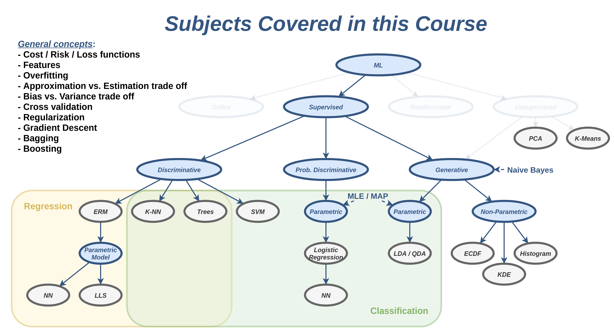

---
---

## לו"ז

### שבוע 0 - רקע מתימטי

- ✍️ תרגיל בית 0 -  (לא להגשה) - הכירות עם Python ו Colab
- [תרגול 0](/tutorial00/) - בעיות אופטימיזציה וגזירה וקטורית

### שבוע 1

- [הרצאה 1](/lecture01/slides/) - מבוא
- [תרגול 1](/tutorial01/) - רקע מתמטי: חזרה על הסתברות וחיזוי

### שבוע 2 - מבוא ל supervised learning

- [הרצאה 2](/lecture02/) - מושגים, שימוש במדגם, גישה דיסקרימינטיבית, מודלים פרמטרים, מאפיינים
- [תרגול 2](/tutorial02/) - LLS ומאפיינים

### שבוע 3 - הכללה ו overfitting

- [הרצאה 3](/lecture03/) - test set, בעיית הoverfitting, פירוק בעיית ההכללה, hyper-parameters, שימוש ב cross-validation, רגולריצזיה.
- [תרגול 3](/tutorial03/) - bias-variance decomposition, רגולריזציה, k-fold cross validation.

### שבוע 4 - סיווג דיסקרימינטיבי

- [הרצאה 4](/lecture04/) - בעיות סיווג, K-NN ועצי החלטה
- [תרגול 4](/tutorial04/) - K-NN ועצי החלטה.

### שבוע 5 - Bagging ו Boosting

- [הרצאה 5](/lecture05/) - Bagging and Boosting
- [תרגול 5](/tutorial05/) - Bagging and Boosting

### שבוע 6 - SVM

- [הרצאה 6](/lecture06/) - SVM ושיטות גרעין
- [תרגול 6](/tutorial06/) - SVM ושיטות גרעין

### שבוע 7 - שיערוך א-פרמטרי

- [הרצאה 7](/lecture07/) - שיערוך פילוג דיסקרטי, ECDF, היסטוגרמה, KDE ותוחלת מותנית.
- [תרגול 7](/tutorial07/) -  שיערוך פילוג דיסקרטי, ECDF, היסטוגרמה ושיעורך פילוג מעורב

### שבוע 8 - שיערוך פרמטרי וסיווג גנרטיבי

- [הרצאה 8](/lecture08/) - MLE, MAP, Naive Bayes, LDA, QDA
- [תרגול 8](/tutorial08/) - MLE, MAP ו LDA

### שבוע 9 - שיטות דיסקרימינטביות הסתברותיות

- [הרצאה 9](/lecture09/) - שיטות דיסקרימינטביות הסתברותיות, logistic regression
- [תרגול 9](/tutorial09/) - Logistic Regression 7 Gradient Descent

### שבוע 10 - רשתות נוירונים

- [הרצאה 10](/lecture10/) - רשתות נוירונים, MLP ו Back-propogation
- [תרגול 10](/tutorial10/) - רשתות נוירונים, MLP ו Back-propogation

### שבוע 11  - שיטות ברשתות נוירונים

- [הרצאה 11](/lecture11/) - שיטות ברשתות נוירונים
- [תרגול 11](/tutorial11/) - CNN ואיתחולים

### שבוע 12 - שיטות ב unsupervised learning

- [הרצאה 12](/lecture12/) - PCA ו K-means
- [תרגול 12](/tutorial12/) - PCA ו K-means

### שבוע 13

- [הרצאה 13](/lecture13/slides/) - סיכום

