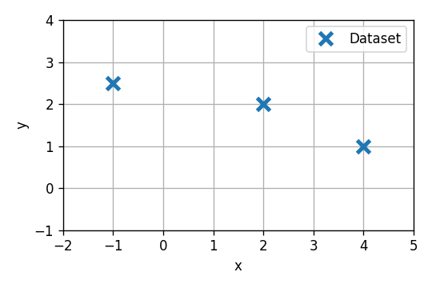
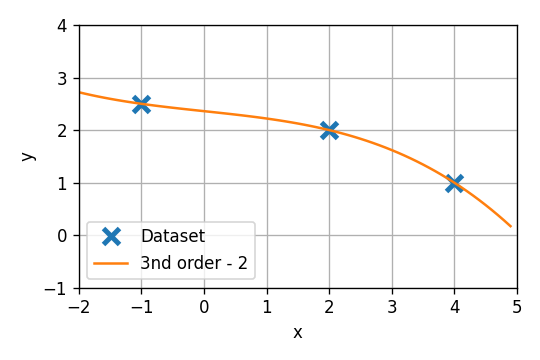
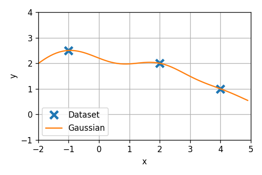
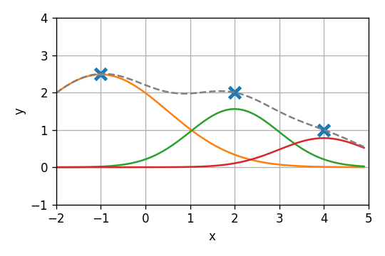
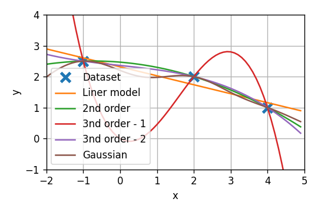
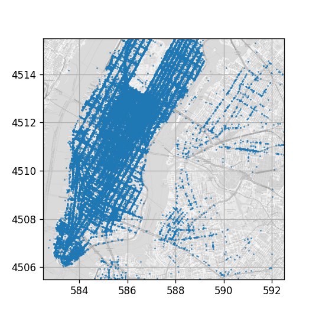
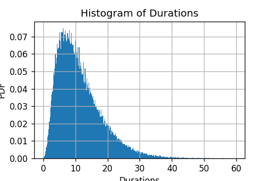
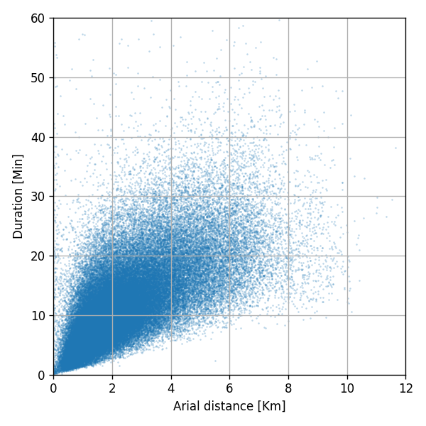

# תרגול 3 - רגרסיה לינארית

<a href="/assets/tutorial03.pdf" class="link-button" target="_blank">PDF</a>
<a href="./code/" class="link-button" target="_blank">Code</a>

## תקציר התיאוריה

### למידה מונחית

#### הגדרה

- נתונים שני משתנים אקראיים $\text{x}$ ו $\text{y}$ בעלי פילוג לא ידוע.
- נתון לנו **מדגם** של זוגות של $\text{x}$ ו $\text{y}$ אשר יוצרו מ $N$ דגימות בלתי תלויות:

$$
\mathcal{D}=\{x_i, y_i\}_{i=1}^N
$$

- נסמן ב $\hat{y}=h(x)$ חזאיים אפשריים של $\text{y}$ בהינתן $\text{x}$.
- נתונה לנו **פונקציית מחיר** $C(h)$ אשר מחשבת מחיר לכל חזאי. ($C$ יכול להיות תלוי בפילוג).
- נרצה למצוא את החזאי $h^*$ עם המחיר כמה הנמוך ביותר.

##### הערות

- את המשתנים $\text{y}$ מקובל לכנות **labels** (תגיות).
- גם $\text{x}$ וגם $\text{y}$ יכולים להיות וקטורים או סקלרים. המקרה הנפוץ הינו ש $\mathbf{x}$ הוא וקטור ו $\text{y}$ סקלר.

#### רישום כבעיית אופטימיזציה

את הבעיה של מציאת החזאי האופטימאלי ניתן לרשום כ:

$$
h^* = \underset{h}{\arg\min} C(h)
$$

**בעיה**: לרוב, פונקציית המחיר $C$ תהיה תלויה בפילוג הלא ידוע. לשם כך נאלץ להשתמש במדגם כתחליף לפילוג הלא ידוע. במהלך הקורס נכיר כמה שיטות לעשות זאת.

#### אבחנה בין שני מקרים

מקובל לחלק את הבעיות בלימידה מונחית לשני קטגוריות:

**בעיות רגרסיה** - המקרה בו $\text{y}$ הוא משתנה רציף.

**בעיות סיווג** - המקרה בו $\text{y}$ הוא משתנה בדיד המקבל סט סופי של ערכים.

(בעיקרון יכולים להיות גם בעיות בהם $\text{y}$ בדיד ולא סופי. בבעיות מסוג זה לרוב פשוט מניחים ש$\text{y}$ רציף והופכים את הבעיה לבעיית רגרסיה)

### פונקציות הפסד וסיכון

דרך נפוצה להגיד את פונקציית המחיר היא כתוחלת על פונקציית הפסד באופן הבא:

- נגדיר פונקציה $l$ אשר מחשבת לחיזוי בודד גודל המכונה **loss** (הפסד). 
  זאת אומרת שבעבור דגימה בודדת, עם ערכי $\boldsymbol{x}$ ו $y$ כל שהם, ועם תוצאת חיזוי $\hat{y}=h(\boldsymbol{x})$. ההפסד מוגדרת להיות:

  $$
  l(\hat{y},y)=l(h(x),y)
  $$

- בעזרת פונקציית הloss ניתן להגדיר את פונקציית המחיר כתוחלת של ההפסד על פני הפילוג של $\mathbf{x}$ ו $\text{y}$:

  $$
  C(h)=\mathbb{E}\left[l(h(\mathbf{x}),\text{y})\right]
  $$

במקרים כאלה, מוקבל לכנות את פונקציית המחיר, פונקציית ה**risk** (סיכון), ולסמנה באות $R$:

$$
  R(h)=\mathbb{E}\left[l(h(\mathbf{x}),\text{y})\right]
$$

### Empirical risk minimization (ERM)

אחת הדרכים הנפוצות לנסות ולהתמודד עם חוסר הידיעה של הפילוג, היא להחליף את התוחלת על הפילוג הלא ידוע, בתוחלת אמפירית על המדגם. התוחלת האימפרית מוגדרת כממוצע על פני אוסף של דגימות (במקרה שלנו על המדגם). 
נסמן את התוחלת האימפירית על פני מדגם $\mathcal{D}$ ב $\hat{\mathbb{E}}_{\mathcal{D}}$, ואת הrisk האמפירי ב $\hat{R}_{\mathcal{D}}$:

$$
\hat{R}_{\mathcal{D}}(h)
=\hat{\mathbb{E}}_{\mathcal{D}}\left[l(h(\mathbf{x}),\text{y})\right]
=\frac{1}{N}\sum_{i=0}^Nl(h(\boldsymbol{x}_i),y_i)
$$

בעיית האופטימיזציה תהיה במקרה זה:

$$
h^*_{\mathcal{D}} = \underset{h}{\arg\min} \frac{1}{N}\sum_{i=0}^Nl(h(\boldsymbol{x}_i),y_i)
$$

שיטה זו מוכנה empirical risk minimization (ERM).

**שימוש לב**: מיכוון שהתוחלת האמפירית היא רק קירוב של התוחלת האמיתית, הפתרון של בעיית ה ERM גם יהיה רק קירוב של הפתרון של הבעיה המקורית. זאת אומרת שבמקרה הכללי $h^*_{\mathcal{D}}\neq h^*$.

### מודלים פרמטריים

לרוב אנו נגביל את החיפוש של החזאי למשפחה מצומצמת של חזאים בעלי צורה קבועה עד כדי מספר סופי של פרמטרים. את הפרמטרים של המודל נסמן בעזרת הוקטור $\boldsymbol{\theta}$. אנו נשתמש ב $h(x;\boldsymbol{\theta})$ לתיאור של חזאי מהמשפחה עם פרמטרים $\boldsymbol{\theta}$.

דוגמא למשפחה פרמטרית:

$$
h(x;\boldsymbol{\theta})=\theta_1\cos(\theta_2 x)e^{-\theta_3 x}
$$

כאשר עובדים עם מודל פרמטרי, האופטימיזציה היא למעשה על על הפרמטרים, והבעיה הופכת להיות:

$$
\boldsymbol{\theta}^*_{\mathcal{D}}=\underset{\boldsymbol{\theta}}{\arg\min} \frac{1}{N}\sum_{i=0}^Nl(h(\boldsymbol{x}_i;\boldsymbol{\theta}),y_i)
$$

#### מאפיינים

בהינתן מודל פרמטרי כל שהוא, ניתן בקלות לייצר מודלים פרמטרים חדשים על ידי ביצוע עיבוד מקדים כל שהוא ל $\boldsymbol{x}$ לפני שהוא מוזן למודל. את העיבוד המקדים ניתן לתאר כאוסף של פונקציות $\phi_k$ אשר פועלות על $\boldsymbol{x}$. את המידע המעובד (המוצא של ה $\phi$-ים) מקובל לכנות מאפיינים. כמו כן, לרוב נוח לאגד את כל הפונקציות $\phi$ לפונקציה אחת $\Phi$ אשר פועלת על $\boldsymbol{x}$ ומחזירה את וקטור המאפיינים:

$$
\Phi(\boldsymbol{x})=
[\phi_1(\boldsymbol{x}),\phi_2(\boldsymbol{x}),\cdot,\phi_M(\boldsymbol{x})]^{\top}
$$

המודל הפרמטרי החדש יהיה הרכבה של $h$ ו $\Phi$:

$$
h_{\text{new}}(\boldsymbol{x};\boldsymbol{\theta})
=h(\Phi(\boldsymbol{x});\boldsymbol{\theta})
$$

דרך אחרת להסתכל על המאפיינים הינה שאנו כביכול מחליפים את המדגם שקיבלנו במדגם חדש באופן הבא:

$$
\boldsymbol{x}_{\text{new}}=\Phi(\boldsymbol{x}_{\text{old}})
$$

### רגרסיה לינארית

רגרסיה לינארית עוסקת בבעיות רגרסיה שבהם המודל הינו **לינארי בפרמטרים שלו**. זאת אומרת, בעיות בהם המודל הינו מהצורה של:

$$
h(\boldsymbol{x};\boldsymbol{\theta})=\theta_1 x_1+\theta_2 x_2+\dots+\theta_d x_d
=\boldsymbol{x}^{\top}\boldsymbol{\theta}
$$

כפי שציינו קודם, וכפי שנראה בתרגיל, תמיד ניתן להשתמש במאפיינים על מנת לקבל פונקציות מורכבות יותר:

$$
h(\boldsymbol{x};\boldsymbol{\theta})=\theta_1 \phi_1(\boldsymbol{x})+\theta_2 \phi_2(\boldsymbol{x})+\dots+\theta_M \phi_M(\boldsymbol{x})
=\Phi(\boldsymbol{x})^{\top}\boldsymbol{\theta}
$$

#### Linear least squares (LLS)

מקרה מיוחד הוא המקרה שבו משתמשים במודל לינארי יחד עם risk עם loss ריבועי:

$$
l(\hat{y},y)=(\hat{y}-y)^2
$$

במקרה זה, מתקבל בעיית אופטימיזציה אשר ניתנת לפיתור באופן אנליטי:

$$
\boldsymbol{\theta}^*_{\mathcal{D}}
=\underset{\boldsymbol{\theta}}{\arg\min} \frac{1}{N}\sum_{i=0}^N(h(\boldsymbol{x}_i;\boldsymbol{\theta})-y_i)^2
=\underset{\boldsymbol{\theta}}{\arg\min} \frac{1}{N}\sum_{i=0}^N(\boldsymbol{x}_i^{\top}\boldsymbol{\theta}-y_i)^2
$$

##### כתיב מטריצי

בכדי לפתור את הבעיה, נוח יותר לרשום אותה לרשום בכתיב מטריצי.

- נדגיר את הוקטור $\boldsymbol{y}$ כוקטור של כל התגיות במדגם:

  $$
  \boldsymbol{y}=[y_1,y_2,\cdot,y_n]^{\top}
  $$

- נגדיר את המטריציה $X$ כמטריצה של כל ה$\boldsymbol{x}$-ים במדגם:

  $$
  X=\begin{bmatrix}
  - & \boldsymbol{x}_1 & - \\
  - & \boldsymbol{x}_2 & - \\
  & \vdots & \\
  - & \boldsymbol{x}_N & -
  \end{bmatrix}
  $$

בעזרת הגדרות אלו ניתן לרשום את בעיית האופטימיזציה של LLS באופן הבא:

$$
\boldsymbol{\theta}^*_{\mathcal{D}}
=\underset{\boldsymbol{\theta}}{\arg\min} \frac{1}{N}\lVert X\boldsymbol{\theta}-\boldsymbol{y}\rVert_2^2
$$

##### הפתרון של LLS

את בעית האופטימיזציה הזו ניתן לפתור על ידי גזירה והשוואה ל-0, כפי שנעשה בתרגיל הראשון. הפתרון המתקבל הינו:

$$
\boldsymbol{\theta}^*_{\mathcal{D}}=(X^{\top}X)^{-1}X^{\top}\boldsymbol{y}
$$

הפתרון הזה נכון כאשר $X^{\top}X$ הפיכה. תנאי הכרחי בכדי שזה יקרה הינו שמספר הדגימות $N$ יהיה גדול מהמימד של $\boldsymbol{x}$ (אשר נסמן כ $D$). כאשר המטריצה לא יש לבעיה יותר מפתרון יחיד, כפי שנראה בהמשך.

(המטריצה $(X^{\top}X)^{-1}X^{\top}$ נקראת Moore-Penrose pseudo inverse)

##### הערה

כשאר משתמשים במאפיינים המטריצה $X$ תהיה:

$$
X=\begin{bmatrix}
- & \Phi(\boldsymbol{x}_1) & - \\
- & \Phi(\boldsymbol{x}_2) & - \\
& \vdots & \\
- & \Phi(\boldsymbol{x}_N) & -
\end{bmatrix}
$$

## תרגיל 3.1

הראו כי כאשר $X^{\top}X$ הפיך, הפתרון של בעיית האופטימיזציה של LLS:

$$
\boldsymbol{\theta}^*_{\mathcal{D}}
=\underset{\boldsymbol{\theta}}{\arg\min} \frac{1}{N}\lVert X\boldsymbol{\theta}-\boldsymbol{y}\rVert_2^2
$$

נתון על ידי:

$$
\boldsymbol{\theta}^*_{\mathcal{D}}=(X^{\top}X)^{-1}X^{\top}\boldsymbol{y}
$$

### פתרון 3.1

נפתור על ידי גזירה והשוואה ל0:

$$
\begin{aligned}
\nabla_{\boldsymbol{\theta}}\left(\frac{1}{N}\lVert X\boldsymbol{\theta}-\boldsymbol{y}\rVert_2^2\right)&=0\\
\Leftrightarrow\nabla_{\boldsymbol{\theta}}\left((X\boldsymbol{\theta}-\boldsymbol{y})^{\top}(X\boldsymbol{\theta}-\boldsymbol{y})\right)&=0\\
\Leftrightarrow\nabla_{\boldsymbol{\theta}}(\boldsymbol{\theta}^{\top}X^{\top}X\boldsymbol{\theta}
                                -2\boldsymbol{y}^{\top}X\boldsymbol{\theta}+\lVert\boldsymbol{y}\rVert_2^2)&=0\\
\end{aligned}
$$

בכדי לחשב את הנגזרות נשתמש בשני הנזגרות המוכרות הבאות:

$$
\nabla_{\boldsymbol{x}}(\boldsymbol{a}^{\top}\boldsymbol{x})=\boldsymbol{a},
\qquad
\nabla_{\boldsymbol{x}}(\boldsymbol{x}^{\top}A\boldsymbol{x})=2A\boldsymbol{x}
$$

על ידי שימוש בנגזרות אלו נקבל

$$
\begin{aligned}
\Leftrightarrow\nabla_{\boldsymbol{\theta}}(\boldsymbol{\theta}^{\top}X^{\top}X\boldsymbol{\theta}
                                -2\boldsymbol{y}^{\top}X\boldsymbol{\theta}+\lVert\boldsymbol{y}\rVert_2^2)&=0\\
\Leftrightarrow2X^{\top}X\boldsymbol{\theta}
-2X^{\top}\boldsymbol{y}&=0\\
\Leftrightarrow X^{\top}X\boldsymbol{\theta}&=X^{\top}\boldsymbol{y}
\end{aligned}
$$

זוהי בעיה של פתרון מערכת משוואות לינארית מהצורה של $A\boldsymbol{x}=b$ כאשר:

$$
A=X^{\top}X,\qquad b=X^{\top}\boldsymbol{y}
$$

כאשר המטריצה $X^{\top}X$ הפיכה, הפתרון של בעיה זו נתון על ידי:

$$
\boldsymbol{\theta}=(X^{\top}X)^{-1}X^{\top}\boldsymbol{y}
$$

כאשר היא אינה הפיכה ישנם מספר פתרונות (למעשה קיים מרחב לינארי של פתרונות אשר פותרים את הבעיה).

## תרגיל 3.2

נתונה לנו בעיית LLS עם המדגם הבא:

$$
\mathcal{D}=\{\{x_1=-1,y_1=2.5\},\{x_2=2,y_2=2\},\{x_3=4,y_3=1\}\}
$$

להבא בקורס, נשמיט את הרישום של $x$ ו $y$ בהגדרת המדגם ונרשום אותו בקצרה באופן הבא:

$$
\mathcal{D}=\{\{-1,2.5\},\{2,2\},\{4,1\}\}
$$

**1)** נרצה כעת להשתמש במאפיינים בכדי לקבל מודל שהוא פונקציה לינארית (עם איבר היסט) ב$x$. רשמו את המאפיינים המתאימים ואת המודל המתקבל. מצאו את הפרמטרים של המודל האופטימאלי?

**2)** נרצה כעת להשתמש במאפיינים בכדי לקבל מודל שהוא פולינום מסדר 2 ב$x$. רשמו את המאפיינים ואת המודל המתקבל ומצאו את הפרמטרים של המודל האופטימאלי?

**3)** נרצה כעת להשתמש במאפיינים בכדי לקבל מודל שהוא פולינום מסדר 3 ב$x$. האם במקרה זה קיים פתרון יחיד? 
מצאו את הפרונות למקרה שבו $\theta_1=0$ (איבר ההיסט מתאפס) ולמקרה שבו $\theta_3=0$ (המקדם של $x^2$ מתאפס)

**4)** נרצה כעת להשתמש בפונקציות המאפיינים הבאות:

$$
\phi_m(x)=\exp\left(-\frac{(x-\mu_m)^2}{2\sigma_m^2}\right)\qquad m\in1,2,3
$$

כאשר

$$
\sigma_1=1.5,\sigma_2=\sigma_3=1\qquad \mu_1=-1,\mu_2=2,\mu_3=4
$$

חשבו את הפרמטרים של המודל האופטימאלי בעבור מאפיינים אלו.

**5)** בעבור כל אחד מהסעיפים חשבו את הסיכון האמפירי המתקבל. האם לדעתכם סיכון אמפירי קטן יותר בהכרח מעיד על סיכון (לא אימפירי) קטן יותר?

### פתרון 3.2

#### 1)

אנו מעוניינים במודל מהצורה:

$$
h(x;\boldsymbol{\theta})=\theta_1+\theta_2 x
$$

במודל הלינארי שרמשנו קודם היה חסר איבר ההיסט ($\theta_1$). על ידי שימוש במאפיינים נוכל להוסיף את האיבר הזה למודל אם נבחר להשתמש במאפיינים הבאים:

$$
\phi_1(x)=1,\quad\phi_2(x)=x
$$

או בכתיב וקטורי

$$
\Phi(x)=[1,x]^{\top}
$$

פעולה זו למעשה פשוט מוסיפה את האיבר 1 ל$x$ וכביכול יוצר את המדגם הבא:

$$
\mathcal{D}=\{\{[1,-1]^{\top},2.5\},\{[1,2]^{\top},2\},\{[1,4]^{\top},1\}\}
$$

**הערה**: אנו נראה שבמקרים רבים מקובל לרשום מודלים פרמטריים ללא איבר היסט מתוך ההנחה שתמיד ניתן להוסיף איבר כזה על ידי שימוש במאפיינים.

נרשום את $X$ ו $\boldsymbol{y}$:

$$
X=\begin{bmatrix}1&-1\\1&2\\1&4\end{bmatrix}
\qquad
\boldsymbol{y}=\begin{bmatrix}2.5\\2\\1\end{bmatrix}
$$

הפרמטרים האופטימאליים של המודל אשר ממזערים את הסיכון האמפירי יהיו אם כן:

$$
\begin{aligned}
\boldsymbol{\theta}^*_{\mathcal{D}}
&=(X^{\top}X)^{-1}X\boldsymbol{y}\\
&=\left(\begin{bmatrix}1&1&1\\-1&2&4\end{bmatrix}
        \begin{bmatrix}1&-1\\1&2\\1&4\end{bmatrix}\right)^{-1}
   \begin{bmatrix}1&1&1\\-1&2&4\end{bmatrix}
   \begin{bmatrix}2.5\\2\\1\end{bmatrix}\\
&=\left(\begin{bmatrix}3&5\\5&21\end{bmatrix}\right)^{-1}
   \begin{bmatrix}4.5\\5.5\end{bmatrix}
=\frac{1}{38}\begin{bmatrix}21&-5\\-5&3\end{bmatrix}
   \begin{bmatrix}4.5\\5.5\end{bmatrix}\\
&=\frac{1}{38}\begin{bmatrix}88\\-11\end{bmatrix}
=\begin{bmatrix}2.3158\\-0.2895\end{bmatrix}
\end{aligned}
$$

מכאן שהמודל שלנו הינו:

$$
h(x)=2.3158-0.2895 x
$$

#### 2)

בדומה לסעיף הקודם נבחר את פונקציות המאפיינים הבאות:

$$
\Phi(x)=[1,x,x^2]^{\top}
$$

על מנת לקבל את המודל הבא:

$$
h(x;\boldsymbol{\theta})=\theta_1+\theta_2 x+\theta_3 x^2
$$

לאחר הפעלת פונקציות המאפיינים נקבל את המדגם הבא:

$$
\mathcal{D}=\{\{[1,-1,1]^{\top},5\},\{[1,2,4]^{\top},2\},\{[1,4,16]^{\top},1\}\}
$$

הוקטור $\boldsymbol{y}$ אינו מושפע מבחירת המאפיינים, אך המטריצה $X$ תהיה כעת:

$$
X=\begin{bmatrix}1&-1&1\\1&2&4\\1&4&16\end{bmatrix}
$$

וקטור הפרמטרים המתקבל הינו: (את זה כבר עדיף לחשב במחשב)

$$
\boldsymbol{\theta}^*_{\mathcal{D}}
=(X^{\top}X)^{-1}X\boldsymbol{y}
=\frac{1}{30}[74,-3,-2]^{\top}
=[2.467,-0.1,-0.067]^{\top}
$$

#### 3)

נבחר את פונקציות המאפיינים הבאות:

$$
\Phi(x)=[1,x,x^2,x^3]^{\top}
$$

המטריצה $X$ תהיה כעת:

$$
X=\begin{bmatrix}1&-1&1&-1\\1&2&4&8\\1&4&16&64\end{bmatrix}
$$

כיוון שלמטריצה $X$ יש יותר עמודות משורות (יש יותר פרמטרים מדגימות) המטריצה $X^{\top}X$ בהכרח לא תהיה הפיכה. ולכן כפי שציינו קודם יהיו לבעיה הרבה פתרונות. (ניתן להראות כי המטריציה לא הפיכה לפי העובדה שלא יכולים להיות ב $X^{\top}X$ יותר מ3 שורות בלתי תלויות ולכן המימד שלה הוא לכל היותר 3)

נסתכל על שני המקרים הפרטיים $\theta_1=0$ ו $\theta_3=0$.

##### $\theta_1=0$

במקרה זה המודל הפרמטרי מתנוון ל:

$$
h(x;\boldsymbol{\theta})=\theta_2 x+\theta_3 x^2+\theta_4 x^3
$$

אנו למעשה יכולים לפתור את זה כבעיית LLS עם וקטור פרמטריים $\boldsymbol{\theta}=[\theta_2,\theta_3,\theta_4]^{\top}$ ומאפיינים:

$$
\Phi(x)=[x,x^2,x^3]^{\top}
$$

המטריצה $X$ תהיה:

$$
X=\begin{bmatrix}-1&1&-1\\2&4&8\\4&16&64\end{bmatrix}
$$

והפתרון שיתקבל יהיה:

$$
\boldsymbol{\theta}^*_{\mathcal{D}}
=(X^{\top}X)^{-1}X\boldsymbol{y}
=\frac{1}{120}[-86,177,37]^{\top}
=[-0.7167,1.475,-0.3083]^{\top}
$$

##### $\theta_3=0$

במקרה השני, המודל הפרמטרי מתנוון ל:

$$
h(x;\boldsymbol{\theta})=\theta_1 + \theta_2 x+\theta_4 x^3
$$

המטריצה $X$ תהיה:

$$
X=\begin{bmatrix}1&-1&-1\\1&2&8\\1&4&64\end{bmatrix}
$$

והפתרון שיתקבל יהיה:

$$
\boldsymbol{\theta}^*_{\mathcal{D}}
=(X^{\top}X)^{-1}X\boldsymbol{y}
=\frac{1}{150}[354,-19,-2]^{\top}
=[2.36,-0.1267,-0.0133]^{\top}
$$

#### 4)

העובדה שהמאפיינים הם לא חזקות של $x$ לא משנה דבר. נפתור את הבעיה באופן דומה לסעיפים הקודמים:

בעבור המאפיינים:

$$
\phi_1(x)=\exp\left(-\frac{(x+1)^2}{2\cdot1.5^2}\right)
\quad,
\phi_2(x)=\exp\left(-\frac{(x-2)^2}{2}\right)
\quad,
\phi_3(x)=\exp\left(-\frac{(x-4)^2}{2}\right)
$$

המטריצה $X$ תהיה:

$$
X=\begin{bmatrix}1&0.0111&1\\0.1353&1&0.1353\\0.0039&0.1353&1\end{bmatrix}
$$

והפתרון שיתקבל יהיה:

$$
\boldsymbol{\theta}^*_{\mathcal{D}}
=(X^{\top}X)^{-1}X\boldsymbol{y}
=[2.4827,1.5585,0.7794]^{\top}
$$

המודל הלינארי הוא פשוט קומבינציה לינרארית של פונקציות של $\mathbf{x}$. לשם המחשה נראה כיצד התוצאה שהתקבלה היא למעשה קומבינציה לינארית של שלושת הגאוסיאנים של המאפיינים:

#### 5)

נציג על גרף אחד את כל התוצאות שהתקבלו עד כה:

מלבד במקרה הלינארי, קיבלנו בכל המודלים שגיאה אמפירית 0.

**הסבר**: אנו למעשה מנסים למצוא וקטור פרמטרים כך ש $X\boldsymbol{\theta}$ יהיה כמה שיותר קרוב ל$\boldsymbol{y}$. כאשר יש יותר פרמטרים מדגימות ניתן תמיד (עד כדי מקרים שבהם יש תלויות לינאריות בין המאפיינים או הדגימות) למצוא וקטור $\boldsymbol{\theta}$ כך שלבעיה הלינארית $X\boldsymbol{\theta}=\boldsymbol{y}$ יהיה פתרון (מצב של יותר נעלמים ממשואות).

לגבי סיכון האמיתי, ללא מידע נוסף על הבעיה לא ניתן לדעת איזה מודל יכליל בצורה טובה יותר (יעבוד טוב יותר על דוגמאות לא מדגם), וכמובן שאין כל הכרח שמודלים עם שגיאה האמפירית הקטנה יותר יכלילו טוב יותר.

##### ניחושים

אנחנו כן נוכל לנסות להשתמש בניסיון שלנו מתכונות כלליות של מודלים בעולם האמיתי על מנת לשער איזה מודל יכליל טוב יותר. לדוגמא, הינו מצפים שהמודל לא "ישתולל", זאת אומרת שערכים קרובים של $x$ יתנו ערכים יחסית דומים של $y$. מה שלא קורה במודל השני מסעיף 3 (הגרף האדום). ניתן לדוגמא לשער שהמודל הלינארי, שלא מניב שגיאה אמפירית של 0, יכליל בצורה טובה יותר מהמודל האדום.

בתרגול וההרצאה הקרובים, ננסה להשתמש בכלי בשם רגולריזציה בכדי לתרגם את הדרישה שהמודל לא "ישתולל" לדרישה מתמטית על מודל.

## תרגיל 3.3

בעבור וקטור אקראי $\mathbf{x}$ באורך 2, $\mathbf{x}=(\text{x}_1,\text{x}_2)^{\top}$ (או בכתיב מטימתי $\mathbf{x}\in\mathbb{R}^2$), מהם המאפיינים בהם יש להשתמש על מנת לקבל פולינום מסדר 2 בערכים של $\mathbf{x}$

### פתרון 3.3

אנו מעוניינים במודל מהצורה:

$$
h(\boldsymbol{x};\boldsymbol{\theta})=\theta_1
                                       +\theta_2 x_1
                                       +\theta_3 x_2
                                       +\theta_4 x_1x_2
                                       +\theta_5 x_1^2
                                       +\theta_6 x_2^2
$$

נוכל לייצר זאת על ידי בחירה של המאפיינים הבאים:

$$
\Phi(\boldsymbol{x})=[1,x_1,x_2,x_1x_2,x_1^2,x_2^2]^{\top}
$$

## תרגיל 3.4

נסתכל כעת על בעיית רגרסיה של מודל לינארי כללי $h(\boldsymbol{x};\boldsymbol{\theta})=\boldsymbol{x}^{\top}\boldsymbol{\theta}$ ופנקציית סיכון עם הפסד של $l_3$:

$$
l(\hat{y},y)=|\hat{y}-y|^3
$$

**1)** רשמו את בעיית האופטימיזציה של ERM.

**2)** האם ניתן לפתור בעיה זו בעזרת גזירה והשוואה ל0?

**3)** בעבור פתרון בעזרת gradient descent, רשמו את כלל העדכון של אלגוריתם (עם צעד גרדיאנט $\eta$).

### פתרון 3.4

#### 1)

בעיית האופטימיזציה שיש לפתור הינה:

$$
\begin{aligned}
\boldsymbol{\theta}^*_{\mathcal{D}}
&=\underset{\boldsymbol{\theta}}{\arg\min} \hat{R}_{\mathcal{D}}(h(\cdot;\boldsymbol{\theta}))\\
&=\underset{\boldsymbol{\theta}}{\arg\min} \frac{1}{N}\sum_{i=0}^N l(h(\boldsymbol{x}_i;\boldsymbol{\theta}),y_i)\\
&=\underset{\boldsymbol{\theta}}{\arg\min} \frac{1}{N}\sum_{i=0}^N|\boldsymbol{x}_i^{\top}\boldsymbol{\theta}-y_i|^3
\end{aligned}
$$

#### 2)

נחשב את הנגזרת של פונקציית הסיכון האמפירי:

$$
\begin{aligned}
\nabla_{\boldsymbol{\theta}}\hat{R}_{\mathcal{D}}(h(\cdot;\boldsymbol{\theta}))
&=\nabla_{\boldsymbol{\theta}}\left(\frac{1}{N}\sum_{i=0}^N|\boldsymbol{x}_i^{\top}\boldsymbol{\theta}-y_i|^3\right)\\
&=\frac{1}{N}\sum_{i=0}^N\nabla_{\boldsymbol{\theta}}|\boldsymbol{x}_i^{\top}\boldsymbol{\theta}-y_i|^3\\
&=\frac{1}{N}\sum_{i=0}^N\nabla_{\boldsymbol{\theta}}\left(
    (\boldsymbol{x}_i^{\top}\boldsymbol{\theta}-y_i)^3\text{sign}(\boldsymbol{x}_i^{\top}\boldsymbol{\theta}-y_i)
    \right)\\
&=\frac{1}{N}\sum_{i=0}^N 3\boldsymbol{x}
    (\boldsymbol{x}_i^{\top}\boldsymbol{\theta}-y_i)^2\text{sign}(\boldsymbol{x}_i^{\top}\boldsymbol{\theta}-y_i)\\
\end{aligned}
$$

כנראה שלא ניתן להשוות ביטוי זה ל-0 ולפתור אותו באופן אנליטי.

#### 3)

תזכורת, אלגוריתם הגרדיאט מנסה למצוא מינימום לוקאלי על ידי התקדמות בכיוון ההפוך מהגרדיאנט של פונקציית המטרה (שאותה רוצים למזער). הוא עושה זאת בעזרת סדרה של צעדים באופן הבא:

$$
\boldsymbol{\theta}^{(t+1)}=\boldsymbol{\theta}^{(t)}-\eta \nabla_{\boldsymbol{\theta}}f(\boldsymbol{\theta}^{(t)})
$$

(הפרמטר $\eta$ משפיע על גודל הצעד)

במקרה שלנו צעד העדכון של האלגוריתם יהיה:

$$
\begin{aligned}
\boldsymbol{\theta}^{(t+1)}
&=\boldsymbol{\theta}^{(t)}-\eta \nabla_{\boldsymbol{\theta}}\hat{R}(h(\cdot;\boldsymbol{\theta}^{(t)}))\\
&=\boldsymbol{\theta}^{(t)}-\eta \frac{1}{N}\sum_{i=0}^N 3\boldsymbol{x}
    (\boldsymbol{x}_i^{\top}\boldsymbol{\theta}^{(t)}-y_i)^2\text{sign}(\boldsymbol{x}_i^{\top}\boldsymbol{\theta}^{(t)}-y_i)\\
\end{aligned}
$$

## דוגמא מעשית - חיזוי זמן נסיעה של מוניות בניו יורק

<a href="./example/" class="link-button" target="_blank">Code</a>

### מדגם נסיעות המונית בעיר New York

כחלק מהמאמץ של העיר New York להנגיש לציבור את המידע אותו היא אוספת, עריית NYC מפרסמת בכל חודש את הפרטים של כל נסיעות המונית אשר בוצעו בעיר באותו חודש. בקורס זה, אנו נעשה שימוש ברשימת הנסיעות מחודש ינואר 2016. ניתן למצוא את הרשימה, [פה](https://www1.nyc.gov/site/tlc/about/tlc-trip-record-data.page).

הרשימה המלאה כוללת מעל 10 מליון נסיעות, בכדי לקצר את זמן החישוב, אנו נעשה שימוש רק ברשימה חלקית הכוללת רק 100 אלף נסיעות (אשר נבחרו באקראי אחרי ניקוי מסויים של הרשימה). את הרשימה החלקית ניתן למצוא [פה](/datasets/nyc_taxi_rides.csv)

### המדגם ושדותיו

בטבלה מלטה מוצגים עשרת שורות הראשונות ברשימה

<table border="1" style="text-align:center;">
  <thead>
    <tr>
      <th></th>
      <th>passenger
          count</th>
      <th>trip
          distance</th>
      <th>payment
          type</th>
      <th>fare
          amount</th>
      <th>tip
          amount</th>
      <th>pickup
          easting</th>
      <th>pickup
          northing</th>
      <th>dropoff
          easting</th>
      <th>dropoff
          northing</th>
      <th>duration</th>
      <th>day
          of
          week</th>
      <th>day
          of
          month</th>
      <th>time
          of
          day</th>
    </tr>
  </thead>
  <tbody>
    <tr>
      <th>0</th>
      <td>2</td>
      <td>2.768065</td>
      <td>2</td>
      <td>9.5</td>
      <td>0.00</td>
      <td>586.996941</td>
      <td>4512.979705</td>
      <td>588.155118</td>
      <td>4515.180889</td>
      <td>11.516667</td>
      <td>3</td>
      <td>13</td>
      <td>12.801944</td>
    </tr>
    <tr>
      <th>1</th>
      <td>1</td>
      <td>3.218680</td>
      <td>2</td>
      <td>10.0</td>
      <td>0.00</td>
      <td>587.151523</td>
      <td>4512.923924</td>
      <td>584.850489</td>
      <td>4512.632082</td>
      <td>12.666667</td>
      <td>6</td>
      <td>16</td>
      <td>20.961389</td>
    </tr>
    <tr>
      <th>2</th>
      <td>1</td>
      <td>2.574944</td>
      <td>1</td>
      <td>7.0</td>
      <td>2.49</td>
      <td>587.005357</td>
      <td>4513.359700</td>
      <td>585.434188</td>
      <td>4513.174964</td>
      <td>5.516667</td>
      <td>0</td>
      <td>31</td>
      <td>20.412778</td>
    </tr>
    <tr>
      <th>3</th>
      <td>1</td>
      <td>0.965604</td>
      <td>1</td>
      <td>7.5</td>
      <td>1.65</td>
      <td>586.648975</td>
      <td>4511.729212</td>
      <td>586.671530</td>
      <td>4512.554065</td>
      <td>9.883333</td>
      <td>1</td>
      <td>25</td>
      <td>13.031389</td>
    </tr>
    <tr>
      <th>4</th>
      <td>1</td>
      <td>2.462290</td>
      <td>1</td>
      <td>7.5</td>
      <td>1.66</td>
      <td>586.967178</td>
      <td>4511.894301</td>
      <td>585.262474</td>
      <td>4511.755477</td>
      <td>8.683333</td>
      <td>2</td>
      <td>5</td>
      <td>7.703333</td>
    </tr>
    <tr>
      <th>5</th>
      <td>5</td>
      <td>1.561060</td>
      <td>1</td>
      <td>7.5</td>
      <td>2.20</td>
      <td>585.926415</td>
      <td>4512.880385</td>
      <td>585.168973</td>
      <td>4511.540103</td>
      <td>9.433333</td>
      <td>3</td>
      <td>20</td>
      <td>20.667222</td>
    </tr>
    <tr>
      <th>6</th>
      <td>1</td>
      <td>2.574944</td>
      <td>1</td>
      <td>8.0</td>
      <td>1.00</td>
      <td>586.731409</td>
      <td>4515.084445</td>
      <td>588.710175</td>
      <td>4514.209184</td>
      <td>7.950000</td>
      <td>5</td>
      <td>8</td>
      <td>23.841944</td>
    </tr>
    <tr>
      <th>7</th>
      <td>1</td>
      <td>0.804670</td>
      <td>2</td>
      <td>5.0</td>
      <td>0.00</td>
      <td>585.344614</td>
      <td>4509.712541</td>
      <td>585.843967</td>
      <td>4509.545089</td>
      <td>4.950000</td>
      <td>5</td>
      <td>29</td>
      <td>15.831389</td>
    </tr>
    <tr>
      <th>8</th>
      <td>1</td>
      <td>3.653202</td>
      <td>1</td>
      <td>10.0</td>
      <td>1.10</td>
      <td>585.422062</td>
      <td>4509.477536</td>
      <td>583.671081</td>
      <td>4507.735573</td>
      <td>11.066667</td>
      <td>5</td>
      <td>8</td>
      <td>2.098333</td>
    </tr>
    <tr>
      <th>9</th>
      <td>6</td>
      <td>1.625433</td>
      <td>1</td>
      <td>5.5</td>
      <td>1.36</td>
      <td>587.875433</td>
      <td>4514.931073</td>
      <td>587.701248</td>
      <td>4513.709691</td>
      <td>4.216667</td>
      <td>3</td>
      <td>13</td>
      <td>21.783056</td>
    </tr>
  </tbody>
</table>

הרשימה כוללת מספר שדות (עמודות), אך בתרגול זה אנו נתמקד רק בשדות הבאים:

- **pickup_easting** - הקואורינאטה האורכית (מזרח-מערב) של נקודת האיסוף.
- **pickup_northing** - הקואורינאטה הרוחבית (צפון דרום) של נקודת האיסוף.
- **dropoff_easting** - הקואורינאטה האורכית של נקודת ההורדה.
- **dropoff_northing** - הקואורינאטה הרוחבית של נקודת ההורדה.
- **duration** - משך הנסיעה בדקות.

(למתעניינים, הקואורדינאטות נתונות בפרומט בשם WGS84-UTM שבהם הקואורדינטות הם ביחידות של בערך קילומטרים)

#### ויזואליצזיה של נקודות ההורדה

#### הפילוג של זמן הנסיעה

### הגדרה של הבעיה

בדוגמא זו ננסה לחזות את משך הנסיעה על פי נקודת האיסוף ונקודת ההורדה (הנקודות של תחילת הנסיעה וסיום הנסיעה). נסמן את המשתנה האקראי של משך הנסיעה ב $\text{y}$ ואת ארבעת המשתנים של האיסוף וההורדה ב $\mathbf{x}$:

$$
\mathbf{x}=[\text{x}_{\text{pick east}},
            \text{x}_{\text{pick north}},
            \text{x}_{\text{drop east}},
            \text{x}_{\text{drop north}}]^{\top}
$$

בתור פונקציית מחיר ניקח פונקציית סיכון עם הפסד ריבועי:

$$
R(h)=\mathbb{E}\left[(h(\mathbf{x})-\text{y})^2\right]
$$

בתרגול זה נסתפק בלנסות למצוא את מודל אשר ימזער את הסיכון האמפירי

$$
h^*_{\mathcal{D}}
=\underset{h}{\arg\min} \hat{R}_{\mathcal{D}}(h)
=\underset{h}{\arg\min} \frac{1}{N}\sum_{i=0}^N(h(\boldsymbol{x}_i)-y_i)^2
$$

בתרגול הבא ננסה לשפר את הבחירה של המודל כך שהיא גם תוכל להכליל טוב יותר. כמו כן, בתרגול זה נשתמש במודל לינארי לפונקציית החיזוי:

$$
h(\boldsymbol{x};\boldsymbol{\theta})
=\Phi(\boldsymbol{x})^{\top}\boldsymbol{\theta}
$$

$$
\boldsymbol{\theta}^*_{\mathcal{D}}
=\underset{\boldsymbol{\theta}}{\arg\min} \frac{1}{N}\sum_{i=0}^N(h(\boldsymbol{x}_i;\boldsymbol{\theta})-y_i)^2
$$

#### בחירת מאפיינים - נסיון ראשון

נתחיל בנסות להשתמש במאפיין בודד. מכיוון שאנו מצפים שהדבר שהכי ישפיע על זמן הנסיעה הינו המרחק שאותו יש ליסוע, ננסה להשתמש במרחק האווירי בין נקודת האיסוף לנקודת ההורדה כמאפיין שלנו:

$$
\phi_{\text{dist}}(\boldsymbol{x})=\sqrt{
(\text{x}_{\text{pick east}}-\text{x}_{\text{drop east}})^2
+(\text{x}_{\text{pick north}}-\text{x}_{\text{drop north}})^2}
$$

והמודל הלינארי יהיה:

$$
h(\boldsymbol{x};\theta)
=\theta\phi_{\text{dist}}(\boldsymbol{x})
=\theta\sqrt{
(\text{x}_{\text{pick east}}-\text{x}_{\text{drop east}})^2
+(\text{x}_{\text{pick north}}-\text{x}_{\text{drop north}})^2}
$$

זאת אומרת שהחיזוי שלנו יהיה פונקציה לינארית (ללא היסט) של המרחק האווירי בין נקודת האיסוף להורדה.

##### מציאת הפרמטר של המודל

לפני שנחשב את הפרמטר נציג את התלות בין המרחק האווירי ומשך הנסיעה

ניתן לראות שישנו פיזור גדול ושהנקודות לא יושבות קרוב לקו לינרארי, אך אם זאת, ניתן לראות כי ישנה מגמה כללית של הנקודות. אנו נקווה שהמודל הלינראי ינסה ללמוד מגמה זו.

נחשב את הפרמטר של המודל מתוך הנוסחא:

$$
\boldsymbol{\theta}^*_{\mathcal{D}}
=(X^{\top}X)^{-1}X\boldsymbol{y}
$$

כאשר $X$ הוא הוקטור של המאפיין היחיד $\phi_{\text{dist}}$

$$
X = [\phi_{\text{dist}}(\boldsymbol{x}_1),\phi_{\text{dist}}(\boldsymbol{x}_2),\dots,\phi_{\text{dist}}(\boldsymbol{x}_N)]^{\top}
$$

הפרמטר המתקבל מחישוב זה הינו:

$$
\theta=4.23
$$

זאת אומרת שתחת המודל הלינארי החיזוי של זמן הנסיעה שווה למרחק האווירי אותו יש לעבור כפול $4.23$.

נוסיף את המודל הלינארי על גבי הגרף הקודם:

אכן המודל הלינארי למד את המגמה הכללית של הנקודות.

נחשב את הסיכון האמפירי המתקבל בעבור מודל זה:

$$
\hat{R}_{\mathcal{D}}(h)=\frac{1}{N}\sum_{i=0}^N(h(\boldsymbol{x}_i)-y_i)^2=32.67\text{min}^2
$$

#### בחירת מאפיינים - נסיון שני

ננסה להוסיף למודל עוד מאפיינים. ננסה להוסיף למודל פולינום מסדר שני של נקודת האיסוף תחת ההנחה שיש איזורים עמוסים יותר ואיזורים עמוסים פחות בעיר. המודל שלנו כעת יהיה:

$$
\begin{aligned}
h\left(\boldsymbol{x};\boldsymbol{\theta}\right)
=&\theta_1\sqrt{
(\text{x}_{\text{pick east}}-\text{x}_{\text{drop east}})^2
+(\text{x}_{\text{pick north}}-\text{x}_{\text{drop north}})^2}\\
&+ \theta_2 + \theta_3 x_{\text{pick east}}  + \theta_4 x_{\text{pick north}} \\
&+ \theta_5 x_{\text{pick east}}x_{\text{pick north}}
+ \theta_6 x_{\text{pick east}}^2 + \theta_7 x_{\text{pick north}}^2
\end{aligned}
$$

מיכוון שכבר מדובר בכמות גדולה של מאפיינים כבר לא ניתן להציג את הנתונים ופונקציית החיזוי בגרף.

חישוב של הפרמטרים והסיכון האמפירי בשיטה דומה לקודם נותנת סיכון אמפירי של:

$$
\hat{R}_{\mathcal{D}}(h)=\frac{1}{N}\sum_{i=0}^N(h(\boldsymbol{x}_i)-y_i)^2=26.42\text{min}^2
$$

### עוד מאפיינים

ניתן להמשיך באופן דומה ולהוסיף עוד ועוד מאפיינים. לרוב, כל הוספה של מאפיין תקטין את השגיאה האפירית. בתרגול ובהרצאה הקרובים נעסוק בבעיתיות של הוספת כמות גדול מידי של מאפיינים ונדבר על דרכים כיצד לעשות זאת באופן מבוקר.

