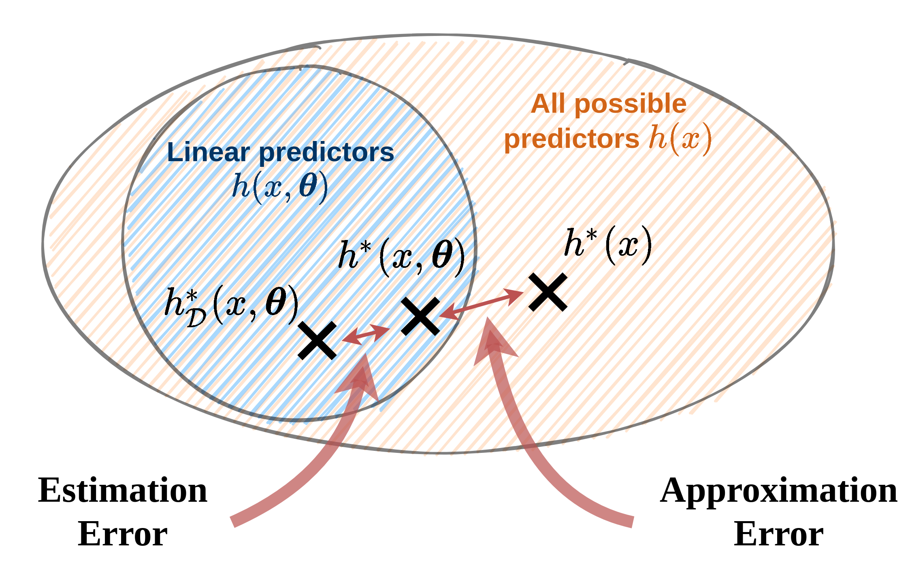
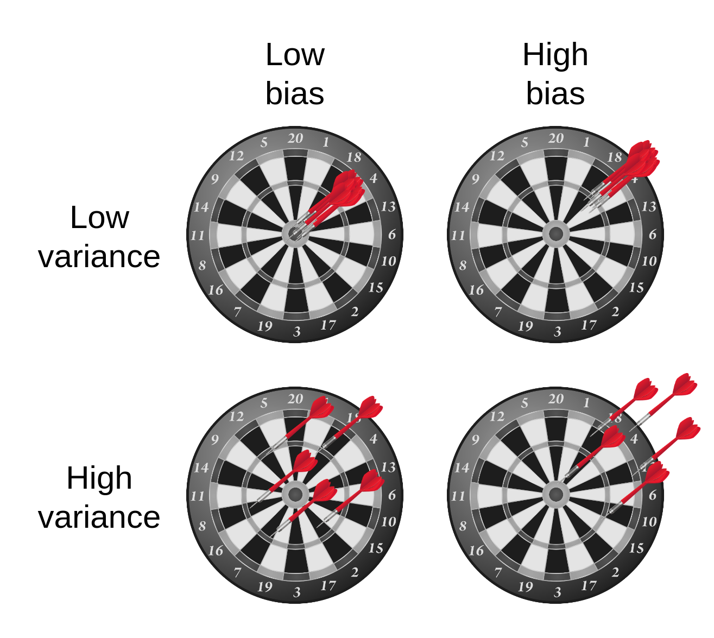
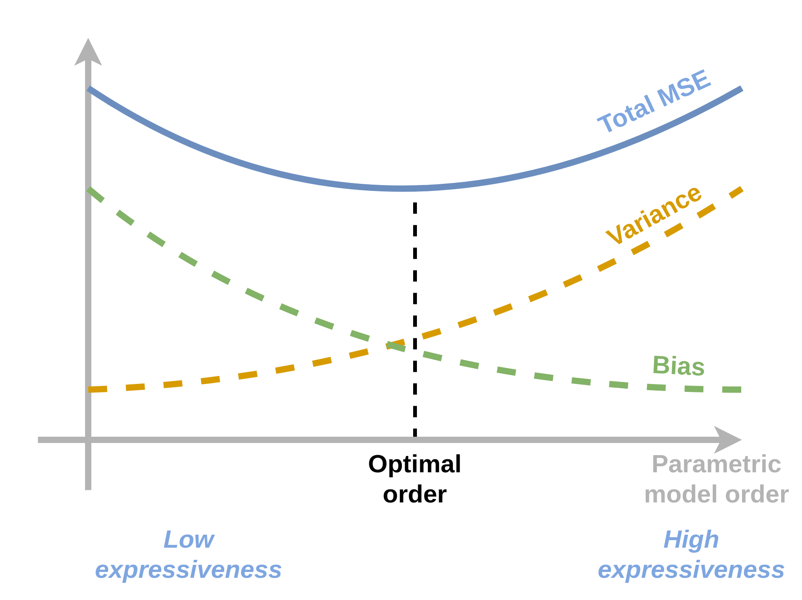
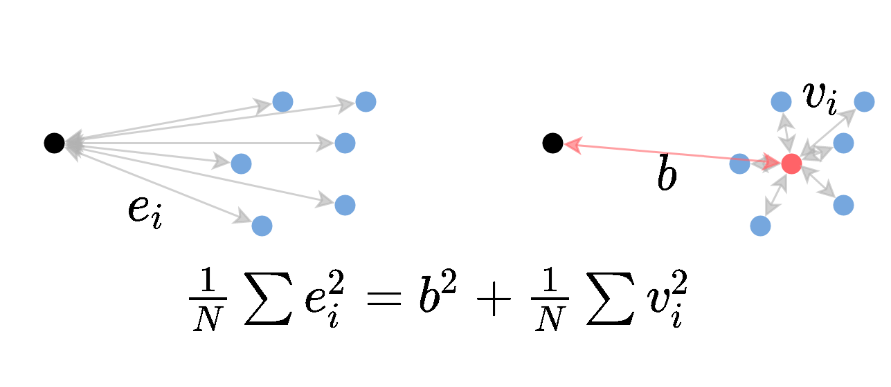
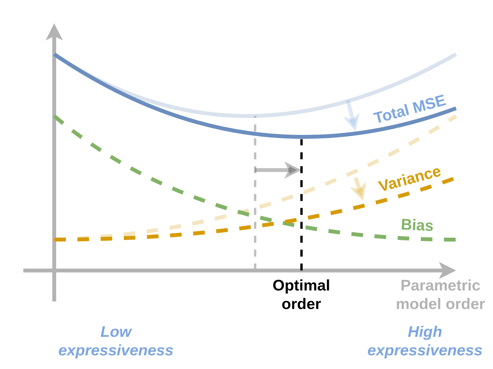
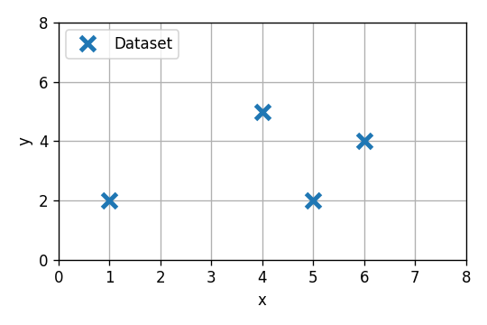
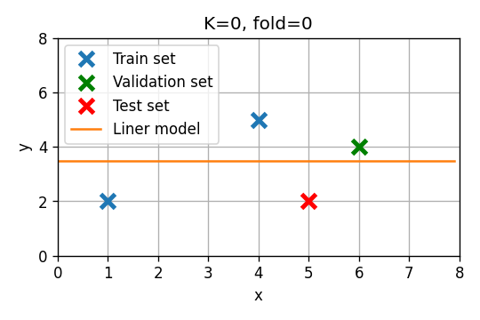
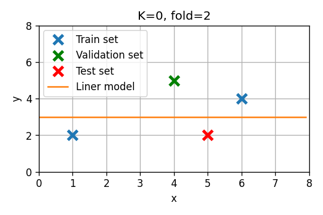

<section class="center">

# תרגול 4 - Generalization & overfitting

<a href="/assets/tutorial4_slides.pdf" class="link-button" target="_blank">PDF</a>

</section><section>

## מושגים

- **הכללה (generalization)**: היכולת של המודל להפיק תוצאות טובות גם על דגימות אשר לא הופיעו במדגם.

- **Overfitting (התאמת יתר)**: כאשר המודל לומד מאפיינים אשר מופיעים רק במדגם ולא מייצגים את הפילוג האמיתי.
  -  Overfitting פוגע ביכולת ההכללה.

- **הערכת הביצועים / הציון של חזאי (יכולת הכללה)**: 

  הערכת המחיר המתקבל בעבור חזאי נתון על הפילוג האמיתי.

- **יכולת הביטוי (expressiveness) של מודל**: 

  היכולת של מודל פרמטרי לייצג  מגוון רחב של מודלים.

</section><section>

- **Hyper parameters**:

  הפרמטרים שמשפיעים על המודל או האלגוריתם, אך אינם חלק מהפרמטרים שעליהם אנו מבצעים את האופטימיזציה.

- דוגמאות:

  - סדר הפולינום שבו אנו משתמשים
  - גודל הצעד $\eta$ באלגוריתם ה gradient descent.
  - פרמטרים אשר קובעים את המבנה של רשת נוירונים.

  

- **סדר המודל**:גודל ששולט ביכולת הביטוי של המודל הפרמטרי.

</section><section>

### הערכת ביצועים בעזרת test set (סט בחן)

לרוב, ניתן לשערך אך את ביצועיו של חזאי מסויים על ידי שימוש בתוחלת אמפירית ומדגם נוסף.

 

לשם כך נפצל את המודל שני תתי מדגמים:

- **Train set (סט אימון)**:  משמש ללימוד/בניית החזאי.
- **Test set (סט בחן)**: משמש להערכת ביצועים.

</section><section>

#### גודלו של ה- test set

- סט בוחן גדול מאפשר להעריך את ביצועי האלגוריתם בצורה מדוייקת.

 

 

- במידה ומספר הדגימות מוגבל, נפריש דוגמאות מסט האימון.
  
   
  
   
  
  - מקובל להשתמש בפיצול של 80% train ו- 20% test.

</section><section>

### פירוק שגיאת החיזוי

בקורס זה נציג שני פירוקים נפוצים של שגיאת החיזוי בבעיות supervised learning.

</section><section>

#### Approximation-estimation decomposition

* **Noise - ה"רעש" של התויות**: השגיאה שהחזאי האופטימאלי צפוי לעשות. שגיאה זו נובעת מהאקראיות של התויות $y$.

* **Approximation error - שגיאת קירוב**: נובעת מבחירת משפחה של מודלים (לרוב למודל פרמטרי), ומוגדרת לפי ההבדל בין המודל האופטימאלי $h^*$ לבין המודל **הפרמטרי** האופטימאלי $h^*(\cdot,\boldsymbol{\theta})$.

* **Estimation error - שגיאת השיערוך**: נובעת מהשימוש במדגם כתחליף לפילוג האמיתי וחוסר היכולת שלנו למצוא את המודל הפרמטרי האופטימאלי. שגיאה זו נובעת מההבדל בין המודל הפרמטרי האופטימאלי $h^*(\cdot,\boldsymbol{\theta})$ למודל הפרמטרי המשוערך על סמך המדגם $h_{\mathcal{D}}^*(\cdot,\boldsymbol{\theta})$.

</section><section>

#### Approximation-estimation decomposition

#### 

</section><section>

#### Bias-variance decomposition

* פירוק זה מתייחס למקרים שבהם פונקציית המחיר הינה MSE.

* המדגם $\mathcal{D}$ שאיתו אנו עובדים הוא אקראי (משום שהוא אוסף של דגימות אקראיות) ולכן גם החזאי $h_{\mathcal{D}}$ שאותו נייצר על סמך המדגם הוא אקראי.

* נגדיר את החזאי הממוצע $\bar{h}$ כחזאי המתקבל כאשר לוקחים תוחלת על החזאים המיוצרים על ידי אלגוריתם מסויים על פני כל המדגמים האפשריים.

$$
\bar{h}(x)=\mathbb{E}_{\mathcal{D}}\left[h_{\mathcal{D}}(x)\right]
$$

**הערה:** נשתמש בסימון $\mathbb{E}_\mathcal{D}$ בכדי לציין תוחלת על פני המדגמים האפשריים. (תוחלת ללא סימון $\mathbb{E}$ תהיה לפי $\mathbf{x}$ ו $\text{y}$).

</section><section>

#### Bias-variance decomposition

* בעבור המקרה של MSE אנו יודעים כי החזאי האופטימאלי הינו: $h^*(x)=\mathbb{E}\left[\text{y}|x\right]$. על ידי שימוש בחזאי האופטימאלי והחזאי הממוצע ניתן לפרק התוחלת על שגיאת ה MSE של אלגוריתם נתון באופן הבא:

$$
\begin{aligned}
&\mathbb{E}_{\mathcal{D}}\left[
    \mathbb{E}\left[(h_{\mathcal{D}}(\text{x})-y)^2\right]
\right] \\
&=
\mathbb{E}\left[
    \underbrace{\mathbb{E}_{\mathcal{D}}\left[(h_{\mathcal{D}}(\text{x})-\bar{h}(\text{x}))^2\right]}_{\text{Variance}}
    +\underbrace{(\bar{h}(\text{x})-h^*(\text{x}))^2}_{\text{Bias}^2}
    +\underbrace{(h^*(\text{x})-y)^2}_{\text{Noise}}
\right]
\end{aligned}
$$

- ה -0variance מודד את השונות של התוצאות החיזוי המתקבלות סביב החזאי הממוצע. תוחלת באיזור זה היא גם על פני המדגמים השונים אותם ניתן לקבל וגם על פני $\text{x}$. זהו האיבר היחיד בפירוק אשר תלוי בפילוג של המדגם.

- ה- bias מודד את ההפרש הריבועי בין החיזוי של החזאי הממוצע לבין החיזוי של החזאי האופטימאלי.

- ה noise (בודמה לפירוק הקודם) מודד את השגיאה הריבועית המתקבלת מהחזאי האופטימאלי (אשר נובעת מהאקראיות של $y$).

</section><section>

### אילוסטרציה של bias ו- variance:

  

</section><section>

##### Tradeoffs

- **מודל בעל יכולת ביטוי גבוהה**:
  - שגיאת קירוב / bias נמוכה
  - שגיאת שיערוך / variance גבוהה

- **מודל בעל יכולת ביטוי נמוכה**:

  -  שגיאת קירוב / bias גבוהה

  - שגיאת שיערוך / variance נמוכה

</section><section>

</section><section>

### שימוש ב validataion set לקביעת hyper-parameters

* ה hyper-parameters אינם חלק מבעיית האופטימיזציה.

* לרוב לנאלץ לקבוע את הפרמטרים האלו בשיטה של ניסוי וטעיה.

* מכיוון שאנו לא יכולים להשתמש ב test set בכדי לבנות את המודל שלנו, יש צורך במדגם נפרד שעליו נוכל לבחון את ביצועי המודל בעבור ערכים שונים של ה hyper-parameters. 
* דבר זה יתבצע ע"י חלוקה נוספת של ה- train set. למדגם הנוסף נקרא validation set.

**הערה:** לעיתים קרובות, לאחר קביעת ה- hyper-parmaeters,  נאחד חזרה את ה- validation set וה- train set ונאמן מחדש את המודל על המדגם המאוחד (כל הדגימות מלבד ה test set).

</section><section>

### רגולריזציה

*  דרך להקטין את ה overfitting של המודל.
* מטרת איבר הרגולריזציה הינה להשתמש בידע מוקדם שיש לנו על אופי הבעיה לצורך בחירת המודל. 
  * נרצה לתת מחיר גבוה לפרמטרים למודלים שאינם סבירים.

* בעיות אופטימיזציה עם רגולריזציה יהיו מהצורה הבא:

$$
\boldsymbol{\theta}=\underset{\boldsymbol{\theta}}{\arg\min}\underbrace{f(\boldsymbol{\theta})}_{\text{The regular objective function}}+\lambda\underbrace{g(\boldsymbol{\theta})}_{\text{The regularization term}}
$$

* כאשר $\lambda$ אשר קובע את המשקל שאנו מעוניינים לתת לרגולריזציה.

</section><section>

רגולריזציות נפוצות:

- $l_1$ - אשר מוסיפה איבר רגולריזציה של $g(\boldsymbol{\theta})=\lVert\boldsymbol{\theta}\rVert_1$.
- $l_2$ - (Tikhonov regularizaion) אשר מוסיפה איבר רגולריזציה של $g(\boldsymbol{\theta})=\lVert\boldsymbol{\theta}\rVert_2^2$.

* רגולריזציות אלו מנסות לשמור את הפרמטריים כמה שיותר קטנים.
* המוטיבציה מאחורי הרצון לשמור את הפרמטרים קטנים הינה העובדה שבמרבית המודלים ככל שהפרמטרים קטנים יותר המודל הנלמד יהיה בעל נגזרות קטנות יותר ולכן הוא ישתנה לאט יותר ופחות "ישתולל".

**הערה:** $\lambda$ הוא hyper-parameter של האלגוריתם שאותו יש לקבוע בעזרת ה validation set.

</section><section>

#### דוגמא: בעיות LLS עם רגולריזציה

##### Ridge regression: LLS + $l2$ regularization

$$
\boldsymbol{\theta}=\underset{\boldsymbol{\theta}}{\arg\min}\frac{1}{N}\sum_i(\boldsymbol{x}^{(i)\top}\boldsymbol{\theta}-y^{(i)})^2+\lambda\lVert\boldsymbol{\theta}\rVert_2^2
$$

גם לבעיה זו יש פתרון סגור והוא נתון על ידי:

$$
\boldsymbol{\theta}^*=(X^{\top}X+\lambda)^{-1}X^{\top}\boldsymbol{y}
$$

אנו נראה את הפיתוח של פתרון זה בתרגיל 4.2.

</section><section>

##### LASSO: LLS + $l1$ regularization

(LASSO = Linear Absolute Shrinkage and Selection Opperator)

$$
\boldsymbol{\theta}=\underset{\boldsymbol{\theta}}{\arg\min}\frac{1}{N}\sum_i(\boldsymbol{x}^{(i)\top}\boldsymbol{\theta}-y^{(i)})^2+\lambda\lVert\boldsymbol{\theta}\rVert_1
$$

לבעיה זו אין פתרון סגור ויש צורך להשתמש באלגוריתמים איטרטיביים כגון gradient descent.

</section><section>

## תרגיל 4.1 - Bias-variance decomposition

**סעיף 1:**

**הראו כי בעבור משתנה אקראי כל שהוא $\text{x}$ וקבוע $a$ ניתן לפרק את התחולת של המרחק הריבועי בין $\text{a}$ לבין $a$ באופן הבא:**
$$
\mathbb{E}\left[(\text{x}-a)^2\right]
=\underbrace{\mathbb{E}\left[(\text{x}-\mathbb{E}\left[\text{x}\right])^2\right]}_{=\text{Var}(\text{x})}
+(\underbrace{\mathbb{E}\left[\text{x}\right]-a}_{\text{bias}})^2
$$

**פתרון:**

זהות זו היא הכללה של הקשר הבא למשתנים אקראיים:

 

</section><section>

נוכיח את הזהות על ידי הוספה והחסרה של $\mathbb{E}[\text{x}]$ בתוך הסוגריים:
$$
\begin{aligned}
\mathbb{E}\left[(\text{x}-a)^2\right]&
=\mathbb{E}\left[(
    (\text{x}-\mathbb{E}\left[\text{x}\right])
    +(\mathbb{E}\left[\text{x}\right]-a)
    )^2\right]\\
=&\mathbb{E}\left[(\text{x}-\mathbb{E}\left[\text{x}\right])^2\right]
-2\mathbb{E}\left[
    (\text{x}-\mathbb{E}\left[\text{x}\right])
    (\mathbb{E}\left[\text{x}\right]-a)
    \right]
+\mathbb{E}\left[(\mathbb{E}\left[\text{x}\right]-a)^2\right]\\
=&\mathbb{E}\left[(\text{x}-\mathbb{E}\left[\text{x}\right])^2\right]
-2(\underbrace{\mathbb{E}\left[\text{x}\right]-\mathbb{E}\left[\text{x}\right]}_{=0})
  (\mathbb{E}\left[\text{x}\right]-a)
+\mathbb{E}\left[(\mathbb{E}\left[\text{x}\right]-a)^2\right]\\
=&\mathbb{E}\left[(\text{x}-\mathbb{E}\left[\text{x}\right])^2\right]
+(\mathbb{E}\left[\text{x}\right]-a)^2
\end{aligned}
$$

</section><section>

**סעיף 2:**

 הראו כי בעבור אלגוריתם אשר מייצר חזאיים $h_{\mathcal{D}}$ בהינתן מדגמים $\mathcal{D}$, ניתן לפרק את התוחלת (על פני מדגמים וחיזויים שונים) של שגיאת ה MSE באופן הבא:
$$
\begin{aligned}
\mathbb{E}_{\mathcal{D}}&\left[
    \mathbb{E}\left[(h_{\mathcal{D}}(\text{x})-y)^2\right]
\right] \\
&=
\mathbb{E}\left[
    \underbrace{\mathbb{E}_{\mathcal{D}}\left[(h_{\mathcal{D}}(\text{x})-\bar{h}(\text{x}))^2\right]}_{\text{Variance}}
    +\underbrace{(\bar{h}(\text{x})-h^*(\text{x}))^2}_{\text{Bias}^2}
    +\underbrace{(h^*(\text{x})-y)^2}_{\text{Noise}}
\right]
\end{aligned}
$$

כאשר:

$$
\bar{h}(x)=\mathbb{E}_{\mathcal{D}}\left[h_{\mathcal{D}}(x)\right]
$$

ו-

$$
h^*(x)=\mathbb{E}\left[\text{y}|x\right]
$$

</section><section>

הדרכה:

1. הראו ראשית כי ניתן לפרק את השגיאת ה MSE בעבור מדגם נתון באופן הבא:

   $$
   \mathbb{E}\left[(h^*_{\mathcal{D}}(\text{x})-y)^2\right]=
       \mathbb{E}\left[(h^*_{\mathcal{D}}(\text{x})-h^*(\text{x}))^2\right]
       +\mathbb{E}\left[(h^*(\text{x})-\text{y})^2\right]
   $$

   לשם כך השתמשו בהחלקה על מנת להתנות את התחולת ב $\text{x}$ ולקבל תוחלת לפי $\text{y}$. הפעילו את הזהות מסעיף 1 על התוחלת של $\text{y}$.

2. הראו כי ניתן לפרק את התוחלת הזו באופן הבא:

   $$
   \mathbb{E}_{\mathcal{D}}\left[
       \mathbb{E}\left[(h_{\mathcal{D}}(\text{x})-h^*(\text{x}))^2\right]
   \right]
   =\mathbb{E}\left[
       \mathbb{E}_{\mathcal{D}}\left[(h_{\mathcal{D}}(\text{x})-\bar{h}(\text{x}))^2\right]
       +(\bar{h}(\text{x})-h^*(\text{x}))^2
   \right]
   $$

   לשם כך החליפו את סדר התוחלות והשתמשו בזהות מסעיף 1 על התוחלת לפי $\mathcal{D}$.

3. השתמשו בשני הפירוקים הנ"ל על מנת להראות את פירוק ה bias-variance המלא.

</section><section>

**פתרון:**

##### שלב ראשון

נפעל על פי ההדרכה. נחליק על ידי התניה ב $\text{x}$ ו $\mathcal{D}$ ונפעיל את הזהות מסעיף 1 על התוחלת הפנימית (לפי $\text{y}$):

$$
\begin{aligned}
\mathbb{E}\left[(h_{\mathcal{D}}(\text{x})-y)^2\right]
&=\mathbb{E}\left[\mathbb{E}\left[(h_{\mathcal{D}}(\text{x})-y)^2\middle|\text{x}\right]\right]\\
&=\mathbb{E}\left[
    (h_{\mathcal{D}}(\text{x})-\mathbb{E}\left[y\middle|\text{x}\right])^2
    +\mathbb{E}\left[(\mathbb{E}\left[\text{y}|x\right]-\text{y})^2\middle|\text{x}\right]
    \right]
\end{aligned}
$$

נארגן מחדש טיפה את את התוחלות:
$$
\begin{aligned}
&=\mathbb{E}\left[(h_{\mathcal{D}}(\text{x})-\mathbb{E}\left[y\middle|\text{x}\right])^2\right]
+\mathbb{E}\left[\mathbb{E}\left[(\mathbb{E}\left[\text{y}|x\right]-\text{y})^2\middle|\text{x}\right]\right]\\
&=\mathbb{E}\left[(h_{\mathcal{D}}(\text{x})-\mathbb{E}\left[y\middle|\text{x}\right])^2\right]
+\mathbb{E}\left[(\mathbb{E}\left[\text{y}|x\right]-\text{y})^2\right]
\end{aligned}
$$

</section><section>

נשתמש כעת בעובדה ש $\mathbb{E}\left[\text{y}|x\right]=h^*(\text{x})$ ונקבל:
$$
=\mathbb{E}\left[(h_{\mathcal{D}}(\text{x})-h^*(\text{x}))^2\right]
+\mathbb{E}\left[(h^*(\text{x})-\text{y})^2\right]
$$

  

* האיבר הראשון הוא למעשה השגיאה הנובעת מההבדל בין החיזוי של מודל האידאלי לבין החיזוי של מודל ספציפי ששנוצר ממדגם מסויים. נשים לב שאיבר זה לא תלוי בכלל בפילוג של $\text{y}$.
* האיבר השני בביטוי שקיבלנו הוא השגיאה של החזאי האופטימאלי והיא נובע מחוסר היכולת לחזות את $\text{y}$ במדוייק. נשים לב כי איבר זהלא תלוי כלל במדגם.

</section><section>

##### שלב שני

 על פי ההדרכה נפרק את התוחלת הבאה על ידי החלפת סדר התוחלות ושימוש בזהות מסעיף 1 על התוחלת לפי $\mathcal{D}$:

$$
\begin{aligned}
\mathbb{E}_{\mathcal{D}}&\left[
    \mathbb{E}\left[(h_{\mathcal{D}}(\text{x})-h^*(\text{x}))^2\right]
\right]\\
&=\mathbb{E}\left[
    \mathbb{E}_{\mathcal{D}}\left[(h_{\mathcal{D}}(\text{x})-h^*(\text{x}))^2\right]
\right]\\
&=\mathbb{E}\left[
    \mathbb{E}_{\mathcal{D}}\left[
        (h_{\mathcal{D}}(\text{x})-\mathbb{E}_{\mathcal{D}}\left[h_{\mathcal{D}}(\text{x})\right])^2
    \right]
    +(\mathbb{E}_{\mathcal{D}}\left[h_{\mathcal{D}}(\text{x})\right]-h^*(\text{x}))^2
\right]
\end{aligned}
$$

נשתמש בסימון $\mathbb{E}_{\mathcal{D}}\left[h_{\mathcal{D}}(\text{x})\middle|\text{x}\right]=\bar{h}(\text{x})$ ונקבל:
$$
\mathbb{E}\left[
    \mathbb{E}_{\mathcal{D}}\left[(h_{\mathcal{D}}(\text{x})-\bar{h}(\text{x}))^2\right]
    +(\bar{h}(\text{x})-h^*(\text{x}))^2
\right]
$$

* הרכיב הראשון: ה- variance של החזאי אשר מבטא את השגיאה הצפויה עקב ההשתנות של החזאי כתלות במדגם.
* הרכיב השני: רכיב bias אשר מבטא את השגיאה אשר נובעת מההבדל בין החזאי ה"ממוצע" והחזאי האידאלי.

</section><section>

##### נרכיב את הכל

נשתמש בפירוק הראשון על מנת לקבל:

$$
\mathbb{E}_{\mathcal{D}}\left[
    \mathbb{E}\left[(h^*_{\mathcal{D}}(\text{x})-y)^2\right]
\right]
=\mathbb{E}_{\mathcal{D}}\left[
    \mathbb{E}\left[(h^*_{\mathcal{D}}(\text{x})-h^*(\text{x}))^2\right]
    +\mathbb{E}\left[(h^*(\text{x})-\text{y})^2\right]
\right]
$$

מכיוון שהאיבר השני לא תלוי ב $\mathcal{D}$ נוכל להוציא אותו מהתוחלת על $\mathcal{D}$:
$$
=\mathbb{E}_{\mathcal{D}}\left[
    \mathbb{E}\left[(h^*_{\mathcal{D}}(\text{x})-h^*(\text{x}))^2\right]
\right]
+\mathbb{E}\left[(h^*(\text{x})-\text{y})^2\right]
$$

נציב את הפירוק מהשלב השני ונקבל:
$$
\begin{aligned}
&=\mathbb{E}\left[
    \mathbb{E}_{\mathcal{D}}\left[(h_{\mathcal{D}}(\text{x})-\bar{h}(\text{x}))^2\right]
    +(\bar{h}(\text{x})-h^*(\text{x}))^2
\right]
+\mathbb{E}\left[(h^*(\text{x})-\text{y})^2\right]\\
&=\mathbb{E}\left[
    \underbrace{\mathbb{E}_{\mathcal{D}}\left[(h_{\mathcal{D}}(\text{x})-\bar{h}(\text{x}))^2\right]}_{\text{Variance}}
    +\underbrace{(\bar{h}(\text{x})-h^*(\text{x}))^2}_{\text{Bias}^2}
    +\underbrace{(h^*(\text{x})-y)^2}_{\text{Noise}}
\right]
\end{aligned}
$$

</section><section>

**סעיף 3:**

***הניחו כי כאשר המדגם גדל, החזאים המתקבלים מהמודל מתכנסים (במובן הסתברותי) לחזאי ה"ממוצע": $h_{\mathcal{D}}\rightarrow\bar{h}$.***

***מה תוכלו לומר על התלות של איברי השגיאה בגודל המדגם?***

***(ניתן להניח ש- $\bar{h}$ אינו תלוי בגודל המדגם)***

#### פתרון:

* המשמעות של העובדה ש $h_{\mathcal{D}}$ מתכנס לממוצע שלו $\bar{h}$ במובן הסתברותי הינה למעשה שה varaince שלו קטן.
* כלומר, רכיב ה- variance בפירוק הנ"ל יקטן.
* שאר האיברים במקרה זה לא יושפעו מהשינוי בגודלו של המדגם.

</section><section>

**סעיף 4:**

***על פי תוצאת הסעיף הקודם, כיצד לדעתכם עשוי להשפיע גודל המדגם על סדר המודל שאותו נרצה לבחור?***

**פתרון:**

* השינוי של רכיב ה variance יכול כמובן להשפיע על סדר המודל האופטימאלי.

  * שגיאת ה- variance תקטן ככל שמשפחת המודלים להיות כמה שיותר מצומצמת.

  * שגיאת ה- Bias תקטן ככל שמשפחת המודלים גדולה יותר.

    

</section><section>

כאשר הגרף של שגיאת ה variance ירד אנו מצפים כי נקודת המינימום של השגיאה הכוללת תזוז ימינה לכיוון מודלים מסדר גבוהה יותר.

**הערה**: ניתוח זה כמובן נשען על התנהגות טיפוסית של אלגוריתמי supervised learning ואין הכרח שההתנהגות המאורת בתשובה זו אכן תהיה ההתנהגות במציאות.

</section><section>

## תרגיל 4.2 - רגולריזציה

#### 1) בעבור Rigde regression (המקרה של LLS + $l2$ regularization) רשמו את בעיית האופטימיזציה ופתרו  אותה על ידי גזירה והשוואה ל-0.

</section><section>

תזכורת, בעיית ה LLS היא המקרה שבו אנו משתמשים ב

- MSE או RMSE כפונקציית המחיר / סיכון.
- ERM.
- מודל לינארי

</section><section>

בעיית האופטימיזציה של LLS הינה:
$$
\boldsymbol{\theta}^*
=\underset{\boldsymbol{\theta}}{\arg\min} \frac{1}{N}\lVert X\boldsymbol{\theta}-\boldsymbol{y}\rVert_2^2
$$

כאשר

$$
\boldsymbol{y}=[y^{(1)},y^{(2)},\cdot,y^{(n)}]^{\top}
\qquad
X=\begin{bmatrix}
- & \boldsymbol{x}^{(1)} & - \\
- & \boldsymbol{x}^{(2)} & - \\
& \vdots & \\
- & \boldsymbol{x}^{(N)} & -
\end{bmatrix}
$$

כאשר נוסיף לבעיית האופטימיזציה איבר של רגולריזציית $l_2$ נקבל: 
$$
\boldsymbol{\theta}^*
=\underset{\boldsymbol{\theta}}{\arg\min} \frac{1}{N}\lVert X\boldsymbol{\theta}-\boldsymbol{y}\rVert_2^2
+\lambda\lVert\boldsymbol{\theta}\rVert_2^2
$$

</section><section>

נגזור ונשווה ל-$0$. נשתמש בנזגרת המוכרת $\nabla_{\boldsymbol{x}}\lVert\boldsymbol{x}\rVert_2^2=\nabla_{\boldsymbol{x}}\boldsymbol{x}^{\top}\boldsymbol{x}=2\boldsymbol{x}$:
$$
\begin{aligned}
&\nabla_{\boldsymbol{\theta}}\left( \frac{1}{N}\lVert X\boldsymbol{\theta}-\boldsymbol{y}\rVert_2^2
+\lambda\lVert\boldsymbol{\theta}\rVert_2^2\right)=0\\
\Leftrightarrow & \frac{2}{N}(X^{\top}X\boldsymbol{\theta}-X^{\top}\boldsymbol{y})
+2\lambda\boldsymbol{\theta}=0\\
\Leftrightarrow &(X^{\top}X+N\lambda I)\boldsymbol{\theta}=
X^{\top}\boldsymbol{y}\\
\Leftrightarrow &\boldsymbol{\theta}=
(X^{\top}X+N\lambda I)^{-1}X^{\top}\boldsymbol{y}\\
\end{aligned}
$$

 

* ניתן כמובן "לבלוע" את ה$N$ בתוך הפרמטר $\lambda$, אך שינוי זה מצריך להתאים את הפרמטר $\lambda$ לגודל המדגם ולעדכנו כאשר גודל המדגם משתנה (נגיד במקרה בו ממפרישים חלק מהמדגם ל validation set).

</section><section>

**2) נסתכל כעת על וריאציה של Ridge regression שבה אנו נותנים משקל שונה $w_i$ לרגולריזציה של כל פרמטר:**
$$
\sum_{i=1}^D w_i\theta_i^2
$$

**(כאן $D$ הוא מספר הפרמטרים של המודל).**

**הדרכה: הגדירו את מטריצת המשקלים $W=\text{diag}(\{w_i\})$, רשמו את הבעיה בכתיב מטריצי ופתרו אותה בדומה לסעיף הקודם.**

 

**פתרון:**

 

 

בעיית האופטימיזציה כעת תהיה

$$
\boldsymbol{\theta}^*
=\underset{\boldsymbol{\theta}}{\arg\min} \frac{1}{N}\lVert X\boldsymbol{\theta}-\boldsymbol{y}\rVert_2^2
+\lambda\sum_{i=1}^D w_i\theta_i^2
$$

</section><section>

נפעל על פי ההדרכה. נגדיר את המטריצה:
$$
W=\begin{bmatrix}
w_1 & 0 & \dots & 0 \\
0 & w_2 & & 0 \\
\vdots &  & \ddots & \vdots \\
0 &  \dots & & w_D
\end{bmatrix}
$$

בעזרת מטריצה זו ניתן לרשום את בעיית האופטימיזציה באופן הבא:

$$
\boldsymbol{\theta}^*
=\underset{\boldsymbol{\theta}}{\arg\min} \frac{1}{N}\lVert X\boldsymbol{\theta}-\boldsymbol{y}\rVert_2^2
+\lambda\boldsymbol{\theta}^{\top}W\boldsymbol{\theta}
$$

</section><section>

נגזור ונשווה ל-0:
$$
\begin{aligned}
&\nabla_{\boldsymbol{\theta}}\left( \frac{1}{N}\lVert X\boldsymbol{\theta}-\boldsymbol{y}\rVert_2^2
+\lambda\boldsymbol{\theta}^{\top}W\boldsymbol{\theta}\right)=0\\
\Leftrightarrow & \frac{2}{N}(X^{\top}X\boldsymbol{\theta}-X^{\top}\boldsymbol{y})
+2\lambda W\boldsymbol{\theta}=0\\
\Leftrightarrow &(X^{\top}X+N\lambda W)\boldsymbol{\theta}=
X^{\top}\boldsymbol{y}\\
\Leftrightarrow &\boldsymbol{\theta}=
(X^{\top}X+N\lambda W)^{-1}X^{\top}\boldsymbol{y}\\
\end{aligned}
$$

</section><section>

#### 3) נסתכל כעת על אלגוריתם כללי שבו הפרמטרים של המודל נקבעים על פי בעיית האופטימיזציה הבאה

$$
\boldsymbol{\theta}^*=\underset{\boldsymbol{\theta}}{\arg\min}f(\boldsymbol{\theta})
$$

#### **רשמו את הבעיות האופטימיזציה המקבלות לאחר הוספת של איבר רגולריזציה מסוג $l_1$ ו $l_2$.**

**פתרון:**

בעיית האופטימיזציה בתוספת רגולריזציית $l_2$ תהיה:

$$
\boldsymbol{\theta}^*=\underset{\boldsymbol{\theta}}{\arg\min}f(\boldsymbol{\theta})
+\lambda\lVert\boldsymbol{\theta}\rVert_2^2
$$

בעיית האופטימיזציה בתוספת רגולריזציית $l_1$ תהיה:

$$
\boldsymbol{\theta}^*=\underset{\boldsymbol{\theta}}{\arg\min}f(\boldsymbol{\theta})
+\lambda\lVert\boldsymbol{\theta}\rVert_1
$$

</section><section>

#### 4) רשמו את כלל העדכון של אלגוריתם הגרדיאנט בעבור כל אחד משני הרגולריזציות:

* כלל העדכון של gradient decsent הינו:

$$
\boldsymbol{\theta}^{(t+1)}=\boldsymbol{\theta}^{(t)}-\eta\nabla_{\boldsymbol{\theta}} g(\boldsymbol{\theta^{(t)}})
$$

כאשר $g(\boldsymbol{\theta})$ היא פונקציית המטרה של בעיית האפטימזציה. 

* בעבור רגולריזציית ה $l_2$ נקבל:

$$
\boldsymbol{\theta}^{(t+1)}=\boldsymbol{\theta}^{(t)}-\eta\nabla_{\boldsymbol{\theta}} f(\boldsymbol{\theta^{(t)}})-2\eta\lambda\boldsymbol{\theta^{(t)}}
$$

* בעבור רגולריזציית ה $l_1$ נקבל:

$$
\boldsymbol{\theta}^{(t+1)}=\boldsymbol{\theta}^{(t)}-\eta\nabla_{\boldsymbol{\theta}} f(\boldsymbol{\theta^{(t)}})-2\eta\lambda\cdot\text{sign}(\boldsymbol{\theta}^{(t)})
$$

כאשר פונקציית ה$\text{sign}$ פועלת איבר איבר.

</section><section>

#### 5) על סמך ההבדל בין שני הכללי העדכון הסבירו מה הבדל בין האופן שבו שני הרגולריזציות מנסות להקטין את הפרמטרים.

* שני האיברים שנוספו לכלל העדכון מנסים בכל צעד להקטין את וקטור הפרמטריים ולקרב אותו ל-0. 
* ברגולרזציית $l_2$ האיבר המתקבל פרופורציוני לגודל של האיברים בוקטור הפרמטרים.
  * ככל שפרמטר מסויים גדול יותר כך הרגולריזציה תתאמץ יותר להקטין אותו וההשפעה על הפרמטרים הקטנים תהיה פחותה.
* ברגולריזציית $l_1$ האיבר המתקבל הוא קבוע (עד כדי סימן).
  * הרגולריזציה להקטין את כל האיברים ללא קשר לגודלם.

</section><section>

#### 6) על סמך שני כללי העדכון הסבירו מדוע רגולריזציית $l_1$ נוטה יותר לאפס פרמטרים מאשר רגולריזציית $l_2$. (הניחו שצעדי העדכון קטנים מאד)

כפי שציינו בסעיף הקודם, רגולריזציית ה $l_2$ תשפיע באופן מועט יחסית על האיברים הקטנים ולא תתאמץ להקטין אותם ובעיקר תפעל להקטין את האיברים הגדולים. מנגד, רגולריזציית ה $l_1$ תמשיך ולנסות להקטין את האיברים כל עוד הם שונים מ-0 ולכן בפועל היא תיטה לאפס יותר איברים.

  

**הערה**: בפועל בגלל שגודלו של איבר הרגולריזציה בגרדיאנט של $l_1$ קבוע הוא יקטין את האיברים לערכים קרובים ל-0 ואז יתחיל להתנדנד סביב ה-0.

</section><section>

## K-fold cross validation

* כשהמדגם קטן, לא ניתן להקצות הרבה דגימות לטובת ה validation set. 
* במצב כזה, הערכת הביצועים יכולה להיות לא מדוייקת ולפגוע בבחירה של ה hyper-parmeters. 
* שיטת ה K-fold cross validataion מציעה שיטה לשפר הדיוק על הערכת הביצועים על ידי מיצוע על כמה validation sets.

</section><section>

בשיטה זו נחלק את ה train set שלנו ל $K$ קבוצות ונבצע את הערכת הביצויים $K$ פעמים באופן הבא:

1. בכל פעם נבחר (על פי הסדר) אחת הקבוצות לשמש כ validation set הנוכחי.
2. בניה של מודל על סמך ה $K-1$ קבוצות האחרות
3. חישוב הביצועים של המודל על סמך הקבוצה שנבחרה.

הביצועיים הכוללים יהיו הממוצע של התוצאות אשר התקבלו ב $K$ החזרות.

  

גדולים אופיינים ל $K$ הינם בין 5 ל10.

</section><section>

להלן סכימה של החלוקה של המדגם בעבור בחירה של $K=5$ :

  

</section><section>

### Leave-one-out cross validation

במקרים מסויימים (בעיקר כשאר ה train set מאד קטן) אנו נבחר לקחת את $K$ להיות שווה למספר האיברים שב train set. במקרה זה גודלה של כל קבוצה יהיה 1. מקרה זה מוכנה לרוב Leave-one-out cross validation.

</section><section>

## תרגיל 4.3 - בחירת סדר המודל

נתון המדגם הבא:

$$
\mathcal{D}=\{\{6,4\},\{1,2\},\{4,5\},\{5,2\}\}
$$

* ננסה להתאים למדגם הנתון אחד משני מודלים: מודל לינארי מסדר 0 (פונקציה קבועה) או מסדר ראשון (פונקציה לינארית עם היסט). בתרגיל זה נבחן דרכים לקביעת סדר המודל.

* נפצל את המדגם כך ששלושת הדגימות הראשונות יהיו הtrain set והאחרונה תהיה ה test set.

</section><section>

#### **1)** השתמשו ב LLS על מנת להתאים כל אחד משני המודלים המוצעים ל train set.

#### העריכו את ביצועי החזאי על פי שגיאת החיזוי המתקבל על הנקודה שב train set.

#### מי מהמודלים נותן ביצועים טובים יותר?

נחלק את המדגם ל train set ו test set:

$$
\mathcal{D}_{\text{train}}=\{\{6,4\},\{1,2\},\{4,5\}\}
$$

$$
\mathcal{D}_{\text{test}}=\{\{5,2\}\}
$$

</section><section>

##### סדר 0

מודל מסדר 0 (פונקציה קבועה) הוא כמובן מקרה מנוון של מודל לינארי עם מאפיין יחיד של $\varphi(x)=1$. במקרה זה אנו מצפים כי המודל אשר ימזער את השגיאה הריבועית יהיה פשוט פונקציה קבועה אשר שווה ל $y$ הממוצע על ה train set. נראה כי זה אכן הפתרון המתקבל מתוך הפתרון הסגור. בעבור מודל זה המטריצה $X$ והוקטור $\boldsymbol{y}$ יהיו:

$$
X=[1, 1, 1]^{\top},\qquad \boldsymbol{y}=[4,2,5]^{\top}
$$

</section><section>

#### 

הפרמטר האופטימאלי $\theta^*$ יהיה:
$$
\theta^*=(X^{\top}X)^{-1}X^{\top}\boldsymbol{y}=\frac{\sum_{i=1}^N y^{(i)}}{N}=3\tfrac{2}{3}
$$

שגיאת החיזוי תהיה במקרה זה $|2-3\tfrac{2}{3}|=1\tfrac{2}{3}$.

</section><section>

##### סדר ראשון

מודל זה הינו מודל לינארי עם המאפיינים:

$$
\varphi_1(x)=1,
\qquad
\varphi_2(x)=x
$$

המטריצה $X$ והוקטור $\boldsymbol{y}$ יהיו:

$$
X=\begin{bmatrix}1&6\\1&1\\1&4\end{bmatrix}
\qquad
\boldsymbol{y}=[4,2,5]^{\top}
$$

</section><section>

הפרמטרים האופטימאלים $\boldsymbol{\theta}^*$ יהיו:
$$
\theta^*=(X^{\top}X)^{-1}X^{\top}\boldsymbol{y}=[77,17]^{\top}/38
$$

שגיאת החיזוי תהיה במקרה זה $|\tfrac{77}{38}+\tfrac{17}{38}\cdot 5-2|=2.263$.

על סמך שיגאת החיזוי על ה test set נראה שהמודל מסדר 0 עדיף.

</section><section>

**2) מדוע לא נרצה לבחור את סדר המודל על סמך ההשוואה שעשינו על ה test set?**

 

**משלב זה והלאה נשכח שביצענו את הערכת הביצועים על ה test set וננסה לקבוע את סדר המודל על סמך validation set.**

 

 

* תפקידו של ה test set הינו להעריך את ביצועי המודל הסופי לאחר שסיימנו את כל השלבים של בניית המודל כולל בחירת hyper parameters כגון סדר המודל.
* כאשר אנו מקבלים החלטה כל שהיא או קובעים פרמטר כל שהוא על סמך ה test set אנו למעשה גורמים למודל שלנו להתחיל לעשות overfitting ל test set הספציפי שבידינו ולכן לא נוכל להשתמש בו יותר על מנת הערכה בלתי מוטית של ביצועי המודל שלנו.

</section><section>

#### 3) הפרישו מתוך ה train set את הדגימה השלישית על מנת שתשמש כ validation set. התאימו כעת את שני המודלים ל train set החדש והעריכו את ביצועיהם על ה validation set.

נקצה את הדגימה השלישית במדגם לטובת ה validation set:

$$
\mathcal{D}_{\text{train}}=\{\{6,4\},\{1,2\}\}
$$

$$
\mathcal{D}_{\text{validataion}}=\{\{4,5\}\}
$$

$$
\mathcal{D}_{\text{test}}=\{\{5,2\}\}
$$

נתאים שוב את שני המודלים על סמך ה train set החדש ונעריך את שגיאת החיזוי על ה validation set:

</section><section>

##### סדר 0

$$
X=[1, 1]^{\top},\qquad \boldsymbol{y}=[4,2]^{\top}
$$

$$
\theta^*=\frac{\sum_{i=1}^N y^{(i)}}{N}=3
$$

שגיאת החיזוי על ה validation set תהיה במקרה זה

 $|3-5|=2$.

</section><section>

##### סדר ראשון

$$
X=\begin{bmatrix}1&6\\1&1\end{bmatrix}
\qquad
\boldsymbol{y}=[4,2]^{\top}
$$

הפרמטרים האופטימאלים $\boldsymbol{\theta}^*$ יהיו:

$$
\theta^*=(X^{\top}X)^{-1}X^{\top}\boldsymbol{y}=[8,2]^{\top}/5
$$

שגיאת החיזוי על ה validation set תהיה במקרה זה

 $|\tfrac{8}{5}+\tfrac{2}{5}\cdot 4-5|=9/5$.

</section><section>

*  כעת נראה כי דווקא המודל מסדר ראשון הוא המודל העדיף. מכיוון ש ה validation set שלנו במקרה זה קטן  מאד הוא לא מאד מייצג. 

* סיכוי סביר שתוצאה זו התקבלה במקרה שעל הפילוג האמיתי דווקא המודל מסדר 0 יכליל יותר טוב.

</section><section>

#### 4) במקום להשתמש ב validation set קבוע, השתמשו ב leave-one-out על מנת לבחור מבין שני המודלים.

* נחזור על הבחירה של סדר המודל בעזרת leave-one-out cross validation. 

* במקרה זה אנו נחזור על החישוב של הסעיף הקודם 3 פעמים.
  * בכל פעם נבחר נקודה אחרת מה train set שתשמש כ validation set.
  * את ביצועים של על אחד מהמודלים נחשב בתור הממוצע על שלושת החזרות.

</section><section>

##### סדר 0

- **Fold 1**: $\theta^*=3.5$. שיגאת חיזוי: $0.5$
- **Fold 2**: $\theta^*=4.5$. שיגאת חיזוי: $2.5$
- **Fold 3**: $\theta^*=3$. שיגאת חיזוי: $2$

שגיאת חיזוי ממוצעת: $5/3$

</section><section>

##### סדר ראשון

- **Fold 1**: $\boldsymbol{\theta}^*=[1, 1]^{\top}$. שיגאת חיזוי: $3$
- **Fold 2**: $\boldsymbol{\theta}^*=[7,-0.5]^{\top}$. שיגאת חיזוי: $4.5$
- **Fold 3**: $\boldsymbol{\theta}^*=[1.6,0.4]^{\top}$. שיגאת חיזוי: $1.8$

שגיאת חיזוי ממוצעת: $3.1$

</section><section>

* על פי leave-one-out נראה שוב כי המודל מסדר 0 הוא העדיף.
* מכיוון ששיטה זו לא מסתמכת על נקודה אחת לקביעת סדר המודל ישנו סיכוי טוב יותר שה hyper-parameters אשר נבחרים בשיטה זו יניבו מודל אשר מכליל בצורה טובה יותר

</section><section>

## דוגמא מעשית - חיזוי זמן נסיעה של מוניות בניו יורק

<a href="./example/" class="link-button" target="_blank">Code</a>

</section><section>

נחזור לבעיה מהתרגול הקודם של חיזוי זמן הנסיעה של מונית בנוי יורק בעזרת המדגם הבא:

|    |   passenger count |   trip distance |   payment type |   fare amount |   tip amount |   pickup easting |   pickup northing |   dropoff easting |   dropoff northing |   duration |   day of week |   day of month |   time of day |
|---:|------------------:|----------------:|---------------:|--------------:|-------------:|-----------------:|------------------:|------------------:|-------------------:|-----------:|--------------:|---------------:|--------------:|
|  0 |                 2 |        2.76806  |              2 |           9.5 |         0    |          586.997 |           4512.98 |           588.155 |            4515.18 |   11.5167  |             3 |             13 |      12.8019  |
|  1 |                 1 |        3.21868  |              2 |          10   |         0    |          587.152 |           4512.92 |           584.85  |            4512.63 |   12.6667  |             6 |             16 |      20.9614  |
|  2 |                 1 |        2.57494  |              1 |           7   |         2.49 |          587.005 |           4513.36 |           585.434 |            4513.17 |    5.51667 |             0 |             31 |      20.4128  |
|  3 |                 1 |        0.965604 |              1 |           7.5 |         1.65 |          586.649 |           4511.73 |           586.672 |            4512.55 |    9.88333 |             1 |             25 |      13.0314  |
|  4 |                 1 |        2.46229  |              1 |           7.5 |         1.66 |          586.967 |           4511.89 |           585.262 |            4511.76 |    8.68333 |             2 |              5 |       7.70333 |
|  5 |                 5 |        1.56106  |              1 |           7.5 |         2.2  |          585.926 |           4512.88 |           585.169 |            4511.54 |    9.43333 |             3 |             20 |      20.6672  |
|  6 |                 1 |        2.57494  |              1 |           8   |         1    |          586.731 |           4515.08 |           588.71  |            4514.21 |    7.95    |             5 |              8 |      23.8419  |
|  7 |                 1 |        0.80467  |              2 |           5   |         0    |          585.345 |           4509.71 |           585.844 |            4509.55 |    4.95    |             5 |             29 |      15.8314  |
|  8 |                 1 |        3.6532   |              1 |          10   |         1.1  |          585.422 |           4509.48 |           583.671 |            4507.74 |   11.0667  |             5 |              8 |       2.09833 |
|  9 |                 6 |        1.62543  |              1 |           5.5 |         1.36 |          587.875 |           4514.93 |           587.701 |            4513.71 |    4.21667 |             3 |             13 |      21.7831  |

</section><section>

* בסוף התרגול הקודם השתמשנו במודל מהצורה של

$$
\begin{aligned}
h\left(\boldsymbol{x};\boldsymbol{\theta}\right)
=&\theta_1\sqrt{
(\text{x}_{\text{pick east}}-\text{x}_{\text{drop east}})^2
+(\text{x}_{\text{pick north}}-\text{x}_{\text{drop north}})^2}\\
&+ \theta_2 + \theta_3 x_{\text{pick east}} + \theta_4 x_{\text{pick north}} \\
&+ \theta_5 x_{\text{pick east}}x_{\text{pick north}}
+ \theta_6 x_{\text{pick east}}^2 + \theta_7 x_{\text{pick north}}^2
\end{aligned}
$$

* מודל זה כולל:
  * תלות לינארית במרחק האוירי שאותו צריכה המונית לעבור.
  * תלות ריבועית בקאורדינטה של נקודת תחילת הנסיעה.

</section><section>

### הערכת הביצועים

* נתחיל לחלק את המדגם ל 80% train set ול 20% test set.
* נשתמש ב train set על מנת לקבוע את הפרמטרים של המודל ונשערך את את שגיאת ה RMSE על ה train set ועל ה test set.
* לאחר חישוב הפרמטרים והערכת הביצועים נקבל:

$$
\text{RMSE}_\text{train}=5.13\ \text{min}
$$

$$
\text{RMSE}_\text{test}=5.16\ \text{min}
$$

זאת אומרת שאנו צופי שנדע לחזות את זמן הנסיעה (על נסיעות שלא ראינו לפי) בדיוק של $\pm5.16$ דקות.

</section><section>

### מודל פולינומיאלי

ננסה כעת להתאים מודל שהוא פולינום של קורדינטאת ההתחלה וקאורדינטת הסיום:

$$
\begin{aligned}
h\left(\boldsymbol{x};\boldsymbol{\theta}\right)
=&\theta_1
+\theta_2 x_{\text{pick east}} + \theta_3 x_{\text{pick north}}
+\theta_4 x_{\text{drop east}} + \theta_5 x_{\text{drop north}} \\
&+\theta_6 x_{\text{pick east}}^2 + \theta_7 x_{\text{pick north}}^2
+\theta_8 x_{\text{drop east}}^2 + \theta_9 x_{\text{drop north}}^2 \\
&+\theta_{10} x_{\text{pick east}}x_{\text{pick north}}
+\theta_{11} x_{\text{pick east}}x_{\text{drop east}}\\
&+\dots
\end{aligned}
$$

</section><section>

#### קביעת סדר המודל

* על מנת לקבוע את סדר המודל (החזקה המקסימאלית של הפולינום) נשתמש ב validation set. נפצל את ה train set ל 75% train set חדש ו 25% validataion set.

* נסרוק כעת את כל המודלים עד לסדר 9, בעבור כל סדר נאמן מודל על ה train set ונחשב את ביצועי המודל על ה validation set.

</section><section>

* בגרף זה ניתן לראות את ה tradeoff בבחירת סדר המודל ואת תופעת ה overfitting:
* בצד שמאל נמצאים המודלים ה"פשוטים" (פונקציה, קבועה, פונקציה לינארית וכו') באיזור זה השגיאה העיקרית היא שגיאת הקירוב (או ה bias).
* בצד ימין נמצאים פולינומים בעלי מספר רב של מקדמים אשר מסוגלים לקרב מגוון רחב של מודלים. באיזור זה השגיאה העיקרית היא שגיאת השיערוך (או ה variance). 
* סדר המודל האופטימאלי בקירוב הוא זה שנותן את הביצועים הטובים ביותר על ה validation set. במקרה זה סדר המודל המיטבי הינו 6.

</section><section>

#### אימון מחדש של המודל

כעת נאחד חזרה את ה validation set וה test set ונאמן מחדש את המודל וזה יהיה המודל הסופי בו נשתמש. נעריך את ביצועי המודל הסופי בעזרת ה test set. 

חישוב זה נותן תוצאה של:
$$
\text{RMSE}_\text{train}=4.79\ \text{min}
$$

$$
\text{RMSE}_\text{test}=4.81\ \text{min}
$$

קיבלנו שיפור של כמעט 10% לעומת המודל שממנו התחלנו.

</section><section>

### אופציה אלטרנטיבית - רגולריזציה

ניתן לחילופין לקבע את סדר המודל להיות 9 והשתמש באיבר רגולריזציה על מנת למזער את ה overfitting. 

שימוש ב Ridge regression (רגולריזציית $l_2$) נותן את הביצועיים הבאים:
$$
\text{RMSE}_\text{train}=4.82\ \text{min}
$$

$$
\text{RMSE}_\text{test}=4.85\ \text{min}
$$

אשר מאד קרובים לביצועים שקיבלנו בעבור מודל מסדר 6 ואינו דורש לחזור על האימון מספר פעמים.

</section>