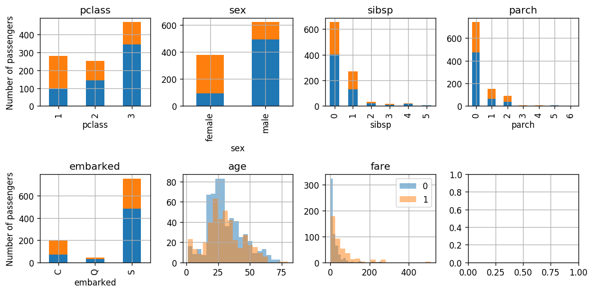
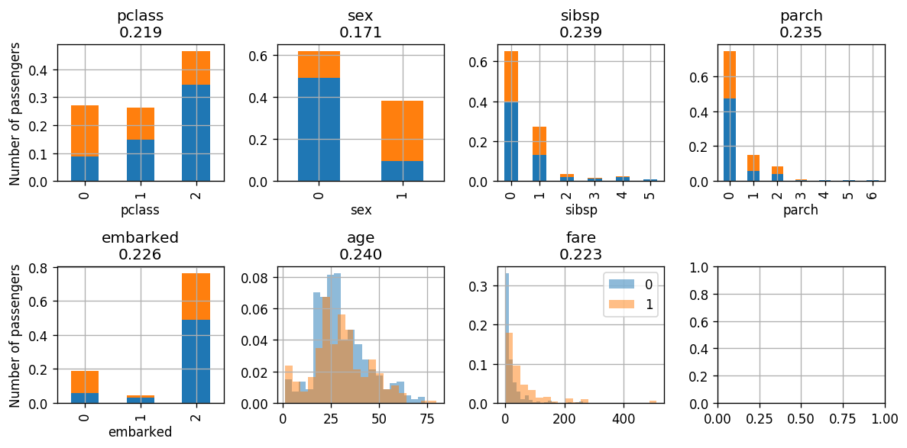
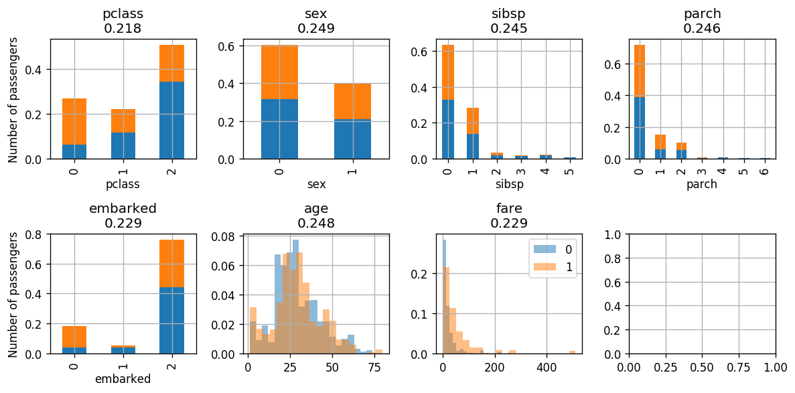
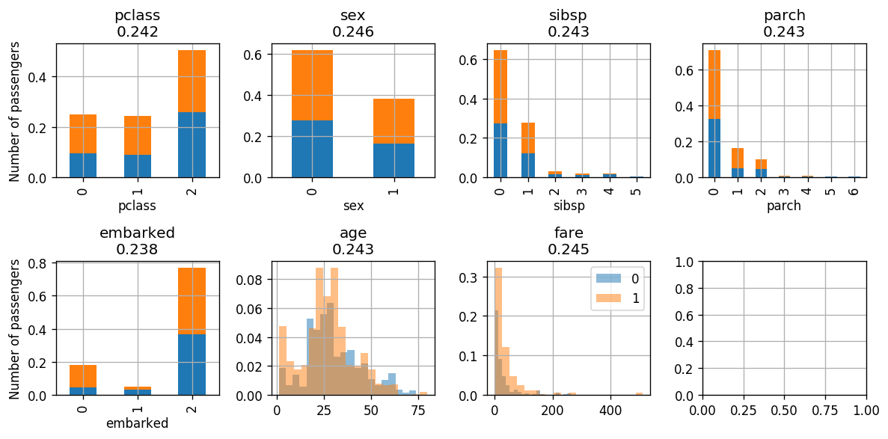
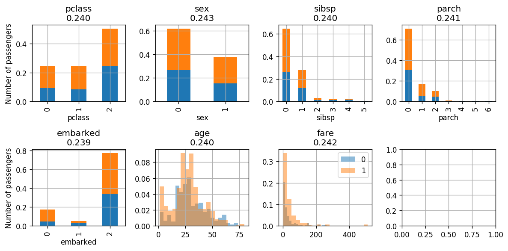

# תרגול 5 - K-NN ו Decision trees

<a href="./slides/" class="link-button" target="_blank">Slides</a>
<a href="/assets/tutorial04.pdf" class="link-button" target="_blank">PDF</a>
<a href="./code/" class="link-button" target="_blank">Code</a>

## תקציר התיאוריה

### בעיות סיווג

בעיות סיווג הם בעיות supervised learning שבהם הlabels (תוויות) וגבלות לסט סופי של ערכים.

- את ערכים השונים שאותם התוויות יכול לקבל מכונים **מחלקות**.
- נסמן את מספר המחלקות ב $C$.
- מקובל להשתמש בערכים 1 עד $C$ כך ש: $y\in\{1,2,\dots,C\}$.
- או 0 עד $C-1$ כך ש: $y\in\{0,1,\dots,C-1\}$.
- בעיות סיווג שבהם יש 2 מחלקות, $C=2$, מכוונות בעיות **סיווג בינארי**.
- ישנם מקרים ספציפים אותם נראה בהמשך הקורס שבהם נוח להשתמש במחלקות $1$ ו$-1$ כך ש: $y\in\{-1,1\}$

דוגמאות:

- מערכת לזיהוי הונאות בכרטיסי אשראי (כאשר אדם לא מורשה משתמש בכרטיס או מספר אשראי של אדם אחר). במקרה זה $\mathbf{x}$ יכול להיות וקטור אשר מכיל את מאפייני העיסקה, כגון מחיר, שעה, ומיקום, ו $text{y}$ יקבל אחד משני ערכים:
  - 1 - העסקה לגיטימית.
  - 2 - חשד להונאה.
- מערכת לעיבוד כתב יד (OCR). במקרה זה $\mathbf{x}$ יכול להיות לדוגמא תמונה של אות ו $\text{y}$ יהיה שווה למחלקה אשר מייצגת את האות בתמונה:
  - 1: a
  - 2: b
  - 3: c
  - ...

#### Misclassification rate

לרוב בבעיות סיווג לא תהיה משמעות למרחק בין החיזוי $\hat{y}$ לערך האימיתי של $y$. לדוגמא, בניסיון לזהות את האות $g$ חיזוי של האות $f$ (מופיע בצמוד ל$g$ באלף בית) הוא לא בהרכח חיזוי טוב יותר מ $q$ (אשר נמצאת רחוק יותר).

לכן לרוב בבעיות סיווג נבחר את פונקציית המחיר שלנו להיות פונקציית ה misclassification rate. פונקציית מחיר זו הינה מסוג פונקציית מחיר מסוג risk אשר משתמשת ב zero-one-loss אשר מוגדר באופן הבא:

$$
l(\hat{y},y)=I\{\hat{y}\neq y\}
$$

פונקציית ה לפונקציית ה risk שמתאימה ל loss זה קוראים misclassification rate:

$$
R(h)=\mathbb{E}\left[I\{h(\mathbf{x})\neq\text{y}\}\right]
$$

החזאי האופטימאלי של פונקציית מחיר / risk זה הינו החזאי אשר מחזיר את ה $\text{y}$ הכי סביר (הכי שכיח - ה mode) בהסתברות של $\text{y}$ בהינתן $\mathbf{x}$:

$$
h^*(\boldsymbol{x})=\underset{y}{\argmax}\ p(y|\mathbf{x}=\boldsymbol{x})
$$

### K-NN (K-Nearest Neighbours)

K-NN הינו אלגוריתם דיסקרימינטיבי לפתרון בעיות סיווג. באלגוריתם זה החיזויים נעשים ישירות על פי המדגם באופן הבא:

בהינתן $\boldsymbol{x}$ מסויים:

1. נבחר את $K$ הדגימות בעלות ה $\boldsymbol{x}^{(i)}$ הקרובים ביותר ל $\boldsymbol{x}$. (לרוב נשתמש במרחק אוקלידי, אך ניתן גם לבחור מדדים אחרים).
2. תוצאת החיזוי תהיה התווית השכיחה ביותר (majorety vote) מבין $K$ התוויות של הדגימות שנבחרו בשלב 1.

במקרה של שיוון:

- במקרה של שיוויון בשלב 2, נשווה גם את המרחק הממוצע בין ה $\boldsymbol{x}$-ים השייכים לכל תווית. אנו נבחר בתווית בעלת המרחק הממוצא הקצר יותר.
- במקרה של שיווון גם בין סכום המרחקים, נבחר אקראית.

#### K-NN לבעיות רגרסיה

ניתן להשתמש באלגוריתם זה גם לפתרון בעיות רגרסיה אם כי פתרון זה יהיה לרוב פחות יעיל. בבעיות רגרסיה ניתן למצע על התוויות במקום לבחור את תווית השכיחה.

### Decision trees (עצי החלטה)

עצי החלטה הם כלי נפוץ (גם מחוץ לתחום של מערכות לומדות) לקבלת החלטות על סמך אוסף של עובדות.

טרמינולוגיה:

- **root (שורש)** - נקודת הכניסה לעץ.
- **node (צומת)** - נקודות ההחלטה / פיצול של העץ - השאלות.
- **leaves (עלים)** - הקצוות של העץ - התשובות.

נוכל להשתמש בעצי החלטה שכאלה לבניית חזאים. לרוב נבחר את ה node להיות תנאי על אחד מרכיבים של $\boldsymbol{x}$. ספצפית:

- לרוב נשתמש בתנאי מהצורה $x_i>a$ בעבור $i$ מסויים ו $a$ מסויים שאותם נצטרך לבחור.
- כאשר $x_i$ הוא מתשנה דיסקרטי אשר מקבל סט קטן של ערכים נוכל גם לפצל לפי הערכים האפשריים של $x_i$.

לדוגמא

היתרונות של השימוש בעץ החלטה כחזאי:

1. פשוט למימוש (אוסף של תנאי if .. else ..).
2. מתאים לעבודה עם משתנים קטגוריים (שתנים בדדים אשר מקבלים אחד מסט מצומצם של ערכים).
3. Explainable - ניתן להבין בדיוק מה היו השיקולים שלפיהם התקבל חיזוי מסויים.

### בניית עץ החלטה לסיווג

#### מדדים לחוסר ההומוגניות של פילוג

בהינתן משתנה ארקאי דיסקרטי $\text{y}$ אשר מקבל אחד מ $C$ ערכים $y\in\{1,2,\dots,C\}$ ועם פינקציית הסתברות $p(y)$, נגדיר כמה מדדים אשר מודדים עד כמה הפילוג של $\text{y}$ רחוק מלהיות פילוג אשר מייצר דגימות הומוגניות, זאת אומרת פונקציית דלתא:

- שגיאת הסיווג (המתקבלת בעבור חיזוי של הערך הכי סביר)

    $$
    Q(p)=1-\max_{y\in\{1,\dots,C\}}p(y)
    $$

- אינדקס Gini:

    $$
    Q(p)=\sum_{y\in\{1,\dots,C\}}p(y)(1-p(y))
    $$

- אנטרופיה:

    $$
    Q(p)(=H(p))=\sum_{y\in\{1,\dots,C\}}-p(y)\log_2 p(y)
    $$

מדדים אלו שווים ל-0 בעבור פילוגים שאר מייצרים דגימות הומוגניות והם גדלים ככל שהפילוג הולך ונעשה אחיד. השרטוטים הבאים מראים את ההתנהגות של הממדים האלה במקרה של משתנה אקראי בינארי:

#### חוסר הומוגניות ממוצעת של עץ

בהינתן מדגם מסויים ומדד חוסר הומוגניות מסויים נגדיר את את הציון של עץ נתון באופן הבא:

1. נעביר את הדגימות מהמדגם דרך העץ ונפצל אותם על פי העלה שעליו הם הגיעו. נסמן את האינדקסים של הדגימות שהגיעו לעלה ה $j$ ב $\mathcal{I}_j$. נסמן את כמות הדגימות שהגיעו לעלה ה $j$ ב $N_j$.

2. לכל עלה נחשב את הפילוג האמפירי של התויות של הגיעו עליו באופן הבא:

    $$
    \hat{p}_{j,y}=\frac{1}{N_j}\sum_{i\in\mathcal{I}_j} I\{y_i=y\}
    $$

    ($p_{j,y}$ הוא פשוט השכיחות של הערך $y$ בעלה ה $j$)

3. בעזרת הפילוג האמפירי נחשב את חוסר ההומוגניות של כל עלה:

    $$
    Q(\hat{p}_j)
    $$

4. הציון הכולל של העץ יהיה הממוצע המושכלל של חוסר ההומוגניות של העלים ביחס לכמות הדגימות שהגיעה לכל עלה:

    $$
    Q_{\text{total}}=\sum_j \frac{N_j}{N}Q(\hat{p}_j)
    $$

#### שלב ראשון - בניה של עץ מלא

בכדי לקבל סיווג כמה שיותר טוב נרצה שהפליוג בעלים של העץ יהיו כמה שיותר הומוגניים, זאת אומרת שמדד חוסר הומוגניות יהיה 0. בכדי להימנע כמה שיותר מ overfitting נרצה לעשות זאת על ידי שימוש בכמה שפחות nodes.

מביוון שלפתור בעיה זו במדוייק דורש לעבור על כל העצים האפשריים, אנו נעשה זאת בצורה חמדנית (greedy). אנו נתחיל מה root ונוסיף על עץ nodes כך שבכל פעם אנו עוברים על כל האופציות שיש לבחירת ה node ובוחרים את זה אשר מניב את העץ עם מדד ההומוגניות הנמוך ביותר. ממשיכים לפצל את העלים של העץ כל עוד מדד החוסר הומוגניות יורד.

מלבד מקרים שבהם יש במדגם שתי דגימות עם אותו ה $\boldsymbol{x}$ אך $y$ שונה, יהיה ניתן להגיע למדד חוסר הומוגניות 0. זאת אומרת שבכל עלה יש דגימות עם תוויות מסוג אחד בלבד. תוצאת החיזוי תהיה ערך זה. במקרה שאנו נשארים עם תוויות עם יותר מערך אחד, נבחר את תצואת החיוזי להיות הערך השכיח.

#### שלב שני - pruning (גיזום)

בכדי להקטין את מידת ה overfitting של העץ ניתן להשתמש ב validation set על מנת לבצע pruning עץ באופן הבא:

מתחילים מכל אחד מהעלים ובודקים האם הסרה שלו משפרת את הביצועים על ה validation set. במידה וזה אכן המצב מסירים אותו ומעדכנים את העלה. ממשיכים כך עד שהביצועים על ה validation set מפסיקים להשתפר.

### Regression Tree

ניתן להשתמש בעצים גם לפתרון בעיות רגרסיה. במקרה של רגרסיה עם פונקציית מחיר של MSE, הבניה של העץ תהיה זהה מלבד שני הבדלים:

1. תוצאת החיזוי בעלה מסויים תהיה הערך הממוצע של התוויות באותו עלה. (במקום הערך השכיח)
2. את מדד החוסר הומוגניות נחליף בשגיאה הריבועית של החיזוי של העץ.

## תרגיל 5.1

סטודנט נבון ניגש לבחור אבטיחים בסופרמרקט. ידוע כי זוהי רק תחילתה של עונת האבטיחים וקיים מספר לא מבוטל של אבטיחי בוסר הסטודנט שם לב כי ניתן לאפיין את האבטיחים ע"פ ההד בהקשה וע"פ קוטר האבטיח. הסטודנט החליט למפות את ניסיון העבר שלו:

|    |   Radius |   Echo |   Sweetness |
|---:|---------:|-------:|------------:|
|  0 |        8 |      1 |          -1 |
|  1 |       10 |      2 |          -1 |
|  2 |        5 |      5 |           1 |
|  3 |        7 |      3 |           1 |
|  4 |        7 |      4 |          -1 |
|  5 |       10 |      4 |          -1 |
|  6 |       11 |      4 |          -1 |
|  7 |        7 |      5 |           1 |

הסטודנט מחזיק בידו האבטיח בעל בעוצמה 3 ורדיוס 8 ס"מ. על מנת לחזות האם שהאבטיח בידו מתוק או חמוץ נסנה חזאי בעזרת K-NN.

**1)** כיצד הפרמטר $K$ משפיע על השגיאה שאנו צופים לקבל? ממה תנבע השגיאה כאשר $K$ יהיה קטן וממה תנבע השגיאה כאשר $K$ יהיה גדול?

**2)** מה קורה במקרה שבו $K=8$? האם שגיאה זו היא שגיאת overfitting או underfitting?

**3)** השתמשו ב leave-one-out cross validation על מנת לקבוע את ה $K$ האופטימאלי מבין הערכים 1,3,5,7. השתמשו ב missclassification rate כפונקציית המחיר.

**4)** בחרו את ה $K$ האופטימאלי חשבו את החיזוי הסופי על סמך בחירה זו

### פתרון 5.1

#### 1)

כפי שראינו בהרצאה, כאשר $K$ יהיה קטן אנו למעשה מתאימים לכל נקודה ב train set איזור החלטה משלה. במצב זה החזאי יתן חיזוי מושלם על המדגם אך איזורי החלטה אלו אשר תלויים במקומים המקריים של נקודות בודדות לא בהכרח ייצגו את הפילוג האמיתי. זהו בדיוק המקרה של overfitting.

כאשר $K$ יהיה גדול מאד אנו למעשה נמצע על איזורים מאד גדולים ולכן החזאי יתעלם מהשינויים העדינים בפילוג של הנקודות ויתייחס רק למגה המאד כללית. זה בדיוק המצב של underfitting.

#### 2)

במקרה הקיצוני שבו $K$ שווה לגודל ה dataset כל חיזוי יתבצע על סמך כל הנקודות במדגם ולכן יהיה שווה תמיד לתווית השכיחה ביותר במדגם. במקרה זה החיזוי יהיה תמיד $-1$, זאת אומרת שהאבטיח חמוץ ללא תלות בהד וברדיוס.

#### 3)

בכדי לקבוע את הערך האופטימאלי של $K$ מתוך הערכים הנתונים בעזרת K-fold cross validation עלינו לחשב את ציון ה validation הממוצע לכל ערך של $K$. לשם כך עלינו לחשב את ציון ה validation לכל fold (שימוש בנקודה אחרת כvalidation). נרכז בטבלה את החיזוי המשוערך לכל fold ולכל $K$:

| point      | Correct label   | K=1 prediction   | K=3 prediction    | K=5 prediction        | K=7 prediction            |
|------------|-----------------|------------------|-------------------|-----------------------|---------------------------|
| 0          | -1              | ✓ -1 (nn=[1])    | ✓ -1 (nn=[1 3 4]) | ✓ -1 (nn=[1 3 4 5 7]) | ✓ -1 (nn=[1 3 4 5 7 6 2]) |
| 1          | -1              | ✓ -1 (nn=[5])    | ✓ -1 (nn=[5 0 6]) | ✓ -1 (nn=[5 0 6 3 4]) | ✓ -1 (nn=[5 0 6 3 4 7 2]) |
| 2          | 1               | ✓ 1 (nn=[7])     | ✓ 1 (nn=[7 4 3])  | ✗ -1 (nn=[7 4 3 0 5]) | ✗ -1 (nn=[7 4 3 0 5 1 6]) |
| 3          | 1               | ✗ -1 (nn=[4])    | ✗ -1 (nn=[4 7 0]) | ✗ -1 (nn=[4 7 0 2 1]) | ✗ -1 (nn=[4 7 0 2 1 5 6]) |
| 4          | -1              | ✗ 1 (nn=[3])     | ✗ 1 (nn=[3 7 2])  | ✗ 1 (nn=[3 7 2 5 0])  | ✓ -1 (nn=[3 7 2 5 0 1 6]) |
| 5          | -1              | ✓ -1 (nn=[6])    | ✓ -1 (nn=[6 1 4]) | ✓ -1 (nn=[6 1 4 3 7]) | ✓ -1 (nn=[6 1 4 3 7 0 2]) |
| 6          | -1              | ✓ -1 (nn=[5])    | ✓ -1 (nn=[5 1 4]) | ✓ -1 (nn=[5 1 4 3 7]) | ✓ -1 (nn=[5 1 4 3 7 0 2]) |
| 7          | 1               | ✗ -1 (nn=[4])    | ✓ 1 (nn=[4 2 3])  | ✗ -1 (nn=[4 2 3 5 0]) | ✗ -1 (nn=[4 2 3 5 0 6 1]) |
| Avg. score |                 | 3/8              | 2/8               | 4/8                   | 3/8                       |

ניתן לראות כי בעבור $K=3$ אנו מקבלים את השגיאה הממוצעת הקטנה ביותר $2/8$ לכן נקבע את $K$ לערך זה.

#### 4)

נבדוק את בשלות האבטיח שהסטודנט מחזיק בידו על סמך המדגם כולו עם $K=3$. שלושת הנקודות הקרובות ביותר לנקודה $(8,3)$ הינם הנקודות $0$, $3$ ו $4$. מכיוון ששתיים מהם עם תווית של $-1$ אנו נחזה שאבטיח זה חמוץ.

## שאלה 5.2 – בניית עץ החלטה

בנה עץ החלטה המבוסס על קריטריון האנטרופיה, אשר בהינתן נתוני צבע שער, גובה, משקל, משתמש בקרם הגנה, קובע האם עתיד האדם להכוות מהשמש היוקדת.  
סט דוגמאות הלימוד לצורך בניית העץ מוצג בטבלה הבאה:

| Hair    | Height  | Weight    | Lotion | Result (Label)       |
| ------- | ------- | --------- | ------ | -------------------- |
| blonde  | average | light     | no     | sunburned (positive) |
| blonde  | tall    | average   | yes    | none (negative)      |
| brown   | short   | average   | yes    | none                 |
| blonde  | short   | average   | no     | sunburned            |
| red     | average | heavy     | no     | sunburned            |
| brown   | tall    | heavy     | no     | none                 |
| brown   | average | heavy     | no     | none                 |
| blonde  | short   | light     | yes    | none                 |

### פתרון 5.2

נפעל על פי האלגוריתם ונתחיל מה root ונתחיל להוסיף nodes:

במקרה זה יש לנו 4 nodes אפשריים (בעבור כל שדה של $\boldsymbol{x}$). נחשב את האמטרופיה הממוצעת של כל אחד מהם ונבחר את המינימאלי.

##### Hair

נעביר את המדגם דרך העץ ונרכז בטבלה הבאה את התוויות ואנטרופיה המתקבלות בכל עלה:

|         | Leaf ($j$) | $N_j$ | $\hat{p}_j$                     | $H(\hat{p}_j)$                                                      |
| ------- | ---------- | ----- |-------------------------------- | ------------------------------------------------------------------- |
| Blonde  | 1          | 4     | $\{\tfrac{2}{4},\tfrac{2}{4}\}$ | $-\tfrac{1}{2}\log{\tfrac{1}{2}}-\tfrac{1}{2}\log{\tfrac{1}{2}}=1 $ |
| Brown   | 2          | 3     | $\{\tfrac{0}{3},\tfrac{3}{3}\}$ | $-0\log(0)-1\log(1)=0$                                              |
| Red     | 3          | 1     | $\{\tfrac{1}{1},\tfrac{0}{1}\}$ | $-1\log(1)-0\log(0)=0$                                              |

נחשב את הממוצע הממושקל של האנטופיה על שלושת העלים:

$$
Q_{\text{total}}=\sum_j \frac{N_j}{N}Q(\hat{p}_j)=\frac{4}{8}\cdot 1+\frac{3}{8}\cdot 0+\frac{1}{8}\cdot 0=\frac{1}{2}
$$

נמשיך לשדה הבא.

##### Height

|         | Leaf ($j$) | $N_j$ | $\hat{p}_j$                     | $H(\hat{p}_j)$                                                         |
| ------- | ---------- | ----- |-------------------------------- | ---------------------------------------------------------------------- |
| Short   | 1          | 2     | $\{\tfrac{1}{2},\tfrac{1}{2}\}$ | $-\tfrac{1}{2}\log{\tfrac{1}{2}}-\tfrac{1}{2}\log{\tfrac{1}{2}}=1$     |
| Tall    | 3          | 3     | $\{\tfrac{1}{3},\tfrac{2}{3}\}$ | $-\tfrac{1}{3}\log{\tfrac{1}{3}}-\tfrac{2}{3}\log{\tfrac{2}{3}}=0.918$ |
| Average | 2          | 3     | $\{\tfrac{2}{3},\tfrac{1}{3}\}$ | $-\tfrac{2}{3}\log{\tfrac{2}{3}}-\tfrac{1}{3}\log{\tfrac{1}{3}}=0.918$ |

$$
Q_{\text{total}}=\sum_j \frac{N_j}{N}Q(\hat{p}_j)=\frac{2}{8}\cdot 1+\frac{3}{8}\cdot 0.918+\frac{3}{8}\cdot 0.918=0.69
$$

##### Weight

|         | Leaf ($j$) | $N_j$ | $\hat{p}_j$                     | $H(\hat{p}_j)$                                                         |
| ------- | ---------- | ----- |-------------------------------- | ---------------------------------------------------------------------- |
| Light   | 1          | 2     | $\{\tfrac{1}{2},\tfrac{1}{2}\}$ | $-\tfrac{1}{2}\log{\tfrac{1}{2}}-\tfrac{1}{2}\log{\tfrac{1}{2}}=1$     |
| Average | 2          | 3     | $\{\tfrac{1}{3},\tfrac{2}{3}\}$ | $-\tfrac{1}{3}\log{\tfrac{1}{3}}-\tfrac{2}{3}\log{\tfrac{2}{3}}=0.918$ |
| Heavy   | 3          | 3     | $\{\tfrac{1}{3},\tfrac{2}{3}\}$ | $-\tfrac{1}{3}\log{\tfrac{1}{3}}-\tfrac{2}{3}\log{\tfrac{2}{3}}=0.918$ |

$$
Q_{\text{total}}=\sum_j \frac{N_j}{N}Q(\hat{p}_j)=\frac{2}{8}\cdot 1+\frac{3}{8}\cdot 0.918+\frac{3}{8}\cdot 0.918=0.9385
$$

##### Lotion

|     | Leaf ($j$) | $N_j$ | $\hat{p}_j$                     | $H(\hat{p}_j)$                                                         |
| --- | ---------- | ----- |-------------------------------- | ---------------------------------------------------------------------- |
| No  | 1          | 5     | $\{\tfrac{3}{5},\tfrac{2}{5}\}$ | $-\tfrac{3}{5}\log{\tfrac{3}{5}}-\tfrac{2}{5}\log{\tfrac{2}{5}}=0.97$     |
| Yes | 2          | 3     | $\{\tfrac{1}{3},\tfrac{2}{3}\}$ | $-\tfrac{1}{3}\log{\tfrac{1}{3}}-\tfrac{2}{3}\log{\tfrac{2}{3}}=0.918$ |

$$
Q_{\text{total}}=\sum_j \frac{N_j}{N}Q(\hat{p}_j)=\frac{5}{8}\cdot 0.97+\frac{3}{8}\cdot 0.918=0.606
$$

מכאן שהמאפיין האופטימלי לפיצול הראשון (על פי קריטריון האנטרופיה) הוא **Hair**. ולכן נבחר בו להיות ה node הראשון. נשים לב גם כי בעבור node זה שני הפילוצים של brown ו red כבר הומוגניים לגמרי (מכילים רק סוג אחד של תוויות) ולכן לא נמשיך לפצל אותם ונרשום את החיזוי המקבל בכל עלה:

נמשיך כעת באופן דומה לבחור את ה node בעבור הענף של blond. מכיוון שאין טעם לבדוק שוב את ה node של hair נשאר לנו לבדוק רק את שלושת האופציות הנותרות. לשם הנוחות נציג את הדגימות האשר מגיעות לענף זה:

| Height  | Weight  | Lotion | Result    |
| ------- | ------- | ------ | --------- |
| average | light   | no     | sunburned |
| tall    | average | yes    | none      |
| short   | average | no     | sunburned |
| short   | light   | yes    | none      |

##### Height

בכדי לבחור את ה node האופטימאלי נוכל להתעלם מכל מה שקורה בענפים אחרים ולחשב רק את האנטרופיה המתקבלת בענף הזה (של ה blond).

|         | Leaf ($j$) | $N_j$ | $\hat{p}_j$                     | $H(\hat{p}_j)$                                                     |
| ------- | ---------- | ----- |-------------------------------- | ------------------------------------------------------------------ |
| Short   | 1          | 2     | $\{\tfrac{1}{2},\tfrac{1}{2}\}$ | $-\tfrac{1}{2}\log{\tfrac{1}{2}}-\tfrac{1}{2}\log{\tfrac{1}{2}}=1$ |
| Tall    | 3          | 1     | $\{\tfrac{0}{1},\tfrac{1}{1}\}$ | $-1\log(1)-0\log(0)=1$                                             |
| Average | 2          | 1     | $\{\tfrac{0}{1},\tfrac{1}{1}\}$ | $-0\log(0)-1\log(1)=0$                                             |

$$
Q_{\text{blond}}=\sum_j \frac{N_j}{N}Q(\hat{p}_j)=\frac{2}{8}\cdot 1+\frac{1}{8}\cdot 0+\frac{1}{8}\cdot 0=0.25
$$

##### Weight

|         | Leaf ($j$) | $N_j$ | $\hat{p}_j$                     | $H(\hat{p}_j)$                                                     |
| ------- | ---------- | ----- |-------------------------------- | ------------------------------------------------------------------ |
| Light   | 1          | 2     | $\{\tfrac{1}{2},\tfrac{1}{2}\}$ | $-\tfrac{1}{2}\log{\tfrac{1}{2}}-\tfrac{1}{2}\log{\tfrac{1}{2}}=1$ |
| Average | 2          | 2     | $\{\tfrac{1}{2},\tfrac{1}{2}\}$ | $-\tfrac{1}{2}\log{\tfrac{1}{2}}-\tfrac{1}{2}\log{\tfrac{1}{2}}=1$ |
| Heavy   | 3          | 0     |                                 |                                                                    |

$$
Q_{\text{total}}=\sum_j \frac{N_j}{N}Q(\hat{p}_j)=\frac{2}{8}\cdot 1+\frac{2}{8}\cdot 1=0.5
$$

##### Lotion

|     | Leaf ($j$) | $N_j$ | $\hat{p}_j$                     | $H(\hat{p}_j)$         |
| --- | ---------- | ----- |-------------------------------- | ---------------------- |
| No  | 1          | 2     | $\{\tfrac{2}{2},\tfrac{0}{2}\}$ | $-1\log(1)-0\log(0)=0$ |
| Yes | 2          | 2     | $\{\tfrac{0}{2},\tfrac{2}{2}\}$ | $-0\log(0)-1\log(1)=0$ |

$$
Q_{\text{total}}=\sum_j \frac{N_j}{N}Q(\hat{p}_j)=\frac{2}{8}\cdot 0+\frac{2}{8}\cdot 0=0
$$

פיצול זה נותן אנטרופיה 0 ולכן הוא הפיצול האופטימאלי ואנו נבחר בו. עץ ההחלטה הסופי יראה אם כן:

## תרגיל 5.3

נתון המדגם הבא של ערכי תצפית של $\mathbf{x}=[\text{x}_1,\text{x}_2,\text{x}_3]^{\top}$ ושל תוויות $\text{y}$:

|   | $\text{x}_1$ | $\text{x}_2$ | $\text{x}_3$ | $\text{y}$ |
| - | ------------ | ------------ | ------------ | ---------- |
| 1 |  1           |  1           | -1           |  1         |
| 2 |  1           | -1           | -1           |  1         |
| 3 | -1           | -1           | -1           |  1         |
| 4 | -1           | -1           | -1           | -1         |
| 5 |  1           |  1           |  1           | -1         |

נרצה לבנות עץ החלטה על מנת לחזות את $\text{y}$ על סמך $\mathbf{x}$. נרצה אבל להשתמש במדד חוסר הומגניות חדש מסוג Squared Root Gini אשר מוגדר באופן הבא:

$$
Q(p)=\sum_y\sqrt{p(y)(1-p(y)}
$$

**1)** בנו עץ מלא על סמך קריטריון זה. כמה nodes יש בעץ שמצאתם.

**2)** חשבו את הציון (score) של עץ זה תחת פונקציית המחיר של misclassification rate. האם ניתן להגיע לסיווג מושלם במקרה זה?

**3)** האם בעבור מקרה זה ניתן לבנות עץ אשר מגיע לאותו ציון כמו העץ שמצאתם בסעיף 1 אך עם פחות nodes? אם כן, הציעו סיבה אפשריות למה האלגוריתם בו השתמשתם בסעיף הקודם לא מצא את העץ הזה.

#### פתרון 5.3

#### 1)

נתחיל מה root ונבדוק את שלושת ה nodes האפשריים תחת מדד השגיאה החדש:

##### $\text{x}_1$

|    | Leaf ($j$) | $N_j$ | $\hat{p}_j$                     | $Q(\hat{p}_j)$                                |
| -- | ---------- | ----- |-------------------------------- | --------------------------------------------- |
|  1 | 1          | 3     | $\{\tfrac{2}{3},\tfrac{1}{3}\}$ | $2\sqrt{\tfrac{2}{3}\tfrac{1}{3}}=0.47$ |
| -1 | 2          | 2     | $\{\tfrac{1}{2},\tfrac{1}{2}\}$ | $2\sqrt{\tfrac{1}{2}\tfrac{1}{2}}=0.5$        |

$$
Q_{\text{total}}=\frac{3}{5}\cdot 0.47+\frac{2}{5}\cdot 0.5=0.48
$$

##### $\text{x}_2$

נשים לב ש node זה נותן חלוקה דומה של התוויות לזו של $\text{x}_1$ ולכן נקבל את אותו ערך המדד של $0.48$.

##### $\text{x}_3$

|    | Leaf ($j$) | $N_j$ | $\hat{p}_j$                     | $Q(\hat{p}_j)$                          |
| -- | ---------- | ----- |-------------------------------- | --------------------------------------- |
|  1 | 1          | 4     | $\{\tfrac{3}{4},\tfrac{1}{4}\}$ | $2\sqrt{\tfrac{3}{4}\tfrac{1}{4}}=0.43$ |
| -1 | 2          | 1     | $\{\tfrac{0}{1},\tfrac{1}{1}\}$ | $2\sqrt{0\cdot 1}=0$                    |

$$
Q_{\text{total}}=\frac{4}{5}\cdot 0.43+\frac{1}{5}\cdot 0=0.35
$$

נכן נבחר את ה node הראשון להיות התנאי על $\text{x}_3$. מכיוון שהענף של $-1$ כבר הומוגני לא נחלק אותו יותר:

הדגימות הרלוונטיות כרגע הם:

|   | $\text{x}_1$ | $\text{x}_2$ | $\text{y}$ |
| - | ------------ | ------------ | ---------- |
| 1 |  1           |  1           |  1         |
| 2 |  1           | -1           |  1         |
| 3 | -1           | -1           |  1         |
| 4 | -1           | -1           | -1         |

נבדוק את שני השדות שנותרו:

##### $\text{x}_1$

|    | Leaf ($j$) | $N_j$ | $\hat{p}_j$                     | $Q(\hat{p}_j)$                         |
| -- | ---------- | ----- |-------------------------------- | -------------------------------------- |
|  1 | 1          | 2     | $\{\tfrac{2}{2},\tfrac{0}{2}\}$ | $2\sqrt{1\cdot0}=0$                    |
| -1 | 2          | 2     | $\{\tfrac{1}{2},\tfrac{1}{2}\}$ | $2\sqrt{\tfrac{1}{2}\tfrac{1}{2}}=0.5$ |

$$
Q_{\text{branch}}=\frac{2}{5}\cdot 0+\frac{2}{5}\cdot 0.5=0.2
$$

##### $\text{x}_2$

|    | Leaf ($j$) | $N_j$ | $\hat{p}_j$                     | $Q(\hat{p}_j)$                          |
| -- | ---------- | ----- |-------------------------------- | --------------------------------------- |
|  1 | 1          | 1     | $\{\tfrac{1}{1},\tfrac{0}{1}\}$ | $2\sqrt{1\cdot0}=0$                     |
| -1 | 2          | 3     | $\{\tfrac{2}{3},\tfrac{1}{3}\}$ | $2\sqrt{\tfrac{2}{3}\tfrac{1}{3}}=0.47$ |

$$
Q_{\text{branch}}=\frac{1}{5}\cdot 0+\frac{3}{5}\cdot 0.47=0.28
$$

ה node האופטימאלי כאן הוא הפיצול לפי $\text{x}_1$ ונשים לב שהענף של $1$ כבר הומוגני:

כאשר הדגימות הרלוונטיות הם

|   | $\text{x}_2$ | $\text{y}$ |
| - | ------------ | ---------- |
| 3 | -1           |  1         |
| 4 | -1           | -1         |

במקרה זה למרות שלא הגענו לפילוג הומוגני לא נוכל לפצל יותר את הענף כי הערכים של $\text{x}_2$ זהים בעבור שני הדגימות ולכן לא ניתן להבחין בינהם. במקרה זה נחבר את החיזוי באופן שרירותי להיות $1$ ונסיים את הבניה של העץ:

בעץ שמצאנו ישנם 2 nodes.

#### 2)

בעבור העלה אשר הפילוג של התגיות בהם הינו הומוגני החיזוי יהיה מושלם. שגיאות החיזוי יתקבול רק בעלה של $\text{x}_3=\text{2}=-1$ אשר לא הצליח להגיע לפילוג הומוגני. מכיוון שבחרו באופן שרירותי שהחיזוי בעלה זה יהיה 1 הדגימה יחידה אשר תסווג לא נכון היא דגימה 4. מכאן שהחזאי שבנינו יעשה על המדגם שגיאה אחת מתוך 5, זאת אומרת misclassification rate של $1/5=0.2$.

כפי שציינו קודם, מכיוון שלדגימות 3 ו 4 יש את אותם מדידות $\boldsymbol{x}$ אך $y$ שונה לא ניתן להפריד בניהם ותמיד על אחד מהם החיזוי יהיה לא נכון. לכן הציון של $0.2$ הוא הציון המינמאלי שאותו ניתן לקבל על המדגם הזה.

#### 3)

נשים לב שלמעשה ה node השני בעץ לא עושה כלום משום שללא תלות בערך של $\text{x}_2$ הוא חוזה $1$ ולכן ניתן באותה המידה להשתמש גם בעץ הבא:

הסיבה שהאלגוריתם לא התכנס לפיתרון זה הינה שבבניה של העץ ניסינו למזער את מדד ה squared root gini הממוצע ולא את שגיאת החיזוי ומכיוון שאלו שתי בעיות שונות וגם הפתרונות שלהם יכולים להיות שונים.

## חלק מעשי - זה כרגע Ada boost צריך לשנות לעצים

### האתגר: בחזרה לטיטניק

ננסה לחזות האם נוסע בטיטניק ישרוד או לא על סמך רישום ונתונים של הנוסעים.

### Dataset: The Titanic Manifest
ניתן להוריד את הdataset מהקישור [הזה](http://biostat.mc.vanderbilt.edu/wiki/pub/Main/DataSets/titanic.html)

### 🕵️ Data Inspection
התרשמות ראשונית ממאגר המידע, עשר שורות ראשונות מהרשומות:

<table border="1" class="dataframe">
  <thead>
    <tr style="text-align: right;">
      <th></th>
      <th>pclass</th>
      <th>survived</th>
      <th>name</th>
      <th>sex</th>
      <th>age</th>
      <th>sibsp</th>
      <th>parch</th>
      <th>ticket</th>
      <th>fare</th>
      <th>cabin</th>
      <th>embarked</th>
      <th>boat</th>
      <th>body</th>
      <th>home.dest</th>
      <th>numeric_sex</th>
    </tr>
  </thead>
  <tbody>
    <tr>
      <th>0</th>
      <td>1</td>
      <td>1</td>
      <td>Allen, Miss. Elisabeth Walton</td>
      <td>female</td>
      <td>29</td>
      <td>0</td>
      <td>0</td>
      <td>24160</td>
      <td>211.3375</td>
      <td>B5</td>
      <td>S</td>
      <td>2</td>
      <td>NaN</td>
      <td>St Louis, MO</td>
      <td>1</td>
    </tr>
    <tr>
      <th>1</th>
      <td>1</td>
      <td>0</td>
      <td>Allison, Miss. Helen Loraine</td>
      <td>female</td>
      <td>2</td>
      <td>1</td>
      <td>2</td>
      <td>113781</td>
      <td>151.5500</td>
      <td>C22 C26</td>
      <td>S</td>
      <td>NaN</td>
      <td>NaN</td>
      <td>Montreal, PQ / Chesterville, ON</td>
      <td>1</td>
    </tr>
    <tr>
      <th>2</th>
      <td>1</td>
      <td>0</td>
      <td>Allison, Mr. Hudson Joshua Creighton</td>
      <td>male</td>
      <td>30</td>
      <td>1</td>
      <td>2</td>
      <td>113781</td>
      <td>151.5500</td>
      <td>C22 C26</td>
      <td>S</td>
      <td>NaN</td>
      <td>135.0</td>
      <td>Montreal, PQ / Chesterville, ON</td>
      <td>0</td>
    </tr>
    <tr>
      <th>3</th>
      <td>1</td>
      <td>0</td>
      <td>Allison, Mrs. Hudson J C (Bessie Waldo Daniels)</td>
      <td>female</td>
      <td>25</td>
      <td>1</td>
      <td>2</td>
      <td>113781</td>
      <td>151.5500</td>
      <td>C22 C26</td>
      <td>S</td>
      <td>NaN</td>
      <td>NaN</td>
      <td>Montreal, PQ / Chesterville, ON</td>
      <td>1</td>
    </tr>
    <tr>
      <th>4</th>
      <td>1</td>
      <td>1</td>
      <td>Anderson, Mr. Harry</td>
      <td>male</td>
      <td>48</td>
      <td>0</td>
      <td>0</td>
      <td>19952</td>
      <td>26.5500</td>
      <td>E12</td>
      <td>S</td>
      <td>3</td>
      <td>NaN</td>
      <td>New York, NY</td>
      <td>0</td>
    </tr>
    <tr>
      <th>5</th>
      <td>1</td>
      <td>1</td>
      <td>Andrews, Miss. Kornelia Theodosia</td>
      <td>female</td>
      <td>63</td>
      <td>1</td>
      <td>0</td>
      <td>13502</td>
      <td>77.9583</td>
      <td>D7</td>
      <td>S</td>
      <td>10</td>
      <td>NaN</td>
      <td>Hudson, NY</td>
      <td>1</td>
    </tr>
    <tr>
      <th>6</th>
      <td>1</td>
      <td>0</td>
      <td>Andrews, Mr. Thomas Jr</td>
      <td>male</td>
      <td>39</td>
      <td>0</td>
      <td>0</td>
      <td>112050</td>
      <td>0.0000</td>
      <td>A36</td>
      <td>S</td>
      <td>NaN</td>
      <td>NaN</td>
      <td>Belfast, NI</td>
      <td>0</td>
    </tr>
    <tr>
      <th>7</th>
      <td>1</td>
      <td>1</td>
      <td>Appleton, Mrs. Edward Dale (Charlotte Lamson)</td>
      <td>female</td>
      <td>53</td>
      <td>2</td>
      <td>0</td>
      <td>11769</td>
      <td>51.4792</td>
      <td>C101</td>
      <td>S</td>
      <td>D</td>
      <td>NaN</td>
      <td>Bayside, Queens, NY</td>
      <td>1</td>
    </tr>
    <tr>
      <th>8</th>
      <td>1</td>
      <td>0</td>
      <td>Artagaveytia, Mr. Ramon</td>
      <td>male</td>
      <td>71</td>
      <td>0</td>
      <td>0</td>
      <td>PC 17609</td>
      <td>49.5042</td>
      <td>NaN</td>
      <td>C</td>
      <td>NaN</td>
      <td>22.0</td>
      <td>Montevideo, Uruguay</td>
      <td>0</td>
    </tr>
    <tr>
      <th>9</th>
      <td>1</td>
      <td>0</td>
      <td>Astor, Col. John Jacob</td>
      <td>male</td>
      <td>47</td>
      <td>1</td>
      <td>0</td>
      <td>PC 17757</td>
      <td>227.5250</td>
      <td>C62 C64</td>
      <td>C</td>
      <td>NaN</td>
      <td>124.0</td>
      <td>New York, NY</td>
      <td>0</td>
    </tr>
  </tbody>
</table>

סה"כ ישנם $$N=1001$$ רשומות במאגר מידע.

### The Data Fields and Types
נעשה שימוש בשדות (מאפיינים) הבאים:
- **pclass**: מחלקת הנוסע: 1, 2 או 3
- **sex**: מין הנוסע
- **age**: גיל הנוסע
- **sibsp**: מס' של אחים ובני זוג של כל נוסע על האוניה
- **parch**: מס' של ילדים או הורים של כל נוסע על האונייה
- **fare**: המחיר שהנוסע שילם על הכרטיס
- **embarked**: הנמל בו עלה הנוסע על האונייה (C = Cherbourg; Q = Queenstown; S = Southampton)
- **survived**: התיוג, האם הנוסע שרד או לא

###  📉 התרשמות ראשונית בעזרת גרפים 
נציג את היחס בין המחלקות (שורדים ונספים) עבור המאפיינים:  

{: width="400px"}

## 📜 הגדרת הבעיה :#

- משתנים אקראיים:
  - $$ x_i $$ : מאפייני הנוסע
  - $$ y_i $$ : תיוג הנוסע, שרד או נספה
  
נמצא מסווג $$\hat{y}=h^*\left(\boldsymbol{x}\right)$$ אשר מביא למינימום את ה- miscalssification rate:

$$
h^*=\underset{h}{\arg\min}\ E\left[I\left\lbrace h\left(\boldsymbol{x}\right)\neq y\right\rbrace\right]
$$

### 💡 Model & Learning Method Suggestion: Stumps + AdaBoost
 .נשתמש בעץ בינארי בעל עומק אחד (נקרא Stump), שבעצם מסווג על פי מאפיין בודד בשילוב של אלגוריתם AdaBoost
 
 **הערה:** ניתן להגיד שהשילוב הנ"ל הוא וריאציה של Random Forest, אלגוריתם שמשלב מספר עצים. כמו כן הטכניקה הזאת נקראת גם Ensemble.
 
 עבור קריטריון בניית עץ נשתמש ב**Gini אינדקס ממושקל** הנובע מה-data הממושקל.
 עבור חלוקה של ה-data לשני סטים $$\mathcal{C}_1$$ and $$\mathcal{C}_2$$ , וסט המשקולות של הדגימות $$\left\lbrace w_i\right\rbrace$$ נקבל את Gini אינדקס ממושקל:  
 
$$
N_1=\sum_{i\in\mathcal{C}_1}w_i\\
N_2=\sum_{i\in\mathcal{C}_2}w_i\\
p_1=\frac{1}{N_1}\sum_{i\in\mathcal{C}_1}w_iI\left\lbrace y_i=1\right\rbrace\\
p_2=\frac{1}{N_2}\sum_{i\in\mathcal{C}_2}w_iI\left\lbrace y_i=1\right\rbrace\\
G=N_1p_1\left(1-p_1\right)+N_2p_2\left(1-p_2\right)
$$

### פרמטרים נלמדים:

- החלוקה המתבצעת על ידי כל עץ.
- משקול כל עץ: $$\alpha_i$$.

### Hyper-parameters
ההיפר פרמטרי היחידי הינו קריטריון העצירה עבור אלגוריתם Adaboost שעבורו מוחלט מס' עצי ההחלטה שמשולבים במסווג הסופי.

### 📚 חלוקת ה-dataset
נחלק ל 80% סט אימון ו 20% סט בוחן.

### ⚙️ אימון 

נאתחל את המודל ונציג את עשר השורות הראשונות של הdataset הממושקל וההתפלגות לפי המאפיינים:

<table border="1" class="dataframe">
  <thead>
    <tr style="text-align: right;">
      <th></th>
      <th>age</th>
      <th>embarked</th>
      <th>fare</th>
      <th>parch</th>
      <th>pclass</th>
      <th>sex</th>
      <th>sibsp</th>
      <th>survived</th>
      <th>weights</th>
    </tr>
  </thead>
  <tbody>
    <tr>
      <th>724</th>
      <td>11</td>
      <td>2</td>
      <td>46.9000</td>
      <td>2</td>
      <td>2</td>
      <td>0</td>
      <td>5</td>
      <td>0</td>
      <td>0.001252</td>
    </tr>
    <tr>
      <th>77</th>
      <td>27</td>
      <td>2</td>
      <td>30.5000</td>
      <td>0</td>
      <td>0</td>
      <td>0</td>
      <td>0</td>
      <td>1</td>
      <td>0.001252</td>
    </tr>
    <tr>
      <th>879</th>
      <td>6</td>
      <td>2</td>
      <td>21.0750</td>
      <td>1</td>
      <td>2</td>
      <td>0</td>
      <td>3</td>
      <td>0</td>
      <td>0.001252</td>
    </tr>
    <tr>
      <th>615</th>
      <td>22</td>
      <td>2</td>
      <td>7.2500</td>
      <td>0</td>
      <td>2</td>
      <td>0</td>
      <td>1</td>
      <td>0</td>
      <td>0.001252</td>
    </tr>
    <tr>
      <th>905</th>
      <td>24</td>
      <td>2</td>
      <td>8.6625</td>
      <td>0</td>
      <td>2</td>
      <td>0</td>
      <td>0</td>
      <td>0</td>
      <td>0.001252</td>
    </tr>
    <tr>
      <th>533</th>
      <td>42</td>
      <td>2</td>
      <td>7.5500</td>
      <td>0</td>
      <td>2</td>
      <td>0</td>
      <td>0</td>
      <td>0</td>
      <td>0.001252</td>
    </tr>
    <tr>
      <th>401</th>
      <td>50</td>
      <td>2</td>
      <td>13.0000</td>
      <td>0</td>
      <td>1</td>
      <td>0</td>
      <td>0</td>
      <td>0</td>
      <td>0.001252</td>
    </tr>
    <tr>
      <th>454</th>
      <td>39</td>
      <td>2</td>
      <td>26.0000</td>
      <td>0</td>
      <td>1</td>
      <td>0</td>
      <td>0</td>
      <td>0</td>
      <td>0.001252</td>
    </tr>
    <tr>
      <th>31</th>
      <td>58</td>
      <td>2</td>
      <td>26.5500</td>
      <td>0</td>
      <td>0</td>
      <td>1</td>
      <td>0</td>
      <td>1</td>
      <td>0.001252</td>
    </tr>
    <tr>
      <th>358</th>
      <td>18</td>
      <td>2</td>
      <td>13.0000</td>
      <td>0</td>
      <td>1</td>
      <td>0</td>
      <td>0</td>
      <td>0</td>
      <td>0.001252</td>
    </tr>
  </tbody>
</table>

{: width="600px"}

אינדקס Gini המושקלל מצויין בכותרת של כל גרף. בכל איטרציה של Adaboost נבחר את העץ שיפעל על המאפיין בעל האינדקס הנמוך ביותר. כאשר במקרה זה נבחר לפי **מין** הנוסע.

#### Iteration: $$t=1$$
לאחר איטרציה בודדת של סיווג לפי מין קיבלנו:
* שגיאה: 0.22
* $$\alpha$$: 0.6320312618746508
* Classifing sex according to: {0: [0], 1: [1]}

 נציג את המשוקל של ה-data מחדש, וההתפלגויות החדשות:

<table border="1" class="dataframe">
  <thead>
    <tr style="text-align: right;">
      <th></th>
      <th>age</th>
      <th>embarked</th>
      <th>fare</th>
      <th>parch</th>
      <th>pclass</th>
      <th>sex</th>
      <th>sibsp</th>
      <th>survived</th>
      <th>weights</th>
    </tr>
  </thead>
  <tbody>
    <tr>
      <th>724</th>
      <td>11</td>
      <td>2</td>
      <td>46.9000</td>
      <td>2</td>
      <td>2</td>
      <td>0</td>
      <td>5</td>
      <td>0</td>
      <td>0.000803</td>
    </tr>
    <tr>
      <th>77</th>
      <td>27</td>
      <td>2</td>
      <td>30.5000</td>
      <td>0</td>
      <td>0</td>
      <td>0</td>
      <td>0</td>
      <td>1</td>
      <td>0.002841</td>
    </tr>
    <tr>
      <th>879</th>
      <td>6</td>
      <td>2</td>
      <td>21.0750</td>
      <td>1</td>
      <td>2</td>
      <td>0</td>
      <td>3</td>
      <td>0</td>
      <td>0.000803</td>
    </tr>
    <tr>
      <th>615</th>
      <td>22</td>
      <td>2</td>
      <td>7.2500</td>
      <td>0</td>
      <td>2</td>
      <td>0</td>
      <td>1</td>
      <td>0</td>
      <td>0.000803</td>
    </tr>
    <tr>
      <th>905</th>
      <td>24</td>
      <td>2</td>
      <td>8.6625</td>
      <td>0</td>
      <td>2</td>
      <td>0</td>
      <td>0</td>
      <td>0</td>
      <td>0.000803</td>
    </tr>
    <tr>
      <th>533</th>
      <td>42</td>
      <td>2</td>
      <td>7.5500</td>
      <td>0</td>
      <td>2</td>
      <td>0</td>
      <td>0</td>
      <td>0</td>
      <td>0.000803</td>
    </tr>
    <tr>
      <th>401</th>
      <td>50</td>
      <td>2</td>
      <td>13.0000</td>
      <td>0</td>
      <td>1</td>
      <td>0</td>
      <td>0</td>
      <td>0</td>
      <td>0.000803</td>
    </tr>
    <tr>
      <th>454</th>
      <td>39</td>
      <td>2</td>
      <td>26.0000</td>
      <td>0</td>
      <td>1</td>
      <td>0</td>
      <td>0</td>
      <td>0</td>
      <td>0.000803</td>
    </tr>
    <tr>
      <th>31</th>
      <td>58</td>
      <td>2</td>
      <td>26.5500</td>
      <td>0</td>
      <td>0</td>
      <td>1</td>
      <td>0</td>
      <td>1</td>
      <td>0.000803</td>
    </tr>
    <tr>
      <th>358</th>
      <td>18</td>
      <td>2</td>
      <td>13.0000</td>
      <td>0</td>
      <td>1</td>
      <td>0</td>
      <td>0</td>
      <td>0</td>
      <td>0.000803</td>
    </tr>
  </tbody>
</table>

{: width="500px"}

נבחין בכך, שככל שנתקדם באיטרציות של האלגוריתם, ה-data הממושקל יתפלג באופן אחיד כפונקציה של המחלקות, כלומר ההתפלגות של הדגימות שעבורן $$y=1 $$ זהה להתפלגות של הדגימות שעבורן $$y=-1$$.

 כתוצאה מכך, הסיווג על פי מאפיין בודד יהיה קשה יותר והשגיאה למסווג בודד תתקרב ל-0.5, ובאופן ישיר המשקל של כל מסווג $$ \alpha_t $$ ידעך.
 
 בשלב הבא נסווג לפי **pclass**:

#### Iteration $$t=2$$

לאחר איטרציה נוספת של סיווג לפי מחלקת נוסע קיבלנו:
* שגיאה: 0.66
* $$\alpha$$: -0.34
* Classifing pclass according to: {1: [0], 0: [1, 2]}

<table border="1" class="dataframe">
  <thead>
    <tr style="text-align: right;">
      <th></th>
      <th>age</th>
      <th>embarked</th>
      <th>fare</th>
      <th>parch</th>
      <th>pclass</th>
      <th>sex</th>
      <th>sibsp</th>
      <th>survived</th>
      <th>weights</th>
    </tr>
  </thead>
  <tbody>
    <tr>
      <th>724</th>
      <td>11</td>
      <td>2</td>
      <td>46.9000</td>
      <td>2</td>
      <td>2</td>
      <td>0</td>
      <td>5</td>
      <td>0</td>
      <td>0.000601</td>
    </tr>
    <tr>
      <th>77</th>
      <td>27</td>
      <td>2</td>
      <td>30.5000</td>
      <td>0</td>
      <td>0</td>
      <td>0</td>
      <td>0</td>
      <td>1</td>
      <td>0.002127</td>
    </tr>
    <tr>
      <th>879</th>
      <td>6</td>
      <td>2</td>
      <td>21.0750</td>
      <td>1</td>
      <td>2</td>
      <td>0</td>
      <td>3</td>
      <td>0</td>
      <td>0.000601</td>
    </tr>
    <tr>
      <th>615</th>
      <td>22</td>
      <td>2</td>
      <td>7.2500</td>
      <td>0</td>
      <td>2</td>
      <td>0</td>
      <td>1</td>
      <td>0</td>
      <td>0.000601</td>
    </tr>
    <tr>
      <th>905</th>
      <td>24</td>
      <td>2</td>
      <td>8.6625</td>
      <td>0</td>
      <td>2</td>
      <td>0</td>
      <td>0</td>
      <td>0</td>
      <td>0.000601</td>
    </tr>
    <tr>
      <th>533</th>
      <td>42</td>
      <td>2</td>
      <td>7.5500</td>
      <td>0</td>
      <td>2</td>
      <td>0</td>
      <td>0</td>
      <td>0</td>
      <td>0.000601</td>
    </tr>
    <tr>
      <th>401</th>
      <td>50</td>
      <td>2</td>
      <td>13.0000</td>
      <td>0</td>
      <td>1</td>
      <td>0</td>
      <td>0</td>
      <td>0</td>
      <td>0.000601</td>
    </tr>
    <tr>
      <th>454</th>
      <td>39</td>
      <td>2</td>
      <td>26.0000</td>
      <td>0</td>
      <td>1</td>
      <td>0</td>
      <td>0</td>
      <td>0</td>
      <td>0.000601</td>
    </tr>
    <tr>
      <th>31</th>
      <td>58</td>
      <td>2</td>
      <td>26.5500</td>
      <td>0</td>
      <td>0</td>
      <td>1</td>
      <td>0</td>
      <td>1</td>
      <td>0.000601</td>
    </tr>
    <tr>
      <th>358</th>
      <td>18</td>
      <td>2</td>
      <td>13.0000</td>
      <td>0</td>
      <td>1</td>
      <td>0</td>
      <td>0</td>
      <td>0</td>
      <td>0.000601</td>
    </tr>
  </tbody>
</table>

{: width="500px"}

באיטרציה השלישית נסווג לפי **embarked**:

#### Iteration $$t=3$$
* שגיאה: 0.53
* $$\alpha$$: -0.06
* Classifing embarked according to: {1: [0], 0: [1, 2]}

<table border="1" class="dataframe">
  <thead>
    <tr style="text-align: right;">
      <th></th>
      <th>age</th>
      <th>embarked</th>
      <th>fare</th>
      <th>parch</th>
      <th>pclass</th>
      <th>sex</th>
      <th>sibsp</th>
      <th>survived</th>
      <th>weights</th>
    </tr>
  </thead>
  <tbody>
    <tr>
      <th>724</th>
      <td>11</td>
      <td>2</td>
      <td>46.9000</td>
      <td>2</td>
      <td>2</td>
      <td>0</td>
      <td>5</td>
      <td>0</td>
      <td>0.000564</td>
    </tr>
    <tr>
      <th>77</th>
      <td>27</td>
      <td>2</td>
      <td>30.5000</td>
      <td>0</td>
      <td>0</td>
      <td>0</td>
      <td>0</td>
      <td>1</td>
      <td>0.002274</td>
    </tr>
    <tr>
      <th>879</th>
      <td>6</td>
      <td>2</td>
      <td>21.0750</td>
      <td>1</td>
      <td>2</td>
      <td>0</td>
      <td>3</td>
      <td>0</td>
      <td>0.000564</td>
    </tr>
    <tr>
      <th>615</th>
      <td>22</td>
      <td>2</td>
      <td>7.2500</td>
      <td>0</td>
      <td>2</td>
      <td>0</td>
      <td>1</td>
      <td>0</td>
      <td>0.000564</td>
    </tr>
    <tr>
      <th>905</th>
      <td>24</td>
      <td>2</td>
      <td>8.6625</td>
      <td>0</td>
      <td>2</td>
      <td>0</td>
      <td>0</td>
      <td>0</td>
      <td>0.000564</td>
    </tr>
    <tr>
      <th>533</th>
      <td>42</td>
      <td>2</td>
      <td>7.5500</td>
      <td>0</td>
      <td>2</td>
      <td>0</td>
      <td>0</td>
      <td>0</td>
      <td>0.000564</td>
    </tr>
    <tr>
      <th>401</th>
      <td>50</td>
      <td>2</td>
      <td>13.0000</td>
      <td>0</td>
      <td>1</td>
      <td>0</td>
      <td>0</td>
      <td>0</td>
      <td>0.000564</td>
    </tr>
    <tr>
      <th>454</th>
      <td>39</td>
      <td>2</td>
      <td>26.0000</td>
      <td>0</td>
      <td>1</td>
      <td>0</td>
      <td>0</td>
      <td>0</td>
      <td>0.000564</td>
    </tr>
    <tr>
      <th>31</th>
      <td>58</td>
      <td>2</td>
      <td>26.5500</td>
      <td>0</td>
      <td>0</td>
      <td>1</td>
      <td>0</td>
      <td>1</td>
      <td>0.000643</td>
    </tr>
    <tr>
      <th>358</th>
      <td>18</td>
      <td>2</td>
      <td>13.0000</td>
      <td>0</td>
      <td>1</td>
      <td>0</td>
      <td>0</td>
      <td>0</td>
      <td>0.000564</td>
    </tr>
  </tbody>
</table>

{: width="500px"}

נשים לב שגם אחרי האאינטרציה השלישית קיבלנו את האינדקס הנמוך ביותר עבור **embarked**. על כן באיטרציה הבאה נסווג עלפיו (ואפשר כבר לנחש שלא נשתפר בביצועים)

#### Iteration $$t=4$$

* שגיאה : 0.5000000000000001
* $$\alpha$$: -2.2204460492503136e-16
* Classifing embarked according to: {1: [0], 0: [1, 2]}

<table border="1" class="dataframe">
  <thead>
    <tr style="text-align: right;">
      <th></th>
      <th>age</th>
      <th>embarked</th>
      <th>fare</th>
      <th>parch</th>
      <th>pclass</th>
      <th>sex</th>
      <th>sibsp</th>
      <th>survived</th>
      <th>weights</th>
    </tr>
  </thead>
  <tbody>
    <tr>
      <th>724</th>
      <td>11</td>
      <td>2</td>
      <td>46.9000</td>
      <td>2</td>
      <td>2</td>
      <td>0</td>
      <td>5</td>
      <td>0</td>
      <td>0.000564</td>
    </tr>
    <tr>
      <th>77</th>
      <td>27</td>
      <td>2</td>
      <td>30.5000</td>
      <td>0</td>
      <td>0</td>
      <td>0</td>
      <td>0</td>
      <td>1</td>
      <td>0.002274</td>
    </tr>
    <tr>
      <th>879</th>
      <td>6</td>
      <td>2</td>
      <td>21.0750</td>
      <td>1</td>
      <td>2</td>
      <td>0</td>
      <td>3</td>
      <td>0</td>
      <td>0.000564</td>
    </tr>
    <tr>
      <th>615</th>
      <td>22</td>
      <td>2</td>
      <td>7.2500</td>
      <td>0</td>
      <td>2</td>
      <td>0</td>
      <td>1</td>
      <td>0</td>
      <td>0.000564</td>
    </tr>
    <tr>
      <th>905</th>
      <td>24</td>
      <td>2</td>
      <td>8.6625</td>
      <td>0</td>
      <td>2</td>
      <td>0</td>
      <td>0</td>
      <td>0</td>
      <td>0.000564</td>
    </tr>
    <tr>
      <th>533</th>
      <td>42</td>
      <td>2</td>
      <td>7.5500</td>
      <td>0</td>
      <td>2</td>
      <td>0</td>
      <td>0</td>
      <td>0</td>
      <td>0.000564</td>
    </tr>
    <tr>
      <th>401</th>
      <td>50</td>
      <td>2</td>
      <td>13.0000</td>
      <td>0</td>
      <td>1</td>
      <td>0</td>
      <td>0</td>
      <td>0</td>
      <td>0.000564</td>
    </tr>
    <tr>
      <th>454</th>
      <td>39</td>
      <td>2</td>
      <td>26.0000</td>
      <td>0</td>
      <td>1</td>
      <td>0</td>
      <td>0</td>
      <td>0</td>
      <td>0.000564</td>
    </tr>
    <tr>
      <th>31</th>
      <td>58</td>
      <td>2</td>
      <td>26.5500</td>
      <td>0</td>
      <td>0</td>
      <td>1</td>
      <td>0</td>
      <td>1</td>
      <td>0.000643</td>
    </tr>
    <tr>
      <th>358</th>
      <td>18</td>
      <td>2</td>
      <td>13.0000</td>
      <td>0</td>
      <td>1</td>
      <td>0</td>
      <td>0</td>
      <td>0</td>
      <td>0.000564</td>
    </tr>
  </tbody>
</table>

{: width="500px"}

באיטרציה האחרונה קיבלנו ששגיאת המסווג קרובה ל 0.5 והמשקל שלו $$ \alpha_t \approx 0$$, לכן ניתן להפסיק את תהליך הלימוד.

### ⏱️ ביצועים:

נריץ את האלגוריתם המאומן על סט המבחן ונקבל שהסיכון היינו: **$$0.225$$**

