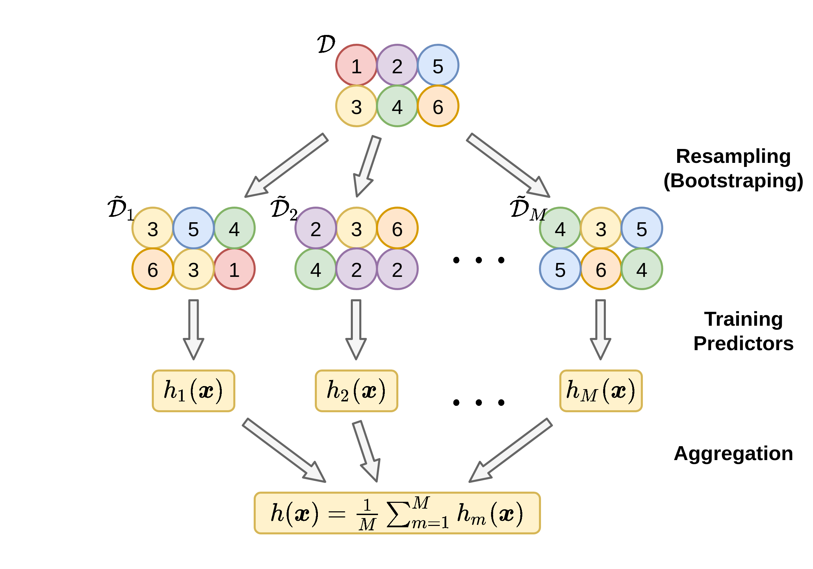
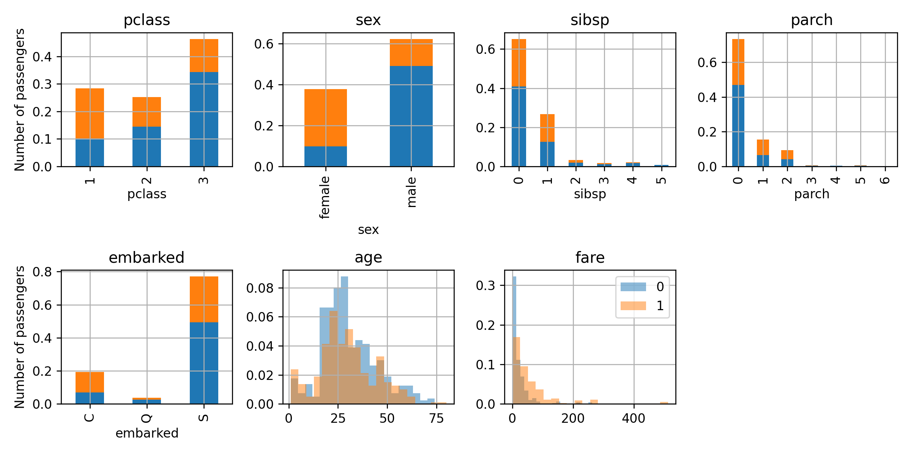
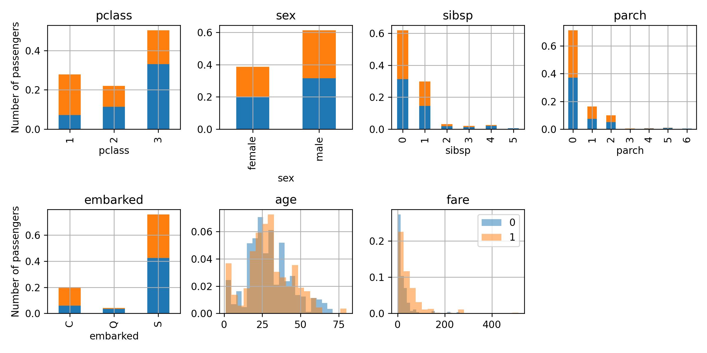

# תרגול 5 - Bagging and AdaBoost

<a href="./slides/" class="link-button" target="_blank">Slides</a>
<a href="/assets/tutorial05.pdf" class="link-button" target="_blank">PDF</a>
<!-- <a href="./code/" class="link-button" target="_blank">Code</a> -->

## תקציר התיאוריה

Bagging ו Boosting הן שיטות אשר עושות שימוש במכלול (ensemble) של חזאים בכדי לקבל חזאי עם ביצועים טובים יותר.

### Bagging

Bagging (Bootstrap + Aggregating) הינה שיטה להקטין את ה **variance** (ובכך את ה **overfitting**) של חזאי על ידי הרכבה של מספר חזאים אשר אומנו על מדגמים מעט שונים.

בשלב ה bootstraping נייצר את המדגמים ולכל מדגם נבנה חזאי ובשלב ה aggregation נאחד את כל החזאים לחזאי יחיד.

#### Bootstraping

ב Bootstraping נקח מדגם נתון בגודל $N$ ונייצר ממנו $p$ מדגמים בגודל $\tilde{N}$ על ידי הגרלה של ערכים מתוך המדגם עם חזרות (כך שניתן להגריל כל ערך מספר פעמים). ב bagging נבחר לרוב את $\tilde{N}$ להיות שווה ל $N$.

#### Aggregation

בשלב הראשון נבנה באופן בלתי תלוי מתוך כל אחד מהמגדמים שייצרנו חזאי $\tilde{h}_i(\boldsymbol{x})$. בשלב השני נרכיב את כל החזאים שייצרנו לחזאי אחד כולל.

- **בעבור בעיות רגרסיה**: נמצע את תוצאת החיזוי של כל החזאים: $h(\boldsymbol{x})=\frac{1}{p}\sum_{i=1}^p \tilde{h}_i(\boldsymbol{x})$
- **בעבור בעיות סיווג**: נבצע majority voting, זאת אומרת: $h(\boldsymbol{x})=\text{majority}(\{\tilde{h}_1(\boldsymbol{x}),\tilde{h}_2(\boldsymbol{x}),\dots,\tilde{h}_p(\boldsymbol{x})\})$

### AdaBoost

AdaBoost (Adaptive Boosting) מתייחס לבעיות סיווג בינאריות, שיטה זו מנסה להקטין את ה **bias** (ובכך להקטין את ה **underfitting**) של מסווג על ידי הרכבה של מסווגים שונים.

ב AdaBoost נסמן את המחלקות ב $\text{y}=\pm1$.

בהיתן אוסף של מסווגים בינארים, אלגוריתם ה AdaBoost מנסה לבחור סט של $t$ מסווגים ומקדמים $\{\alpha_k,\tilde{h}_k\}_{k=1}^t$ ולבנות קומבינציה לינארית $\sum_{k=1}^t\alpha_k \tilde{h}_k(\boldsymbol{x})$ שתמזער את בעיית האופטימיזציה הבאה:

$$
\underset{\{\alpha_k,\tilde{h}_k\}_k}{\arg\min}\quad
\frac{1}{N}\sum_{i=1}^N\exp\left(-\sum_{k=1}^t\alpha_k y^{(i)}\tilde{h}_k(\boldsymbol{x}^{(i)})\right)
$$

האלגוריתם בונה את הקומבינציה הלינארית בצורה חמדנית על ידי הוספת איבר איבר לקומבינציה (והגדלה של $t$) ועצירה כאשר ביצועי המסווג מספקים או שהאלגוריתם מתחיל לעשות overfitting על ה validation set.

#### אלגוריתם

ב $t=0$ נאתחל וקטור משקלים $w_i^{(t)}=\frac{1}{N}$.

בכל צעד $t$ נבצע את הפעולות הבאות:

1. נבחר את המסווג אשר ממזער את ה misclassification rate הממושקל:

    $$
    \tilde{h}_t=\underset{\tilde{h}}{\arg\min}\ \sum_{i=1}^N w_i^{(t-1)}I\{y^{(i)}\neq \tilde{h}(\boldsymbol{x}^{(i)})\}
    $$

2. נחשב את המקדם $\alpha_{t+1}$ של המסווג:

    $$
    \begin{aligned}
    \varepsilon_t&=\sum_{i=1}^N w_i^{(t-1)}I\{y^{(i)}\neq \tilde{h}_t(\boldsymbol{x}^{(i)})\}\\
    \alpha_t&=\frac{1}{2}\ln\left(\frac{1-\varepsilon_t}{\varepsilon_t}\right)
    \end{aligned}
    $$

3. נעדכן את וקטור המשקלים:

    $$
    \begin{aligned}
    \tilde{w}_i^{(t)}&=w_i^{(t-1)}\exp\left(-\alpha_t y^{(i)}\tilde{h}_t(\boldsymbol{x}^{(i)})\right)\\
    w_i^{(t)}&=\frac{\tilde{w}_i^{(t)}}{\sum_{j=1}^N \tilde{w}_j^{(t)}}
    \end{aligned}
    $$

#### המסווג הסופי

הסיווג הסופי נעשה על ידי קומבינציה לינארית של כל מסווגים והמשקל שלהם.

$$
h(\boldsymbol{x})=\text{sign}\left(\sum_{t=1}^T\alpha_t \tilde{h}_t(\boldsymbol{x})\right)
$$

#### חסם

נסתכל על מסווג אשר התקבל מאלגוריתם AdaBoost שעבורו בכל צעד $t$ שגיאת ה misclassification error הממושקלת קטנה מ $\tfrac{1}{2}-\gamma_t$. בעבור מסווג זה מתקיים ש:

$$
\frac{1}{N}\sum_i I\{h(\boldsymbol{x}^{(i)})\neq y^{(i)}\}
\leq
\frac{1}{N}\sum_{i=1}^N\exp\left(-\sum_{t=1}^T\alpha_t y^{(i)}\tilde{h}_t(\boldsymbol{x}^{(i)})\right)
\leq
\exp\left(-2\sum_{t=1}^T\gamma_t^2\right)
$$

## תרגיל 5.1: דוגמא חד מימדית

נתבונן בבעיית סיווג חד מימדית עבור סט דוגמאות האימון:

$$
\mathcal{D}=\{\{1,-1\}, \{3,1\}, \{5,-1\}\}.
$$

נרצה להשתמש במסווגים לינארים מסוג $\tilde{h}(x)=\pm\text{sign}(x-b)$ וב AdaBoost בכדי לבנות מסווג. רשמו את ארבעת האיטרציות הראשונות של האלגוריתם ואת החזאי המתקבל אחרי כל צעד. הניחו כי: $b\in\{0, 2, 4\}$.

### פתרון 5.1

נאתחל את וקטור המשקלים:

$$
\boldsymbol{w}^{(0)}=\left[\tfrac{1}{3},\tfrac{1}{3},\tfrac{1}{3}\right]^{\top}
$$

#### צעד 1

נבחר מבין המסווגים הנתונים את המסווג אשר ממזער את ה objective שהוא ה misclassification rate הממושקל.

$$
\sum_{i=1}^N w_i^{(0)}I\{y^{(i)}\neq \tilde{h}(x^{(i)})\}
$$

נבחן את שלושת הערכים האפשריים של $b$:

##### $b=0$

במקרה זה עדיף לקחת את המסווג $\tilde{h}(x)=-\text{sign}(x)$ (עם סימון שלילי) בכדי למזער את misclassification rate.

חזאי זה יטעה רק על הנקודה השניה $i=2$ ולכן נקבל:

$$
\sum_{i=1}^N w_i^{(0)}I\{y^{(i)}\neq \tilde{h}(x^{(i)})\}=w_2^{(0)}=\tfrac{1}{3}
$$

##### $b=2$

במקרה זה עדיף לקחת את המסווג $\tilde{h}(x)=\text{sign}(x-2)$ (עם סימון חיובי) בכדי מזער את misclassification rate.

חזאי זה יטעה רק על הנקודה השלישית $i=3$ ולכן נקבל:

$$
\sum_{i=1}^N w_i^{(0)}I\{y^{(i)}\neq \tilde{h}(x^{(i)})\}=w_3^{(0)}=\tfrac{1}{3}
$$

##### $b=4$

במקרה זה עדיף לקחת את המסווג $\tilde{h}(x)=-\text{sign}(x-4)$ (עם סימון שלילי) בכדי למזער את misclassification rate.

חזאי זה יטעה רק על הנקודה השלישית $i=1$ ולכן נקבל:

$$
\sum_{i=1}^N w_i^{(0)}I\{y^{(i)}\neq \tilde{h}(x^{(i)})\}=w_1^{(0)}=\tfrac{1}{3}
$$

מכיוון שכל שלושת החזאים מניבים את אותו objective נבחר את אחד מהם באקראי. נבחר אם כן את המסווג הראשון של האלגוריתם להיות $\tilde{h}_1=-\text{sign}(x)$.

נחשב את $\alpha_1$:

$$
\begin{aligned}
\varepsilon_1&=\sum_{i=1}^N w_i^{(0)}I\{y^{(i)}\neq \tilde{h}_1(\boldsymbol{x}^{(i)})\}=\frac{1}{3}\\
\alpha_1&=\frac{1}{2}\ln\left(\frac{1-\varepsilon_1}{\varepsilon_1}\right)=\frac{1}{2}\ln(2)=0.347
\end{aligned}
$$

נעדכן את וקטור המשקלים:

$$
\tilde{\boldsymbol{w}}^{(1)}
=\begin{bmatrix}
    \frac{1}{3}\exp\left(-\alpha_1 y^{(i)}\tilde{h}_1(x^{(i)})\right)\\
    \frac{1}{3}\exp\left(-\alpha_1 y^{(i)}\tilde{h}_1(x^{(i)})\right)\\
    \frac{1}{3}\exp\left(-\alpha_1 y^{(i)}\tilde{h}_1(x^{(i)})\right)
\end{bmatrix}
=\frac{1}{3}\begin{bmatrix}
    \exp\left(-\frac{1}{2}\ln(2)\cdot1\right)\\
    \exp\left(-\frac{1}{2}\ln(2)\cdot(-1)\right)\\
    \exp\left(-\frac{1}{2}\ln(2)\cdot1\right)
\end{bmatrix}
=\frac{1}{3}\begin{bmatrix}
    2^{-\frac{1}{2}}\\
    2^{\frac{1}{2}}\\
    2^{-\frac{1}{2}}
\end{bmatrix}
=\frac{1}{3\sqrt{2}}\begin{bmatrix}
    1\\
    2\\
    1
\end{bmatrix}
$$

אחרי הנרמול נקבל:

$$
\boldsymbol{w}^{(1)}
=\frac{1}{4}\begin{bmatrix}
    1\\
    2\\
    1
\end{bmatrix}
$$

החזאי שקיבלנו עד כה הינו:

$$
\begin{aligned}
h(x)
&=\text{sign}\left(\alpha_1 \tilde{h}_1(x)\right)\\
&=\text{sign}\left(-0.347\text{sign}(x)\right)\\
&=\begin{cases}
\text{sign}(0.347)&x<0\\
\text{sign}(-0.347)&0<x
\end{cases}\\
&=\begin{cases}
1&x<0\\
-1&0<x\\
\end{cases}
\end{aligned}
$$

#### צעד 2

נמצא את החזאי האופטימאלי:

- בעבור $\tilde{h}(x)=-\text{sign}(x)$ נקבל:

    $$
    \sum_{i=1}^N w_i^{(0)}I\{y^{(i)}\neq \tilde{h}(x^{(i)})\}=w_2^{(0)}=\frac{2}{4}
    $$

- בעבור $\tilde{h}(x)=\text{sign}(x-2)$ נקבל:

    $$
    \sum_{i=1}^N w_i^{(0)}I\{y^{(i)}\neq \tilde{h}(x^{(i)})\}=w_3^{(0)}=\frac{1}{4}
    $$

- בעבור $\tilde{h}(x)=-\text{sign}(x-4)$ נקבל:

    $$
    \sum_{i=1}^N w_i^{(0)}I\{y^{(i)}\neq \tilde{h}(x^{(i)})\}=w_1^{(0)}=\frac{1}{4}
    $$

המסווג השני והשלישי נותנים את אותם הביצועים נבחר באופן אקראי את המסווג השני $\tilde{h}_2=\text{sign}(x-2)$.

נחשב את $\alpha_2$:

$$
\begin{aligned}
\varepsilon_2&=\frac{1}{4}\\
\alpha_2&=\frac{1}{2}\ln\left(\frac{1-\varepsilon_2}{\varepsilon_2}\right)=\frac{1}{2}\ln(3)=0.549
\end{aligned}
$$

נעדכן את וקטור המשקלים:

$$
\tilde{\boldsymbol{w}}^{(2)}
=\frac{1}{4}\begin{bmatrix}
    \exp\left(-\alpha_2 y^{(i)}\tilde{h}_2(x^{(i)})\right)\\
    2\exp\left(-\alpha_2 y^{(i)}\tilde{h}_2(x^{(i)})\right)\\
    \exp\left(-\alpha_2 y^{(i)}\tilde{h}_2(x^{(i)})\right)
\end{bmatrix}
=\begin{bmatrix}
    \exp\left(-\frac{1}{2}\ln(3)\cdot1\right)\\
    2\exp\left(-\frac{1}{2}\ln(3)\cdot1\right)\\
    \exp\left(-\frac{1}{2}\ln(3)\cdot(-1)\right)
\end{bmatrix}
=\frac{1}{4}\begin{bmatrix}
    3^{-\frac{1}{2}}\\
    2\cdot3^{-\frac{1}{2}}\\
    3^{\frac{1}{2}}
\end{bmatrix}
=\frac{1}{4\sqrt{3}}\begin{bmatrix}
    1\\
    2\\
    3
\end{bmatrix}
$$

אחרי הנרמול נקבל:

$$
\boldsymbol{w}^{(2)}
=\frac{1}{6}\begin{bmatrix}
    1\\
    2\\
    3
\end{bmatrix}
$$

החזאי שקיבלנו עד כה הינו:

$$
\begin{aligned}
h(x)
&=\text{sign}\left(\alpha_1 \tilde{h}_1(x)+\alpha_2 \tilde{h}_2(x)\right)\\
&=\text{sign}\left(-0.347\text{sign}(x)+0.549\text{sign}(x-2)\right)\\
&=\begin{cases}
\text{sign}(-0.203)&x<0\\
\text{sign}(-0.896)&0<x<2\\
\text{sign}(0.203)&2<x
\end{cases}\\
&=\begin{cases}
-1&x<2\\
1&2<x\\
\end{cases}
\end{aligned}
$$

#### צעד 3

נמצא את החזאי האופטימאלי:

- בעבור $\tilde{h}(x)=-\text{sign}(x)$ נקבל: $w_2^{(0)}=\frac{2}{6}$
- בעבור $\tilde{h}(x)=\text{sign}(x-2)$ נקבל: $w_3^{(0)}=\frac{3}{6}$
- בעבור $\tilde{h}(x)=-\text{sign}(x-4)$ נקבל: $w_1^{(0)}=\frac{1}{6}$

המסווג השלישי הוא בעל הביצועים הטובים ביותר ולכן נבחר $\tilde{h}_3=-\text{sign}(x-4)$.

נחשב את $\alpha_3$:

$$
\begin{aligned}
\varepsilon_3&=\frac{1}{6}\\
\alpha_3&=\frac{1}{2}\ln\left(\frac{1-\varepsilon_3}{\varepsilon_3}\right)=\frac{1}{2}\ln(5)=0.805
\end{aligned}
$$

נעדכן את וקטור המשקלים:

$$
\tilde{\boldsymbol{w}}^{(3)}
=\frac{1}{6}\begin{bmatrix}
    \exp\left(-\alpha_3 y^{(i)}\tilde{h}_3(x^{(i)})\right)\\
    2\exp\left(-\alpha_3 y^{(i)}\tilde{h}_3(x^{(i)})\right)\\
    3\exp\left(-\alpha_3 y^{(i)}\tilde{h}_3(x^{(i)})\right)
\end{bmatrix}
=\frac{1}{6}\begin{bmatrix}
    5^{\frac{1}{2}}\\
    2\cdot5^{-\frac{1}{2}}\\
    3\cdot5^{-\frac{1}{2}}
\end{bmatrix}
=\frac{1}{6\sqrt{5}}\begin{bmatrix}
    5\\
    2\\
    3
\end{bmatrix}
$$

אחרי הנרמול נקבל:

$$
\boldsymbol{w}^{(3)}
=\frac{1}{10}\begin{bmatrix}
    5\\
    2\\
    3
\end{bmatrix}
$$

החזאי שקיבלנו עד כה הינו:

$$
\begin{aligned}
h(x)
&=\text{sign}\left(\alpha_1 h_1(x)+\alpha_2 \tilde{h}_2(x)+\alpha_3 \tilde{h}_3(x)\right)\\
&=\text{sign}\left(-0.347\text{sign}(x)+0.549\text{sign}(x-2)-0.805\text{sign}(x-4)\right)\\
&=\begin{cases}
\text{sign}(0.602)&x<0\\
\text{sign}(-0.091)&0<x<2\\
\text{sign}(1.007)&2<x<4\\
\text{sign}(-0.602)&4<x\\
\end{cases}\\
&=\begin{cases}
1&x<0\\
-1&0<x<2\\
1&2<x<4\\
-1&4<x\\
\end{cases}
\end{aligned}
$$

נשים לב שבשלב זה כבר קיבלנו סיווג מושלם

#### צעד 4

נמצא את החזאי האופטימאלי:

- בעבור $\tilde{h}(x)=-\text{sign}(x)$ נקבל: $w_2^{(0)}=\frac{2}{10}$
- בעבור $\tilde{h}(x)=\text{sign}(x-2)$ נקבל: $w_3^{(0)}=\frac{3}{10}$
- בעבור $\tilde{h}(x)=-\text{sign}(x-4)$ נקבל: $w_1^{(0)}=\frac{5}{10}$

המסווג השני הוא בעל הביצועים הטובים ביותר ולכן נבחר $\tilde{h}_4=-\text{sign}(x)$.

נחשב את $\alpha_4$:

$$
\begin{aligned}
\varepsilon_4&=\frac{2}{10}\\
\alpha_4&=\frac{1}{2}\ln\left(\frac{1-\varepsilon_4}{\varepsilon_4}\right)=\frac{1}{2}\ln(4)=0.693
\end{aligned}
$$

נעדכן את וקטור המשקלים:

$$
\tilde{\boldsymbol{w}}^{(4)}
=\frac{1}{10}\begin{bmatrix}
    5\exp\left(-\alpha_4 y^{(i)}\tilde{h}_4(x^{(i)})\right)\\
    2\exp\left(-\alpha_4 y^{(i)}\tilde{h}_4(x^{(i)})\right)\\
    3\exp\left(-\alpha_4 y^{(i)}\tilde{h}_4(x^{(i)})\right)
\end{bmatrix}
=\frac{1}{10}\begin{bmatrix}
    5\cdot4^{-\frac{1}{2}}\\
    2\cdot4^{\frac{1}{2}}\\
    3\cdot4^{-\frac{1}{2}}
\end{bmatrix}
=\frac{1}{20}\begin{bmatrix}
    5\\
    8\\
    3
\end{bmatrix}
$$

אחרי הנרמול נקבל:

$$
\boldsymbol{w}^{(4)}
=\frac{1}{16}\begin{bmatrix}
    5\\
    8\\
    3
\end{bmatrix}
$$

החזאי שקיבלנו עד כה הינו:

$$
\begin{aligned}
h(x)
&=\text{sign}\left(\alpha_1 \tilde{h}_1(x)+\alpha_2 \tilde{h}_2(x)+\alpha_3 \tilde{h}_3(x)+\alpha_4 \tilde{h}_4(x)\right)\\
&=\text{sign}\left(-1.04\text{sign}(x)+0.549\text{sign}(x-2)-0.805\text{sign}(x-4)\right)\\
&=\begin{cases}
\text{sign}(1.295)&x<0\\
\text{sign}(-0.784)&0<x<2\\
\text{sign}(0.314)&2<x<4\\
\text{sign}(-1.295)&4<x\\
\end{cases}\\
&=\begin{cases}
1&x<0\\
-1&0<x<2\\
1&2<x<4\\
-1&4<x\\
\end{cases}
\end{aligned}
$$

הסיווג אומנם לא השתנה, אך ככל שנריץ עוד צעדים של האלגוריתם הוא ימשיך לנסות למזער את $\frac{1}{N}\sum_{i=1}^N\exp\left(-\sum_{t=1}^T\alpha_t y^{(i)}\tilde{h}_t(\boldsymbol{x}^{(i)})\right)$. במקרים רבים כאשר נמשיך להריץ את האלגוריתם יכולת ההכללה של האלגוריתם תמשיך להשתפר גם אחרי שהאלגוריתם מתכנס לסיווג מושלם על ה train set. (זה לא יקרה במקרה המנוון הזה).

## תרגיל 5.2 - שאלות תיאורטיות

הסעיפים הבאים לא תלויים אחד בשני.

**1)** מדוע נעדיף ב AdaBoost להשתמש במסווגים בעלי יכולת ביטוי חלשה? לדוגמא מדוע נעדיף להשתמש בעצים בעומק 1 מאשר עצים מאד עמוקים?

**2)** נניח כי בעבור מדגם כל שהוא בגודל $N$, מובטח לנו שבאלגוריתם ה AdaBoost נוכל תמיד למצוא מסווג כזה אשר יתן לנו שגיאת misclassification rate קטנה מ $\tfrac{1}{2}-\gamma$. מצאו חסם עליון על כמות הצעדים של AdaBoost שיש לבצע בכדי לקבל סיווג מושלם.

**רמז**: מהי השגיאת ה misclassification rate (הלא ממושקל) במצב בו המסווג טועה רק על דגימה אחת?

**3)** הראו שאם באלגוריתם AdaBoost ננסה להשתמש באותו המסווג בשני צעדים רצופים בצעד השני נקבל misclassification rate ממושקל ששווה לחצי.

הדרכה (תחת הסימונים שמופיעים בתחילת התרגול)

1. הראו ש: $\exp\left(-\alpha_t y^{(i)}\tilde{h}_t(\boldsymbol{x}^{(i)})\right)=\left(\frac{\varepsilon_t}{1-\varepsilon_t}\right)^{\frac{1}{2}y^{(i)}\tilde{h}_t(\boldsymbol{x}^{(i)})}$.
2. הראו שקבוע הנרמול של המשקלים נתון על ידי: $\sum_{i=1}^N\tilde{w}_i^{(t)}=2\sqrt{\varepsilon_t(1-\varepsilon_t)}$.
3. חשבו את ה misclassification rate הממושקל עם משקלים $\boldsymbol{w}^{t}$ והחזאי $\tilde{h}_t$ (מהצעד ה $t$). עשו זאת על ידי הצבה של $w_i^{(t)}$ ושל קבוע הנרמול שלו.

### פתרון 5.2

#### 1)

AdaBoost מגדיל את ההתאמה של חזאי למדגם על ידי בניית קומבינציה של חזאים. האלגוריתם מקטין את ה underfitting על חשבון ה overfitting. אם נתחיל עם מודלים בעלי יכולת ביטוי גדולה מידי המודלים יעשו overfitting ואותו האלגוריתם לא יוכל להקטין.

בפועל מה שיקרה אם ניקח מודלים בעלי יכולת ביטוי גדולה הוא שנמצא בצעד הראשון מודל שיסווג בצורה טובה את המדגם (אך גם כנראה יעשה הרבה overfitting) לו הוא יתן את מרבית המשקל.

#### 2)

בעבור מדגם בגודל $N$ וחזאי עם שגיאת חיזוי אחת על המדגם נקבל שגיאת misclassification rate של $\frac{1}{N}$. נמצא בעזרת החסם את כמות הצעדים שיש לעשות בכדי להגיע לשגיאה קטנה מזו. על פי החסם על השגיאה של AdaBoost אנו יודעים כי:

$$
\frac{1}{N}\sum_i I\{h(\boldsymbol{x}^{(i)})\neq y^{(i)}\}
\leq
\exp\left(-2\sum_{t=1}^T\gamma^2\right)
=\exp\left(-2T\gamma^2\right)
$$

נמצא את מספר הצעדים המינימאלי $T$ אשר מקיים:

$$
\begin{aligned}
\exp\left(-2T\gamma^2\right)&\leq\frac{1}{N}\\
\Leftrightarrow -2T\gamma^2&\leq\ln\left(\frac{1}{N}\right)\\
\Leftrightarrow T&\geq\frac{1}{2\gamma^2}\ln(N)
\end{aligned}
$$

מכאן שבעבור $T=\left\lceil\frac{1}{2\gamma^2}\ln(N)\right\rceil+1$ מובטח לנו שנקבל שגיאת misclassification rate קטנה מ $\frac{1}{N}$, זאת אומרת שיש אפס שגיאות סיווג.

#### 3)

נפעל על פי ההדרכה. נתחיל עם השלב הראשון. נשתמש בעובדה ש $\alpha_t=\frac{1}{2}\ln\left(\frac{1-\varepsilon_t}{\varepsilon_t}\right)$ ונראה ש:

$$
\begin{aligned}
\exp\left(-\alpha_t y^{(i)}\tilde{h}_t(\boldsymbol{x}^{(i)})\right)
&=\exp\left(-\frac{1}{2}\ln\left(\frac{1-\varepsilon_t}{\varepsilon_t}\right) y^{(i)}\tilde{h}_t(\boldsymbol{x}^{(i)})\right)\\
&=\exp\left(\ln\left(\frac{1-\varepsilon_t}{\varepsilon_t}\right)\right)^{-\frac{1}{2}y^{(i)}\tilde{h}_t(\boldsymbol{x}^{(i)})}\\
&=\left(\frac{\varepsilon_t}{1-\varepsilon_t}\right)^{\frac{1}{2}y^{(i)}\tilde{h}_t(\boldsymbol{x}^{(i)})}
\end{aligned}
$$

נמשיך ונחשב את קבוע הנרמול:

$$
\begin{aligned}
\sum_{i=1}^N\tilde{w}_i^{(t)}
&=\sum_{i=1}^N w_i^{(t-1)}\exp\left(-\alpha_t y^{(i)}\tilde{h}_t(\boldsymbol{x}^{(i)})\right)\\
&=\sum_{i=1}^N w_i^{(t-1)}\left(\frac{\varepsilon_t}{1-\varepsilon_t}\right)^{\frac{1}{2}y^{(i)}\tilde{h}_t(\boldsymbol{x}^{(i)})}\\
&=\sum_{i=1}^N w_i^{(t-1)}\left(\frac{\varepsilon_t}{1-\varepsilon_t}\right)^{\frac{1}{2}y^{(i)}\tilde{h}_t(\boldsymbol{x}^{(i)})}\left(I\{y^{(i)}=\tilde{h}_t(\boldsymbol{x}^{(i)})\}+I\{y^{(i)}\neq \tilde{h}_t(\boldsymbol{x}^{(i)})\}\right)\\
&=
  \left(\frac{\varepsilon_t}{1-\varepsilon_t}\right)^{\frac{1}{2}}\sum_{i=1}^N w_i^{(t-1)}I\{y^{(i)}=\tilde{h}_t(\boldsymbol{x}^{(i)})\}
  +\left(\frac{\varepsilon_t}{1-\varepsilon_t}\right)^{-\frac{1}{2}}\sum_{i=1}^N w_i^{(t-1)}I\{y^{(i)}\neq \tilde{h}_t(\boldsymbol{x}^{(i)})\}\\
&=
  \sqrt{\frac{\varepsilon_t}{1-\varepsilon_t}}\sum_{i=1}^N w_i^{(t-1)}\left(1-I\{y^{(i)}\neq \tilde{h}_t(\boldsymbol{x}^{(i)})\}\right)
  +\sqrt{\frac{1-\varepsilon_t}{\varepsilon_t}}\sum_{i=1}^N w_i^{(t-1)}I\{y^{(i)}\neq \tilde{h}_t(\boldsymbol{x}^{(i)})\}\\
&=
  \sqrt{\frac{\varepsilon_t}{1-\varepsilon_t}}\left(
    \underbrace{
      \sum_{i=1}^N w_i^{(t-1)}
    }_{=1}
    -\underbrace{
      \sum_{i=1}^N w_i^{(t-1)}I\{y^{(i)}\neq \tilde{h}_t(\boldsymbol{x}^{(i)})\}
    }_{=\varepsilon_t}
  \right)
  +\sqrt{\frac{1-\varepsilon_t}{\varepsilon_t}}
    \underbrace{
      \sum_{i=1}^N w_i^{(t-1)}I\{y^{(i)}\neq \tilde{h}_t(\boldsymbol{x}^{(i)})\}
    }_{=\varepsilon_t}\\
&=
  \sqrt{\frac{\varepsilon_t}{1-\varepsilon_t}}\left(1-\varepsilon_t\right)
  +\sqrt{\frac{1-\varepsilon_t}{\varepsilon_t}}\varepsilon_t\\
&=2\sqrt{\varepsilon_t(1-\varepsilon_t)}
\end{aligned}
$$

נחשב את ה misclassification rate הממושקל $\sum_{i=1}^N w_i^{(t)}I\{y^{(i)}\neq \tilde{h}_t(\boldsymbol{x}^{(i)})\}$. נציב את ההגדרה של $w_i^{(t)}$:

$$
\begin{aligned}
\sum_{i=1}^N w_i^{(t)}I\{y^{(i)}\neq \tilde{h}_t(\boldsymbol{x}^{(i)})\}
&=\sum_{i=1}^N \frac{\tilde{w}_i^{(t)}}{2\sqrt{\varepsilon_t(1-\varepsilon_t)}}I\{y^{(i)}\neq \tilde{h}_t(\boldsymbol{x}^{(i)})\}\\
&=\sum_{i=1}^N \frac{w_i^{(t-1)}\exp\left(-\alpha_t y^{(i)}\tilde{h}_t(\boldsymbol{x}^{(i)})\right)}{2\sqrt{\varepsilon_t(1-\varepsilon_t)}}I\{y^{(i)}\neq \tilde{h}_t(\boldsymbol{x}^{(i)})\}\\
&=\sum_{i=1}^N \frac{w_i^{(t-1)}\exp\left(\alpha_t\right)}{2\sqrt{\varepsilon_t(1-\varepsilon_t)}}I\{y^{(i)}\neq \tilde{h}_t(\boldsymbol{x}^{(i)})\}\\
&=\frac{\exp\left(\alpha_t\right)}{2\sqrt{\varepsilon_t(1-\varepsilon_t)}}\underbrace{\sum_{i=1}^N w_i^{(t-1)}I\{y^{(i)}\neq \tilde{h}_t(\boldsymbol{x}^{(i)})\}}_{=\varepsilon_t}\\
&=\frac{\varepsilon_t}{2\sqrt{\varepsilon_t(1-\varepsilon_t)}}\exp\left(\alpha_t\right)\\
&=\frac{1}{2}\sqrt{\frac{\varepsilon_t}{1-\varepsilon_t}}\sqrt{\frac{1-\varepsilon_t}{\varepsilon_t}}\\
&=\frac{1}{2}
\end{aligned}
$$

שגיאת misclassification rate של חצי היא שקולה להטלת מטבע. מכאן שבחירה של אותו המסווג פעמים ברצף לא תשפר את החיזוי ולכן אין טעם במהלך הריצה של האלגוריתם לעשות כן.

## חלק מעשי - הטיטניק

<a href="./example/" class="link-button" target="_blank">Code</a>

נחזור לבעיה מהתרגול על עצי החלטה של חיזוי אלו מהנוסעים על ספינת הטיטניק שרדו על פי הנתונים שלהם ברשימת הנוסעים. המדגם נראה כך:

|    |   pclass |   survived | name                                            | sex    |   age |   sibsp |   parch | ticket   |     fare | cabin   | embarked   | boat   |   body | home.dest                       |
|---:|---------:|-----------:|:------------------------------------------------|:-------|------:|--------:|--------:|:---------|---------:|:--------|:-----------|:-------|-------:|:--------------------------------|
|  0 |        1 |          1 | Allen, Miss. Elisabeth Walton                   | female |    29 |       0 |       0 | 24160    | 211.338  | B5      | S          | 2      |    nan | St Louis, MO                    |
|  1 |        1 |          0 | Allison, Miss. Helen Loraine                    | female |     2 |       1 |       2 | 113781   | 151.55   | C22 C26 | S          | nan    |    nan | Montreal, PQ / Chesterville, ON |
|  2 |        1 |          0 | Allison, Mr. Hudson Joshua Creighton            | male   |    30 |       1 |       2 | 113781   | 151.55   | C22 C26 | S          | nan    |    135 | Montreal, PQ / Chesterville, ON |
|  3 |        1 |          0 | Allison, Mrs. Hudson J C (Bessie Waldo Daniels) | female |    25 |       1 |       2 | 113781   | 151.55   | C22 C26 | S          | nan    |    nan | Montreal, PQ / Chesterville, ON |
|  4 |        1 |          1 | Anderson, Mr. Harry                             | male   |    48 |       0 |       0 | 19952    |  26.55   | E12     | S          | 3      |    nan | New York, NY                    |
|  5 |        1 |          1 | Andrews, Miss. Kornelia Theodosia               | female |    63 |       1 |       0 | 13502    |  77.9583 | D7      | S          | 10     |    nan | Hudson, NY                      |
|  6 |        1 |          0 | Andrews, Mr. Thomas Jr                          | male   |    39 |       0 |       0 | 112050   |   0      | A36     | S          | nan    |    nan | Belfast, NI                     |
|  7 |        1 |          1 | Appleton, Mrs. Edward Dale (Charlotte Lamson)   | female |    53 |       2 |       0 | 11769    |  51.4792 | C101    | S          | D      |    nan | Bayside, Queens, NY             |
|  8 |        1 |          0 | Artagaveytia, Mr. Ramon                         | male   |    71 |       0 |       0 | PC 17609 |  49.5042 | nan     | C          | nan    |     22 | Montevideo, Uruguay             |
|  9 |        1 |          0 | Astor, Col. John Jacob                          | male   |    47 |       1 |       0 | PC 17757 | 227.525  | C62 C64 | C          | nan    |    124 | New York, NY                    |

### השדות

בדומה למקרה של עצי ההחלטה נשתמש בשדות הבאים:

- **pclass**: מחלקת הנוסע: 1, 2 או 3
- **sex**: מין הנוסע
- **age**: גיל הנוסע
- **sibsp**: מס' של אחים ובני זוג של כל נוסע על האוניה
- **parch**: מס' של ילדים או הורים של כל נוסע על האונייה
- **fare**: המחיר שהנוסע שילם על הכרטיס
- **embarked**: הנמל בו עלה הנוסע על האונייה (C = Cherbourg; Q = Queenstown; S = Southampton)
- **survived**: התיוג, האם הנוסע שרד או לא

### הפילוג של ערכים

הפילוג של כל אחד מהשדות בעבור האנשים ששרדו והאנשים שלא:

### סט המסווגים - Stumps

המסווגים בהם נשתמש הינם stumps (עצים בעומק 1). למשתנים הקטגוריים נעבור על כל האפשרויות לחלק את הקטגוריות.

### בניית המסווג

אחרי שנחלק את המדגם ל train-validation-test נשתמש ב train בשביל לבנות את הקומבינציה של המסווגים.

גודל ה train set הוא 599. נאתחל את וקטור המשקלים $\boldsymbol{w}^{(0)}$ להיות וקטור שמכיל את הערך $\frac{1}{599}$.

### צעד 1

נעבור על כל ה stumps האפשריים ונחפש את זה שממזער את ה misclassification rate הממושקל. נקבל שה stump האופטימאלי הוא זה שמפצל לפי המגדר וחוזה שהנשים שרדו והגברים לא. המסווג שנקבל יהיה:

$$
h(\boldsymbol{x})=\text{sign}\left(0.598 \cdot I\{\text{sex}=\text{female}\}\right)
$$

הציון על ה train set יהיה: 0.232

הציון על ה validation set יהיה: 0.226

### צעד 2

נצייר את הפילוג של הדגימות ממושקלות על ידי המשקלים המעודכנים:

ה stump האופטימאלי כעת יהיה זה שמפצל לפי המחלקה של הנוסעים וחוזה שנוסעים ממחלקה ראשונה שרדו והאחרים לא. המסווג שנקבל יהיה:

$$
h(\boldsymbol{x})=\text{sign}\left(
    0.598 \cdot I\{\text{sex}=\text{female}\}
    +0.31 \cdot I\{\text{class}=1\}
\right)
$$

הציון על ה train set וה validation set ישאר זהה.

### צעד 3

נצייר את הפילוג של הדגימות ממושקלות על ידי המשקלים המעודכנים:

ה stump האופטימאלי כעת יהיה זה שמפצל לפי הגיל וחוזה שנוסעים מתחת לגיל 35.5 שרדו. המסווג שנקבל יהיה:

$$
h(\boldsymbol{x})=\text{sign}\left(
    0.598 \cdot I\{\text{sex}=\text{female}\}
    +0.31 \cdot I\{\text{class}=1\}
    +0.162 \cdot I\{\text{age}<35.5\}
\right)
$$

הציון על ה train set וה validation set ישאר זהה.

### המשך

אם נמשיך כך עוד 20 צעדים נקבל את המסווג הכולל אשר נותן את הביצועיים הבאים:

הציון על ה train set יהיה: 0.209

הציון על ה validation set יהיה: 0.201

הציון על ה test set יהיה: 0.189

(זה בהשוואה ל 0.205 שקיבלנו בעזרת עצי החלטה)

