<div class="slides site-style" style="direction:rtl">
<section class="center">

# תרגול 5 - K-NN ו Decision trees

<div dir="ltr">
<a href="/assets/tutorial05_slides.pdf" class="link-button" target="_blank">PDF</a>
</div>
</section><section>

## תקציר התיאוריה

</section><section>

### בעיות סיווג

בעיות סיווג הם בעיות supervised learning שבהם הlabels (תוויות) מוגבלות לסט סופי של ערכים.

<div class="fragment">


- בבעיות סיווג נהוג להתייחס לחזאי כאל מסווג (classifier) או discriminator (מקטלג).

</div><div class="fragment">

- **מחלקות** -  הערכים השונים שהתוויות מקבלות.

</div><div class="fragment">

- את מספר המחלקות נסמן ב- $C$.

</div><div class="fragment">

- **סיווג בינארי** - בעיות שיש בהן 2 מחלקות, $C=2$.

</div>

</section><section>

- בסיווג בינארי, מקובל לסמן את המחלקות באופנים הבאים:
  - $y\in\{0,1\}$.
  - $y\in\{-1,1\}$.

<div class="fragment">

- בסיווג לא בינארי, מקובל להשתמש באחד מהאופציות הבאות לסימון המחלקות:
  - $y\in\{1,2,\dots,C\}$.
  - $y\in\{0,1,\dots,C-1\}$.

</div>

</section><section>

### דוגמאות

- **מערכת לזיהוי הונאות בכרטיסי אשראי:**
  
  </br>
  
  במקרה זה $\mathbf{x}$ יכול להיות וקטור אשר מכיל את מאפייני העיסקה, כגון מחיר, שעה, ומיקום, ו $\text{y}$ יקבל אחד משני ערכים:
  
  - 0 - העסקה לגיטימית.
  - 1 - חשד להונאה.

<div class="fragment">

- **מערכת לעיבוד כתב יד (OCR):**
  
  </br>
  
  במקרה זה $\mathbf{x}$ יכול להיות לדוגמא תמונה של אות ו $\text{y}$ יהיה שווה למחלקה אשר מייצגת את האות בתמונה:
  
  - 1: a
  - 2: b
  - 3: c
  - ...

</div>

</section><section>

#### Misclassification rate

* לרוב בבעיות סיווג אין משמעות בין החיזוי $\hat{y}$ לערך האימיתי של $y$.

<div class="fragment">

* לדוגמא, בניסיון לזהות את האות $a$, חיזוי של האות $b$ הוא לא בהכרח חיזוי טוב יותר מ $s$.

</div><div class="fragment">

- לכן, נפוץ להשתמש ב- misclassification rate כפונ' המחיר

* פונקציית ה- loss המתאימה:

$$
l(\hat{y},y)=I\{\hat{y}\neq y\}
$$

* ה- Risk:

$$
l(\hat{y},y)=I\{\hat{y}\neq y\}
$$

החזאי האופטימאלי של הינו זה אשר מחזיר את ה $\text{y}$ הכי סביר:
$$
h^*(\boldsymbol{x})=\underset{y}{\arg\max}\ p(y|\mathbf{x}=\boldsymbol{x})
$$

</div>

</section><section>

### K-NN (K-Nearest Neighbours)

K-NN הינו אלגוריתם דיסקרימינטיבי לפתרון בעיות סיווג.

<div class="fragment">

</br>

באלגוריתם זה החיזויים נעשים ישירות על פי המדגם באופן הבא:

</br>

</div><div class="fragment">

בהינתן $\boldsymbol{x}$ מסויים:

</div><div class="fragment">

1. נבחר את $K$ הדגימות בעלות ה $\boldsymbol{x}^{(i)}$ הקרובים ביותר ל $\boldsymbol{x}$. 

   </br>
   (לרוב נשתמש במרחק אוקלידי, אך ניתן גם לבחור פונקציות מחיר אחרות).

2. החיזוי יהיה התווית השכיחה ביותר מבין $K$ התוויות של הדגימות שנבחרו בשלב 1.

</div>

</section><section>

#### 

- במקרה של שוויון בשלב 2, נשווה את המרחק הממוצע בין ה $\boldsymbol{x}$-ים השייכים לכל תווית ונבחר בתווית בעלת המרחק הממוצע הקצר ביותר.
- במקרה של שוויון גם בין המרחקים הממוצעים, נבחר אקראית.


</section><section>

#### K-NN לבעיות רגרסיה

ניתן להשתמש באלגוריתם זה גם לפתרון בעיות רגרסיה אם כי פתרון זה יהיה לרוב פחות יעיל. בבעיות רגרסיה ניתן למצע על התוויות במקום לבחור את תווית השכיחה.

</section><section>

### Decision trees (עצי החלטה)

עצי החלטה הם כלי נפוץ (גם מחוץ לתחום של מערכות לומדות) לקבלת החלטות על סמך אוסף של עובדות.

<div class="imgbox" style="max-width:600px">


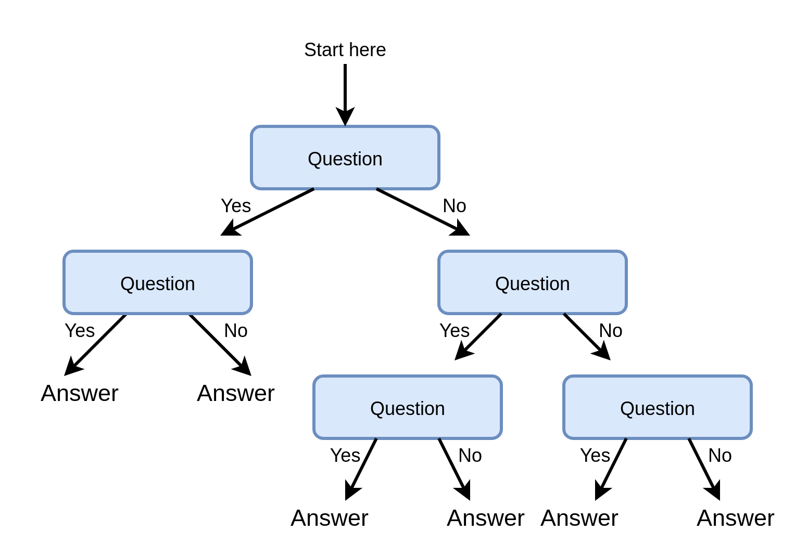

</div>

</section><section>

#### 

טרמינולוגיה:

- **root (שורש)** - נקודת הכניסה לעץ.
- **node (צומת)** - נקודות ההחלטה / פיצול של העץ - השאלות.
- **leaves (עלים)** - הקצוות של העץ - התשובות.
- **branch (עף)** - חלק מתוך העץ המלא (תת-עץ).


</section><section>

נוכל להשתמש בעצי החלטה שכאלה לבניית חזאים. הדרך הנפוצה לגדיר את השאלות על הענפים של העץ הינם על ידי תנאים על רכיב **יחיד** של $\boldsymbol{x}$. ספצפית:

- לרוב נשתמש בתנאי מהצורה $x_i>a$, כאשר יש לבחור את $i$ ו $a$
- כאשר $x_i$ הוא מתשנה דיסקרטי אשר מקבל סט קטן של ערכים נוכל גם לפצל לפי הערכים האפשריים של $x_i$.


</section><section>


<div class="imgbox" style="max-width:700px">

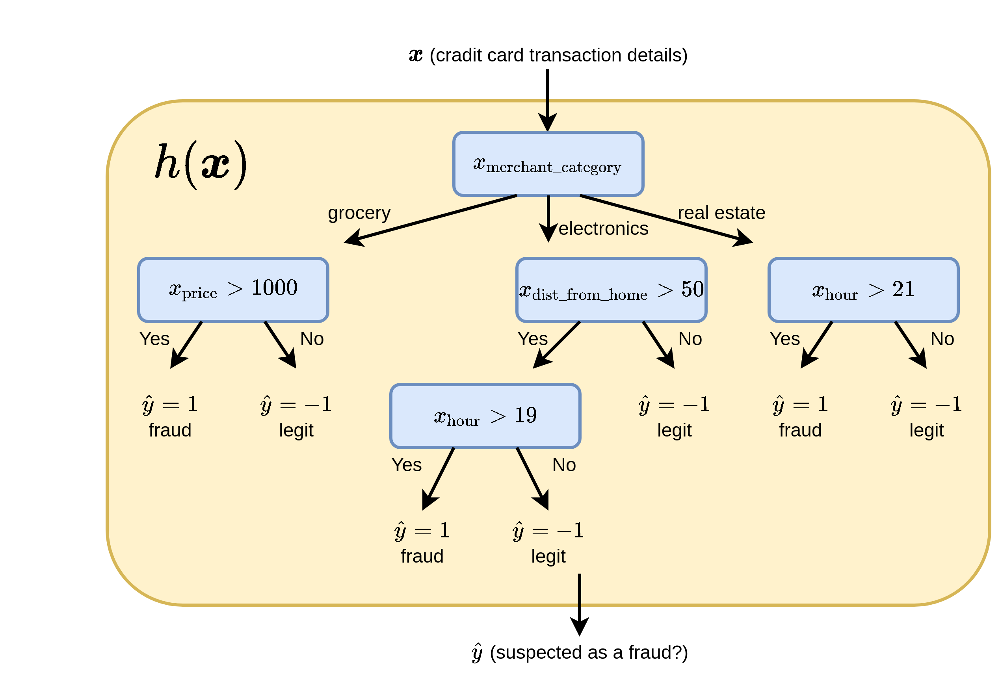

</div>

</section><section>

#### 

היתרונות של השימוש בעץ החלטה כחזאי:

1. פשוט למימוש (אוסף של תנאי if .. else ..).
2. מתאים לעבודה עם משתנים קטגוריים (משתנים בדדים אשר מקבלים אחד מסט מצומצם של ערכים).
3. Explainable - ניתן להבין בדיוק מה היו השיקולים שלפיהם התקבל חיזוי מסויים.

</section><section>

### בניית עץ החלטה לסיווג

</section><section>

#### 


#### מדדים לחוסר ההומוגניות של פילוג

**נתון:** 

* משתנה אקראי דיסקרטי $\text{y}$ אשר מקבל את הערכים $y\in\{1,2,\dots,C\}$
*  פונקציית הסתברות $p(y)$
* נגדיר כמה מדדים אשר מודדים עד כמה הפילוג של $\text{y}$ רחוק מלהיות פילוג אשר מייצר דגימות הומוגניות (זאת אומרת פילוג שהוא פונקציית דלתא):

<div class="imgbox" style="max-width:800px">


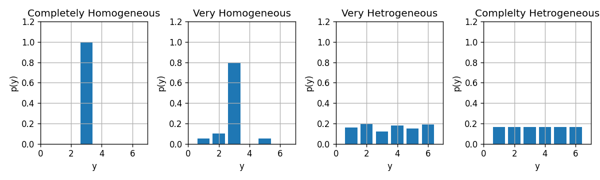

</div>


</section><section>

- שגיאת הסיווג (אשר המתקבלת בעבור חיזוי של הערך הכי סביר)

  $$
  Q(p)=1-\max_{y\in\{1,\dots,C\}}p(y)
  $$

- אינדקס Gini:

  $$
  Q(p)=\sum_{y\in\{1,\dots,C\}}p(y)(1-p(y))
  $$

- אנטרופיה:

  $$
  Q(p)(=H(p))=\sum_{y\in\{1,\dots,C\}}-p(y)\log_2 p(y)
  $$


</section><section>


* מדדים אלו שווים ל-0 עבור פילוגים **אחידים** (הומוגניים) וגדלים ככל שהפילוג הולך ונעשה אחיד.
* נראה את ההתנהגות של המדדים לעיל עבור משתנה אקראי בינארי:

<div class="imgbox" style="max-width:800px">


</div>

</section><section>

#### חוסר הומוגניות ממוצעת של עץ - ציון של עץ החלטה

1. נעביר את הדגימות מהמדגם דרך העץ ונפצל אותם על פי העלים. נסמן את האינדקסים של הדגימות שהגיעו לעלה ה $j$ ב $\mathcal{I}_j$. נסמן את כמות הדגימות שהגיעו לעלה ה $j$ ב $N_j$.

2. נחשב את הפילוג האמפירי של התויות שהגיעו לכל עלה:

   $$
   \hat{p}_{j,y}=\frac{1}{N_j}\sum_{i\in\mathcal{I}_j} I\{y_i=y\}
   $$

3. נחשב את חוסר ההומוגניות של כל עלה: $Q(\hat{p}_j)$

4. הציון הכולל של העץ הינו הממוצע המשוקלל של חוסר ההומוגניות של העלים ביחס למספר הדגימות בכל עלה:

   $$
   Q_{\text{total}}=\sum_j \frac{N_j}{N}Q(\hat{p}_j)
   $$

</section><section>

#### שלב ראשון - בניה של עץ מלא

* נרצה שהפילוג בעלים של העץ יהיה כמה שיותר הומוגני, כלומר שמדד חוסר ההומוגניות יהיה נמוך.
  * כדי להימנע מ overfitting,  לעשות זאת על ידי שימוש בכמה שפחות nodes.

* כדי למצוא הפתרון האופטיאמלי יש לעבור על כל העצים האפשריים.

</section><section>

* פתרון: נחפש פתרון שאינו בהכרח האופטימאלי על ידי בניה של העץ בצורה חמדנית (greedy).

<div class="fragment">

*  נתחיל מה root ונוסיף nodes כך שבכל שלב נבחר את ה node אשר מניב את העץ עם מדד החוסר הומוגניות הנמוך ביותר.

</div><div class="fragment">

*  נעשה זאת על ידי מעבר על כל האופציות האפשריות לבחור את ה node.

</div><div class="fragment">

* ממשיכים לפצל את העלים של העץ כל עוד מדד החוסר הומוגניות יורד.

</div><div class="fragment">

*  מקרים שבהם יש במדגם שתי דגימות עם אותו ה $\boldsymbol{x}$ אך $y$ שונה, יהיה ניתן להגיע למדד חוסר הומוגניות 0.

</section><section>

#### שלב שני - pruning (גיזום)


* כדי להקטין את ה- overfitting של העץ ניתן להשתמש ב- validation set על מנת לבצע pruning של העץ באופן הבא:
  * עבור כל אחד מהעלים:
    * לכל node, האם הסרה שלו משפרת או לא משנה את הביצועי העץ על ה validation set. 
    * במידה וזה אכן המצב מסירים אותו. ממשיכים כך עד שאין עוד מה להסיר.

</section><section>

### Regression Tree

ניתן להשתמש בעצים גם לפתרון בעיות רגרסיה. במקרה של רגרסיה עם פונקציית מחיר של MSE, הבניה של העץ תהיה זהה מלבד שני הבדלים:

1. תוצאת החיזוי בעלה מסויים תהיה הערך הממוצע של התוויות באותו עלה. (במקום הערך השכיח)
2. את מדד החוסר הומוגניות נחליף בשגיאה הריבועית של החיזוי של העץ.

</section><section>

## תרגיל 5.1

סטודנט נבון ניגש לבחור אבטיחים בסופרמרקט. ידוע כי זוהי רק תחילתה של עונת האבטיחים וקיים מספר לא מבוטל של אבטיחי בוסר הסטודנט שם לב כי ניתן לאפיין את האבטיחים ע"פ ההד בהקשה וע"פ קוטר האבטיח. הסטודנט החליט למפות את ניסיון העבר שלו:

<div style="direction:ltr">


|      | Radius | Echo | Sweetness |
| ---: | -----: | ---: | --------: |
|    0 |      8 |    1 |        -1 |
|    1 |     10 |    2 |        -1 |
|    2 |      5 |    5 |         1 |
|    3 |      7 |    3 |         1 |
|    4 |      7 |    4 |        -1 |
|    5 |     10 |    4 |        -1 |
|    6 |     11 |    4 |        -1 |
|    7 |      7 |    5 |         1 |

</div>

</section><section>

<div class="imgbox" style="max-width:800px">


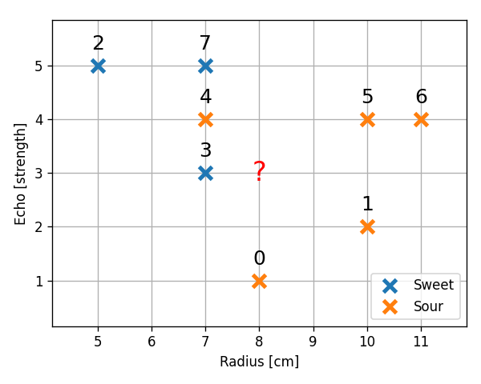

</div>

</br>

הסטודנט מחזיק בידו האבטיח בעל בעוצמה 3 ורדיוס 8 ס"מ. על מנת לחזות האם האבטיח בידו מתוק או חמוץ נבנה חזאי בעזרת K-NN.


</section><section>

#### 1) **(ללא קשר לבעיה בשאלה) כיצד הפרמטר $K$ משפיע על השגיאה שאנו צופים לקבל באלגוריתם ה K-NN? ממה תנבע השגיאה כאשר $K$ יהיה קטן וממה תנבע השגיאה כאשר $K$ יהיה גדול?**

<div class="fragment">

*  $K$ יהיה קטן אנו למעשה מתאימים לכל נקודה ב train set איזור החלטה משלה.
* במצב זה החזאי יתן חיזוי מושלם על המדגם, אך איזורי החלטה אלו, אשר תלויים במקומים המקריים של נקודות בודדות, לא בהכרח ייצגו את האופי של הפילוג האמיתי. זהו המקרה של **overfitting**.

</div><div class="fragment">

* כאשר $K$ יהיה גדול מאד אנו למעשה נמצע על איזורים מאד גדולים ולכן החזאי יתעלם מהשינויים העדינים בפילוג של הנקודות, ויתייחס רק למגמה המאד כללית. זה  המצב של underfitting.

</div>

</section><section>

#### 2) בעבור המדגם הנתון, מה קורה במקרה שבו $K=8$? האם שגיאה זו היא שגיאת overfitting או underfitting?

<div class="fragment">

* במקרה הקיצוני שבו $K$ שווה לגודל ה dataset כל חיזוי יתבצע על סמך כל הנקודות במדגם ולכן יהיה שווה תמיד לתווית השכיחה ביותר במדגם.
* במקרה זה החיזוי יהיה תמיד $-1$, כלומר שהאבטיח הוא חמוץ ללא כל תלות בהד וברדיוס.

</div>

</section><section>

#### 3) השתמשו ב leave-one-out cross validation על מנת לקבוע את ה $K$ האופטימאלי מבין הערכים 1,3,5,7. השתמשו ב missclassification rate כפונקציית המחיר.

<div class="fragment">

* כדי לקבוע את הערך האופטימאלי של $K$ מתוך הערכים הנתונים בעזרת K-fold cross validation עלינו לחשב את ציון ה validation לכל ערך של $K$ ולכל fold (שימוש בנקודה אחרת כ validation set).
* לאחר מכאן נמצע על ה folds השונים על מנת לקבל את הציון של כל $K$.

</div>

</section><section>

#### 

נרכז בטבלה את החיזוי המשוערך לכל fold ולכל $K$:


<div style="direction:ltr">


| point      | Correct label | K=1 prediction | K=3 prediction    | K=5 prediction        | K=7 prediction            |
| ---------- | ------------- | -------------- | ----------------- | --------------------- | ------------------------- |
| 0          | -1            | ✓ -1 (nn=[1])  | ✓ -1 (nn=[1 3 4]) | ✓ -1 (nn=[1 3 4 5 7]) | ✓ -1 (nn=[1 3 4 5 7 6 2]) |
| 1          | -1            | ✓ -1 (nn=[5])  | ✓ -1 (nn=[5 0 6]) | ✓ -1 (nn=[5 0 6 3 4]) | ✓ -1 (nn=[5 0 6 3 4 7 2]) |
| 2          | 1             | ✓ 1 (nn=[7])   | ✓ 1 (nn=[7 4 3])  | ✗ -1 (nn=[7 4 3 0 5]) | ✗ -1 (nn=[7 4 3 0 5 1 6]) |
| 3          | 1             | ✗ -1 (nn=[4])  | ✗ -1 (nn=[4 7 0]) | ✗ -1 (nn=[4 7 0 2 1]) | ✗ -1 (nn=[4 7 0 2 1 5 6]) |
| 4          | -1            | ✗ 1 (nn=[3])   | ✗ 1 (nn=[3 7 2])  | ✗ 1 (nn=[3 7 2 5 0])  | ✓ -1 (nn=[3 7 2 5 0 1 6]) |
| 5          | -1            | ✓ -1 (nn=[6])  | ✓ -1 (nn=[6 1 4]) | ✓ -1 (nn=[6 1 4 3 7]) | ✓ -1 (nn=[6 1 4 3 7 0 2]) |
| 6          | -1            | ✓ -1 (nn=[5])  | ✓ -1 (nn=[5 1 4]) | ✓ -1 (nn=[5 1 4 3 7]) | ✓ -1 (nn=[5 1 4 3 7 0 2]) |
| 7          | 1             | ✗ -1 (nn=[4])  | ✓ 1 (nn=[4 2 3])  | ✗ -1 (nn=[4 2 3 5 0]) | ✗ -1 (nn=[4 2 3 5 0 6 1]) |
| Avg. score |               | 3/8            | 2/8               | 4/8                   | 3/8                       |

</div>

* קיבלנו את השגיאה הממוצעת הקטנה ביותר עבור $K=3$.
* לכן נקבע את $K$ לערך זה.

</section><section>

#### 4) השתמשו ב $K$ שמצאתם בכדי לחשב את החיזוי הסופי.

* נבדוק את בשלות האבטיח שהסטודנט מחזיק בידו על סמך המדגם כולו עם $K=3$.
* שלושת הנקודות הקרובות ביותר לנקודה $(8,3)$ הינם הנקודות $0$, $3$ ו $4$. מכיוון ששתיים מהם עם תווית של $-1$ אנו נחזה שאבטיח זה הוא בוסר.


</section><section>

## שאלה 5.2 – בניית עץ החלטה

בנה עץ החלטה המבוסס על קריטריון האנטרופיה, אשר בהינתן נתוני צבע שער, גובה, משקל, והשימוש בקרם הגנה, חוזה האם עתיד האדם להכוות מהשמש היוקדת.  
סט דוגמאות הלימוד לצורך בניית העץ מוצג בטבלה הבאה:

<div dir="ltr">


| Hair   | Height  | Weight  | Lotion | Result (Label) |
| ------ | ------- | ------- | ------ | -------------- |
| blonde | average | light   | no     | sunburned      |
| blonde | tall    | average | yes    | none           |
| brown  | short   | average | yes    | none           |
| blonde | short   | average | no     | sunburned      |
| red    | average | heavy   | no     | sunburned      |
| brown  | tall    | heavy   | no     | none           |
| brown  | average | heavy   | no     | none           |
| blonde | short   | light   | yes    | none           |

</div>

</section><section>

### פתרון 5.2

* נפעל על פי האלגוריתם ונתחיל מה root ונתחיל להוסיף nodes:

<div class="imgbox no-shadow">


</div>

* יש לנו 4 nodes אפשריים (בעבור כל שדה של $\boldsymbol{x}$).
* נחשב את האנטרופיה הממוצעת של כל אחד מהם ונבחר את המינימאלי.

</section><section>

##### Hair

<div class="imgbox no-shadow">


</div>

<div style="direction:ltr">


|        | Leaf ($j$) | $N_j$ | $\hat{p}_j$                     | $H(\hat{p}_j)$                                               |
| ------ | ---------- | ----- | ------------------------------- | ------------------------------------------------------------ |
| Blonde | 1          | 4     | $\{\tfrac{2}{4},\tfrac{2}{4}\}$ | $-\tfrac{1}{2}\log{\tfrac{1}{2}}-\tfrac{1}{2}\log{\tfrac{1}{2}}=1 $ |
| Brown  | 2          | 3     | $\{\tfrac{0}{3},\tfrac{3}{3}\}$ | $-0\log(0)-1\log(1)=0$                                       |
| Red    | 3          | 1     | $\{\tfrac{1}{1},\tfrac{0}{1}\}$ | $-1\log(1)-0\log(0)=0$                                       |

</div>

נחשב את הממוצע הממושקל של האנטופיה על שלושת העלים:

$$
Q_{\text{total}}=\sum_j \frac{N_j}{N}Q(\hat{p}_j)=\frac{4}{8}\cdot 1+\frac{3}{8}\cdot 0+\frac{1}{8}\cdot 0=\frac{1}{2}
$$

נמשיך לשדה הבא.

</section><section>

##### Height

<div class="imgbox no-shadow">


</div>

<div style="direction:ltr">


|         | Leaf ($j$) | $N_j$ | $\hat{p}_j$                     | $H(\hat{p}_j)$                                                         |
| ------- | ---------- | ----- |-------------------------------- | ---------------------------------------------------------------------- |
| Sort    | 1          | 3     | $\{\tfrac{1}{3},\tfrac{2}{3}\}$ | $-\tfrac{1}{3}\log{\tfrac{1}{3}}-\tfrac{2}{3}\log{\tfrac{2}{3}}=0.918$ |
| Average | 2          | 3     | $\{\tfrac{2}{3},\tfrac{1}{3}\}$ | $-\tfrac{2}{3}\log{\tfrac{2}{3}}-\tfrac{1}{3}\log{\tfrac{1}{3}}=0.918$ |
| Tall    | 3          | 2     | $\{\tfrac{0}{2},\tfrac{2}{2}\}$ | $-0\log(0)-1\log(1)=0$                                                 |

</div>

$$
Q_{\text{total}}=\sum_j \frac{N_j}{N}Q(\hat{p}_j)=\frac{3}{8}\cdot 0.918+\frac{3}{8}\cdot 0.918+\frac{2}{8}\cdot 0=0.69
$$

</section><section>

##### Weight

<div class="imgbox no-shadow">

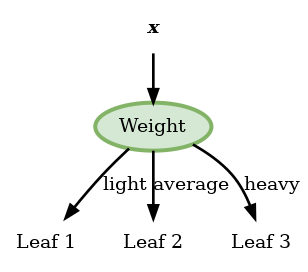

</div>

<div style="direction:ltr">

|         | Leaf ($j$) | $N_j$ | $\hat{p}_j$                     | $H(\hat{p}_j)$                                               |
| ------- | ---------- | ----- | ------------------------------- | ------------------------------------------------------------ |
| Light   | 1          | 2     | $\{\tfrac{1}{2},\tfrac{1}{2}\}$ | $-\tfrac{1}{2}\log{\tfrac{1}{2}}-\tfrac{1}{2}\log{\tfrac{1}{2}}=1$ |
| Average | 2          | 3     | $\{\tfrac{1}{3},\tfrac{2}{3}\}$ | $-\tfrac{1}{3}\log{\tfrac{1}{3}}-\tfrac{2}{3}\log{\tfrac{2}{3}}=0.918$ |
| Heavy   | 3          | 3     | $\{\tfrac{1}{3},\tfrac{2}{3}\}$ | $-\tfrac{1}{3}\log{\tfrac{1}{3}}-\tfrac{2}{3}\log{\tfrac{2}{3}}=0.918$ |

</div>

$$
Q_{\text{total}}=\sum_j \frac{N_j}{N}Q(\hat{p}_j)=\frac{2}{8}\cdot 1+\frac{3}{8}\cdot 0.918+\frac{3}{8}\cdot 0.918=0.9385
$$

</section><section>

##### Lotion

<div class="imgbox no-shadow">

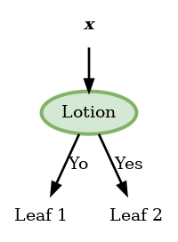

</div>

<div style="direction:ltr">

|     | Leaf ($j$) | $N_j$ | $\hat{p}_j$                     | $H(\hat{p}_j)$                                                         |
| --- | ---------- | ----- |-------------------------------- | ---------------------------------------------------------------------- |
| No  | 1          | 5     | $\{\tfrac{3}{5},\tfrac{2}{5}\}$ | $-\tfrac{3}{5}\log{\tfrac{3}{5}}-\tfrac{2}{5}\log{\tfrac{2}{5}}=0.97$  |
| Yes | 2          | 3     | $\{\tfrac{0}{3},\tfrac{3}{3}\}$ | $-0\log(0)-1\log(1)=0$                                                 |

</div>

$$
Q_{\text{total}}=\sum_j \frac{N_j}{N}Q(\hat{p}_j)=\frac{5}{8}\cdot 0.97+\frac{3}{8}\cdot 0=0.606
$$

</section><section>

* המאפיין האופטימלי לפיצול הראשון הוא **Hair**.
  * לכן נבחר בו להיות ה node הראשון.
* נשים לב כי בעבור node זה שני הפילוגים של brown ו red כבר הומוגניים לגמרי (מכילים רק סוג אחד של תוויות) ולכן לא נמשיך לפצל אותם.
* נרשום את החיזוי המקבל בכל עלה:

<div class="imgbox no-shadow">


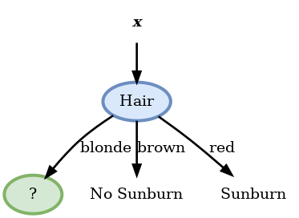

</div>


</section><section>

* נמשיך כעת באופן דומה לבחור את ה node בעבור הענף של blonde.
* מכיוון שאין טעם לבדוק שוב את ה node של hair נשאר לנו לבדוק רק את שלושת האופציות הנותרות. 
* לשם הנוחות נרכז את הדגימות האשר מגיעות לענף זה:

<div style="direction:ltr">


| Height  | Weight  | Lotion | Result    |
| ------- | ------- | ------ | --------- |
| average | light   | no     | sunburned |
| tall    | average | yes    | none      |
| short   | average | no     | sunburned |
| short   | light   | yes    | none      |

</div>

</section><section>

##### Height

<div class="imgbox no-shadow" style="max-width:400px">


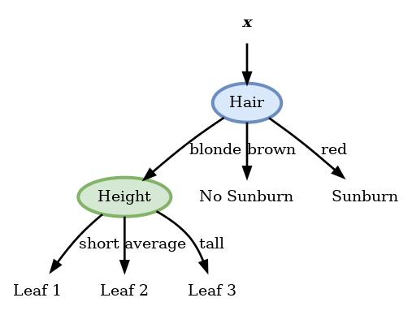

</div>

<div style="direction:ltr">

|         | Leaf ($j$) | $N_j$ | $\hat{p}_j$                     | $H(\hat{p}_j)$                                                     |
| ------- | ---------- | ----- |-------------------------------- | ------------------------------------------------------------------ |
| Short   | 1          | 2     | $\{\tfrac{1}{2},\tfrac{1}{2}\}$ | $-\tfrac{1}{2}\log{\tfrac{1}{2}}-\tfrac{1}{2}\log{\tfrac{1}{2}}=1$ |
| Average | 2          | 1     | $\{\tfrac{0}{1},\tfrac{1}{1}\}$ | $-0\log(0)-1\log(1)=0$                                             |
| Tall    | 3          | 1     | $\{\tfrac{0}{1},\tfrac{1}{1}\}$ | $-1\log(1)-0\log(0)=0$                                             |

</div>

$$
Q_{\text{blond}}=\sum_j \frac{N_j}{N}Q(\hat{p}_j)=\frac{2}{8}\cdot 1+\frac{1}{8}\cdot 0+\frac{1}{8}\cdot 0=0.25
$$

</section><section>

##### Weight

<div class="imgbox no-shadow" style="max-width:400px">


</div>

<div style="direction:ltr">


|         | Leaf ($j$) | $N_j$ | $\hat{p}_j$                     | $H(\hat{p}_j)$                                               |
| ------- | ---------- | ----- | ------------------------------- | ------------------------------------------------------------ |
| Light   | 1          | 2     | $\{\tfrac{1}{2},\tfrac{1}{2}\}$ | $-\tfrac{1}{2}\log{\tfrac{1}{2}}-\tfrac{1}{2}\log{\tfrac{1}{2}}=1$ |
| Average | 2          | 2     | $\{\tfrac{1}{2},\tfrac{1}{2}\}$ | $-\tfrac{1}{2}\log{\tfrac{1}{2}}-\tfrac{1}{2}\log{\tfrac{1}{2}}=1$ |
| Heavy   | 3          | 0     |                                 |                                                              |

</div>

$$
Q_{\text{total}}=\sum_j \frac{N_j}{N}Q(\hat{p}_j)=\frac{2}{8}\cdot 1+\frac{2}{8}\cdot 1=0.5
$$

</section><section>

##### Lotion

<div class="imgbox no-shadow" style="max-width:400px">


</div>

<div style="direction:ltr">


|      | Leaf ($j$) | $N_j$ | $\hat{p}_j$                     | $H(\hat{p}_j)$         |
| ---- | ---------- | ----- | ------------------------------- | ---------------------- |
| No   | 1          | 2     | $\{\tfrac{2}{2},\tfrac{0}{2}\}$ | $-1\log(1)-0\log(0)=0$ |
| Yes  | 2          | 2     | $\{\tfrac{0}{2},\tfrac{2}{2}\}$ | $-0\log(0)-1\log(1)=0$ |

</div>

$$
Q_{\text{total}}=\sum_j \frac{N_j}{N}Q(\hat{p}_j)=\frac{2}{8}\cdot 0+\frac{2}{8}\cdot 0=0
$$

פיצול זה נותן אנטרופיה 0 ולכן הוא הפיצול האופטימאלי ואנו נבחר בו.

</section><section>

* עץ ההחלטה הסופי יראה אם כן:

<div class="imgbox no-shadow">


</div>

* עץ זה ממיין באופן מושלם את המדגם.

</section><section>

## תרגיל 5.3

נתון המדגם הבא של ערכי תצפית של $\mathbf{x}=[\text{x}_1,\text{x}_2,\text{x}_3]^{\top}$ ותוויות $\text{y}$:

<div style="direction:ltr">


|      | $\text{x}_1$ | $\text{x}_2$ | $\text{x}_3$ | $\text{y}$ |
| ---- | ------------ | ------------ | ------------ | ---------- |
| 1    | 1            | 1            | -1           | 1          |
| 2    | 1            | -1           | -1           | 1          |
| 3    | -1           | -1           | -1           | 1          |
| 4    | -1           | -1           | -1           | -1         |
| 5    | 1            | 1            | 1            | -1         |

</div>


</br>

</br>

נרצה לבנות עץ החלטה על מנת לחזות את $\text{y}$ על סמך $\mathbf{x}$. נרצה להשתמש במדד חוסר הומגניות חדש מסוג Squared Root Gini אשר מוגדר באופן הבא:
$$
Q(p)=\sum_y\sqrt{p(y)(1-p(y)}
$$

</section><section>

**1) בנו עץ מלא על סמך קריטריון זה. כמה nodes יש בעץ שמצאתם?**

</section><section>


נתחיל מה root ונבדוק את שלושת ה nodes האפשריים תחת מדד השגיאה החדש:

<div class="imgbox no-shadow">


</div>

##### $\text{x}_1$

<div style="direction:ltr">


|      | Leaf ($j$) | $N_j$ | $\hat{p}_j$                     | $Q(\hat{p}_j)$                          |
| ---- | ---------- | ----- | ------------------------------- | --------------------------------------- |
| 1    | 1          | 3     | $\{\tfrac{2}{3},\tfrac{1}{3}\}$ | $2\sqrt{\tfrac{2}{3}\tfrac{1}{3}}=0.94$ |
| -1   | 2          | 2     | $\{\tfrac{1}{2},\tfrac{1}{2}\}$ | $2\sqrt{\tfrac{1}{2}\tfrac{1}{2}}=1$  |

</div>

$$
Q_{\text{total}}=\frac{3}{5}\cdot 0.94+\frac{2}{5}\cdot 1=0.96
$$

</section><section>


##### $\text{x}_2$

נשים לב ש node זה נותן חלוקה דומה של התוויות לזו של $\text{x}_1$ ולכן נקבל את אותו ערך המדד של $0.96$.

##### $\text{x}_3$


<div style="direction:ltr">


|      | Leaf ($j$) | $N_j$ | $\hat{p}_j$                     | $Q(\hat{p}_j)$                          |
| ---- | ---------- | ----- | ------------------------------- | --------------------------------------- |
| 1    | 1          | 4     | $\{\tfrac{3}{4},\tfrac{1}{4}\}$ | $2\sqrt{\tfrac{3}{4}\tfrac{1}{4}}=0.86$ |
| -1   | 2          | 1     | $\{\tfrac{0}{1},\tfrac{1}{1}\}$ | $2\sqrt{0\cdot 1}=0$                    |

</div>

$$
Q_{\text{total}}=\frac{4}{5}\cdot 0.86+\frac{1}{5}\cdot 0=0.7
$$


</section><section>


* לכן נבחר את ה node הראשון להיות התנאי על $\text{x}_3$. 
* מכיוון שהענף של $x_3=1$ כבר הומוגני לא נחלק אותו יותר:

<div class="imgbox no-shadow">


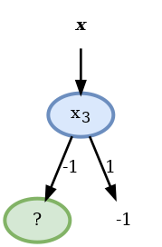

</div>

הדגימות הרלוונטיות כרגע הם:

<div style="direction:ltr">


|      | $\text{x}_1$ | $\text{x}_2$ | $\text{y}$ |
| ---- | ------------ | ------------ | ---------- |
| 1    | 1            | 1            | 1          |
| 2    | 1            | -1           | 1          |
| 3    | -1           | -1           | 1          |
| 4    | -1           | -1           | -1         |

</div>

</section><section>

נבדוק את שני השדות שנותרו:

##### $\text{x}_1$

<div style="direction:ltr">


|      | Leaf ($j$) | $N_j$ | $\hat{p}_j$                     | $Q(\hat{p}_j)$                         |
| ---- | ---------- | ----- | ------------------------------- | -------------------------------------- |
| 1    | 1          | 2     | $\{\tfrac{2}{2},\tfrac{0}{2}\}$ | $2\sqrt{1\cdot0}=0$                    |
| -1   | 2          | 2     | $\{\tfrac{1}{2},\tfrac{1}{2}\}$ | $2\sqrt{\tfrac{1}{2}\tfrac{1}{2}}=1$ |

</div>


$$
Q_{\text{branch}}=\frac{2}{5}\cdot 0+\frac{2}{5}\cdot 1=0.4
$$

##### $\text{x}_2$

<div style="direction:ltr">


|      | Leaf ($j$) | $N_j$ | $\hat{p}_j$                     | $Q(\hat{p}_j)$                          |
| ---- | ---------- | ----- | ------------------------------- | --------------------------------------- |
| 1    | 1          | 1     | $\{\tfrac{1}{1},\tfrac{0}{1}\}$ | $2\sqrt{1\cdot0}=0$                     |
| -1   | 2          | 3     | $\{\tfrac{2}{3},\tfrac{1}{3}\}$ | $2\sqrt{\tfrac{2}{3}\tfrac{1}{3}}=0.94$ |

</div>

$$
Q_{\text{branch}}=\frac{1}{5}\cdot 0+\frac{3}{5}\cdot 0.94=0.57
$$

</section><section>

ה node האופטימאלי כאן הוא הפיצול לפי $\text{x}_1$ ונשים לב שהענף של $\text{x}_1=1$ כבר הומוגני:

<div class="imgbox no-shadow" style="max-width:200px">


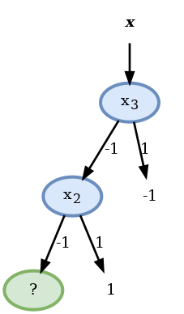

</div>

</br>

* בעבור הענף של $\text{x}_1=-1$ הדגימות הרלוונטיות הם:

<div style="direction:ltr">


|      | $\text{x}_2$ | $\text{y}$ |
| ---- | ------------ | ---------- |
| 3    | -1           | 1          |
| 4    | -1           | -1         |

</div>

</section><section>


* למרות שלא הגענו לפילוג הומוגני לא נוכל לפצל יותר את הענף כי הערכים של $\text{x}_2$ זהים בעבור שני הדגימות ולכן לא ניתן להבחין בינהם. במקרה זה נחבר את החיזוי באופן שרירותי להיות $1$ ונסיים את הבניה של העץ:

<div class="imgbox no-shadow">


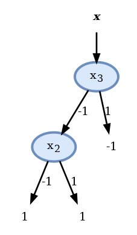

</div>

בעץ שמצאנו ישנם 2 nodes.

</section><section>


**2) חשבו את הציון (score) של עץ זה תחת פונקציית המחיר של misclassification rate. האם ניתן להגיע לסיווג מושלם במקרה זה?**

</section><section>

* בעבור העלים אשר הפילוג של התגיות בהם הינו הומוגני החיזוי יהיה מושלם.
* שגיאות חיזוי יתקבלו רק בעלה של $\text{x}_3=\text{x}_1=-1$ אשר לא הצליח להגיע לפילוג הומוגני. 
* מכיוון שבחרנו (באופן שרירותי) שהחיזוי בעלה זה יהיה 1 הדגימה יחידה אשר תסווג לא נכון היא דגימה 4. מכאן שהחזאי שבנינו יעשה על המדגם שגיאה אחת מתוך 5, זאת אומרת misclassification rate של $1/5=0.2$.
* כפי שציינו קודם, מכיוון שלדגימות 3 ו 4 יש את אותו $\boldsymbol{x}$ אך $y$ שונה לא ניתן להפריד בניהם ותמיד על אחד מהם החיזוי יהיה לא נכון.
* לכן הציון של $0.2$ הוא הציון המינמאלי שאותו ניתן לקבל על המדגם הזה.

</section><section>


**3) האם בעבור מקרה זה ניתן לבנות עץ אשר מגיע לאותו ציון כמו העץ שמצאתם בסעיף 1 אך עם פחות nodes? אם כן, הציעו סיבה אפשריות למה האלגוריתם בו השתמשתם בסעיף הקודם לא מצא את העץ הזה.**

</section><section>

* נשים לב שלמעשה ה- node השני בעץ לא עושה כלום:
  * ללא תלות בערך של $\text{x}_2$ הוא חוזה $1$
* לכן, באותה המידה ניתן להשתמש גם בעץ הבא ולקבל את אותו החיזוי:

<div class="imgbox no-shadow" style="max-width:150px">


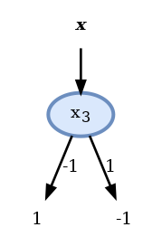

</div>


<div class="fragment">

מדוע האלגוריתם לא התכנס לפתרון זה?

</div><div class="fragment">

*  בבניה של העץ ניסינו למזער את מדד ה squared root gini הממוצע ולא את שגיאת החיזוי ומכיוון שאלו שתי בעיות שונות וגם הפתרונות שלהם יכולים להיות שונים.

</div>

</section><section>

## חלק מעשי - הטיטניק

<div class="imgbox" style="max-width:800px">


</div>

</section><section>

*  נשתמש ב- dataset שמבוסס על רשימת הנוסעים של ספינת הטיטניק.
* רשימה זו מכילה פרטים שונים על כל אחחד מהנוסעים יחד עם אינדיקטור של איזה מהנוסעים שרד.
* ניתן להגדיר על סמך מדגם זה את בעיית supervised learning הבאה:
  * לחזות מהנוסעים שרד ואיזה לא על סמך פרטי הנוסע.

</br>

</br>

</br>

</br>

</br>


* את המדגם המקורי ניתן למצוא [פה](http://biostat.mc.vanderbilt.edu/wiki/pub/Main/DataSets/titanic.html).
* אנו נעבוד עם גרסא יותר נקיה שלו שניתן למצוא [פה](https://technion046195.netlify.app/datasets/titanic_manifest.csv).

</section><section>

נציג את 10 השורות הראשונות במדגם:

|      | pclass | survived | name                                            | sex    |  age | sibsp | parch | ticket   |    fare | cabin   | embarked | boat | body | home.dest                       |
| ---: | -----: | -------: | :---------------------------------------------- | :----- | ---: | ----: | ----: | :------- | ------: | :------ | :------- | :--- | ---: | :------------------------------ |
|    0 |      1 |        1 | Allen, Miss. Elisabeth Walton                   | female |   29 |     0 |     0 | 24160    | 211.338 | B5      | S        | 2    |  nan | St Louis, MO                    |
|    1 |      1 |        0 | Allison, Miss. Helen Loraine                    | female |    2 |     1 |     2 | 113781   |  151.55 | C22 C26 | S        | nan  |  nan | Montreal, PQ / Chesterville, ON |
|    2 |      1 |        0 | Allison, Mr. Hudson Joshua Creighton            | male   |   30 |     1 |     2 | 113781   |  151.55 | C22 C26 | S        | nan  |  135 | Montreal, PQ / Chesterville, ON |
|    3 |      1 |        0 | Allison, Mrs. Hudson J C (Bessie Waldo Daniels) | female |   25 |     1 |     2 | 113781   |  151.55 | C22 C26 | S        | nan  |  nan | Montreal, PQ / Chesterville, ON |
|    4 |      1 |        1 | Anderson, Mr. Harry                             | male   |   48 |     0 |     0 | 19952    |   26.55 | E12     | S        | 3    |  nan | New York, NY                    |
|    5 |      1 |        1 | Andrews, Miss. Kornelia Theodosia               | female |   63 |     1 |     0 | 13502    | 77.9583 | D7      | S        | 10   |  nan | Hudson, NY                      |
|    6 |      1 |        0 | Andrews, Mr. Thomas Jr                          | male   |   39 |     0 |     0 | 112050   |       0 | A36     | S        | nan  |  nan | Belfast, NI                     |
|    7 |      1 |        1 | Appleton, Mrs. Edward Dale (Charlotte Lamson)   | female |   53 |     2 |     0 | 11769    | 51.4792 | C101    | S        | D    |  nan | Bayside, Queens, NY             |
|    8 |      1 |        0 | Artagaveytia, Mr. Ramon                         | male   |   71 |     0 |     0 | PC 17609 | 49.5042 | nan     | C        | nan  |   22 | Montevideo, Uruguay             |
|    9 |      1 |        0 | Astor, Col. John Jacob                          | male   |   47 |     1 |     0 | PC 17757 | 227.525 | C62 C64 | C        | nan  |  124 | New York, NY                    |

במדגם הנקי יש 999 רשומות.

</section><section>

### השדות

בתרגול נשתמש רק בשדות הבאים:

- **pclass**: מחלקת הנוסע: 1, 2 או 3
- **sex**: מין הנוסע
- **age**: גיל הנוסע
- **sibsp**: מס' של אחים ובני זוג של כל נוסע על האוניה
- **parch**: מס' של ילדים או הורים של כל נוסע על האונייה
- **fare**: המחיר שהנוסע שילם על הכרטיס
- **embarked**: הנמל בו עלה הנוסע על האונייה (C = Cherbourg; Q = Queenstown; S = Southampton)
- **survived**: התיוג, האם הנוסע שרד או לא

</section><section>

### התרשמות ראשונית בעזרת גרפים

* נציג את הפילוג של כל אחד מהשדות בעבור האנשים ושרדו ואלה שלו:

<div class="imgbox" style="max-width:600px">


</div>

* ניתן לראות כי אכן ישנם מאפיינים שיוכלו לסייע לשנו לשפר את החיזוי שלנו. 
* לדוגמא: לנשים היה סיכוי גבוהה בהרבה לשרוד מאשר גברים וכך גם לנוסעים במחלקה הראשונה.

</section><section>

### הגדרת הבעיה

נסמן:

- $\mathbf{x}$ : הוקטור האקראי אשר מכיל את כל פרטי הנוסע.
- $\text{y}$ : המשתנה האקראי של האם הנוסע שרד או לו.


</br>

* נרצה למצוא חזאי (מסווג) שיש טוב כל האפשר תחת פונקציית המחיר של miscalssification rate.

</br>

* נעשה זאת בעזרת עץ החלטה

</section><section>

### חלוקת ה dataset

- נחלק את המדגם ל 80% train set ו 20% tset set.
- נחלק את ה train set פעם נוספת ל 75% train set ו 25% validation set.

</section><section>

### בניית עץ בעל שלוש רמות

* נבנה את העץ על פי קריטריון Gini.
* נתחיל מה root ונוסיף בכל פעם את ה node שמזער את המדד.

</section><section>

* בעבור ה- node הראשון:

<div style="direction:ltr">
<div class="imgbox no-shadow">
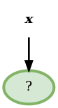

</section><section>


``` text
Score before split: 0.492
Scores:
- pclass: 0.436
- sex: 0.360   <-
- sibsp: 0.479
- parch: 0.473
- embarked: 0.460
- age >= 9: 0.488
- fare >= 15.7417: 0.448
```

<div style="direction:rtl">
* לכן נבחר למיין לפי המין.

</div>

</section><section>

*  נפעל באופן זהה לכל שאר ה nodes


<div class="imgbox no-shadow">


</div>

</section><section>


``` text
Score before split: 0.146
Scores:
- pclass: 0.109   <-
- sex: 0.146
- sibsp: 0.140
- parch: 0.143
- embarked: 0.130
- age >= 48: 0.142
- fare >= 10.5: 0.126
```


</section><section>


<div class="imgbox no-shadow">


</div>


</section><section>


``` text
Score before split: 0.214
Scores:
- pclass: 0.202   <-
- sex: 0.214
- sibsp: 0.212
- parch: 0.209
- embarked: 0.205
- age >= 10: 0.207
- fare >= 26.2875: 0.205
```


</section><section>

<div class="imgbox no-shadow">


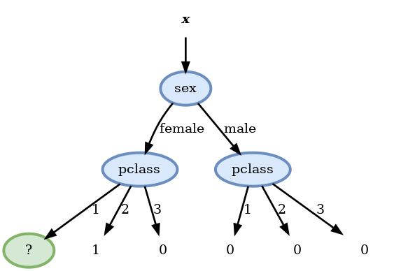

</div>

</section><section>


<div class="imgbox no-shadow">

```text
Score before split: 0.010
Scores:
- pclass: 0.010
- sex: 0.010
- sibsp: 0.009
- parch: 0.008
- embarked: 0.009
- age >= 15: 0.007   <-
- fare >= 151.55: 0.009
```


</section><section>

* נמשיך עד שנמלא את כל השיכבה השלישית ונקבל:

</br>

</br>

<div class="imgbox no-shadow">


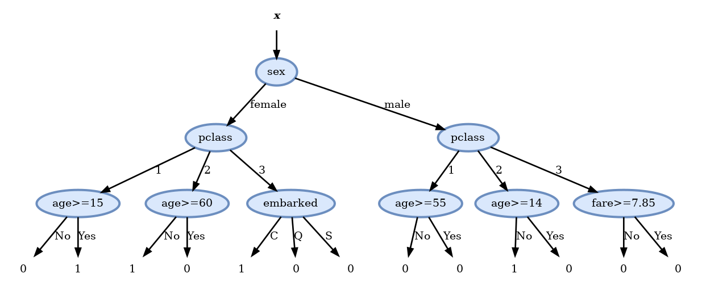

</div>

</section><section>

### Pruning

* לאחר חישוב העץ המלא נשתמש ב validation set על מנת להסיר את הענפים שלא משפרים (או פוגעים) בציון על ה validation set.
* בדיקה זו מראה שיש ארבעה node של תורמים לשיפור התוצאה ולכן נסיר אותם ונקבל את העץ הסופי הבא:


<div class="imgbox no-shadow" style="max-width:400px">


</div>

</section><section>


### ביצועים

נחשב את הציון (misclassification rate) המתקבל על ה test set:

- הציון על ה test set הינו: 0.205

זאת אומרת שיש לנו סיכוי של 80% לחזות נכונה האם אדם מסויים שרד או לא.


</div>

</section>