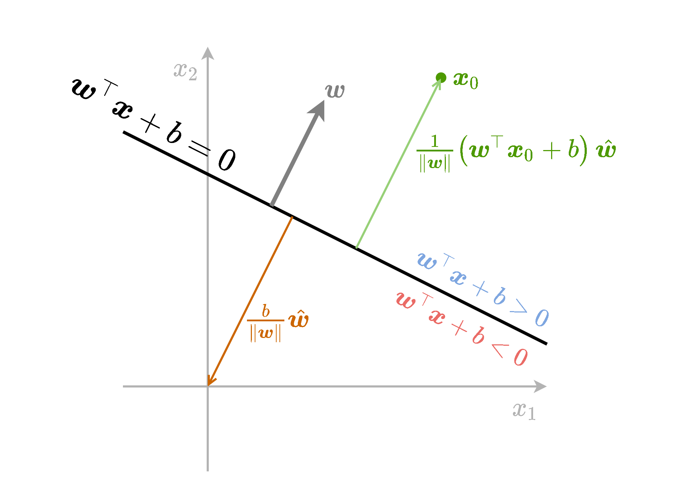
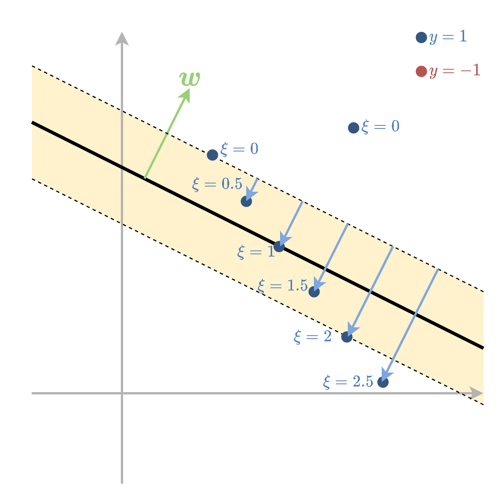

<section class="center">
<section>

# תרגול 6 - SVM ופונקציות גרעין (Kernels)

<a href="/assets/tutorial06_slides.pdf" class="link-button" target="_blank">PDF</a>

</section><section>

## תקציר התיאוריה

**הערה**: בפרק זה נעסוק בסיווג בינארי ונסמן את התוויות של שתי המחלקות ב $1$ ו $-1$.

</section><section>

### תזכורת - גאומטריה של המישור

* מישור מתואר באופן הבא $\boldsymbol{w}^{\top}\boldsymbol{x}+b=0$.
* המישור מחלק את המרחב ומגדיר צד חיובי וצד שלילי.

-  $\boldsymbol{w}$ הינו הנורמל למישור.
- המרחק של המישור מהראשית הינו $\frac{b}{\lVert\boldsymbol{w}\rVert}$.
- המרחק של נקודה $\boldsymbol{x}_0$ מהמישור הינה $\frac{1}{\lVert\boldsymbol{w}\rVert}(\boldsymbol{w}^{\top}\boldsymbol{x}_0+b)$. 
- $\boldsymbol{w}$ ו $b$ מוגדרים עד כדי קבוע.

</section><section>

### מסווג לינארי

מסווג לינארי הוא מסווג מהצורה של

$$
h(\boldsymbol{x})=
\text{sign}(\boldsymbol{w}^{\top}\boldsymbol{x}+b)
=\begin{cases}
1 & \boldsymbol{w}^{\top}\boldsymbol{x}+b>0\\
-1 & \text{else}
\end{cases}
$$

עם $\boldsymbol{w}$ ו- $b$ כל שהם.

* המסווג מחלק את המרחב לשני צידיו של המישור:
  *  $\boldsymbol{w}^{\top}\boldsymbol{x}+b=0$
  * מישור זה מכונה מישור ההפרדה.

</section><section>

### Signed distance (מרחק מסומן)

נסתכל על בעיית סיווג בינארית עם תוויות $\text{y}=\pm1$.

*  נגדיר את ה- signed distance של דגימה כל שהיא ממשטח ההפרדה באופן הבא:

$$
d=\frac{1}{\lVert\boldsymbol{w}\rVert}(\boldsymbol{w}^{\top}\boldsymbol{x}+b)y
$$

* זהו המרחק של נקודה מהמישור.
* כאשר  $y$ תואם למיקום הנקודה $x$ ביחס למישור, הערך חיובי.

</section><section>

### 

</section><section>

### 

### פרידות לינארית (linear separability)

* בבעיות סיווג בינארי,  נאמר על המדגם שהוא פריד לינארית אם קיים מסווג לינארי אשר מסווג את המדגם בצורה מושלמת (בלי טעויות סיווג).

* כאשר המדגם פריד לינארית יהיו יותר ממסווג לינארי אחד אשר יכול לסווג בצורה מושלמת את המדגם.

</section><section>

### 

### Support Vector Machine (SVM)

* אלגוריתם דיסקרימינטיבי לסיווג בינארי אשר מחפש מסווג לינארי אשר יסווג בצורה טובה את המדגם.
* אלגוריתם זה יבחר את המסווג בעל השוליים המירביות מכל המסווגים שמצליחים לסווג את המדגם.

</section><section>

### 

#### Hard SVM

*  ניתן לשימוש אך ורק כאשר המדגם פריד לינארית.
* נחפש את המסווג הלינארי אשר בעבורו ה signed distance המינימאלי על ה train set הוא המקסימאלי:

$$
\boldsymbol{w}^*,b^*=\underset{\boldsymbol{w},b}{\arg\max}\quad \underset{i}{\min}\left\{\frac{1}{\lVert\boldsymbol{w}\rVert}(\boldsymbol{w}^{\top}\boldsymbol{x}^{(i)}+b)y^{(i)}\right\}
$$

*  בעיה זו שקולה לבעיית האופטימיזציה הבאה:

$$
\begin{aligned}
\boldsymbol{w}^*,b^*=
\underset{\boldsymbol{w},b}{\arg\min}\quad&\frac{1}{2}\left\lVert\boldsymbol{w}\right\rVert^2 \\
\text{s.t.}\quad&y^{(i)}\left(\boldsymbol{w}^{\top}\boldsymbol{x}^{(i)}+b\right)\geq1\quad\forall i
\end{aligned}
$$

בעיית אופטימיזציה זו מכונה הבעיה הפרימאלית.

</section><section>

### 

##### Margin - שוליים

* בכדי להבין את המשמעות של בעיית האופטימיזציה שקיבלנו נגדיר את המושג שוליים (margin) של המסווג.
* האיזור של ה margin מוגדר כאיזור סביב משטח ההפרדה אשר נמצא בתחום:

$$
1\geq\boldsymbol{w}^{\top}\boldsymbol{x}+b\geq-1
$$

</section><section>

* רוחב איזור זה נקבע על פי הגודל של הוקטור $\boldsymbol{w}$ ושווה ל $\frac{2}{\lVert\boldsymbol{w}\rVert}$.

* האילוץ $y^{(i)}\left(\boldsymbol{w}^{\top}\boldsymbol{x}^{(i)}+b\right)\geq1$, אשר מופיע בבעיית האופטימיזציה הפרימאלית, דורש למעשה שכל הנקודות יסווגו נכונה ו**ימצאו מחוץ ל margin**.
* בעיית האופטימיזציה מחפשת את הפרמטרים של המישור בעל ה margin הגדול ביותר אשר מקיים תנאי זה.

</section><section>

### 

##### Support Vectors

* ה- support vectors מוגדרים כנקודות אשר יושבות על השפה של ה margin, עבור פתרון של בעיית האופטימיזציה.
* נקודות אלו מקיימות  $y^{(i)}\left(\boldsymbol{w}^{\top}\boldsymbol{x}^{(i)}+b\right)=1$.
* אלו הנקודות אשר ישפיעו על הפתרון של בעיית האופטימיזציה.
* לכן, הסרה או הזזה קטנה של נקודות שאינן support vectors לא תשנה את הפתרון.

</section><section>

### 

##### הבעיה הדואלית

* דרך שקולה לרישום בעיית האופטימיזציה הינה על ידי הגדרת $N$ משתני עזר נוספים $\{\alpha_i\}_{i=1}^N$.
* בעזרת משתנים אלו ניתן לרשום את בעיית האופטימיזציה באופן הבא:

$$
\begin{aligned}
\left\lbrace\alpha_i\right\rbrace^*
=\underset{\left\lbrace\alpha_i\right\rbrace}{\arg\max}\quad&\sum_i\alpha_i-\frac{1}{2}\sum_{i,j}y^{(i)}y^{(j)}\alpha_i\alpha_j\boldsymbol{x}^{(i)\top}\boldsymbol{x}^{(j)} \\
\text{s.t.}\quad
    &\alpha_i\geq0\quad\forall i\\
    &\sum_i\alpha_iy^{(i)}=0
\end{aligned}
$$

מתוך המשתנים $\{\alpha_i\}_{i=1}^N$ ניתן לשחזר את $\boldsymbol{w}$ אופן הבא:

$$
\boldsymbol{w}=\sum_i\alpha_iy^{(i)}\boldsymbol{x}^{(i)}
$$

</section><section>

### 

### קשר בין הבעיה הדואלית והפרימאלית:

| .                                      | .                                                      | .               |
| -------------------------------------- | ------------------------------------------------------ | --------------- |
| נקודות רחוקות מה margin                   | $y^{(i)}\left(\boldsymbol{w}^{\top}x^{(i)}+b\right)>1$ | $\alpha_i=0$    |
| נקודות על ה margin (שהם support vectors) | $y^{(i)}\left(\boldsymbol{w}^{\top}x^{(i)}+b\right)=1$ | $\alpha_i\geq0$ |

- אם $\alpha_i>0$ אז $y^{(i)}\left(\boldsymbol{w}^{\top}x^{(i)}+b\right)=1$ (אבל לא להיפך)
- אם $y^{(i)}\left(\boldsymbol{w}^{\top}x^{(i)}+b\right)>1$ אז $\alpha_i=0$ (אבל לא להיפך)

* את $b$ נחשב על ידי בחירת SV ונחלץ אותו מתוך $y^{(i)}\left(\boldsymbol{w}^{\top}x^{(i)}+b\right)=1$.

</section><section>

### 

### Soft SVM

* Soft SVM מתייחס למקרה שבו המדגם אינו פריד לינארית.
* במקרה זה עדיין מגדירים את ה margin בצורה דומה אך מאפשרים למשתנים להיכנס לתוך ה margin ואף לחצות אותה לצד הלא נכון של מישור ההפרדה.
* על כל חריגה כזו משלמים קנס ב objective שאותו מנסים למזער.

</section><section>

### 

* את החריגה של הדגימה ה $i$ נסמן ב $\frac{1}{\lVert\boldsymbol{w}\rVert}\xi_i$. לנקודות שהן בצד הנכון של המישור ומחוץ ל margin יהיה $\xi_{i}=0$

* המשתנים $\xi_i$ נקראים **slack variables**.

</section><section>

### 

* בעיית האופטימיזציה הפרימאלית תהיה:

$$
\begin{aligned}
\boldsymbol{w}^*,b^*,\{\xi_i\}^*=
\underset{\boldsymbol{w},b,\{\xi_i\}}{\arg\min}\quad&\frac{1}{2}\left\lVert\boldsymbol{w}\right\rVert^2+C\sum_{i=1}^N\xi_i \\
\text{s.t.}\quad
    &y^{(i)}\left(\boldsymbol{w}^{\top}\boldsymbol{x}^{(i)}+b\right)\geq1-\xi_i\quad\forall i\\
    &\xi_i\geq0\quad\forall i
\end{aligned}
$$

*  $C$ הוא hyper-parameter שקובע את גודל הקנס  על חריגה.

* הבעיה הדואלית הינה:

$$
\begin{aligned}
\left\lbrace\alpha_i\right\rbrace^*
=\underset{\left\lbrace\alpha_i\right\rbrace}{\arg\max}\quad&\sum_i\alpha_i-\frac{1}{2}\sum_{i,j}y^{(i)}y^{(j)}\alpha_i\alpha_j\boldsymbol{x}^{(i)\top}\boldsymbol{x}^{(j)} \\
\text{s.t.}\quad
    &0\leq\alpha_i\leq C\quad\forall i\\
    &\sum_i\alpha_iy^{(i)}=0
\end{aligned}
$$

</section><section>

### 

* ה support vectors מוגדרים להיות הנקודות שמקיימות $y^{(i)}\left(\boldsymbol{w}^{\top}\boldsymbol{x}^{(i)}+b\right)=1-\xi_i$

תכונות:

| .                                         | .                                                            | .                     |
| ----------------------------------------- | ------------------------------------------------------------ | --------------------- |
| נקודות שמסווגות נכון ורחוקות מה margin            | $y^{(i)}\left(\boldsymbol{w}^{\top}x^{(i)}+b\right)>1$       | $\alpha_i=0$          |
| נקודות על ה margin (שהם support vectors)    | $y^{(i)}\left(\boldsymbol{w}^{\top}x^{(i)}+b\right)=1$       | $0\leq\alpha_i\leq C$ |
| נקודות שחורגות מה margin (גם support vectors) | $y^{(i)}\left(\boldsymbol{w}^{\top}x^{(i)}+b\right)=1-\xi_i$ | $\alpha_i=C$          |

</section><section>

### 

## פונקציות גרעין

### מאפיינים: תזכורת

* נוכל תמיד לחליף את וקטור המשתנים $\boldsymbol{x}$ שעליו פועל האלגוריתם בוקטור חדש $\boldsymbol{x}_{\text{new}}=\Phi(\boldsymbol{x})$.
* $\Phi$ היא פונקציה אשר נבחרה מראש ונקראת פונקציית המאפיינים.

</section><section>

### 

### פונקציות גרעין

* החישוב של $\Phi(\boldsymbol{x})$ יכול להיות יקר.
* לעיתים, קיימת דרך לחשב בצורה יעילה את הפונקציה $K(\boldsymbol{x}_1,\boldsymbol{x}_2)=\Phi(\boldsymbol{x}_1)^{\top}\Phi(\boldsymbol{x}_2)$ אשר נקראת פונקציית גרעין
  * ישנם אפילו מקרים שבהם וקטור המאפיינים אינסופי!

* ישנם קריטריונים תחתם פונקציה מסויימת $K(\boldsymbol{x}_1,\boldsymbol{x}_2)$ היא פונקציית גרעין בעבור וקטור מאפיינים מסויים. בקורס לא נכנס לכך.

</section><section>

### 

נציג שתי פונקציות גרעין נפוצות:

* גרעין גאוסי:
*  $K(\boldsymbol{x}_1,\boldsymbol{x}_2)=\exp\left(-\frac{\lVert\boldsymbol{x}_1-\boldsymbol{x}_2\rVert_2^2}{2\sigma^2}\right)$
  * כאשר $\sigma$ פרמטר שיש לקבוע.

* גרעין פולינומיאלי: $K(\boldsymbol{x}_1,\boldsymbol{x}_2)=(1+\boldsymbol{x}_1^{\top}\boldsymbol{x}_2)^p$
  * כאשר $p\geq1$ פרמטר שיש לקבוע.

פונקציית המאפיינים שמתאימות לגרעינים אלו מסורבלות לכתיבה ולא נציג אותן כאן.

</section><section>

### 

### Kernel Trick in SVM

* טריק זה מאפשר להשתמש ב SVM עם מאפיינים מבלי לחשב את $\Phi$ באופן ישיר באמצעות פונקציית גרעין.

*  עבור פונקציית מאפיינים $\Phi$ עם פונקציית גרעין $K$ הבעיה הדואלית של SVM הינה:

$$
\begin{aligned}
\left\lbrace\alpha_i\right\rbrace^*
=\underset{\left\lbrace\alpha_i\right\rbrace}{\arg\max}\quad&\sum_i\alpha_i-\frac{1}{2}\sum_{i,j}y^{(i)}y^{(j)}\alpha_i\alpha_jK(\boldsymbol{x}^{(i)},\boldsymbol{x}^{(j)}) \\
\text{s.t.}\quad
    &\alpha_i\geq0\quad\forall i\\
    &\sum_i\alpha_iy^{(i)}=0
\end{aligned}
$$

* בעיית זו מגדירה את המשתנים $\{\alpha_i\}$ בלי צורך לחשב את $\Phi$ באופן מפורש בשום שלב.

</section><section>

* הפרמטר $\boldsymbol{w}$ נתון על ידי:

$$
\boldsymbol{w}=\sum_i\alpha_iy^{(i)}\Phi(\boldsymbol{x}^{(i)})
$$

* כדי לחשב את $\boldsymbol{w}$ באופן מפורש יש לחשב את $\Phi$.
* עם זאת, ניתן להמנע מכך 
* נציב את הנוסחא של $\boldsymbol{w}$ ישירות למסווג ובכך נוכל להינמע מלחשב את $\Phi$:

$$
\begin{aligned}
h(\boldsymbol{x})
&=\text{sign}(\boldsymbol{w}^{\top}\Phi(\boldsymbol{x})+b)\\
&=\text{sign}(\sum_i\alpha_iy^{(i)}\Phi(\boldsymbol{x}^{(i)})^{\top}\Phi(\boldsymbol{x})+b)\\
&=\text{sign}(\sum_i\alpha_iy^{(i)}K(\boldsymbol{x}^{(i)},\boldsymbol{x})+b)\\
\end{aligned}
$$
 
* כך בעצם נוכל להשתמש במסווג מבלי לחשב את $\Phi$ מפורשות

</section><section>

### 

## תרגיל 6.1 - 2 Support Vectors

בשאלה זו נראה שבעבור מדגם המכיל 2 נקודות, אחת מכל מחלקה, הפתרון של בעיית hard SVM יהיה מישור הפרדה שיעבור בדיוק במרכז בין 2 הנקודות, ויהיה ניצב לוקטור המחבר את הנקודות

$$
\boldsymbol{w}=\frac{2}{\lVert\boldsymbol{x}^{(1)}-\boldsymbol{x}^{(2)}\rVert_2^2}\left(\boldsymbol{x}^{(1)}-\boldsymbol{x}^{(2)}\right), \quad b=-\frac{1}{2}\left(\boldsymbol{x}^{(1)}+\boldsymbol{x}^{(2)}\right)^{\top}\boldsymbol{w}
$$

</section><section>

### 

**1) הראו זאת על ידי פתרון הבעיה הדואלית.**

#### פתרון:

הבעיה הדואלית הינה:

$$
\begin{aligned}
\left\lbrace\alpha_i\right\rbrace^*
=\underset{\left\lbrace\alpha_i\right\rbrace}{\arg\max}\quad&\sum_i\alpha_i-\frac{1}{2}\sum_{i,j}y^{(i)}y^{(j)}\alpha_i\alpha_j\boldsymbol{x}^{(i)\top}\boldsymbol{x}^{(j)} \\
\text{s.t.}\quad
    &\alpha_i\geq0\quad\forall i\\
    &\sum_i\alpha_iy^{(i)}=0
\end{aligned}
$$

* נניח בלי הגבלת הכלליות ש $y^{(1)}=1$ ו $y^{(2)}=-1$.

</section><section>

נסתכל על האילוץ בשורה האחרונה:
$$
\begin{aligned}
\sum_{i=1}^2\alpha_i y^{(i)}=0\\
\Leftrightarrow\alpha_1-\alpha_2=0\\
\Leftrightarrow\alpha_1=\alpha_2=\alpha
\end{aligned}
$$

* מכאן שהמשתנה היחד בבעיה הינו $\alpha$.

</section><section>

* בעיית האופטימיזציה (ללא האילוצים) תהיה:

$$
\begin{aligned}
\alpha
=\underset{\alpha}{\arg\max}\quad&2\alpha-\frac{\alpha^2}{2}\sum_{i,j}y^{(i)}y^{(j)}\boldsymbol{x}^{(i)\top}\boldsymbol{x}^{(j)} \\
\text{s.t.}\quad &\alpha\geq0\\
=\underset{\alpha}{\arg\max}\quad&2\alpha-\frac{\alpha^2}{2}\left(
  \lVert\boldsymbol{x}^{(1)}\rVert_2^2
  -\boldsymbol{x}^{(1)\top}\boldsymbol{x}^{(2)}
  -\boldsymbol{x}^{(2)\top}\boldsymbol{x}^{(1)}
  +\lVert\boldsymbol{x}^{(2)}\rVert_2^2
  \right)\\
\text{s.t.}\quad &\alpha\geq0\\
=\underset{\alpha}{\arg\max}\quad&2\alpha-\frac{\alpha^2}{2}\lVert\boldsymbol{x}^{(1)}-\boldsymbol{x}^{(2)}\rVert_2^2\\
\text{s.t.}\quad &\alpha\geq0\\
\end{aligned}
$$

</section><section>

### 

ניתן לפתור את הבעיה על ידי גזירה והשוואה ל0:
$$
\begin{aligned}
&\frac{d}{d\alpha}2\alpha-\frac{\alpha^2}{2}\lVert\boldsymbol{x}^{(1)}-\boldsymbol{x}^{(2)}\rVert_2^2=0\\
\Leftrightarrow&2=\alpha\lVert\boldsymbol{x}^{(1)}-\boldsymbol{x}^{(2)}\rVert_2^2\\
\Leftrightarrow&\alpha=\frac{2}{\lVert\boldsymbol{x}^{(1)}-\boldsymbol{x}^{(2)}\rVert_2^2}\\
\end{aligned}
$$

את $\boldsymbol{w}$ נמצא על ידי:

$$
\boldsymbol{w}
=\sum_i\alpha_iy^{(i)}\boldsymbol{x}^{(i)}
=\alpha(\boldsymbol{x}^{(1)}-\boldsymbol{x}^{(2)})
=\frac{2}{\lVert\boldsymbol{x}^{(1)}-\boldsymbol{x}^{(2)}\rVert_2^2}\left(\boldsymbol{x}^{(1)}-\boldsymbol{x}^{(2)}\right)
$$

</section><section>

את $b$ מוצאים על ידי בחירת support vector אחד מתוך המשוואה $y^{(i)}\left(\boldsymbol{w}^{\top}\boldsymbol{x}^{(i)}+b\right)=1$.

* נסתכל על הנקודה הראשונה:

$$
\begin{aligned}
&y^{(1)}\left(\boldsymbol{w}^{\top}\boldsymbol{x}^{(1)}+b\right)=1\\
\Leftrightarrow&\boldsymbol{w}^{\top}\boldsymbol{x}^{(1)}+b=1\\
\Leftrightarrow&b=1-\boldsymbol{w}^{\top}\boldsymbol{x}^{(1)}
=\frac{\boldsymbol{w}^{\top}\boldsymbol{w}}{\lVert\boldsymbol{w}\rVert_2^2}-\boldsymbol{w}^{\top}\boldsymbol{x}^{(1)}
=\boldsymbol{w}^{\top}\left(\frac{\boldsymbol{w}}{\lVert\boldsymbol{w}\rVert_2^2}-\boldsymbol{x}^{(1)}\right)\\
\Leftrightarrow&b=\boldsymbol{w}^{\top}\left(\frac{1}{2}\left(\boldsymbol{x}^{(1)}-\boldsymbol{x}^{(2)}\right)-\boldsymbol{x}^{(1)}\right)\\
\Leftrightarrow&b=-\frac{1}{2}\left(\boldsymbol{x}^{(1)}+\boldsymbol{x}^{(2)}\right)^{\top}\boldsymbol{w}
\end{aligned}
$$

</section><section>

### 

#### 2) הראו זאת על ידי פתרון הבעיה הפרימאלית.

הבעיה הפרימלית הינה:

$$
\begin{aligned}
\boldsymbol{w}^*,b^*=
\underset{\boldsymbol{w},b}{\arg\min}\quad&\frac{1}{2}\left\lVert\boldsymbol{w}\right\rVert^2 \\
\text{s.t.}\quad&y^{(i)}\left(\boldsymbol{w}^{\top}\boldsymbol{x}^{(i)}+b\right)\geq1\quad\forall i
\end{aligned}
$$

* במקרה שבו יש רק נקודה אחת מכל מחלקה, שתי הנקודות בהכרח יהיו support vectors ויקיימו $y^{(i)}\left(\boldsymbol{w}^{\top}\boldsymbol{x}^{(i)}+b\right)=1$.

* נניח בלי הגבלת הכלליות ש $y^{(1)}=1$ ו $y^{(2)}=-1$.

</section><section>

שני האילוצים שהנקודות אלו מגדירות הם:
$$
\begin{aligned}
&\begin{cases}
    y^{(1)}\left(\boldsymbol{w}^{\top}\boldsymbol{x}^{(1)}+b\right)=1\\
    y^{(2)}\left(\boldsymbol{w}^{\top}\boldsymbol{x}^{(2)}+b\right)=1
\end{cases}\\
\Leftrightarrow&\begin{cases}
    \left(\boldsymbol{w}^{\top}\boldsymbol{x}^{(1)}+b\right)=1\\
    -\left(\boldsymbol{w}^{\top}\boldsymbol{x}^{(2)}+b\right)=1
\end{cases}\\
\Leftrightarrow&\begin{cases}
    \boldsymbol{w}^{\top}\boldsymbol{x}^{(1)}+b=1\\
    \boldsymbol{w}^{\top}\boldsymbol{x}^{(2)}+b=-1
\end{cases}\\
\Leftrightarrow&\begin{cases}
    b=-\frac{1}{2}\left(\boldsymbol{x}^{(1)}+\boldsymbol{x}^{(2)}\right)^{\top}\boldsymbol{w}\\
    \boldsymbol{w}^{\top}(\boldsymbol{x}^{(1)}-\boldsymbol{x}^{(2)})=2
\end{cases}\\
\end{aligned}
$$

</section><section>

נוכל להשתמש באילוץ השני ולכתוב בעזרתו את בעיית האופטימיזציה רק על $\boldsymbol{w}$:
$$
\begin{aligned}
\boldsymbol{w}^*=
\underset{\boldsymbol{w}}{\arg\min}\quad&\frac{1}{2}\left\lVert\boldsymbol{w}\right\rVert^2 \\
\text{s.t.}\quad&\boldsymbol{w}^{\top}(\boldsymbol{x}^{(1)}-\boldsymbol{x}^{(2)})=2
\end{aligned}
$$

* בעיה זו מחפשת את ה $\boldsymbol{w}$ בעל האורך המינימאלי כך שהמכפלה הוקטורית שלו עם $(\boldsymbol{x}^{(1)}-\boldsymbol{x}^{(2)})$ היא 2. הוקטור הזה יהיה וקטור בכיוון של $(\boldsymbol{x}^{(1)}-\boldsymbol{x}^{(2)})$ ובאורך של $2/\lVert\boldsymbol{x}^{(1)}-\boldsymbol{x}^{(2)}\rVert_2$
* מכאן:

$$
\boldsymbol{w}
=\frac{2}{\lVert\boldsymbol{x}^{(1)}-\boldsymbol{x}^{(2)}\rVert_2^2}\left(\boldsymbol{x}^{(1)}-\boldsymbol{x}^{(2)}\right)
$$

</section><section>

### 

## תרגיל 6.2 - Hard SVM

נתון המדגם הבא:

| .            | 1  | 2  | 3  | 4  | 5  | 6  |
| ------------ | -- | -- | -- | -- | -- | -- |
| $\text{y}$   | -1 | -1 | -1 | 1  | 1  | 1  |
| $\text{x}_1$ | 1  | 1  | 4  | 6  | 7  | 10 |
| $\text{x}_2$ | 6  | 10 | 11 | 1  | 6  | 4  |

</section><section>

### 

</section><section>

### 

#### **1)** מצא את מסווג ה hard SVM המתאים למדגם זה. מי הם וקטורי התמיכה?

* בעיית האופטימיזציה הפרימאלית אותה נרצה לפתור הינה:

$$
\begin{aligned}
\boldsymbol{w}^*,b^*=
\underset{\boldsymbol{w},b}{\arg\min}\quad&\frac{1}{2}\left\lVert\boldsymbol{w}\right\rVert^2 \\
\text{s.t.}\quad&y^{(i)}\left(\boldsymbol{w}^{\top}\boldsymbol{x}^{(i)}+b\right)\geq1\quad\forall i
\end{aligned}
$$

* באופן כללי פתרון בעיות מסוג זה באופן ידני הוא קשה, אך בעבור מקרים פשוטים נוכל לפתור זאת תוך שימוש בעיקרון הבא:
  * *במידה ומצאנו את הפיתרון האופטימאלי על תת מדגם מתוך המדגם המלא, ומתקיים שבעבור הפתרון שמצאנו, הנקודות שאינן חלק מתת המדגם נמצאות מחוץ ל margin, אז הפתרון הוא בהכרח הפתרון האופטימאלי בעבור המדגם כולו.*

</section><section>

* עקרון זה נכון בגלל העובדה שהוספה של אילוצים לבעיית מינימיזציה יכולה רק להגדיל את ה objective המינימאלי.
* המשמעות היא שניתן לנחש את ה support vectors ולפתור את הבעיה רק בעבור נקודות אלו תוך התעלמות משאר הנקודות.
* לאחר שנפתור את הבעיה על הנקודות שניחשנו יהיה עלינו לבדוק אם שאר נקודות במדגם מחוץ ל margin.
* אם אכן שאר הנקודות מחוץ ל margin אז פתרנו את הבעיה ואם לא אז עלינו לנחש נקודות אחרות.
* בעבור ה support vectors האילוצים של $y^{(i)}\left(\boldsymbol{w}^{\top}\boldsymbol{x}^{(i)}+b\right)\geq1$ הופכים להיות אילוצי שיוון שאיתם הרבה יותר קל לעבוד.

</section><section>

ננסה לנחש מהם ה support vectors. נתחיל ב 0 ונגדיל בהדרגה את כמות ה support vectors.

</section><section>

##### 0 or 1 Support Vectors

* באופן כללי בעבור מדגם "נורמלי" אשר מכיל נקודות משני המחלקות שאותן יש לסווג, מקרים אלו לא יוכלו להתקיים.
* באופן תיאורטי במקרה המנוון שבו המדגם מכיל רק תוויות מסוג אחד אז ניתן להגדיר בצורות שונות את כמות ה support vectors, אך מקרים אלו לא מאד רלוונטיים

</section><section>

### 

##### 2 Support Vectors

* על פי התרגיל הקודם בעבור שני support vectors שמישור ההפרדה יעבור בדיוק במרכז בין 2 הנקודות, יהיה ניצב לוקטור המחבר את שתי הנקודות והשוליים של ה- margin יעברו דרך הנקודות.
* ננסה לחפש 2 נקודות שיכולות להיות support vectors.

</section><section>

### 

*  נראה שכל בחירה של זוג נקודות יצור איזור של margin שמכיל נקודה אחרת ולכן לא מקיים את האילוצים.
* לכן הפתרון לא יכול להכיל רק שני support vectors.

</section><section>

### 

##### 3 Support Vectors

ישנן שתי שלשות שיתכן שיהיו ה support vectors של הפתרון:

- $\{1,3,5\}$
- $\{3,4,5\}$

</section><section>

* נסתכל ראשית על תת המדגם {3,4,5}. 

* נשים לב שכאן הפתרון עבור תת המדגם $\{3,5\}$ מקיים את האילוץ שגם נקודה 4 מסווגת נכון
* אולם ראינו שפתרון שכזה אינו מקיים את שאר האילוצים!

</section><section>
 
 

### 

* השלשה $\{1,3,5\}$ מגדירה איזור margin שאינו מכיל נקודות אחרות ולכן מקיים את האילוצים:

* נקודות אלו יהיו שלושת ה support vectors שיגדיר את הפתרון לבעיה. נחשב את הפתרון המתקבל משלושת הנקודות האלה.

</section><section>

מתוך האילוצים נקבל 3 משוואות ב3 נעלמים. בעבור הנקודות $\{1,3,5\}$ משוואות אלו יהיו:
$$
\begin{aligned}
\begin{cases}
-\left((1,6)\boldsymbol{w}+b\right)=1\\
-\left((4,11)\boldsymbol{w}+b\right)=1\\
\left((7,6)\boldsymbol{w}+b\right)=1
\end{cases}\\
\Leftrightarrow\begin{cases}
w_1+6w_2+b=-1\\
4w_1+11w_2+b=-1\\
7w_1+6w_2+b=1
\end{cases}
\end{aligned}
$$

הפתרון של מערכת המשוואות הזו הינה $\boldsymbol{w}=\frac{1}{15}(5,-3)^{\top}$ ו $b=-\frac{2}{15}$

</section><section>

### 

**2)** מבלי לפתור את הבעיה הדואלית. אלו ערכים של $\{\alpha_i\}$ בהכרח יתאפסו?

* בעבור נקודות שאינן support vectors, נקבל ש-$\alpha_{i}$ בהכרח יתאפס
* בבעיה זו הנקודות שאינן support vectors הן $\{2,4,6\}$ ולכן $\alpha_2=\alpha_4=\alpha_6=0$.

</section><section>

### 

**3)** מהו הרוחב של ה margin של הפתרון?

ה margin תלוי בגודל של הוקטור $\boldsymbol{w}$ והוא שווה ל:
$$
\frac{2}{\lVert\boldsymbol{w}\rVert}=\frac{2\cdot15}{\sqrt{5^2+3^2}}=5.145
$$

</section><section>

### 

## תרגיל 6.3 - גרעין גאוסי

נתון מדגם המכיל 2 נקודות אחת מכל מחלקה:

$$
\begin{aligned}
&x^{(1)}=(1,1)^{\top},\quad & y^{(1)}=+1 \\
&x^{(2)}=(-1,-1)^{\top},\quad &y^{(2)}=-1 \\
\end{aligned}
$$

חשבו את המסווג המתקבל מ soft SVM עם גרעין גאוסי מהצורה $K(\boldsymbol{x}_1,\boldsymbol{x}_2)=\exp\left(-\lVert\boldsymbol{x}_1-\boldsymbol{x}_2\rVert^2\right)$.

</section><section>

### 

### פתרון 6.3

הבעיה הדואלית עם הגרעין הגאוסי הינה:

$$
\begin{aligned}
\left\lbrace\alpha_i\right\rbrace^*
=\underset{\left\lbrace\alpha_i\right\rbrace}{\arg\max}\quad&\sum_i\alpha_i-\frac{1}{2}\sum_{i,j}y^{(i)}y^{(j)}\alpha_i\alpha_jK(\boldsymbol{x}^{(i)},\boldsymbol{x}^{(j)})\\
\text{s.t.}\quad
    &\alpha_i\geq0\quad\forall i\\
    &\sum_i\alpha_iy^{(i)}=0
\end{aligned}
$$

בדומה לתרגיל הראשון נקבל ש:

$$
\alpha_1=\alpha_2=\alpha
$$

</section><section>

### 

נחשב את הערכים של $K(\boldsymbol{x}^{(i)},\boldsymbol{x}^{(j)})$:
$$
\begin{aligned}
K(\boldsymbol{x}^{(1)},\boldsymbol{x}^{(1)})=\exp(0)=1\\
K(\boldsymbol{x}^{(2)},\boldsymbol{x}^{(2)})=\exp(0)=1\\
K(\boldsymbol{x}^{(1)},\boldsymbol{x}^{(2)})=\exp(-(2^2+2^2))=e^{-8}
\end{aligned}
$$

</section><section>

### 

בעיית האופטימיזציה הינה:
$$
\begin{aligned}
\alpha^*
=\underset{\alpha}{\arg\max}\quad&2\alpha-\frac{\alpha^2}{2}\left(
  K(\boldsymbol{x}^{(1)},\boldsymbol{x}^{(1)})
  -2K(\boldsymbol{x}^{(1)},\boldsymbol{x}^{(2)})
  +K(\boldsymbol{x}^{(2)},\boldsymbol{x}^{(2)})
\right)\\
\text{s.t.}\quad &\alpha\geq0\\
=\underset{\alpha}{\arg\max}\quad&2\alpha-\alpha^2(1-e^{-8})\\
\text{s.t.}\quad &\alpha\geq0\\
\end{aligned}
$$

נגזור ונשווה ל-0:
$$
\begin{aligned}
&\frac{d}{d\alpha}2\alpha-\alpha^2(1-e^{-8})=0\\
\Leftrightarrow&1=\alpha(1-e^{-8})\\
\Leftrightarrow&\alpha=\frac{2}{1-e^{-8}}
\end{aligned}
$$

</section><section>

### 

הוקטור $\boldsymbol{w}$ נתון על ידי: $\boldsymbol{w}=\sum_i\alpha_iy^{(i)}\Phi(\boldsymbol{x}^{(i)})$. נכתוב את הביטוי $\boldsymbol{w}^{\top}\Phi(\boldsymbol{x})$ בעבור נקודה כל שהיא $\boldsymbol{x}$:
$$
\begin{aligned}
\boldsymbol{w}^{\top}\Phi(\boldsymbol{x})
&=\sum_i\alpha_iy^{(i)}\Phi(\boldsymbol{x}^{(i)})^{\top}\Phi(\boldsymbol{x})\\
&=\sum_i\alpha_iy^{(i)}K(\boldsymbol{x}^{(i)},\boldsymbol{x})\\
&=\frac{1}{1-e^{-8}}\left(K(\boldsymbol{x}^{(1)},\boldsymbol{x})-K(\boldsymbol{x}^{(2)},\boldsymbol{x})\right)
\end{aligned}
$$

נחשב את $b$ על ידי שימוש בנקודה הראשונה:
$$
\begin{aligned}
1&=y^{(1)}\left(\boldsymbol{w}^{\top}\Phi(\boldsymbol{x}^{(1)})+b\right)\\
\Leftrightarrow b&=1-\boldsymbol{w}^{\top}\Phi(\boldsymbol{x}^{(1)})\\
\Leftrightarrow b&=1-\frac{1}{1-e^{-8}}\left(K(\boldsymbol{x}^{(1)},\boldsymbol{x}^{(1)})-K(\boldsymbol{x}^{(2)},\boldsymbol{x}^{(1)})\right)\\
\Leftrightarrow b&=1-\frac{1}{1-e^{-8}}\left(1-e^{-8}\right)=0
\end{aligned}
$$

</section><section>

המסווג הינו:
$$
\begin{aligned}
h(\boldsymbol{x})
&=\text{sign}(\boldsymbol{w}^{\top}\Phi(\boldsymbol{x})+b)\\
&=\text{sign}\left(\frac{1}{1-e^{-8}}\left(K(\boldsymbol{x}^{(1)},\boldsymbol{x})-K(\boldsymbol{x}^{(2)},\boldsymbol{x})\right)\right)\\
&=\text{sign}\left(K(\boldsymbol{x}^{(1)},\boldsymbol{x})-K(\boldsymbol{x}^{(2)},\boldsymbol{x})\right)\\
&=\text{sign}\left(
  \exp\left(-\lVert\boldsymbol{x}^{(1)}-\boldsymbol{x}\rVert^2\right)
  -\exp\left(-\lVert\boldsymbol{x}^{(2)}-\boldsymbol{x}\rVert^2\right)
\right)\\
&=\text{sign}\left(
  \lVert\boldsymbol{x}^{(2)}-\boldsymbol{x}\rVert^2
  -\lVert\boldsymbol{x}^{(1)}-\boldsymbol{x}\rVert^2
\right)\\
&=\text{sign}\left((x_1+1)^2+(x_2+1)^2-(x_1-1)^2-(x_2-1)^2\right)\\
&=\text{sign}\left(2x_1+2x_2\right)\\
&=\text{sign}\left(x_1+x_2\right)\\
\end{aligned}
$$

</section><section>

### 

## חלק מעשי: זיהוי מין הדובר

<a href="./example/" class="link-button" target="_blank">Code</a>

בחלק זה, ננסה להשתמש ב- SVM כדי לזהות את מינו של הדובר באמצעות קולו. מוטיבציה למערכת כזאת יכולה להיות עוזר וירטואלי שרוצה לפנות לדובר לפי מינו. הרחבה לניסיון זה יכולה להיות זיהוי דובר על סמך קולו וכו'.

</section><section>

הרעיון וה- DATA נלקחו מ- Dataset והערכת ביצועים של קורי בקר, אשר נמצאים [באתר הבא](http://www.primaryobjects.com/2016/06/22/identifying-the-gender-of-a-voice-using-machine-learning/). בפרוייקט זה נאספו 3168 דגימות קול מתוייגות מהמקורות הבאים:

- [The Harvard-Haskins Database of Regularly-Timed Speech](http://www.nsi.edu/~ani/download.html)
- [Telecommunications & Signal Processing Laboratory (TSP) Speech Database at McGill University](http://www-mmsp.ece.mcgill.ca/Documents../Data/index.html)
- [VoxForge Speech Corpus](http://www.repository.voxforge1.org/downloads/SpeechCorpus/Trunk/Audio/Main/8kHz_16bit/)
- [Festvox CMU_ARCTIC Speech Database at Carnegie Mellon University](http://festvox.org/cmu_arctic/)

</section><section>

### 

כל רצועת קול עברה עיבוד באמצעות כלי בשם [WarbleR](https://cran.r-project.org/web/packages/warbleR/warbleR.pdf) בכדי לייצר 20 Features לכל דגימה:

- **label**: The label of each track: male/female
- **meanfreq**: mean frequency (in kHz)
- **sd**: standard deviation of frequency
- **median**: median frequency (in kHz)
- **Q25**: first quantile (in kHz)
- **Q75**: third quantile (in kHz)
- **IQR**: interquantile range (in kHz)
- **skew**: skewness (see note in specprop description)
- **kurt**: kurtosis (see note in specprop description)
- **sp.ent**: spectral entropy
- **sfm**: spectral flatness
- **mode**: mode frequency
- **centroid**: frequency centroid (see specprop)
- **meanfun**: average of fundamental frequency measured across acoustic signal
- **minfun**: minimum fundamental frequency measured across acoustic signal
- **maxfun**: maximum fundamental frequency measured across acoustic signal
- **meandom**: average of dominant frequency measured across acoustic signal
- **mindom**: minimum of dominant frequency measured across acoustic signal
- **maxdom**: maximum of dominant frequency measured across acoustic signal
- **dfrange**: range of dominant frequency measured across acoustic signal
- **modindx**: modulation index. Calculated as the accumulated absolute difference between

</section><section>

### 

נציג מספר עמודות ושורות מן המדגם:

|    | label   |   meanfreq |        sd |    median |        Q25 |       Q75 |       IQR |     skew |       kurt |
|---:|:--------|-----------:|----------:|----------:|-----------:|----------:|----------:|---------:|-----------:|
|  0 | male    |  0.059781  | 0.0642413 | 0.0320269 | 0.0150715  | 0.0901934 | 0.075122  | 12.8635  |  274.403   |
|  1 | male    |  0.0660087 | 0.06731   | 0.0402287 | 0.0194139  | 0.0926662 | 0.0732523 | 22.4233  |  634.614   |
|  2 | male    |  0.0773155 | 0.0838294 | 0.0367185 | 0.00870106 | 0.131908  | 0.123207  | 30.7572  | 1024.93    |
|  3 | male    |  0.151228  | 0.0721106 | 0.158011  | 0.0965817  | 0.207955  | 0.111374  |  1.23283 |    4.1773  |
|  4 | male    |  0.13512   | 0.0791461 | 0.124656  | 0.0787202  | 0.206045  | 0.127325  |  1.10117 |    4.33371 |
|  5 | male    |  0.132786  | 0.0795569 | 0.11909   | 0.067958   | 0.209592  | 0.141634  |  1.93256 |    8.3089  |
|  6 | male    |  0.150762  | 0.0744632 | 0.160106  | 0.0928989  | 0.205718  | 0.112819  |  1.53064 |    5.9875  |
|  7 | male    |  0.160514  | 0.0767669 | 0.144337  | 0.110532   | 0.231962  | 0.12143   |  1.39716 |    4.76661 |
|  8 | male    |  0.142239  | 0.0780185 | 0.138587  | 0.0882063  | 0.208587  | 0.120381  |  1.09975 |    4.07028 |
|  9 | male    |  0.134329  | 0.08035   | 0.121451  | 0.07558    | 0.201957  | 0.126377  |  1.19037 |    4.78731 |

</section><section>

### 

הפילוג של התוויות (גברים נשים) במדגם הינו:

</section><section>

### 

נציג את ההיסטוגרמה של כל אחד מהמאפיינים בעבור כל אחד מתוויות:

</section><section>

### 

### Soft SVM

ננסה לפתור את בעיית הסיווג של מין הדובר בעזרת soft SVM. נרצה לשם כך לפתור את בעיית האופטימיזציה הבאה (הבעיה הדואלית):

$$
\begin{aligned}
\left\lbrace\alpha_i\right\rbrace^*
=\underset{\left\lbrace\alpha_i\right\rbrace}{\arg\max}\quad&\sum_i\alpha_i-\frac{1}{2}\sum_{i,j}y^{(i)}y^{(j)}\alpha_i\alpha_j\boldsymbol{x}^{(i)\top}\boldsymbol{x}^{(j)} \\
\text{s.t.}\quad
    &0\leq\alpha_i\leq C\quad\forall i\\
    &\sum_i\alpha_iy^{(i)}=0
\end{aligned}
$$

</section><section>

### 

* נמצא את $\boldsymbol{w}$  בעזרת:

$$
\boldsymbol{w}=\sum_i\alpha_iy_i\boldsymbol{x}_i
$$

* ניתן לחשב את $b$ על ידי בחירה של נקודה שעבורה $0<\alpha_i$ ולהשתמש במשוואה: $y_i\left(\boldsymbol{w}^T\boldsymbol{x}_i+b\right)=1-\xi_i$.

* בכדי לפתור את הבעיה נצטרך לבחור פרמטר משקל $C$ אשר קובע את גודל הקנס לנקודות שחורגות מה margin. נתחיל ב $C=1$ ואחר כך ננסה למצוא את הערך המיטבי.

</section><section>

### 

#### חלוקת המדגם

כרגיל נחלק את המדגם ל 60%-20%-20% שהם train-validation-test.

#### נרמול

חשוב לנרמל את העמודות של המדגם לפני הרצת האלגוריתם משתי סיבות עיקריות:

1. המדגם מכיל מאפיינים ביחידות וסקלות שונות.
2. האלגוריתם מנסה למזער objective אשר מבוסס מרחק, מה שהופך אותו לרגיש לגודל של כל מאפיין. לדוגמא, אם נכפיל מאפיין מסויים בקבוע גדול מ-1 אנו ניתן לו חשיבות יתרה ב objective.

</section><section>

### 

### תוצאות

נשתמש באופטימיזציה נומרית על מנת למצוא את הפרמטרים של משטח ההפרדה. לשם המחשה נשרטט את הפילוג של ה signed distance של הנקודות בכל אחת מהמחלקות

ניתן לראות כי המשטח באמת מצליח לחלק את המדגם, עד כדי כמה נקודות שחורגות.

ה miscalssification rate שמתקבל על ה test set הינו 0.028.

</section><section>

### 

### מציאת ה $C$ האופטימאלי

נבחן סדרה של ערכי $C$ בתחום $10^{-3}$ עד $10^3$. כרגיל, בעבור כל ערך נבנה מסווג ונבחן אותו על ה validation set. נקבל את התוצאה הבאה:

קיבלנו כי הערך שאיתו התחלנו של $C=1$ הוא האופטימאלי מבין הערכים שבחרנו.

