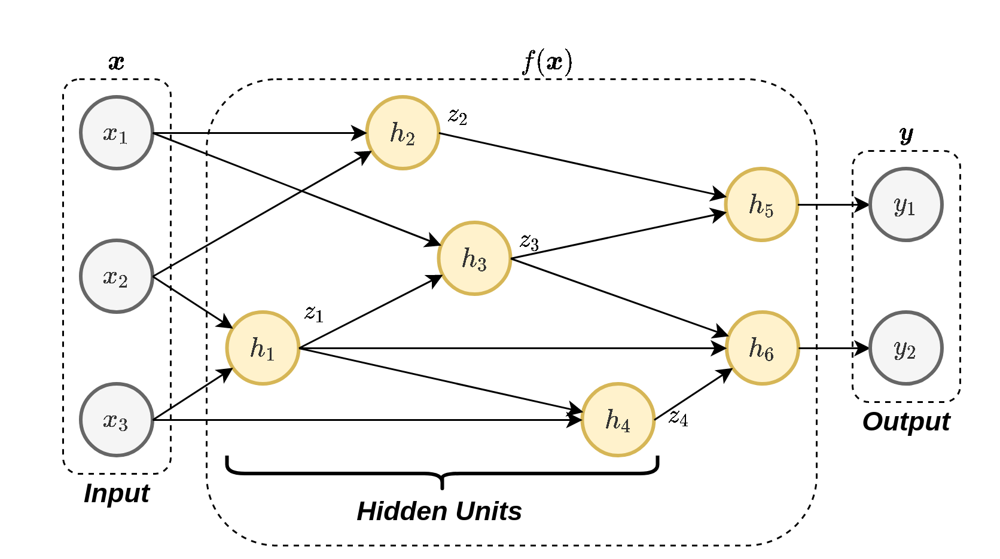
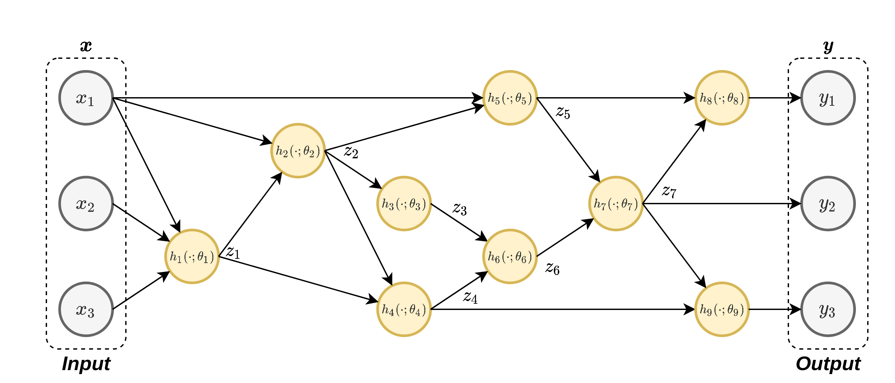
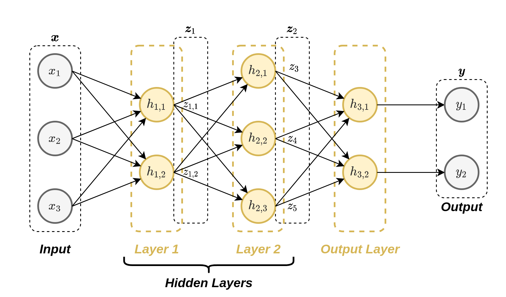
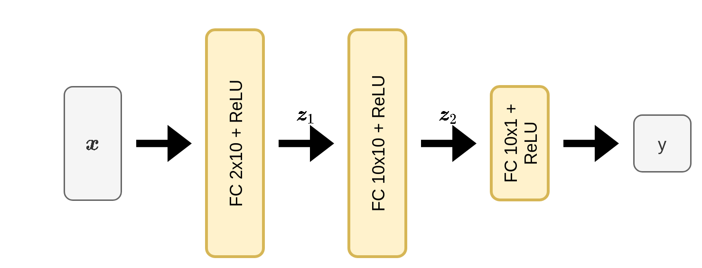
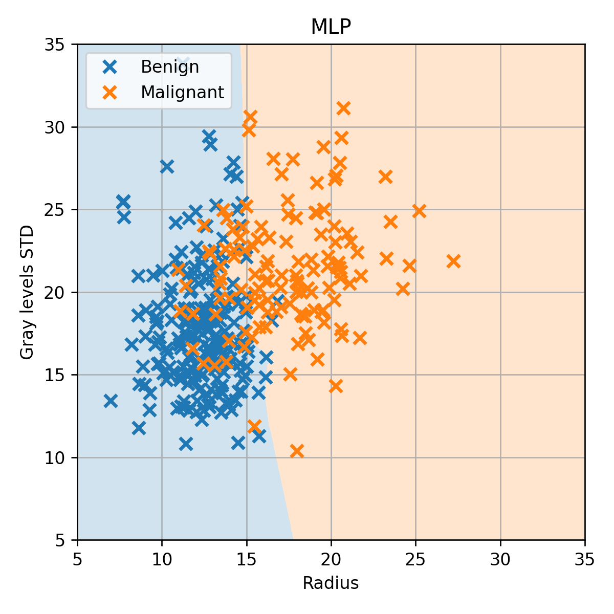
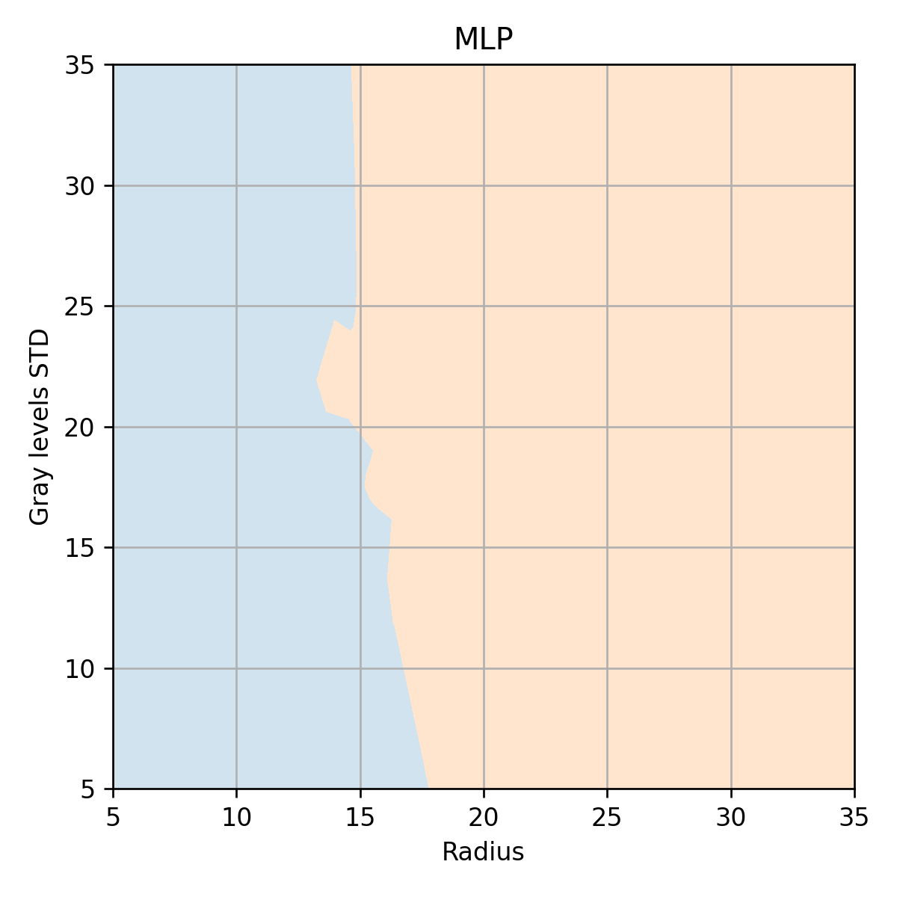

# תרגול 10 - MLP and Back-propagetion

<a href="./slides/" class="link-button" target="_blank">Slides</a>
<a href="/assets/tutorial10.pdf" class="link-button" target="_blank">PDF</a>

## תקציר התיאוריה

### Artificial Neural Networks (ANN)

רשתות ניורונים מלאכותיות (Artificial Neural Networks (ANN)) הינן שיטה לבניה של פונקציות פרמטריות בהשראת רשתות נוירונים ביולוגיות. בדומה לרשת נוירונים ביולוגית בה כל נוירון מבצע פעולה פשוטה אך שילוב של הרבה נוירונים מאפשר ללמוד פונקציות מורכבות, ברשתות נוירונים מלאכותיות נשלב הרבה פונקציות פרמטריות פשוטות על מנת לקבל מודל אשר יכול לייצג פונקציות מורכבות. הפונקציות הפשוטות הם המקבילה המלאכותית של הנויורונים הביולוגיים והם לרוב יקבלו מספר משתנים וחזירו סקלר:

בהשראת הנוירונים הביולוגיים אנו לרוב נבחר את הפונקציות הפשוטות להיות מהצורה של:

$$
h(\boldsymbol{x};\boldsymbol{w},b)=\varphi(\boldsymbol{w}^{\top}\boldsymbol{x}+b)
$$

שבה פונקציה סקלארית לא לינארית $\varphi$, המכונה פונקציית ההפעלה, פועלת על קומבינציה לינארית של הכניסה בתוספת קבוע (bias). אלא אם צויין אחרת, בקורס זה אנו נניח כי הנויירונים ברשת בנויים בצורה זו. בחירות נפוצות של הפונקציית ההפעלה הינן:

- הפונקציה הלוגיסטית (סיגמואיד): $\varphi(x)=\sigma(x)=\frac{1}{1+e^{-x}}$
- טנגנס היפרבולי: $\varphi(x)=\tanh\left(x/2\right)$
- פונקציית ה ReLU (Rectified Linear Unit): אשר מוגדרת $\varphi(x)=\max(x,0)$

מושגים:

- **יחידות נסתרות** (**hidden units**): הנוירונים אשר אינם מחוברים למוצא הרשת (אינם נמצאים בסוף הרשת).
- **רשת עמוקה** (**deep network**): רשת אשר מכילה מסלולים מהכניסה למוצא, אשר עוברים דרך יותר מיחידה נסתרת אחת.
- **ארכיטקטורה**: הצורה שבה הנוירונים מחוברים בתוך הרשת.

רשתות נוירונים מלאכותיות יכולות לשמש כפונקציה פרמטרית לכל דבר. בהקשר של הקורס נוכל להשתמש בהם כדי לפתור בעיות סיווג בגישה הדסיקרימינטיבת הסתברותית או בכדי לפתור בעיות רגרסיה בשיטת ה ERM. לרוב אנו נפתור את בעיות האופטימיזציה של מציאת הפרמטרים בעזרת gradient descent כאשר אנו נעזר בשיטת ה back-propogation על מנת לחשב את הנגזרות של הרשת על פי הפרמטריים.

בדומה לסימונים בשאר הקורס, גם כאן אנו נשתמש בוקטור $\boldsymbol{\theta}$ אשר יאגד את כל הפרמטרים של הרשת (הפרמטרים של כל הנוירונים).

#### הערה לגבי השם loss

עד כה השתמשנו בשם loss בהקשר של פונקציות risk (הקנס שמקבלים על שגיאת חיזוי בודדת מסויימת). בהקשר של רשתות נוירונים משתמשים לרוב במושג זה על מנת לתאר את פונקציית המטרה (ה objective) שאותו רוצים למזער בבעיית האופטימיזציה. (לדוגמא, ב MLE לרוב ה loss יתייחס למינוס של ה log-likelihood).

בכדי למנוע בלבול, בקורס זה נשתדל להיצמד להגדרה המקורית של פונקציית ה loss (שמגדירה את פונקציית ה risk) ונמשיך להשתמש בשם פונקציית מטרה או objective בכדי לתאר את הביטוי שאותו אנו רוצים למזער.

### Back-Propagation

Back-propogation עושה שימוש בכלל השרשרת של הנגזרת על מנת לחשב את הנגזרות של רשת נוירונים.

תזכורת לכלל השרשרת:

$$
\begin{aligned}
\frac{d}{dx} f(z_1(x),z_2(x),z_3(x))
=& &\left(\frac{d}{dz_1} f(z_1(x),z_2(x),z_3(x))\right)\frac{d}{dx}z_1(x)\\
 &+&\left(\frac{d}{dz_2} f(z_1(x),z_2(x),z_3(x))\right)\frac{d}{dx}z_2(x)\\
 &+&\left(\frac{d}{dz_3} f(z_1(x),z_2(x),z_3(x))\right)\frac{d}{dx}z_3(x)\\
\end{aligned}
$$

#### דוגמא (מההרצאה)

נסתכל על הרשת הבאה:

בעבור ערכים נתונים מסויימים של $\boldsymbol{x}$ ו $\boldsymbol{\theta}$ נרצה לחשב את הנגזרות של המוצא של הרשת $\boldsymbol{y}$ לפי הפרמטרים $\boldsymbol{\theta}$.

נסתכל לדוגמא על הנגזרת של $y_1$ לפי $\theta_3$. לשם הנוחות נסמן ב $z_i$ את המוצא של הניורון $h_i$.

נוכל לפרק את $\frac{dy}{d\theta_3}$ על פי כלל השרשת:

$$
\frac{dy_1}{d\theta_3}
=\frac{dy_1}{dz_3}\frac{dz_3}{d\theta_3}
=\frac{dy_1}{dz_3}\frac{dh_3}{d\theta_3}
$$

נוכל לפרק גם את $\frac{dy_1}{dz_3}$ על פי כלל השרשרת:

$$
\frac{dy_1}{dz_3}
=\frac{dy_1}{dz_6}\frac{dz_6}{dz_3}
=\frac{dy_1}{dz_6}\frac{dh_6}{dz_3}
$$

ונוכל להמשיך ולפרק את $\frac{dy_1}{dz_6}$:

$$
\frac{dy_1}{dz_6}
=\frac{dy_1}{dz_7}\frac{dz_7}{dz_6}
=\frac{dh_8}{dz_7}\frac{dh_7}{dz_6}
$$

זאת אומרת שאם נדע לחשב את הנגזרות של $\frac{dh_i}{dz_i}$ ו $\frac{dh_i}{d\theta_i}$ נוכל לחשב את הנגזרות לפי כל הפרמטרים. נסתכל לדוגמא על הנגזרת:

$$
\frac{d}{d\theta_6}h_6(z_3,z_4;\theta_6)
$$

עלינו ראשית לגזור את הפונקציה $h_6$ ואז להציב את הערכים של $z_3$, $z_4$ ו $\theta_6$. בכדי לחשב את הערכים של $z_i$ עלינו להעביר את $\boldsymbol{x}$ דרך הרשת ולשמור את כל ערכי הביניים $z_i$. חישוב זה של ערכי הביניים נקרא ה **forward pass**.

לאחר שחישבנו את ערכי הביניים $z_i$, נוכל להתחיל לחשב את כל הנגזרות של הרשת מהמוצא לכיוון הכניסה. זאת אומרת:

1. נחשב את: $\frac{dy_1}{d\theta_8}$, $\frac{dy_1}{dz_7}$.
2. נשתמש ב $\frac{dy_1}{dz_7}$ בכדי לחשב את $\frac{dy_1}{d\theta_7}$, $\frac{dy}{dz_5}$, $\frac{dy}{dz_6}$.
3. נשתמש ב $\frac{dy_1}{dz_6}$ בכדי לחשב את $\frac{dy_1}{d\theta_6}$, $\frac{dy}{dz_3}$, $\frac{dy}{dz_4}$.

וכן הלאה. מכיוון שבשלב זה אנו מחשבים את הנזגרות מהמוצא לכיוון הכניסה שלב זה נקרא ה **backward pass** ומכאן גם מקבלת השיטה את שמה.

### MultiLayer Perceptron (MLP)

ארכיטקטורה פשוטה ומאד נפוצה לרשת נוירונים הינה ארכיטקטורת ה **MultiLayer Perceptron (MLP)**. במודל זה הנוירונים מסודרים בשתייים או יותר שכבות (layers) של נוירונים. השכבות ב MLP הם שכבות שמכונות **Fully Connected (FC)** שבהם כל נוירון מוזן מ**כל** הנוריונים שבשכבה שלפניו.

כאשר הניורונים הם מהצורה של:

$$
h_{i,j}(\boldsymbol{z}_{i-1};\boldsymbol{w}_{i,j},b_{i,j})=\varphi(\boldsymbol{w}_{i,j}^T\boldsymbol{z}_{i-1}+b_{i,j})
$$

והפרמטרים הנלמדים הינם המשקולות $\boldsymbol{w}_{i,j}$ ואברי ההיסט $b_{i,j}$ בקומבינציה הליניארית שמכיל כל נוירון $h_{i,j}$.

ה Hyperparameters של MLP הינם:

- מספר השכבות
- מספר הנוירונים בכל שכבה
- פונקציית האקטיבציה

## תרגיל 10.1 - Back propagation in MLP

נרצה לפתור בעיית רגרסיה בעזרת ERM ורשת ה MLP הבאה בעלת כניסה באורך 2 ויציאה באורך 1 (מוצא סקלרי) ושכבה נסתרת אחת ברוחב 2:

כאשר ב $h_{1,1}$ ו $h_{1,2}$ יש פונקציית אקטיבציה מסוג ReLU וב $h_2$ אין פונקציה אקטיבציה. זאת אומרת:

$$
\begin{aligned}
h_{1,1}(\boldsymbol{x};\boldsymbol{w}_{1,1},b_1)&=\max(\boldsymbol{x}^{\top}\boldsymbol{w}_{1,1}+b_1,0)\\
h_{1,2}(\boldsymbol{x};\boldsymbol{w}_{1,2},b_1)&=\max(\boldsymbol{x}^{\top}\boldsymbol{w}_{1,2}+b_1,0)\\
h_2(\boldsymbol{z};\boldsymbol{w}_2,b_2)&=\boldsymbol{z}^{\top}\boldsymbol{w}_2+b_2
\end{aligned}
$$

**שימו לב:** שאיבר ההיסט בשכבה הראשונה $b_1$ משותף לשני הנוירונים בשכבה זו (זאת אומרת ששניהם משתמשים באותו פרמטר).

לשם פשטות, נרכז את כל הפרמטרים של הרשת לוקטור פרמטרים אחד:

$$
\boldsymbol{\theta}=[\boldsymbol{w}_{1,1}^{\top},\boldsymbol{w}_{1,2}^{\top},b_1,\boldsymbol{w}_2^{\top},b_2]^{\top}
$$

ונסמן את הפונקציה שאותה הרשת מממשת ב $\hat{\boldsymbol{y}}=f(\boldsymbol{x};\boldsymbol{\theta})$.

**1)** בעבור מדגם נתון $\mathcal{D}=\{\boldsymbol{x}^{(i)},y^{(i)}\}_{i=1}^N$ ופונקציית מחיר מסוג RMSE רשמו את בעיית האופטימיזציה שיש לפתור. בטאו את תשובתכם בעזרת הפונקציה $f$.

**2)** נפתור את בעיית האופטימיזציה בעזרת gradient descent עם גדול קצב לימוד $\eta$. רשמו את כלל העדכון של הפרמטרים של המודל $\boldsymbol{\theta}$ על ידי שימוש בגרדיאנט של הרשת לפי הפרמטרים, $\nabla_{\boldsymbol{\theta}}f(\boldsymbol{x};\boldsymbol{\theta})$.

**3)** נתון המדגם הבא באורך 2:

$$
\begin{aligned}
\boldsymbol{x}^{(1)}&=[1,2]^{\top}\qquad &y^{(1)}=70\\
\boldsymbol{x}^{(2)}&=[0,-1]^{\top}\qquad &y^{(2)}=50\\
\end{aligned}
$$

כמו כן, נתון כי בצעד מסויים $t$ הערכים של הפרמטרים הינם:

$$
\begin{aligned}
b_1^{(t)}&=1\\
\boldsymbol{w}_{1,1}^{(t)}&=[2,3]^{\top}\\
\boldsymbol{w}_{1,2}^{(t)}&=[4,-5]^{\top}\\
b_2^{(t)}&=6\\
\boldsymbol{w}_{2}^{(t)}&=[7,8]^{\top}\\
\end{aligned}
$$

חשבו את הערך של $b_1^{(t+1)}$ בעבור $\eta=0.01$.

### תרגיל 10.1 - פתרון

#### 1)

פונקציית המחיר (סיכון) של RMSE נתונה על ידי:

$$
\sqrt{\mathbb{E}\left[(\hat{\text{y}}-\text{y})^2\right]}
=\sqrt{\mathbb{E}\left[(f(\mathbf{x};\boldsymbol{\theta})-\text{y})^2\right]}
$$

הסיכון האמפירי מתקבל על ידי החלפה של התוחלת בממוצע על המדגם:

$$
\sqrt{\frac{1}{N}\sum_i(f(\boldsymbol{x}^{(i)};\boldsymbol{\theta})-y^{(i)})^2}
$$

בעיית האופטימיזציה שנרצה לפתור הינה למצוא את הפרמטרים שימזערו את הסיכון האמפירי:

$$
\underset{\boldsymbol{\theta}}{\arg\min}\sqrt{\frac{1}{N}\sum_i(f(\boldsymbol{x}^{(i)};\boldsymbol{\theta})-y^{(i)})^2}
=\underset{\boldsymbol{\theta}}{\arg\min}\frac{1}{N}\sum_i(f(\boldsymbol{x}^{(i)};\boldsymbol{\theta})-y^{(i)})^2
$$

#### 2)

נסמן את ה objective שאותו נרצה למזער ב:

$$
g(\boldsymbol{\theta})=\frac{1}{N}\sum_i(f(\boldsymbol{x}^{(i)};\boldsymbol{\theta})-y^{(i)})^2
$$

כלל העדכון של הפרמטרים הינו:

$$
\begin{aligned}
\boldsymbol{\theta}^{(t+1)}
&=\boldsymbol{\theta}^{(t)}-\eta\nabla_{\boldsymbol{\theta}}g(\boldsymbol{x};\boldsymbol{\theta}^{(t)})\\
&=\boldsymbol{\theta}^{(t)}-\eta\nabla_{\boldsymbol{\theta}}\frac{1}{N}\sum_i(f(\boldsymbol{x}^{(i)};\boldsymbol{\theta}^{(t)})-y^{(i)})^2\\
&=\boldsymbol{\theta}^{(t)}-\frac{2\eta}{N}\sum_i(f(\boldsymbol{x}^{(i)};\boldsymbol{\theta}^{(t)})-y^{(i)})\nabla_{\boldsymbol{\theta}}f(\boldsymbol{x}^{(i)};\boldsymbol{\theta}^{(t)})\\
\end{aligned}
$$

#### 3)

נרצה לחשב את:

$$
\boldsymbol{b}_1^{(t+1)}
=\boldsymbol{b}_1^{(t)}-\frac{2\eta}{N}\sum_i(f(\boldsymbol{x}^{(i)};\boldsymbol{\theta}^{(t)})-y^{(i)})\frac{d}{db_1}f(\boldsymbol{x}^{(i)};\boldsymbol{\theta}^{(t)})
$$

נחשב את $\frac{d}{db_1}f(\boldsymbol{x}^{(i)};\boldsymbol{\theta}^{(t)})$ בעזרת back-propogation.

##### $i=1$

נתחיל בעבור הדגימה הראשונה $i=1$. נחשב את ה forward-pass בשביל למצוא את משתני הביניים ואת המוצא:

$$
\begin{aligned}
z_1&=\max(\boldsymbol{x}^{(1)\top}\boldsymbol{w}_{1,1}+b_1,0)=\max([1,2][2,3]^{\top}+1,0)=\max(9,0)=9\\
z_2&=\max(\boldsymbol{x}^{(1)\top}\boldsymbol{w}_{1,2}+b_1,0)=\max([1,2][4,-5]^{\top}+1,0)=\max(-5,0)=0\\
y&=\boldsymbol{z}^{\top}\boldsymbol{w}_2+b_2=[9,0][7,8]^{\top}+6=69
\end{aligned}
$$

נחשב את הנגזרות ב backward-pass. נתחיל בחישוב של $\frac{d\hat{y}}{dz_1}$ ו $\frac{d\hat{y}}{dz_1}$:

$$
\begin{aligned}
\frac{d\hat{y}}{dz_1}&=\frac{d}{dz_1}(\boldsymbol{z}^{\top}\boldsymbol{w}_2+b_2)=w_{2,1}=7\\
\frac{d\hat{y}}{dz_2}&=\frac{d}{dz_2}(\boldsymbol{z}^{\top}\boldsymbol{w}_2+b_2)=w_{2,2}=8\\
\end{aligned}
$$

נשתמש בחישוב זה בכדי לחשב את $\frac{d}{db_1}f(\boldsymbol{x};\boldsymbol{\theta})=\frac{d\hat{y}}{db_1}$, נשים לב ש $b_1$ מופיע פעמים ברשת, ב $h_{1,1}$ וב $h_{1,2}$:

(נשתמש בעובדה ש $\frac{d}{dx}\max(x,0)=I\{x>0\}$)

$$
\begin{aligned}
\frac{d\hat{y}}{db_1}
  &= \frac{d\hat{y}}{dz_1}\frac{dz_1}{db_1}
    +\frac{d\hat{y}}{dz_2}\frac{dz_2}{db_1}\\
  &= 7\cdot I\{\boldsymbol{x}^{\top}\boldsymbol{w}_{1,1}+b_1>0\}
    +8\cdot I\{\boldsymbol{x}^{\top}\boldsymbol{w}_{1,2}+b_1>0\}
   =7
\end{aligned}
$$

##### $i=2$

נחשב באופן דומה את הנגזרת בעבור הדגימה השניה $i=2$. Forward-pass:

$$
\begin{aligned}
z_1&=\max(\boldsymbol{x}^{(1)\top}\boldsymbol{w}_{1,1}+b_1,0)=\max([0,-1][2,3]^{\top}+1,0)=\max(-2,0)=0\\
z_2&=\max(\boldsymbol{x}^{(1)\top}\boldsymbol{w}_{1,2}+b_1,0)=\max([0,-1][4,-5]^{\top}+1,0)=\max(6,0)=6\\
y&=\boldsymbol{z}^{\top}\boldsymbol{w}_2+b_2=[0,6][7,8]^{\top}+6=54
\end{aligned}
$$

Backward-pass:

$$
\begin{aligned}
\frac{d\hat{y}}{dz_1}&=\frac{d}{dz_1}(\boldsymbol{z}^{\top}\boldsymbol{w}_2+b_2)=w_{2,1}=7\\
\frac{d\hat{y}}{dz_2}&=\frac{d}{dz_2}(\boldsymbol{z}^{\top}\boldsymbol{w}_2+b_2)=w_{2,2}=8\\
\end{aligned}
$$

$$
\begin{aligned}
\frac{d\hat{y}}{db_1}
  &= \frac{d\hat{y}}{dz_1}\frac{dz_1}{db_1}
    +\frac{d\hat{y}}{dz_2}\frac{dz_2}{db_1}\\
  &= 7\cdot I\{\boldsymbol{x}^{\top}\boldsymbol{w}_{1,1}+b_1>0\}
    +8\cdot I\{\boldsymbol{x}^{\top}\boldsymbol{w}_{1,2}+b_1>0\}
   =8
\end{aligned}
$$

##### חישוב צעד העדכון

נציב את התוצאות שקיבלנו ואת $\eta=0.01$:

$$
\begin{aligned}
\boldsymbol{b}_1^{(t+1)}
  &=\boldsymbol{b}_1^{(t)}-\frac{2\eta}{N}\sum_i(f(\boldsymbol{x}^{(i)};\boldsymbol{\theta}^{(t)})-y^{(i)})\frac{d}{db_1}f(\boldsymbol{x}^{(i)};\boldsymbol{\theta}^{(t)})\\
  &=1-0.01\left(
      (f(\boldsymbol{x}^{(1)};\boldsymbol{\theta}^{(t)})-y^{(1)})\frac{d}{db_1}f(\boldsymbol{x}^{(1)};\boldsymbol{\theta}^{(t)})
      +(f(\boldsymbol{x}^{(2)};\boldsymbol{\theta}^{(t)})-y^{(2)})\frac{d}{db_1}f(\boldsymbol{x}^{(2)};\boldsymbol{\theta}^{(t)})
    \right)\\
  &=1-0.01\left((69-70)\cdot7+(54-50)\cdot8\right)
   =1-0.01\cdot25=0.75
\end{aligned}
$$

## תרגיל 10.2

**1)** הראו כיצד ניתן לייצג את הפונקציה הבאה בעזרת רשת MLP עם פונקציית אקטיבציה מסוג ReLU.

שרטטו את הרשת ורשמו את הערכים של פרמטרי הרשת.

**2)** האם ניתן לייצג **במדוייק** את הפונקציה $f(x)=x^2+\lvert x\rvert$ בעזרת רשת MLP עם אקטיבציה מסוג ReLU? הסבירו ו/או הדגימו.

### פתרון 10.2

#### 1)

בעזרת נויירונים בעלי פונקציית אקטיבציה מסוג ReLU הפועלים על קומבינציה לינארית של הכניסות, נוכל לבנות פונקציות רציפות ולינאריות למקוטעין, בעלות מספר סופי של קטעים, כמו זו בשבשאלה זו.

נבנה פונקציה זו בעזרת MLP בעל שיכבה נסתרת אחת אשר דואגת לייצג את המקטעים השונים ושיכבת מוצא אשר דואגת לשיפוע בכל מקטע. נבנה את השכבה הנסתרת כך שאנו מתאימים נוירון לכל נקודה בה משתנה השיפוע של פונקציית המטרה. נקבע את קבוע הbias בכל נוירון כך שהשינוי בשיפוע של ה ReLU (ב $x=0$) יהיה ממוקם על נקודה בה משתנה השיפוע של הפונקציה המקורית:

$$
\begin{aligned}
h_{1,1}(x)=\max(x+1,0) \\
h_{1,2}(x)=\max(x,0) \\
h_{1,3}(x)=\max(x-1,0) \\
\end{aligned}
$$

כעת נדאג לשיפועים. נסתכל על מקטעים משמאל לימין.

- המקטע השמאלי ביותר הינו בעל שיפוע 0 ולכן הוא כבר מסודר, שכן כל הפונקציות אקטיבציה מתאפסות באיזור זה.
- המקטע $[-1,0]$ מושפע רק מן הנוירון הראשון. השיפוע במקטע זה הינו 1 ולכן ניתן משקל של 1 לנירון זה.
- המקטע $[0,1]$ מושפע משני הנוירונים הראשונים. הנוירון הראשון כבר תורם שיפוע של 1 במקטע זה ולכן עלינו להוסיף לו עוד שיפוע של $-2$ על מנת לקבל את השיפוע של $-1$ הנדרש. ולכן ניתן משקל של $-2$ לנירון השני.
- באופן דומה ניתן לנוירון השלישי משקל של $2$.

סה"כ קיבלנו כי $h_2(z_1,z_2,z_3)=z_1-2z_2+2z_3$

#### 2)

מכיוון ש:

1. נוירון בעל פונקציית הפעלה מסוג ReLU מייצג פונקציה רציפה ולינארית למקוטעין.
2. כל הרכבה או סכימה של פונקציות רציפות ולינאריות למקוטעין יצרו תמיד פונקציה חדשה שגם היא רציפה ולינארית למקוטעין.

בעזרת נוירונים מסוג ReLU נוכל רק לייצג פונקציות רציפות ולנאריות למקוטעין. מכיוון ש$$x^2$$ אינה לינארית אנו נוכל רק לקרב אותה, אך לא לייצג אותה במדוייק.

## תרגיל מעשי - איבחון סרטן שד עם MLP

<a href="./example/" class="link-button" target="_blank">Code</a>

נסתכל שוב על הבעיה של איבחון סרטן שד על סמך תצלום מיקרוסקופי של ריקמה.

נציג שוב את את המדגם:

|    | diagnosis   |   radius_mean |   texture_mean |   perimeter_mean |   area_mean |   smoothness_mean |   compactness_mean |   concavity_mean |
|---:|:------------|--------------:|---------------:|-----------------:|------------:|------------------:|-------------------:|-----------------:|
|  0 | M           |         17.99 |          10.38 |           122.8  |      1001   |           0.1184  |            0.2776  |          0.3001  |
|  1 | M           |         20.57 |          17.77 |           132.9  |      1326   |           0.08474 |            0.07864 |          0.0869  |
|  2 | M           |         19.69 |          21.25 |           130    |      1203   |           0.1096  |            0.1599  |          0.1974  |
|  3 | M           |         11.42 |          20.38 |            77.58 |       386.1 |           0.1425  |            0.2839  |          0.2414  |
|  4 | M           |         20.29 |          14.34 |           135.1  |      1297   |           0.1003  |            0.1328  |          0.198   |
|  5 | M           |         12.45 |          15.7  |            82.57 |       477.1 |           0.1278  |            0.17    |          0.1578  |
|  6 | M           |         18.25 |          19.98 |           119.6  |      1040   |           0.09463 |            0.109   |          0.1127  |
|  7 | M           |         13.71 |          20.83 |            90.2  |       577.9 |           0.1189  |            0.1645  |          0.09366 |
|  8 | M           |         13    |          21.82 |            87.5  |       519.8 |           0.1273  |            0.1932  |          0.1859  |
|  9 | M           |         12.46 |          24.04 |            83.97 |       475.9 |           0.1186  |            0.2396  |          0.2273  |

נתחיל שוב בביצוע איבחון על סמך שתי העמודות הראשונות בלבד. אנו עושים זאת כמובן רק בכדי שנוכל להציג את הבעיה בגרף דו מימדי.

נפצל אותו שוב ל 60% train / 20% validation / 20% test. וננסה להתאים לו את המודל הבא:

כאשר FC 2x10 מציין שכבה של fully connected שבכניסה אליה יש וקטור באורך 2 וביציאה יש וקטור ברוחב 10 (זאת אומרת 10 נוירונים).

בכדי לבחור את קצב הלימוד $\eta$ נריץ את אלגוריתם ה gradient descent למספר קטן של צעדים:

בדומה לתרגול הקודם, אנו נבחר את הערך הגדול ביותר שבו הגרף יורד בצורה מונוטונית שבמקרה זה הינו $\eta=0.03$.

נריץ כעת האלגוריתם למספר גדול של צעדים:

נשים לב שהחל מנקודה מסויימת בריצה של אלגוריתם ה gradient descent החישוב של ה objective על ה validation set מתחיל לעלות. הסיבה לכך היא כמובן תופעת ה overfitting. נוכל להוריד את כמות ה overfitting על ידי כך שנעצור את האלגוריתם לפני שהוא מתכנס. פעולה זו מכונה early stopping. ניקח אם כן את הפרמטרים מהצעד עם הערך של ה objective הנמוך ביותר על ה validation, במקרה זה זהו הצעד ה 25236.

החזאי המתקבל ממודל זה הינו:

נשרטט גרף זה ללא הדגימות על מנת לראות את קו ההפרדה בין שני השטחים

ניתן לראות כי הרשת מצליחה לייצר חזאי עם קו הםרה יחסית מורכב בהשוואה ל LDA, QDA ו linear logistic regression.

ביצועי חזאי זה על ה valudation set הינם: 0.08. ביצועים אלו דומים לביצועים של QDA ו linear logistic regresssion.

### שימוש בכל 30 העמודות במדגם

נעבור כעת להשתמש בכל 30 העמודות במדגם. לשם כך נשתמש ברשת הבאה:

נחפש שוב את הערך המתאים ביותר של $\eta$:

במקרה זה נבחר את $\eta=0.003$. האימון המלא נראה כך:

הביצועים הטובים ביותר על ה validation set מתקבלים בצעד ה 107056. החזאי המתקבל בצעד זה מניב miscalssifiaction rate של 0.01 על ה validation set.

ביצועים המודל על ה test set הינם 0.03 (לעומת 0.04 ב linear logistic regression).

