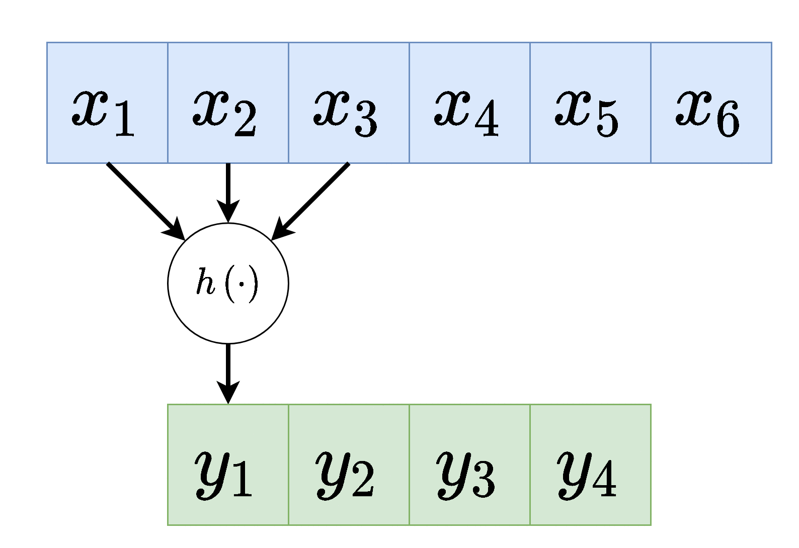
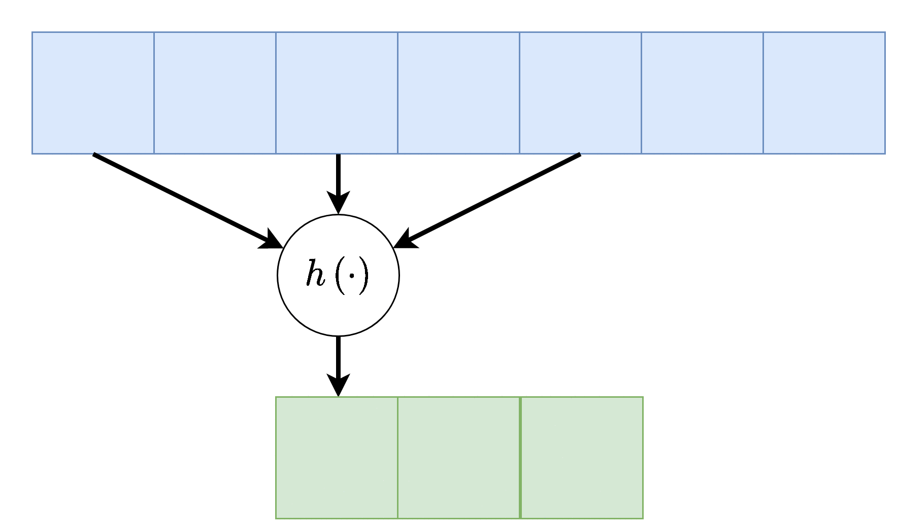
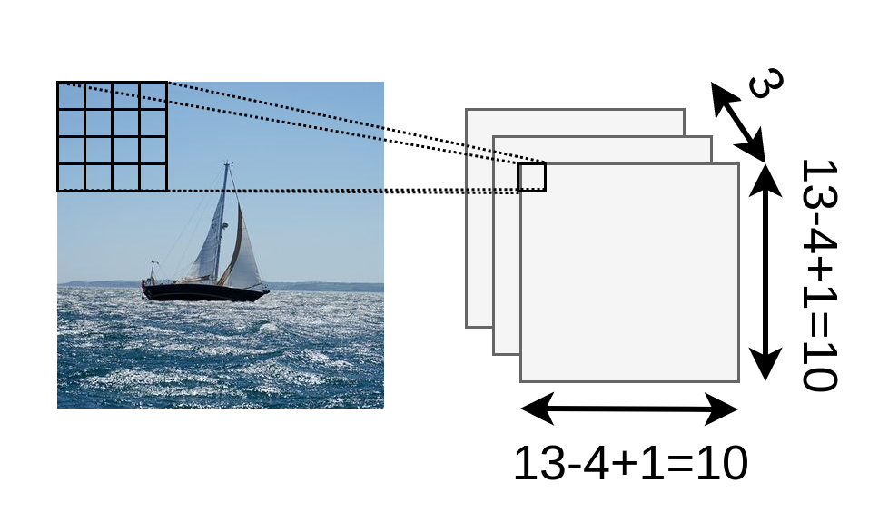
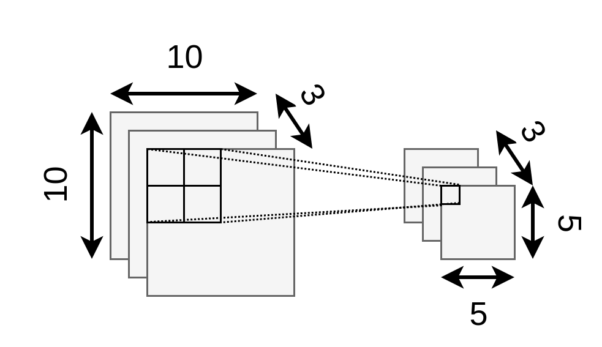
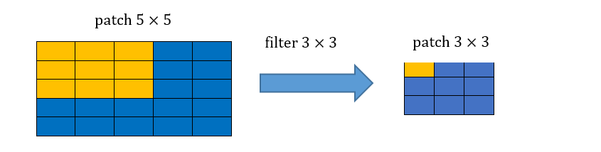
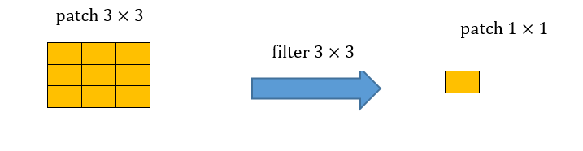
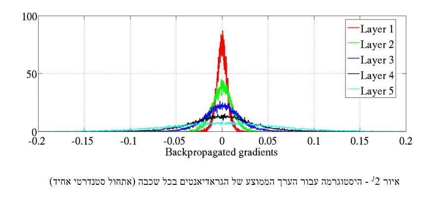
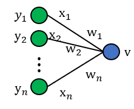

# תרגול 10 - CNN ואתחול

<a href="./slides/" class="link-button" target="_blank">Slides</a>
<a href="/assets/tutorial10.pdf" class="link-button" target="_blank">PDF</a>

## תקציר התיאוריה

### Convolutional Neural Networks (CNN) - רשתות קונבולוציה

אחת התכונות של מודל MLP (Fully Connected (FC) network) הינה חוסר רגישות לסדר בכניסות לרשת. תכונה זו נובעת מכך שכל היחידות בכל שכבה מחוברות לכל היחידות בשכבה העוקבת. במקרים רבים תכונה הינה תכונה רצויה, אך היא באה במחיר של מספר רב של פרמטרים.
במקרים בהם למידע אשר מוזן לרשת יש מבנה או תלות מרחבית, כלומר יש משמעות לסדר של הכניסות, נרצה לנצל את ההיתרון המרחבי של הכניסות בעת תכנון ארכיטקטורת הרשת. דוגמא לסוג כזה של מידע הן תמונות.
רשתות קונבולציה הינם סוג אחד רשתות feed-forward בעלת ארכיטקטורה אשר מנצלת את התלות המרחבית בכניסות לכל שכבה.

#### 1D Convolutional Layer

שכבת קונבולוציה חד-ממדית הינה שכבה ברשת אשר מבצעת את הפעולות הבאות:

1. פעולת קרוס-קורלציה (ולא קונבולוציה) בין וקטור הכניסה של אותה שכבה $\boldsymbol{z_{i-1}}$ ווקטור משקולות $\boldsymbol{w}$ באורך $K$.
2. הוספת היסט $b$ (אופציונלי).
3. הפעלה של פונקציית הפעלה על וקטור המוצא איבר איבר.

פעולת הקרוס-קורלציה מוגדרת באופן הבא:

$$
z_{i,1}=\sum_{m=1}^K z_{i,j+m-1}w_m
$$

באופן סכימתי, השכבה נראית כך:

כאשר $h(\boldsymbol{u};\boldsymbol{w},b)=\varphi(\boldsymbol{u}^{\top}\boldsymbol{w}+b)$ (הפונקציה $\varphi$ היא ההפעלה). שימו לב שבכל השכבה משתמשים באותו הוא $h_i$, זאת אומרת שמשתמשים באותם $\boldsymbol{w}_i$ ו $b_i$.

דרך נוספת להצגת שכבת קונבולוציה (לשם הפשטות נשתמש ב $\boldsymbol{x}$ לקלט ו $\boldsymbol{y}$ לפלט).

וקטור המשקולות של שכבת הקונבולציה $\boldsymbol{w}$ נקרא **גרעין הקונבולוציה (convolution kernel)**.

גדול המוצא של שכבת הקונבולוציה הוא קטן יותר מהכניסה והוא נתון על ידי $D_{\text{out}}=D_{\text{in}}-K+1$.

שכבת קונבולוציה מורידה באופן דרסטי את מס' המשקולות לעומת שכבת FC. בשכבת FC קיימות $D_{\text{in}}\times D_{\text{out}}$ משקולות בעוד שלשכבת קונבולציה יש $K$ משקולות.

#### קלט רב-ערוצי

במקרים רבים נרצה ששכבת הקונבולציה תקבל קלט רב ממדי, לדוגמא, תמונה בעלת שלושה ערוצי צבע או קלט שמע ממספר ערוצי הקלטה. מבנה זה מאפשר לאזור מרחבי בקלט להכיל אינפורמציה ממספר ערוצי כניסה.

במקרים אלו הניורון $h$ יהיה פונקציה של כל ערוצי הקלט:

הפונקציה $h$ היינה קומבינציה לינארית של כל ערוצי הקלט, לרוב מסיפים איבר הסט $b$ ופונקציית אקטיבציה.

#### פלט רב-ערוצי

בנוסף, נרצה לרוב להשתמש ביותר מגרעין קונבולוציה אחד, במקרים אלו נייצר מספר ערוצים ביציאה בעבור כל אחד מגרעיני הקונבולוציה.

בשכבות אלו אין שיתוף של משקולות בין ערוצי הפלט השונים, כלומר כל גרעין קונבולציה הוא בעל סט משקולות יחודי הפועל על כל הערוצי הכניסה על מנת להוציא פלט יחיד.
מספר הפרמטרים בשכבת כזאת היינו:  $\underbrace{C_\text{in}\times C_\text{out}\times K}_\text{the weights}+\underbrace{C_\text{out}}_\text{the bias}$.

כאשר:

- $C_\text{in}$ - מספר ערוצי קלט.
- $C_\text{out}$ - מספר ערוצי פלט.
- $K$ - גודל הגרעין.

<!-- **דגש:** שימו לב, יש להבדיל בין מס' הערוצים לממד הקלט/פלט. נגיד עבור ערוץ אחד אנחנו יכולים לקבל קלט רב ממדי (נגיד תמונה) ועבור פלט רב ערוצי, עבור כל ערוץ אנחנו יכולים לקבל מס' ממדים עבור כל ערוץ -->

#### היפר-פרמטרים של שכבות קונבולוציה

בנוסף לפרמטרים של **גודל הגרעין** ו **מספר ערוצי הפלט**, שהינם היפר-פרמטרים של שכבת הקונבולוציה, מקובל להגדיר גם את הפרמטרים הבאים:

##### Padding - ריפוד

משום שפעולת קונבולציה היינה מרחבית, בקצוות הקלט ישנה בעיה שאין ערכים חוקיים שניתן לבצע עליהם פעולות, לכן נהוג לרפד את שולי הקלט (באפסים או שכפול של אותו ערך בקצה)

##### Stride - גודל צעד

ניתן להניח שלרוב הקשר המרחבי נשמר באזורים קרובים, לכן על מנת להקטין בחישוביות ניתן לדלג על הפלט ולהפעיל את פעולת הקונבולציה באופן יותר דליל. בפשטות: מדלגית על היציאות בגודל הצעד. לרוב גודל הצעד מסומן ב $s$, בדוגמא הבאה גודל הצעד היינו $s=2$. אלא אם רשום אחרת, גודל הצעד של השכבה הוא 1.

##### Dilation - התרחבות

שוב על מנת להקטין בחישובית, אפשר לפעול על אזורים יותר גדולים תוך הנחה שערכים קרובים גיאוגרפית הם בעלי ערך זהה, על כן נרחיב את פעולת הקונבולציה תוך השמטה של ערכים קרובים. לרוב נסמן את ההתרחבות ב $d$ בדוגמא הבאה $d=2$. אלא אם רשום אחרת, ההתרחבות היא 1.

#### Max / Average Pooling

שיכבות נוספת אשר מופיעה במקרים רבים ברשתות CNN הם שכבות מסוג pooling. שכבות אלו מחליפות את פעולת הקונבולוציה בפונקציה קבועה אשר מייצרת סקלר מתוך מתוך הקלט של הנוירון. שני שכבות pooling נפוצות הם max pooling ו average pooling, שכבה זו לוקחת את הממוצע והמקסימום של ערכי הכניסה.

דוגמא זו מציגה max pooling בגודל 2 עם גודל צעד (stride) גם כן של 2:

בשכבה זאת אין פרמטרים נלמדים, אך גודל הגרעין וגודל הצעד הינם היפר-פרמטרים של השכבה.

#### 2D Convolutional Layer

עבור קלט דו-ממדי (תמונות), הקלט מסודר כמטריצה. ופעולת הקונבולוציה (קרוס-קורלציה כפי שאתם מכירים) נראה כך:

כאשר השכבה הכחולה היא הקלט והשכבה הירוקה היא הפלט

<table style="width:100%; table-layout:fixed;">
  <tr>
    <td>
kernel size=3 padding=0 stride=1 dilation=1
</td>
    <td>
kernel size=4 padding=2 stride=1 dilation=1
</td>
    <td>
kernel size=3 padding=1 stride=1 dilation=1 (Half padding)
</td>
    <td>
kernel size=3 padding=2 stride=1 dilation=1 (Full padding)
</td>
  </tr>
  <tr>
    <td></td>
    <td></td>
    <td></td>
    <td></td>
  </tr>
  <tr>
    <td>
kernel size=3 padding=0 stride=2 dilation=1
</td>
    <td>
kernel size=3 padding=1 stride=2 dilation=1
</td>
    <td>
kernel size=3 padding=1 stride=2 dilation=1
</td>
    <td>
kernel size=3 padding=0 stride=1 dilation=2
</td>
  </tr>
  <tr>
    <td></td>
    <td></td>
    <td></td>
    <td></td>
  </tr>
</table>

- \[1\] Vincent Dumoulin, Francesco Visin - [A guide to convolution arithmetic for deep learning](https://arxiv.org/abs/1603.07285)([BibTeX](https://gist.github.com/fvisin/165ca9935392fa9600a6c94664a01214))
  
## תרגיל 10.1

נתונה רשת קונבולוציה קטנה, הממירה תמונה בגודל 13×13 לווקטור מוצא בגודל 4×1. הרשת מורכבת מהפעולות הבאות:

- שכבת קונבולוציה עם 3 פילטרים (גרעינים) בגודל 4x4.
- פונקציית אקטיבציה Relu.
- Average pooling 2x2 עם stride=2.
- שכבת Fully-connected (FC).

ברשת זאת אין שימוש ב bias.

**1)** רשמו את הגדלים של שני משתני הבניים ברשת.

**2)** כמה פרמטרים נלמדים יש בשכבת הקונבולוציה?

**3)** כמה משקולות יש בכל הרשת?

**4)** כמה כפלים מבצעת הרשת בעבור כל תומונה שעוברת ברשת?

**5)** האם רשת MLP (רשת בקישוריות מלאה - FC) יכולה לייצג את הפונקציה שאותה ממשת הרשת הנתונה?

**6)** מה ההבדל העיקרי בין רשת CNN ורשת MLP שמסוגלת לתאר את אותם הפונקציות?

### תרגיל 10.1 - פתרון

#### 1)

בשכבה הראשונה אנו מתחילים מתמונה 13 על 13 ומפעילים עליה קונבולוציה דו מימדית עם גרעין בגדול 4x4. הקונבולוציה אוכלת מהקצוות של התמונת כניסה $4-1=3$ פיקסלים בכל ציר, ולכן במוצא של השכבה נקבל מטריצה 10 על 10. השיכבה מייצרת 3 ערוצים במוצא ולכן יש לנו 3 מטריצות של 10 על 10 (או במילים אחרות, טנזור 10x10x3):

השכבה הבאה היא שכבת pooling בגודל 2 על 2 ועם צעד של 2. זאת אומרת שהיא הופכת כל ריבוע של 2 על 2 לערך יחיד, ולכן היא למעשה מצמצמת ב2 כל ציר. הכניסה של 3 ערוצים של 10 על 10 תהפוך ל 3 ערוצים של 5 על 5:

#### 2)

בשכבת הקונבולוציה יש 3 פילטרים בגודל 4x4, זאת אומרת 48 פרמטרים.

#### 3)

בשכבת ה average pooling אין פרמטרים, ובשכבת ה FC כמות הפרמטרים שווה למספר הכניסות כפול מספר היציאות. בכניסה לשכבה יש 5x5x3 איברים ובמוצא יש 4x1 ולכן סך הכל יש

$$
5\times5\times3\times4=300
$$

פרמטרים. בך הכל יש ברשת $300+48=348$ פרמטרים.

#### 4)

##### שכבת הקונבולוציה

לחישוב של מספר הפרמטרים בשכבת הקונבולוציה הכי קל זה להסתכל על המוצא. החישוב של כל איבר במוצא דורש 4x4 כפלים. במוצא של השכבה יש 10x10x3 איברים, ולכן סה"כ שיכבה זו דורשת::

$$
4\times4\times10\times10\times3=4800
$$

כפלים

##### שכבת ה FC

מספר הכפלים בשכבת ה FC שווה למספר הכניסות כפול מספר היציאות. בכניסה לשכבה יש 5x5x3 איברים ובמוצא יש 4x1 ולכן סך הכל יש

$$
5\times5\times3\times4=300
$$

כפלים

בשכיבת ה average pooling אין כפלים ולכן בכל הרשת יש 5100 כפלים.

#### 5)

כן, הרשת עם שכבת הקונבולוציה וה average pooling הינה מקרה פרטי של רשת FC, עם בחירה ספציפית של המשקולות.

#### 6)

רשת עם שכבות הקונבולוציה מתארות תת-תחום של מרחב הפונקציות שאותה יכולה לתאר רשת MLP. היתרון שברשת עם שכבת הקונבולוציה הינה שהיא עושה זאת על ידי מספר קטן משמעותית של פרמטרים. לכן, בהנחה שניתן לקרב במידה טובה מספיק את פונקצייית המטרה על ידי פונקציות מתת-תחום זה, היאכנראה תעשה פחות overfit ולכן בעלת סיכוי להניב תוצאות טובות יותר. לשם השוואה ברשת ה MLP שמייצגת את אותה הפונקציה ישנם כ50k פרמטרים.

## תרגיל 10.2

התמך או הrecptive field של משתנה מסויים ברשת מוגדר להיות כל התחום בכניסה אשר משפיע על אותו המשתנה.

מצאו את הrecptive field של ערך מסויים במוצא של שלוש שכבות קונבולוציה רצופות עם גרעין של $3\times 3$.

### תרגיל 10.2 - פתרון

הrecptive field של שלוש שכבות קונבולוציה רצופות בגודל  $3\times 3$ הינו איזור בגודל $7\times 7$. נדגים זאת:

קונבולוציה ראשונה:

קונבולוציה שניה:

קונבולוציה שלושית:

## סכמות אתחול

### מוטיבציה

ראינו בתרגול 8 דוגמה שהמחישה כי בחירה לא טובה של האתחול יכולה להוביל לכך שפונקציית האקטיבציה תהיה באזור של רוויה ולכן העדכון של המשקולות באלגוריתם GD יהיה מאוד איטי ולא אפקטיבי

- אם המשקולות של הרשת מתחילות בערכים קטנים מדי אז האות דועך ככל שהוא מתקדם לאורך הרשת ולא מחלחל בצורה טובה לשכבות המתקדמות. (vanishing gradients).
- אם המשקולות של הרשת מתחילות בערכים גדולים מדי אז האות גדל בין שכבה לשכבה מה שיכול לגרום לבעיות באימון (חריגה מתחום ייצוג, exploding gradients).

- ניתן לראות באיורים כי האות לא מפעפע בצורה טובה דרך הרשת:
  - באיור הראשון אנו רואים כי ככל שמתקדמים לעומק הרשת האקטיבציות דועכות, כלומר, יש יותר אקטיבציות עם ערכים מאוד קרובים לאפס.
  - באיור השני אנו רואים את הבעיה של vanishing gradients שלמדנו בתרגול הקודם.

#### המטרה

נרצה למצוא אתחול טוב של המשקולות אשר יאפשר לאות לפעפע דרך הרשת בצורה טובה.

## תרגיל 10.3

בשאלה זו נרצה למצוא סכמת אתחול עבור משקולות הרשת. לשם כך, נתחיל מלבחון נוירון ליניארי בודד.

**הערה**: אם הממוצע של המוצא $v$ הוא 0 והשונות נשארת קבועה בין שכבות (לא דועכת או מתפוצצת) – אין התפוצצות או העלמות של האות לאורך הרשת. לכן, בסעיפים הבאים נתעניין בחישוב הממוצע והשונות של המוצא $v$. ספציפית, נרצה להראות כי $\mathbb{E}\left[v\right]=0$ ואז לחשב את השונות של המוצא על מנת לראות מה עלינו לדרוש על אתחול המשקולות על מנת להבטיח כי שונות המוצא תישאר קבועה לאורך הרשת.

**1)** נניח כי כל רכיבי המשקולות וכל רכיבי הכניסה הם משתנים אקראיים IID. בנוסף, נניח כי התפלגות המשקולות סימטרית סביב 0.

1. חשבו את התוחלת של המוצא $v$ כתלות בתוחלות של המשקולות והכניסה. בפרט, הראו כי $\mathbb{E}\left[v\right]=0$.
2. הראו כי לכל זוג משתנים אקראיים בלתי תלויים $x,y$ מתקיים:

    $$
    \text{Var}\left(xy\right)=\mathbb{E}\left[x\right]^2\text{Var}\left(y\right)+\mathbb{E}\left[y\right]^2\text{Var}\left(x\right)+\text{Var}\left(x\right)\text{Var}\left(y\right)
    $$

3. כעת, נניח כי לכל $i$: $\mathbb{E}\left[x_i\right]=0$ (בסעיף הבא נראה הצדקה להנחה זו). השתמשו בנוסחה מהסעיף הקודם על מנת לבטא את השונות של $v$ באמצעות השונות של $x_1,w_1$.
4. כיצד ניתן לשמור על השונות של המוצא $v$ זהה לשונות של כל אחת מרכיבי הכניסה $x_i$?

**2)** כעת, נרצה להרחיב את הסכמה לנוירונים **לא ליניאריים**:

כלומר, כעת מתקיים כי $x_i=\sigma\left(y_i\right), \forall i=1, \dots,n$ כאשר $\sigma\left(\cdot\right)$ היא פונקציית האקטיבציה ו- $v=w_1 x_1+w_2 x_2+\cdots+w_n x_n$

אנו נניח כי ניורון זה הוא חלק מרשת עמוקה, כלומר, נניח כי $y_1,\dots,y_n$ הם המוצאים של ניורונים מהשכבה הקודמת ברשת.

**הערה:** בסעיף הבא נראה כי התוחלת של המוצא איננה 0 עבור אחת מהאקטיבציות שלמדנו בקורס. עם זאת, נראה כי הממוצע לפני האקטיבציה, כלומר, הממוצע של $y_i$, הוא עדיין 0 לכל $i$. לכן, אין לנו בעיה של התפוצצות הממוצע $\leftarrow$ אם השונות נשארת קבועה בין שכבות (לא דועכת או מתפוצצת) – אין התפוצצות או העלמות של האות לאורך הרשת.

1. לאילו מפונקציות האקטיבציה הבאות: sigmoid, tahn ו-ReLU, ההנחה $\mathbb{E}\left[x_i\right]=0$ שביצענו בסעיף הקודם היא עדיין הנחה "סבירה"? תזכורת:

2. כעת לא נניח דבר על התוחלת של $x_i$. כיצד ישתנה הביטוי של השונות של $v$ מסעיף א.3?
3. עבור פונקציית האקטיבציה ReLU, בטאו את השונות של $v$ באמצעות השונות של אחת הכניסות $y_i$. הניחו כי $\text{Var}\left(y_1\right)=\text{Var}\left(y_2\right)=\cdots=\text{Var}\left(y_n\right)$.

הדרכה: היעזרו בתוצאות הסעיפים הקודמים.

### תרגיל 10.3 - פתרון

#### 1)

**1)**

$$
\mathbb{E}\left[v\right]=\mathbb{E}\left[w_1 x_1+w_2 x_2+⋯+w_n x_n\right]=n\mathbb{E}\left[w_1 x_1\right]=n\mathbb{E}\left[w_1\right]\mathbb{E}\left[x_1\right]=0
$$

**2)** נעזר בקשר $\text{Var}\left(z\right)=\mathbb{E}\left[z^2\right]-\mathbb{E}\left[z\right]^2$:

$$
\begin{aligned}
\text{Var}\left(xy\right)
& = \mathbb{E}\left[x^2y^2\right]-\mathbb{E}\left[xy\right]^2 \\
& = \mathbb{E}\left[x^2\right]\mathbb{E}\left[y^2\right]-\mathbb{E}\left[x\right]^2\mathbb{E}\left[y\right]^2 \\
& = \left(\mathbb{E}\left[x^2\right]-\mathbb{E}\left[x\right]^2+\mathbb{E}\left[x\right]^2\right)\left(\mathbb{E}\left[y^2\right]-\mathbb{E}\left[y\right]^2+\mathbb{E}\left[y\right]^2\right)-\mathbb{E}\left[x\right]^2\mathbb{E}\left[y\right]^2 \\
& = \left(\text{Var}\left(x\right)+\mathbb{E}\left[x\right]^2\right)\left(\text{Var}\left(y\right)+\mathbb{E}\left[y\right]^2\right)-\mathbb{E}\left[x\right]^2\mathbb{E}\left[y\right]^2 \\
& = \text{Var}\left(x\right)\text{Var}\left(y\right)+\text{Var}\left(x\right)\mathbb{E}\left[y\right]^2+\text{Var}\left(y\right)\mathbb{E}\left[x\right]^2 \\
\end{aligned} \\
$$

**3)** תחת ההנחה כי התוחלות של המשקולות ושל הכניסה הן 0, הנוסחה שהוכחנו בסעיף הקודם מצטמצמת ל $\text{Var}\left(w_ix_i\right)=\text{Var}\left(x_i\right)\text{Var}\left(w_i\right)$. בנוסף, עבור מוצא הניורון $v$ ניתן לכתוב:

$$
v=w_1 x_1+w_2 x_2+\cdots+w_n x_n
$$

מכיוון שהנחנו שכל המשתנים מפולגים IID נקבל:

$$
\text{Var}\left(v\right)=n\text{Var}\left(w_1 x_1\right)=n\text{Var}\left(w_1\right)\text{Var}\left(x_1\right)
$$

**4)** קיבלנו בסעיף הקודם כי שונות המוצא הוא שונות הכניסה מוכפל בפקטור של $n\text{Var}\left(w_i\right)$ כאשר $n$ הוא מספר הניורונים המוזנים לניורון. לכן, על מנת לשמור על שונות זהה בין כניסה למוצא נבחר את אתחול המשקולות כך שיתקיים:

$$
\text{Var}\left(w_i\right)= \frac{1}{n}
$$

#### 2)

**1)** אם התפלגות המשקולות סימטרית סביב 0, נקבל כי התפלגות $y_i$ סימטרית סביב 0 לכל $i$. לכן, ההנחה עדיין סבירה עבור tanh אך לא עבור ReLU וsigmoid. עבור tanh נקבל:
  
$$
\mathbb{E}\left[x\right]=\mathbb{E}\left[\sigma\left(y\right)\right]=\int_{-\infty}^{\infty} \sigma\left(y\right) f_Y\left(y\right)dy=0
$$
  
כאשר סימנו $x=x_i,y=y_i$.

**2)** משימוש בתוצאות הסעיפים הקודמים, נקבל:
  
$$
\begin{aligned}
\text{Var}\left(v\right)
& = n\text{Var}\left(w_1 x_1\right) \\
& = n\left(\mathbb{E}\left[w_1\right]^2 \text{Var}\left(x_1\right)+\mathbb{E}\left[x_1\right]^2\text{Var}\left(w_1\right)+\text{Var}\left(x_1\right)\text{Var}\left(w_1\right)\right) \\
& = n\text{Var}\left(w_1\right)\left(\mathbb{E}\left[x_1\right]^2+\text{Var}\left(x_1\right)\right) \\
& = n\text{Var}\left(w_1\right)\mathbb{E}\left[x_1^2\right]
\end{aligned}
$$
  
**3)** אם התפלגות המשקולות סימטרית סביב 0, נקבל כי התפלגות $y_i$ סימטרית סביב 0 לכל $i$. לכן, עבור פונקציית אקטיבציה ReLU נקבל:
  
$$
\begin{aligned}
\mathbb{E}\left[x_1^2\right]
& = \mathbb{E}\left[\max\left(0,y_1\right)^2 \right] \\
& = \int_{-\infty}^{\infty} \max\left(0,y_1\right)^2 f_Y\left(y\right)dy \\
& = \int_{0}^{\infty} y_1^2 f_Y\left(y\right)dy \\
& = \frac{1}{2}\int_{-\infty}^{\infty} y_1^2 f_Y\left(y\right)dy \\
& = \frac{1}{2}\mathbb{E}\left[y_1^2\right] \\
& = \frac{1}{2}\text{Var}\left(y_1\right)
\end{aligned}
$$
  
נשלב את התוצאה יחד עם תוצאות הסעיפים הקודמים ונקבל:

$$
\text{Var}\left(v\right)=n\text{Var}\left(w_1\right)\mathbb{E}\left[x_1^2\right]=\frac{n}{2}\text{Var}\left(w_1\right)\text{Var}\left(y_1\right)
$$

לכן, על מנת לשמור על שונות זהה בין כניסה למוצא נבחר את אתחול המשקולות כך שיתקיים:

$$
\text{Var}\left(w_i\right)= \frac{2}{n}
$$

