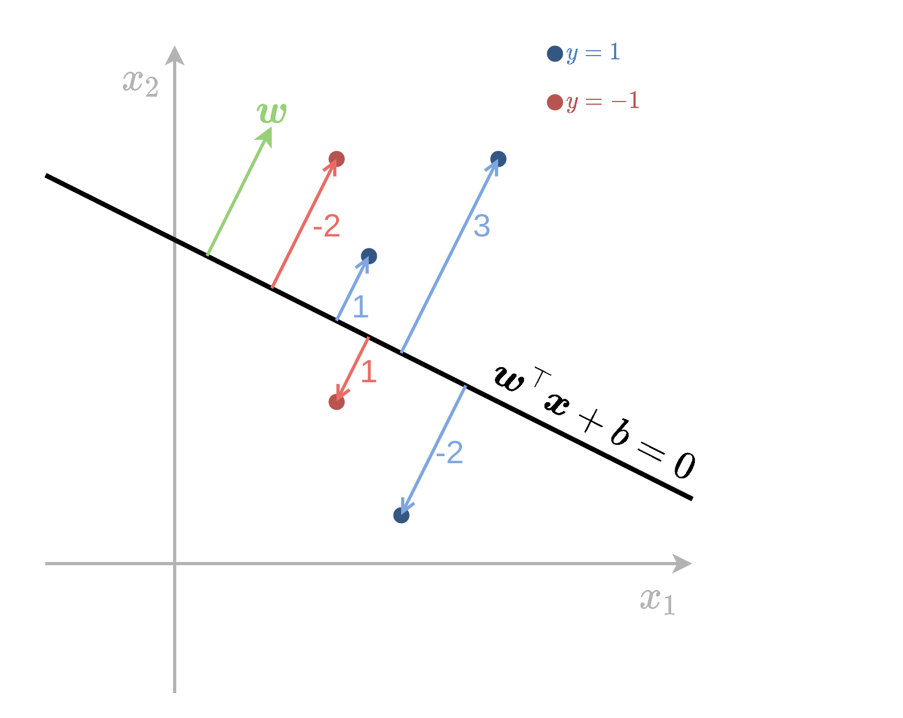
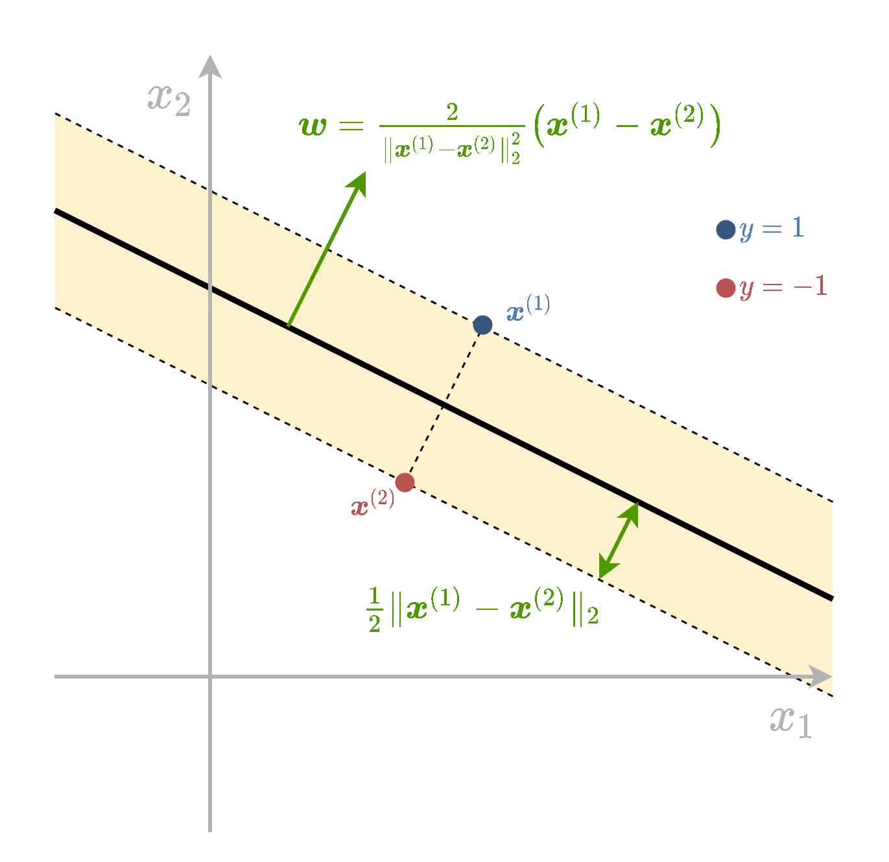
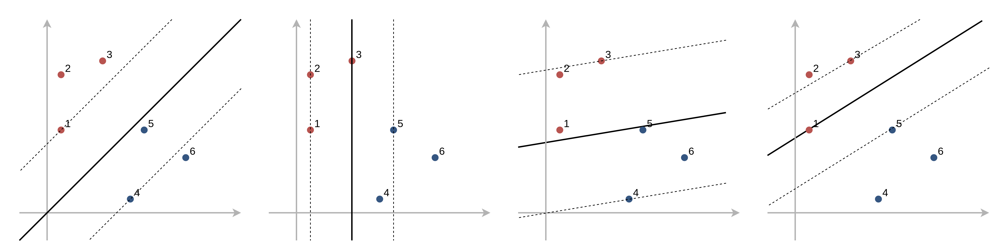
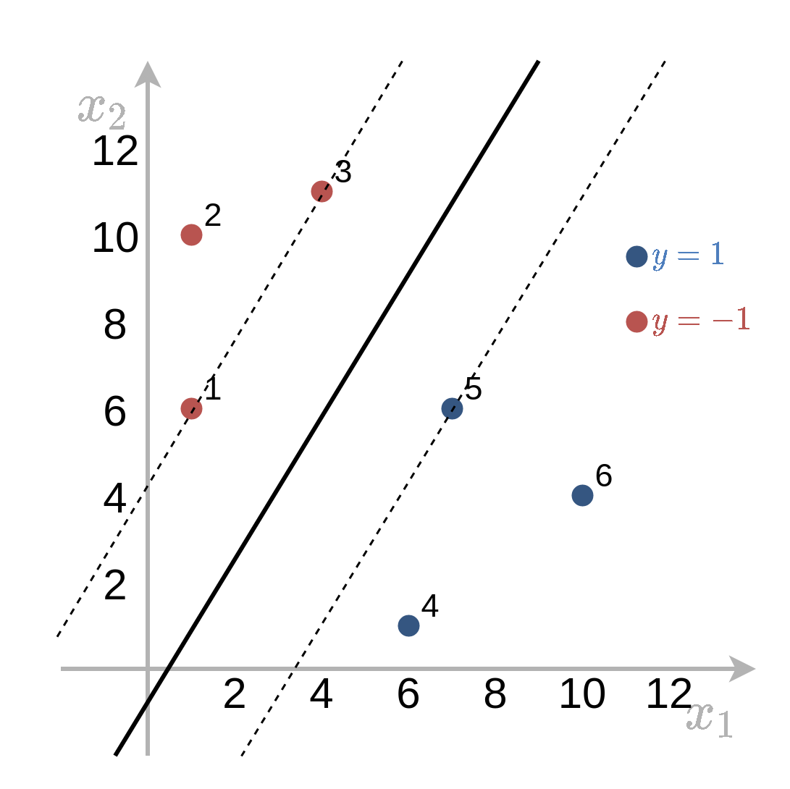

<div dir="rtl" class="site-style">

# תרגול 11 - SVM ופונקציות גרעין (Kernels)

<div dir="ltr">
<!-- <a href="./slides/" class="link-button" target="_blank">Slides</a> -->
<a href="/assets/tutorial11.pdf" class="link-button" target="_blank">PDF</a>
<!-- <a href="./code/" class="link-button" target="_blank">Code</a> -->
</div>

## תקציר התיאוריה

**הערה**: בפרק זה נעסוק בסיווג בינארי ונסמן את התוויות של שתי המחלקות ב $1$ ו $-1$.

### תזכורת - גאומטריה של המישור

<div class="imgbox" style="max-width:700px">


</div>

דרך נוחה לתאר מישור במרחב (ממימד כלשהו) היא על ידי משוואה מהצורה $\boldsymbol{w}^{\top}\boldsymbol{x}+b=0$. מישור שכזה מחלק את המרחב לשנים ומגדיר צד חיובי ושלילי של המרחב. נתאר מספר תכונות של הצגה זו:

- $\boldsymbol{w}$ הוא הנורמל למישור אשר מגדיר את את האוריינטציה שלו וגם את הצד החיובי.
- המרחק של המישור מהראשית הינו $\frac{b}{\lVert\boldsymbol{w}\rVert}$. הסימן של גודל זה מציין איזה צד של המישור נמצאת הראשית.
- המרחק של נקודה כל שהיא $\boldsymbol{x}_0$ מהמישור הינה $\frac{1}{\lVert\boldsymbol{w}\rVert}(\boldsymbol{w}^{\top}\boldsymbol{x}_0+b)$. הסימן של גודל זה מציין את הצד של המישור בו נמצאת הנקודה.
- בעבור מישור נתון כל שהוא $\boldsymbol{w}$ ו $b$ מוגדרים עד כדי קבוע. זאת אומרת שהמישור אינווריאנטי (לא משתנה) תחת שינוי של פרמטרים מהצורה של: $\boldsymbol{w}\rightarrow \alpha\boldsymbol{w},b\rightarrow \alpha b$.

### מסווג לינארי

מסווג לינארי הוא מסווג מהצורה של

$$
h(\boldsymbol{x})=
\text{sign}(\boldsymbol{w}^{\top}\boldsymbol{x}+b)
=\begin{cases}
1 & \boldsymbol{w}^{\top}\boldsymbol{x}+b>0\\
-1 & \text{else}
\end{cases}
$$

עם $\boldsymbol{w}$ ן $b$ כל שהם.

זאת אומרת שמסווג מחלק את המרחב לשני צידיו של המישור $\boldsymbol{w}^{\top}\boldsymbol{x}+b=0$ המכונה מישור ההפרדה.

### Signed distance (מרחק מסומן)

נסתכל על בעיית סיווג בינארית עם תוויות $\text{y}=\pm1$. בעבור משטח הפרדה כל שהוא נגדיר את ה signed distance של דגימה כל שהיא ממשטח ההפרדה באופן הבא:

$$
d=\frac{1}{\lVert\boldsymbol{w}\rVert}(\boldsymbol{w}^{\top}\boldsymbol{x}+b)y
$$

זהו המרחק של נקודה ממהמישור כאשר המרחק של נקודות עם תווית $y=1$ הם חיוביות כאשר הם בצד החיובי של המיושר ושליליות אחרת והפוך לגבי נקודות עם תווית $y=-1$. 

<div class="imgbox" style="max-width:500px">



</div>

### פרידות לינארית (linear separability)

בבעיות של סיווג בינארי, אנו נאמר על המדגם שהוא פריד לינארית אם קיים מסווג לינארי אשר מסווג את המדגם בצורה מושלמת (בלי טעויות סיווג).

כאשר המדגם פריד לינארית יהיו יותר ממסווג לינארי אחד אשר יכול לסווג בצורה מושלמת את המדגם.

<div class="imgbox" style="max-width:700px">


</div>

### Support Vector Machine (SVM)

SVM הוא אלגוריתם דיסקרימינטיבי לסיווג בינארי אשר מחפש מסווג לינארי אשר יסווג בצורה טובה את המדגם.

#### Hard SVM

Hard SVM מתייחס למקרה שבו המדגם הוא פריד לינארית. באלגוריתם זה נחפש את המסווג הלינארי אשר בעבורו ה signed distance המינימאלי על ה train set הוא המקסימאלי:

$$
\boldsymbol{w}^*,b^*=\underset{\boldsymbol{w},b}{\arg\max}\quad \underset{i}{\min}\left\{\frac{1}{\lVert\boldsymbol{w}\rVert}(\boldsymbol{w}^{\top}\boldsymbol{x}^{(i)}+b)y^{(i)}\right\}
$$

ניתן להראות כי במקרה שבו המדגם פריד לינארי, בעיה זו שקולה לבעיית האופטימיזציה הבאה:

$$
\begin{aligned}
\boldsymbol{w}^*,b^*=
\underset{\boldsymbol{w},b}{\arg\min}\quad&\frac{1}{2}\left\lVert\boldsymbol{w}\right\rVert^2 \\
\text{s.t.}\quad&y^{(i)}\left(\boldsymbol{w}^{\top}\boldsymbol{x}^{(i)}+b\right)\geq1\quad\forall i
\end{aligned}
$$

בעיית אופטימיזציה זו מכונה הבעיה הפרימאלית.

##### Margin

בכדי להבין את המשמעות של בעיית האופטימיזציה שקיבלנו נגדיר את המושג השוליים (margin) של המסווג. האיזור של ה margin מוגדר כאיזור כאיזור סביב משטח ההפרדה אשר נמצא בתחום:

$$
1\geq\boldsymbol{w}^{\top}\boldsymbol{x}+b\geq-1
$$

<div class="imgbox" style="max-width:700px">


</div>

הרוחב של איזור זה נקבע על פי הגודל של הוקטור $\boldsymbol{w}$ ושווה ל $\frac{2}{\lVert\boldsymbol{w}\rVert}$.

האילוץ $y^{(i)}\left(\boldsymbol{w}^{\top}\boldsymbol{x}^{(i)}+b\right)\geq1$, אשר מופיע בבעיית האופטימיזציה הפרימאלית, דורש למעשה שכל הנקודות יסווגו נכונה ו**ימצאו מחוץ ל margin**. בעיית האופטימיזציה מחפשת את הפרמטרים של המישור בעל ה margin הגדול ביותר אשר מקיים תנאי זה.

##### Support Vectors

בעבור פתרון מסויים של בעיית האופטימיזציה, ה support vectors מוגדרים כנקודות אשר יושבות על השפה של ה margin, נקודות אלו מקיימות במדגם אשר מקיימים $y^{(i)}\left(\boldsymbol{w}^{\top}\boldsymbol{x}^{(i)}+b\right)=1$. אלו הנקודות אשר ישפיעו על הפתרון של בעיית האופטימיזציה, זאת אומרת שהסרה או הזזה קטנה של נקודות שאינם support vectors לא תשנה את הפתרון.

##### הבעיה הדואלית

דרך שקולה נוספת לרישום בעיית האופטימיזציה הינה על ידי הגדרת $N$ משתני עזר נוספים $\{\alpha_i\}_{i=1}^N$. בעזרת משתנים אלו ניתן לרשום את בעיית האופטימיזציה באופן הבא:

$$
\begin{aligned}
\left\lbrace\alpha_i\right\rbrace^*
=\underset{\left\lbrace\alpha_i\right\rbrace}{\arg\max}\quad&\sum_i\alpha_i-\frac{1}{2}\sum_{i,j}y^{(i)}y^{(j)}\alpha_i\alpha_j\boldsymbol{x}^{(i)\top}\boldsymbol{x}^{(j)} \\
\text{s.t.}\quad
    &\alpha_i\geq0\quad\forall i\\
    &\sum_i\alpha_iy^{(i)}=0
\end{aligned}
$$

מתוך המשתנים $\{\alpha_i\}_{i=1}^N$ ניתן לשחזר את $\boldsymbol{w}$ אופן הבא:

$$
\boldsymbol{w}=\sum_i\alpha_iy^{(i)}\boldsymbol{x}^{(i)}
$$

תכונות:

| .                                      | .                                                      | .               |
| -------------------------------------- | ------------------------------------------------------ | --------------- |
| נקודות רחוקות מה margin                   | $y^{(i)}\left(\boldsymbol{w}^{\top}x^{(i)}+b\right)>1$ | $\alpha_i=0$    |
| נקודות על ה margin (שהם support vectors) | $y^{(i)}\left(\boldsymbol{w}^{\top}x^{(i)}+b\right)=1$ | $\alpha_i\geq0$ |

- אם $\alpha_i>0$ אז $y^{(i)}\left(\boldsymbol{w}^{\top}x^{(i)}+b\right)=1$ (אבל לא להיפך)
- אם $y^{(i)}\left(\boldsymbol{w}^{\top}x^{(i)}+b\right)>1$ אז $\alpha_i=0$ (אבל לא להיפך)

את $b$ ניתן לחשב על ידי בחירת support vעל ידי בחירת support vector אחד ולחלץ את $b$ מתוך $y^{(i)}\left(\boldsymbol{w}^{\top}x^{(i)}+b\right)=1$.

### Soft SVM

Soft SVM מתייחס למקרה שבו המדגם אינו פריד לינארית. במקרה זה עדיין מגדירים את ה margin בצורה דומה אך מאפשרים למשתנים להיכנס לתוך ה margin ואף לחצות אותה לצד הלא נכון של מישור ההפרדה. על כל חריגה כזו משלמים קנס ב objective שאותו מנסים למזער. את החריגה של הדגימה ה $i$ נסמן ב $\frac{1}{\lVert\boldsymbol{w}\rVert}\xi_i$. לנקודות שהם בצד הנכון של המישור ומחוץ ל margin $xi_i$ יהיה 0.

<div class="imgbox" style="max-width:500px">


</div>

המשתנים $\xi_i$ נקראים **slack variables** ובעיית האופטימיזציה הפרימאלית תהיה:

$$
\begin{aligned}
\boldsymbol{w}^*,b^*,\{\xi_i\}^*=
\underset{\boldsymbol{w},b,\{\xi_i\}}{\arg\min}\quad&\frac{1}{2}\left\lVert\boldsymbol{w}\right\rVert^2+C\sum_{i=1}^N\xi_i \\
\text{s.t.}\quad
    &y^{(i)}\left(\boldsymbol{w}^{\top}\boldsymbol{x}^{(i)}+b\right)\geq1-\xi_i\quad\forall i\\
    &\xi_i\geq0\quad\forall i
\end{aligned}
$$

כאשר $C$ הוא hyper-parameter אשר קובע את גודל הקנס שאותו ה objective נותן על כל חריגה.

הבעיה הדואלית הינה:

$$
\begin{aligned}
\left\lbrace\alpha_i\right\rbrace^*
=\underset{\left\lbrace\alpha_i\right\rbrace}{\arg\max}\quad&\sum_i\alpha_i-\frac{1}{2}\sum_{i,j}y^{(i)}y^{(j)}\alpha_i\alpha_j\boldsymbol{x}^{(i)\top}\boldsymbol{x}^{(j)} \\
\text{s.t.}\quad
    &0\leq\alpha_i\leq C\quad\forall i\\
    &\sum_i\alpha_iy^{(i)}=0
\end{aligned}
$$

ה support vectors מוגדרות להיות הנקודות שמקיימות $y^{(i)}\left(\boldsymbol{w}^{\top}\boldsymbol{x}^{(i)}+b\right)=1-\xi_i$

תכונות:

| .                                         | .                                                            | .                     |
| ----------------------------------------- | ------------------------------------------------------------ | --------------------- |
| נקודות שמסווגות נכון ורחוקות מה margin            | $y^{(i)}\left(\boldsymbol{w}^{\top}x^{(i)}+b\right)>1$       | $\alpha_i=0$          |
| נקודות על ה margin (שהם support vectors)    | $y^{(i)}\left(\boldsymbol{w}^{\top}x^{(i)}+b\right)=1$       | $0\leq\alpha_i\leq C$ |
| נקודות שחורגות מה margin (גם support vectors) | $y^{(i)}\left(\boldsymbol{w}^{\top}x^{(i)}+b\right)=1-\xi_i$ | $\alpha_i=C$          |

## פונקציות גרעין

### מאפיינים: תזכורת

נוכל תמיד לחליף את וקטור המשתנים $\boldsymbol{x}$ שעליו פועל האלגוריתם בוקטור חדש $\boldsymbol{x}_{\text{new}}=\Phi(\boldsymbol{x})$, כאשר $\Phi$ היא פונקציה אשר נבחרה מראש ונקראת פונקציית המאפיינים שכן היא מחלצת מאפיינים רלוונטים מתוך $\boldsymbol{x}$ שבהם נשתמש.

### פונקציות גרעין

במקרים רבים החישוב של $\Phi(\boldsymbol{x})$ יכול להיות מסובך אך קיימת דרך לחשב בצורה יעילה את הפונקציה $K(\boldsymbol{x}_1,\boldsymbol{x}_2)=\Phi(\boldsymbol{x}_1)^{\top}\Phi(\boldsymbol{x}_2)$ אשר נקראת פונקציית גרעין. ישנם מקרים שבהם הוקטור המאפיינים יהיו אין סופיים.

ישנם קריטריונים תחתם פונקציה מסויימת $K(\boldsymbol{x}_1,\boldsymbol{x}_2)$ היא פונקציית גרעין בעבור וקטור מאפיינים מסויים. בקורס זה לא נכנס לתאים אלו. נציג שתי פונקציות גרעין נפוצות:

- גרעין גאוסי: $K(\boldsymbol{x}_1,\boldsymbol{x}_2)=\exp\left(-\frac{\lVert\boldsymbol{x}_1-\boldsymbol{x}_2\rVert_2^2}{2\sigma^2}\right)$ כאשר $\sigma$ פרמטר שיש לקבוע.
- גרעין פולינומיאלי: $K(\boldsymbol{x}_1,\boldsymbol{x}_2)=(1+\boldsymbol{x}_1^{\top}\boldsymbol{x}_2)^p$ כאשר $p\geq1$ פרמטר שיש לקבוע.

פונקציית המאפיינים שמתאימות לגרעינים אלו הם מסורבלות לכתיבה ולא נציג אותם כאן.

### Kernel Trick in SVM

הרעיון ב kernel trick הינו להשתמש ב SVM עם מאפיינים מבלי להחשב את $\Phi$ באופן ישיר על ידי שימוש בפונקציית גרעין. בעבור פונקציית מאפיינים $\Phi$ עם פונקציית גרעין $K$ הבעיה הדואלית של SVM הינה:

$$
\begin{aligned}
\left\lbrace\alpha_i\right\rbrace^*
=\underset{\left\lbrace\alpha_i\right\rbrace}{\arg\max}\quad&\sum_i\alpha_i-\frac{1}{2}\sum_{i,j}y^{(i)}y^{(j)}\alpha_i\alpha_jK(\boldsymbol{x}^{(i)},\boldsymbol{x}^{(j)}) \\
\text{s.t.}\quad
    &\alpha_i\geq0\quad\forall i\\
    &\sum_i\alpha_iy^{(i)}=0
\end{aligned}
$$

בעיית אופטימיזציה זו מגדירה את המשתנים $\{\alpha_i\}$ בלי צורך לחשב את $\Phi$ באופן מפורש בשום שלב.

הפרמטר $\boldsymbol{w}$ נתון על ידי:

$$
\boldsymbol{w}=\sum_i\alpha_iy^{(i)}\Phi(\boldsymbol{x}^{(i)})
$$

בכדי לחשב את $\boldsymbol{w}$ באופן מפורש יש לחשב את $\Phi$ אך ניתן להמנע מכך עם מציבים את הנוסחא ל $\boldsymbol{w}$ ישירות לתוך המסווג:
בכדי להמנע מהחישוב של $\Phi$ גם במסווג נשתמש בעובדה ש:

$$
\begin{aligned}
h(\boldsymbol{x})
&=\text{sign}(\boldsymbol{w}^{\top}\Phi(\boldsymbol{x})+b)\\
&=\text{sign}(\sum_i\alpha_iy^{(i)}\Phi(\boldsymbol{x}^{(i)})^{\top}\Phi(\boldsymbol{x})+b)\\
&=\text{sign}(\sum_i\alpha_iy^{(i)}K(\boldsymbol{x}^{(i)},\boldsymbol{x})+b)\\
\end{aligned}
$$

כך שגם בשלב החיזוי ניתן להשתמש בפונקציית הגרעין בלי לחשב את $\Phi$ באופן מפורש.

## תרגיל 11.1 - 2 Support Vectors

בשאלה זו נראה שבעבור מדגם המכיל 2 נקודת, אחת מכל מחלקה, הפתרון של בעיית hard SVM מישור ההפרדה יעבור בדיוק במרכז בין 2 הנקודות, יהיה ניצב לוקטור המחבר את שתי הנקודות והשוליים של ה margin.

בפועל נראה ש:

$$
\boldsymbol{w}=\frac{2}{\lVert\boldsymbol{x}^{(1)}-\boldsymbol{x}^{(2)}\rVert_2^2}\left(\boldsymbol{x}^{(1)}-\boldsymbol{x}^{(2)}\right)
$$

ו

$$
b=-\frac{1}{2}\left(\boldsymbol{x}^{(1)}+\boldsymbol{x}^{(2)}\right)^{\top}\boldsymbol{w}
$$

<div class="imgbox" style="max-width:600px">



</div>

**1)** הראו זאת על ידי פתרון הבעיה הדואלית.

**2)** הראו זאת על ידי פתרון הבעיה הפרימאלית.

### פתרון 11.1

#### 1)

הבעיה הדואלית הינה:

$$
\begin{aligned}
\left\lbrace\alpha_i\right\rbrace^*
=\underset{\left\lbrace\alpha_i\right\rbrace}{\arg\max}\quad&\sum_i\alpha_i-\frac{1}{2}\sum_{i,j}y^{(i)}y^{(j)}\alpha_i\alpha_j\boldsymbol{x}^{(i)\top}\boldsymbol{x}^{(j)} \\
\text{s.t.}\quad
    &\alpha_i\geq0\quad\forall i\\
    &\sum_i\alpha_iy^{(i)}=0
\end{aligned}
$$

נניח בלי הגבלת הכלליות ש $y^{(1)}=1$ ו $y^{(2)}=-1$.

נסתכל על האילוץ בשורה האחרונה:

$$
\begin{aligned}
\sum_{i=1}^2\alpha_i y^{(i)}=0\\
\Leftrightarrow\alpha_1-\alpha_2=0\\
\Leftrightarrow\alpha_1=\alpha_2=\alpha
\end{aligned}
$$

מכאן שהמשתנה היחד בביעה הינו $\alpha$. בעיית האופטימיזציה (ללא האילוצים) תהיה:

$$
\begin{aligned}
\alpha
=\underset{\alpha}{\arg\max}\quad&2\alpha-\frac{\alpha^2}{2}\sum_{i,j}y^{(i)}y^{(j)}\boldsymbol{x}^{(i)\top}\boldsymbol{x}^{(j)} \\
\text{s.t.}\quad &\alpha\geq0\\
=\underset{\alpha}{\arg\max}\quad&2\alpha-\frac{\alpha^2}{2}\left(
  \lVert\boldsymbol{x}^{(1)}\rVert_2^2
  -\boldsymbol{x}^{(1)\top}\boldsymbol{x}^{(2)}
  -\boldsymbol{x}^{(2)\top}\boldsymbol{x}^{(1)}
  +\lVert\boldsymbol{x}^{(2)}\rVert_2^2
  \right)\\
\text{s.t.}\quad &\alpha\geq0\\
=\underset{\alpha}{\arg\max}\quad&2\alpha-\frac{\alpha^2}{2}\lVert\boldsymbol{x}^{(1)}-\boldsymbol{x}^{(2)}\rVert_2^2\\
\text{s.t.}\quad &\alpha\geq0\\
\end{aligned}
$$

ניתן לפתור את הבעיה על ידי גזירה והשוואה ל0:

$$
\begin{aligned}
&\frac{d}{d\alpha}2\alpha-\frac{\alpha^2}{2}\lVert\boldsymbol{x}^{(1)}-\boldsymbol{x}^{(2)}\rVert_2^2=0\\
\Leftrightarrow&2=\alpha\lVert\boldsymbol{x}^{(1)}-\boldsymbol{x}^{(2)}\rVert_2^2\\
\Leftrightarrow&\alpha=\frac{2}{\lVert\boldsymbol{x}^{(1)}-\boldsymbol{x}^{(2)}\rVert_2^2}\\
\end{aligned}
$$

את $\boldsymbol{w}$ נמצא על ידי:

$$
\boldsymbol{w}
=\sum_i\alpha_iy^{(i)}\boldsymbol{x}^{(i)}
=\alpha(\boldsymbol{x}^{(1)}-\boldsymbol{x}^{(2)})
=\frac{2}{\lVert\boldsymbol{x}^{(1)}-\boldsymbol{x}^{(2)}\rVert_2^2}\left(\boldsymbol{x}^{(1)}-\boldsymbol{x}^{(2)}\right)
$$

את $b$ מוצאים על ידי בחירת support vector אחד מתוך המשוואה $y^{(i)}\left(\boldsymbol{w}^{\top}\boldsymbol{x}^{(i)}+b\right)=1$. נסתכל על הנקודה הראשונה:

$$
\begin{aligned}
&y^{(1)}\left(\boldsymbol{w}^{\top}\boldsymbol{x}^{(1)}+b\right)=1\\
\Leftrightarrow&\boldsymbol{w}^{\top}\boldsymbol{x}^{(1)}+b=1\\
\Leftrightarrow&b=1-\boldsymbol{w}^{\top}\boldsymbol{x}^{(1)}
=\frac{\boldsymbol{w}^{\top}\boldsymbol{w}}{\lVert\boldsymbol{w}\rVert_2^2}-\boldsymbol{w}^{\top}\boldsymbol{x}^{(1)}
=\boldsymbol{w}^{\top}\left(\frac{\boldsymbol{w}}{\lVert\boldsymbol{w}\rVert_2^2}-\boldsymbol{x}^{(1)}\right)\\
\Leftrightarrow&b=\boldsymbol{w}^{\top}\left(\frac{1}{2}\left(\boldsymbol{x}^{(1)}-\boldsymbol{x}^{(2)}\right)-\boldsymbol{x}^{(1)}\right)\\
\Leftrightarrow&b=-\frac{1}{2}\left(\boldsymbol{x}^{(1)}+\boldsymbol{x}^{(2)}\right)^{\top}\boldsymbol{w}
\end{aligned}
$$

#### 2)

הבעיה הפרימלית הינה:

$$
\begin{aligned}
\boldsymbol{w}^*,b^*=
\underset{\boldsymbol{w},b}{\arg\min}\quad&\frac{1}{2}\left\lVert\boldsymbol{w}\right\rVert^2 \\
\text{s.t.}\quad&y^{(i)}\left(\boldsymbol{w}^{\top}\boldsymbol{x}^{(i)}+b\right)\geq1\quad\forall i
\end{aligned}
$$

במקרה שבו יש רק שתי נקודות אחת מכל מחלקה שניהם בהכרח יהיו support vectors ויקיימו $y^{(i)}\left(\boldsymbol{w}^{\top}\boldsymbol{x}^{(i)}+b\right)=1$. נניח בלי הגבלת הכלליות ש $y^{(1)}=1$ ו $y^{(2)}=2$, שני האילוצים שהנקודות אלו מגדירות הם:

$$
\begin{aligned}
&\begin{cases}
    y^{(1)}\left(\boldsymbol{w}^{\top}\boldsymbol{x}^{(1)}+b\right)=1\\
    y^{(2)}\left(\boldsymbol{w}^{\top}\boldsymbol{x}^{(2)}+b\right)=1
\end{cases}\\
\Leftrightarrow&\begin{cases}
    \left(\boldsymbol{w}^{\top}\boldsymbol{x}^{(1)}+b\right)=1\\
    -\left(\boldsymbol{w}^{\top}\boldsymbol{x}^{(2)}+b\right)=1
\end{cases}\\
\Leftrightarrow&\begin{cases}
    \boldsymbol{w}^{\top}\boldsymbol{x}^{(1)}+b=1\\
    \boldsymbol{w}^{\top}\boldsymbol{x}^{(2)}+b=-1
\end{cases}\\
\Leftrightarrow&\begin{cases}
    b=-\frac{1}{2}\left(\boldsymbol{x}^{(1)}+\boldsymbol{x}^{(2)}\right)^{\top}\boldsymbol{w}\\
    \boldsymbol{w}^{\top}(\boldsymbol{x}^{(1)}-\boldsymbol{x}^{(2)})=2
\end{cases}\\
\end{aligned}
$$

נוכל להשתמש באילוץ השני ולכתוב בעזרתו את בעיית האופטימיזציה רק על $\boldsymbol{w}$:

$$
\begin{aligned}
\boldsymbol{w}^*=
\underset{\boldsymbol{w}}{\arg\min}\quad&\frac{1}{2}\left\lVert\boldsymbol{w}\right\rVert^2 \\
\text{s.t.}\quad&\boldsymbol{w}^{\top}(\boldsymbol{x}^{(1)}-\boldsymbol{x}^{(2)})=2
\end{aligned}
$$

בעיה זו מחפשת את ה $\boldsymbol{w}$ בעל האורך המינימאלי כך שהמכפלה הוקטורית שלו עם $(\boldsymbol{x}^{(1)}-\boldsymbol{x}^{(2)})$ היא 2. הוקטור הזה יהיה וקטור בכיוון של $(\boldsymbol{x}^{(1)}-\boldsymbol{x}^{(2)})$ ובאורך של $2/\lVert\boldsymbol{x}^{(1)}-\boldsymbol{x}^{(2)}\rVert_2$ ולכן $\boldsymbol{w}$ הינו:

$$
\boldsymbol{w}
=\frac{2}{\lVert\boldsymbol{x}^{(1)}-\boldsymbol{x}^{(2)}\rVert_2^2}\left(\boldsymbol{x}^{(1)}-\boldsymbol{x}^{(2)}\right)
$$

## תרגיל 11.2 - Hard SVM

נתון המדגם הבא:

<div dir="ltr">

| .            | 1  | 2  | 3  | 4  | 5  | 6  |
| ------------ | -- | -- | -- | -- | -- | -- |
| $\text{y}$   | -1 | -1 | -1 | 1  | 1  | 1  |
| $\text{x}_1$ | 1  | 1  | 4  | 6  | 7  | 10 |
| $\text{x}_2$ | 6  | 10 | 11 | 1  | 6  | 4  |

</div>

<div class="imgbox" style="max-width:500px">


</div>

**1)** מצא את מסווג ה soft SVM המתאים למדגם זה. מי הם וקטורי התמיכה?

**2)** מבלי לפתור את הבעיה הדואלית. אלו ערכים של $\{\alpha_i\}$ בהכרח יתאפסו?

**3)** מהו הרוחב של ה margin של הפתרון?

### פתרון 11.2

#### 1)

בעיית האופטימיזציה הפרימאלית אותה נרצה לפתור הינה:

$$
\begin{aligned}
\boldsymbol{w}^*,b^*=
\underset{\boldsymbol{w},b}{\arg\min}\quad&\frac{1}{2}\left\lVert\boldsymbol{w}\right\rVert^2 \\
\text{s.t.}\quad&y^{(i)}\left(\boldsymbol{w}^{\top}\boldsymbol{x}^{(i)}+b\right)\geq1\quad\forall i
\end{aligned}
$$

באופן כללי לפתור בעיות מסוג זה באופן ידני הוא קשה, אך בעבור מקרים פשוטים נוכל לפתור זאת תוך שימוש בעיקרון הבא:

*במידה ומצאנו את הפיתרון האופטימאלי על תת מדגם מתוך המדגם המלא, ומתקיים שבעבור הפתרון שמצאנו, הנקודות שאינם חלק מתת המדגם נמצאות מחוץ ל margin, אז הפתרון הוא בהכרח הפתרון האופטימאלי בעבור המדגם כולו.*

(עקרון זה נכון בגלל העבדה שהוספה של אילוצים לבעיית מינימיזציה יכולה רק להגדיל את ה objective המינימאלי).

המשמעות של עיקרון זה הינה שנוכל לנחש מי הם ה support vectors ולפתור את הבעיה רק בעבור נקודות אלו תוך התעלמות משאר הנקודות. לאחר שנפתור את הבעיה על הנקודות שניחשנו יהיה עלינו לבדוק אם שאר נקודות במדגם מחוץ ל margin. אם אכן שאר הנקודות מחוץ ל margin אז פתרנו את הבעיה ואם לאף אז עלינו לנחש נקודות אחרות. בעבור ה support vectors האילוצים של $y^{(i)}\left(\boldsymbol{w}^{\top}\boldsymbol{x}^{(i)}+b\right)\geq1$ הופכים להיות איצולי שיוון שאיתם הרבה יותר קל לעבוד.

ננסה לנחש מהם ה support verctors. נתחיל ב 0 ונגדיל בהדרגה את כמות ה support vectors.

##### <span dir="ltr">0 or 1 Support Vectors</span>

באופן כללי בעבור מדגם "נורמלי" אשר מכיל נקודות משני המחלקות שאותם יש לסווג, מקרים אלו לא יכול להתקיים.

(באופן תיאורטי במקרה המוונן שבו המדגם מכיל רק תוויות מסוג אחד אז ניתן להגדיר את בצורות שונות את כמות ה support vectors, אך מקרים אלו לא מאד רלוונטיים)

##### <span dir="ltr">2 Support Vectors</span>

על פי התוצאה של התרגיל הקודם אנו יודעים שבעבור שני support vectors שמישור ההפרדה יעבור בדיוק במרכז בין 2 הנקודות, יהיה ניצב לוקטור המחבר את שתי הנקודות והשוליים של ה margin יעברו דרך הנקודות. אם נסתכל על המדגם וננסה לחפש 2 נקודות שיכולות להיות support vectors נראה שכל בחירה של זוג נקודות יצור איזור של margin שמכיל נקודה אחרת ולכן לא מקיים את האילוצים. לכן הפתרון לא יכול להכיל רק שני support vectors.

<div class="imgbox" style="max-width:900px">



</div>

##### <span dir="ltr">3 Support Vectors</span>

ישנם שתי שלשות שיתכן שיהיו ה support vectors של הפתרון:

- $\{1,3,5\}$
- $\{3,4,5\}$

בעבור מדגם הכולל את $\{3,4,5\}$ ה support vectors יהיו הנקודות 3 ו 5 וכבר ראינו כי נקודות אלו יוצרות פתרון שלא מקיים את האילוצים. לעומת זאת השלשה של $\{1,3,5\}$ מגדירה איזור margin שאינו מכיל נקודות אחרות ולכן מקיים את האילוצים:

<div class="imgbox" style="max-width:500px">



</div>

לכן נקודות אלו יהיו שלושת ה support vectors שיגדיר את הפתרון לבעיה. נחשב את הפתרון המתקבל משלושת הנקודות האלה.

בעבור שלוש support vectors נקבל מתוך האילוצים 3 משוואות ב3 נעלמים. בעבור הנקודות $\{1,3,5\}$ משוואות אלו יהיו:

$$
\begin{aligned}
\begin{cases}
-\left((1,6)\boldsymbol{w}+b\right)=1\\
-\left((4,11)\boldsymbol{w}+b\right)=1\\
\left((7,6)\boldsymbol{w}+b\right)=1
\end{cases}\\
\Leftrightarrow\begin{cases}
w_1+6w_2+b=-1\\
4w_1+11w_2+b=-1\\
7w_1+6w_2+b=1
\end{cases}
\end{aligned}
$$

הפתרון של מערכת המשוואות הזו הינה $\boldsymbol{w}=\frac{1}{15}(5,-3)^{\top}$ ו $b=-\frac{2}{15}$

#### 2)

אנו יודעים כי בעבור נקודת שאינם support vectors $\alpha_i$ בהכרח יתאפס. בבעיה זו הנקודות שאינם support vectors הם $\{2,4,6\}$ ולכן $\alpha_2=\alpha_4=\alpha_6=6$.

#### 3)

ה margin תלוי בגודל של הוקטור $\boldsymbol{w}$ והוא שווה ל:

$$
\frac{2}{\lVert\boldsymbol{w}\rVert}=\frac{2\cdot15}{\sqrt{5^2+3^2}}=5.145
$$

## תרגיל 11.3 - גרעין גאוסי

נתון מדגם המכיל 2 נקודות אחת מכל מחלקה:

$$
\begin{aligned}
&x^{(1)}=(1,1)^{\top},\quad & y^{(1)}=+1 \\
&x^{(2)}=(-1,-1)^{\top},\quad &y^{(2)}=-1 \\
\end{aligned}
$$

חשבו את המסווג המתקבל מ soft SVM עם בגרעין גאוסי מהצורה $K(\boldsymbol{x}_1,\boldsymbol{x}_2)=\exp\left(-\lVert\boldsymbol{x}_1-\boldsymbol{x}_2\rVert^2\right)$.

### פתרון 11.3

הבעיה הדואלית עם הגרעין הגאוסי הינה:

$$
\begin{aligned}
\left\lbrace\alpha_i\right\rbrace^*
=\underset{\left\lbrace\alpha_i\right\rbrace}{\arg\max}\quad&\sum_i\alpha_i-\frac{1}{2}\sum_{i,j}y^{(i)}y^{(j)}\alpha_i\alpha_jK(\boldsymbol{x}^{(i)},\boldsymbol{x}^{(j)})\\
\text{s.t.}\quad
    &\alpha_i\geq0\quad\forall i\\
    &\sum_i\alpha_iy^{(i)}=0
\end{aligned}
$$

בדומה לתרגיל הראשון נקבל ש:

$$
\alpha_1=\alpha_2=\alpha
$$

נחשב את הערכים של $K(\boldsymbol{x}^{(i)},\boldsymbol{x}^{(j)})$:

$$
\begin{aligned}
K(\boldsymbol{x}^{(1)},\boldsymbol{x}^{(1)})=\exp(0)=1\\
K(\boldsymbol{x}^{(2)},\boldsymbol{x}^{(2)})=\exp(0)=1\\
K(\boldsymbol{x}^{(1)},\boldsymbol{x}^{(2)})=\exp(-(2^2+2^2))=e^{-4}
\end{aligned}
$$

בעיית האופטימיזציה הינה:

$$
\begin{aligned}
\alpha^*
=\underset{\alpha}{\arg\max}\quad&2\alpha-\frac{\alpha^2}{2}\left(
  K(\boldsymbol{x}^{(1)},\boldsymbol{x}^{(1)})
  -2K(\boldsymbol{x}^{(1)},\boldsymbol{x}^{(2)})
  +K(\boldsymbol{x}^{(2)},\boldsymbol{x}^{(2)})
\right)\\
\text{s.t.}\quad &\alpha_i\geq0\quad\forall i\\
=\underset{\alpha}{\arg\max}\quad&2\alpha-\alpha^2(1-e^{-4})\\
\text{s.t.}\quad &\alpha_i\geq0\quad\forall i\\
\end{aligned}
$$

נגזור ונשווה ל-0:

$$
\begin{aligned}
&\frac{d}{d\alpha}2\alpha-\alpha^2(1-e^{-4})=0\\
\Leftrightarrow&1=\alpha(1-e^{-4})\\
\Leftrightarrow&\alpha=\frac{2}{1-e^{-4}}
\end{aligned}
$$

הוקטור $\boldsymbol{w}$ נתון על ידי: $\boldsymbol{w}=\sum_i\alpha_iy^{(i)}\Phi(\boldsymbol{x}^{(i)})$. נכתוב את הביטוי $\boldsymbol{w}^{\top}\Phi(\boldsymbol{x})$ בעבור נקודה כל שהיא $\boldsymbol{x}$:

$$
\begin{aligned}
\boldsymbol{w}^{\top}\Phi(\boldsymbol{x})
&=\sum_i\alpha_iy^{(i)}\Phi(\boldsymbol{x}^{(i)})^{\top}\Phi(\boldsymbol{x})\\
&=\sum_i\alpha_iy^{(i)}K(\boldsymbol{x}^{(i)},\boldsymbol{x})\\
&=\frac{1}{1-e^{-4}}\left(K(\boldsymbol{x}^{(1)},\boldsymbol{x})-K(\boldsymbol{x}^{(2)},\boldsymbol{x})\right)
\end{aligned}
$$

נחשב את $b$ על ידי שימוש בנקודה הראשונה:

$$
\begin{aligned}
1&=y^{(1)}\left(\boldsymbol{w}^{\top}\Phi(\boldsymbol{x}^{(1)})+b\right)\\
\Leftrightarrow b&=1-\boldsymbol{w}^{\top}\Phi(\boldsymbol{x}^{(1)})\\
\Leftrightarrow b&=1-\frac{1}{1-e^{-4}}\left(K(\boldsymbol{x}^{(1)},\boldsymbol{x}^{(1)})-K(\boldsymbol{x}^{(2)},\boldsymbol{x}^{(1)})\right)\\
\Leftrightarrow b&=1-\frac{1}{1-e^{-4}}\left(1-e^{-4}\right)=0
\end{aligned}
$$

המסווג יהיה:

$$
\begin{aligned}
h(\boldsymbol{x})
&=\text{sign}(\boldsymbol{w}^{\top}\Phi(\boldsymbol{x})+b)\\
&=\text{sign}\left(\frac{1}{1-e^{-4}}\left(K(\boldsymbol{x}^{(1)},\boldsymbol{x})-K(\boldsymbol{x}^{(2)},\boldsymbol{x})\right)\right)\\
&=\text{sign}\left(K(\boldsymbol{x}^{(1)},\boldsymbol{x})-K(\boldsymbol{x}^{(2)},\boldsymbol{x})\right)\\
&=\text{sign}\left(
  \exp\left(-\lVert\boldsymbol{x}^{(1)}-\boldsymbol{x}\rVert^2\right)
  -\exp\left(-\lVert\boldsymbol{x}^{(2)}-\boldsymbol{x}\rVert^2\right)
\right)\\
&=\text{sign}\left(
  \lVert\boldsymbol{x}^{(2)}-\boldsymbol{x}\rVert^2
  -\lVert\boldsymbol{x}^{(1)}-\boldsymbol{x}\rVert^2
\right)\\
&=\text{sign}\left((x_1+1)^2+(x_2+1)^2-(x_1-1)^2-(x_2-1)^2\right)\\
&=\text{sign}\left(2x_1+2x_2\right)\\
&=\text{sign}\left(x_1+x_2\right)\\
\end{aligned}
$$

<!--
## חלק מעשי

<br>

## בעיה: זיהוי מין הדובר על סמך אות דיבור

<br>

בחלק זה, ננסה להשתמש ב- SVM כדי לזהות את מינו של הדובר באמצעות קולו. מוטיבציה למערכת כזאת יכולה להיות עוזר וירטואלי שרוצה לפנות לדובר לפי מינו. הרחבה לניסיון זה יכולה להיות זיהוי דובר על סמך קולו וכו'.

<br>

## Dataset Labeled Voices

<br>

הרעיון וה- DATA נלקחו מ- Dataset והערכת ביצועים של קורי בקר, אשר נמצאים [באתר הבא](http://www.primaryobjects.com/2016/06/22/identifying-the-gender-of-a-voice-using-machine-learning/).

<br>

בפרוייקט זה נאספו 3168 דגימות קול מתוייגות מהמקורות הבאים:

- [The Harvard-Haskins Database of Regularly-Timed Speech](http://www.nsi.edu/~ani/download.html)
- [Telecommunications & Signal Processing Laboratory (TSP) Speech Database at McGill University](http://www-mmsp.ece.mcgill.ca/Documents../Data/index.html)
- [VoxForge Speech Corpus](http://www.repository.voxforge1.org/downloads/SpeechCorpus/Trunk/Audio/Main/8kHz_16bit/)
- [Festvox CMU_ARCTIC Speech Database at Carnegie Mellon University](http://festvox.org/cmu_arctic/)

<br>

כל רצועת קול עברה עיבוד באמצעות כלי בשם[WarbleR](https://cran.r-project.org/web/packages/warbleR/warbleR.pdf) i כדי לייצר 20 Features לכל דגימה.

<br>

ה- Data עצמו נמצא [כאן](https://yairomer.github.io/ml_course/datasets/voice.csv).

<br>

## 🔃 תהליך העבודה

<br>

## 🕵️ בחינת ה - Data

נסתכל על העמודות הראשונות ב- Data


מספר הרשומות : $$N=3168$$

<br>

<table border="1" class="dataframe">
  <thead>
    <tr style="text-align: right;">
      <th></th>
      <th>meanfreq</th>
      <th>sd</th>
      <th>median</th>
      <th>Q25</th>
      <th>Q75</th>
      <th>IQR</th>
      <th>skew</th>
      <th>kurt</th>
      <th>sp.ent</th>
      <th>sfm</th>
    </tr>
  </thead>
  <tbody>
    <tr>
      <th>0</th>
      <td>0.059781</td>
      <td>0.064241</td>
      <td>0.032027</td>
      <td>0.015071</td>
      <td>0.090193</td>
      <td>0.075122</td>
      <td>12.863462</td>
      <td>274.402906</td>
      <td>0.893369</td>
      <td>0.491918</td>
      <td>male</td>
    </tr>
    <tr>
      <th>1</th>
      <td>0.066009</td>
      <td>0.067310</td>
      <td>0.040229</td>
      <td>0.019414</td>
      <td>0.092666</td>
      <td>0.073252</td>
      <td>22.423285</td>
      <td>634.613855</td>
      <td>0.892193</td>
      <td>0.513724</td>
      <td>male</td>
    </tr>
    <tr>
      <th>2</th>
      <td>0.077316</td>
      <td>0.083829</td>
      <td>0.036718</td>
      <td>0.008701</td>
      <td>0.131908</td>
      <td>0.123207</td>
      <td>30.757155</td>
      <td>1024.927705</td>
      <td>0.846389</td>
      <td>0.478905</td>
      <td>male</td>
    </tr>
    <tr>
      <th>3</th>
      <td>0.151228</td>
      <td>0.072111</td>
      <td>0.158011</td>
      <td>0.096582</td>
      <td>0.207955</td>
      <td>0.111374</td>
      <td>1.232831</td>
      <td>4.177296</td>
      <td>0.963322</td>
      <td>0.727232</td>
      <td>male</td>
    </tr>
    <tr>
      <th>4</th>
      <td>0.135120</td>
      <td>0.079146</td>
      <td>0.124656</td>
      <td>0.078720</td>
      <td>0.206045</td>
      <td>0.127325</td>
      <td>1.101174</td>
      <td>4.333713</td>
      <td>0.971955</td>
      <td>0.783568</td>
      <td>male</td>
    </tr>
    <tr>
      <th>5</th>
      <td>0.132786</td>
      <td>0.079557</td>
      <td>0.119090</td>
      <td>0.067958</td>
      <td>0.209592</td>
      <td>0.141634</td>
      <td>1.932562</td>
      <td>8.308895</td>
      <td>0.963181</td>
      <td>0.738307</td>
      <td>male</td>
    </tr>
    <tr>
      <th>6</th>
      <td>0.150762</td>
      <td>0.074463</td>
      <td>0.160106</td>
      <td>0.092899</td>
      <td>0.205718</td>
      <td>0.112819</td>
      <td>1.530643</td>
      <td>5.987498</td>
      <td>0.967573</td>
      <td>0.762638</td>
      <td>male</td>
    </tr>
    <tr>
      <th>7</th>
      <td>0.160514</td>
      <td>0.076767</td>
      <td>0.144337</td>
      <td>0.110532</td>
      <td>0.231962</td>
      <td>0.121430</td>
      <td>1.397156</td>
      <td>4.766611</td>
      <td>0.959255</td>
      <td>0.719858</td>
        <td>male</td>
	</tr>
	<tr>
  <th>8</th>
  <td>0.142239</td>
  <td>0.078018</td>
  <td>0.138587</td>
  <td>0.088206</td>
  <td>0.208587</td>
  <td>0.120381</td>
  <td>1.099746</td>
  <td>4.070284</td>
  <td>0.970723</td>
  <td>0.770992</td>
        <td>male</td>
</tr>
<tr>
  <th>9</th>
  <td>0.134329</td>
  <td>0.080350</td>
  <td>0.121451</td>
  <td>0.075580</td>
  <td>0.201957</td>
  <td>0.126377</td>
  <td>1.190368</td>
  <td>4.787310</td>
  <td>0.975246</td>
  <td>0.804505</td>
      <td>male</td>
</tr>
<tr>
  <th>9</th>
  <td>0.134329</td>
  <td>0.080350</td>
  <td>0.121451</td>
  <td>0.075580</td>
  <td>0.201957</td>
  <td>0.126377</td>
  <td>1.190368</td>
  <td>4.787310</td>
  <td>0.975246</td>
  <td>0.804505</td>
  <td>male</td>
  </tr>
  </tbody>
</table>


​    <br>

## The Data Fields and Types

<br>

להלן התאור של שדות ה- Data מאתר הפרוייקט:

- **meanfreq**: mean frequency (in kHz)

- **sd**: standard deviation of frequency

- **median**: median frequency (in kHz)

- **Q25**: first quantile (in kHz)

- **Q75**: third quantile (in kHz)

- **IQR**: interquantile range (in kHz)

- **skew**: skewness (see note in specprop description)

- **kurt**: kurtosis (see note in specprop description)

- **sp.ent**: spectral entropy

- **sfm**: spectral flatness

- **mode**: mode frequency

- **centroid**: frequency centroid (see specprop)

- **meanfun**: average of fundamental frequency measured across acoustic signal

- **minfun**: minimum fundamental frequency measured across acoustic signal

- **maxfun**: maximum fundamental frequency measured across acoustic signal

- **meandom**: average of dominant frequency measured across acoustic signal

- **mindom**: minimum of dominant frequency measured across acoustic signal

- **maxdom**: maximum of dominant frequency measured across acoustic signal

- **dfrange**: range of dominant frequency measured across acoustic signal

- **modindx**: modulation index. Calculated as the accumulated absolute difference between

- **label**: The label of each track: male/female

  <br>

###  📉 סטטיסטיקה של ה- Data

<br>

מספר הנשים והגברים ב- Data:

<br>


<br>

היסטוגרמה של כל דגימה כפונקציה של הערך הנמדד:


<br>

## 📜 הגדרת הבעיה

<br>

- דגימת קול אקראית - $$w$$
- משתנים אקראיים:
  - $$\boldsymbol{x}=X\left(\omega\right)$$: רשימה של $$20$$ ערכים שהוצאו עבור דגימת הקול.
  - $$y=Y\left(\omega\right)$$: מין הדובר: $$1$$ עבור נקבה, $$-1$$ עבור זכר

הריסק שלנו היינו - Misclassification


$$
h^*=\underset{h}{\arg\min}\ E\left[I\left\lbrace h\left(\boldsymbol{x}\right)\neq y\right\rbrace\right]
$$


<br>

## 💡 שיטת הלימוד: Soft-SVM

<br>

נשתמש בחבילת האופטימיזציה הקונבקסית [cvxpy](https://www.cvxpy.org/) על מנת לפתור את בעיית האופטימיזציה של SVM.

<br>

### פרמטרים:

הפרמטרים הנלמדים המודל הינם $$w$$ ו- $$b$$ או $$\alpha$$ במקרה שנפתור את הבעיה הדואלית.

<br>


### היפר-פרמטרים:

ההיפר-פרמטר היחיד בבעיית ה- Soft-SVM הינו פרמטר העונש $$C$$, שמגדיר מה העונש על הפרת האילוצים.


<br>

##  עיבוד מקדים

<br>

### 📚 פיצול ה- Data

<br>

* סט אימון - 60%
* סט וולידציה - 20%
* סט בוחן - 20%

<br>

### נרמול ה- Data

<br>

חשוב לנרמל את ה- Data לפני הרצת האלגוריתם, משתי סיבות עיקריות:

1. ה- Data מתאר מאפיינים ביחידות וסקלות שונות.
2. האלגוריתם מנסה למזער את Objective אשר מבוסס מרחק, מה שהופך אותו לרגיש ביחס למרחק לכל כיוון. לדוגמא, אם נכפיל מאפיין מסוייף בערך קבוע גדול מ-1, למעשה ניתן לו חשיבות יתרה ב- Objective

<br>

## ⚙️ שלב הלמידה - הבעייה הדואלית

<br>

ראשית, נפתור את הבעיה הדואלית:


$$
\left\lbrace\alpha_i\right\rbrace^*=\underset{\left\lbrace\alpha_i\right\rbrace}{\arg\max} \sum_i\alpha_i-\frac{1}{2}\sum_{i,j}y_iy_j\alpha_i\alpha_j\left<\boldsymbol{x}_i,\boldsymbol{x}_j\right> \\
\begin{align*}
\text{s.t.}\quad&0\leq\alpha_i\leq C\quad&\forall i\\
&\sum_i\alpha_iy_i=0
\end{align*}
$$

<br>

נתחיל עם $$C=1$$ ולאחר מכן ננסה לכוונן היפר-פרמטר זה.

<br>

כעת, נבחנה את התוצאה שהתקבלה. נצייר את ערך $$\alpha_i$$ לכל אחת מהדוגמאות:


<br>

כצפוי, קיבלנו 3 סוגי ערכים: $$\alpha_i=0$$, $$0<\alpha_i<C$$ ו- $$\alpha_i=C$$. ערכים אלה מתאימים למצבים הבאים

- $$\alpha_i=0$$: דוגמאות שסווגו נכונה ורחוקות מה- Margin: $$y_i\left(\boldsymbol{w}^T\boldsymbol{x}_i+b\right) > 1$$
- $$0<\alpha_i<C$$: דוגמאות שיושבות בדיוק על ה- Margin: $$y_i\left(\boldsymbol{w}^T\boldsymbol{x}_i+b\right) = 1$$
- $$\alpha_i=C$$: נקודות שסווגו באופן לא נכון (בצד הלא נכון של מישורה הפרדה) או סווגו בצורה נכונה אבל יושבות בתוך ה- Margin: $$y_i\left(\boldsymbol{w}^T\boldsymbol{x}_i+b\right) < 1$$

<br>

כעת, ניתן להשתמש בנוסחא שנלמדה על מנת לחשב את $$w$$ ו- $$b$$


$$
\boldsymbol{w}=\sum_i\alpha_iy_i\boldsymbol{x}_i
$$


את $$b$$ ניתן לחשב על ידי לבחור נקודה שעבורה $$0<\alpha_i<C$$ ולהשתמש במשוואה: $$y_i\left(\boldsymbol{w}^T\boldsymbol{x}_i+b\right) = 1$$.

<br>

נצייר את ההיסטוגרמה של התיוגים של כל הנקודות, ונצבע את 3 המקרים שתיארנו לעיל:


הסיכון שהתקבל על סט הבוחן הינו: $$0.0205$$

<br>

## ⚙️ שלב הלמידה - הבעייה הפרימאלית

<br>

כתרגיל, ננסה גם לפתור את הבעיה הפרימאלית ישירות ונשווה בין הפתרונות:


$$
\boldsymbol{w}^*,b^*=\underset{\boldsymbol{w},b}{\arg\min} \frac{1}{2}\left\lVert\boldsymbol{w}\right\rVert^2+C\sum_i\xi_i \\
\begin{align*}
\text{s.t.}\quad &y_i\left(\boldsymbol{w}^T\boldsymbol{x}_i+b\right)\geq1-\xi_i\quad&\forall i\\
&\xi_i\geq0\quad&\forall i
\end{align*}
$$


<br>

```tex
The first 10 values if w in the primal problem are:
[ 0.32403667 -0.13227075 -0.06096529  0.41782102 -0.48840472]
The first 10 values if w in the dual problem are:
[ 0.32138073 -0.13206916 -0.05900207  0.4178552  -0.48799808]

The b value of the primal problem is: 0.6602256435596877
The b value of the dual problem is: 0.658170109096357
```

<br>


## בחירת מודל - כיוונון היפר פרמטרים

<br>

כעת, ננסה לבחור את ההיפר-פרמטר $$C$$. 

נסתכל על ערכים בטווח $$10^{-3}$$ - $$10^3$$ ונשווה את התוצאות על סט האימות

<br>


ה- $$C$$ האופטימלי הינו $$0.03162277660168379$$

<br>

הסיכון שהתקבל על סט הבוחן הינו: $$0.017$$


<br>

## שימוש בפונקציית גרעין:

<br>

כפי שלמדנו, אם נשתמש בפורמולצייה של הבעייה הדואלית, ניתן להחליף את המכפלה הפנימית  $$\left<\boldsymbol{x}_i,\boldsymbol{x}_j\right>$$ בפונקציית גרעין.

<br>

בגרף זה, החלפנו את פונקציית הגרעין ב- Kernel פופולרי המכונה Radial Basis Function או RBF בקיצור.

ה- $$C$$ האופטימלי שהתקבל הינו $$1.0$$.

<br>

הסיכון על סט הבוחן הינו: $$0.016$$


-->

</div>
