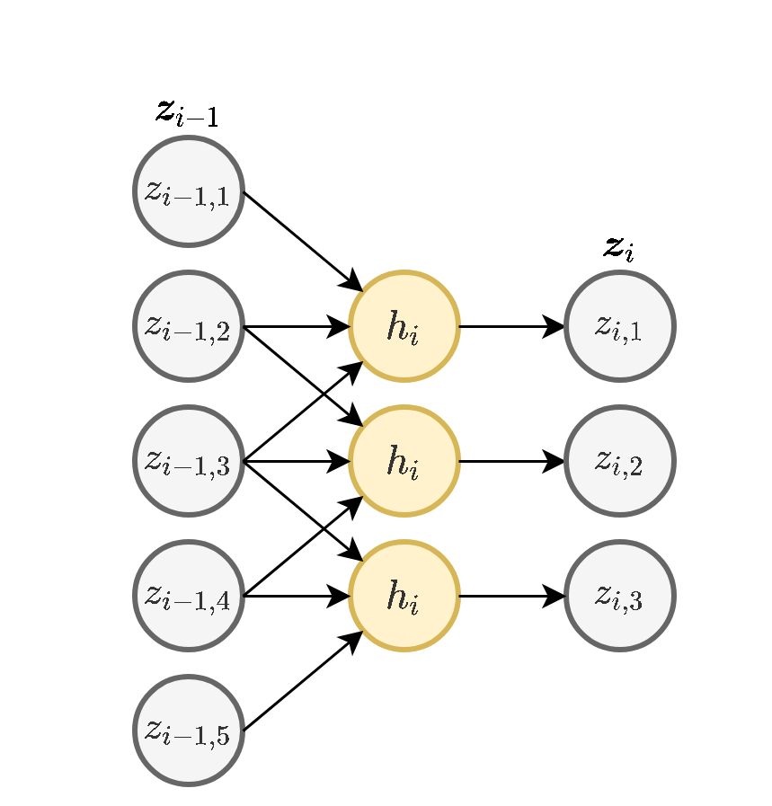
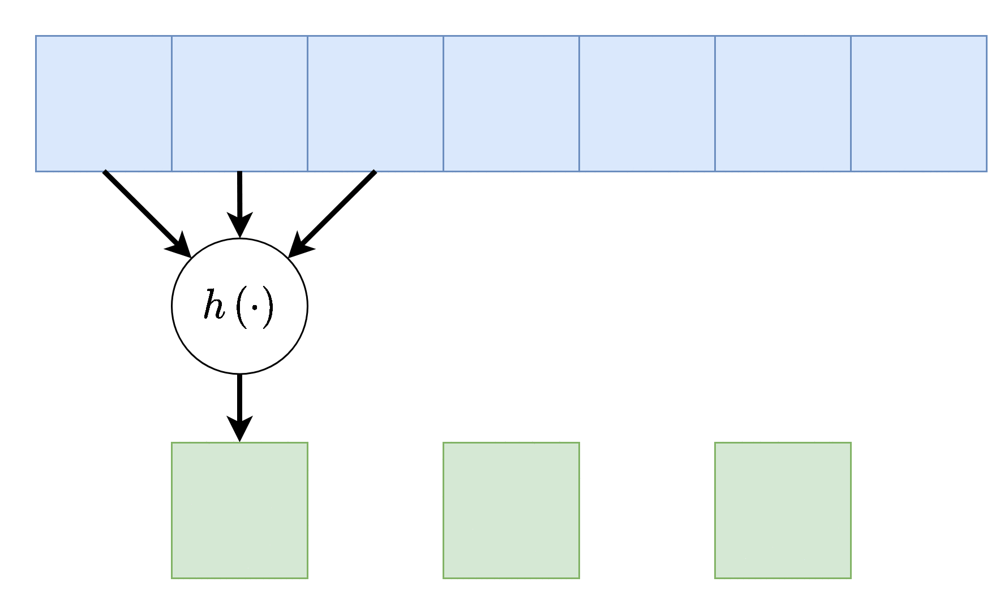
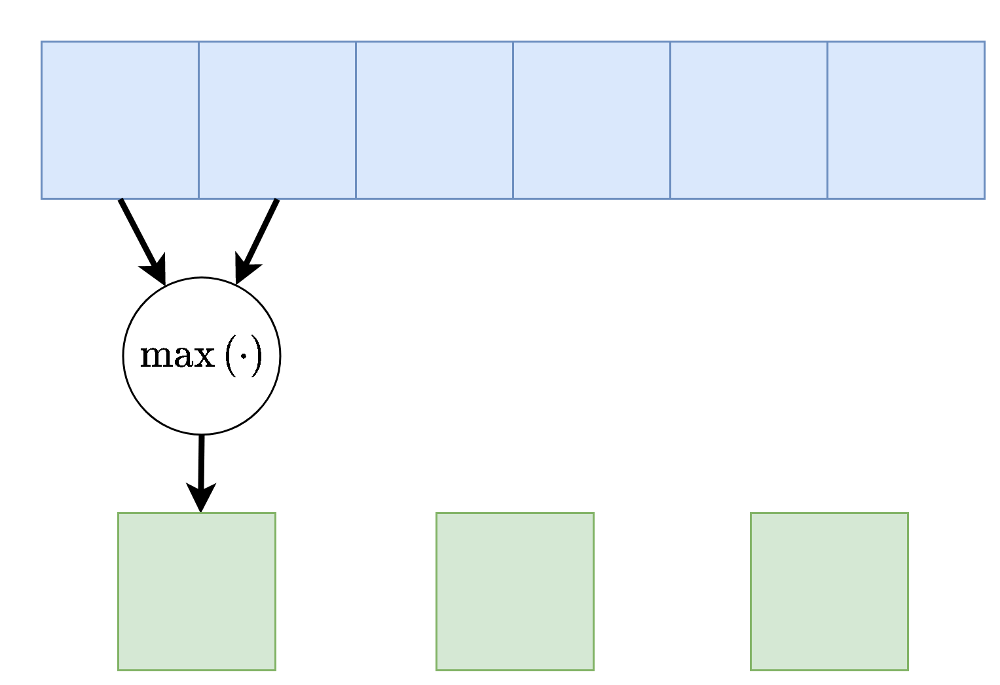
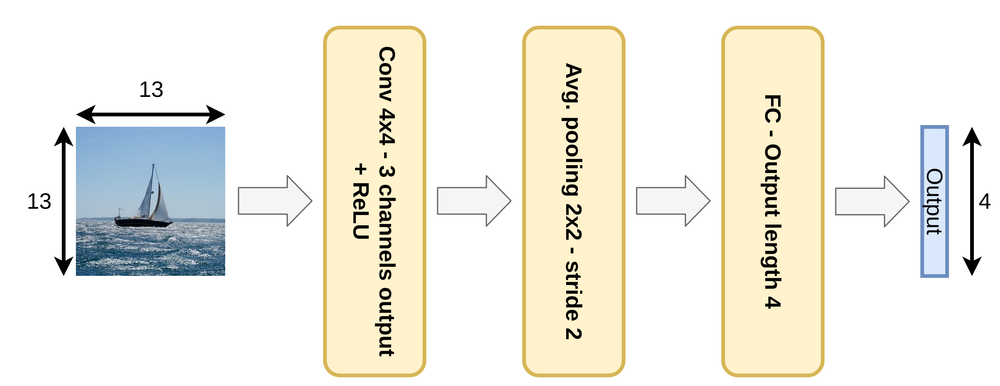
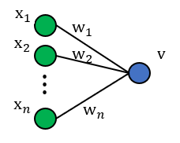
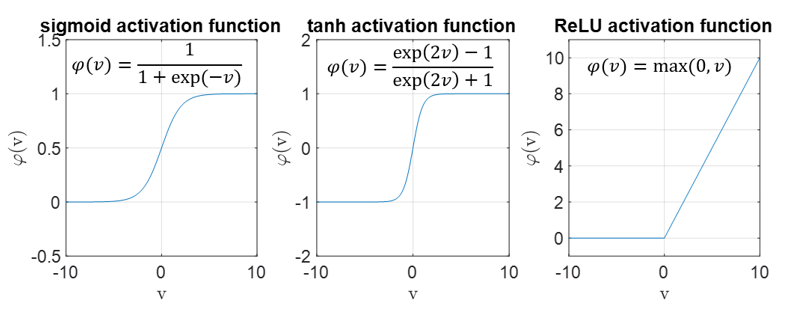
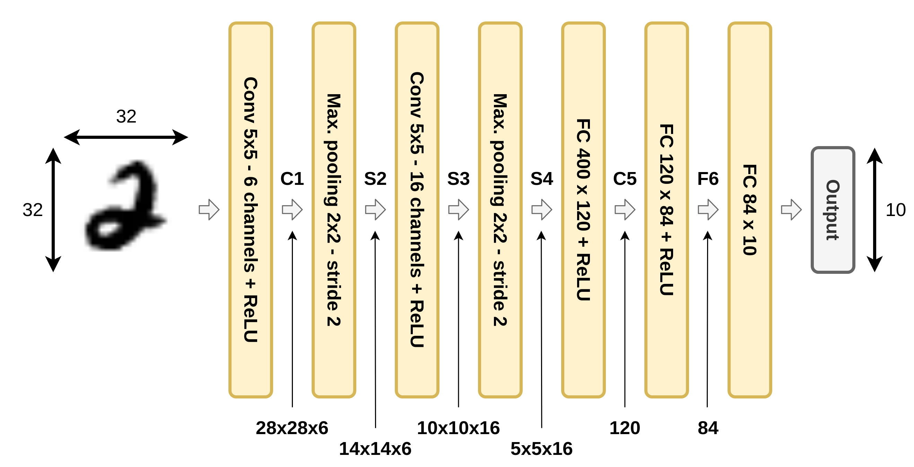
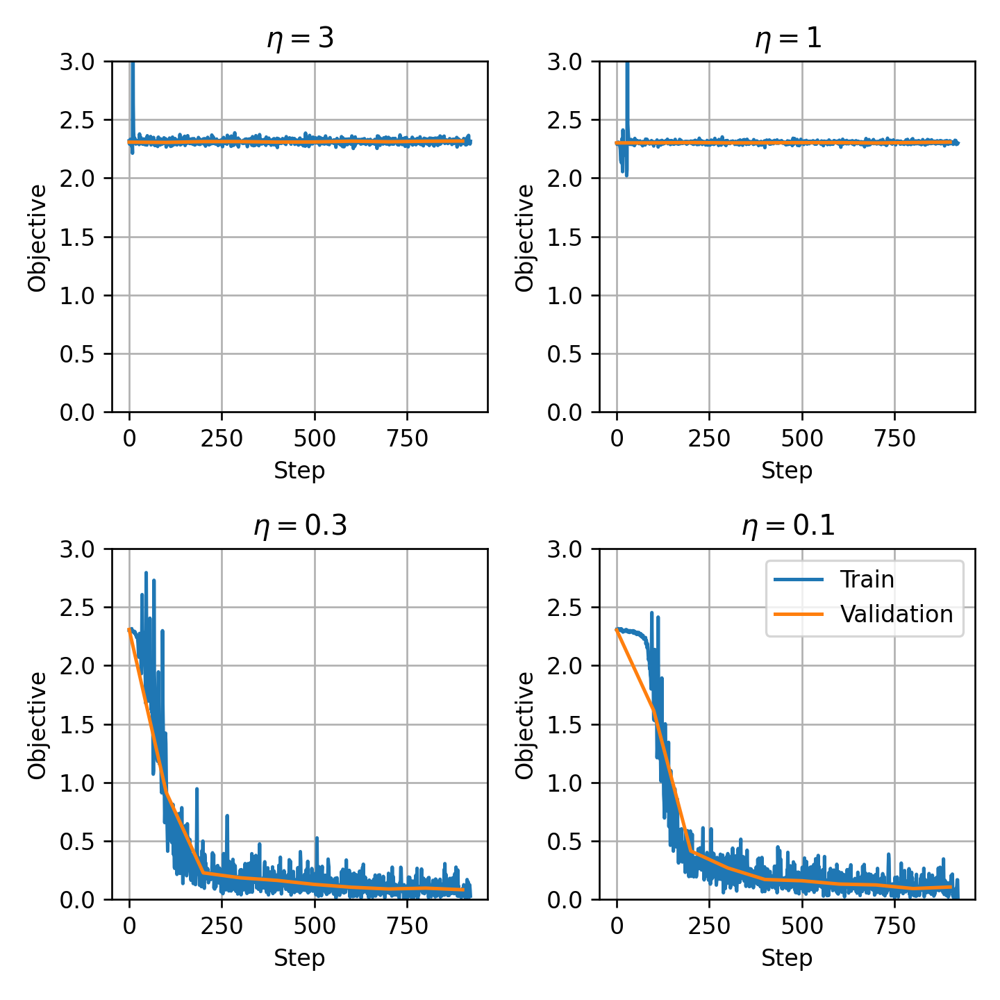
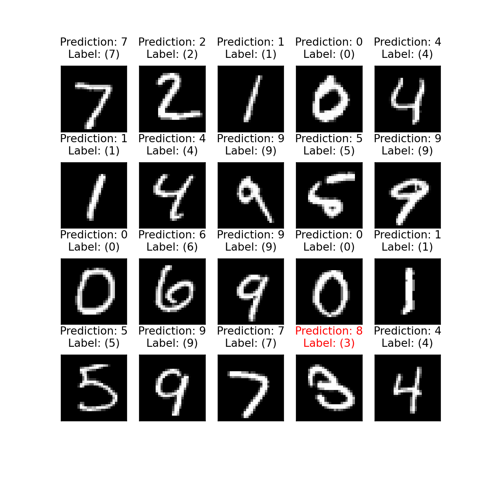

<div dir="rtl" class="site-style">

# תרגול 11 - CNN ואתחול

<div dir="ltr">
<a href="./slides/" class="link-button" target="_blank">Slides</a>
<a href="/assets/tutorial11.pdf" class="link-button" target="_blank">PDF</a>
<a href="./code/" class="link-button" target="_blank">Code</a>
</div>

## תקציר התיאוריה

### Convolutional Neural Networks (CNN) - רשתות קונבולוציה

אחת התכונות של מודל MLP (Fully Connected (FC) network) הינה חוסר רגישות לסדר בכניסות לרשת. תכונה זו נובעת מכך שכל היחידות בכל שכבה מחוברות לכל היחידות בשכבה העוקבת. במקרים רבים תכונה זו הינה תכונה רצויה, אך היא באה במחיר של מספר רב של פרמטרים.
במקרים בהם למידע אשר מוזן לרשת יש מבנה או תלות מרחבית, כלומר יש משמעות לסדר של הכניסות, נרצה לנצל את ההיתרון המרחבי של הכניסות בעת תכנון ארכיטקטורת הרשת. דוגמא לסוג כזה של מידע הן תמונות.
רשתות קונבולציה הינו סוג אחד של רשתות feed-forward בעלת ארכיטקטורה אשר מנצלת את התלות המרחבית בכניסות לכל שכבה.

#### 1D Convolutional Layer

שכבת קונבולוציה חד-ממדית הינה שכבה ברשת אשר מבצעת את הפעולות הבאות:

1. פעולת קרוס-קורלציה (ולא קונבולוציה) בין וקטור הכניסה של אותה שכבה $\boldsymbol{z_{i-1}}$ ווקטור משקולות $\boldsymbol{w}$ באורך $K$.
2. הוספת היסט $b$ (אופציונלי).
3. הפעלה של פונקציית הפעלה על וקטור המוצא איבר איבר.

פעולת הקרוס-קורלציה מוגדרת באופן הבא:

$$
z_{i+1,j}=\sum_{m=1}^K z_{i,j+m-1}w_m
$$

באופן סכימתי, השכבה נראית כך:

<div class="imgbox" style="max-width:400px">



</div>

כאשר $h(\boldsymbol{u};\boldsymbol{w},b)=\varphi(\boldsymbol{u}^{\top}\boldsymbol{w}+b)$ (הפונקציה $\varphi$ היא ההפעלה). שימו לב שבכל השכבה משתמשים באותו הוא $h_i$, זאת אומרת שמשתמשים באותם $\boldsymbol{w}_i$ ו $b_i$.

דרך נוספת להצגת שכבת קונבולוציה (לשם הפשטות נשתמש ב $\boldsymbol{x}$ לקלט ו $\boldsymbol{y}$ לפלט).

<div class="imgbox" style="max-width:400px">


</div>

וקטור המשקולות של שכבת הקונבולציה $\boldsymbol{w}$ נקרא **גרעין הקונבולוציה (convolution kernel)**.

גדול המוצא של שכבת הקונבולוציה הוא קטן יותר מהכניסה והוא נתון על ידי $D_{\text{out}}=D_{\text{in}}-K+1$.

שכבת קונבולוציה מורידה באופן דרסטי את מס' המשקולות לעומת שכבת FC. בעוד שבשכבת FC קיימות $D_{\text{in}}\times D_{\text{out}}$ משקולות ועוד $D_{\text{out}}$ איברי היסט, בשכבת קונבולציה יש $K$ משקולות ואיבר היסט בודד.

#### קלט רב-ערוצי

במקרים רבים נרצה ששכבת הקונבולציה תקבל קלט רב ממדי, לדוגמא, תמונה בעלת שלושה ערוצי צבע או קלט שמע ממספר ערוצי הקלטה. מבנה זה מאפשר לאזור מרחבי בקלט להכיל אינפורמציה ממספר ערוצי כניסה.

במקרים אלו הנוירון $h$ יהיה פונקציה של כל ערוצי הקלט:

<div class="imgbox" style="max-width:400px">


</div>

הפונקציה $h$ היינה קומבינציה לינארית של כל ערוצי הקלט, לרוב מסיפים איבר הסט $b$ ופונקציית אקטיבציה.

#### פלט רב-ערוצי

בנוסף, נרצה לרוב להשתמש ביותר מגרעין קונבולוציה אחד, במקרים אלו נייצר מספר ערוצים ביציאה בעבור כל אחד מגרעיני הקונבולוציה.

<div class="imgbox" style="max-width:400px">


</div>

בשכבות אלו אין שיתוף של משקולות בין ערוצי הפלט השונים, כלומר כל גרעין קונבולציה הוא בעל סט משקולות יחודי הפועל על כל הערוצי הכניסה על מנת להוציא פלט יחיד.
מספר הפרמטרים בשכבת כזאת היינו:  $\underbrace{C_\text{in}\times C_\text{out}\times K}_\text{the weights}+\underbrace{C_\text{out}}_\text{the bias}$.

כאשר:

- $C_\text{in}$ - מספר ערוצי קלט.
- $C_\text{out}$ - מספר ערוצי פלט.
- $K$ - גודל הגרעין.

<!-- **דגש:** שימו לב, יש להבדיל בין מס' הערוצים לממד הקלט/פלט. נגיד עבור ערוץ אחד אנחנו יכולים לקבל קלט רב ממדי (נגיד תמונה) ועבור פלט רב ערוצי, עבור כל ערוץ אנחנו יכולים לקבל מס' ממדים עבור כל ערוץ -->

#### היפר-פרמטרים של שכבות קונבולוציה

בנוסף לפרמטרים של **גודל הגרעין** ו **מספר ערוצי הפלט**, שהינם היפר-פרמטרים של שכבת הקונבולוציה, מקובל להגדיר גם את הפרמטרים הבאים:

##### Padding - ריפוד

משום שפעולת קונבולציה היינה מרחבית, בקצוות הקלט ישנה בעיה שאין ערכים חוקיים שניתן לבצע עליהם פעולות, לכן נהוג לרפד את שולי הקלט (באפסים או שכפול של אותו ערך בקצה)

<div class="imgbox" style="max-width:400px">


</div>

##### Stride - גודל צעד

ניתן להניח שלרוב הקשר המרחבי נשמר באזורים קרובים, לכן על מנת להקטין בחישוביות ניתן לדלג על הפלט ולהפעיל את פעולת הקונבולציה באופן יותר דליל. בפשטות: מדלגים על היציאות בגודל הצעד. לרוב גודל הצעד מסומן ב $s$, בדוגמא הבאה גודל הצעד היינו $s=2$. אלא אם רשום אחרת, גודל הצעד של השכבה הוא 1.

<div class="imgbox" style="max-width:400px">



</div>

##### Dilation - התרחבות

שוב על מנת להקטין בחישובית, אפשר לפעול על אזורים יותר גדולים תוך הנחה שערכים קרובים גיאוגרפית הם בעלי ערך זהה, על כן נרחיב את פעולת הקונבולציה תוך השמטה של ערכים קרובים. לרוב נסמן את ההתרחבות ב $d$ בדוגמא הבאה $d=2$. אלא אם רשום אחרת, ההתרחבות היא 1.

<div class="imgbox" style="max-width:400px">


</div>

#### Max / Average Pooling

שיכבות נוספת אשר מופיעה במקרים רבים ברשתות CNN הם שכבות מסוג pooling. שכבות אלו מחליפות את פעולת הקונבולוציה בפונקציה קבועה אשר מייצרת סקלר מתוך הקלט של הנוירון. שתי שכבות pooling נפוצות הן max pooling ו average pooling, שכבה זו לוקחת את הממוצע והמקסימום של ערכי הכניסה.

דוגמא זו מציגה max pooling בגודל 2 עם גודל צעד (stride) גם כן של 2:

<div class="imgbox" style="max-width:400px">



</div>

בשכבה זאת אין פרמטרים נלמדים, אך גודל הגרעין וגודל הצעד הינם היפר-פרמטרים של השכבה.

#### 2D Convolutional Layer

עבור קלט דו-ממדי (תמונות), הקלט מסודר כמטריצה. ופעולת הקונבולוציה (קרוס-קורלציה כפי שאתם מכירים) נראית כך:

כאשר השכבה הכחולה היא הקלט והשכבה הירוקה היא הפלט

<table style="width:100%; table-layout:fixed;">
  <tr>
    <td><center>kernel size=3<br>padding=0<br>stride=1<br>dilation=1</center></td>
    <td><center>kernel size=4<br>padding=2<br>stride=1<br>dilation=1</center></td>
    <td><center>kernel size=3<br>padding=1<br>stride=1<br>dilation=1<br>(Half padding)</center></td>
    <td><center>kernel size=3<br>padding=2<br>stride=1<br>dilation=1<br>(Full padding)</center></td>
  </tr>
  <tr>
    <td></td>
    <td></td>
    <td></td>
    <td></td>
  </tr>
  <tr>
    <td><center>kernel size=3<br>padding=0<br>stride=2<br>dilation=1</center></td>
    <td><center>kernel size=3<br>padding=1<br>stride=2<br>dilation=1</center></td>
    <td><center>kernel size=3<br>padding=1<br>stride=2<br>dilation=1</center></td>
    <td><center>kernel size=3<br>padding=0<br>stride=1<br>dilation=2</center></td>
  </tr>
  <tr>
    <td></td>
    <td></td>
    <td></td>
    <td></td>
  </tr>
</table>

- \[1\] Vincent Dumoulin, Francesco Visin - [A guide to convolution arithmetic for deep learning](https://arxiv.org/abs/1603.07285)([BibTeX](https://gist.github.com/fvisin/165ca9935392fa9600a6c94664a01214))
  
## תרגיל 11.1

נתונה רשת קונבולוציה קטנה, הממירה תמונה בגודל 13×13 לווקטור מוצא בגודל 4×1. הרשת מורכבת מהפעולות הבאות:

<div class="imgbox" style="max-width:700px">



</div>

- שכבת קונבולוציה עם 3 פילטרים (גרעינים) בגודל 4x4.
- פונקציית אקטיבציה Relu.
- Average pooling 2x2 עם stride=2.
- שכבת Fully-connected (FC).

ברשת זאת אין שימוש ב bias.

**1)** רשמו את הגדלים של שני משתני הבניים ברשת.

**2)** כמה פרמטרים נלמדים יש בשכבת הקונבולוציה?

**3)** כמה משקולות יש בכל הרשת?

**4)** כמה כפלים מבצעת הרשת בעבור כל תמונה שעוברת ברשת?

**5)** האם רשת MLP (רשת בקישוריות מלאה - FC) יכולה לייצג את הפונקציה שאותה ממשת הרשת הנתונה?

**6)** מה ההבדל העיקרי בין רשת CNN ורשת MLP שמסוגלת לתאר את אותן הפונקציות?

### תרגיל 11.1 - פתרון

#### 1)

בשכבה הראשונה אנו מתחילים מתמונה 13 על 13 ומפעילים עליה קונבולוציה דו מימדית עם גרעין בגדול 4x4. הקונבולוציה אוכלת מהקצוות של התמונת כניסה $4-1=3$ פיקסלים בכל ציר, ולכן במוצא של השכבה נקבל מטריצה 10 על 10. השיכבה מייצרת 3 ערוצים במוצא ולכן יש לנו 3 מטריצות של 10 על 10 (או במילים אחרות, טנזור 10x10x3):

<div class="imgbox" style="max-width:600px">


</div>

השכבה הבאה היא שכבת pooling בגודל 2 על 2 ועם צעד של 2. זאת אומרת שהיא הופכת כל ריבוע של 2 על 2 לערך יחיד, ולכן היא למעשה מצמצמת ב2 כל ציר. הכניסה של 3 ערוצים של 10 על 10 תהפוך ל 3 ערוצים של 5 על 5:

<div class="imgbox" style="max-width:500px">


</div>

#### 2)

בשכבת הקונבולוציה יש 3 פילטרים בגודל 4x4, זאת אומרת 48 פרמטרים.

#### 3)

בשכבת ה average pooling אין פרמטרים, ובשכבת ה FC כמות הפרמטרים שווה למספר הכניסות כפול מספר היציאות. בכניסה לשכבה יש 5x5x3 איברים ובמוצא יש 4x1 ולכן סך הכל יש

$$
5\times5\times3\times4=300
$$

פרמטרים. בך הכל יש ברשת $300+48=348$ פרמטרים.

#### 4)

##### שכבת הקונבולוציה

לחישוב של מספר הפרמטרים בשכבת הקונבולוציה הכי קל זה להסתכל על המוצא. החישוב של כל איבר במוצא דורש 4x4 כפלים. במוצא של השכבה יש 10x10x3 איברים, ולכן סה"כ שיכבה זו דורשת::

$$
4\times4\times10\times10\times3=4800
$$

כפלים

##### שכבת ה FC

מספר הכפלים בשכבת ה FC שווה למספר הכניסות כפול מספר היציאות. בכניסה לשכבה יש 5x5x3 איברים ובמוצא יש 4x1 ולכן סך הכל יש

$$
5\times5\times3\times4=300
$$

כפלים

##### שכבת ה average pooling

בשכיבת ה average pooling יש מספר כפלים כמספר האיברים במוצא (כל איבר במוצא מיוצר על ידי סכימה של 4 איברים וחלוקה ב 4), ברשת הנתונה יש במוצא של שכבת ה avarage pooling $5\times5\times3=75$ איברים ולכן שכבה זו מבצעת 75 כפלים.

בסה"כ יש ברשת 5175 כפלים.

#### 5)

כן, הרשת עם שכבת הקונבולוציה וה average pooling הינה מקרה פרטי של רשת FC, עם בחירה ספציפית של המשקולות.

#### 6)

רשת עם שכבות הקונבולוציה מתארות תת-תחום של מרחב הפונקציות שאותה יכולה לתאר רשת MLP. היתרון שברשת עם שכבת הקונבולוציה הינה שהיא עושה זאת על ידי מספר קטן משמעותית של פרמטרים. לכן, בהנחה שניתן לקרב במידה טובה מספיק את פונקצייית המטרה על ידי פונקציות מתת-תחום זה, היא כנראה תעשה פחות overfit ולכן בעלת סיכוי להניב תוצאות טובות יותר. לשם השוואה ברשת ה MLP שמייצגת את אותה הפונקציה ישנם כ50k פרמטרים.

## תרגיל 11.2

התמך או הrecptive field של משתנה מסויים ברשת מוגדר להיות כל התחום בכניסה אשר משפיע על אותו המשתנה.

מצאו את הrecptive field של ערך מסויים במוצא של שלוש שכבות קונבולוציה רצופות עם גרעין של $3\times 3$.

### תרגיל 11.2 - פתרון

הrecptive field של שלוש שכבות קונבולוציה רצופות בגודל  $3\times 3$ הינו איזור בגודל $7\times 7$. נדגים זאת:

קונבולוציה ראשונה:

<div class="imgbox" style="max-width:600px">


</div>

קונבולוציה שניה:

<div class="imgbox" style="max-width:600px">


</div>

קונבולוציה שלישית:

<div class="imgbox" style="max-width:600px">


</div>

## איתחול משקולות הרשת

לאיתחול של הפרמטרים של הרשת יש חשיבות רבה ברשתות נוירונים משתי בחינות:

1. מכיוון ש gradient decent מתכנס למינימום לוקאלי אשר תלוי בנקודת ההתחלה.
2. ערכים גדולים מדי או קטנים מידי של הפרמטרים עלולים לייצר הבדלים גדולים בין ערכי הביניים בתוך הרשת. מכיוון שערכי הבניים משפיעים על הגרדיאנטים של המשתנים נקבל שחלק מהגרדיאנטים יהיו מאד גדולים בעוד שהאחרים מאד קטנים, מה שיקשה מאד על בחירה של קצב לימוד טוב.

נציג דוגמא לבעיה השניה ונראה כיצד ניתן לאתחל את הפרמטרים של הרשת בכדי לנסות ולהמנע מבעיות אלו.

נסתכל על רשת MLP של 5 שכבות ברוחב 5 וכניסה ברוחב 5 עם פונקציית הפעלה של ReLU:

<div class="imgbox" style="max-width:700px">


</div>

ניקח כניסה אקראית $\boldsymbol{x}$ שבה האיברים מוגרלים מתול פילוג נורמאלי עם תוחלת 0 וסטיית תקן של 1:

$$
\boldsymbol{x}=[2.59,1.84,0.44,-0.72,-0.58]^{\top}
$$

### אתחול עם משקולות גדולות מידי

נאתחל את המשקולות של הרשת מתוך פילוג נורמאלי עם תוחלת 0 וסטיית תקן של 10. כאשר נזין את $\boldsymbol{x}$ לתוך הרשת נקבל את המוצאים הבאים מכל שכבה של הרשת:

$$
\begin{aligned}
z_1=[0.00,18.93,0.00,29.21,0.00]^{\top}\\
z_2=[0.00,647.54,0.00,527.02,498.82]^{\top}\\
z_3=[5263.19,0.00,0.00,4494.22,0.00]^{\top}\\
z_4=[100556.40,0.00,4364.23,99805.43,0.00]^{\top}
\end{aligned}
$$

המוצא של הרשת יהיה:

$$
y=155078.15
$$

נשים לב כי הערכים של משתני הבניים גדלים משכבה לשכבה. בעיה זו הולכת ומחמירה ככך שמספר השכבות והרוחב שלהם גדל. כאשר נחשב את הגרדיאנטים של הפרמטרים בכל שכבה נקבל שגם הגרדיאנטים יהיו עם הבדלים מאד גדולים בניהם.

אותה בעיה הייתה מתקבלת ברשת זו גם בעבור סטיית תקן של 1 אך בצורה קצת פחות חמורה.

### אתחול עם משקולות קטנות מידי

נאתחל כעת את המשקולות של הרשת מתוך פילוג נורמאלי עם תוחלת 0 וסטיית תקן של 0.1. כאשר נזין את $\boldsymbol{x}$ לתוך הרשת נקבל את המוצאים הבאים מכל שכבה של הרשת:

$$
\begin{aligned}
z_1=[0.00000,0.18927,0.00000,0.29210,0.00000]^{\top}\\
z_2=[0.00000,0.06475,0.00000,0.05270,0.04988]^{\top}\\
z_3=[0.00526,0.00000,0.00000,0.00449,0.00000]^{\top}\\
z_4=[0.00101,0.00000,0.00004,0.00100,0.00000]^{\top}
\end{aligned}
$$

המוצא של הרשת יהיה:

$$
y=0.00155
$$

נשים לב שכאן הערכים הולכים וקטנים.

מקרה שבו הגרדיאנטים הולכים וגדלים נראת **exploding gradients** והתופעה שבה הם הולכים וקטנים נקראת **vanishing gradients**. בתרגיל הבא ננסה למצוא דרך לאתחל את הפרמטרים של הרשת כך שהערכים ישארו בערך באותו גודל לאורך הרשת.

## תרגיל 11.3

בשאלה זו נרצה למצוא סכמת אתחול עבור משקולות הרשת. לשם כך, נתחיל מלבחון נוירון ליניארי בודד.

<div class="imgbox" style="max-width:600px">



</div>

**הערה**: אם הממוצע של המוצא $v$ הוא 0 והשונות נשארת קבועה בין שכבות (לא דועכת או מתפוצצת) – אין התפוצצות או העלמות של האות לאורך הרשת. לכן, בסעיפים הבאים נתעניין בחישוב הממוצע והשונות של המוצא $v$. ספציפית, נרצה להראות כי $\mathbb{E}\left[v\right]=0$ ואז לחשב את השונות של המוצא על מנת לראות מה עלינו לדרוש על אתחול המשקולות על מנת להבטיח כי שונות המוצא תישאר קבועה לאורך הרשת.

#### 1)

נניח כי כל רכיבי המשקולות וכל רכיבי הכניסה הם משתנים אקראיים IID. בנוסף, נניח כי התפלגות המשקולות סימטרית סביב 0.

1. חשבו את התוחלת של המוצא $v$ כתלות בתוחלות של המשקולות והכניסה. בפרט, הראו כי $\mathbb{E}\left[v\right]=0$.
2. הראו כי לכל זוג משתנים אקראיים בלתי תלויים $x,y$ מתקיים:

    $$
    \text{Var}\left(xy\right)=\mathbb{E}\left[x\right]^2\text{Var}\left(y\right)+\mathbb{E}\left[y\right]^2\text{Var}\left(x\right)+\text{Var}\left(x\right)\text{Var}\left(y\right)
    $$

3. כעת, נניח כי לכל $i$: $\mathbb{E}\left[x_i\right]=0$ (בסעיף הבא נראה הצדקה להנחה זו). השתמשו בנוסחה מהסעיף הקודם על מנת לבטא את השונות של $v$ באמצעות השונות של $x_1,w_1$.
4. כיצד ניתן לשמור על השונות של המוצא $v$ זהה לשונות של כל אחת מרכיבי הכניסה $x_i$?

#### 2)

כעת, נרצה להרחיב את הסכמה לנוירונים **לא ליניאריים**:

<div class="imgbox" style="max-width:600px">


</div>

כלומר, כעת מתקיים כי $x_i=\sigma\left(y_i\right), \forall i=1, \dots,n$ כאשר $\sigma\left(\cdot\right)$ היא פונקציית האקטיבציה ו- $v=w_1 x_1+w_2 x_2+\cdots+w_n x_n$

אנו נניח כי נוירון זה הוא חלק מרשת עמוקה, כלומר, נניח כי $y_1,\dots,y_n$ הם המוצאים של נוירונים מהשכבה הקודמת ברשת.

**הערה:** בסעיף הבא נראה כי התוחלת של המוצא איננה 0 עבור אחת מהאקטיבציות שלמדנו בקורס. עם זאת, נראה כי הממוצע לפני האקטיבציה, כלומר, הממוצע של $y_i$, הוא עדיין 0 לכל $i$. לכן, אין לנו בעיה של התפוצצות הממוצע $\leftarrow$ אם השונות נשארת קבועה בין שכבות (לא דועכת או מתפוצצת) – אין התפוצצות או העלמות של האות לאורך הרשת.

1. לאילו מפונקציות האקטיבציה הבאות: sigmoid, tahn ו-ReLU, ההנחה $\mathbb{E}\left[x_i\right]=0$ שביצענו בסעיף הקודם היא עדיין הנחה "סבירה"? תזכורת:

<div class="imgbox" style="max-width:600px">



</div>

2. כעת לא נניח דבר על התוחלת של $x_i$. כיצד ישתנה הביטוי של השונות של $v$ מסעיף א.3?
3. עבור פונקציית האקטיבציה ReLU, בטאו את השונות של $v$ באמצעות השונות של אחת הכניסות $y_i$. הניחו כי $\text{Var}\left(y_1\right)=\text{Var}\left(y_2\right)=\cdots=\text{Var}\left(y_n\right)$.

הדרכה: היעזרו בתוצאות הסעיפים הקודמים.

### תרגיל 11.3 - פתרון

#### 1)

**1)**

$$
\mathbb{E}\left[v\right]=\mathbb{E}\left[w_1 x_1+w_2 x_2+⋯+w_n x_n\right]=n\mathbb{E}\left[w_1 x_1\right]=n\mathbb{E}\left[w_1\right]\mathbb{E}\left[x_1\right]=0
$$

**2)** נעזר בקשר $\text{Var}\left(z\right)=\mathbb{E}\left[z^2\right]-\mathbb{E}\left[z\right]^2$:

$$
\begin{aligned}
\text{Var}\left(xy\right)
& = \mathbb{E}\left[x^2y^2\right]-\mathbb{E}\left[xy\right]^2 \\
& = \mathbb{E}\left[x^2\right]\mathbb{E}\left[y^2\right]-\mathbb{E}\left[x\right]^2\mathbb{E}\left[y\right]^2 \\
& = \left(\mathbb{E}\left[x^2\right]-\mathbb{E}\left[x\right]^2+\mathbb{E}\left[x\right]^2\right)\left(\mathbb{E}\left[y^2\right]-\mathbb{E}\left[y\right]^2+\mathbb{E}\left[y\right]^2\right)-\mathbb{E}\left[x\right]^2\mathbb{E}\left[y\right]^2 \\
& = \left(\text{Var}\left(x\right)+\mathbb{E}\left[x\right]^2\right)\left(\text{Var}\left(y\right)+\mathbb{E}\left[y\right]^2\right)-\mathbb{E}\left[x\right]^2\mathbb{E}\left[y\right]^2 \\
& = \text{Var}\left(x\right)\text{Var}\left(y\right)+\text{Var}\left(x\right)\mathbb{E}\left[y\right]^2+\text{Var}\left(y\right)\mathbb{E}\left[x\right]^2 \\
\end{aligned}
$$

**3)** תחת ההנחה כי התוחלות של המשקולות ושל הכניסה הן 0, הנוסחה שהוכחנו בסעיף הקודם מצטמצמת ל $\text{Var}\left(w_ix_i\right)=\text{Var}\left(x_i\right)\text{Var}\left(w_i\right)$. בנוסף, עבור מוצא הנוירון $v$ ניתן לכתוב:

$$
v=w_1 x_1+w_2 x_2+\cdots+w_n x_n
$$

מכיוון שהנחנו שכל המשתנים מפולגים IID נקבל:

$$
\text{Var}\left(v\right)=n\text{Var}\left(w_1 x_1\right)=n\text{Var}\left(w_1\right)\text{Var}\left(x_1\right)
$$

**4)** קיבלנו בסעיף הקודם כי שונות המוצא היא שונות הכניסה מוכפל בפקטור של $n\text{Var}\left(w_i\right)$ כאשר $n$ הוא מספר הנוירונים המוזנים לנוירון. לכן, על מנת לשמור על שונות זהה בין כניסה למוצא נבחר את אתחול המשקולות כך שיתקיים:

$$
\text{Var}\left(w_i\right)= \frac{1}{n}
$$

#### 2)

**1)** אם התפלגות המשקולות סימטרית סביב 0, נקבל כי התפלגות $y_i$ סימטרית סביב 0 לכל $i$. לכן, ההנחה עדיין סבירה עבור tanh אך לא עבור ReLU וsigmoid. עבור tanh נקבל:
  
$$
\mathbb{E}\left[x\right]=\mathbb{E}\left[\sigma\left(y\right)\right]=\int_{-\infty}^{\infty} \sigma\left(y\right) f_Y\left(y\right)dy=0
$$
  
כאשר סימנו $x=x_i,y=y_i$.

**2)** משימוש בתוצאות הסעיפים הקודמים, נקבל:
  
$$
\begin{aligned}
\text{Var}\left(v\right)
& = n\text{Var}\left(w_1 x_1\right) \\
& = n\left(\mathbb{E}\left[w_1\right]^2 \text{Var}\left(x_1\right)+\mathbb{E}\left[x_1\right]^2\text{Var}\left(w_1\right)+\text{Var}\left(x_1\right)\text{Var}\left(w_1\right)\right) \\
& = n\text{Var}\left(w_1\right)\left(\mathbb{E}\left[x_1\right]^2+\text{Var}\left(x_1\right)\right) \\
& = n\text{Var}\left(w_1\right)\mathbb{E}\left[x_1^2\right]
\end{aligned}
$$
  
**3)** אם התפלגות המשקולות סימטרית סביב 0, נקבל כי התפלגות $y_i$ סימטרית סביב 0 לכל $i$. לכן, עבור פונקציית אקטיבציה ReLU נקבל:
  
$$
\begin{aligned}
\mathbb{E}\left[x_1^2\right]
& = \mathbb{E}\left[\max\left(0,y_1\right)^2 \right] \\
& = \int_{-\infty}^{\infty} \max\left(0,y_1\right)^2 f_Y\left(y\right)dy \\
& = \int_{0}^{\infty} y_1^2 f_Y\left(y\right)dy \\
& = \frac{1}{2}\int_{-\infty}^{\infty} y_1^2 f_Y\left(y\right)dy \\
& = \frac{1}{2}\mathbb{E}\left[y_1^2\right] \\
& = \frac{1}{2}\text{Var}\left(y_1\right)
\end{aligned}
$$
  
נשלב את התוצאה יחד עם תוצאות הסעיפים הקודמים ונקבל:

$$
\text{Var}\left(v\right)=n\text{Var}\left(w_1\right)\mathbb{E}\left[x_1^2\right]=\frac{n}{2}\text{Var}\left(w_1\right)\text{Var}\left(y_1\right)
$$

לכן, על מנת לשמור על שונות זהה בין כניסה למוצא נבחר את אתחול המשקולות כך שיתקיים:

$$
\text{Var}\left(w_i\right)= \frac{2}{n}
$$

## חלק מעשי- LeNet 5

<div dir="ltr">
<a href="./example/" class="link-button" target="_blank">Code</a>
</div>

בחלק זה נעבור על היישום המעשי הראשון של רשתות קונבולוציה. הארכיטקטורה זאת שימשה ב1998 ושימש לזהות ספרות בכתב יד על צק'ים במערכות בנקאיות.

<div class="imgbox" style="max-width:500px">


</div>

הרשת מקבלת תמונה רמת אפור של ספרה בגודל 32x32 ומשתמש באריטקטורה הבאה על מנת להוציא וקטור פלט באורך 10 אשר מציג את ההיסברות שהתמונה שייכת לכל אחת מ 10 הספרות.  

#### אריכטקטורה

<div class="imgbox" style="max-width:800px">


</div>

ארכיטקטורה זו לא עושה שימוש בריפוד ו-dilation, ואלא אם רשום אחרת stride=1.

- C1: Convolutional layer + ReLU activation: kernel size=5x5, output channels=6.
- S2: Max pooling layer: size=2x2, stride=2
- C3: Convolutional layer + ReLU activation: kernel size=5x5, output channels=16.
- S4: Max pooling layer: size=2x2, stride=2
- C5: Convolutional layer + ReLU activation: kernel size=5x5, output channels=120. (this is, in fact, a fully connected layer)
- F6: Fully connected layer + ReLU: output vector length= 84
- Output layer: Fully connected layer: output vector length=10

על מנת לייצג את הסתברות שהתמונה שייכת לאחת מהמחלקות נעשה ביציאה שימוש בשכבת Softmax.
 
דרך אחת לשרטט את הרשת הינה באופן הבא:

<div class="imgbox" style="max-width:800px">

  
  
</div>
  
ארכיטקטורה זו היא לא הארכיטקטורה המדויקת של LeNet אלא ארכיטקטורה בהשראת LeNet עם מעט שינויים הכרחיים. 


### הגדרת הבעיה

הבעיה היא בעיית סיווג (לא בינארית) כאשר

- $\mathbf{x}$ הוא תמונה בגודל 28x28 של סיפרה בכתב יד.
- $\text{y}$ הוא ערך הסיפרה: \[0-9\]

אנו נרצה להשתמש ברשת על מנת לפתור את בעיית הסיווג בגישה הדיסקרימינטיבית הסתברותית (ללמוד את $p_{\text{y}|\mathbf{x}}$). כמו תמיד בכדי לקבל פילוג חוקי אנו נפעיל softmax על המוצא של הרשת פונקציית.

### Dataset: MNIST

מכיוון שהמדגם המקורי אשר שימש לאימון של הרשת לא פורסם, אנו נשתמש במדגם פופולרי אחר אשר נקרא MNIST. הוא סט פופולרי מאוד שנעשה בו שימוש נרחב עד היום. הסט מורכב 70000  תמונות בינאריות בגודל 28x28 של ספרות בכתב יד, מתוכן 10000 מוגדרים להיות ה test set.

ניתן להוריד את הסט מ [Yann LeCun's web site](http://yann.lecun.com/exdb/mnist/).

<div class="imgbox" style="max-width:600px">


</div>

הגדול של התמונות במדגם הם 28x28, בניגוד לגודל של התמונות בעבודה המקורית שהייתה 32x32. בכדי להתאים את הרשת תמונות בגודל זה נוסיף ריפוד של 2 אפסים בכל שפה של התמונה.

#### חלוקה של מאגר המידע

משום שהמאגר מגדיר כבר את ה test set, כל מה שנותר לנו הוא לחלק את ה train set ל train ו validation. מיכוון שה train set מאד גדול (60000 דגימות), מספיק לקחת validation set שהוא קטן יותר מ 25% מ train ושעדיין יהיה מצייג מספיק.
הסיבה לקחת validation קטן הוא גם בשביל לזרז את השלב של חישוב הביצועים על ה validation וגם בשביל לא להקטין את הגודל של ה train.

ניקח אם כן validation set בגודל 1024.

### בניית הרשת על ידי שימוש ב PyTorch

Python מכיל מספר חבילות אשר מפשטות מאד את הבניה והאימון של רשתות נוירונים. בקורס זה אנחנו נעבוד עם אחת החבילות הפופולריות בתחום אשר נקראת PyTorch.

בתרגיל רטוב 5 תעזרו ב PyTorch בכדי למממש רשת קונסולוציה דומה לזו שנשתמש בה כאן.

#### הגדרת הרשת

הדרך המקובלת להשתמש ב PyTorch היה על ידי הגדרת class יעודי אשר מגדיר את השכבות ואת הדרך בה הרשת פועלת. הדבר נעשה באופן הבא:

```python
class LeNet5(torch.nn.Module):
     
    def __init__(self):   
        super(LeNet5, self).__init__()
        
        ## Defining the layers
        ## =========================================================
        ## C1: Convolutional layer: kernel size=5x5, output channels=6.
        ## Here we will add the padding of 2 to make the images of MNIST fit to the network.
        self.conv1 = torch.nn.Conv2d(in_channels=1, out_channels=6, kernel_size=5, padding=2)
        self.relu1 = torch.nn.ReLU()  

        ## S2: Max pooling layer: size=2x2, stride=2
        self.max_pool2 = torch.nn.MaxPool2d(kernel_size=2, stride=2)

        ## C3: Convolutional layer + ReLU activation: kernel size=5x5, output channels=16.
        self.conv3 = torch.nn.Conv2d(in_channels=6, out_channels=16, kernel_size=5)
        self.relu3 = torch.nn.ReLU()
        
        ## S4: Max pooling layer: size=2x2, stride=2vector)
        self.max_pool4 = torch.nn.MaxPool2d(kernel_size=2, stride=2)

        ## C5: Convolutional layer + ReLU activation: kernel size=5x5, output channels=120.
        self.conv5 = torch.nn.Conv2d(in_channels=16, out_channels=120, kernel_size=5)
        self.relu5 = torch.nn.ReLU()

        ## F6: Fully connected layer + ReLU: output vector length=84
        self.fc6 = torch.nn.Linear(120, 84)
        self.relu6 = torch.nn.ReLU()
        
        ## Output: Fully connected layer + ReLU: output vector length=10
        self.fc_output = torch.nn.Linear(84, 10)

        ## Note: It is not actually necessary to define multiple ReLUs and max-pooling operations
        ## since these layers have no parameters.
        
        
    def forward(self, x):
        ## C1: Convolutional layer + ReLU activation: kernel size=5x5, output channels=6.
        x = self.conv1(x)
        x = self.relu1(x)
        
        ## S2: Max pooling layer: size=2x2, stride=2
        x = self.max_pool2(x)

        ## C3: Convolutional layer + ReLU activation: kernel size=5x5, output channels=16.
        x = self.conv3(x)
        x = self.relu3(x)

        ## S4: Max pooling layer: size=2x2, stride=2
        x = self.max_pool4(x)

        ## C5: Convolutional layer + ReLU activation: kernel size=5x5, output channels=120.
        x = self.conv5(x)
        x = self.relu5(x)

        x = x.view(x.shape[0], x.shape[1]) ## Redefine x as a 1D vector
        
        ## F6: Fully connected layer + ReLU: output vector length= 84
        x = self.fc6(x)
        x = self.relu6(x)

        ## Output layer: Fully connected layer: output vector length=10
        x = self.fc_output(x)
        
        return x
```

במימוש של פונקציה זו אנו עושים שימוש באובייקטים הבאים מהחבילה של PyTorch:

- **torch.nn.Model**: אובייקט שממנו יש לרשת (inherit) כאשר יוצרים רשת חדש בPyTorch. בקורס זה לא נרחיב על הנושא נציין רק שיש להוסיף תמיד "(torch.nn.Module)" אחרי שם ה class.
- **[torch.nn.Conv2d](https://pytorch.org/docs/stable/generated/torch.nn.Conv2d.html#conv2d)**: אובייקט אשר מממש קונבולוציה דו מימדית.
- **[torch.nn.ReLU](https://pytorch.org/docs/stable/generated/torch.nn.ReLU.html?highlight=relu#relu)**: אובייקט אשר מממש פונקציית ReLU (איבר איבר).
- **[torch.nn.MaxPool2d](https://pytorch.org/docs/stable/generated/torch.nn.MaxPool2d.html?highlight=maxpool#maxpool2d)**: אובייקט אשר מממש max pooling דו מימדי.
- **[torch.nn.Linear](https://pytorch.org/docs/stable/nn.html#linear)**: אובייקט אשר מבצע טרנספורמציה לינארית (לייתר דיוק אפינית). זה למעשה החלק הלינארי של שכבת FC.

### לימוד

#### חישוב ה Log-likelihood

לצורך הלימוד נצטרך לחשב את ה log-liklihood על ה batch:

$$
\sum_i \text{softmax}(f(\boldsymbol{x}^{(i)};\boldsymbol{\theta}))_{y^{(i)}}
$$

כאשר $f(\boldsymbol{x};\boldsymbol{\theta})$ היא הפונקציה שאותה ממשת הרשת עם פרמטרים $\boldsymbol{\theta}$ והסכימה היא על כל הדגימות ב batch.

הפונקציה **[torch.nn.CrossEntropyLoss()](https://pytorch.org/docs/stable/generated/torch.nn.CrossEntropyLoss.html#crossentropyloss)** מקבלת מטריצה שבכל שורה יש $f(\boldsymbol{x}^{(i)};\boldsymbol{\theta})$ ווקטור של $y^{(i)}$ והיא מחשבת את ה softmax של המטריצה ואז את ה log-likelihood של כל הדגימות.

```python
## Set the objective
objective_func = nn.CrossEntropyLoss()

## Calculate the log-likelihood on x and y
py_hat = net(x)
objective = objective_func(py_hat, y)
```

#### Auto differentiation

היתרון גדול של שימוש בחבילה כמו PyTorch הוא שהיא למעשה יודעת לחשב את הנגזרת בשבילנו על ידי שימוש ב back-propogation. לאחר חישוב ה log-likelihood נוכל פשוט לקרוא לפקודה:

```python
objective.backward()
```

והחבילה תחשב את כל הגרדיאנטים של ה objective לפי הפרמטרים של המודל. PyTorhc שומר את הגרדיאנטים המתקבלים בתוך הרשת ביחד עם המשתנים

#### Stochastic Gradient Descent

בכדי למצוא את הפרמטרים האופטימאליים נשתמש ב mini-batch gradient descent אשר מופיע ב PyTorch בשם stochastic gradient descent (SGD). הדרך להשתמש באלגוריתם הוא בעזרת שלושת הפקודות הבאות:

```python
## Initizalie the optimizer
optimizer = torch.optim.SGD(net.parameters(), lr=eta)
```

מאתחל את האלגוריתם עם הפרמטרים של הרשת ומגדיר את גודל הצעד

```python
optimizer.zero_grad()
```

מאפס את כל הנגזרות ש PyTorch חישב עד כה (יש להריץ פקודה זו לפני כל קריאה ל "objective.backward()" שמחשבת את הגרדיאנטים)

```python
## Preform the gradient descent step
optimizer.step()
```

אשר מבצע את צעד הגרדיאנט ומעדכן את הפרמטרים של הרשת.

#### הכל ביחד

האלגוריתם כולו ראה כך:

```python
def train(net, eta, n_epoch, train_loader):
    
    ## Set the objective
    objective_func = torch.nn.CrossEntropyLoss()
    
    ## Initizalie the optimizer
    optimizer = torch.optim.SGD(net.parameters(), lr=eta)

    for epoch in tqdm.tqdm(range(n_epoch), leave=False):
        for x, y in tqdm.tqdm(train_loader, leave=False):
            optimizer.zero_grad()
            ## Forward pass
            py_hat = net(x)
            objective = objective_func(py_hat, y)
            ## Backward pass
            objective.backward()
            ## Preform the gradient descent step
            optimizer.step()
```

#### בחירת גודל צעד הלימוד

בדומה לתהליך שעשינו בתרגול הקודם, נבחן ארבע גדלים של צעד הגרדיאנט $\eta$ ונסתכל על ה objective המתקבל על ה train ועל ה validation:

<div class="imgbox" style="max-width:800px">



</div>

שימו לב כי בגלל השימוש ב stochastic gradient descent הגרף של ה train מאד רועש. בנוסף בגלל שסטוכסטיות של התהילך אנו גם לא נצפה שה validation ירד בצורה מונוטונית ונתעיין במגמה הכללית שלו ונתעלם מעליות נקודתיות בגרף.

מבין ארבעת הערכים שבדקנו נבחר את $\eta=0.3$ שבעברו הגרף מצליח להתכנס (הוא אומנם מעט יותר רועש מאשר $\eta=01$ ולכן לא ברור מי משניים עדיף. הכי טוב זה לבדוק את שניהם).

#### האימון

נריץ את האלגוריתם ה stochasctic gradient descent למשך 20 epochs (20 פעמים שעברנו על כל הדגימות במדגם).

<div class="imgbox" style="max-width:600px">


</div>

ניתן לראות שה validation יורד בהתחלה עד בערך הצעד ה6000 ואז מתחיל לאט לאט לעלות. הסיבה כי כנראה overfitting. לשם הפשטות לא השתמשנו כאן ב early stopping, בפועל היינו רוצים כנראה בזמן האימון לשמור בצד את הפרמטרים שנותנים את ה validation הנמוך ביותר ומשתמשים בהם בכדי לקבוע את הפרמטרים הסופיים של הרשת.

### הערכת ביצועים

נריץ את המודל לאחר הלימוד על סט המבחן ונקבל שפונקצית המחיר הינה $0.011$

<div class="imgbox" style="max-width:600px">



</div>

</div>
