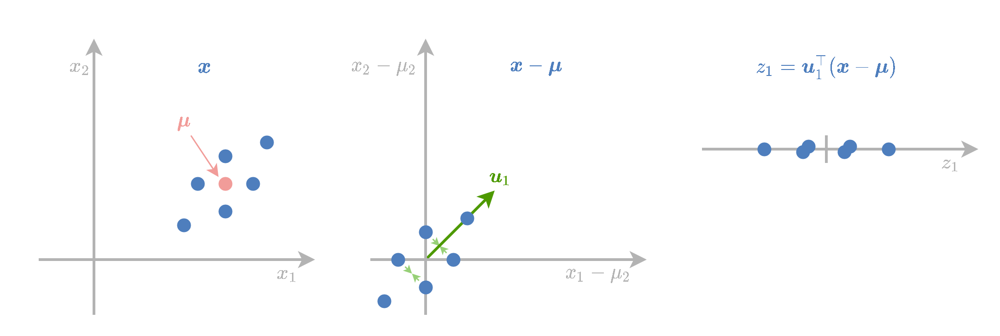
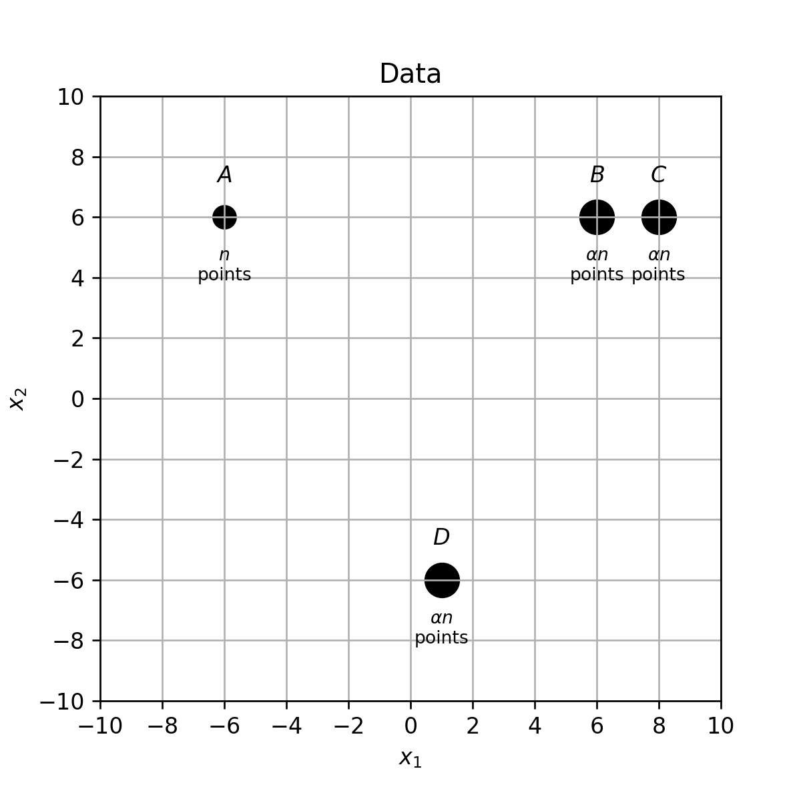
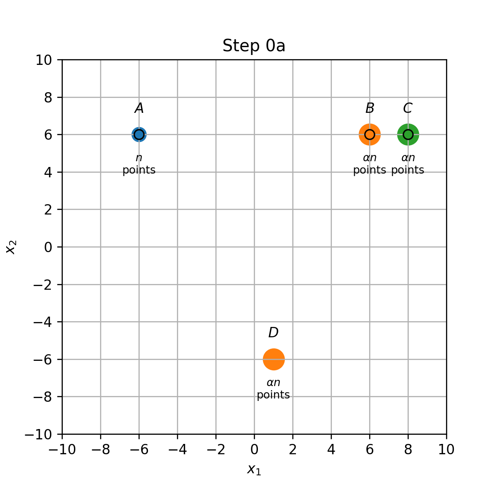
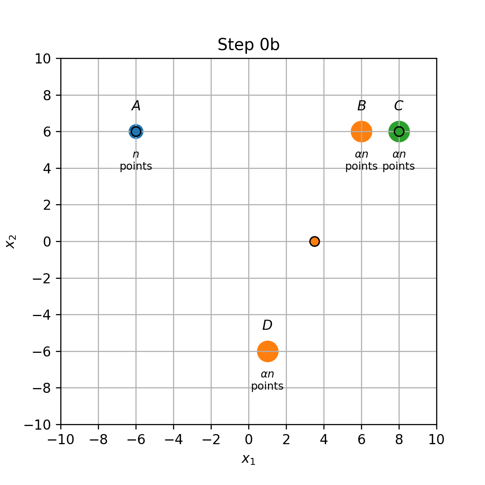
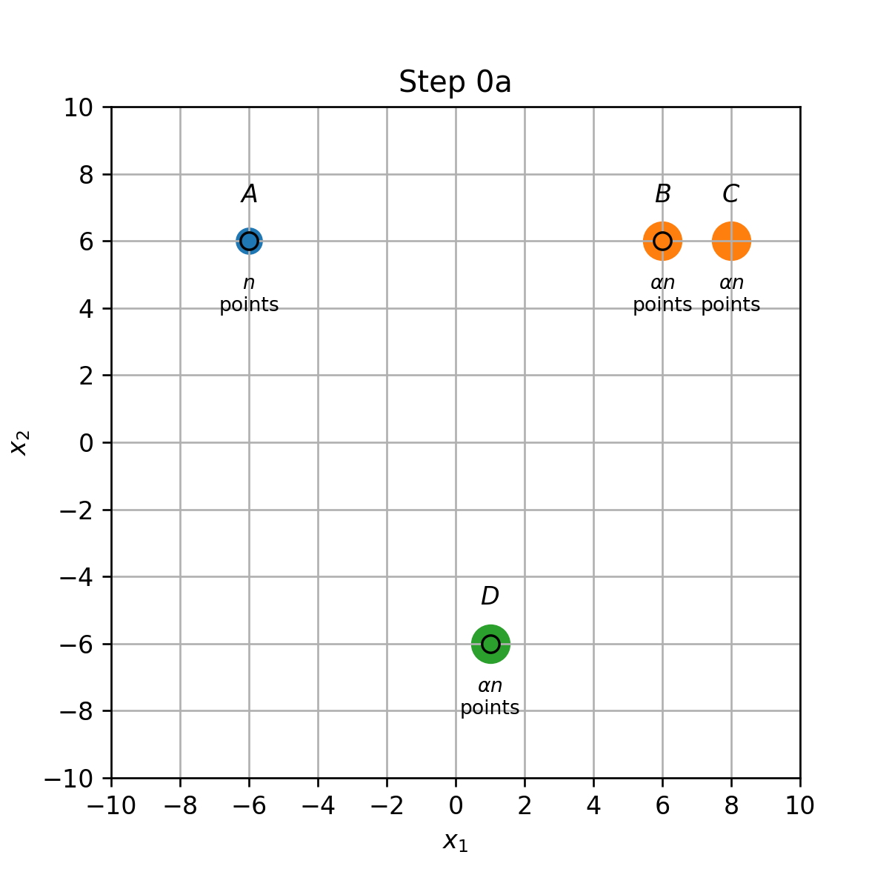
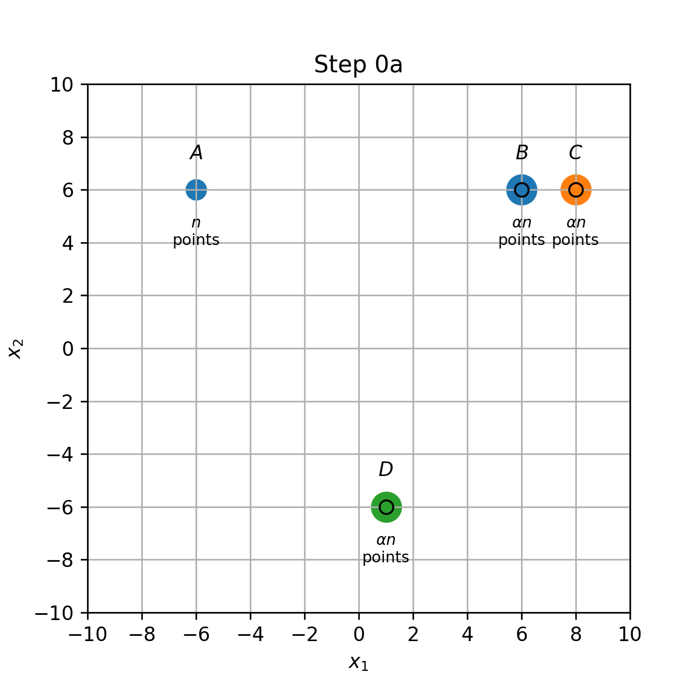
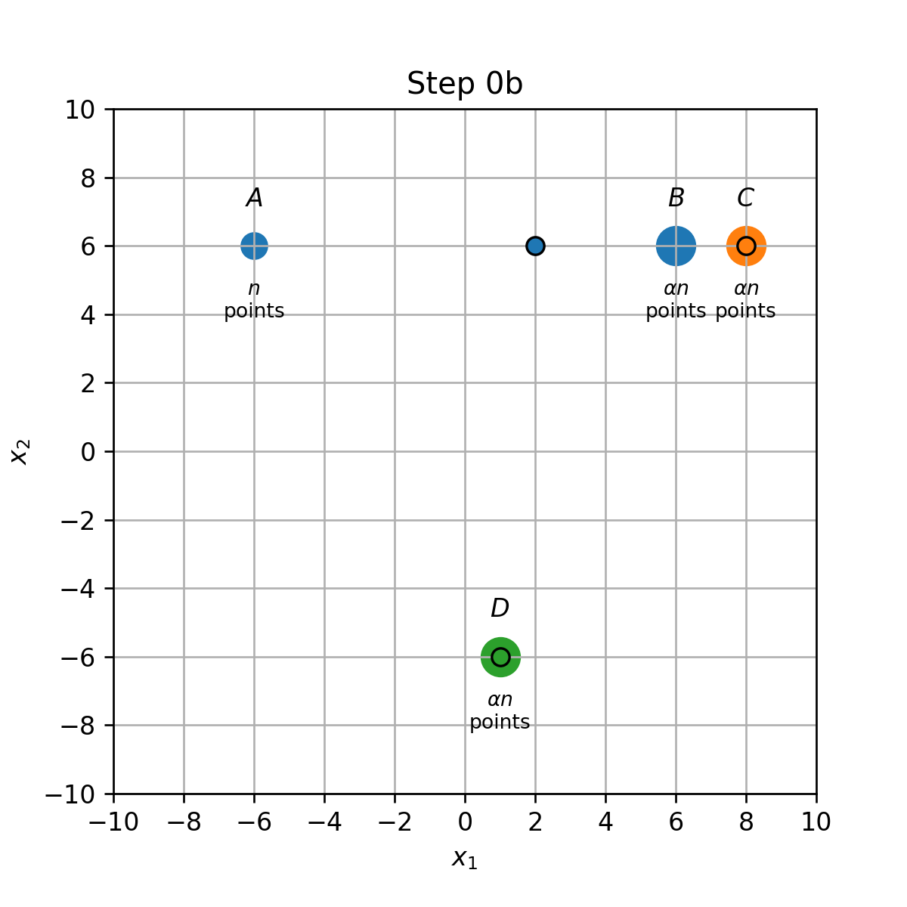
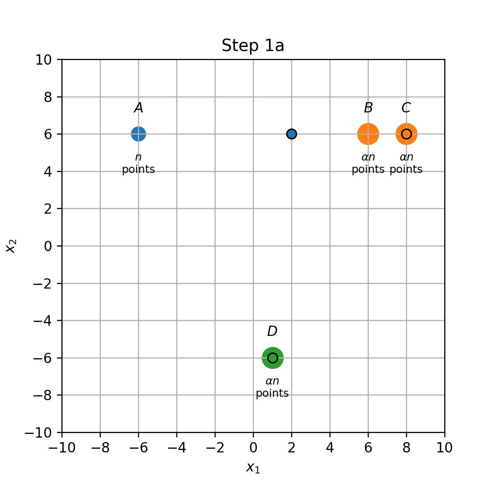
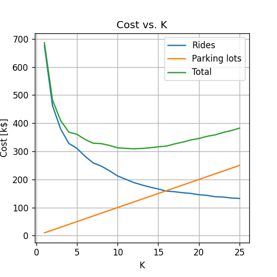

# תרגול 13 - PCA and K-means

<a href="./slides/" class="link-button" target="_blank">Slides</a>
<a href="/assets/tutorial13.pdf" class="link-button" target="_blank">PDF</a>
<!-- <a href="./code/" class="link-button" target="_blank">Code</a> -->

## תקציר התיאוריה - PCA

PCA הוא אלגוריתם מאד נפוץ אשר משמש במוקומות רבים על מנת למצוא יצווג נוח יותר לוקטורים על סמך מדגם נתון. אחד השימושים העיקריים של האלגוריתם הינו בכדי לבצע **הורדת מימד** של הוקטורים. (לייצג את וקטורים בעזרת וקטור ממימד נמוך יותר).

### הגדרות

בעבור מדגם נתון $\mathcal{D}=\{\boldsymbol{x}^{(i)}\}_{i=1}^N$ של $N$ וקטורים באורך $D$ נגדיר את הגדלים הבאים:

- הממוצע של המדגם: $\bar{\boldsymbol{x}}=\frac{1}{N}\sum_{i=1}^N \boldsymbol{x}^{(i)}$.
- מטריצת הדגמות:

    $$
    X=\begin{pmatrix}
      - & (\boldsymbol{x}^{(1)}-\boldsymbol{\mu})^{\top} & -\\
      - & (\boldsymbol{x}^{(2)}-\boldsymbol{\mu})^{\top} & -\\
        & \vdots &  \\
      - & (\boldsymbol{x}^{(N)}-\boldsymbol{\mu})^{\top} & -\\
    \end{pmatrix}
    $$

- הקווריאנס האמפירי של המדגם: $P=X^{\top}X$.

נתייחס לפירוק (ליכסון) הבא: $P=U\Lambda U^{\top}$ כאשר $U$ היא מטריצה אורתונורמלית אשר שורותיה הם וקטורים עצמיים של $P$:

$$
U=\begin{pmatrix}
  | & |  &  & | \\
  \boldsymbol{u}^{(1)} & \boldsymbol{u}^{(2)} & \dots & \boldsymbol{u}^{(D)} \\
  | & |  &  & |
\end{pmatrix}
$$

ו $\Lambda$ היא מטריצה אלכסונית אשר מכילה את הערכים העצמיים של $P$:

$$
\Lambda=\begin{pmatrix}
  \lambda_1 & 0 & \dots & 0 \\
  0 & \lambda_2 & & 0 \\
  \vdots & & \ddots & \vdots \\
  0 & 0 & \dots & \lambda_D \\
\end{pmatrix}
$$

כך שהערך העצמי $\lambda_j$ מתאים לוקטור העצמי $\boldsymbol{u}_j$ והערכים העצמיים מסודרים מהגדול לקטן: $\lambda_1\geq\lambda_2\geq\dots\geq\lambda_D$.

### הטרנספורמציה אותה מבצע PCA

PCA מייצר מתוך מדגם נתון $\mathcal{D}=\{\boldsymbol{x}^{(i)}\}_{i=1}^N$ טרנספורמציה אפינית (affine = linear + offset) אשר ממפה וקטור $\boldsymbol{x}$ באורך $D$ לוקטור $\boldsymbol{z}$ באורך $k\leq D$. כאשר $k$ הוא קבוע אשר נבחר מראש. הטרנפורמציה הינה:

$$
\boldsymbol{z}=T^{\top}(\boldsymbol{x}-\bar{\boldsymbol{x}})
$$

כאשר $T$ הינה מטריצה המכילה את $k$ השורות הראשונות של $U$ (זאת אומרת הוקטורים העצמיים המתאימים ל $k$ הערכים העצמיים הגדולים ביותר).

האיברים של $\boldsymbol{z}$ נקראים ה**רכיבים הראשיים (principal components)** של $\boldsymbol{x}$.

### פרשנות גיאומטרית

הפעולה שאותה מבצעת הטרנספורמציה הינה:

1. להזיז את הנקודות של המדגם כך שהמרכז שלהם יהיה בראשית.
2. הטלה של הנקודות המוזזות על תת-המרחב שמוגדרת על ידי הוקטורים $\{\boldsymbol{u}_j\}$.

### מוטיבציה ראשונה: מקסימום שונות

אחת ההצדקות הראשונות לבחירה של $T$ הינה שתחת האילוץ ש $\boldsymbol{z}$ הוא באורך $k$ הבחירה הנוכחית של $T$ הינה הבחירה אשר ממקסמת את הגודל:

$$
\frac{1}{N}\sum_{i=1}^N\lVert\boldsymbol{z}^{(i)}\rVert_2^2
$$

אשר מכוונה לרוב השונות של הוקטורים $\{\boldsymbol{z}^{(i)}\}_{i=1}^N$ (בפועל זה ה trace של מטריצת ה covariance).

### מוטיבציה שניה: מזעור שגיאת השחזור הריבועית

נסתכל על זוג טרנספורמציות אפיניות כלליות מ $\boldsymbol{x}$ ל $\boldsymbol{z}$ באורך $k$, ומ $\boldsymbol{z}$ ל $\tilde{\boldsymbol{x}}$:

$$
\begin{aligned}
\boldsymbol{z}=A\boldsymbol{x}+\boldsymbol{b}\\
\tilde{\boldsymbol{x}}=C\boldsymbol{z}+\boldsymbol{d}
\end{aligned}
$$

נסמן את שגיאת השיחזור הריבועית באופן הבא: $\sum_{i=1}^N(\tilde{\boldsymbol{x}}^{(i)}-\boldsymbol{x}^{(i)})^2$.

הטרנצפורמציות שימזערו את שיגאת השיחזור הריבועית הינם:

$$
\begin{aligned}
\boldsymbol{z}=U(\boldsymbol{x}-\boldsymbol{\mu})\\
\tilde{\boldsymbol{x}}=U^T\boldsymbol{z}+\boldsymbol{\mu}
\end{aligned}
$$

## תקציר התיאוריה - K-Means

K-Means הוא אלגוריתם אשכול אשר מנסה לחלק את הדגימות במדגם ל $K$ קבוצות על סמך המרחק בין הדגימות.

### סימונים

- $K$ - מספר האשכולות (גודל אשר נקבע מראש).
- $\mathcal{I}_k$ - אוסף האינדקסים של האשכול ה-$k$. לדוגמא: $\mathcal{I}_5=\left\lbrace3, 6, 9, 13\right\rbrace$
- $|\mathcal{I}_k|$ - גודל האשכול ה-$k$ (מספר הפרטים בקבוצה)
- $\{\mathcal{I}_k\}_{k=1}^K$ - חלוקה מסויימת לאשכולות

### בעיית האופטימיזציה

בהינתן מדגם $\mathcal{D}=\{\boldsymbol{x}^{(i)}\}_{i=1}^N$, K-Means מנסה למצוא את החלוקה לאשכולות אשר תמזער את המרחק הריבועי הממוצע בין כל דגימה לכל שאר הדגימות שאיתו באותו האשכול. זאת אומרת, K-means מנסה לפתור את בעיית האופטימיזציה הבאה:

$$
\underset{\{\mathcal{I}_j\}_{k=1}^K}{\arg\min}\frac{1}{N}\sum_{k=1}^K\frac{1}{2|\mathcal{I}_k|}\sum_{i,j\in\mathcal{I}_k}\lVert\boldsymbol{x}^{(j)}-\boldsymbol{x}^{(i)}\rVert_2^2
$$

### הבעיה השקולה

נגדיר את מרכז המסה של כל אשכול כממוצע של כל הוקטורים באשכול:

$$
\boldsymbol{\mu}_k=\frac{1}{|\mathcal{I}_k|}\sum_{i\in\mathcal{I}_k}\boldsymbol{x}^{(i)}
$$

ניתן להראות כי בעיית האופטימיזציה המקורית, שקולה לבעיה של מיזעור המרחק הממוצע של הדגימות ממרכז המסה של האשכול:

$$
\underset{\{\mathcal{I}_j\}_{k=1}^K}{\arg\min}\frac{1}{N}\sum_{k=1}^K\sum_{i\in\mathcal{I}_k}\lVert\boldsymbol{x}^{(i)}-\boldsymbol{\mu}_k\rVert_2^2
$$

### האלגוריתם

K-mean הוא אלגוריתם חמדן אשר בכל פעם משייך מחדש את הדגימות ומעדכן את המרכזים.

האלגוריתם מאותחל בצעד $t=0$ על ידי בחירה אקראית של $K$ מרכזי מסה: $\{\mu_k\}_{k=1}^K$.

בכל צעד $t$ מבצעים את שתי הפעולות הבאות:

1. עדכון מחדש את החלוקה לאשכולות $\{\mathcal{I}_k\}_{k=1}^K$ כך שכל דגימה משוייכת למרכז המסה הקרוב עליה ביותר. כלומר אנו נשייך את כל דגימה $\boldsymbol{x}$ לפי:

    $$
    k=\underset{k\in[1,K]}{\arg\min} \lVert\boldsymbol{x}-\boldsymbol{\mu}_k\rVert_2^2
    $$

    (במקרה של שני מרכזים במרחק זהה נבחר בזה בעל האינדקס הנמוך יותר).

2. עדכון של מרכזי המסה המסה על פי:

    $$
    \boldsymbol{\mu}_k=\frac{1}{|\mathcal{I}_k|}\sum_{i\in\mathcal{I}_k}\boldsymbol{x}^{(i)}
    $$

    (אם $|\mathcal{I}_k|=0$ אז משאירים אותו ללא שינוי)

תנאי העצירה של האלגוריתם הינו כשהאשכולות מפסיקות להשתנות.

אחת הדרכים הנפוצות לאיתחול של $\{\mu_k\}_{k=1}^K$ היא לבחור $k$ נקודות מתוך המדגם.

### תכונות

- מובטח כי פונקציית המטרה (סכום המרחקים מהממוצעים) תקטן בכל צעד.
- מובטח כי האלגוריתם יעצר לאחר מספר סופי של צעדים.
- **לא** מובטח כי האלגוריתם יתכנס לפתרון האופטימאלי, אם כי בפועל במרבית המקרים האלגוריתם מתכנס לפתרון אשר קרוב מאד לאופטימאלי.
- אתחולים שונים יכולים להוביל לתוצאות שונות.

## תרגיל 13.1 - PCA

עבוד מדגם נתון של וקטורים ב $\mathbb{R}^2$ חושבו וקטור הממוצע ומטריצת הקוואריאנס הבאים:

$$
\bar{\boldsymbol{x}}=\begin{pmatrix}0\\0\end{pmatrix}
$$

$$
P=\begin{pmatrix}
  3 & 2 \\
  2 & 6
\end{pmatrix}
$$

**1)** איזה מהוקטורים הבאים מייצג את הכיוון הראשון $\boldsymbol{u}_1$ במטריצת ההטלה של PCA?

$$
\frac{1}{\sqrt{5}}\begin{pmatrix}
  -2 \\
  1
\end{pmatrix},\qquad
\frac{1}{\sqrt{2}}\begin{pmatrix}
  1 \\
  1
\end{pmatrix},\qquad
\frac{1}{\sqrt{5}}\begin{pmatrix}
  1 \\
  2
\end{pmatrix},\qquad
$$

**2)** חשבו את שני ה principal componnents של $x=(1,0)^{\top}$.

### פתרון 13.1

#### 1)

נשתמש בעובדה ש $\boldsymbol{ו}_1$ צריך להיות וקטור עצמי של $P$ ולכן מקיים $P\boldsymbol{u}_1=\lambda_1\boldsymbol{u}_1$. בדוק ממה וקטורים הבאים מקיים זאת:

$$
P\boldsymbol{u}_1
=\frac{1}{\sqrt{5}}\begin{pmatrix}
  3 & 2 \\
  2 & 6
\end{pmatrix}
\begin{pmatrix}
  -2 \\
  1
\end{pmatrix}
=\frac{1}{\sqrt{5}}\begin{pmatrix}
  -4 \\
  2
\end{pmatrix}
=2\boldsymbol{u}_1
$$

$$
P\boldsymbol{u}_1
=\frac{1}{\sqrt{2}}\begin{pmatrix}
  3 & 2 \\
  2 & 6
\end{pmatrix}
\begin{pmatrix}
  1 \\
  1
\end{pmatrix}
=\frac{1}{\sqrt{2}}\begin{pmatrix}
  5 \\
  8
\end{pmatrix}
\neq \alpha\boldsymbol{u}_1
$$

$$
P\boldsymbol{u}_1
=\frac{1}{\sqrt{5}}\begin{pmatrix}
  3 & 2 \\
  2 & 6
\end{pmatrix}
\begin{pmatrix}
  1 \\
  2
\end{pmatrix}
=\frac{1}{\sqrt{5}}\begin{pmatrix}
  7 \\
  14
\end{pmatrix}
=7\boldsymbol{u}_1
$$

מכאן שגם הוקטור הראשון וגם השלישי הם וקטורים עצמיים. הוקטור הראשון בהטלה של PCA יהיה השלישי שכן הוא מתאים לערך עצמי גדול יותר:

$$
\boldsymbol{u}_1=
\frac{1}{\sqrt{5}}\begin{pmatrix}
  1 \\
  2
\end{pmatrix},\qquad
$$

#### 2)

הרכיב העיקרי (principal componant) הראשון יהיה נתון על ידי:

$$
z_1=\boldsymbol{u}_1^{\top}(\boldsymbol{x}-\mu)
=\frac{1}{\sqrt{5}}\begin{pmatrix}
  1 & 2
\end{pmatrix}
\begin{pmatrix}
  1 \\
  0
\end{pmatrix}
=\frac{1}{\sqrt{5}}
$$

והרכיב השני יהיה:

$$
z_1=\boldsymbol{u}_1^{\top}(\boldsymbol{x}-\mu)
=\frac{1}{\sqrt{5}}\begin{pmatrix}
  -2 & 1
\end{pmatrix}
\begin{pmatrix}
  1 \\
  0
\end{pmatrix}
=\frac{-2}{\sqrt{5}}
$$

בעבור PCA עם $k=2$ נקבל:

$$
\boldsymbol{z}=\frac{1}{\sqrt{5}}(1,-2)^{\top}
$$

## תרגיל 13.2

נתונות $\left(1+3\alpha\right)n$ נקודות שונות:

- $n$ נקודות בקואורדינאטות $A=\left(-6,6\right)$
- $\alpha n$ נקודות בכל אחת מהקואורדינאטות $B=\left(6,6\right),C=\left(8,6\right),D=\left(1,-6\right)$

(הנקודות יושבות אחת על השניה בכל קואורדינטה, ומצויירות כעיגולים רק לצורך השרטוט). רוצים לבצע אשכול של הנקודות ל3 אשכולות בעזרת K-Means.

**1)** מאתחלים את המרכזים על ידי בחירה אקראית של 3 מתוך ארבעת הנקודות A,B,C,D. לאילו חלוקות יתכנס האלגוריתם בעבור כל אחת מארבעת האתחולים האפשריים.

**2)** מהו האשכול האופטימאלי (הממזער של פונקציית המטרה)? רשמו את הפתרון כתלות בפרמטר $\alpha$. (ניתן להניח כי בפתרון האופטימאלי כל הנקודות שנמצאות באותו המקום משוייכות לאותו האשכול)

**3)** האם קיים אתחול אשר בעבורו האלגוריתם לא יתכנס לפתרון האופטימאלי שמצאתם בסעיף הקודם? הדגימו.

### פתרון 13.2

#### 1)

נחשב את תוצאת האלגוריתם בעבור כל אחת מארבעת האתחולים:

**מרכזים ב A,B ו C**:

- שיוך התחלתי (0a): נקודות בA,B ו C ישוייכו למרכז אשר הנמצא עליהם, והנקודות בD ישוייכו למרכז שבB.
- עדכון מרכזים (0b): המרכז שב B יזוז לאמצע הדרך שבין הנקודות B ו D.
- עדכון אשכולות (1a): הנקודת שבB ישוייכו כעת למרכז שבC.
- עדכון מרכזים (1b): המרכז שבין B ל D יזוז לD, והמרכז שבC יזוז למחצית הדרך שבין B לC.

**מרכזים ב A,B ו D**:

- שיוך התחלתי (0a): נקודות בA,B ו D ישוייכו למרכז אשר נמצא עליהם, והנקודות בC ישוייכו למרכז שבB.
- עדכון מרכזים (0b): המרכז שב B יזוז לאמצע הדרך שבין הנקודות B ו C.
  
**מרכזים ב A,C ו D**:

- שיוך התחלתי (0a): נקודות בA,C ו D ישוייכו למרכז אשר נמצא עליהם, והנקודות בB ישוייכו למרכז שבC.
- עדכון מרכזים (0b): המרכז שב C יזוז לאמצע הדרך שבין הנקודות B ו C.

**מרכזים ב B,C ו D**:

- שיוך התחלתי (0a): נקודות בB,C ו D ישוייכו למרכז אשר נמצא עליהם, והנקודות בA ישוייכו למרכז שבB.
- עדכון מרכזים (0b): המרכז שב B יזוז לנקודה שהיא המרכז של הנקודות A ו B. (משום שכמות הנקודות בשתי הקבוצות שונה, נקודה זו היא לא אמצע הדרך בניהם).

השלב הבא של עידכון האשכולות תלוי במיקום של המרכז החדש.

**מקרה 1**: הנקודות ב-B קרובות יותר למרכז החדש מאשר למרכז שב-C ולכן האלגוריתם מסתיים.

**מקרה 2**, המרכז החדש **רחוק** יותר לנקודה B מאשר הנקודה C, אזי הנקודות בB יהיו מושייכות כעת למרכז בנקודה C, והמשך האלגוריתם יהיה:

נמצא את התנאי על $\alpha$ שבעבורו מתרחש מקרה 2. נסמן ב $\boldsymbol{\mu}_1$ את המרכז שבין A לB לאחר עדכון המרכזים הראשון. המיקום של $\boldsymbol{\mu}_1$ נתון על ידי הממוצע המשוכלל של הקואורדיאנטות A ו B:

$$
\boldsymbol{\mu}_1=\frac{n\vec{A}+\alpha n\vec{B}}{\left(1+\alpha\right)n}=\frac{\left(-6\hat{x}_1 + 6\hat{x}_2\right)+\alpha\left(6\hat{x}_1 + 6\hat{x}_2\right)}{1+\alpha}=\frac{\alpha-1}{\alpha+1}6\hat{x}_1 + 6\hat{x}_2
$$

על מנת שיתרחש עידכון על המרחק בין המרכז החדש נקודה B גדול מ2:

$$
\begin{aligned}
\left\lVert\left(6\hat{x}_1 + 6\hat{x}_2\right)-\left(\frac{\alpha-1}{\alpha+1}6\hat{x}_1 + 6\hat{x}_2\right)\right\rVert>2 \\
\Leftrightarrow 6-\frac{\alpha-1}{\alpha+1}6>2 \\
\Leftrightarrow \frac{\alpha-1}{\alpha+1}6<4 \\
\Leftrightarrow\alpha<5
\end{aligned}
$$

#### 2)

ב) אנו מועניינים למצוא את האשכול אשר מביא למינימום את הפונקציית המטרה הבאה:

$$
\sum_{k=1}^K\frac{1}{2|\mathcal{I}_k|}\sum_{i,j\in \mathcal{I}_k}\lVert\boldsymbol{x}^{(j)}-\boldsymbol{x}^{(i)}\rVert_2^2
$$

נוכל לפסול פתרונות בהן ישנו אשכול ריק, משום שבמקרה זה נוכל לשייך אליו נקודות כלשהן על מנת להקטין את פונקציית המטרה. לכן הפתרון האופטימאלי חייב להיות אחד מששת האישכולים הבאים:

- (A,B), (C), (D)
- (A,C), (B), (D)
- (A,D), (B), (C)
- (B,C), (A), (D)
- (B,D), (A), (C)
- (C,D), (A), (B)

התרומה של האשכולות שמכילים נקודה בודדת לפונקציית המטרה הינה 0, ולכן יש לחשב רק את התרומה של האשכול שמכיל זוג נקודות. למשל, עבור האשכול (A,B), (C), (D) נקבל:

$$
\sum_{k=1}^K\sum_{i\in\mathcal{I}_k}\lVert\boldsymbol{x}^{(j)}-\boldsymbol{\mu}^{(i)}\rVert_2^2
=n\left(-6-6\frac{\alpha-1}{\alpha+1}\right)^2 + \alpha n\left(6-6\frac{\alpha-1}{\alpha+1}\right)^2=n\cdot \frac{36}{\left(\alpha+1\right)^2}\left(4\alpha^2+4\alpha\right)=\frac{144\alpha n}{\alpha+1}
$$

ועבור האשכול (B,C), (A), (D) נקבל:
$$
\sum_{i=1}^K\sum_{j\in G_i}\left\lVert \boldsymbol{x}_j-\boldsymbol{\mu}_i \right\rVert^2
=\alpha n\left(1\right)^2 + \alpha n\left(1\right)^2=2\alpha n
$$

נחשב את הערך של פונקצייות המטרה בעבור כל אחד מששת האשכולים:

| Clusters | Objective |
| -------- | --------- |
| (A,B), (C), (D) | $$144\frac{\alpha n}{\alpha+1}$$ |
| (A,C), (B), (D) | $$193\frac{\alpha n}{\alpha+1}$$ |
| (A,D), (B), (C) | $$196\frac{\alpha n}{\alpha+1}$$ |
| (B,C), (A), (D) | $$2\alpha n$$ |
| (B,D), (A), (C) | $$30.5\alpha n$$ |
| (C,D), (A), (B) | $$42.5\alpha n$$ |

נשים לב כי הפתרון האופטימאלי יהיה חייב להיות (A,B),(C),(D) או (B,C),(A),(D) (משום שכל השאר בהכרח גדולים מהם). נבדוק בעבור אלו ערכים של $\alpha$ האשכול הראשון הינו האופטימאלי:

$$
\begin{aligned}
144\frac{\alpha n}{\alpha+1}<2\alpha n \\
\Leftrightarrow \alpha>71
\end{aligned}
$$

אם כן, בעבור $\alpha>71$ הפתרון האופטימאלי הינו (A,B),(C),(D) ובעבור $\alpha<71$ הפתרון האופטימאלי הינו  (B,C),(A),(D).

נסכם כי עבור אתחול המרכזים בנקודות B,C ו-D נקבל:

- עבור $\alpha<5$  האלגוריתם ישדך את B ו-C וזהו הפתרון האופטימאלי גלובלית.
- עבור $\alpha>71$  האלגוריתם ישדך את A ו-B וזה הפתרון האופטימאלי גלובלית.
- עבור $5<\alpha<71$  האלגוריתם ישדך את A ו-B אולם זהו אינו הפתרון הגלובלי.

נבדוק בעבור האתחולים מהסעיף הקודם, מהם המקרים שבהם האלגוריתם אינו מתכנס לפתרון האופטימאלי:

- בעבור $\alpha>71$ הפתרון האופטימאלי הינו (A,B),(C),(D), אך עבור 3 מתוך 4 האיחולים שבדקנו האלגוריתם התכנס לפתרון של  (B,C),(A),(D).
- בעבור $\alpha<71$ הפתרון האופטימאלי הינו  (B,C),(A),(D), אך במקרה של $\alpha>5$ ואתחול של מרכזים ב B,C ו D מתקבל הפתרון של (A,B),(C),(D).

ג) כל מקרים שצויינו בסעיף הקודם. בנוסף,ניתן לדוגמא לאתחל שניים מתוך שלושת המרכזים בנקודות מאד רחוקות, ואז כל הנקודות ישוייכו למרכז השלישי.

## חלק מעשי - מיקום חיניונים בניו יורק

<a href="./example/" class="link-button" target="_blank">Code</a>

### תזכורת: מדגם נסיעות המונית ב New York

נחזור למדגם של נסיעות מונית בניו-יורק בו השתמשנו בתרגולים הראשונים לחיזוי זמן הנסיעה. נציג את 10 הדגימות הראשונות במדגם (סה"כ במדגם זה 100,000 נסיעות).

|    |   passenger count |   trip distance |   payment type |   fare amount |   tip amount |   pickup easting |   pickup northing |   dropoff easting |   dropoff northing |   duration |   day of week |   day of month |   time of day |
|---:|------------------:|----------------:|---------------:|--------------:|-------------:|-----------------:|------------------:|------------------:|-------------------:|-----------:|--------------:|---------------:|--------------:|
|  0 |                 2 |        2.76806  |              2 |           9.5 |         0    |          586.997 |           4512.98 |           588.155 |            4515.18 |   11.5167  |             3 |             13 |      12.8019  |
|  1 |                 1 |        3.21868  |              2 |          10   |         0    |          587.152 |           4512.92 |           584.85  |            4512.63 |   12.6667  |             6 |             16 |      20.9614  |
|  2 |                 1 |        2.57494  |              1 |           7   |         2.49 |          587.005 |           4513.36 |           585.434 |            4513.17 |    5.51667 |             0 |             31 |      20.4128  |
|  3 |                 1 |        0.965604 |              1 |           7.5 |         1.65 |          586.649 |           4511.73 |           586.672 |            4512.55 |    9.88333 |             1 |             25 |      13.0314  |
|  4 |                 1 |        2.46229  |              1 |           7.5 |         1.66 |          586.967 |           4511.89 |           585.262 |            4511.76 |    8.68333 |             2 |              5 |       7.70333 |
|  5 |                 5 |        1.56106  |              1 |           7.5 |         2.2  |          585.926 |           4512.88 |           585.169 |            4511.54 |    9.43333 |             3 |             20 |      20.6672  |
|  6 |                 1 |        2.57494  |              1 |           8   |         1    |          586.731 |           4515.08 |           588.71  |            4514.21 |    7.95    |             5 |              8 |      23.8419  |
|  7 |                 1 |        0.80467  |              2 |           5   |         0    |          585.345 |           4509.71 |           585.844 |            4509.55 |    4.95    |             5 |             29 |      15.8314  |
|  8 |                 1 |        3.6532   |              1 |          10   |         1.1  |          585.422 |           4509.48 |           583.671 |            4507.74 |   11.0667  |             5 |              8 |       2.09833 |
|  9 |                 6 |        1.62543  |              1 |           5.5 |         1.36 |          587.875 |           4514.93 |           587.701 |            4513.71 |    4.21667 |             3 |             13 |      21.7831  |

### הבעיה: מציאת חניונים

חברת מוניות רוצה לשכור $K$ מגרשי חניה ברחבי העיר NYC בהם יוכלו לחכות המוניות שלה בין הנסיעות.

לשם כך היא מעוניינת לבחור באופן אופטימאלי את המיקומים של מגרשי החניות האלו כך שהמרחק הממוצע מנקודת הורדת הנוסע למרגש החניה הקרוב יהיה מינימאלי.

#### שדות רלוונטיים

הפעם נתמקד בשתי השדות הבאים מהמדגם:

- **dropoff_easting** - הקואורדינאטה האורכית (מזרח-מערב) של סיום הנסיעה
- **dropoff_northing** - הקואורדינאטה הרוחבית (צפון-דרום) של סיום הנסיעה

(למתעניינים: הקואורדינאטות נתונות בUTM-WGS84, היחידות הן בקירוב קילומטר).

#### ויזואליזציה של נקודות ההורדה

### הגדרה פורמאלית של הבעיה

נשתמש בסימונים הבאים:

- $\mathbf{x}$ הוקטור האקראי של מיקום סיום הנסיעה
- $N$: מספר הנסיעות במדגם.
- $\boldsymbol{x}^{(i)}$ הוקטור של מיקום סיום הנסיעה ה $i$.
- $\boldsymbol{c}_k$: המיקום של מגרש החניה ה $k$.

המטרה: למצוא את מיקומי החניונים האופטימאליים אשר ממזערים את הגודל הבא

$$
\{c_k\}_{k=1}^{K*}=
\underset{\{c_k\}_{k=1}^{K}}{\arg\min}\quad
\mathbb{E}\left[\min_{k}\lVert\mathbf{x}-\boldsymbol{c}_k\rVert_2\right]
$$

מכיוון שהפילוג האמיתי של $\mathbf{x}$ לא ידוע ננסה למזער את התוחלת האמפירית:

$$
\{c_k\}_{k=1}^{K*}=
\underset{\{c_k\}_{k=1}^{K}}{\arg\min}\quad
\frac{1}{N}\sum_{i}\min_{k}\lVert\boldsymbol{x}^{(i)}-\boldsymbol{c}_k\rVert_2
$$

נרשום את הבעיה על ידי חלוקת המדגם לאשכולות. נגדיר את האשכול $\mathcal{I}_k$ כאוסף של כל הנסיעות שהחניון ה $k$ הוא הקרוב ביותר לנקודת הסיום שלהן. באופן זה נוכל לרשום את בעיית האופטימיזציה באופן הבא:

$$
\{c_k\}_{k=1}^{K*}=
\underset{\{c_k\}_{k=1}^{K}}{\arg\min}\quad
\frac{1}{N}\sum_{k=1}^K\sum_{i\in\mathcal{I}_k}\lVert\boldsymbol{x}^{(i)}-\boldsymbol{c}_k\rVert_2
$$

### פתרון באמצעות K-Means

נשים לב כי הבעיה שקיבלנו דומה מאד לבעיה אותה K-Means מנסה לפתור, עם הבדל משמעותי אחד. K-Means ממזער את המרחק ה**ריבועי** הממוצע בעוד שאנו מחפשים למזער את המרחק האוקלידי. ישנם אלגוריתמים מורכבים יותר אשר פותרים את הבעיה שלנו, אך לבינתיים נשאר עם K-Means.

*נציין שזהו מצב נפוץ שבו איננו מסוגלים לפתור בעיה מסויימת באופן ישיר אז אנו פותרים בעיה דומה לה בתקווה לקבל תוצאות מספקות, אך לא בהכרח אופטמאליות.*

נשתמש באלגוריתם K-means על מנת לבחור את המיקום של 10 מגרשי חניה.

המרחק נסיעה הממוצע המתקבל הינו:

$$
\frac{1}{N}\sum_{k=1}^K\sum_{i\in\mathcal{I}_k}\lVert\boldsymbol{x}^{(i)}-\boldsymbol{c}_k\rVert_2=700m
$$

חושב לציין שהפתרון הזה הוא לא בהכרח הפתרון האופטימאלי משתי סיבות:

1. K-Mean לא מבטיח התכנסות למינימום הגלובלי. דרך אחת לשפר את תוצאות האלגוריתם הינה להריץ אותו מספר פעמים עם איתחולים שונים.

2. כפי שציינו קודם K-Mean ממזערת את השגיאה הריבועית הממוצעת. ניתן אם כן לשפר קלות את התוצאות על ידי שמירה על האשכולות אך תיקון המרכז לנקודה אשר ממזערת את המרחק עצמו.

**הערה** הנקודה אשר ממזערת את המרחק האוקלידי (בלי הריבוע) בינה לבין כל הנקודות באשכול נקראת החציון הגיאומטרי *The Geometric Median* ([wiki](https://en.wikipedia.org/wiki/Geometric_median)). ניתן למצוא נקודה זו על ידי שימוש באלגוריתם המוכונה *Weiszfeld's algorithm*.

### מציאת מספר החניונים האופטימאלי

עד כה השתמשנו ב10 חניונים, נרצה כעת לבחור גם מספר זה בצורה מיטבית. באופן כללי ככל שנגדיל את מספר החניונים מרחק הנסיעה לחניונים יקטן, אך מנגד התחזוקה של כל חניון עולה כסף.

נניח כי:

1. עלות האחזקה של חניון הינה 10k$ לחודש.
2. בכל חודש יהיו בדיוק 100k נסיעות.
3. עלות הנסיעה של מונית בדרך לחניון הינה 3$ לקילומטר.

נרשום תחת הנחות אלו את העלות החודשית של אחזקת החניונים והנסיעה אליהם:

$$
10\cdot K+100\cdot3\cdot\mathbb{E}\left[\min_{k}\lVert\boldsymbol{x}-\boldsymbol{c}_k\rVert_2\right]
$$

והמקבילה האמפירית:

$$
10\cdot K+100\cdot3\cdot\frac{1}{N}\sum_{k=1}^K\sum_{i\in\mathcal{I}_k}\lVert\boldsymbol{x}^{(i)}-\boldsymbol{c}_k\rVert_2
$$

### מספר החניונים כ Hyper parameter

כעת עלינו לבצע אופטימיזציה גם על מספר החניונים וגם המיקום שלהם. ראינו כיצד ניתן למצוא פתרון בעבור $K$ נתון, אך אין לנו דרך פשוטה להכליל את זה ל $K$ כלשהו. כן נוכל אבל לעבור על כל ערכי $K$ הרלוונטים, לפתור את הבעיה עבורם ולבסוף לקחת את הפתרון הטוב ביותר. $K$ הוא למעשה hyper-parameter של הבעיה.

נריץ את אלגוריתם ה K-Means בעבור כל ערך של $K\in[1,25]$, נשרטט את עלות הנסיעה, עלות אחזקת החניונים והעלות הכוללת:

נקבל כי:

- מספר החניונים האופטימאלי הינו: 12.
- מרחק הנסיעה הממוצע יהיה 630 מ'.
- העלות הכוללת תהיה 308.12k$ לחודש.

